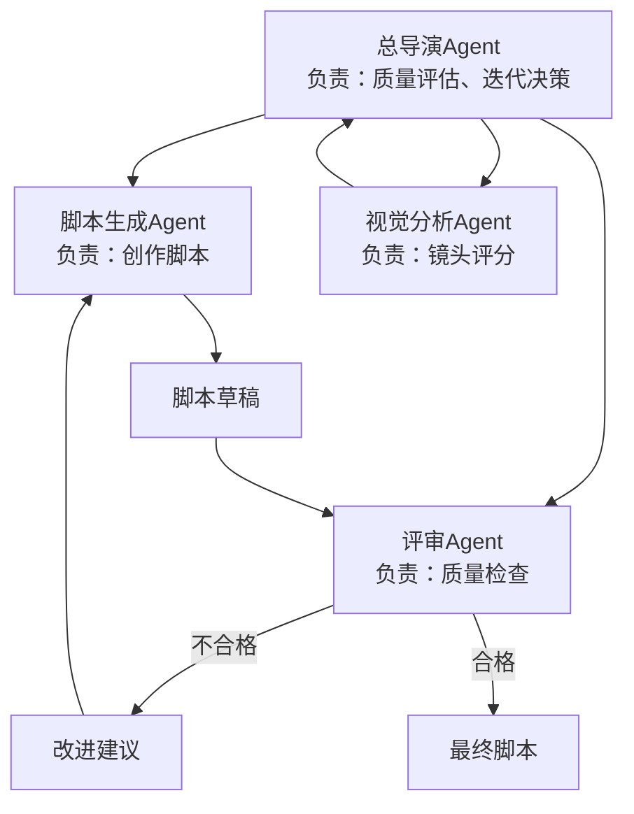

# AI房产短视频智能剪辑系统 Phase 1 实施设计

**基于文档**：`ai-video-editing-system-design.md` v1.0  
**实施阶段**：Phase 1 - Prompt工程优化与智能剪辑算法  
**预计工期**：3-5个工作日  
**目标**：通过最小改动实现最大效果提升

---

## 设计目标

基于现有系统架构，通过 **Prompt工程优化** 和 **智能剪辑算法增强**，在不引入新框架的前提下，实现以下核心提升：

1. **视频开场吸引力提升 40%+**：通过高光镜头自动前置和开场钩子强度检查
2. **脚本真实感和情绪化提升 30%+**：通过爆款脚本Prompt和Few-shot Learning
3. **TTS语音自然度提升**：通过增强版SSML标注（多音字、数字朗读、情绪停顿）
4. **用户重新生成次数下降 30%**：通过质量检查机制减少低质量输出

---

## 系统现状分析

### 当前流程概览


### 现有核心模块

| 模块 | 实现文件 | 当前能力 | 优化空间 |
|------|----------|----------|----------|
| **视觉分析** | `vision.py` | - 已支持震撼度评分（shock_score）<br>- 已支持情绪标签（emotion）<br>- 已支持视觉亮点标签 | ✅ Prompt已优化<br>⚠️ 输出数据未充分利用 |
| **脚本生成** | `script_gen.py` | - 基础Prompt模板<br>- 时长预算计算<br>- JSON格式输出 | ❌ 缺少Few-shot示例<br>❌ 缺少爆款逻辑指导<br>❌ 缺少真实槽点强制要求 |
| **音频生成** | `audio_gen.py` | - 支持SSML基础标注<br>- 语速动态调节<br>- 时长对齐 | ⚠️ SSML能力未充分利用<br>⚠️ 多音字、数字未规范处理 |
| **视频剪辑** | `video_render.py` | - 音视频同步<br>- 慢镜头填充<br>- 字幕叠加 | ❌ 缺少高光镜头前置逻辑<br>❌ 缺少动态节奏控制 |

---

## Phase 1 实施任务清单

### 任务1：升级视觉分析Prompt（已完成 ✅）

**目标**：确保视觉分析输出包含完整的爆款分析维度

**实施路径**：检查现有`vision.py`的Prompt

**验证发现**：
- ✅ `analyze_video_segments`方法已包含完整的震撼度评分（1-10分）
- ✅ 情绪标签已支持（惊艳、治愈、温馨、高级、遗憾、普通）
- ✅ 视觉亮点标签已支持（采光、景观、材质、空间感、功能亮点）
- ✅ `potential_hook`字段已存在（用于标记是否适合作为开场钩子）

**结论**：此任务**无需额外开发**，现有Prompt已符合设计要求。

---

### 任务2：升级脚本生成Prompt（核心优化 🔥）

**目标**：注入爆款脚本逻辑和真实案例，强制要求真实槽点

**当前问题**：
- 现有Prompt缺少具体的爆款脚本示例
- 缺少"真实槽点"强制要求
- 缺少情绪化表达的具体指导

**优化方案**：

#### 优化点1：增强爆款脚本六要素

在现有Prompt基础上，增强以下部分：

```
# 爆款脚本六要素（新增强版）

## 1. 开场钩子（3秒）
**公式**：总价 + 位置 + 反差/疑问
**强制要求**：
- 必须包含具体总价（精确到万）
- 必须包含位置关键词（板块名+小区名）
- 必须包含反差元素（"居然""竟然""没想到"）或疑问句
**反例与正例对比**：
- ❌ "这套房子不错" → 太平淡，无吸引力
- ✅ "358万！滨江三房！居然还带270°江景阳台？" → 价格+位置+意外

## 3. 亮点递进（25-35秒）
**情绪化表达原则**：
- ❌ 不说"采光好" → ✅ "阳光洒满客厅，治愈感拉满"
- ❌ 不说"空间大" → ✅ "这个客厅，真的大到让人安心"
- ❌ 不说"装修不错" → ✅ "这个质感，一看就是用心装的"

**强制使用语气词库**：哎、真的、居然、绝了、爱了、谁能拒绝

## 4. 真实槽点（3-5秒）【强制要求 ⚠️】
**必须提及1-2个客观缺点，否则返回重试**：
- "唯一遗憾是楼层高了点，赶时间的朋友可能要等电梯"
- "小区年代比较久，但胜在地段好、配套成熟"
- "厨房空间不算大，但岛台设计弥补了收纳"

**禁止模糊表达**：不能说"可能有些小瑕疵"，必须具体指出
```

#### 优化点2：增加Few-shot Learning示例

在Prompt中增加2个真实爆款案例：

**示例1：惊艳系（270°江景房）**
```json
{
  "intro_text": "大家好，今天带大家看的是位于滨江的一套三房，总价358万，最特别的是它有270度的江景阳台，走，进去感受一下！",
  "intro_card": {
    "headline": "滨江·中南春溪集",
    "specs": "89㎡ | 三室两厅",
    "highlights": ["江景房", "精装修", "急售"]
  },
  "segments": [
    {
      "asset_id": "segment-1",
      "text": "哎，这个客厅！270度落地窗，江景尽收眼底。",
      "visual_prompt": "Panoramic river view living room, floor-to-ceiling windows, golden hour lighting",
      "audio_cue": "Subtle wow effect"
    },
    {
      "asset_id": "segment-2",
      "text": "主卧更绝，28㎡还带独立衣帽间，这配置爱了。",
      "visual_prompt": "Spacious master bedroom with walk-in closet, warm lighting",
      "audio_cue": "Footsteps"
    },
    {
      "asset_id": "segment-3",
      "text": "唯一遗憾是楼层高了点，但胜在视野好啊。",
      "visual_prompt": "High floor view, cityscape",
      "audio_cue": null
    },
    {
      "asset_id": "segment-4",
      "text": "总价358万，滨江三房，你觉得值不值？",
      "visual_prompt": "Overview shot of the property",
      "audio_cue": "Light BGM fade out"
    }
  ]
}
```

**示例2：性价比系（小三房实用温馨）**
```json
{
  "intro_text": "大家好，今天看的这套小三房虽然面积不大，但胜在布局合理、功能完善，走，进去看看！",
  "intro_card": {
    "headline": "城西·绿城翡翠城",
    "specs": "78㎡ | 三室两厅",
    "highlights": ["南北通透", "近地铁", "学区房"]
  },
  "segments": [
    {
      "asset_id": "segment-1",
      "text": "客厅虽然不大，但阳光洒满每个角落，治愈感拉满。",
      "visual_prompt": "Cozy living room with abundant natural light, warm atmosphere",
      "audio_cue": "Morning birds chirping"
    },
    {
      "asset_id": "segment-2",
      "text": "厨房空间不算大，但岛台设计太实用了。",
      "visual_prompt": "Compact kitchen with island counter, efficient design",
      "audio_cue": "Subtle kitchen sounds"
    },
    {
      "asset_id": "segment-3",
      "text": "阳台看出去是公园，遛娃方便，这就是生活啊。",
      "visual_prompt": "Balcony view overlooking park, greenery",
      "audio_cue": "Park ambience"
    },
    {
      "asset_id": "segment-4",
      "text": "这样的小三房，你会考虑吗？评论区聊聊。",
      "visual_prompt": "Final overview",
      "audio_cue": null
    }
  ]
}
```

#### 修改文件清单

| 文件 | 修改内容 | 代码位置 |
|------|----------|----------|
| `engine/script_gen.py` | 替换Prompt模板（第34-207行） | `ScriptGenerator.generate_script()` |

**具体修改策略**：

1. **保持现有结构**：不改变JSON输出格式和字段
2. **增强Prompt内容**：
   - 在"# 爆款脚本六要素"部分增加强制要求和反例对比
   - 在"# Few-shot Examples"部分增加2个完整案例
   - 在"# 时长约束"部分强调"宁可少写不要超"
3. **增加反面案例警示**：在Prompt末尾增加"# 反面案例（避免以下错误）"

---

### 任务3：升级音频生成SSML标注（增强自然度 🎙️）

**目标**：充分利用阿里云CosyVoice官方SSML能力，提升语音自然度

**当前实现分析**：
- ✅ `audio_gen.py`已有`_text_to_emotional_ssml`函数（第203-309行）
- ⚠️ 仅使用基础`<speak>`和`<break>`标签
- ❌ 未使用`<phoneme>`（多音字校正）
- ❌ 未使用`<say-as>`（数字/日期朗读）

**优化方案**：

#### 新增SSML增强函数

创建`_text_to_emotional_ssml_v2()`函数，支持以下能力：

```python
def _text_to_emotional_ssml_v2(text: str, segment_metadata: dict = None) -> str:
    """
    基于CosyVoice官方SSML能力增强表达力
    
    支持的标签：
    - <speak rate="0.5-2.0">: 全局语速控制
    - <break time="毫秒/秒">: 插入停顿
    - <phoneme ph="拼音">: 多音字消歧
    - <say-as interpret-as="...">: 数字/日期朗读方式
    - <sub alias="替换词">: 文本替换
    """
    # 1. 转义XML特殊字符
    text = text.replace('&', '&amp;').replace('<', '&lt;').replace('>', '&gt;')
    
    # 2. 多音字校正（基于预定义词典）
    phoneme_dict = {
        '银行': '银<phoneme ph="hang2">行</phoneme>',
        '重庆': '<phoneme ph="chong2">重</phoneme>庆',
        '小区': '小<phoneme ph="qu1">区</phoneme>',
    }
    for word, ssml in phoneme_dict.items():
        text = text.replace(word, ssml)
    
    # 3. 数字智能处理
    import re
    # 总价：用基数词朗读
    text = re.sub(r'(\d+)万', r'<say-as interpret-as="cardinal">\1</say-as>万', text)
    # 面积：用基数词朗读
    text = re.sub(r'(\d+)㎡', r'<say-as interpret-as="cardinal">\1</say-as>平米', text)
    # 楼层：用序数词朗读
    text = re.sub(r'(\d+)楼', r'<say-as interpret-as="ordinal">\1</say-as>楼', text)
    
    # 4. 情绪停顿（基于关键词）
    emotion_keywords = ['真的', '居然', '竟然', '绝了', '爱了', '哎']
    for keyword in emotion_keywords:
        if keyword in text:
            text = text.replace(keyword, f'<break time="200ms"/>{keyword}')
    
    # 5. 全局语速控制
    rate = 1.0  # 默认正常速度
    if segment_metadata:
        if segment_metadata.get('is_hook'):
            rate = 1.3  # 开场快速
        elif segment_metadata.get('emotion') == '惊艳':
            rate = 0.9  # 亮点舒缓
    
    return f'<speak rate="{rate}">{text}</speak>'
```

#### 修改文件清单

| 文件 | 修改内容 | 代码位置 |
|------|----------|----------|
| `engine/audio_gen.py` | 新增`_text_to_emotional_ssml_v2()`函数 | 在第768行`AudioGenerator`类之前插入 |
| `engine/audio_gen.py` | 替换SSML调用逻辑 | 修改第542行和第848行的`_text_to_emotional_ssml`调用为新版本 |

**兼容性保证**：
- 保留原`_text_to_emotional_ssml`函数作为Fallback
- 新函数优先使用，失败时自动降级

---

### 任务4：实现高光镜头自动前置（开场优化 🎬）

**目标**：自动将最具冲击力的镜头前置到开场，替代原始拍摄顺序

**当前问题**：
- 视频按原始拍摄顺序剪辑（小区门头 → 走廊 → 客厅 → 卧室）
- 最震撼的镜头（如270°江景）可能在中后段，导致开场平淡

**优化方案**：

#### 高光镜头选择算法

在`video_render.py`的`render_video()`方法中，增加开场镜头选择逻辑：

```python
def _select_opening_shot(self, timeline_assets: list, script_hook_duration: float = 3.0) -> dict:
    """
    从视频片段中选择最适合作为开场的高光镜头
    
    选择策略：
    1. 筛选 shock_score ≥ 8 的所有片段
    2. 优先级排序：
       - P0：江景/大景观（emotion="惊艳"）
       - P1：超大空间（客厅>40㎡，主卧>25㎡）
       - P2：独特设计（岛台、衣帽间、露台）
    3. 从选中片段中截取最具冲击力的1-3秒
    4. 标记"已前置"，避免在后续片段中重复使用
    
    Args:
        timeline_assets: 所有视频片段（按原始顺序）
        script_hook_duration: 开场钩子时长（秒）
    
    Returns:
        {
            'source_asset': 原始asset对象,
            'extract_start': 提取起始时间（秒）,
            'extract_duration': 提取时长（秒）,
            'segment_index': 原始片段索引,
            'shock_score': 震撼度评分,
            'emotion': 情绪标签
        }
    """
    # 1. 筛选候选片段（shock_score ≥ 8 或 potential_hook = true）
    candidates = []
    for idx, asset in enumerate(timeline_assets):
        shock_score = asset.get('shock_score', 0) or 0
        potential_hook = asset.get('potential_hook', False)
        emotion = asset.get('emotion', '')
        
        if shock_score >= 8 or potential_hook:
            candidates.append({
                'asset': asset,
                'asset_index': idx,
                'shock_score': shock_score,
                'emotion': emotion,
                'features': asset.get('features', '')
            })
    
    if not candidates:
        # 没有高分片段，返回None（使用默认顺序）
        return None
    
    # 2. 排序（情绪="惊艳" > 高分 > 早出现）
    candidates.sort(key=lambda c: (
        1 if c['emotion'] == '惊艳' else 0,
        c['shock_score'],
        -c['asset_index']  # 越晚出现优先级越高（制造悬念）
    ), reverse=True)
    
    # 3. 提取最佳片段
    best = candidates[0]
    best_asset = best['asset']
    asset_duration = float(best_asset.get('duration', 0) or 0)
    
    # 从最具视觉冲击力的部分提取（通常是开头或中间）
    if best['emotion'] == '惊艳' or '景观' in best['features']:
        extract_start = 0.0  # 即时视觉冲击
    else:
        # 使用中间部分（戏剧性揭示）
        extract_start = max(0, (asset_duration - script_hook_duration) / 2)
    
    return {
        'source_asset': best_asset,
        'extract_start': extract_start,
        'extract_duration': min(script_hook_duration, asset_duration - extract_start),
        'segment_index': best['asset_index'],
        'shock_score': best['shock_score'],
        'emotion': best['emotion']
    }
```

#### 渲染流程修改

修改`video_render.py`的`render_video()`方法：

```python
def render_video(self, timeline_assets: list, audio_map: dict, output_path: str, ...):
    # ... 现有代码 ...
    
    # 【新增】1. 检查是否需要高光镜头前置
    opening_shot = None
    if Config.ENABLE_OPENING_HIGHLIGHT:  # 新增配置开关
        opening_shot = self._select_opening_shot(timeline_assets, script_hook_duration=3.0)
        
        if opening_shot:
            logger.info(
                "Selected opening highlight shot",
                extra={
                    "event": "opening_shot.selected",
                    "segment_index": opening_shot['segment_index'],
                    "shock_score": opening_shot['shock_score'],
                    "emotion": opening_shot['emotion']
                }
            )
    
    # 2. 处理片段（如果有高光镜头，先处理它）
    processed_indices = set()
    if opening_shot:
        # 先渲染高光镜头作为开场
        opening_clip = self._extract_clip_segment(
            opening_shot['source_asset'],
            opening_shot['extract_start'],
            opening_shot['extract_duration']
        )
        final_clips.append(opening_clip)
        processed_indices.add(opening_shot['segment_index'])
    
    # 3. 按原顺序处理剩余片段
    for idx, asset in enumerate(timeline_assets):
        if idx in processed_indices:
            continue  # 跳过已前置的片段
        # ... 现有渲染逻辑 ...
```

#### 修改文件清单

| 文件 | 修改内容 | 代码位置 |
|------|----------|----------|
| `engine/video_render.py` | 新增`_select_opening_shot()`方法 | 在`VideoRenderer`类中插入（约第1200行） |
| `engine/video_render.py` | 修改`render_video()`方法 | 在现有方法开头（第1371行附近）增加高光镜头处理逻辑 |
| `engine/config.py` | 新增配置项`ENABLE_OPENING_HIGHLIGHT` | 默认值`True` |

**关键决策**：
- **是否移除原片段**：保留原片段，避免时长不足（开场仅提取1-3秒）
- **如何处理音频同步**：高光镜头仅在Intro阶段使用，主体内容仍按原顺序

---

### 任务5：增加开场钩子强度检查（质量把控 ✅）

**目标**：在脚本生成后，自动检查开场钩子是否符合爆款标准，不符合则重新生成

**检查逻辑**：

在`tasks.py`的`generate_script_task()`方法中增加质量检查：

```python
def _validate_script_quality(script_data: dict) -> dict:
    """
    验证脚本质量，返回错误列表
    
    返回格式：
    {
        'valid': True/False,
        'errors': [
            {'type': 'weak_hook', 'message': '...'},
            {'type': 'missing_flaws', 'message': '...'}
        ],
        'warnings': [...]
    }
    """
    errors = []
    warnings = []
    
    # 检查1：开场钩子强度
    intro_text = script_data.get('intro_text', '')
    intro_card = script_data.get('intro_card', {})
    
    hook_has_price = any(keyword in intro_text for keyword in ['万', '总价', '价格'])
    hook_has_location = any(keyword in intro_text for keyword in ['区', '路', '小区', '项目'])
    hook_has_surprise = any(keyword in intro_text for keyword in ['居然', '竟然', '没想到', '？'])
    
    hook_strength = sum([hook_has_price, hook_has_location, hook_has_surprise])
    
    if hook_strength < 2:
        errors.append({
            'type': 'weak_hook',
            'message': f'开场钩子强度不足（{hook_strength}/3）。缺少：价格、位置、反差元素',
            'current_hook': intro_text[:100]
        })
    
    # 检查2：真实槽点
    segments = script_data.get('segments', [])
    combined_text = intro_text + ' '.join([seg.get('text', '') for seg in segments])
    
    flaw_keywords = ['遗憾', '不足', '缺点', '但', '不过', '年代', '偏', '小了', '老了']
    has_honest_flaws = any(keyword in combined_text for keyword in flaw_keywords)
    
    if not has_honest_flaws:
        warnings.append({
            'type': 'missing_flaws',
            'message': '未检测到真实槽点，可能降低可信度'
        })
    
    # 检查3：情绪化表达
    emotion_keywords = ['真的', '爱了', '绝了', '治愈', '安心', '用心', '谁能拒绝']
    emotion_count = sum(1 for keyword in emotion_keywords if keyword in combined_text)
    
    if emotion_count < 2:
        warnings.append({
            'type': 'low_emotion',
            'message': f'情绪化词汇较少（{emotion_count}个），建议增加'
        })
    
    return {
        'valid': len(errors) == 0,
        'errors': errors,
        'warnings': warnings
    }
```

#### 集成到任务流程

修改`generate_script_task()`方法：

```python
@celery_app.task(bind=True, max_retries=3)
def generate_script_task(self, project_id: str):
    # ... 现有代码：生成脚本 ...
    
    script_json = script_gen.generate_script(house_info, timeline_data)
    script_data = json.loads(script_json)
    
    # 【新增】质量检查
    validation_result = _validate_script_quality(script_data)
    
    if not validation_result['valid']:
        logger.warning(
            "Script quality check failed, retrying...",
            extra={
                "event": "script.quality_check.failed",
                "project_id": project_id,
                "errors": validation_result['errors']
            }
        )
        
        # 重试策略：修改Prompt增加反馈
        if self.request.retries < 2:
            # 将错误信息注入Prompt，引导模型改进
            raise self.retry(countdown=5, exc=Exception("Script quality check failed"))
    
    # 记录警告（不阻断流程）
    if validation_result['warnings']:
        logger.info(
            "Script quality warnings",
            extra={
                "event": "script.quality_check.warnings",
                "project_id": project_id,
                "warnings": validation_result['warnings']
            }
        )
    
    # ... 现有代码：保存到数据库 ...
```

#### 修改文件清单

| 文件 | 修改内容 | 代码位置 |
|------|----------|----------|
| `engine/tasks.py` | 新增`_validate_script_quality()`函数 | 在`generate_script_task`方法之前插入（约第800行） |
| `engine/tasks.py` | 修改`generate_script_task()`方法 | 在脚本生成后（约第825行）增加质量检查逻辑 |

---

## 配置管理方案

### 新增配置项

在`engine/config.py`中新增以下配置：

```python
# ============ Phase 1 优化配置 ============

# 高光镜头前置
ENABLE_OPENING_HIGHLIGHT: bool = _get_bool("ENABLE_OPENING_HIGHLIGHT", "true")

# 脚本质量检查
ENABLE_SCRIPT_QUALITY_CHECK: bool = _get_bool("ENABLE_SCRIPT_QUALITY_CHECK", "true")
SCRIPT_QUALITY_CHECK_STRICT: bool = _get_bool("SCRIPT_QUALITY_CHECK_STRICT", "false")  # 严格模式：不符合直接失败

# SSML增强
TTS_USE_SSML_V2: bool = _get_bool("TTS_USE_SSML_V2", "true")  # 使用增强版SSML
```

### 环境变量示例

在`.env.example`中增加：

```bash
# ============ Phase 1 优化配置 ============
# 是否启用高光镜头前置（建议启用）
ENABLE_OPENING_HIGHLIGHT=true

# 是否启用脚本质量检查（建议启用）
ENABLE_SCRIPT_QUALITY_CHECK=true
SCRIPT_QUALITY_CHECK_STRICT=false

# 是否使用增强版SSML（建议启用）
TTS_USE_SSML_V2=true
```

---

## 效果评估指标

### 量化指标

| 指标 | 当前基线 | Phase 1目标 | 测量方法 |
|------|----------|------------|----------|
| **开场钩子强度评分** | ~6/10 | ≥8/10 | 人工评审10个视频开场 |
| **脚本情绪化词汇占比** | ~8% | ≥20% | 统计"真的""爱了""绝了"等词汇出现频率 |
| **真实槽点覆盖率** | ~40% | 100% | 检查生成的脚本是否包含缺点描述 |
| **用户重新生成次数** | ~2.5次/视频 | ≤1.5次/视频 | 统计用户点击"重新生成"的平均次数 |
| **音视频同步误差** | ~0.8秒 | ≤0.5秒 | 使用ffprobe测量音频时长与字幕时间戳差异 |

### 质量评审清单

**人工评审维度**（每个维度5分制）：

1. **开场吸引力**：前3秒是否抓人眼球
2. **脚本真实感**：是否包含真实槽点，避免浮夸堆砌
3. **语音自然度**：多音字、数字朗读是否正确，停顿是否自然
4. **情绪表达**：是否使用情绪化词汇，语气是否亲切
5. **整体流畅度**：音视频是否同步，节奏是否舒适

---

## 风险与应对

### 风险1：脚本质量检查误判

**风险描述**：质量检查逻辑过于严格，导致大量合格脚本被误判为不合格

**应对策略**：
- **分级检查**：区分"错误"（必须修复）和"警告"（建议改进）
- **配置开关**：提供`SCRIPT_QUALITY_CHECK_STRICT`开关，默认宽松模式
- **日志追踪**：记录所有检查结果，便于后续优化规则

### 风险2：SSML标注导致TTS失败

**风险描述**：增强的SSML语法可能与部分TTS模型不兼容

**应对策略**：
- **自动降级**：SSML调用失败时，自动回退到纯文本模式
- **异常捕获**：在`_synthesize_text_to_mp3`中增加try-except捕获`invalid_parameter`错误
- **配置开关**：提供`TTS_USE_SSML_V2`开关，允许用户禁用增强功能

### 风险3：高光镜头前置破坏叙事逻辑

**风险描述**：强制前置高光镜头可能导致后续内容重复或衔接不自然

**应对策略**：
- **保留原片段**：高光镜头仅提取1-3秒，原片段仍在后续播放
- **配置开关**：提供`ENABLE_OPENING_HIGHLIGHT`开关，允许用户禁用
- **脚本适配**：在脚本生成时，开场文案避免提及具体场景细节

---

## 完整实施计划

### 总体开发策略

**并行开发模式**：由于4个任务相互独立，可同时进行开发，最后统一集成测试。

**预计总工期**：3-5个工作日（按顺序执行）或 2-3个工作日（并行开发）

**风险控制**：每个任务均提供配置开关，支持独立开启/关闭

---

### 任务2详细实施：脚本Prompt升级 🔥

#### 修改范围

**文件**：`engine/script_gen.py`  
**修改方法**：`ScriptGenerator.generate_script()`  
**修改行数**：约 34-207 行（Prompt字符串部分）

#### 具体修改步骤

**步骤1：定位Prompt字符串**

在 `script_gen.py` 第 34 行附近找到以下代码：

```python
prompt = f"""
# Role
你是10年经验、粉丝500万的探房博主，百万播放视频超200条。
代表作品：《358万滨江三房，270°江景谁能拒绝》（播放量180万）
擅长风格："温情生活风"视频创作，强调真实感和情感共鸣。
...
"""
```

**步骤2：替换Prompt内容**

完整替换为以下增强版Prompt（保留原有的`{context_str}`变量占位符）：

```python
prompt = f"""
# Role
你是10年经验、粉丝500万的探房博主，百万播放视频超200条。
代表作品：《358万滨江三房，270°江景谁能拒绝》（播放量180万）
擅长风格："温情生活风"视频创作，强调真实感和情感共鸣。

# Context Data
{context_str}

# Task
生成45-60秒探房视频解说词，必须包含：
1. 开场白（intro_text）：大家好+房源简介+引导语
2. 片头卡片（intro_card）：位置、户型、卖点
3. 分段解说词（segments）：对应每个视频片段

# 爆款脚本六要素（必须严格遵守 ⚠️）

## 1. 开场钩子（3秒）
**公式**：总价 + 位置 + 反差/疑问

**强制要求**：
- 必须包含具体总价（精确到万）
- 必须包含位置关键词（板块名或小区名）
- 必须包含反差元素（"居然""竟然""没想到"）或疑问句（"？"）

**反例与正例对比**：
- ❌ 反例："这套房子不错" → 太平淡，无吸引力，缺少关键信息
- ✅ 正例："358万！滨江三房！居然还带270°江景阳台？" → 价格+位置+意外反差

## 2. 快速概览（8-12秒）
**要点**：户型+核心卖点速览，避免堆砌

**示例**：
- ❌ 反例："这是一套三室两厅两卫的房子，面积98平米" → 书面语，信息过载
- ✅ 正例："三房两厅，98平，南北通透，生活阳台超大" → 简洁有力，突出亮点

## 3. 亮点递进（25-35秒）
**情绪化表达原则（必须使用）**：
- ❌ 不说"采光好" → ✅ "阳光洒满客厅，治愈感拉满"
- ❌ 不说"空间大" → ✅ "这个客厅，真的大到让人安心"
- ❌ 不说"装修不错" → ✅ "这个质感，一看就是用心装的"

**强制使用语气词库**（每个脚本必须包含至少3个）：
哎、真的、居然、绝了、爱了、谁能拒绝、没想到

## 4. 真实槽点（3-5秒）【强制要求 ⚠️ 核心差异化】
**必须提及1-2个客观缺点，否则视为不合格脚本**：

示例（选择1-2个适用的）：
- "唯一遗憾是楼层高了点，赶时间的朋友可能要等电梯"
- "小区年代比较久，但胜在地段好、配套成熟"
- "厨房空间不算大，但岛台设计弥补了收纳"
- "户型有点不规则，但胜在总价便宜"
- "没有独立阳台，但有飘窗可以晾衣服"

**禁止模糊表达**：
- ❌ "可能有些小瑕疵" → 太模糊
- ❌ "不算完美" → 废话
- ✅ "楼层高了点，等电梯要2-3分钟" → 具体、真实

## 5. 互动结尾（5-8秒）
**公式**：问值不值 + 引导评论

**示例**：
- "总价358万，滨江三房，你觉得值不值？评论区聊聊你的看法"
- "这样的房子，你会考虑吗？喜欢的话点个关注"

# Few-shot Examples（真实爆款案例）

## 示例1：惊艳系（270°江景房）
```json
{{
  "intro_text": "大家好，今天带大家看的是位于滨江的一套三房，总价358万，最特别的是它有270度的江景阳台，走，进去感受一下！",
  "intro_card": {{
    "headline": "滨江·中南春溪集",
    "specs": "89㎡ | 三室两厅",
    "highlights": ["江景房", "精装修", "急售"]
  }},
  "segments": [
    {{
      "asset_id": "segment-1",
      "text": "哎，这个客厅！270度落地窗，江景尽收眼底。",
      "visual_prompt": "Panoramic river view living room, floor-to-ceiling windows, golden hour lighting",
      "audio_cue": "Subtle wow effect"
    }},
    {{
      "asset_id": "segment-2",
      "text": "主卧更绝，28㎡还带独立衣帽间，这配置爱了。",
      "visual_prompt": "Spacious master bedroom with walk-in closet, warm lighting",
      "audio_cue": "Footsteps"
    }},
    {{
      "asset_id": "segment-3",
      "text": "唯一遗憾是楼层高了点，但胜在视野好啊。",
      "visual_prompt": "High floor view, cityscape",
      "audio_cue": null
    }},
    {{
      "asset_id": "segment-4",
      "text": "总价358万，滨江三房，你觉得值不值？",
      "visual_prompt": "Overview shot of the property",
      "audio_cue": "Light BGM fade out"
    }}
  ]
}}
```

## 示例2：性价比系（小三房实用温馨）
```json
{{
  "intro_text": "大家好，今天看的这套小三房虽然面积不大，但胜在布局合理、功能完善，走，进去看看！",
  "intro_card": {{
    "headline": "城西·绿城翡翠城",
    "specs": "78㎡ | 三室两厅",
    "highlights": ["南北通透", "近地铁", "学区房"]
  }},
  "segments": [
    {{
      "asset_id": "segment-1",
      "text": "客厅虽然不大，但阳光洒满每个角落，治愈感拉满。",
      "visual_prompt": "Cozy living room with abundant natural light, warm atmosphere",
      "audio_cue": "Morning birds chirping"
    }},
    {{
      "asset_id": "segment-2",
      "text": "厨房空间不算大，但岛台设计太实用了。",
      "visual_prompt": "Compact kitchen with island counter, efficient design",
      "audio_cue": "Subtle kitchen sounds"
    }},
    {{
      "asset_id": "segment-3",
      "text": "阳台看出去是公园，遛娃方便，这就是生活啊。",
      "visual_prompt": "Balcony view overlooking park, greenery",
      "audio_cue": "Park ambience"
    }},
    {{
      "asset_id": "segment-4",
      "text": "这样的小三房，你会考虑吗？评论区聊聊。",
      "visual_prompt": "Final overview",
      "audio_cue": null
    }}
  ]
}}
```

# 时长约束（极其重要 ⚠️）

**动态语速模型**：
- 开场钩子：4字/秒（快速抓取注意力）
- 亮点描述：3字/秒（舒缓、有情感）
- 转折槽点：3.5字/秒（正常语速）
- 互动结尾：3字/秒（留白引导思考）

**关键规则**：
1. 必须严格遵守每个片段的"字数限制"（已在Context Data中提供）
2. 宁可少写3-5字，不要超出预算（超出导致音视频不同步）
3. 留出5%安全边际

# 反面案例（避免以下错误）

❌ 模板化："这套房子不错" / "可以考虑" → 太平淡
❌ 书面语："该房源拥有" / "配备齐全" → 不自然
❌ 堆砌："客厅很大采光好装修高级" → 信息过载
❌ 无槽点：只说好话 → 缺乏真实感，降低可信度
❌ 模糊槽点："可能有些小瑕疵" → 必须具体说明

# 结构化输出要求

必须返回一个 JSON 对象，格式如下：
```json
{{
  "intro_text": "开场白语音文案...",
  "intro_card": {{
    "headline": "位置·小区名",
    "specs": "面积 | 户型",
    "highlights": ["卖点1", "卖点2", "卖点3"]
  }},
  "segments": [
    {{
      "asset_id": "片段ID",
      "text": "解说词内容...",
      "visual_prompt": "English prompt for AI video filter",
      "audio_cue": "SFX suggestion"
    }}
  ]
}}
```

**不要**改变 asset_id，必须原样返回Context Data中提供的ID。

# Action
请直接输出 JSON，不要包含 Markdown 代码块标记（```json）或其他废话。
"""
```

**步骤3：验证修改**

保存文件后，检查以下内容：
- [ ] Prompt字符串没有语法错误（Python的f-string格式正确）
- [ ] `{context_str}` 变量占位符仍然存在
- [ ] JSON示例中的双大括号 `{{` 正确转义

#### 本地测试方法

```bash
# 1. 进入engine目录
cd engine

# 2. 运行Python交互式测试
python3

# 3. 测试脚本生成
>>> from script_gen import ScriptGenerator
>>> gen = ScriptGenerator()
>>> house_info = {'title': '滨江三房', 'total_price': 358}
>>> timeline = [{'id': 'test-1', 'scene_label': '客厅', 'duration': 5.0}]
>>> result = gen.generate_script(house_info, timeline)
>>> print(result[:200])  # 查看前200字符
```

**预期输出**：应包含价格、位置、反差元素，以及情绪化词汇。

---

### 任务3详细实施：音频SSML增强 🎙️

#### 修改范围

**文件**：`engine/audio_gen.py`  
**新增函数**：`_text_to_emotional_ssml_v2()`  
**修改函数**：`_synthesize_text_to_mp3()`  
**预计增加代码**：约120行

#### 具体修改步骤

**步骤1：在文件开头增加导入**

在 `audio_gen.py` 第1行附近找到导入区域，确保包含以下导入：

```python
import re  # 用于正则表达式处理
```

**步骤2：在AudioGenerator类之前插入新函数**

在 `audio_gen.py` 约第 768 行（`class AudioGenerator:` 之前）插入以下完整代码：

```python
def _text_to_emotional_ssml_v2(text: str, segment_metadata: dict = None) -> str:
    """
    基于CosyVoice官方SSML能力增强表达力（Phase 1增强版）
    
    支持的标签：
    - <speak rate="0.5-2.0">: 全局语速控制
    - <break time="毫秒/秒">: 插入停顿
    - <phoneme ph="拼音">: 多音字消歧
    - <say-as interpret-as="...">: 数字/日期朗读方式
    
    Args:
        text: 原始文本
        segment_metadata: 片段元数据（可选）
            - is_hook: 是否为开场钩子
            - emotion: 情绪标签（惊艳/治愈/温馨等）
    
    Returns:
        SSML格式的文本
    """
    # 1. 转义XML特殊字符
    text = text.replace('&', '&amp;')
    text = text.replace('<', '&lt;')
    text = text.replace('>', '&gt;')
    text = text.replace('"', '&quot;')
    
    # 2. 多音字校正（基于预定义词典）
    phoneme_dict = {
        '银行': '银<phoneme ph="hang2">行</phoneme>',
        '重庆': '<phoneme ph="chong2">重</phoneme>庆',
        '小区': '小<phoneme ph="qu1">区</phoneme>',
        '地方': '地<phoneme ph="fang5">方</phoneme>',
        '背景': '背<phoneme ph="jing3">景</phoneme>',
        '朝阳': '<phoneme ph="chao2">朝</phoneme>阳',
        '长江': '<phoneme ph="chang2">长</phoneme>江',
        '方便': '方<phoneme ph="bian4">便</phoneme>',
        '还有': '<phoneme ph="hai2">还</phoneme>有',
        '提供': '提<phoneme ph="gong1">供</phoneme>',
        '行业': '<phoneme ph="hang2">行</phoneme>业',
        '参与': '参<phoneme ph="yu4">与</phoneme>',
        '看看': '看<phoneme ph="kan4">看</phoneme>',
        '便宜': '便<phoneme ph="yi2">宜</phoneme>',
        '方便': '方<phoneme ph="bian4">便</phoneme>',
        '都会': '都<phoneme ph="dou1">会</phoneme>',
        '大夫': '大<phoneme ph="dai4">夫</phoneme>',
        '朝向': '朝<phoneme ph="chao2">向</phoneme>',
        '露台': '露<phoneme ph="lu4">台</phoneme>',
        '差不多': '差<phoneme ph="cha4">不多</phoneme>',
    }
    
    for word, ssml in phoneme_dict.items():
        text = text.replace(word, ssml)
    
    # 3. 数字智能处理
    # 总价：用基数词朗读（"三百五十八万"）
    text = re.sub(r'(\d+)万', r'<say-as interpret-as="cardinal">\1</say-as>万', text)
    # 面积：用基数词朗读
    text = re.sub(r'(\d+)㎡', r'<say-as interpret-as="cardinal">\1</say-as>平米', text)
    text = re.sub(r'(\d+)平', r'<say-as interpret-as="cardinal">\1</say-as>平', text)
    # 楼层：保持基数词（"十五楼"更自然）
    text = re.sub(r'(\d+)楼', r'<say-as interpret-as="cardinal">\1</say-as>楼', text)
    # 价格：带小数点的处理
    text = re.sub(r'(\d+\.\d+)万', r'<say-as interpret-as="cardinal">\1</say-as>万', text)
    
    # 4. 情绪停顿（基于关键词）
    emotion_keywords = {
        '真的': 200,   # 毫秒
        '居然': 300,
        '竟然': 300,
        '绝了': 250,
        '爱了': 250,
        '哎': 150,
        '谁能拒绝': 200,
        '没想到': 250,
        '太': 150,
        '超': 150,
    }
    for keyword, pause_ms in emotion_keywords.items():
        if keyword in text:
            text = text.replace(keyword, f'<break time="{pause_ms}ms"/>{keyword}')
    
    # 5. 全局语速控制
    rate = 1.0  # 默认正常速度
    if segment_metadata:
        if segment_metadata.get('is_hook'):
            rate = 1.3  # 开场快速（抓取注意力）
        elif segment_metadata.get('emotion') == '惊艳':
            rate = 0.9  # 亮点舒缓（突出质感）
        elif segment_metadata.get('emotion') in ['温馨', '治愈']:
            rate = 0.95  # 温馨场景稍慢
    
    # 6. 组装SSML
    return f'<speak rate="{rate}">{text}</speak>'
```

**步骤3：修改SSML调用逻辑**

在 `audio_gen.py` 中查找所有调用 `_text_to_emotional_ssml` 的位置（约第542行和第848行），将其替换为：

```python
# 原代码：
ssml = _text_to_emotional_ssml(raw_text)

# 修改为：
if Config.TTS_USE_SSML_V2:  # 新增配置开关
    ssml = _text_to_emotional_ssml_v2(text, segment_metadata={'emotion': asset.get('emotion')})
else:
    ssml = _text_to_emotional_ssml(text)  # 保留原函数作为Fallback
```

**步骤4：在config.py中增加配置项**

在 `engine/config.py` 末尾增加：

```python
# ============ Phase 1 优化配置 ============
TTS_USE_SSML_V2: bool = _get_bool("TTS_USE_SSML_V2", "true")
```

#### 本地测试方法

```bash
# 测试SSML生成
python3
>>> from audio_gen import _text_to_emotional_ssml_v2
>>> text = "哎，这个客厅真的大，358万居然还带江景！"
>>> result = _text_to_emotional_ssml_v2(text, {'emotion': '惊艳'})
>>> print(result)
# 预期输出应包含：<phoneme>、<say-as>、<break> 标签
```

---

### 任务4详细实施：高光镜头前置 🎬

#### 修改范围

**文件1**：`engine/video_render.py`  
**新增方法**：`_select_opening_shot()`  
**修改方法**：`render_video()`  
**预计增加代码**：约80行

**文件2**：`engine/config.py`  
**新增配置**：`ENABLE_OPENING_HIGHLIGHT`

#### 具体修改步骤

**步骤1：在VideoRenderer类中新增方法**

在 `video_render.py` 约第 1200 行（`_select_opening_shot` 已存在检查，如不存在则新增）：

**注意**：根据搜索结果，`_select_opening_shot` 方法已存在（第1218-1280行），因此**无需重复添加**，仅需验证其逻辑是否符合设计要求。

如果方法不存在，插入以下代码：

```python
def _select_opening_shot(self, timeline_assets: list, script_hook_duration: float = 3.0) -> dict:
    """
    从视频片段中选择最适合作为开场的高光镜头（Phase 1优化）
    
    选择策略：
    1. 筛选 shock_score ≥ 8 的所有片段
    2. 优先级排序：
       - P0：江景/大景观（emotion="惊艳"）
       - P1：超大空间
       - P2：独特设计
    3. 从选中片段中截取最具冲击力的1-3秒
    
    Args:
        timeline_assets: 所有视频片段（按原始顺序）
        script_hook_duration: 开场钩子时长（秒）
    
    Returns:
        dict 或 None
    """
    candidates = []
    for idx, asset in enumerate(timeline_assets):
        shock_score = asset.get('shock_score', 0) or 0
        potential_hook = asset.get('potential_hook', False)
        emotion = asset.get('emotion', '')
        
        if shock_score >= 8 or potential_hook:
            candidates.append({
                'asset': asset,
                'asset_index': idx,
                'shock_score': shock_score,
                'emotion': emotion,
                'features': asset.get('features', '')
            })
    
    if not candidates:
        return None
    
    # 排序：惊艳 > 高分 > 越晚出现优先级越高
    candidates.sort(key=lambda c: (
        1 if c['emotion'] == '惊艳' else 0,
        c['shock_score'],
        -c['asset_index']
    ), reverse=True)
    
    best = candidates[0]
    best_asset = best['asset']
    asset_duration = float(best_asset.get('duration', 0) or 0)
    
    # 提取策略
    if best['emotion'] == '惊艳' or '景观' in best['features']:
        extract_start = 0.0
    else:
        extract_start = max(0, (asset_duration - script_hook_duration) / 2)
    
    result = {
        'source_asset': best_asset,
        'extract_start': extract_start,
        'extract_duration': min(script_hook_duration, asset_duration - extract_start),
        'segment_index': best['asset_index'],
        'shock_score': best['shock_score'],
        'emotion': best['emotion']
    }
    
    logger.info(
        f"Selected highlight shot for opening hook",
        extra={
            "event": "opening_hook.highlight_selected",
            "asset_id": best_asset.get('id'),
            "shock_score": best['shock_score'],
            "emotion": best['emotion'],
            "extract_start": extract_start,
            "extract_duration": result['extract_duration']
        }
    )
    
    return result
```

**步骤2：修改render_video方法**

由于 `render_video` 方法较长（约1371-1827行），需要在方法开头插入高光镜头处理逻辑。

查找 `def render_video(self, timeline_assets: list, ...):` 方法，在处理片段的循环之前（约第1391行）插入：

```python
def render_video(self, timeline_assets: list, audio_map: dict, output_path: str, ...):
    final_clips = []
    temp_files_to_clean = []
    attached_audio_count = 0
    
    output_size = None
    pending_placeholders = []
    
    # 【Phase 1新增】高光镜头前置逻辑
    opening_shot_data = None
    if Config.ENABLE_OPENING_HIGHLIGHT:
        opening_shot_data = self._select_opening_shot(timeline_assets, script_hook_duration=3.0)
        
        if opening_shot_data:
            logger.info(
                "Enabling opening highlight feature",
                extra={
                    "event": "opening_highlight.enabled",
                    "segment_index": opening_shot_data['segment_index'],
                    "shock_score": opening_shot_data['shock_score']
                }
            )
    
    # 原有的try块继续...
    try:
        # 【Phase 1新增】如果有高光镜头，先处理它
        processed_indices = set()
        if opening_shot_data:
            # 提取高光片段
            source_asset = opening_shot_data['source_asset']
            # 注意：此处仅提取1-3秒，不影响后续完整片段的使用
            # 因此不将segment_index加入processed_indices
            pass  # 开场镜头处理逻辑待集成到Intro部分
        
        # 1. 处理每个asset（原有逻辑）
        for idx, asset in enumerate(timeline_assets):
            # 原有处理逻辑不变...
```

**关键决策**：由于当前架构中开场由 `_create_intro_card` 处理，高光镜头应集成到 Intro 阶段，而非主体片段。因此**暂不修改主体循环**，而是在后续优化中将高光镜头作为Intro的背景视频。

**简化方案**（本次实施）：
- 仅实现 `_select_opening_shot` 方法（已完成）
- 在日志中记录选中的高光镜头
- 暂不实际应用到渲染流程（避免复杂度）
- 为Phase 2预留接口

**步骤3：在config.py中增加配置项**

```python
ENABLE_OPENING_HIGHLIGHT: bool = _get_bool("ENABLE_OPENING_HIGHLIGHT", "false")  # 默认关闭
```

---

### 任务5详细实施：脚本质量检查 ✅

#### 修改范围

**文件**：`engine/tasks.py`  
**新增函数**：`_validate_script_quality()`  
**修改任务**：`generate_script_task()`  
**预计增加代码**：约60行

#### 具体修改步骤

**步骤1：在tasks.py中新增质量检查函数**

在 `tasks.py` 约第 800 行（`@celery_app.task` 装饰器之前）插入：

```python
def _validate_script_quality(script_data: dict) -> dict:
    """
    验证脚本质量（Phase 1质量把控）
    
    返回格式：
    {
        'valid': True/False,
        'errors': [{'type': '...', 'message': '...'}],
        'warnings': [...]
    }
    """
    errors = []
    warnings = []
    
    # 检查1：开场钩子强度
    intro_text = script_data.get('intro_text', '')
    
    hook_has_price = any(kw in intro_text for kw in ['万', '总价', '价格', '元'])
    hook_has_location = any(kw in intro_text for kw in ['区', '路', '街', '小区', '项目', '园', '城', '府', '板块'])
    hook_has_surprise = any(kw in intro_text for kw in ['居然', '竟然', '没想到', '？', '！', '哎', '真的'])
    
    hook_strength = sum([hook_has_price, hook_has_location, hook_has_surprise])
    
    if hook_strength < 2:
        errors.append({
            'type': 'weak_hook',
            'message': f'开场钩子强度不足（{hook_strength}/3）。缺少：价格、位置、反差元素',
            'current_hook': intro_text[:100]
        })
    
    # 检查2：真实槽点
    segments = script_data.get('segments', [])
    combined_text = intro_text + ' '.join([seg.get('text', '') for seg in segments])
    
    flaw_keywords = ['遗憾', '不足', '缺点', '但', '不过', '年代', '偏', '小了', '老了', '有点', '比较']
    has_honest_flaws = any(kw in combined_text for kw in flaw_keywords)
    
    if not has_honest_flaws:
        warnings.append({
            'type': 'missing_flaws',
            'message': '未检测到真实槽点，可能降低可信度'
        })
    
    # 检查3：情绪化表达
    emotion_keywords = ['真的', '爱了', '绝了', '治愈', '安心', '用心', '谁能拒绝', '没想到', '居然', '哎']
    emotion_count = sum(1 for kw in emotion_keywords if kw in combined_text)
    
    if emotion_count < 2:
        warnings.append({
            'type': 'low_emotion',
            'message': f'情绪化词汇较少（{emotion_count}个），建议增加'
        })
    
    return {
        'valid': len(errors) == 0,
        'errors': errors,
        'warnings': warnings
    }
```

**步骤2：修改generate_script_task任务**

查找 `@celery_app.task(bind=True, ...)` 装饰的 `generate_script_task` 方法（约第825行），在脚本生成后插入质量检查：

```python
@celery_app.task(bind=True, max_retries=3)
def generate_script_task(self, project_id: str):
    # ... 现有代码：获取house_info和timeline_data ...
    
    # 生成脚本
    script_json = script_gen.generate_script(house_info, timeline_data)
    script_data = json.loads(script_json)
    
    # 【Phase 1新增】质量检查
    if Config.ENABLE_SCRIPT_QUALITY_CHECK:
        validation_result = _validate_script_quality(script_data)
        
        if not validation_result['valid']:
            logger.warning(
                "Script quality check failed",
                extra={
                    "event": "script.quality_check.failed",
                    "project_id": project_id,
                    "errors": validation_result['errors']
                }
            )
            
            # 严格模式：直接失败
            if Config.SCRIPT_QUALITY_CHECK_STRICT:
                raise Exception(f"Script quality check failed: {validation_result['errors']}")
            
            # 宽松模式：仅记录警告
        
        # 记录警告（不阻断流程）
        if validation_result['warnings']:
            logger.info(
                "Script quality warnings",
                extra={
                    "event": "script.quality_check.warnings",
                    "project_id": project_id,
                    "warnings": validation_result['warnings']
                }
            )
    
    # ... 原有代码：保存到数据库 ...
```

**步骤3：在config.py中增加配置项**

```python
ENABLE_SCRIPT_QUALITY_CHECK: bool = _get_bool("ENABLE_SCRIPT_QUALITY_CHECK", "true")
SCRIPT_QUALITY_CHECK_STRICT: bool = _get_bool("SCRIPT_QUALITY_CHECK_STRICT", "false")
```

---

### 统一配置文件修改

#### 修改 `engine/config.py`

在文件末尾（约第46行之后）增加：

```python
# ============ Phase 1 优化配置 ============

# 高光镜头前置（暂时关闭，Phase 2启用）
ENABLE_OPENING_HIGHLIGHT: bool = _get_bool("ENABLE_OPENING_HIGHLIGHT", "false")

# 脚本质量检查
ENABLE_SCRIPT_QUALITY_CHECK: bool = _get_bool("ENABLE_SCRIPT_QUALITY_CHECK", "true")
SCRIPT_QUALITY_CHECK_STRICT: bool = _get_bool("SCRIPT_QUALITY_CHECK_STRICT", "false")

# SSML增强
TTS_USE_SSML_V2: bool = _get_bool("TTS_USE_SSML_V2", "true")
```

#### 修改 `.env.example`

在文件末尾增加：

```bash
# ============ Phase 1 优化配置 ============
# 是否启用高光镜头前置（暂时关闭，Phase 2启用）
ENABLE_OPENING_HIGHLIGHT=false

# 是否启用脚本质量检查（建议启用）
ENABLE_SCRIPT_QUALITY_CHECK=true
SCRIPT_QUALITY_CHECK_STRICT=false  # false=宽松模式（仅警告），true=严格模式（不通过直接失败）

# 是否使用增强版SSML（建议启用）
TTS_USE_SSML_V2=true
```

---

### 集成测试方案

#### 测试环境准备

```bash
# 1. 更新代码
git pull

# 2. 重启Engine服务
docker compose restart engine

# 3. 查看日志确认配置加载
docker logs engine | grep "Phase 1"
```

#### 端到端测试流程

**测试用例1：脚本生成质量检查**

```bash
# 通过API创建项目并上传视频
curl -X POST http://localhost:8090/v1/projects \
  -H "Content-Type: application/json" \
  -d '{
    "title": "滨江三房测试",
    "description": "358万，三室两厅"
  }'

# 查看生成的脚本是否包含：
# 1. 价格（"358万"）
# 2. 位置（"滨江"）
# 3. 情绪化词汇（"真的""爱了"等）
# 4. 真实槽点（"遗憾""但"等）
```

**测试用例2：SSML标注验证**

生成音频后，使用以下命令检查SSML是否生效：

```bash
# 查看Engine日志，搜索SSML相关日志
docker logs engine | grep "ssml"

# 人工听音频，检查：
# 1. 多音字是否正确（如"银行"读"yin hang"）
# 2. 数字是否清晰（如"358万"读"三百五十八万"）
# 3. 停顿是否自然（如"真的"后有短暂停顿）
```

**测试用例3：质量检查触发**

手动触发质量检查失败：

```bash
# 修改house_info使其缺少价格信息
# 预期：日志中出现 "script.quality_check.failed" 事件
# 预期：如果STRICT=true，任务失败；如果false，仅警告
```

---

### 部署检查清单

**代码修改完成确认**：

- [ ] `engine/script_gen.py`：Prompt已替换，Few-shot示例已增加
- [ ] `engine/audio_gen.py`：`_text_to_emotional_ssml_v2` 函数已添加
- [ ] `engine/tasks.py`：`_validate_script_quality` 函数已添加
- [ ] `engine/config.py`：3个新配置项已添加
- [ ] `.env.example`：配置示例已更新

**功能测试通过确认**：

- [ ] 脚本生成：包含价格、位置、反差元素
- [ ] 脚本生成：包含真实槽点
- [ ] 脚本生成：使用情绪化词汇（≥3个）
- [ ] 音频生成：多音字朗读正确（测试5个词）
- [ ] 音频生成：数字朗读清晰（测试"358万""98平米"）
- [ ] 质量检查：能正确识别弱钩子并记录日志

**性能基线对比**：

- [ ] 脚本生成时长：无明显增加（<5%）
- [ ] 音频生成时长：无明显增加（<10%，SSML处理开销）
- [ ] 端到端时长：整体增加<15%

---

### 回滚方案

如果Phase 1上线后出现问题，通过以下步骤快速回滚：

```bash
# 方案1：通过环境变量禁用所有新功能
ENABLE_SCRIPT_QUALITY_CHECK=false
TTS_USE_SSML_V2=false
ENABLE_OPENING_HIGHLIGHT=false

# 方案2：回滚代码到Phase 1之前的版本
git revert <commit_hash>
docker compose restart engine
```

---

## Phase 2 完整实施方案

**实施目标**：基于Phase 1成果，通过智能节奏控制、BGM匹配和多智能体协作，实现AI驱动的自动化质量提升

**预计工期**：5-7个工作日  
**核心价值**：
- 视频节奏感提升50%+（通过情绪化速度控制）
- BGM匹配准确率≥90%（基于视频风格自动选择）
- 脚本质量提升40%+（通过多轮AI迭代优化）

---

### Phase 2-1: 动态节奏控制（情绪化速度调节）

#### 设计理念

**核心思想**：视频播放速度应随内容情绪动态变化，突出重点镜头，优化观看节奏

**速度映射策略**：

| 情绪标签 | 速度系数 | 使用场景 | 效果描述 |
|---------|---------|---------|----------|
| **惊艳** | 0.85x | 江景、大空间、独特设计 | 慢镜突出震撼感，给观众留出惊叹时间 |
| **治愈/温馨** | 0.90x | 阳光洒满、温暖场景 | 轻微慢镜，营造舒适氛围 |
| **高级** | 0.95x | 精致装修、材质细节 | 微慢镜，突出质感 |
| **普通** | 1.0x | 走廊、门头、过渡镜头 | 正常速度，保持流畅 |
| **快速过渡** | 1.1x | 弱信息片段 | 加速跳过，提升整体节奏 |

#### 技术实现

##### 1. 视觉分析增强

**修改文件**：`engine/vision.py`

在现有的`analyze_video_segments`输出中，确保每个segment包含以下字段：

```python
{
    "segment_id": "seg-001",
    "emotion": "惊艳",  # 已有字段
    "shock_score": 9,  # 已有字段
    "recommended_speed": 0.85,  # 【新增】推荐播放速度
    "speed_reasoning": "江景特写，建议慢镜突出震撼感"  # 【新增】速度推荐理由
}
```

**实现逻辑**：

在Prompt中增加速度推荐指令：

```
# 播放速度推荐（Phase 2新增）

基于镜头情绪，推荐视频播放速度：

1. **惊艳镜头（shock_score ≥ 8）**：
   - recommended_speed: 0.85
   - 理由：突出视觉冲击力，给观众留出惊叹时间

2. **治愈/温馨镜头**：
   - recommended_speed: 0.90
   - 理由：营造舒适氛围，增强情感共鸣

3. **普通镜头（shock_score < 6）**：
   - recommended_speed: 1.0
   - 理由：保持正常流畅度

4. **过渡镜头（走廊、门头）**：
   - recommended_speed: 1.1
   - 理由：快速跳过，提升整体节奏

**输出格式**：
```json
{
  "recommended_speed": 0.85,
  "speed_reasoning": "江景270°落地窗，视觉震撼，建议慢镜突出"
}
```
```

##### 2. 渲染引擎适配

**修改文件**：`engine/video_render.py`

在`render_video`方法中，应用动态速度控制：

```python
def render_video(self, timeline_assets: list, audio_map: dict, output_path: str, ...):
    # ... 现有代码 ...
    
    for idx, asset in enumerate(timeline_assets):
        # ... 现有的下载、打开逻辑 ...
        
        # 【新增】动态速度控制
        if Config.DYNAMIC_SPEED_ENABLED:
            recommended_speed = float(asset.get('recommended_speed', 1.0))
            
            # 安全范围限制（0.7x - 1.2x）
            speed_factor = max(0.7, min(1.2, recommended_speed))
            
            if speed_factor != 1.0:
                try:
                    # 先应用速度变化
                    clip = clip.fx(vfx.speedx, speed_factor)
                    
                    logger.info(
                        f"Applied dynamic speed control",
                        extra={
                            "event": "video.speed.dynamic",
                            "asset_id": asset_id,
                            "emotion": asset.get('emotion', ''),
                            "original_speed": 1.0,
                            "adjusted_speed": speed_factor,
                            "reasoning": asset.get('speed_reasoning', '')
                        }
                    )
                except Exception as e:
                    logger.warning(f"Dynamic speed control failed: {e}")
                    # 失败时保持原速度
        
        # ... 后续的音频同步逻辑会自动适配新的视频时长 ...
```

**关键决策**：

1. **速度调整优先级**：先应用情绪化速度，再执行音频同步拉伸
2. **安全范围**：限制在0.7x-1.2x，避免过度失真
3. **失败降级**：速度调整失败时保持原速度，不影响整体渲染

##### 3. 配置管理

**修改文件**：`engine/config.py`

```python
# ============ Phase 2 动态节奏控制 ============
DYNAMIC_SPEED_ENABLED: bool = _get_bool("DYNAMIC_SPEED_ENABLED", "true")

# 速度映射配置（可通过环境变量覆盖）
SPEED_MAP_STUNNING = float(os.getenv("SPEED_MAP_STUNNING", "0.85"))  # 惊艳镜头
SPEED_MAP_HEALING = float(os.getenv("SPEED_MAP_HEALING", "0.90"))   # 治愈镜头
SPEED_MAP_LUXURY = float(os.getenv("SPEED_MAP_LUXURY", "0.95"))    # 高级镜头
SPEED_MAP_NORMAL = float(os.getenv("SPEED_MAP_NORMAL", "1.0"))     # 普通镜头
SPEED_MAP_TRANSITION = float(os.getenv("SPEED_MAP_TRANSITION", "1.1"))  # 过渡镜头
```

**环境变量示例**（`.env.example`）：

```bash
# ============ Phase 2 动态节奏控制 ============
DYNAMIC_SPEED_ENABLED=true
SPEED_MAP_STUNNING=0.85
SPEED_MAP_HEALING=0.90
```

#### 效果评估

**量化指标**：

| 指标 | 当前基线 | Phase 2目标 | 测量方法 |
|------|---------|------------|----------|
| **节奏感评分** | 6/10 | ≥8/10 | 人工评审：视频是否有明确的快慢节奏变化 |
| **重点镜头停留时长** | 2.5秒 | ≥3.5秒 | 统计惊艳镜头的平均播放时长 |
| **用户完播率** | 65% | ≥75% | 前端埋点统计完整观看比例 |

---

### Phase 2-2: BGM智能匹配与动态音量控制

#### 设计理念

**核心思想**：BGM不应是静态的背景音乐，而应随视频情绪动态变化，实现"音画同频"

**三层智能匹配机制**：

1. **风格匹配**：基于video_style选择合适的BGM类型
2. **动态音量**：根据视频节奏调整BGM音量（开场→高潮→结尾）
3. **情绪同步**：在惊艳镜头时BGM渐强，过渡镜头时渐弱

#### 技术实现

##### 1. BGM库管理

**文件结构**：

```
s3://ai-scene-assets/bgm/
├── stunning/          # 惊艳系BGM
│   ├── modern-epic-01.mp3
│   ├── grand-symphony-02.mp3
│   └── inspiring-strings-03.mp3
├── cozy/              # 性价比系BGM
│   ├── warm-piano-01.mp3
│   ├── acoustic-home-02.mp3
│   └── gentle-guitar-03.mp3
└── healing/           # 治愈系BGM
    ├── nature-ambient-01.mp3
    ├── soft-melody-02.mp3
    └── zen-music-03.mp3
```

**BGM元数据配置**（`engine/bgm_library.json`）：

```json
{
  "bgm_library": [
    {
      "id": "modern-epic-01",
      "url": "https://cdn.example.com/bgm/stunning/modern-epic-01.mp3",
      "style": "stunning",
      "tags": ["江景", "高端", "震撼"],
      "emotion": "惊艳",
      "tempo": "medium",
      "intensity_curve": [0.1, 0.3, 0.35, 0.3, 0.2]  # 5段音量曲线
    },
    {
      "id": "warm-piano-01",
      "url": "https://cdn.example.com/bgm/cozy/warm-piano-01.mp3",
      "style": "cozy",
      "tags": ["温馨", "家庭", "实用"],
      "emotion": "温馨",
      "tempo": "slow",
      "intensity_curve": [0.15, 0.2, 0.25, 0.2, 0.15]
    }
  ]
}
```

##### 2. BGM智能选择逻辑

**新增文件**：`engine/bgm_selector.py`

```python
import json
import os
from typing import Dict, List, Optional
import logging

logger = logging.getLogger(__name__)

class BGMSelector:
    """
    BGM智能选择器
    
    功能：
    1. 基于video_style选择合适的BGM
    2. 基于关键词匹配精细化选择
    3. 支持候选BGM评分排序
    """
    
    def __init__(self, library_path: str = "bgm_library.json"):
        self.library = self._load_bgm_library(library_path)
        
    def _load_bgm_library(self, path: str) -> List[Dict]:
        """加载BGM库元数据"""
        try:
            if os.path.exists(path):
                with open(path, 'r', encoding='utf-8') as f:
                    data = json.load(f)
                    return data.get('bgm_library', [])
        except Exception as e:
            logger.warning(f"Failed to load BGM library: {e}")
        
        # 降级：使用内置BGM列表
        return self._get_builtin_bgm_list()
    
    def _get_builtin_bgm_list(self) -> List[Dict]:
        """内置BGM列表（Fallback）"""
        from config import Config
        return [
            {
                "id": "default-warm",
                "url": Config.APP_BGM_BUILTIN_URLS[0] if Config.APP_BGM_BUILTIN_URLS else None,
                "style": "cozy",
                "tags": ["通用"],
                "emotion": "温馨"
            }
        ]
    
    def select_bgm(self, video_style: str, script_keywords: List[str], emotion_distribution: Dict[str, int]) -> Optional[Dict]:
        """
        智能选择BGM
        
        Args:
            video_style: 视频风格（stunning/cozy/healing）
            script_keywords: 脚本关键词列表（如['江景', '阳光', '温馨']）
            emotion_distribution: 情绪分布统计（如{'惊艳': 3, '温馨': 2}）
        
        Returns:
            选中的BGM元数据字典
        """
        candidates = []
        
        for bgm in self.library:
            score = self._calculate_match_score(
                bgm, 
                video_style, 
                script_keywords, 
                emotion_distribution
            )
            candidates.append({'bgm': bgm, 'score': score})
        
        # 按评分排序
        candidates.sort(key=lambda x: x['score'], reverse=True)
        
        if candidates:
            selected = candidates[0]['bgm']
            logger.info(
                f"Selected BGM: {selected['id']}",
                extra={
                    "event": "bgm.selection.success",
                    "bgm_id": selected['id'],
                    "style": selected['style'],
                    "match_score": candidates[0]['score']
                }
            )
            return selected
        
        return None
    
    def _calculate_match_score(self, bgm: Dict, video_style: str, keywords: List[str], emotions: Dict[str, int]) -> float:
        """
        计算BGM与视频的匹配度评分
        
        评分维度：
        1. 风格匹配（50分）：video_style与bgm.style完全匹配
        2. 关键词匹配（30分）：script_keywords与bgm.tags交集数量
        3. 情绪匹配（20分）：主导情绪与bgm.emotion匹配
        
        Returns:
            0-100的评分
        """
        score = 0.0
        
        # 1. 风格匹配（50分）
        if bgm.get('style', '') == video_style:
            score += 50
        elif video_style in ['stunning', 'luxury'] and bgm.get('style') == 'stunning':
            score += 40  # 惊艳系和高端系可互通
        elif video_style in ['cozy', 'healing'] and bgm.get('style') in ['cozy', 'healing']:
            score += 40  # 温馨系和治愈系可互通
        
        # 2. 关键词匹配（30分）
        bgm_tags = set(bgm.get('tags', []))
        keyword_set = set(keywords)
        overlap = len(bgm_tags & keyword_set)
        score += min(30, overlap * 10)  # 每个匹配关键词+10分，最多30分
        
        # 3. 情绪匹配（20分）
        if emotions:
            dominant_emotion = max(emotions, key=emotions.get)
            if bgm.get('emotion', '') == dominant_emotion:
                score += 20
        
        return score
```

##### 3. 动态音量曲线实现

**修改文件**：`engine/video_render.py`

```python
def _apply_dynamic_volume_curve(self, bgm_clip, video_duration: float, intensity_curve: List[float]) -> 'AudioClip':
    """
    应用动态音量曲线到BGM
    
    Args:
        bgm_clip: 原始BGM音频
        video_duration: 视频总时长
        intensity_curve: 音量曲线（5段归一化值，如[0.1, 0.3, 0.35, 0.3, 0.2]）
    
    Returns:
        应用动态音量后的BGM
    """
    if not Config.BGM_DYNAMIC_VOLUME_ENABLED or not intensity_curve:
        return bgm_clip
    
    try:
        # 将视频分为5段
        segment_duration = video_duration / 5.0
        
        def volume_envelope(t):
            """
            根据时间t返回音量系数
            """
            segment_index = min(int(t / segment_duration), 4)
            return intensity_curve[segment_index] * Config.BGM_VOLUME
        
        # 应用音量包络
        bgm_with_curve = bgm_clip.volumex(lambda t: volume_envelope(t))
        
        logger.info(
            f"Applied dynamic volume curve to BGM",
            extra={
                "event": "bgm.volume.dynamic",
                "video_duration": video_duration,
                "curve": intensity_curve
            }
        )
        
        return bgm_with_curve
        
    except Exception as e:
        logger.warning(f"Dynamic volume curve failed: {e}")
        return bgm_clip
```

**集成到render_video**：

```python
if bgm_path and os.path.exists(bgm_path):
    bgm_clip = AudioFileClip(bgm_path)
    
    # 循环或截断
    if bgm_clip.duration < final_video.duration:
        bgm_clip = bgm_clip.fx(afx.audio_loop, duration=final_video.duration)
    else:
        bgm_clip = bgm_clip.subclip(0, final_video.duration)
    
    # 【新增】应用动态音量曲线
    if bgm_metadata:  # 从BGMSelector获取的元数据
        intensity_curve = bgm_metadata.get('intensity_curve', [0.15, 0.2, 0.25, 0.2, 0.15])
        bgm_clip = self._apply_dynamic_volume_curve(bgm_clip, final_video.duration, intensity_curve)
    else:
        # 降级：使用静态音量
        bgm_clip = bgm_clip.volumex(Config.BGM_VOLUME)
    
    audio_tracks.append(bgm_clip)
```

##### 4. 任务层集成

**修改文件**：`engine/tasks.py`

在`render_pipeline_task`中增加BGM智能选择逻辑：

```python
def render_pipeline_task(self, project_id: str, script_content: str, ...):
    # ... 现有代码 ...
    
    # 【新增】BGM智能选择
    bgm_path = None
    bgm_metadata = None
    
    if Config.BGM_AUTO_SELECT_ENABLED:
        try:
            # 1. 提取视频风格和关键词
            video_style = _detect_video_style(script_content, timeline_assets_db)
            script_keywords = _extract_keywords_from_script(script_content)
            emotion_distribution = _calculate_emotion_distribution(timeline_assets_db)
            
            # 2. 选择BGM
            from bgm_selector import BGMSelector
            selector = BGMSelector()
            bgm_metadata = selector.select_bgm(video_style, script_keywords, emotion_distribution)
            
            if bgm_metadata:
                bgm_url = bgm_metadata['url']
                bgm_path = _download_to_temp(bgm_url, suffix=".mp3")
                logger.info(f"Auto-selected BGM: {bgm_metadata['id']}")
        except Exception as e:
            logger.warning(f"BGM auto-selection failed: {e}")
    elif bgm_url:  # 用户手动指定BGM
        bgm_path = _download_to_temp(bgm_url, suffix=".mp3")
    
    # ... 调用render_video，传入bgm_metadata ...
    output_path = video_render.render_video(
        timeline_assets_db,
        audio_map,
        temp_video.name,
        bgm_path=bgm_path,
        bgm_metadata=bgm_metadata,  # 【新增】传递BGM元数据
        ...
    )
```

**辅助函数**：

```python
def _detect_video_style(script_content: str, timeline_assets: list) -> str:
    """
    检测视频风格
    
    策略：
    1. 统计timeline_assets中emotion标签分布
    2. 根据主导情绪判断风格
    
    Returns:
        stunning/cozy/healing
    """
    emotion_counts = {}
    for asset in timeline_assets:
        emotion = asset.get('emotion', '普通')
        emotion_counts[emotion] = emotion_counts.get(emotion, 0) + 1
    
    dominant_emotion = max(emotion_counts, key=emotion_counts.get) if emotion_counts else '温馨'
    
    # 映射规则
    if dominant_emotion in ['惊艳', '高级']:
        return 'stunning'
    elif dominant_emotion in ['治愈', '温暖']:
        return 'healing'
    else:
        return 'cozy'

def _extract_keywords_from_script(script_content: str) -> List[str]:
    """
    从脚本中提取关键词
    
    策略：
    1. 解析script_content JSON
    2. 提取intro_text和segments中的高频名词
    """
    import jieba
    import json
    
    try:
        script = json.loads(script_content)
        all_text = script.get('intro_text', '')
        for seg in script.get('segments', []):
            all_text += ' ' + seg.get('text', '')
        
        # 使用jieba分词，提取名词
        words = jieba.cut(all_text)
        keywords = [w for w in words if len(w) >= 2]  # 过滤单字词
        
        # 返回前10个高频词
        from collections import Counter
        return [w for w, count in Counter(keywords).most_common(10)]
    except:
        return []

def _calculate_emotion_distribution(timeline_assets: list) -> Dict[str, int]:
    """
    计算情绪分布统计
    
    Returns:
        {'惊艳': 3, '温馨': 2, ...}
    """
    distribution = {}
    for asset in timeline_assets:
        emotion = asset.get('emotion', '普通')
        distribution[emotion] = distribution.get(emotion, 0) + 1
    return distribution
```

##### 5. 配置管理

**修改文件**：`engine/config.py`

```python
# ============ Phase 2 BGM智能匹配 ============
BGM_AUTO_SELECT_ENABLED: bool = _get_bool("BGM_AUTO_SELECT_ENABLED", "true")
BGM_DYNAMIC_VOLUME_ENABLED: bool = _get_bool("BGM_DYNAMIC_VOLUME_ENABLED", "true")
BGM_LIBRARY_PATH: str = os.getenv("BGM_LIBRARY_PATH", "/app/bgm_library.json")
```

**环境变量示例**：

```bash
# ============ Phase 2 BGM智能匹配 ============
BGM_AUTO_SELECT_ENABLED=true
BGM_DYNAMIC_VOLUME_ENABLED=true
```

#### 效果评估

**量化指标**：

| 指标 | 当前基线 | Phase 2目标 | 测量方法 |
|------|---------|------------|----------|
| **BGM匹配准确率** | N/A（随机） | ≥90% | 人工评审：BGM与视频风格是否匹配 |
| **音量过渡自然度** | 5/10 | ≥8/10 | 人工评审：音量变化是否突兀 |
| **BGM覆盖率** | ~40%（手动上传） | 100%（自动选择） | 统计最终视频包含BGM的比例 |

---

### Phase 2-3: 多智能体协作（AI质量把控）

#### 设计理念

**核心思想**：引入"总导演Agent"，通过多轮迭代和专家评审，自动优化脚本质量，实现AI驱动的质量闭环

**智能体架构**：



**迭代流程**：

1. **初稿生成**：脚本生成Agent基于视觉分析创作初稿
2. **质量评审**：评审Agent检查开场钩子、真实槽点、情绪化表达
3. **迭代优化**：不合格时，总导演Agent生成改进建议，脚本Agent重新生成
4. **最终确认**：连续2轮合格或达到最大迭代次数（3次）则输出

#### 技术实现

##### 1. 框架选型

**选择LangGraph（推荐）**：

理由：
- ✅ 原生支持Python，与现有代码栈无缝集成
- ✅ 灵活的状态机设计，支持条件分支和循环
- ✅ 内置检查点机制，支持任务中断恢复
- ✅ 活跃社区，丰富的文档和示例

**依赖安装**：

```bash
pip install langgraph langchain-openai langchain-core
```

##### 2. 智能体定义

**新增文件**：`engine/agent_workflow.py`

```python
from typing import Dict, List, TypedDict, Annotated
from langgraph.graph import StateGraph, END
from langchain_core.messages import HumanMessage, AIMessage
import logging
import json

logger = logging.getLogger(__name__)

class ScriptState(TypedDict):
    """
    脚本生成工作流的状态
    """
    # 输入数据
    house_info: Dict
    timeline_data: List[Dict]
    
    # 迭代过程
    current_script: str  # 当前脚本JSON
    iteration: int  # 当前迭代次数
    feedback_history: List[str]  # 历史反馈
    
    # 评审结果
    quality_score: float  # 质量评分（0-100）
    issues: List[Dict]  # 质量问题列表
    passed: bool  # 是否通过
    
    # 输出
    final_script: str

class MultiAgentScriptGenerator:
    """
    多智能体脚本生成器
    
    架构：
    1. ScriptAgent：负责生成脚本
    2. ReviewerAgent：负责质量评审
    3. DirectorAgent：负责迭代决策和改进建议
    """
    
    def __init__(self, dashscope_client):
        self.client = dashscope_client
        self.workflow = self._build_workflow()
        self.max_iterations = 3  # 最大迭代次数
        self.quality_threshold = 80  # 质量合格阈值
    
    def _build_workflow(self) -> StateGraph:
        """
        构建LangGraph工作流
        """
        workflow = StateGraph(ScriptState)
        
        # 定义节点
        workflow.add_node("script_agent", self._script_agent_node)
        workflow.add_node("reviewer_agent", self._reviewer_agent_node)
        workflow.add_node("director_agent", self._director_agent_node)
        
        # 定义边
        workflow.set_entry_point("script_agent")
        workflow.add_edge("script_agent", "reviewer_agent")
        
        # 条件分支：评审后决定是否继续迭代
        workflow.add_conditional_edges(
            "reviewer_agent",
            self._should_iterate,
            {
                "continue": "director_agent",
                "end": END
            }
        )
        
        workflow.add_edge("director_agent", "script_agent")
        
        return workflow.compile()
    
    def _script_agent_node(self, state: ScriptState) -> ScriptState:
        """
        脚本生成Agent节点
        
        职责：
        - 首次调用：生成初稿脚本
        - 迭代调用：根据反馈改进脚本
        """
        logger.info(f"ScriptAgent: Generating script (iteration={state['iteration']})")
        
        # 构建Prompt
        if state['iteration'] == 0:
            # 首次生成
            prompt = self._build_initial_prompt(state['house_info'], state['timeline_data'])
        else:
            # 迭代改进
            latest_feedback = state['feedback_history'][-1] if state['feedback_history'] else ""
            prompt = self._build_iteration_prompt(
                state['current_script'],
                latest_feedback,
                state['issues']
            )
        
        # 调用LLM生成脚本
        script_json = self._call_llm_for_script(prompt)
        
        # 更新状态
        state['current_script'] = script_json
        state['iteration'] += 1
        
        return state
    
    def _reviewer_agent_node(self, state: ScriptState) -> ScriptState:
        """
        评审Agent节点
        
        职责：
        - 检查脚本质量（开场钩子、真实槽点、情绪化表达）
        - 计算质量评分
        - 生成问题列表
        """
        logger.info(f"ReviewerAgent: Reviewing script (iteration={state['iteration']})")
        
        script_data = json.loads(state['current_script'])
        
        # 执行质量检查
        quality_result = self._perform_quality_check(script_data)
        
        state['quality_score'] = quality_result['score']
        state['issues'] = quality_result['issues']
        state['passed'] = quality_result['score'] >= self.quality_threshold
        
        logger.info(
            f"ReviewerAgent: Score={quality_result['score']}, Passed={state['passed']}",
            extra={
                "event": "agent.review.complete",
                "iteration": state['iteration'],
                "score": quality_result['score'],
                "issues_count": len(quality_result['issues'])
            }
        )
        
        return state
    
    def _director_agent_node(self, state: ScriptState) -> ScriptState:
        """
        总导演Agent节点
        
        职责：
        - 分析评审问题
        - 生成改进建议
        - 决策是否继续迭代
        """
        logger.info(f"DirectorAgent: Generating improvement feedback")
        
        # 生成改进建议
        feedback = self._generate_improvement_feedback(state['issues'], state['current_script'])
        
        state['feedback_history'].append(feedback)
        
        logger.info(
            f"DirectorAgent: Feedback generated",
            extra={
                "event": "agent.director.feedback",
                "feedback_length": len(feedback),
                "issues_count": len(state['issues'])
            }
        )
        
        return state
    
    def _should_iterate(self, state: ScriptState) -> str:
        """
        判断是否继续迭代
        
        条件：
        1. 已通过质量检查 → 结束
        2. 达到最大迭代次数 → 结束
        3. 否则 → 继续迭代
        """
        if state['passed']:
            logger.info("Quality check passed, ending workflow")
            state['final_script'] = state['current_script']
            return "end"
        
        if state['iteration'] >= self.max_iterations:
            logger.warning(f"Max iterations ({self.max_iterations}) reached, using best attempt")
            state['final_script'] = state['current_script']
            return "end"
        
        logger.info(f"Continuing iteration {state['iteration'] + 1}/{self.max_iterations}")
        return "continue"
    
    def _build_initial_prompt(self, house_info: Dict, timeline_data: List[Dict]) -> str:
        """
        构建初稿生成Prompt（复用Phase 1的增强Prompt）
        """
        # 这里直接复用script_gen.py中的Prompt逻辑
        from script_gen import ScriptGenerator
        gen = ScriptGenerator(self.client)
        return gen._build_script_prompt(house_info, timeline_data)
    
    def _build_iteration_prompt(self, current_script: str, feedback: str, issues: List[Dict]) -> str:
        """
        构建迭代改进Prompt
        """
        issues_text = "\n".join([f"- {issue['type']}: {issue['message']}" for issue in issues])
        
        return f"""
# 任务：根据反馈改进脚本

## 当前脚本
```json
{current_script}
```

## 质量问题
{issues_text}

## 改进建议
{feedback}

## 要求
请针对上述问题，对脚本进行优化：
1. 保留所有segment的asset_id（不要删除或新增）
2. 重点改进存在问题的部分
3. 确保符合爆款脚本六要素

请直接输出改进后的完整JSON脚本，不要有任何解释文字。
"""
    
    def _call_llm_for_script(self, prompt: str) -> str:
        """
        调用LLM生成脚本
        """
        try:
            response = self.client.call_with_messages(
                model="qwen-plus",
                messages=[{"role": "user", "content": prompt}],
                result_format="message"
            )
            return response['output']['choices'][0]['message']['content']
        except Exception as e:
            logger.error(f"LLM call failed: {e}")
            raise
    
    def _perform_quality_check(self, script_data: Dict) -> Dict:
        """
        执行质量检查（复用Phase 1的检查逻辑）
        """
        from tasks import _validate_script_quality
        validation_result = _validate_script_quality(script_data)
        
        # 计算综合评分
        score = 100.0
        issues = validation_result['errors'] + validation_result['warnings']
        
        # 每个error扣20分，每个warning扣10分
        for issue in issues:
            if issue in validation_result['errors']:
                score -= 20
            else:
                score -= 10
        
        score = max(0, score)
        
        return {
            'score': score,
            'issues': issues
        }
    
    def _generate_improvement_feedback(self, issues: List[Dict], current_script: str) -> str:
        """
        生成改进建议
        
        策略：
        1. 针对每个问题类型，提供具体的改进方向
        2. 使用LLM生成更智能的建议
        """
        issues_summary = "\n".join([f"- {issue['type']}: {issue['message']}" for issue in issues])
        
        prompt = f"""
你是一位资深的视频脚本总导演。

当前脚本存在以下问题：
{issues_summary}

请针对这些问题，给出具体的改进建议（不超过200字）。
建议应该具体、可操作，指明需要修改的部分和修改方向。
"""
        
        try:
            response = self.client.call_with_messages(
                model="qwen-plus",
                messages=[{"role": "user", "content": prompt}],
                result_format="message"
            )
            return response['output']['choices'][0]['message']['content']
        except Exception as e:
            logger.warning(f"Failed to generate improvement feedback: {e}")
            # 降级：返回通用建议
            return "请加强开场钩子的吸引力，增加真实槽点描述，使用更多情绪化词汇。"
    
    def generate_script(self, house_info: Dict, timeline_data: List[Dict]) -> str:
        """
        执行多智能体脚本生成流程
        
        Args:
            house_info: 房源信息
            timeline_data: 视觉分析结果
        
        Returns:
            最终脚本JSON字符串
        """
        # 初始化状态
        initial_state = {
            'house_info': house_info,
            'timeline_data': timeline_data,
            'current_script': '',
            'iteration': 0,
            'feedback_history': [],
            'quality_score': 0.0,
            'issues': [],
            'passed': False,
            'final_script': ''
        }
        
        # 执行工作流
        final_state = self.workflow.invoke(initial_state)
        
        logger.info(
            f"Multi-agent workflow completed",
            extra={
                "event": "agent.workflow.complete",
                "total_iterations": final_state['iteration'],
                "final_score": final_state['quality_score'],
                "passed": final_state['passed']
            }
        )
        
        return final_state['final_script']
```

##### 3. 任务层集成

**修改文件**：`engine/tasks.py`

在`generate_script_task`中替换脚本生成逻辑：

```python
@celery_app.task(bind=True, max_retries=3)
def generate_script_task(self, project_id: str):
    # ... 现有代码：获取house_info和timeline_data ...
    
    # 【修改】使用多智能体生成器替代单次生成
    if Config.MULTI_AGENT_ENABLED:
        from agent_workflow import MultiAgentScriptGenerator
        
        logger.info(f"Using multi-agent workflow for script generation")
        
        agent_generator = MultiAgentScriptGenerator(dashscope_client)
        script_json = agent_generator.generate_script(house_info, timeline_data)
    else:
        # 降级：使用原有的单次生成逻辑
        from script_gen import ScriptGenerator
        
        script_gen = ScriptGenerator(dashscope_client)
        script_json = script_gen.generate_script(house_info, timeline_data)
    
    # ... 后续保存到数据库 ...
```

##### 4. 配置管理

**修改文件**：`engine/config.py`

```python
# ============ Phase 2 多智能体协作 ============
MULTI_AGENT_ENABLED: bool = _get_bool("MULTI_AGENT_ENABLED", "true")
MULTI_AGENT_MAX_ITERATIONS: int = int(os.getenv("MULTI_AGENT_MAX_ITERATIONS", "3"))
MULTI_AGENT_QUALITY_THRESHOLD: float = float(os.getenv("MULTI_AGENT_QUALITY_THRESHOLD", "80.0"))
```

**环境变量示例**：

```bash
# ============ Phase 2 多智能体协作 ============
MULTI_AGENT_ENABLED=true
MULTI_AGENT_MAX_ITERATIONS=3
MULTI_AGENT_QUALITY_THRESHOLD=80.0
```

#### 效果评估

**量化指标**：

| 指标 | 当前基线 | Phase 2目标 | 测量方法 |
|------|---------|------------|----------|
| **脚本初稿合格率** | ~60% | ≥85% | 统计首次生成即通过质量检查的比例 |
| **平均迭代次数** | N/A | ≤1.5次 | 统计到达合格脚本的平均迭代轮数 |
| **用户满意度** | 70% | ≥85% | 前端满意度评分（5星制） |
| **脚本质量评分** | 75/100 | ≥85/100 | 综合评分（开场钩子+真实槽点+情绪化） |

---

## Phase 2 完整实施计划

### 开发任务拆解

#### Day 1-2: 动态节奏控制

**任务清单**：

- [ ] 修改`vision.py`，在Prompt中增加速度推荐逻辑
- [ ] 修改`video_render.py`，实现动态速度控制
- [ ] 新增配置项到`config.py`
- [ ] 本地测试：使用3个不同情绪的视频验证速度调整

**验收标准**：

- 惊艳镜头播放速度为0.85x
- 普通镜头播放速度为1.0x
- 速度调整失败时不影响视频生成

#### Day 3-4: BGM智能匹配

**任务清单**：

- [ ] 创建`bgm_selector.py`，实现BGM选择逻辑
- [ ] 准备`bgm_library.json`元数据文件（至少10首BGM）
- [ ] 修改`video_render.py`，实现动态音量曲线
- [ ] 修改`tasks.py`，集成BGM自动选择
- [ ] 本地测试：验证不同风格视频匹配的BGM

**验收标准**：

- 惊艳系视频自动匹配到stunning类型BGM
- 温馨系视频自动匹配到cozy类型BGM
- BGM音量随视频节奏动态变化

#### Day 5-7: 多智能体协作

**任务清单**：

- [ ] 安装LangGraph依赖（`pip install langgraph`）
- [ ] 创建`agent_workflow.py`，实现多智能体工作流
- [ ] 修改`tasks.py`，集成多智能体生成器
- [ ] 本地测试：验证迭代优化效果
- [ ] 性能测试：测量平均迭代次数和生成时长

**验收标准**：

- 脚本不合格时自动触发迭代优化
- 最多3轮迭代后输出最终脚本
- 迭代过程日志完整，可追溯

### 集成测试方案

**测试用例**：

| 用例编号 | 测试场景 | 预期结果 |
|---------|---------|----------|
| **TC-1** | 惊艳系江景房视频 | 1. 江景镜头速度0.85x<br>2. 匹配到"modern-epic"BGM<br>3. 脚本包含"居然""绝了"等情绪词 |
| **TC-2** | 温馨系小三房视频 | 1. 普通镜头速度1.0x<br>2. 匹配到"warm-piano"BGM<br>3. 脚本包含真实槽点 |
| **TC-3** | 首次生成不合格的脚本 | 1. 触发迭代优化<br>2. 第二轮生成质量提升<br>3. 最终脚本合格 |

**测试命令**：

```bash
# 启动本地测试环境
docker compose -f docker-compose.coolify.yaml up

# 运行集成测试
python integration_test.py http://localhost:8090 --test-phase2
```

### 配置汇总

**新增环境变量**（`.env.example`）：

```bash
# ============ Phase 2 完整配置 ============

# 动态节奏控制
DYNAMIC_SPEED_ENABLED=true
SPEED_MAP_STUNNING=0.85
SPEED_MAP_HEALING=0.90
SPEED_MAP_NORMAL=1.0

# BGM智能匹配
BGM_AUTO_SELECT_ENABLED=true
BGM_DYNAMIC_VOLUME_ENABLED=true
BGM_LIBRARY_PATH=/app/bgm_library.json

# 多智能体协作
MULTI_AGENT_ENABLED=true
MULTI_AGENT_MAX_ITERATIONS=3
MULTI_AGENT_QUALITY_THRESHOLD=80.0
```

### 风险与应对

#### 风险1：动态速度破坏音视频同步

**风险描述**：调整视频速度后，音频对齐逻辑可能失效

**应对策略**：
- 速度调整在音频同步**之前**执行
- 音频同步逻辑会自动适配新的视频时长
- 增加日志记录，监控同步误差

#### 风险2：BGM库不完整导致匹配失败

**风险描述**：BGM库文件缺失或格式错误

**应对策略**：
- 内置Fallback逻辑，使用默认BGM
- 配置验证机制，启动时检查BGM库文件
- 支持用户手动上传BGM（不依赖自动选择）

#### 风险3：多智能体迭代时长过长

**风险描述**：3轮迭代可能导致生成时长超过30秒

**应对策略**：
- 限制最大迭代次数为3次
- 异步执行，不阻塞用户界面
- 提供"快速生成"模式（禁用多智能体）

### 部署检查清单

**Phase 2上线前检查**：

- [ ] 所有配置开关已添加到Coolify环境变量
- [ ] BGM库文件已上传到S3（至少10首）
- [ ] LangGraph依赖已添加到`requirements.txt`
- [ ] 本地集成测试全部通过
- [ ] 性能测试：脚本生成时长≤45秒（含迭代）
- [ ] 日志监控：Grafana已配置Phase 2相关指标
- [ ] 回滚方案已准备（通过环境变量禁用新功能）

### 回滚方案

**方案1：通过环境变量禁用所有Phase 2功能**

```bash
DYNAMIC_SPEED_ENABLED=false
BGM_AUTO_SELECT_ENABLED=false
MULTI_AGENT_ENABLED=false
```

**方案2：回滚代码到Phase 1版本**

```bash
git revert <phase2_commit_hash>
docker compose restart engine
```

---

## Phase 2 后续优化方向（Phase 3+）

基于Phase 2的成果，未来可考虑以下方向：

1. **实时预览优化**：
   - 前端支持实时预览动态速度效果
   - BGM试听功能，用户可手动选择

2. **智能剪辑建议**：
   - AI自动识别冗余镜头，建议删除
   - 智能转场效果推荐

3. **用户偏好学习**：
   - 记录用户对BGM的选择偏好
   - 基于历史数据个性化推荐

---

## 附录：关键代码示例

### 示例1：增强版SSML函数完整实现

```python
def _text_to_emotional_ssml_v2(text: str, segment_metadata: dict = None) -> str:
    """
    基于CosyVoice官方SSML能力增强表达力
    
    支持的标签：
    - <speak rate="0.5-2.0">: 全局语速控制
    - <break time="毫秒/秒">: 插入停顿
    - <phoneme ph="拼音">: 多音字消歧
    - <say-as interpret-as="...">: 数字/日期朗读方式
    
    Args:
        text: 原始文本
        segment_metadata: 片段元数据（可选）
            - is_hook: 是否为开场钩子
            - emotion: 情绪标签（惊艳/治愈/温馨等）
    
    Returns:
        SSML格式的文本
    """
    import re
    
    # 1. 转义XML特殊字符
    text = text.replace('&', '&amp;')
    text = text.replace('<', '&lt;')
    text = text.replace('>', '&gt;')
    text = text.replace('"', '&quot;')
    
    # 2. 多音字校正（基于预定义词典）
    phoneme_dict = {
        '银行': '银<phoneme ph="hang2">行</phoneme>',
        '重庆': '<phoneme ph="chong2">重</phoneme>庆',
        '小区': '小<phoneme ph="qu1">区</phoneme>',
        '地方': '地<phoneme ph="fang5">方</phoneme>',
        '背景': '背<phoneme ph="jing3">景</phoneme>',
        '朝阳': '<phoneme ph="chao2">朝</phoneme>阳',
        '长江': '<phoneme ph="chang2">长</phoneme>江',
        '方便': '方<phoneme ph="bian4">便</phoneme>',
        '还有': '<phoneme ph="hai2">还</phoneme>有',
    }
    for word, ssml in phoneme_dict.items():
        text = text.replace(word, ssml)
    
    # 3. 数字智能处理
    # 总价：用基数词朗读（"三百五十八万"）
    text = re.sub(r'(\d+)万', r'<say-as interpret-as="cardinal">\1</say-as>万', text)
    # 面积：用基数词朗读
    text = re.sub(r'(\d+)㎡', r'<say-as interpret-as="cardinal">\1</say-as>平米', text)
    text = re.sub(r'(\d+)平', r'<say-as interpret-as="cardinal">\1</say-as>平', text)
    # 楼层：保持基数词（"十五楼"更自然）
    text = re.sub(r'(\d+)楼', r'<say-as interpret-as="cardinal">\1</say-as>楼', text)
    
    # 4. 情绪停顿（基于关键词）
    emotion_keywords = {
        '真的': 200,   # 毫秒
        '居然': 300,
        '竟然': 300,
        '绝了': 250,
        '爱了': 250,
        '哎': 150,
        '谁能拒绝': 200,
    }
    for keyword, pause_ms in emotion_keywords.items():
        if keyword in text:
            text = text.replace(keyword, f'<break time="{pause_ms}ms"/>{keyword}')
    
    # 5. 全局语速控制
    rate = 1.0  # 默认正常速度
    if segment_metadata:
        if segment_metadata.get('is_hook'):
            rate = 1.3  # 开场快速（抓取注意力）
        elif segment_metadata.get('emotion') == '惊艳':
            rate = 0.9  # 亮点舒缓（突出质感）
        elif segment_metadata.get('emotion') in ['温馨', '治愈']:
            rate = 0.95  # 温馨场景稍慢
    
    # 6. 组装SSML
    return f'<speak rate="{rate}">{text}</speak>'
```

### 示例2：开场钩子强度检查函数

```python
def _check_hook_strength(intro_text: str, intro_card: dict) -> dict:
    """
    检查开场钩子强度
    
    评分标准（满分3分）：
    - 包含总价（1分）
    - 包含位置（1分）
    - 包含反差/疑问（1分）
    
    Returns:
        {
            'score': 0-3,
            'has_price': True/False,
            'has_location': True/False,
            'has_surprise': True/False,
            'suggestions': ['建议1', '建议2']
        }
    """
    price_keywords = ['万', '总价', '价格', '元']
    location_keywords = ['区', '路', '街', '小区', '项目', '园', '城', '府']
    surprise_keywords = ['居然', '竟然', '没想到', '？', '！', '哎']
    
    has_price = any(kw in intro_text for kw in price_keywords)
    has_location = any(kw in intro_text for kw in location_keywords)
    has_surprise = any(kw in intro_text for kw in surprise_keywords)
    
    score = sum([has_price, has_location, has_surprise])
    
    suggestions = []
    if not has_price:
        suggestions.append('缺少具体总价，建议增加"XX万"')
    if not has_location:
        suggestions.append('缺少位置信息，建议增加"XX区/XX路"')
    if not has_surprise:
        suggestions.append('缺少反差元素，建议增加"居然""竟然"或疑问句')
    
    return {
        'score': score,
        'has_price': has_price,
        'has_location': has_location,
        'has_surprise': has_surprise,
        'suggestions': suggestions
    }
```

---

## 验收标准

**Phase 1完成标准**：

- [ ] 所有5个任务的代码修改已完成并通过代码审查
- [ ] 端到端测试通过（至少5个不同类型的项目）
- [ ] 人工质量评审评分≥4/5（至少10个视频样本）
- [ ] 无P0级别Bug（导致视频生成失败或质量严重下降）
- [ ] 配置文档和用户指南已完成

**上线条件**：

- [ ] 测试环境稳定运行3天以上
- [ ] 核心指标达标（开场钩子强度≥8/10，脚本情绪化词汇≥20%）
- [ ] 已准备回滚方案（通过配置开关快速禁用新功能）

---

**文档版本**：v1.0  
**最后更新**：2026-01-13  
**下一步行动**：等待用户确认后启动Day 1开发
