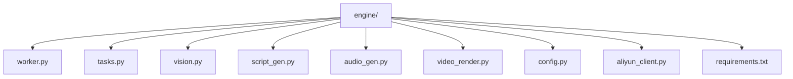
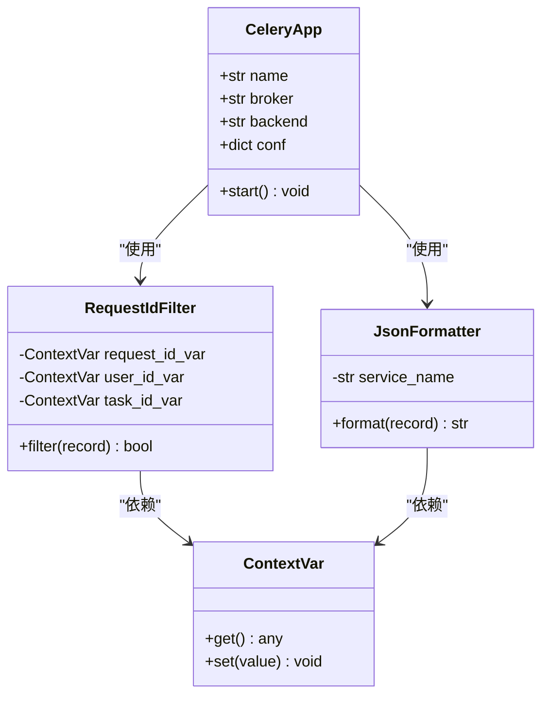
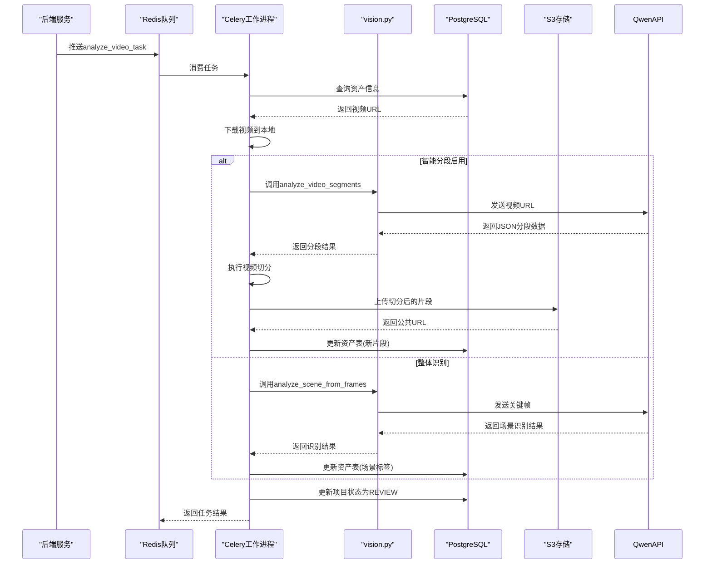
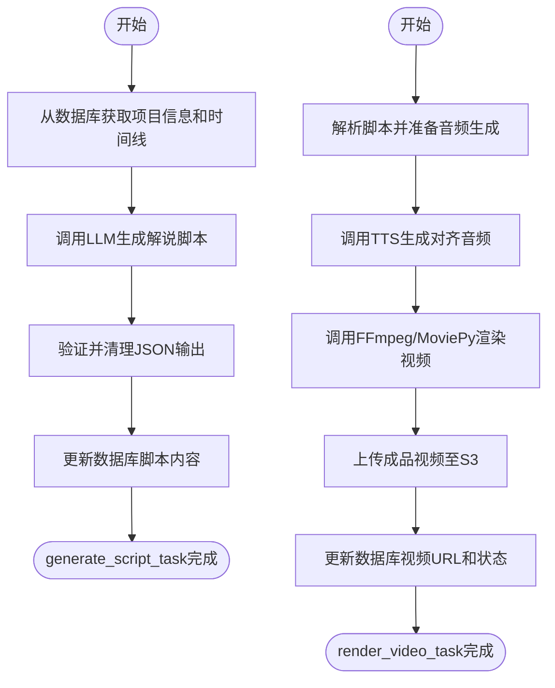
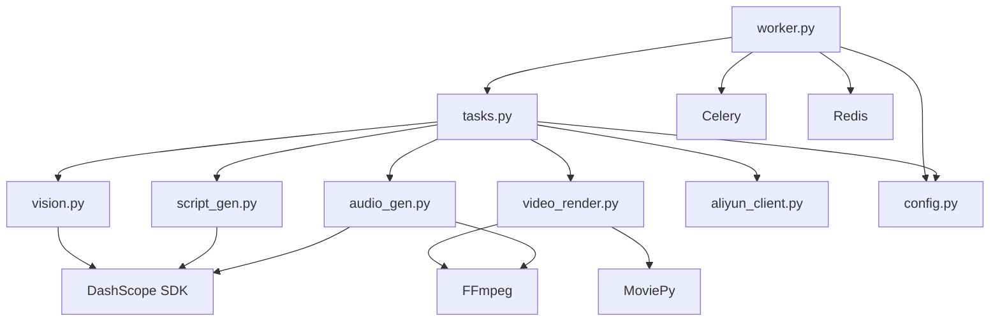

# AI引擎架构

<cite>
**本文档引用文件**   
- [worker.py](file://engine/worker.py)
- [tasks.py](file://engine/tasks.py)
- [vision.py](file://engine/vision.py)
- [script_gen.py](file://engine/script_gen.py)
- [video_render.py](file://engine/video_render.py)
- [audio_gen.py](file://engine/audio_gen.py)
- [config.py](file://engine/config.py)
- [aliyun_client.py](file://engine/aliyun_client.py)
- [requirements.txt](file://engine/requirements.txt)
- [README.md](file://README.md)
</cite>

## 目录
1. [简介](#简介)
2. [项目结构](#项目结构)
3. [核心组件](#核心组件)
4. [架构概览](#架构概览)
5. [详细组件分析](#详细组件分析)
6. [依赖分析](#依赖分析)
7. [性能考虑](#性能考虑)
8. [故障排除指南](#故障排除指南)
9. [结论](#结论)

## 简介
AI引擎是一个独立的Python服务，作为自动化内容生产流水线的核心，负责将原始房源视频素材转化为可发布的成品短视频。该引擎通过Celery与Redis消息队列接收来自后端的任务，实现了异步、解耦的处理流程。其核心工作流包括：利用Qwen-VL API进行视频帧的视觉识别，生成结构化场景数据；基于识别结果，调用大模型生成符合“温情生活风”的解说脚本；最后，利用FFmpeg和MoviePy进行视频剪辑、合成及音频处理。整个系统设计强调结构化优先、AI决策与程序执行分离，确保了输出的可控性和可验证性。

## 项目结构
AI引擎位于`engine/`目录下，是一个独立的Python服务，通过Celery与Redis进行异步任务处理。其主要文件包括作为Celery工作进程入口点的`worker.py`，定义了核心任务的`tasks.py`，以及分别负责视觉识别、脚本生成、音频生成和视频渲染的模块。



**Diagram sources**
- [worker.py](file://engine/worker.py#L1-L137)
- [tasks.py](file://engine/tasks.py#L1-L1209)
- [vision.py](file://engine/vision.py#L1-L298)
- [script_gen.py](file://engine/script_gen.py#L1-L129)
- [video_render.py](file://engine/video_render.py#L1-L526)
- [config.py](file://engine/config.py#L1-L46)

**Section sources**
- [worker.py](file://engine/worker.py#L1-L137)
- [tasks.py](file://engine/tasks.py#L1-L1209)
- [README.md](file://README.md#L1-L223)

## 核心组件
AI引擎的核心由多个Python模块构成，它们协同工作以完成从视频分析到成品输出的整个流程。`worker.py`是Celery工作进程的入口，负责初始化Celery应用和日志系统。`tasks.py`中定义了`analyze_video_task`、`generate_script_task`、`render_video_task`等Celery任务，这些任务是后端触发AI处理流程的接口。`vision.py`模块封装了对Qwen-VL API的调用，用于视频场景的识别与分段。`script_gen.py`模块负责生成结构化的解说脚本。`video_render.py`模块则利用FFmpeg和MoviePy执行最终的视频剪辑与合成。

**Section sources**
- [worker.py](file://engine/worker.py#L1-L137)
- [tasks.py](file://engine/tasks.py#L1-L1209)
- [vision.py](file://engine/vision.py#L1-L298)
- [script_gen.py](file://engine/script_gen.py#L1-L129)
- [video_render.py](file://engine/video_render.py#L1-L526)

## 架构概览
AI引擎采用异步任务队列架构，通过Celery与Redis实现与后端的解耦。后端服务将任务（如视频分析、脚本生成、视频渲染）以消息的形式推送到Redis队列，AI引擎的Celery工作进程从队列中消费这些任务并执行。这种设计使得AI处理流程可以独立于主应用运行，提高了系统的可伸缩性和容错性。任务执行过程中，引擎会通过更新数据库中的项目状态（如`ANALYZING`、`SCRIPT_GENERATED`、`COMPLETED`）与后端同步进度。

```mermaid
graph LR
subgraph "Backend"
Backend[后端服务]
end
subgraph "Message Queue"
Redis[(Redis 消息队列)]
end
subgraph "AI Engine"
CeleryWorker[Celery 工作进程]
Vision[vision.py]
ScriptGen[script_gen.py]
AudioGen[audio_gen.py]
VideoRender[video_render.py]
DB[(PostgreSQL)]
end
Backend --> |推送任务| Redis
Redis --> |消费任务| CeleryWorker
CeleryWorker --> Vision
CeleryWorker --> ScriptGen
CeleryWorker --> AudioGen
CeleryWorker --> VideoRender
Vision --> DB
ScriptGen --> DB
VideoRender --> DB
VideoRender --> |上传成品| S3[(S3 存储)]
```

**Diagram sources**
- [worker.py](file://engine/worker.py#L83-L137)
- [tasks.py](file://engine/tasks.py#L646-L1209)
- [config.py](file://engine/config.py#L7-L46)
- [backend/src/main/java/com/aiscene/service/TaskQueueService.java](file://backend/src/main/java/com/aiscene/service/TaskQueueService.java#L87-L111)

## 详细组件分析

### Worker入口点分析
`worker.py`是AI引擎的启动文件，也是Celery工作进程的入口。它负责创建Celery应用实例，配置连接到Redis的消息代理和结果后端，并通过`include=['tasks']`参数加载`tasks.py`模块中的任务。此外，该文件还设置了全局的日志过滤器和格式化器，利用`contextvars`上下文变量来追踪每个任务的`request_id`、`user_id`和`task_id`，这对于日志的关联分析和问题排查至关重要。



**Diagram sources**
- [worker.py](file://engine/worker.py#L83-L137)

**Section sources**
- [worker.py](file://engine/worker.py#L1-L137)

### 视频分析任务流程
`analyze_video_task`是处理视频分析的核心Celery任务。其执行流程如下：首先，从数据库获取视频资产的源信息；然后，下载视频到本地临时文件；接着，根据配置（`SMART_SPLIT_ENABLED`）决定是否进行智能分段。如果启用，会根据`SMART_SPLIT_STRATEGY`策略（如`qwen_video`或`hybrid`）调用`vision.py`中的方法，利用Qwen-VL API分析视频并生成分段信息。分段完成后，会将视频按场景切分成多个片段并上传至S3，同时更新数据库。如果未启用智能分段，则提取关键帧进行整体场景识别。



**Diagram sources**
- [tasks.py](file://engine/tasks.py#L646-L772)
- [vision.py](file://engine/vision.py#L268-L297)

**Section sources**
- [tasks.py](file://engine/tasks.py#L646-L772)
- [vision.py](file://engine/vision.py#L1-L298)

### 脚本与视频生成流程
`generate_script_task`和`render_video_task`共同完成了从脚本到成品视频的生成。`generate_script_task`首先从数据库获取项目信息和时间线数据，然后调用`script_gen.py`模块，利用Qwen-Plus大模型生成结构化的解说脚本，并将其存储在数据库中。随后，`render_video_task`被触发，它会解析脚本内容，调用`audio_gen.py`生成与视频片段时长对齐的TTS音频，最后由`video_render.py`模块将所有视频片段拼接，并将生成的音频与背景音乐混合，最终渲染出成品视频并上传。



**Diagram sources**
- [tasks.py](file://engine/tasks.py#L791-L1044)
- [script_gen.py](file://engine/script_gen.py#L12-L129)
- [audio_gen.py](file://engine/audio_gen.py#L717-L800)
- [video_render.py](file://engine/video_render.py#L233-L447)

**Section sources**
- [tasks.py](file://engine/tasks.py#L791-L1044)
- [script_gen.py](file://engine/script_gen.py#L1-L129)
- [audio_gen.py](file://engine/audio_gen.py#L1-L1059)
- [video_render.py](file://engine/video_render.py#L1-L526)

## 依赖分析
AI引擎的依赖关系清晰，各模块职责分明。`worker.py`依赖`config.py`进行配置，并导入`tasks.py`以注册任务。`tasks.py`是核心协调者，它直接依赖`vision.py`、`script_gen.py`、`audio_gen.py`、`video_render.py`和`aliyun_client.py`等模块来执行具体功能。`vision.py`和`script_gen.py`依赖`dashscope` SDK来调用阿里云的Qwen-VL和Qwen-Plus模型。`video_render.py`和`audio_gen.py`则依赖`moviepy`和`ffmpeg`等工具进行音视频处理。整个系统通过`celery`和`redis`进行任务调度。



**Diagram sources**
- [requirements.txt](file://engine/requirements.txt#L1-L30)
- [worker.py](file://engine/worker.py#L1-L137)
- [tasks.py](file://engine/tasks.py#L1-L1209)

**Section sources**
- [requirements.txt](file://engine/requirements.txt#L1-L30)

## 性能考虑
AI引擎的性能瓶颈主要在于外部API调用和音视频处理。Qwen-VL API的调用延迟和速率限制是影响视频分析速度的关键因素。为应对此问题，系统通过Celery的重试机制（`max_retries=3`）来处理临时性失败。音视频的渲染过程（尤其是`video_render.py`中的`render_video`函数）计算密集，消耗大量CPU和内存。为了优化，系统在`moviepy`中使用了`preset='veryfast'`和多线程（`threads=4`）参数。此外，通过`_download_temp`方法的S3直连下载和本地文件缓存，减少了不必要的网络传输。

## 故障排除指南
当AI引擎任务失败时，应首先检查日志。日志采用JSON格式，包含`request_id`、`task_id`和`project_id`，便于追踪。常见的错误包括：
1.  **API调用失败**：检查`DASHSCOPE_API_KEY`是否正确配置，以及API配额是否耗尽。
2.  **数据库连接失败**：确认`DB_DSN`配置无误，且数据库服务正常运行。
3.  **文件下载失败**：检查`S3_STORAGE_ENDPOINT`、`S3_STORAGE_ACCESS_KEY`等S3配置，并确保网络可达。
4.  **音视频处理失败**：检查`ffmpeg`是否已正确安装并可执行，以及临时文件目录是否有足够的磁盘空间。

**Section sources**
- [worker.py](file://engine/worker.py#L14-L43)
- [tasks.py](file://engine/tasks.py#L418-L462)
- [backend/src/main/resources/db/migration/V3__add_error_fields_to_projects.sql](file://backend/src/main/resources/db/migration/V3__add_error_fields_to_projects.sql#L1-L5)

## 结论
AI引擎通过一个清晰、解耦的架构，成功地将复杂的AI能力（视频理解、文本生成）与确定性的程序逻辑（视频剪辑、音频合成）相结合。其基于Celery和Redis的异步任务系统，确保了服务的稳定性和可扩展性。通过对`vision.py`、`script_gen.py`等模块的精细设计，实现了从原始视频到成品短视频的自动化生产，为房产内容的规模化创作提供了可靠的技术支持。