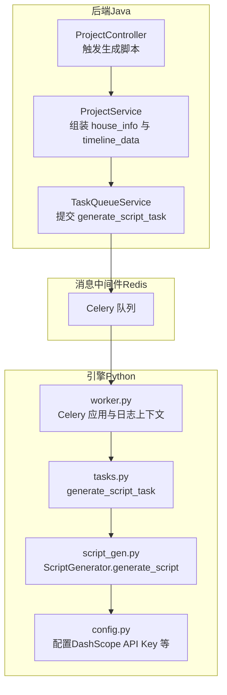
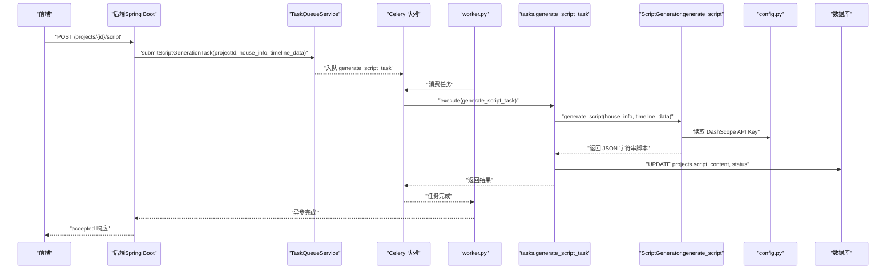
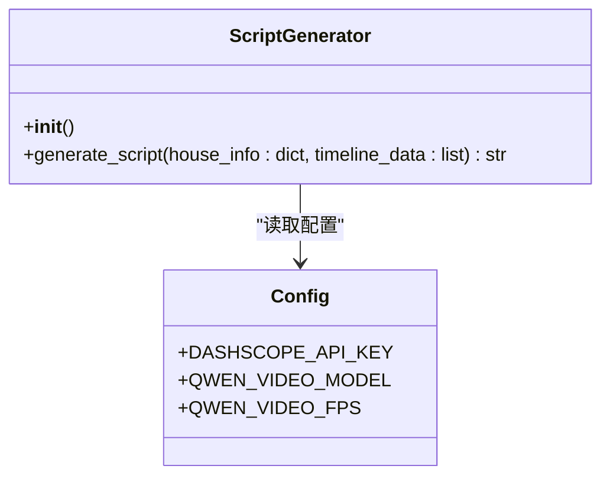
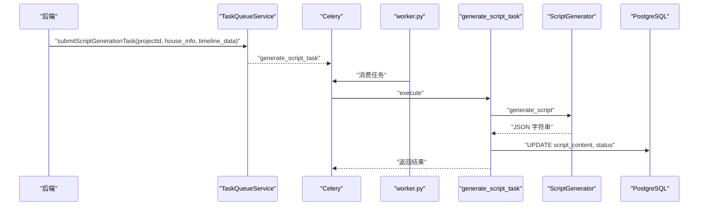
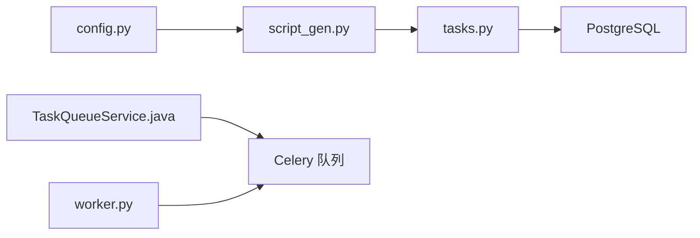
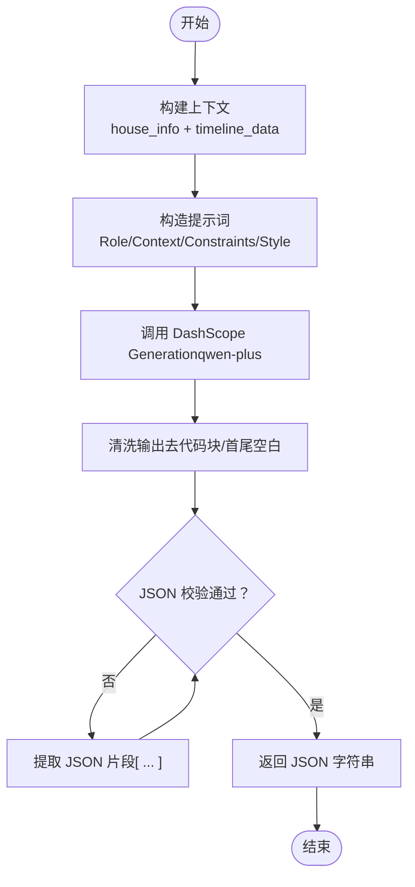

# 脚本生成模块

<cite>
**本文引用的文件**
- [engine/script_gen.py](file://engine/script_gen.py)
- [engine/tasks.py](file://engine/tasks.py)
- [engine/config.py](file://engine/config.py)
- [engine/worker.py](file://engine/worker.py)
- [backend/src/main/java/com/aiscene/service/TaskQueueService.java](file://backend/src/main/java/com/aiscene/service/TaskQueueService.java)
- [backend/src/main/java/com/aiscene/service/ProjectService.java](file://backend/src/main/java/com/aiscene/service/ProjectService.java)
- [backend/src/main/java/com/aiscene/controller/ProjectController.java](file://backend/src/main/java/com/aiscene/controller/ProjectController.java)
- [docs/Technical_Architecture.md](file://docs/Technical_Architecture.md)
</cite>

## 目录
1. [引言](#引言)
2. [项目结构](#项目结构)
3. [核心组件](#核心组件)
4. [架构总览](#架构总览)
5. [详细组件分析](#详细组件分析)
6. [依赖关系分析](#依赖关系分析)
7. [性能考量](#性能考量)
8. [故障排查指南](#故障排查指南)
9. [结论](#结论)
10. [附录](#附录)

## 引言
本章节面向开发者与产品人员，系统性解析脚本生成模块的实现机制。重点说明 engine/script_gen.py 中 ScriptGenerator 类如何基于 AI 分析得到的场景数据与房源信息，利用大语言模型生成流畅、专业的房产短视频解说脚本；详细阐述 generate_script 方法的输入参数（house_info 与 timeline_data）的数据结构与来源；解释提示词（prompt）的设计逻辑，如何将场景标签、特征与房源信息整合为有效的 LLM 输入；并说明该模块如何与 generate_script_task Celery 任务集成，确保脚本生成的异步执行。最后提供自定义脚本风格与内容的实践指导，帮助团队快速适配不同风格的解说需求。

## 项目结构
脚本生成模块位于 Python 引擎侧（engine/），并与后端（Java/Spring Boot）通过消息队列解耦协作。整体结构如下：

图表来源
- [engine/worker.py](file://engine/worker.py#L83-L100)
- [engine/tasks.py](file://engine/tasks.py#L791-L819)
- [engine/script_gen.py](file://engine/script_gen.py#L12-L129)
- [engine/config.py](file://engine/config.py#L13-L18)
- [backend/src/main/java/com/aiscene/service/TaskQueueService.java](file://backend/src/main/java/com/aiscene/service/TaskQueueService.java#L61-L85)
- [backend/src/main/java/com/aiscene/service/ProjectService.java](file://backend/src/main/java/com/aiscene/service/ProjectService.java#L143-L165)
- [backend/src/main/java/com/aiscene/controller/ProjectController.java](file://backend/src/main/java/com/aiscene/controller/ProjectController.java#L155-L165)

章节来源
- [docs/Technical_Architecture.md](file://docs/Technical_Architecture.md#L18-L30)

## 核心组件
- ScriptGenerator：封装脚本生成的核心逻辑，负责构建上下文、构造提示词、调用大模型、清洗与校验输出。
- generate_script_task：Celery 异步任务，接收 house_info 与 timeline_data，调用 ScriptGenerator 生成脚本，并回写数据库状态。
- TaskQueueService：后端服务层，负责将生成脚本的任务投递到 Celery 队列。
- ProjectService：组装 house_info 与 timeline_data，触发脚本生成任务。
- worker.py：Celery 应用初始化、队列配置、日志上下文注入。
- config.py：读取环境变量，提供 DashScope API Key 等运行时配置。

章节来源
- [engine/script_gen.py](file://engine/script_gen.py#L12-L129)
- [engine/tasks.py](file://engine/tasks.py#L791-L819)
- [engine/worker.py](file://engine/worker.py#L83-L100)
- [engine/config.py](file://engine/config.py#L13-L18)
- [backend/src/main/java/com/aiscene/service/TaskQueueService.java](file://backend/src/main/java/com/aiscene/service/TaskQueueService.java#L61-L85)
- [backend/src/main/java/com/aiscene/service/ProjectService.java](file://backend/src/main/java/com/aiscene/service/ProjectService.java#L143-L165)

## 架构总览
脚本生成的端到端流程如下：

图表来源
- [backend/src/main/java/com/aiscene/controller/ProjectController.java](file://backend/src/main/java/com/aiscene/controller/ProjectController.java#L155-L165)
- [backend/src/main/java/com/aiscene/service/ProjectService.java](file://backend/src/main/java/com/aiscene/service/ProjectService.java#L143-L165)
- [backend/src/main/java/com/aiscene/service/TaskQueueService.java](file://backend/src/main/java/com/aiscene/service/TaskQueueService.java#L61-L85)
- [engine/worker.py](file://engine/worker.py#L83-L100)
- [engine/tasks.py](file://engine/tasks.py#L791-L819)
- [engine/script_gen.py](file://engine/script_gen.py#L12-L129)
- [engine/config.py](file://engine/config.py#L13-L18)

## 详细组件分析

### ScriptGenerator 类与 generate_script 方法
- 职责
  - 基于 house_info 与 timeline_data 构建上下文；
  - 设计提示词（prompt），明确角色、约束与输出格式；
  - 调用 DashScope Generation 模型（qwen-plus）生成脚本；
  - 对输出进行清洗、去冗余与 JSON 校验，确保返回稳定的 JSON 字符串。

- 输入参数
  - house_info：房源信息字典，包含房间数量、面积、价格等字段。该字典由后端 ProjectService 从项目实体中转换后传入。
  - timeline_data：按顺序排列的素材片段列表，每个元素包含：
    - id 或 asset_id：片段唯一标识
    - scene_label：AI 场景标签（如客厅、卧室等）
    - scene_score：AI 置信度
    - duration：片段时长（秒）
    - oss_url：片段存储地址（用于后续音频/渲染）

- 上下文构建与时间预算
  - 将 house_info 与 timeline_data 中的每个片段的场景标签与时长预算（约 4 字/秒）拼接为自然语言上下文，作为提示词的一部分，帮助 LLM 生成符合节奏的口语化脚本。

- 提示词（prompt）设计逻辑
  - 角色定位：专业房产短视频解说达人，风格为“温情生活风”。
  - 结构化输出：要求严格返回 JSON 数组，包含 asset_id、text、visual_prompt、audio_cue 四个字段，且不得更改 asset_id。
  - 时间预算约束：每个片段的字数需满足“建议字数”（duration×4），语速控制在约 4 字/秒。
  - 视觉锚定：脚本内容必须与画面场景实时对应，避免脱节。
  - 示例输出：提供 JSON 示例，便于模型对齐输出格式。

- LLM 调用与后处理
  - 使用 Generation.call 调用 qwen-plus 模型，result_format 为 message；
  - 对返回内容进行清洗：去除可能的 Markdown 代码块标记、首尾空白；
  - 若 JSON 不完整，尝试提取首个 [ 与最后一个 ] 之间的片段；
  - 校验 JSON 有效性，失败则抛出异常。

- 错误处理
  - 当 DashScope API Key 未配置时，构造函数即抛出异常；
  - LLM 请求失败时，抛出异常并包含错误信息。

图表来源
- [engine/script_gen.py](file://engine/script_gen.py#L12-L129)
- [engine/config.py](file://engine/config.py#L13-L18)

章节来源
- [engine/script_gen.py](file://engine/script_gen.py#L12-L129)

### generate_script_task Celery 任务
- 触发入口
  - 后端 ProjectController 接收前端请求，调用 ProjectService.generateScript；
  - ProjectService 组装 house_info 与 timeline_data，调用 TaskQueueService.submitScriptGenerationTask；
  - TaskQueueService 将任务入队 generate_script_task。

- 任务执行
  - generate_script_task 从队列取出参数（project_id, house_info, timeline_data）；
  - 调用 ScriptGenerator.generate_script 生成脚本内容；
  - 将脚本内容写入数据库 projects 表的 script_content 字段，并更新状态为 SCRIPT_GENERATED；
  - 返回任务结果（project_id 与 script）。

- 异常与重试
  - 任务内部捕获异常，使用 _retry_with_headers 进行指数退避重试；
  - 日志中携带 request_id、user_id 等上下文，便于追踪。

图表来源
- [backend/src/main/java/com/aiscene/service/TaskQueueService.java](file://backend/src/main/java/com/aiscene/service/TaskQueueService.java#L61-L85)
- [backend/src/main/java/com/aiscene/service/ProjectService.java](file://backend/src/main/java/com/aiscene/service/ProjectService.java#L143-L165)
- [engine/tasks.py](file://engine/tasks.py#L791-L819)
- [engine/script_gen.py](file://engine/script_gen.py#L12-L129)

章节来源
- [engine/tasks.py](file://engine/tasks.py#L791-L819)
- [engine/worker.py](file://engine/worker.py#L83-L100)
- [backend/src/main/java/com/aiscene/service/TaskQueueService.java](file://backend/src/main/java/com/aiscene/service/TaskQueueService.java#L61-L85)
- [backend/src/main/java/com/aiscene/service/ProjectService.java](file://backend/src/main/java/com/aiscene/service/ProjectService.java#L143-L165)

### 输入参数与数据结构详解
- house_info
  - 来源：后端 ProjectService 从项目实体中提取 house_info，并转换为 Object；
  - 结构：字典型，包含房间、厅、面积、价格等字段；
  - 作用：作为 LLM 的背景知识，帮助生成更贴合房源特点的脚本。

- timeline_data
  - 来源：后端 ProjectService 遍历项目下的资产（Assets），按 sort_order 排序，组装为列表；
  - 每个元素包含：
    - id/asset_id：片段唯一标识
    - scene_label：AI 场景标签
    - scene_score：置信度
    - duration：时长（秒）
    - oss_url：片段存储地址
  - 作用：作为 LLM 的时间轴与视觉锚点，确保脚本与画面一一对应。

章节来源
- [backend/src/main/java/com/aiscene/service/ProjectService.java](file://backend/src/main/java/com/aiscene/service/ProjectService.java#L143-L165)
- [docs/Technical_Architecture.md](file://docs/Technical_Architecture.md#L68-L111)

### 提示词（Prompt）设计与整合策略
- 角色与风格
  - 明确角色为“专业房产短视频解说达人”，风格为“温情生活风”，强调“治愈”“阳光”“家的味道”，贴近目标受众心理。
- 结构化输出
  - 严格要求返回 JSON 数组，包含 asset_id、text、visual_prompt、audio_cue；
  - 不得更改 asset_id，确保后续渲染与素材对齐。
- 时间预算与语速
  - 每个片段的“建议字数”由时长×4 得出，语速控制在约 4 字/秒，避免超时或节奏不匹配。
- 视觉锚定
  - 脚本内容必须与画面场景实时对应，避免“画外音”导致的割裂感。
- 输出示例
  - 提供 JSON 示例，帮助模型对齐输出格式，减少歧义。

章节来源
- [engine/script_gen.py](file://engine/script_gen.py#L32-L89)

### 与 Celery 的异步集成
- 队列与应用
  - worker.py 初始化 Celery 应用，设置 broker、backend、默认队列与序列化；
  - 通过 signals 注入 request_id、user_id 等上下文，统一日志格式。
- 任务提交
  - TaskQueueService 将 generate_script_task 入队，携带 project_id、house_info、timeline_data；
  - 后端 Controller 接受前端请求后，立即返回 accepted，不阻塞。
- 任务执行
  - generate_script_task 调用 ScriptGenerator 生成脚本，回写数据库并返回结果；
  - 支持重试与异常记录，保障稳定性。

章节来源
- [engine/worker.py](file://engine/worker.py#L83-L100)
- [engine/tasks.py](file://engine/tasks.py#L791-L819)
- [backend/src/main/java/com/aiscene/service/TaskQueueService.java](file://backend/src/main/java/com/aiscene/service/TaskQueueService.java#L61-L85)
- [backend/src/main/java/com/aiscene/controller/ProjectController.java](file://backend/src/main/java/com/aiscene/controller/ProjectController.java#L155-L165)

### 自定义脚本风格与内容的实践指南
- 修改角色与风格
  - 在提示词中调整角色定位与风格描述，例如改为“高端商务风”“清新文艺风”等；
  - 对应地调整“Style Guidelines”与输出示例，确保模型输出与风格一致。
- 调整时间预算
  - 如需不同语速，可调整“建议字数 = 时长 × 字数系数”，并在提示词中明确约束；
  - 注意与渲染端的时长控制保持一致，避免超时或不足。
- 扩展字段与增强指令
  - 可在 JSON 输出中增加更多字段（如情感强度、节奏建议），但需同步更新后端解析与渲染逻辑；
  - visual_prompt 与 audio_cue 可随风格变化，例如“温暖阳光”“柔和爵士乐”等。
- 提示词模板化
  - 建议将提示词拆分为模板文件或配置项，便于多风格切换与 A/B 测试；
  - 通过环境变量或配置中心动态加载不同风格的模板，降低硬编码风险。

章节来源
- [engine/script_gen.py](file://engine/script_gen.py#L32-L89)

## 依赖关系分析
- 组件耦合
  - ScriptGenerator 仅依赖 config.py 的配置项，低耦合；
  - generate_script_task 依赖 ScriptGenerator 与数据库连接，职责单一；
  - 后端通过 TaskQueueService 与 Celery 解耦，便于横向扩展。
- 外部依赖
  - DashScope Generation（qwen-plus）用于生成脚本；
  - Redis 作为 Celery 的 broker 与 backend；
  - PostgreSQL 存储项目与资产元数据。

图表来源
- [engine/config.py](file://engine/config.py#L13-L18)
- [engine/script_gen.py](file://engine/script_gen.py#L12-L129)
- [engine/tasks.py](file://engine/tasks.py#L791-L819)
- [engine/worker.py](file://engine/worker.py#L83-L100)
- [backend/src/main/java/com/aiscene/service/TaskQueueService.java](file://backend/src/main/java/com/aiscene/service/TaskQueueService.java#L61-L85)

章节来源
- [engine/config.py](file://engine/config.py#L13-L18)
- [engine/script_gen.py](file://engine/script_gen.py#L12-L129)
- [engine/tasks.py](file://engine/tasks.py#L791-L819)
- [engine/worker.py](file://engine/worker.py#L83-L100)
- [backend/src/main/java/com/aiscene/service/TaskQueueService.java](file://backend/src/main/java/com/aiscene/service/TaskQueueService.java#L61-L85)

## 性能考量
- 时长预算与字数控制
  - 通过“建议字数 = 时长 × 4”控制脚本长度，避免超时；
  - 建议在前端与后端均进行时长校验，确保 timeline_data 的合理性。
- LLM 调用成本
  - qwen-plus 为较优性价比模型，建议结合缓存与批量处理降低调用次数；
  - 对重复场景与相似房源，可复用历史脚本模板，减少推理开销。
- 异步与并发
  - Celery 队列与 worker 并发度需与服务器资源匹配，避免内存与 CPU 峰值；
  - 建议对任务进行限流与优先级调度，保障关键路径（如渲染）的稳定性。

## 故障排查指南
- API Key 未配置
  - 现象：构造 ScriptGenerator 即抛出异常；
  - 处理：检查环境变量 DASHSCOPE_API_KEY 是否正确设置。
- LLM 请求失败
  - 现象：generate_script 抛出异常并包含错误信息；
  - 处理：检查网络连通性、模型可用性与配额限制。
- 输出非标准 JSON
  - 现象：返回内容包含 Markdown 代码块或混杂文本；
  - 处理：脚本内置清洗与 JSON 提取逻辑，若仍失败，检查提示词是否过于开放或模型行为异常。
- 任务重试与日志
  - 现象：generate_script_task 多次重试；
  - 处理：查看日志中的 request_id、user_id、task_id，定位具体失败环节；检查数据库连接与队列状态。

章节来源
- [engine/script_gen.py](file://engine/script_gen.py#L12-L129)
- [engine/tasks.py](file://engine/tasks.py#L791-L819)
- [engine/worker.py](file://engine/worker.py#L101-L134)

## 结论
脚本生成模块通过清晰的职责划分与严格的提示词工程，实现了从 AI 场景数据与房源信息到专业脚本的自动化生成。借助 Celery 的异步执行与后端的消息解耦，系统具备良好的扩展性与稳定性。开发者可通过调整提示词模板与风格参数，灵活适配不同类型的房产短视频需求；同时，建议在工程层面完善模板化与缓存策略，进一步提升性能与一致性。

## 附录
- 关键流程图（算法实现）

图表来源
- [engine/script_gen.py](file://engine/script_gen.py#L32-L129)