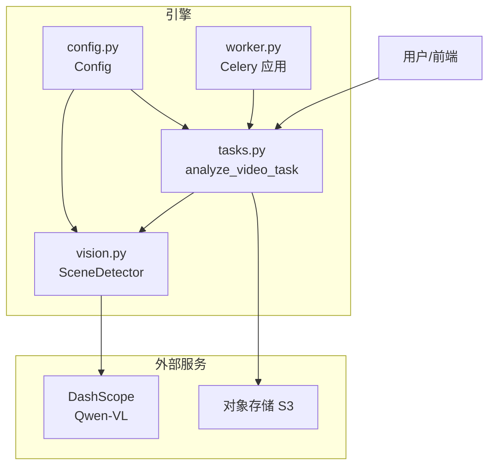
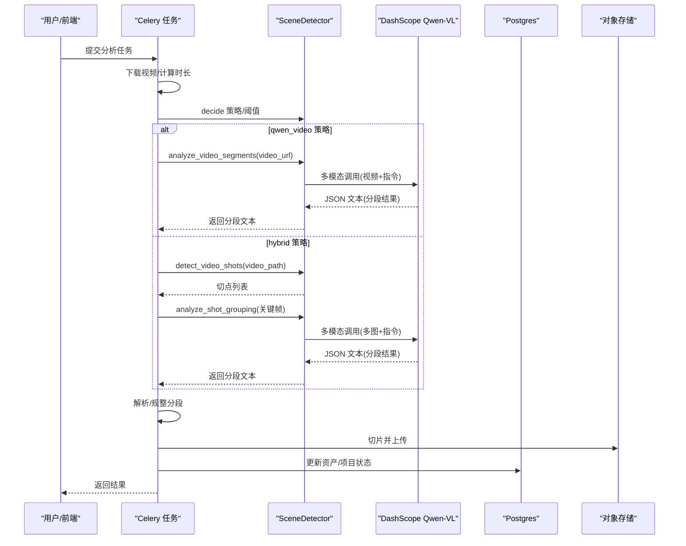
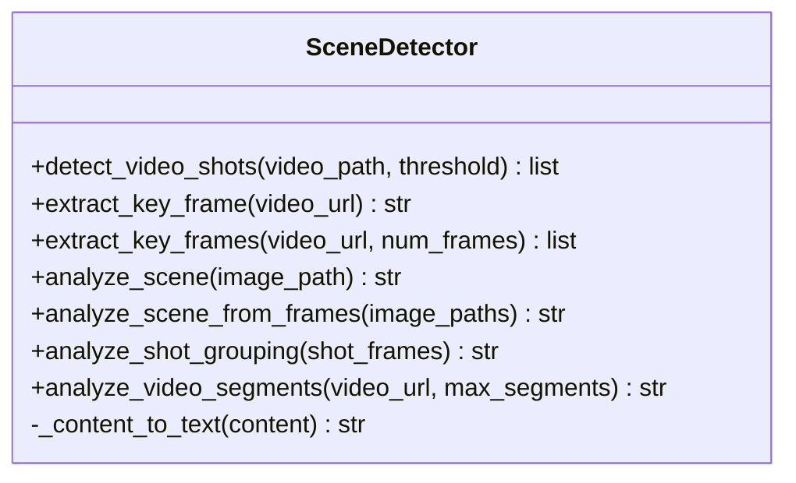
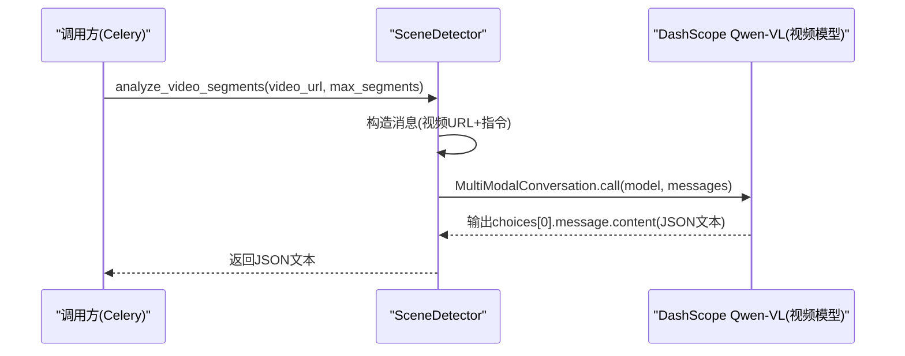
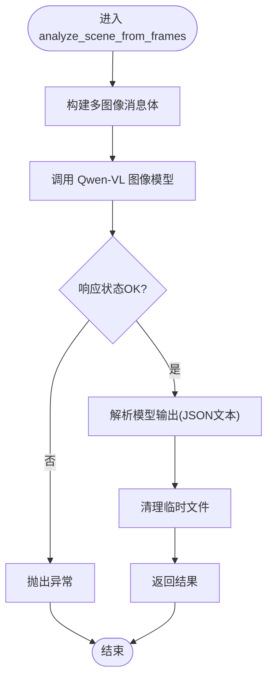
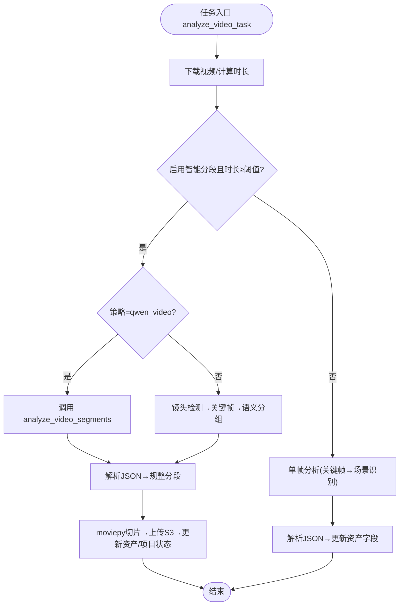
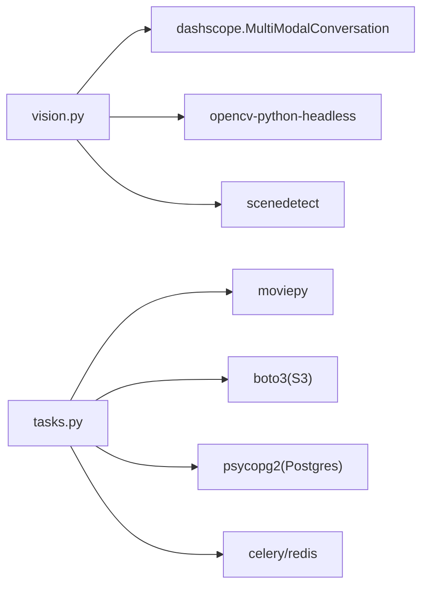

# 视觉识别模块

<cite>
**本文引用的文件**
- [engine/vision.py](file://engine/vision.py)
- [engine/tasks.py](file://engine/tasks.py)
- [engine/config.py](file://engine/config.py)
- [engine/worker.py](file://engine/worker.py)
- [engine/requirements.txt](file://engine/requirements.txt)
- [README.md](file://README.md)
</cite>

## 目录
1. [简介](#简介)
2. [项目结构](#项目结构)
3. [核心组件](#核心组件)
4. [架构总览](#架构总览)
5. [详细组件分析](#详细组件分析)
6. [依赖分析](#依赖分析)
7. [性能考虑](#性能考虑)
8. [故障排查指南](#故障排查指南)
9. [结论](#结论)
10. [附录](#附录)

## 简介
本文件全面解析视觉识别模块的实现与工作流程，重点说明 vision.py 中 SceneDetector 类如何集成阿里云 Qwen-VL 视觉大模型，实现对房产视频的场景智能分析。文档详细描述 analyze_video_segments 方法如何通过多模态 API 调用，将视频 URL 和分析指令发送给 Qwen-VL，实现视频智能分段，并输出包含 start_sec、end_sec、scene、features 和 score 的 JSON 结构；解释 analyze_scene_from_frames 方法如何提取关键帧并进行单帧场景识别；阐述该模块与 Celery 任务 analyze_video_task 的集成关系，以及如何根据 SMART_SPLIT_ENABLED 和 SMART_SPLIT_STRATEGY 配置动态选择分段策略；最后为开发者提供调试视觉识别任务的指导，包括如何处理 API 调用失败、解析模型响应和处理视频分段逻辑。

## 项目结构
视觉识别模块位于 engine 子目录，核心文件包括：
- vision.py：定义 SceneDetector 类，封装视频场景检测、关键帧提取、单帧/多帧场景识别、视频智能分段等能力，并通过 DashScope 调用 Qwen-VL。
- tasks.py：定义 Celery 任务 analyze_video_task，负责下载视频、按策略调用 SceneDetector 并执行分段与切片、更新数据库状态。
- config.py：集中管理配置项，包括 DashScope API 密钥、Qwen 图像/视频模型名称、视频 FPS、智能分段开关与策略、阈值等。
- worker.py：Celery 应用初始化与日志上下文注入，确保任务日志携带请求 ID、用户 ID 等追踪信息。
- requirements.txt：列出依赖库，包括 dashscope、opencv-python-headless、scenedetect、moviepy 等。

图表来源
- [engine/vision.py](file://engine/vision.py#L1-L298)
- [engine/tasks.py](file://engine/tasks.py#L646-L790)
- [engine/config.py](file://engine/config.py#L1-L46)
- [engine/worker.py](file://engine/worker.py#L83-L137)

章节来源
- [README.md](file://README.md#L76-L120)
- [engine/requirements.txt](file://engine/requirements.txt#L1-L30)

## 核心组件
- SceneDetector：封装视频场景检测、关键帧提取、单帧/多帧场景识别、视频智能分段等能力，统一通过 DashScope 的 MultiModalConversation 调用 Qwen-VL。
- analyze_video_task：Celery 任务，负责下载视频、按配置策略调用 SceneDetector、执行分段与切片、更新数据库状态、记录日志与错误。
- Config：集中读取环境变量，提供 DashScope API 密钥、模型名称、视频 FPS、智能分段开关与策略、阈值等配置。
- Celery 应用：初始化 Redis 作为消息中间件与结果后端，设置队列、序列化、时区等，注入日志上下文。

章节来源
- [engine/vision.py](file://engine/vision.py#L1-L298)
- [engine/tasks.py](file://engine/tasks.py#L646-L790)
- [engine/config.py](file://engine/config.py#L1-L46)
- [engine/worker.py](file://engine/worker.py#L83-L137)

## 架构总览
视觉识别模块采用“任务驱动 + 多模态模型”的架构：
- 用户提交视频后，由 Celery 任务 analyze_video_task 下载视频并决定是否启用智能分段。
- 若启用且满足条件，则调用 SceneDetector 的 analyze_video_segments 或 analyze_shot_grouping，结合 Qwen-VL 的多模态能力进行分段或场景归并。
- 分段完成后，使用 moviepy 对原视频进行切片，上传到 S3 并更新数据库资产表，推进项目状态。
- 日志系统通过 worker.py 注入请求 ID、用户 ID 等上下文，便于定位问题。

图表来源
- [engine/tasks.py](file://engine/tasks.py#L680-L773)
- [engine/vision.py](file://engine/vision.py#L268-L298)
- [engine/vision.py](file://engine/vision.py#L46-L98)

## 详细组件分析

### SceneDetector 类
SceneDetector 封装了视频场景检测与多模态分析能力，核心方法包括：
- detect_video_shots：使用 PySceneDetect 检测视频镜头边界，返回按秒计的时间区间列表。
- extract_key_frame / extract_key_frames：从视频 URL 抽取中间帧或多帧关键帧，调整尺寸后保存为临时文件。
- analyze_scene：对单张图片进行场景识别，返回包含 scene、features、score 的 JSON 文本。
- analyze_scene_from_frames：对多张图片进行场景识别，返回主场景、特征与置信度。
- analyze_shot_grouping：对一组镜头关键帧进行语义分组，返回合并后的分段列表。
- analyze_video_segments：对视频 URL 进行智能分段，返回包含 start_sec、end_sec、scene、features、score 的 JSON 文本。

图表来源
- [engine/vision.py](file://engine/vision.py#L1-L298)

章节来源
- [engine/vision.py](file://engine/vision.py#L1-L298)

### analyze_video_segments 方法（视频智能分段）
该方法通过 DashScope 的 MultiModalConversation 调用 Qwen-VL 视频模型，向模型提供视频 URL 与分析指令，要求模型输出符合规范的 JSON 文本，包含多个分段的起止时间、场景类型、关键特征与置信度。方法内部构造消息体，包含 video 与 text 两部分，并以 QWEN_VIDEO_MODEL 调用模型。成功时返回模型输出的文本，失败抛出异常。

图表来源
- [engine/vision.py](file://engine/vision.py#L268-L298)

章节来源
- [engine/vision.py](file://engine/vision.py#L268-L298)

### analyze_scene_from_frames 方法（关键帧场景识别）
该方法接收多张关键帧路径，构造多图像消息体，调用 Qwen-VL 图像模型，要求模型返回主场景、关键特征与置信度。方法内部在调用后清理临时文件，保证资源回收。

图表来源
- [engine/vision.py](file://engine/vision.py#L236-L267)

章节来源
- [engine/vision.py](file://engine/vision.py#L236-L267)

### 关键帧提取与单帧识别
- extract_key_frame：从视频 URL 抽取中间帧，调整最大边不超过 1024 像素，保存为临时 JPG 文件并返回路径。
- extract_key_frames：抽取指定数量的关键帧（首尾 10%-90% 区间均匀采样），同样进行尺寸压缩与临时文件保存。
- analyze_scene：对单张图片进行场景识别，返回包含 scene、features、score 的 JSON 文本，并删除临时文件。

章节来源
- [engine/vision.py](file://engine/vision.py#L118-L195)
- [engine/vision.py](file://engine/vision.py#L197-L235)

### 与 Celery 任务 analyze_video_task 的集成
analyze_video_task 是视觉识别模块与任务调度系统的桥梁，主要流程如下：
- 下载视频到本地临时文件，计算时长。
- 根据 SMART_SPLIT_ENABLED、SMART_SPLIT_MIN_DURATION_SEC、SMART_SPLIT_STRATEGY 与视频 URL 是否为 HTTP 地址，决定是否启用智能分段及采用何种策略：
  - qwen_video：直接调用 analyze_video_segments 获取分段 JSON 文本，解析并规整后执行切片与上传。
  - hybrid：先用 detect_video_shots 检测镜头边界，再抽取关键帧，调用 analyze_shot_grouping 进行语义分组，解析并规整后执行切片与上传。
- 若未启用智能分段或策略不满足条件，则回退到单帧分析：抽取多帧关键帧，调用 analyze_scene_from_frames，解析 JSON 并更新资产表字段（scene_label、scene_score、duration）。
- 记录日志事件、推进项目状态、清理临时文件、处理重试与失败上报。

图表来源
- [engine/tasks.py](file://engine/tasks.py#L680-L773)
- [engine/vision.py](file://engine/vision.py#L19-L44)
- [engine/vision.py](file://engine/vision.py#L268-L298)

章节来源
- [engine/tasks.py](file://engine/tasks.py#L646-L790)

### 配置与策略
- SMART_SPLIT_ENABLED：是否启用智能分段，默认开启。
- SMART_SPLIT_STRATEGY：分段策略，支持 qwen_video 与 hybrid。
- SMART_SPLIT_MIN_DURATION_SEC：最小分段时间阈值（秒），低于该阈值跳过分段。
- SCENE_DETECT_THRESHOLD：镜头检测阈值，用于 detect_video_shots。
- QWEN_IMAGE_MODEL/QWEN_VIDEO_MODEL：Qwen-VL 图像/视频模型名称。
- QWEN_VIDEO_FPS：视频模型推理帧率。
- DASHSCOPE_API_KEY：DashScope API 密钥，初始化 SceneDetector 时校验。

章节来源
- [engine/config.py](file://engine/config.py#L1-L46)
- [engine/vision.py](file://engine/vision.py#L13-L18)

## 依赖分析
- DashScope：MultiModalConversation 用于调用 Qwen-VL 图像/视频模型。
- OpenCV：读取视频、抽取关键帧、计算时长。
- scenedetect：检测镜头边界。
- moviepy：视频切片与编码。
- boto3：上传切片到 S3。
- Celery/Redis：任务队列与结果存储。
- psycopg2：直接访问 Postgres 数据库，更新项目与资产状态。

图表来源
- [engine/requirements.txt](file://engine/requirements.txt#L1-L30)
- [engine/vision.py](file://engine/vision.py#L1-L20)
- [engine/tasks.py](file://engine/tasks.py#L1-L40)

章节来源
- [engine/requirements.txt](file://engine/requirements.txt#L1-L30)

## 性能考虑
- 关键帧抽取：限制最大边不超过 1024 像素，降低上传与推理开销。
- 视频模型帧率：通过 QWEN_VIDEO_FPS 控制视频输入帧率，平衡精度与速度。
- 分段策略选择：短视频优先使用 hybrid 策略，长视频可考虑 qwen_video 策略；通过 SMART_SPLIT_MIN_DURATION_SEC 避免过短视频的无效分段。
- 切片与上传：moviepy 写入时尝试带音频，失败回退无音频模式；上传前计算文件大小并记录日志，便于监控与优化。
- 日志与重试：任务自动重试并保留请求 ID、用户 ID 上下文，便于定位性能瓶颈与错误根因。

## 故障排查指南
- API 调用失败
  - 现象：analyze_video_segments/analyze_scene/analyze_shot_grouping 抛出异常。
  - 排查要点：检查 DASHSCOPE_API_KEY 是否正确设置；确认 DashScope 服务可用；查看任务日志中的 stacktrace。
  - 参考路径：[engine/vision.py](file://engine/vision.py#L268-L298)、[engine/vision.py](file://engine/vision.py#L197-L235)、[engine/vision.py](file://engine/vision.py#L46-L98)
- 模型响应解析
  - 现象：解析 JSON 失败或字段缺失。
  - 排查要点：确认模型输出为 JSON 文本；使用 _parse_model_json 清理代码块标记；使用 _coerce_segments 规整字段类型与顺序；必要时在 hybrid 策略中回退单帧分析。
  - 参考路径：[engine/tasks.py](file://engine/tasks.py#L231-L267)
- 视频分段逻辑
  - 现象：分段不完整或越界。
  - 排查要点：使用 _complete_segments_to_full_duration 补齐首尾与覆盖全时长；检查 segments 的 start_sec/end_sec 顺序与合法性；确认 moviepy 切片前已规范化。
  - 参考路径：[engine/tasks.py](file://engine/tasks.py#L268-L336)
- 任务重试与失败上报
  - 现象：任务多次重试或最终失败。
  - 排查要点：查看任务日志中的 event、step、task_name、attempt/retries 等字段；确认 max_retries 设置；检查 _set_project_failed 是否被触发。
  - 参考路径：[engine/tasks.py](file://engine/tasks.py#L774-L790)
- 资源清理
  - 现象：临时文件未清理导致磁盘占用。
  - 排查要点：确认 analyze_scene/analyze_scene_from_frames 已删除临时文件；确认 analyze_video_task 在异常与正常分支均清理本地视频文件。
  - 参考路径：[engine/vision.py](file://engine/vision.py#L226-L235)、[engine/vision.py](file://engine/vision.py#L255-L266)、[engine/tasks.py](file://engine/tasks.py#L740-L773)

章节来源
- [engine/tasks.py](file://engine/tasks.py#L231-L336)
- [engine/tasks.py](file://engine/tasks.py#L740-L790)
- [engine/vision.py](file://engine/vision.py#L197-L235)
- [engine/vision.py](file://engine/vision.py#L255-L266)

## 结论
视觉识别模块通过 SceneDetector 将 Qwen-VL 的多模态能力与工程化的任务调度、视频处理、存储与数据库更新有机结合，实现了对房产视频的结构化场景理解与智能分段。Celery 任务 analyze_video_task 根据配置灵活选择分段策略，既能利用视频模型进行端到端分段，也能在 hybrid 策略下结合镜头检测与多帧语义分组提升鲁棒性。配合完善的日志与错误处理机制，开发者可以快速定位问题并优化性能。

## 附录
- 环境变量与默认值参考：[engine/config.py](file://engine/config.py#L1-L46)
- 依赖库清单：[engine/requirements.txt](file://engine/requirements.txt#L1-L30)
- 项目整体说明与模块职责：[README.md](file://README.md#L76-L120)