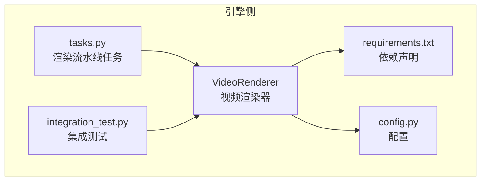
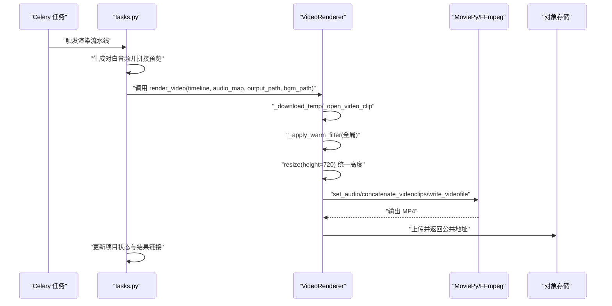
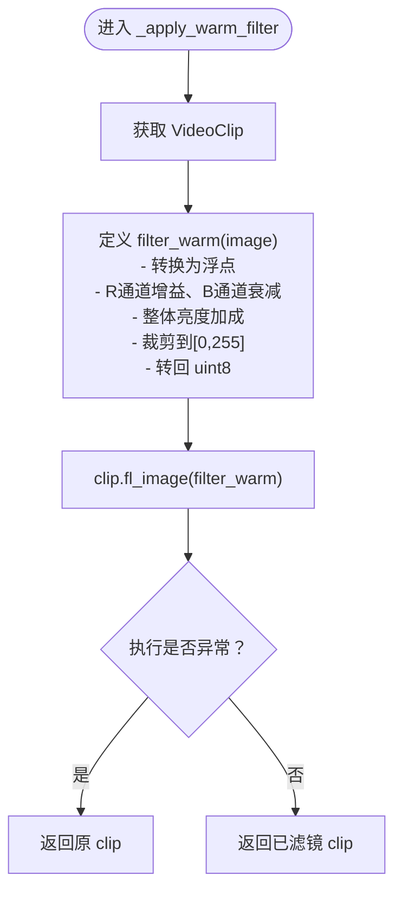
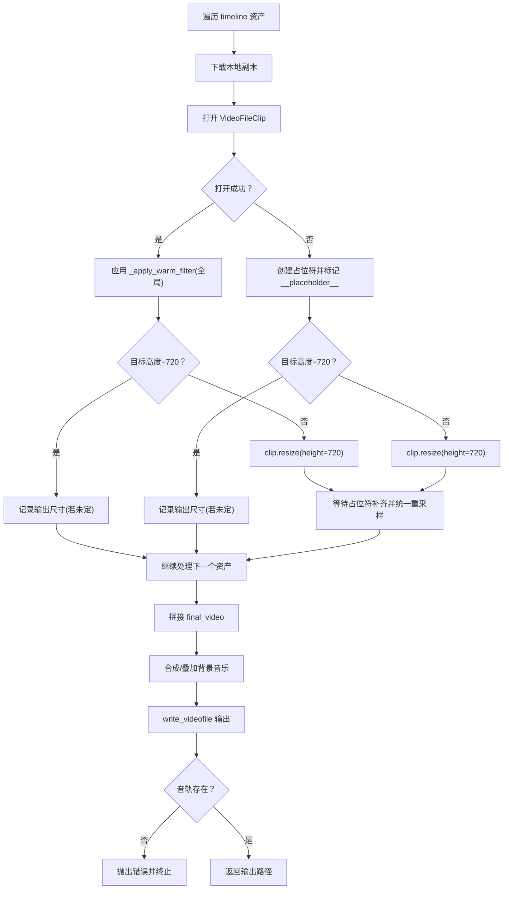
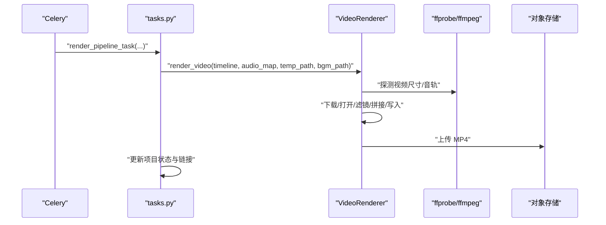
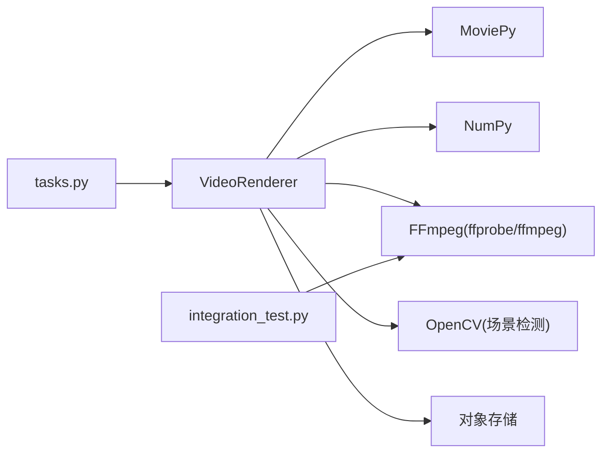

# 特效与滤镜应用

<cite>
**本文引用的文件**
- [engine/video_render.py](file://engine/video_render.py)
- [engine/tasks.py](file://engine/tasks.py)
- [engine/requirements.txt](file://engine/requirements.txt)
- [engine/config.py](file://engine/config.py)
- [integration_test.py](file://integration_test.py)
</cite>

## 目录
1. [简介](#简介)
2. [项目结构](#项目结构)
3. [核心组件](#核心组件)
4. [架构总览](#架构总览)
5. [详细组件分析](#详细组件分析)
6. [依赖关系分析](#依赖关系分析)
7. [性能考量](#性能考量)
8. [故障排查指南](#故障排查指南)
9. [结论](#结论)
10. [附录](#附录)

## 简介
本章节聚焦视频渲染模块中的视觉特效与滤镜应用，系统性解析以下内容：
- _apply_warm_filter 方法如何通过自定义 numpy 函数为视频添加“温暖生活”风格的视觉效果，包括轻微提升亮度/对比度与应用红暖蓝冷的色调偏移。
- render_video 方法如何在拼接阶段对所有视频片段全局应用该滤镜。
- 视频处理过程中其他视觉处理策略，如将所有视频片段统一调整为 720p 高度以保证输出一致性。
- 面向开发者的滤镜效果自定义与扩展指导，以及处理视频分辨率不一致问题的最佳实践。

## 项目结构
本项目采用前后端分离与引擎侧渲染相结合的架构。与本主题直接相关的文件主要位于 engine 子目录：
- engine/video_render.py：负责视频下载、打开、滤镜应用、音频同步、拼接与写入输出。
- engine/tasks.py：Celery 渲染流水线任务入口，调用 video_render.render_video 并上传结果。
- engine/requirements.txt：声明电影剪辑与图像处理依赖（moviepy、numpy 等）。
- engine/config.py：读取环境变量，为渲染与视觉分析提供配置。
- integration_test.py：集成测试脚本，包含对最终视频音轨可用性的验证逻辑。

图表来源
- [engine/video_render.py](file://engine/video_render.py#L1-L526)
- [engine/tasks.py](file://engine/tasks.py#L1060-L1148)
- [engine/requirements.txt](file://engine/requirements.txt#L1-L30)
- [engine/config.py](file://engine/config.py#L1-L46)
- [integration_test.py](file://integration_test.py#L1-L200)

章节来源
- [engine/video_render.py](file://engine/video_render.py#L1-L526)
- [engine/tasks.py](file://engine/tasks.py#L1060-L1148)
- [engine/requirements.txt](file://engine/requirements.txt#L1-L30)
- [engine/config.py](file://engine/config.py#L1-L46)
- [integration_test.py](file://integration_test.py#L1-L200)

## 核心组件
- VideoRenderer：封装视频下载、打开、滤镜应用、音频同步、拼接与输出写入等全流程。
- _apply_warm_filter：基于 numpy 的自定义滤镜，实现“温暖生活”风格的色调与亮度增强。
- render_video：按时间轴顺序处理各片段，全局应用滤镜，并进行统一高度缩放与音频同步。

章节来源
- [engine/video_render.py](file://engine/video_render.py#L210-L276)
- [engine/video_render.py](file://engine/video_render.py#L233-L448)

## 架构总览
渲染流水线从 Celery 任务开始，生成音频后调用 VideoRenderer 渲染视频，最终上传到对象存储并更新数据库状态。

图表来源
- [engine/tasks.py](file://engine/tasks.py#L1060-L1148)
- [engine/video_render.py](file://engine/video_render.py#L233-L448)

## 详细组件分析

### _apply_warm_filter：温暖生活滤镜实现
- 实现原理
  - 使用 numpy 对帧级 RGB 数组进行逐像素操作，先对红色通道与蓝色通道分别乘以增益系数，再整体亮度加成，最后裁剪到合法范围并转换回整型。
  - 通过 MoviePy 的 fl_image 将该函数应用于每一帧，形成全局滤镜效果。
- 效果特征
  - 提升整体亮度与对比度，使画面更明亮通透。
  - 强化红色暖色调，弱化蓝色冷色调，营造“温暖生活”的观感。
- 错误处理
  - 若滤镜执行异常，返回原始 clip，避免中断渲染流程。

图表来源
- [engine/video_render.py](file://engine/video_render.py#L210-L232)

章节来源
- [engine/video_render.py](file://engine/video_render.py#L210-L232)

### render_video：全局滤镜与统一高度策略
- 全局滤镜应用
  - 在打开每个视频片段后立即应用 _apply_warm_filter，确保所有片段均带有“温暖生活”风格。
- 分辨率与高度统一
  - 当片段高度不等于 720 时，统一缩放到 720p 高度；若首个有效片段尚未确定输出尺寸，则记录其尺寸并在后续占位符补齐时统一重采样。
  - 若某片段缺失或打开失败，会根据已有信息推断占位符尺寸，保持输出一致性。
- 音频同步与弹性匹配
  - 以音频为主时钟，若视频更长则截断，若更短则使用 time_mirror 与正向片段组合形成“回环扩展”，并限制最大扩展时长，避免资源耗尽。
- 输出与校验
  - 写出 MP4，设置编码参数与帧率；最终进行音轨存在性检查，确保渲染产物具备音频流。

图表来源
- [engine/video_render.py](file://engine/video_render.py#L233-L448)

章节来源
- [engine/video_render.py](file://engine/video_render.py#L233-L448)

### 渲染流水线与外部集成
- 任务入口
  - Celery 任务 render_pipeline_task 负责生成对白音频、调用 VideoRenderer 渲染视频、上传结果并更新数据库状态。
- 外部依赖
  - MoviePy 用于视频/音频编辑与写入；FFmpeg 用于探测与转码；NumPy 用于像素级滤镜；OpenCV 用于场景检测与关键帧提取（与本节滤镜无直接耦合，但同属视觉处理范畴）。

图表来源
- [engine/tasks.py](file://engine/tasks.py#L1060-L1148)
- [engine/video_render.py](file://engine/video_render.py#L124-L178)
- [engine/video_render.py](file://engine/video_render.py#L418-L426)

章节来源
- [engine/tasks.py](file://engine/tasks.py#L1060-L1148)
- [engine/video_render.py](file://engine/video_render.py#L124-L178)
- [engine/video_render.py](file://engine/video_render.py#L418-L426)

## 依赖关系分析
- 直接依赖
  - MoviePy：视频/音频剪辑、拼接、写入与滤镜应用。
  - NumPy：像素级数组操作，实现色调与亮度增强。
  - FFmpeg：视频元数据探测与必要时的转码。
  - OpenCV：场景检测与关键帧提取（与滤镜无直接耦合）。
- 间接依赖
  - 对象存储：用于下载与上传视频资源。
  - 数据库：更新项目状态与结果链接。

图表来源
- [engine/video_render.py](file://engine/video_render.py#L1-L526)
- [engine/tasks.py](file://engine/tasks.py#L1060-L1148)
- [engine/requirements.txt](file://engine/requirements.txt#L1-L30)
- [integration_test.py](file://integration_test.py#L149-L199)

章节来源
- [engine/requirements.txt](file://engine/requirements.txt#L1-L30)
- [engine/video_render.py](file://engine/video_render.py#L1-L526)
- [engine/tasks.py](file://engine/tasks.py#L1060-L1148)
- [integration_test.py](file://integration_test.py#L149-L199)

## 性能考量
- 滤镜开销
  - 每帧像素级数组操作，复杂度与帧率、分辨率成正比。建议在保证质量的前提下控制分辨率与帧率，避免过度放大。
- 拼接与写入
  - MoviePy 的拼接与写入可能成为瓶颈，建议批量处理与合理设置线程数；输出前进行必要的尺寸统一可减少后续重采样成本。
- 音频同步
  - “回环扩展”会增加处理时长，应设置上限并结合实际音频长度动态裁剪，避免无限循环。
- I/O 与临时文件
  - 下载与转码会产生大量临时文件，注意清理与磁盘空间管理。

[本节为通用性能建议，不直接分析具体文件]

## 故障排查指南
- 最终视频无音频
  - 集成测试脚本包含对音轨存在性的校验逻辑，若渲染产物缺少音频流，将直接报错。请确认渲染阶段是否正确附加音频并写出音轨。
- 滤镜导致画面过曝或失真
  - 若发现亮度/对比度过高，可在 _apply_warm_filter 中降低亮度增量或调整红/蓝通道增益系数。
- 分辨率不一致导致拼接异常
  - 确保所有片段在进入拼接前统一高度；若首个片段尺寸未知，需等待占位符补齐后再统一重采样。
- 打开视频失败
  - 检查下载与 ffprobe 探测逻辑，确认文件确实为 MP4 且可读；必要时进行转码修复。

章节来源
- [integration_test.py](file://integration_test.py#L149-L199)
- [engine/video_render.py](file://engine/video_render.py#L124-L178)
- [engine/video_render.py](file://engine/video_render.py#L233-L448)

## 结论
- _apply_warm_filter 通过 numpy 对 RGB 通道进行增益与亮度调整，配合 MoviePy 的 fl_image 实现了全局滤镜效果，显著提升了画面的“温暖生活”风格。
- render_video 在每个片段打开后即应用该滤镜，并统一高度至 720p，确保输出一致性；同时以音频为主时钟进行弹性同步，兼顾稳定性与流畅度。
- 开发者可在此基础上扩展更多滤镜，或通过参数化调整增益系数与亮度值，以满足不同风格需求。

[本节为总结性内容，不直接分析具体文件]

## 附录

### 自定义与扩展滤镜的实践建议
- 参数化滤镜
  - 将增益系数与亮度增量改为可配置项，便于在不同场景下灵活调整。
- 多滤镜组合
  - 在 _apply_warm_filter 基础上叠加对比度、饱和度或伽马校正等处理，形成复合滤镜。
- 条件应用
  - 根据资产的视觉提示或场景标签决定是否应用特定滤镜，避免对所有片段强制施加。
- 性能优化
  - 对于高分辨率视频，可先降采样到合适尺寸再应用滤镜，减少计算量；或在 MoviePy 层面设置合适的 fps 与线程数。

[本节为通用指导，不直接分析具体文件]