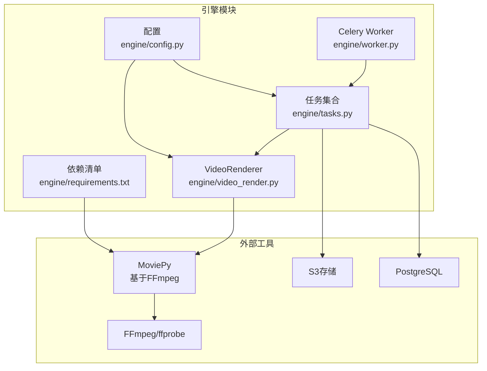
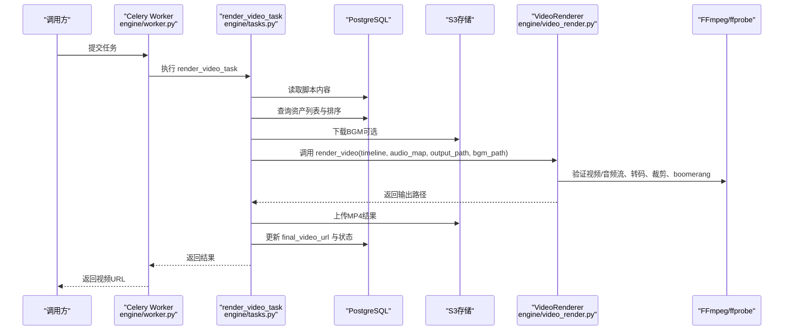
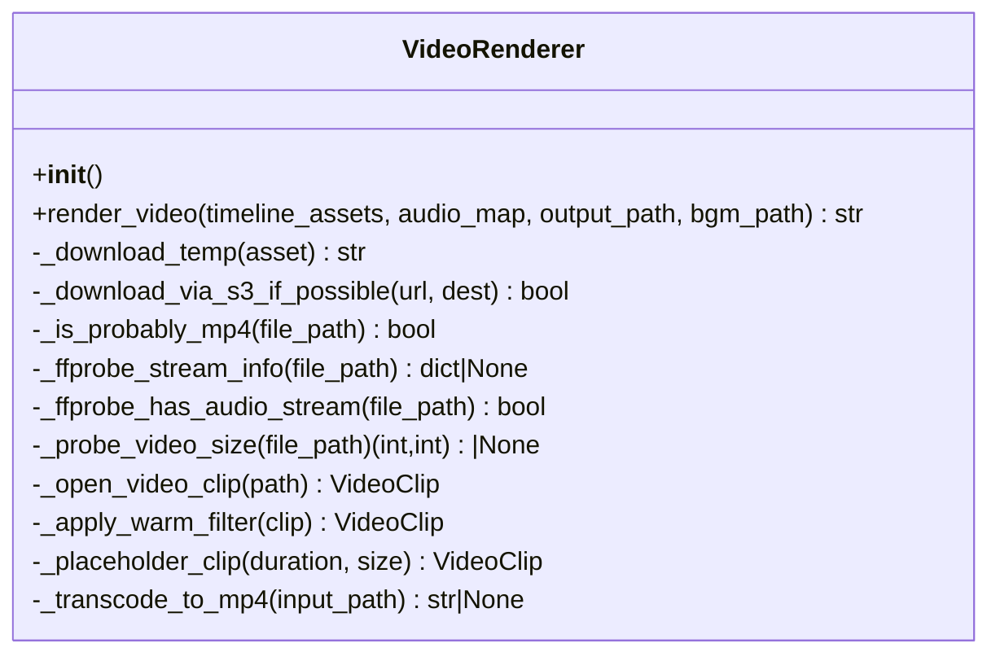
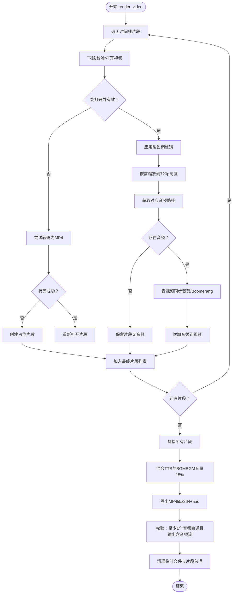
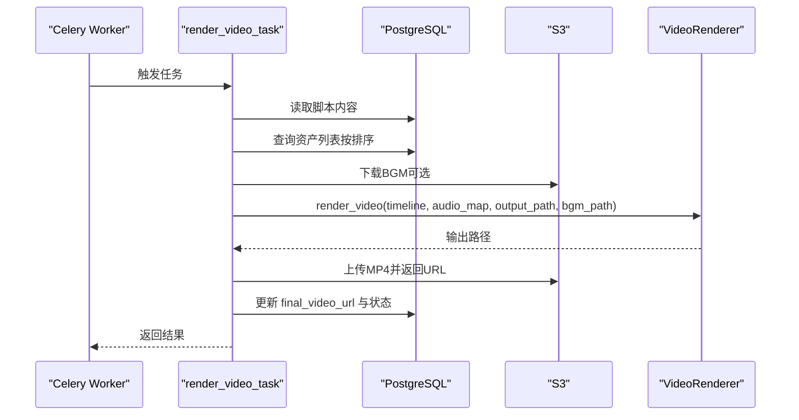
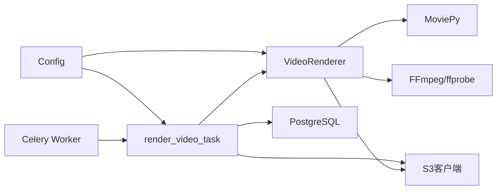

# 视频渲染模块

<cite>
**本文引用的文件列表**
- [engine/video_render.py](file://engine/video_render.py)
- [engine/tasks.py](file://engine/tasks.py)
- [engine/worker.py](file://engine/worker.py)
- [engine/config.py](file://engine/config.py)
- [engine/requirements.txt](file://engine/requirements.txt)
</cite>

## 目录
1. [简介](#简介)
2. [项目结构](#项目结构)
3. [核心组件](#核心组件)
4. [架构总览](#架构总览)
5. [详细组件分析](#详细组件分析)
6. [依赖关系分析](#依赖关系分析)
7. [性能考量](#性能考量)
8. [故障排查指南](#故障排查指南)
9. [结论](#结论)

## 简介
本文件面向开发者，系统性解析视频渲染模块的技术实现，重点围绕 engine/video_render.py 中的 VideoRenderer 类，说明其如何基于 MoviePy（底层调用 FFmpeg）完成：
- 时间线内视频片段的下载与预处理
- 全局暖色调滤镜应用
- 音视频同步策略：当视频时长与音频不一致时，采用“回旋镖”（boomerang）方式循环播放视频以匹配音频长度
- 片段拼接与输出
- 解说音频与背景音乐（BGM）混合，并将 BGM 音量调整为 15%

同时，文档阐述 render_video_task 任务如何与该模块集成，完成最终视频的渲染、上传与数据库状态更新，并提供性能优化与故障排查建议，尤其是针对音视频流缺失等常见问题。

## 项目结构
视频渲染相关代码主要位于 engine 子目录：
- engine/video_render.py：定义 VideoRenderer 类，封装视频下载、裁剪、滤镜、boomerang 同步、拼接、混音与写盘等全流程
- engine/tasks.py：包含 Celery 任务，如 render_video_task、render_pipeline_task 等，负责从数据库拉取脚本与资产、生成对齐音频、调用 VideoRenderer 渲染、上传并更新项目状态
- engine/worker.py：Celery 应用初始化与日志上下文注入
- engine/config.py：环境变量配置，包括存储、队列、智能拆分等参数
- engine/requirements.txt：运行依赖，含 moviepy、ffmpeg、ffprobe 等

图表来源
- [engine/video_render.py](file://engine/video_render.py#L1-L526)
- [engine/tasks.py](file://engine/tasks.py#L978-L1062)
- [engine/worker.py](file://engine/worker.py#L83-L137)
- [engine/config.py](file://engine/config.py#L1-L46)
- [engine/requirements.txt](file://engine/requirements.txt#L1-L30)

章节来源
- [engine/video_render.py](file://engine/video_render.py#L1-L526)
- [engine/tasks.py](file://engine/tasks.py#L978-L1062)
- [engine/worker.py](file://engine/worker.py#L83-L137)
- [engine/config.py](file://engine/config.py#L1-L46)
- [engine/requirements.txt](file://engine/requirements.txt#L1-L30)

## 核心组件
- VideoRenderer：封装视频渲染全流程，包括下载、校验、裁剪、滤镜、boomerang 同步、拼接、混音与写盘
- render_video_task：Celery 任务，负责拉取脚本与资产、生成对齐音频、调用 VideoRenderer 渲染、上传并更新数据库状态
- Celery Worker：承载任务执行、重试与日志上下文
- 配置：统一管理存储、队列、智能拆分、TTS 等参数

章节来源
- [engine/video_render.py](file://engine/video_render.py#L16-L448)
- [engine/tasks.py](file://engine/tasks.py#L978-L1062)
- [engine/worker.py](file://engine/worker.py#L83-L137)
- [engine/config.py](file://engine/config.py#L1-L46)

## 架构总览
下图展示 render_video_task 的端到端流程，以及与 VideoRenderer 的交互关系。

图表来源
- [engine/tasks.py](file://engine/tasks.py#L978-L1062)
- [engine/video_render.py](file://engine/video_render.py#L233-L448)
- [engine/worker.py](file://engine/worker.py#L83-L137)

## 详细组件分析

### VideoRenderer 类
VideoRenderer 是渲染的核心类，提供以下关键能力：
- S3 客户端初始化与对象键解析
- 多种下载策略：本地文件、S3 直接下载、HTTP 下载（带重试与校验）
- 视频探测与校验：ffprobe 流信息、是否存在音频流、是否为 MP4
- 视频打开与帧级可用性验证
- 暖色调滤镜应用（全局）
- boomerang 同步：视频短于音频时，通过正向+反向循环扩展至匹配长度
- 片段拼接与输出（libx264 + aac）
- 音频混合：合成 TTS 音频与 BGM（BGM 音量 15%）

图表来源
- [engine/video_render.py](file://engine/video_render.py#L16-L448)

章节来源
- [engine/video_render.py](file://engine/video_render.py#L16-L448)

### render_video 方法工作流程详解
render_video 的完整流程如下：
1) 根据时间线下载并处理视频片段
- 遍历 timeline_assets，按顺序下载每个片段
- 支持本地文件、S3 对象直下、HTTP 下载（带重试与校验）
- 下载后进行 MP4 校验与 ffprobe 探测，确保可读且有视频流
- 若无法打开或无视频流，尝试转码为 MP4 再打开；否则降级为占位片段

2) 应用暖色调滤镜
- 对每个有效片段应用暖色调滤镜（提升亮度与对比度，增加红通道、降低蓝通道）

3) 音视频同步逻辑（“回旋镖”）
- 以音频为主时钟：若视频更长则裁剪；若更短则使用 boomerang 循环扩展
- 为避免 time_mirror 在结尾 EOF 错误，先安全裁剪尾部一小段再反转
- 正向+反向交替拼接，累计时长直至覆盖音频长度，最后精确裁剪到目标时长

4) 将各片段拼接成最终视频
- 使用 MoviePy 的 concatenate_videoclips 进行拼接

5) 混合解说音频和背景音乐（BGM），并将 BGM 音量调整为 15%
- 若存在原始片段音频，加入合成轨道
- 加载 BGM，若短于总时长则循环，否则截断
- 将 BGM 音量乘以 0.15，合成后设置为最终视频音频

6) 输出与校验
- 写出 MP4（libx264 + aac，fps=24，preset=veryfast，threads=4）
- 最终校验：至少有一个音频轨道被附加；输出文件必须包含音频流

图表来源
- [engine/video_render.py](file://engine/video_render.py#L233-L448)

章节来源
- [engine/video_render.py](file://engine/video_render.py#L233-L448)

### render_video_task 任务集成
render_video_task 的职责与流程：
- 设置项目状态为 RENDERING
- 从数据库读取脚本内容，解析时间线资产，准备对齐音频映射
- 可选下载 BGM 并保存到临时文件
- 创建临时输出文件，调用 VideoRenderer.render_video 完成渲染
- 将结果上传到 S3，得到公共 URL
- 更新数据库字段 final_video_url，并将项目状态置为 COMPLETED
- 清理临时文件（输出视频、BGM）

图表来源
- [engine/tasks.py](file://engine/tasks.py#L978-L1062)

章节来源
- [engine/tasks.py](file://engine/tasks.py#L978-L1062)

## 依赖关系分析
- MoviePy 与 FFmpeg/ffprobe：用于视频/音频读取、裁剪、拼接、滤镜与写盘
- S3 客户端：支持直接从 S3 下载对象，或从公开 URL 推断对象键
- PostgreSQL：存储项目脚本、资产元数据与最终结果 URL
- Celery：异步任务调度与重试机制
- 日志上下文：通过 worker.py 注入 request_id、user_id、task_id，便于追踪

图表来源
- [engine/video_render.py](file://engine/video_render.py#L16-L448)
- [engine/tasks.py](file://engine/tasks.py#L978-L1062)
- [engine/worker.py](file://engine/worker.py#L83-L137)
- [engine/config.py](file://engine/config.py#L1-L46)

章节来源
- [engine/video_render.py](file://engine/video_render.py#L16-L448)
- [engine/tasks.py](file://engine/tasks.py#L978-L1062)
- [engine/worker.py](file://engine/worker.py#L83-L137)
- [engine/config.py](file://engine/config.py#L1-L46)

## 性能考量
- 编码参数
  - libx264 + veryfast 预设，兼顾速度与质量
  - FPS 固定为 24，保证播放一致性
  - 线程数设置为 4，充分利用多核 CPU
- 视频尺寸与分辨率
  - 默认将片段统一缩放至 720p 高度，减少后续编码压力
  - 若存在混合宽高比，可能产生黑边或缩放不一致，建议在上游阶段统一素材比例
- boomerang 循环次数限制
  - 为避免过长循环导致内存与时间开销过大，设置了最大时长上限（例如 60 秒）
- I/O 与网络
  - 优先使用 S3 直下，减少中间层转发
  - HTTP 下载具备重试与超时控制，但建议尽量使用 S3 或本地文件协议以降低延迟
- 音频混合
  - 合成前先对齐时长，避免重复循环造成额外开销
  - BGM 音量 15% 仅做乘法缩放，成本低且效果稳定

章节来源
- [engine/video_render.py](file://engine/video_render.py#L388-L448)
- [engine/requirements.txt](file://engine/requirements.txt#L1-L30)

## 故障排查指南
- 常见问题与定位
  - 输出无音频流：render_video 在写盘后会再次检查输出文件是否包含音频流，若失败会抛出异常。请确认：
    - 是否存在音频轨道（片段本身或 TTS 音频）
    - 是否正确附加了音频到视频
    - 写盘过程中未因权限或磁盘空间失败
  - 片段无法打开或时长为 0：_open_video_clip 会在打开失败或时长无效时抛错。请检查：
    - 下载是否成功且为有效 MP4
    - ffprobe 是否可用且能读取到视频流
    - 片段末帧读取是否异常（可能与编码有关）
  - 占位片段过多：当某片段无法打开或无视频流时，会降级为占位片段。请检查：
    - 原始素材是否损坏或缺少视频流
    - S3 对象键是否正确解析
  - boomerang 失败或结尾 EOF：_open_video_clip 已在开头与末尾做帧读取校验；在 boomerang 前会安全裁剪尾部一小段再反转，避免 EOF。若仍失败，请检查：
    - 片段末尾是否为关键帧边界
    - FFmpeg 版本与编解码器兼容性
- 重试与日志
  - render_video_task 与 generate_audio_task 等均具备指数退避重试机制，错误日志包含请求 ID、用户 ID、任务 ID 等上下文，便于定位问题
- 依赖与环境
  - 确保已安装 FFmpeg/ffprobe，并在 PATH 中可用
  - MoviePy 依赖 decorator、proglog、tqdm 等库，版本需与当前环境兼容

章节来源
- [engine/video_render.py](file://engine/video_render.py#L179-L204)
- [engine/video_render.py](file://engine/video_render.py#L298-L381)
- [engine/video_render.py](file://engine/video_render.py#L418-L431)
- [engine/tasks.py](file://engine/tasks.py#L978-L1062)
- [engine/worker.py](file://engine/worker.py#L83-L137)
- [engine/requirements.txt](file://engine/requirements.txt#L1-L30)

## 结论
VideoRenderer 通过 MoviePy/FFmpeg 实现了从下载、滤镜、同步到拼接与混音的一体化流程，render_video_task 则将其无缝接入到 Celery 异步流水线中，配合 S3 与 PostgreSQL 完成最终视频的生成、上传与状态更新。该方案在保证质量的同时兼顾性能，并提供了完善的错误检测与日志追踪能力。针对音视频流缺失等常见问题，建议优先检查下载与 ffprobe 校验、确保 boomerang 安全裁剪边界，以及在上游统一素材格式与分辨率，以获得更稳定的渲染结果。