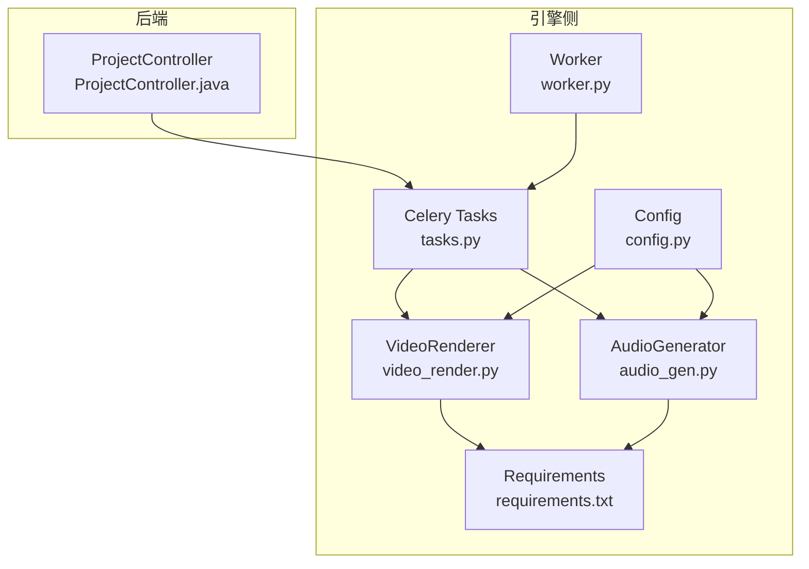
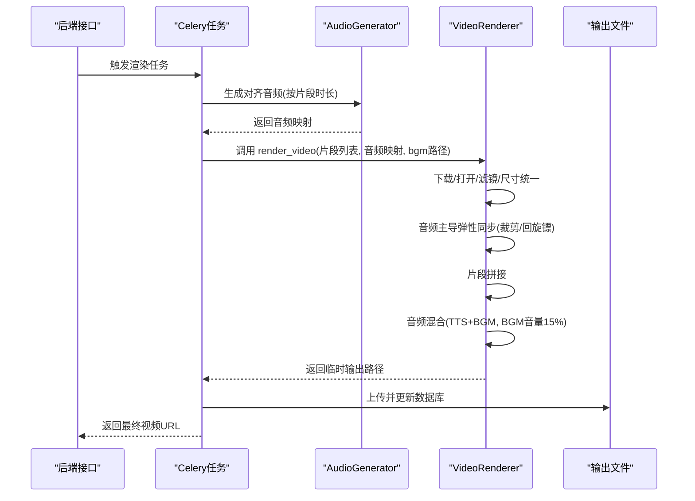
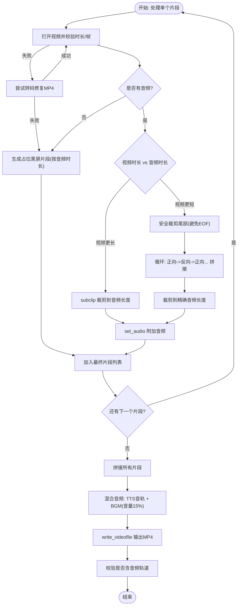
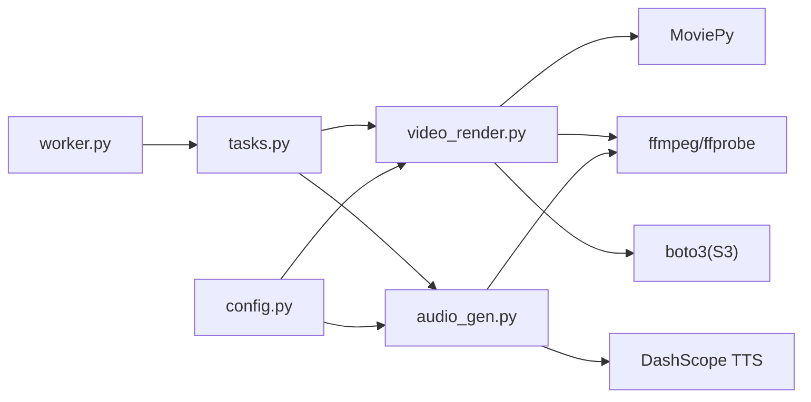

# 音视频同步与合成

<cite>
**本文引用的文件**
- [engine/video_render.py](file://engine/video_render.py)
- [engine/audio_gen.py](file://engine/audio_gen.py)
- [engine/tasks.py](file://engine/tasks.py)
- [engine/config.py](file://engine/config.py)
- [engine/requirements.txt](file://engine/requirements.txt)
- [engine/worker.py](file://engine/worker.py)
- [backend/src/main/java/com/aiscene/controller/ProjectController.java](file://backend/src/main/java/com/aiscene/controller/ProjectController.java)
</cite>

## 目录
1. [简介](#简介)
2. [项目结构](#项目结构)
3. [核心组件](#核心组件)
4. [架构总览](#架构总览)
5. [详细组件分析](#详细组件分析)
6. [依赖关系分析](#依赖关系分析)
7. [性能考量](#性能考量)
8. [故障排查指南](#故障排查指南)
9. [结论](#结论)

## 简介
本文件聚焦视频渲染模块中的音视频同步与合成机制，围绕 render_video 方法实现“以音频为主导”的弹性同步逻辑展开，详细说明当视频时长与音频不匹配时，采用“回旋镖”（boomerang）方式循环播放视频（正向->反向->正向...）以精确匹配音频时长；解释该逻辑在代码中的具体实现，包括使用 MoviePy 的 time_mirror 效果与安全的视频剪辑处理；阐述最终视频的合成流程，包括将处理后的视频片段拼接成完整视频，以及如何混合解说音频和背景音乐（BGM），并确保 BGM 音量被正确调整为 15%。最后提供针对音视频流缺失、时长不匹配等常见问题的调试与优化建议。

## 项目结构
- 引擎侧（Python）主要由以下模块组成：
  - 渲染器：负责下载、校验、裁剪、弹性同步、合成与输出
  - 音频生成：负责 TTS 文本对齐与时长适配
  - 任务编排：Celery 任务，协调脚本、音频、渲染全流程
  - 配置与依赖：环境变量、第三方库版本
- 后端（Java/Spring Boot）提供 API 控制入口，触发任务并管理状态

图表来源
- [engine/video_render.py](file://engine/video_render.py#L1-L526)
- [engine/audio_gen.py](file://engine/audio_gen.py#L1-L1059)
- [engine/tasks.py](file://engine/tasks.py#L978-L1061)
- [engine/config.py](file://engine/config.py#L1-L46)
- [engine/requirements.txt](file://engine/requirements.txt#L1-L30)
- [engine/worker.py](file://engine/worker.py#L83-L137)
- [backend/src/main/java/com/aiscene/controller/ProjectController.java](file://backend/src/main/java/com/aiscene/controller/ProjectController.java#L166-L195)

章节来源
- [engine/video_render.py](file://engine/video_render.py#L1-L526)
- [engine/audio_gen.py](file://engine/audio_gen.py#L1-L1059)
- [engine/tasks.py](file://engine/tasks.py#L978-L1061)
- [engine/config.py](file://engine/config.py#L1-L46)
- [engine/requirements.txt](file://engine/requirements.txt#L1-L30)
- [engine/worker.py](file://engine/worker.py#L83-L137)
- [backend/src/main/java/com/aiscene/controller/ProjectController.java](file://backend/src/main/java/com/aiscene/controller/ProjectController.java#L166-L195)

## 核心组件
- VideoRenderer.render_video
  - 负责逐片段下载、打开、滤镜、尺寸统一、音视频弹性同步、片段拼接、音轨混合与最终输出
- AudioGenerator.generate_aligned_audio_segments
  - 负责按视频片段时长预算生成 TTS 音频，并通过变速/补静音实现与视频时长对齐
- Celery 任务 render_video_task/render_pipeline_task
  - 协调脚本、音频、渲染与上传，贯穿“以音频为主导”的同步策略

章节来源
- [engine/video_render.py](file://engine/video_render.py#L233-L448)
- [engine/audio_gen.py](file://engine/audio_gen.py#L729-L910)
- [engine/tasks.py](file://engine/tasks.py#L978-L1061)

## 架构总览
渲染流程以“音频为主导”的弹性同步为核心，遵循以下步骤：
1. 读取时间轴资产与 TTS 对齐后的音频映射
2. 对每个片段：
   - 下载视频，尝试打开并应用滤镜
   - 若无音频，则生成占位黑屏片段
   - 若有音频：
     - 视频更长：裁剪到音频长度
     - 视频更短：使用 time_mirror 正向->反向->正向循环扩展，直至达到或接近音频长度，再裁剪
3. 片段拼接为完整视频
4. 音频混合：将已附着的 TTS 音轨与 BGM 混合，BGM 音量降至 15%
5. 输出 MP4 并进行完整性校验

图表来源
- [engine/tasks.py](file://engine/tasks.py#L978-L1061)
- [engine/audio_gen.py](file://engine/audio_gen.py#L729-L910)
- [engine/video_render.py](file://engine/video_render.py#L233-L448)

## 详细组件分析

### VideoRenderer.render_video：以音频为主导的弹性同步与合成
- 关键点
  - 音频主导：以音频时长为基准，视频时长与之对齐
  - 视频更长：直接 subclip 裁剪
  - 视频更短：采用“回旋镖”策略，先安全裁剪尾部避免 time_mirror EOF，再反复正向/反向拼接，直到达到或接近音频长度，最后裁剪到精确长度
  - 安全性：在应用 time_mirror 前对结尾进行微小裁剪，确保读帧稳定；若打开失败，尝试转码修复后再打开
  - 片段拼接：使用 MoviePy 的 concatenate_videoclips，方法为“compose”
  - 音频混合：将已有视频音轨与 BGM 混合，BGM 音量乘以 0.15；若 BGM 更短则循环至视频长度，否则截断
  - 输出校验：写入 MP4 后检查是否存在音频轨道，否则抛错

图表来源
- [engine/video_render.py](file://engine/video_render.py#L233-L448)

章节来源
- [engine/video_render.py](file://engine/video_render.py#L233-L448)

### AudioGenerator.generate_aligned_audio_segments：时长预算与对齐
- 关键点
  - 依据每个片段的“时长预算”生成 TTS 音频
  - 若音频比预算短：通过补静音拼接
  - 若音频比预算长：通过变速（speech_rate）压缩到预算范围内
  - 采用 DashScope TTS V2，支持 SSML 与语速控制，兼容降速上限
  - 生成完成后按顺序拼接为预览与最终渲染使用的音频

章节来源
- [engine/audio_gen.py](file://engine/audio_gen.py#L729-L910)

### Celery 任务：render_video_task 与 render_pipeline_task
- 关键点
  - render_video_task：拉取脚本，重新对齐音频，调用 VideoRenderer.render_video，上传并更新数据库
  - render_pipeline_task：一次性完成音频生成、预览拼接、渲染与上传
  - 两者均支持可选 BGM 下载与处理

章节来源
- [engine/tasks.py](file://engine/tasks.py#L978-L1061)
- [engine/tasks.py](file://engine/tasks.py#L1063-L1164)

### MoviePy 与外部工具链
- MoviePy
  - 视频：VideoFileClip、vfx.time_mirror、concatenate_videoclips、ColorClip
  - 音频：AudioFileClip、CompositeAudioClip、afx.audio_loop、volumex
- 外部工具
  - ffmpeg/ffprobe：下载、转码、探测、拼接与时长校验
  - boto3：S3 存储下载与上传

章节来源
- [engine/video_render.py](file://engine/video_render.py#L1-L526)
- [engine/audio_gen.py](file://engine/audio_gen.py#L249-L315)
- [engine/requirements.txt](file://engine/requirements.txt#L1-L30)

## 依赖关系分析
- 组件耦合
  - tasks.py 依赖 VideoRenderer 与 AudioGenerator，形成渲染流水线
  - VideoRenderer 依赖 MoviePy、ffmpeg/ffprobe、boto3
  - AudioGenerator 依赖 DashScope TTS SDK 与 ffmpeg
- 外部依赖
  - MoviePy 1.0.3、DashScope、opencv-python、numpy、scenedetect、boto3、psycopg2、sqlalchemy、redis/celery

图表来源
- [engine/tasks.py](file://engine/tasks.py#L978-L1061)
- [engine/video_render.py](file://engine/video_render.py#L1-L526)
- [engine/audio_gen.py](file://engine/audio_gen.py#L1-L1059)
- [engine/config.py](file://engine/config.py#L1-L46)
- [engine/worker.py](file://engine/worker.py#L83-L137)

章节来源
- [engine/tasks.py](file://engine/tasks.py#L978-L1061)
- [engine/video_render.py](file://engine/video_render.py#L1-L526)
- [engine/audio_gen.py](file://engine/audio_gen.py#L1-L1059)
- [engine/config.py](file://engine/config.py#L1-L46)
- [engine/worker.py](file://engine/worker.py#L83-L137)

## 性能考量
- 渲染参数
  - 写入时使用 libx264 编码、aac 音频、fps=24、preset=veryfast、threads=4，兼顾速度与质量
- 同步策略
  - “回旋镖”扩展避免插值导致的重复帧过多，减少冗余数据
  - 安全裁剪尾部避免 time_mirror 在边界帧读取失败
- 音频混合
  - BGM 循环或截断前先计算长度，避免多余处理
- I/O 与存储
  - 优先从 S3 直接下载，必要时本地临时文件清理
  - 预览与最终输出分别处理，避免重复拼接

章节来源
- [engine/video_render.py](file://engine/video_render.py#L418-L431)
- [engine/tasks.py](file://engine/tasks.py#L1063-L1164)

## 故障排查指南
- 常见问题与定位
  - 视频打开失败或时长为 0：检查下载是否成功、文件是否为 MP4、ffprobe 是否能解析
  - time_mirror EOF 或帧读取异常：确认已对结尾进行安全裁剪
  - 无音频轨道：写入后校验失败，检查是否为纯视频或编码问题
  - BGM 未生效：确认 BGM 文件存在、时长处理逻辑（循环/截断）、音量乘法
  - TTS 与视频时长不一致：检查 generate_aligned_audio_segments 的变速/补静音逻辑
- 建议
  - 在开发环境开启日志，关注下载、转码、拼接、写入阶段的错误
  - 对于长视频，适当降低“回旋镖”扩展上限，避免过长处理时间
  - 使用本地文件协议（file://）可减少网络抖动带来的下载失败
  - 对于 S3 资源，确保公共 URL 与桶名匹配，避免解析失败

章节来源
- [engine/video_render.py](file://engine/video_render.py#L143-L204)
- [engine/video_render.py](file://engine/video_render.py#L324-L366)
- [engine/video_render.py](file://engine/video_render.py#L390-L415)
- [engine/video_render.py](file://engine/video_render.py#L418-L431)
- [engine/audio_gen.py](file://engine/audio_gen.py#L820-L888)
- [engine/tasks.py](file://engine/tasks.py#L1063-L1164)

## 结论
本模块通过“以音频为主导”的弹性同步策略，结合 MoviePy 的 time_mirror 与安全剪辑，实现了视频与音频的高精度对齐；在合成阶段，通过 TTS 音轨与 BGM 的混合与音量控制，保证最终成品的听觉一致性。配合 Celery 任务编排与 S3 存储，形成可扩展、可验证的渲染流水线。针对常见问题，建议从下载/转码、边界帧处理、时长对齐与输出校验四个维度进行排查与优化。