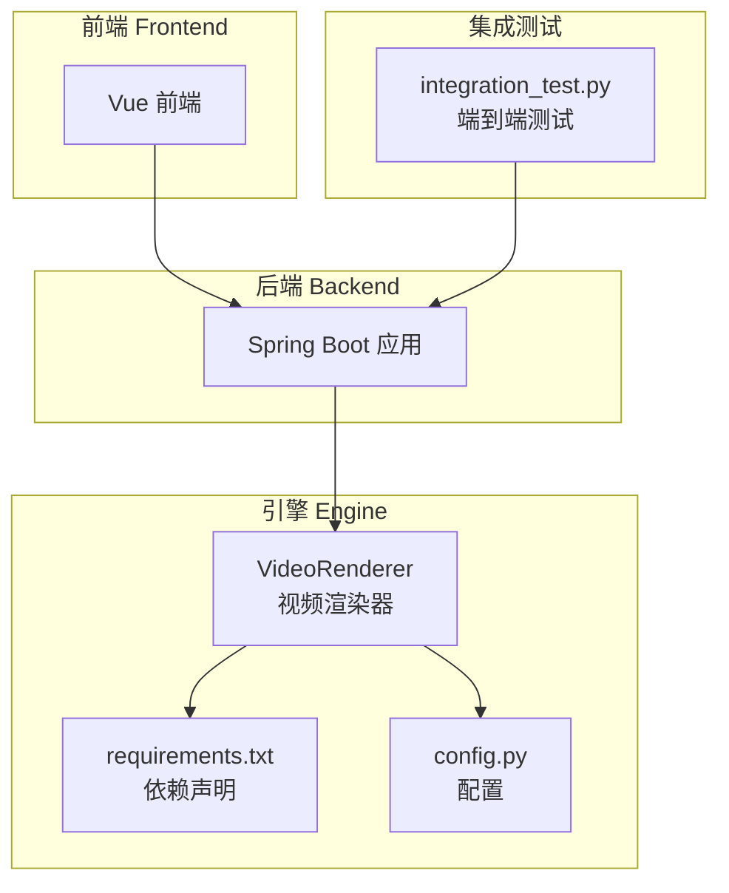
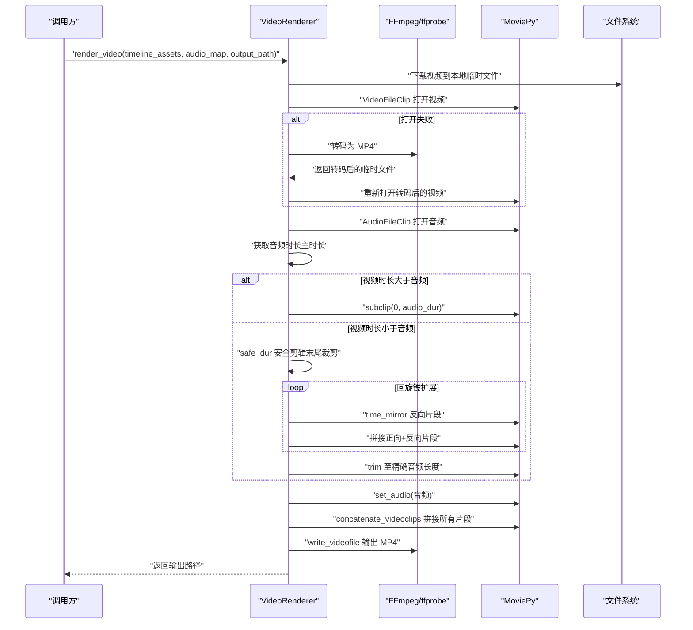
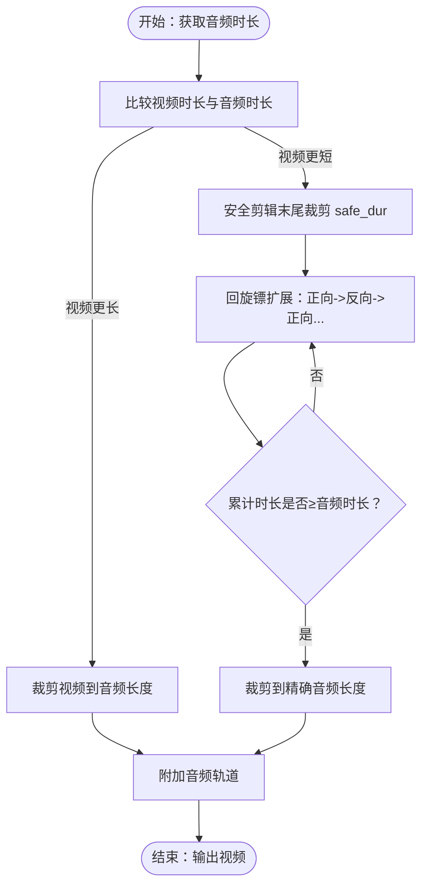
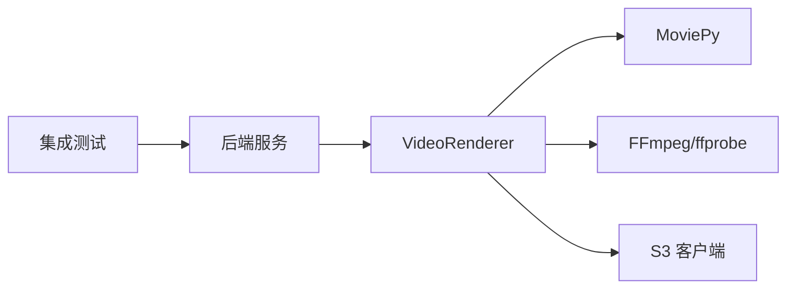

# 音视频同步逻辑

<cite>
**本文引用的文件**
- [engine/video_render.py](file://engine/video_render.py)
- [engine/requirements.txt](file://engine/requirements.txt)
- [engine/config.py](file://engine/config.py)
- [integration_test.py](file://integration_test.py)
</cite>

## 目录
1. [引言](#引言)
2. [项目结构](#项目结构)
3. [核心组件](#核心组件)
4. [架构总览](#架构总览)
5. [详细组件分析](#详细组件分析)
6. [依赖关系分析](#依赖关系分析)
7. [性能考量](#性能考量)
8. [故障排查指南](#故障排查指南)
9. [结论](#结论)

## 引言
本文件聚焦于音视频同步逻辑的实现机制，尤其是 render_video 方法中“以音频为主导”的弹性同步策略。当视频时长与音频不匹配时，系统通过“回旋镖”（boomerang）方式循环播放视频片段（正向->反向->正向...），并利用 MoviePy 的 time_mirror 效果实现视频反向播放；同时，为避免 FFmpeg 在视频末尾读取失败，系统对视频进行安全剪辑（safe_dur）处理。文档还提供针对视频损坏、时长计算错误等常见问题的调试建议，以及优化同步性能的实践指导。

## 项目结构
- 后端服务位于 backend/，包含 Java Spring Boot 应用，负责项目管理、任务队列调度等。
- 引擎位于 engine/，包含 Python 视频渲染、音频生成、任务编排等模块。
- 前端位于 frontend/，提供用户界面与交互。
- 文档位于 docs/，包含技术文档与设计说明。
- 集成测试位于根目录，验证端到端流程与输出质量。

图表来源
- [engine/video_render.py](file://engine/video_render.py#L1-L526)
- [engine/requirements.txt](file://engine/requirements.txt#L1-L30)
- [engine/config.py](file://engine/config.py#L1-L46)
- [integration_test.py](file://integration_test.py#L1-L305)

章节来源
- [engine/video_render.py](file://engine/video_render.py#L1-L526)
- [engine/requirements.txt](file://engine/requirements.txt#L1-L30)
- [engine/config.py](file://engine/config.py#L1-L46)
- [integration_test.py](file://integration_test.py#L1-L305)

## 核心组件
- VideoRenderer：负责下载视频、打开视频、应用滤镜、弹性同步、拼接与写入输出。
- MoviePy：用于视频/音频编辑、时间镜像（time_mirror）、子剪辑（subclip）、拼接（concatenate_videoclips）等。
- FFmpeg/ffprobe：用于转码、探测视频尺寸与音频流、校验输出是否含音频流。
- Celery/Redis：后端任务队列，触发渲染任务。

章节来源
- [engine/video_render.py](file://engine/video_render.py#L1-L526)
- [engine/requirements.txt](file://engine/requirements.txt#L1-L30)
- [engine/config.py](file://engine/config.py#L1-L46)

## 架构总览
渲染流程概览：
- 接收时间轴资产列表与音频映射表，逐个下载并打开视频。
- 若视频打开失败，尝试转码为 MP4 并再次打开。
- 获取音频时长作为主时长基准，执行弹性同步：
  - 视频更长：裁剪至音频长度；
  - 视频更短：使用“回旋镖”扩展（正向->反向->正向...），并在末尾做安全剪辑（safe_dur）避免 time_mirror 失败。
- 将音频附加到视频轨道，最终合成并写入输出文件。

图表来源
- [engine/video_render.py](file://engine/video_render.py#L233-L448)

章节来源
- [engine/video_render.py](file://engine/video_render.py#L233-L448)

## 详细组件分析

### render_video 中的弹性同步策略
- 主从关系：以音频时长为主（Master），视频时长为从（Slave）。
- 裁剪策略：当视频时长 ≥ 音频时长，直接裁剪视频到音频长度。
- 扩展策略：当视频时长 < 音频时长，采用“回旋镖”扩展：
  - 先对视频末尾进行安全剪辑（safe_dur），避免 time_mirror 在精确时长处读取失败；
  - 循环拼接“正向片段 + 反向片段”，交替方向，直到总时长接近或超过音频时长；
  - 最终将拼接结果裁剪到精确音频长度。

图表来源
- [engine/video_render.py](file://engine/video_render.py#L298-L366)

章节来源
- [engine/video_render.py](file://engine/video_render.py#L298-L366)

### MoviePy time_mirror 实现反向播放
- 使用 MoviePy 的 time_mirror 效果对视频片段进行反向播放，形成“回旋镖”循环。
- 该效果与正向片段交替拼接，实现“正向->反向->正向...”的无缝循环。

章节来源
- [engine/video_render.py](file://engine/video_render.py#L344-L354)

### 安全剪辑（safe_dur）避免 FFmpeg 读取失败
- 在执行 time_mirror 前，对视频末尾进行安全剪辑，避免在精确时长处读取失败。
- safe_dur 的计算保留最小安全余量，确保反向帧读取成功。

章节来源
- [engine/video_render.py](file://engine/video_render.py#L332-L337)

### 视频打开与完整性校验
- 打开视频时，会验证起始帧与末尾帧可读性，防止 time_mirror 或后续操作崩溃。
- 若打开失败，尝试转码为 MP4 再次打开；若仍失败则降级为占位片段。

章节来源
- [engine/video_render.py](file://engine/video_render.py#L179-L204)
- [engine/video_render.py](file://engine/video_render.py#L301-L319)

### 音频混合与背景音乐处理
- 将已合成的视频音频与背景音乐（BGM）混合，按需循环或裁剪至最终长度，并调整音量比例。
- 若最终输出不含音频流，将抛出异常提示。

章节来源
- [engine/video_render.py](file://engine/video_render.py#L390-L415)
- [engine/video_render.py](file://engine/video_render.py#L427-L431)

## 依赖关系分析
- MoviePy：提供视频/音频编辑能力（VideoFileClip、AudioFileClip、vfx.time_mirror、concatenate_videoclips 等）。
- FFmpeg/ffprobe：提供转码、探测与输出校验能力。
- Celery/Redis：后端任务队列，触发渲染任务。
- S3 客户端：从对象存储下载视频资源。

图表来源
- [engine/video_render.py](file://engine/video_render.py#L1-L526)
- [engine/requirements.txt](file://engine/requirements.txt#L1-L30)
- [integration_test.py](file://integration_test.py#L1-L305)

章节来源
- [engine/video_render.py](file://engine/video_render.py#L1-L526)
- [engine/requirements.txt](file://engine/requirements.txt#L1-L30)
- [integration_test.py](file://integration_test.py#L1-L305)

## 性能考量
- 时间复杂度与空间复杂度
  - 弹性同步阶段：视频更长时为 O(1) 裁剪；视频更短时为 O(k) 拼接（k 为扩展轮数），受音频时长与视频时长差值影响。
  - MoviePy 操作：time_mirror、subclip、concatenate_videoclips 为 O(n)（n 为帧数或片段数）。
- I/O 与内存
  - 多个临时文件被创建与清理，注意磁盘空间与并发任务数量。
  - 写入输出时使用多线程编码参数，可提升速度但需平衡 CPU 占用。
- 优化建议
  - 预估音频时长，尽量减少“回旋镖”扩展轮数；
  - 对大视频先进行安全剪辑（safe_dur），降低 time_mirror 失败概率；
  - 合理设置输出分辨率与编码参数，避免过度重编码；
  - 控制并发任务数量，避免磁盘与 CPU 抖动。

[本节为通用性能讨论，不直接分析具体文件]

## 故障排查指南
- 常见问题与定位
  - 视频打开失败或时长为 0：检查源视频是否损坏、格式是否受支持；必要时启用转码后再打开。
  - time_mirror 在末尾读取失败：确认已执行 safe_dur 安全剪辑；若仍失败，适当增大安全余量。
  - 输出无音频流：检查音频是否成功附加；若最终输出不含音频流，将抛出异常。
  - 音频与视频不同步：核对音频时长来源与视频时长来源是否一致；确保使用同一时间基准。
- 调试步骤
  - 使用 ffprobe 验证视频与音频元数据与时长；
  - 在渲染前打印关键时长（音频时长、视频时长、扩展轮数、最终时长）；
  - 逐步注释掉部分处理逻辑，缩小问题范围；
  - 使用集成测试脚本验证端到端输出是否包含音频流。
- 相关实现参考
  - 音频时长探测与输出校验：参见输出校验与音频时长探测相关逻辑。
  - 完整渲染流程与异常抛出：参见渲染主流程与最终校验。

章节来源
- [engine/video_render.py](file://engine/video_render.py#L390-L431)
- [engine/video_render.py](file://engine/video_render.py#L427-L431)
- [integration_test.py](file://integration_test.py#L156-L200)

## 结论
本实现以音频为主导，通过“回旋镖”扩展与安全剪辑（safe_dur）有效解决视频与音频时长不匹配的问题。MoviePy 的 time_mirror 提供了简洁高效的反向播放能力，配合裁剪与拼接，可在保证稳定性的同时实现高精度同步。结合 FFmpeg/ffprobe 的探测与校验，系统能够稳健地输出符合要求的音视频文件。针对常见问题，建议优先检查视频完整性、安全剪辑策略与音频时长一致性，并通过集成测试快速验证输出质量。