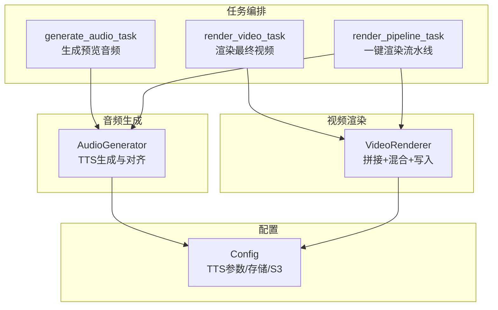
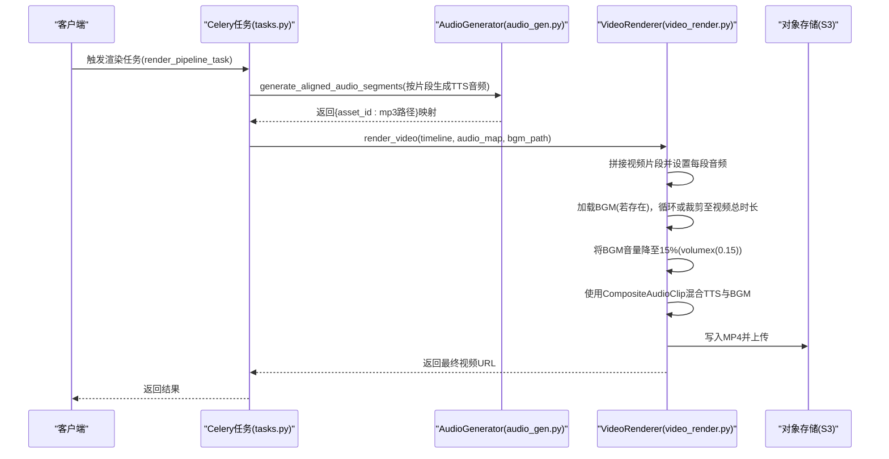
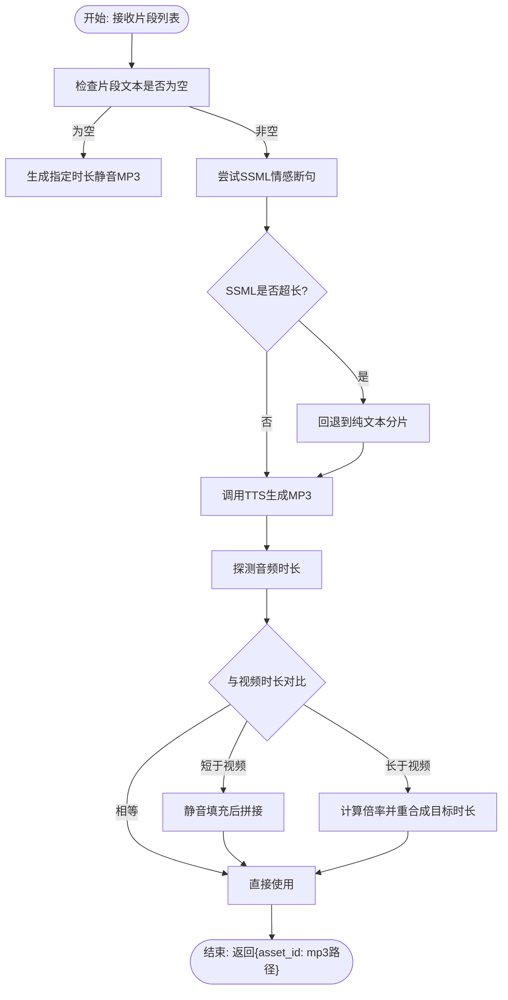
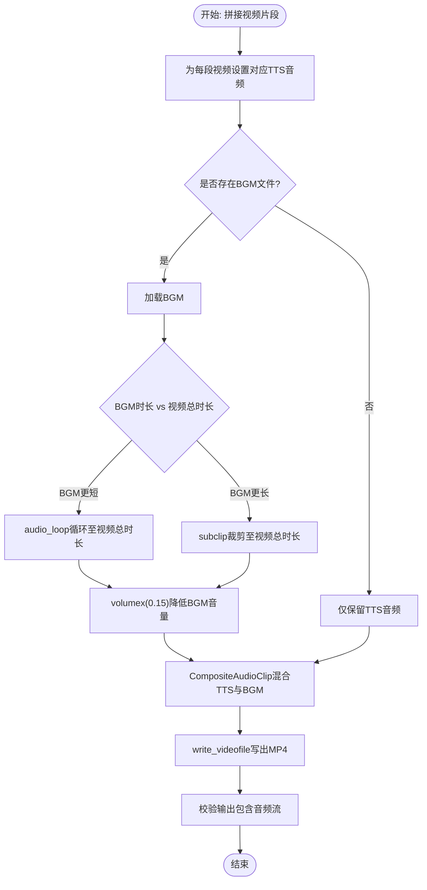
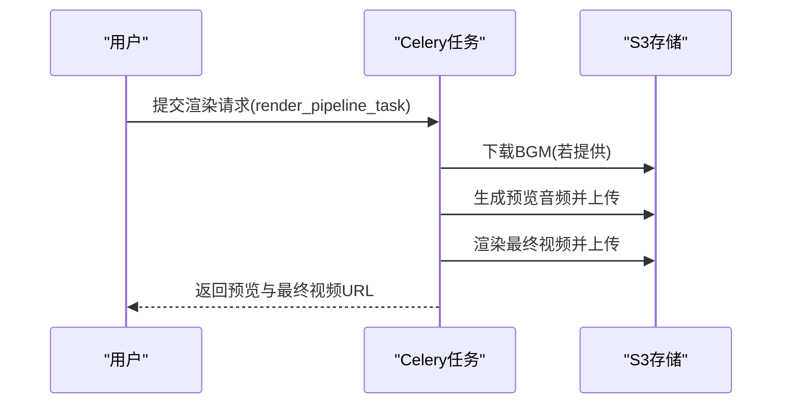
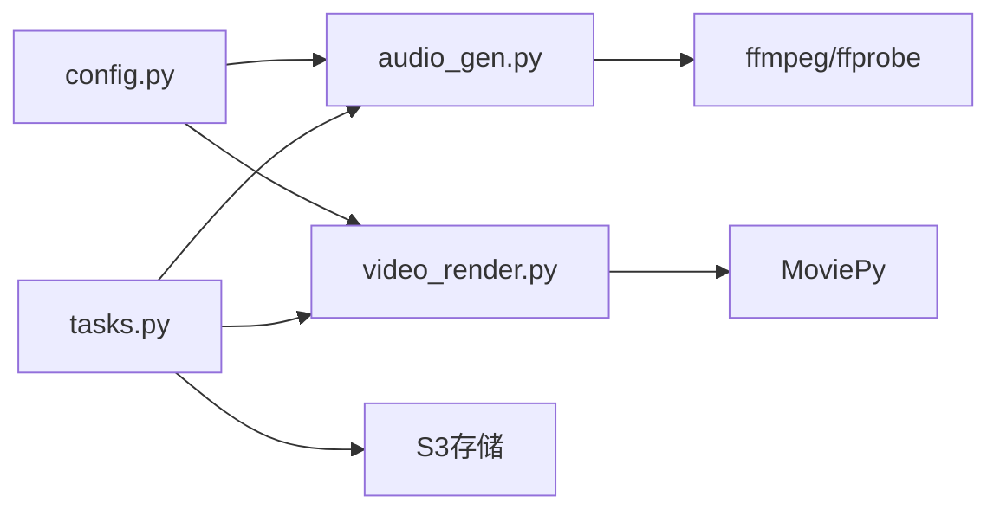

# 音频混合与BGM处理

<cite>
**本文引用的文件**
- [engine/audio_gen.py](file://engine/audio_gen.py)
- [engine/video_render.py](file://engine/video_render.py)
- [engine/tasks.py](file://engine/tasks.py)
- [engine/config.py](file://engine/config.py)
</cite>

## 目录
1. [简介](#简介)
2. [项目结构](#项目结构)
3. [核心组件](#核心组件)
4. [架构总览](#架构总览)
5. [详细组件分析](#详细组件分析)
6. [依赖关系分析](#依赖关系分析)
7. [性能考量](#性能考量)
8. [故障排查指南](#故障排查指南)
9. [结论](#结论)

## 简介
本章节聚焦最终视频渲染阶段的“音频混合与BGM处理”。目标是：
- 解释如何将TTS生成的解说音频与背景音乐（BGM）进行合成；
- 说明使用CompositeAudioClip进行多音轨混合的具体实现；
- 讲解如何通过volumex(0.15)将BGM音量降低至15%，确保解说清晰可听；
- 当BGM缺失或长度与视频不一致时，系统如何通过循环（audio_loop）或裁剪（subclip）适配视频时长；
- 结合audio_gen.py中的TTS生成逻辑，梳理从文本到音频流的完整处理流程；
- 提供处理音频格式不兼容、音轨丢失等常见问题的解决方案。

## 项目结构
围绕音频混合与BGM处理的关键文件如下：
- engine/audio_gen.py：负责TTS文本到MP3音频的生成与对齐，支持分段、SSML、语速调节、静音填充与拼接。
- engine/video_render.py：负责视频片段拼接与最终写入，包含音频混合（TTS+BGM）与BGM循环/裁剪逻辑。
- engine/tasks.py：Celery任务编排层，协调脚本解析、音频生成、BGM下载与最终渲染。
- engine/config.py：读取环境变量，控制TTS引擎、模型、语音、SSML开关、音量与语速等参数。

图表来源
- [engine/tasks.py](file://engine/tasks.py#L907-L1148)
- [engine/audio_gen.py](file://engine/audio_gen.py#L717-L1059)
- [engine/video_render.py](file://engine/video_render.py#L233-L448)
- [engine/config.py](file://engine/config.py#L1-L46)

章节来源
- [engine/tasks.py](file://engine/tasks.py#L907-L1148)
- [engine/audio_gen.py](file://engine/audio_gen.py#L717-L1059)
- [engine/video_render.py](file://engine/video_render.py#L233-L448)
- [engine/config.py](file://engine/config.py#L1-L46)

## 核心组件
- AudioGenerator（TTS生成器）
  - 负责将脚本分段映射到各视频片段的音频，保证每段音频时长与视频时长对齐；
  - 支持SSML情感化断句、分片调用、静音填充、速度调节、失败回退与拼接；
  - 输出每个片段对应的MP3路径，供后续视频渲染阶段使用。
- VideoRenderer（视频渲染器）
  - 按时间轴拼接视频片段并设置对应音频；
  - 在最终阶段将已有视频音频与BGM进行混合，采用CompositeAudioClip；
  - 对BGM进行循环或裁剪以适配视频总时长，并将BGM音量降至15%以突出TTS。
- Celery任务（tasks.py）
  - generate_audio_task：生成预览音频并上传，便于用户审听；
  - render_video_task：下载BGM、生成对齐音频、渲染最终视频并上传；
  - render_pipeline_task：一体化流程，先生成预览音频再渲染最终视频。
- 配置（config.py）
  - 控制TTS引擎、模型、语音、SSML开关、音量与语速等关键参数。

章节来源
- [engine/audio_gen.py](file://engine/audio_gen.py#L717-L1059)
- [engine/video_render.py](file://engine/video_render.py#L233-L448)
- [engine/tasks.py](file://engine/tasks.py#L907-L1148)
- [engine/config.py](file://engine/config.py#L1-L46)

## 架构总览
下面的序列图展示了从脚本到最终视频的音频混合与BGM处理流程：

图表来源
- [engine/tasks.py](file://engine/tasks.py#L1064-L1148)
- [engine/audio_gen.py](file://engine/audio_gen.py#L717-L1059)
- [engine/video_render.py](file://engine/video_render.py#L233-L448)

## 详细组件分析

### 组件A：TTS生成与对齐（AudioGenerator）
- 分段对齐策略
  - 输入为按时间轴排序的片段列表，每个片段包含文本、期望时长与asset_id；
  - 若文本为空，直接生成指定时长的静音MP3；
  - 若文本非空，优先尝试SSML情感断句；若SSML超长则回退纯文本；
  - 对于时长不匹配的情况：
    - 若音频比视频短，使用静音填充后拼接；
    - 若音频比视频长，计算倍率并以不超过1.25的速度重合成目标时长；
  - 最终输出每个asset_id对应的MP3文件路径，供视频渲染阶段使用。
- SSML与断句
  - 将中文标点转换为break标签，分布总静默时长；
  - 自动识别并修正无效参数错误，必要时回退到非SSML模式。
- 失败处理
  - 对TTS返回空音频或无效音频进行告警与重试；
  - 记录请求ID与错误分类，便于定位问题。

图表来源
- [engine/audio_gen.py](file://engine/audio_gen.py#L717-L1059)

章节来源
- [engine/audio_gen.py](file://engine/audio_gen.py#L717-L1059)

### 组件B：视频渲染与音频混合（VideoRenderer）
- 视频拼接与对齐
  - 下载并打开每个视频片段，应用暖色滤镜；
  - 若某片段无音频，则生成占位黑屏片段以保持时序；
  - 若有音频，以音频为主时基进行弹性对齐：视频更长则裁剪，更短则通过time_mirror循环扩展后裁剪到精确时长。
- 音频混合（TTS + BGM）
  - 若视频已有音频，将其加入音轨列表；
  - 若提供BGM文件且存在：
    - 若BGM时长短于视频，使用audio_loop循环至视频总时长；
    - 否则使用subclip裁剪至视频总时长；
    - 将BGM音量降至15%（volumex(0.15)），确保TTS清晰可闻；
  - 使用CompositeAudioClip将所有音轨合并为最终音频并设置到视频。
- 写出与校验
  - 使用ffmpeg编码写出MP4，校验输出是否包含音频流；
  - 清理临时文件与已关闭的剪辑对象。

图表来源
- [engine/video_render.py](file://engine/video_render.py#L233-L448)

章节来源
- [engine/video_render.py](file://engine/video_render.py#L233-L448)

### 组件C：任务编排与BGM下载（tasks.py）
- generate_audio_task
  - 解析脚本与资产，生成对齐音频；
  - 将各片段音频按顺序拼接为预览MP3并上传S3。
- render_video_task
  - 下载BGM（若提供），生成对齐音频；
  - 调用VideoRenderer完成最终渲染与上传。
- render_pipeline_task
  - 串联“生成预览音频”和“渲染最终视频”，统一管理状态与资源清理。

图表来源
- [engine/tasks.py](file://engine/tasks.py#L907-L1148)

章节来源
- [engine/tasks.py](file://engine/tasks.py#L907-L1148)

## 依赖关系分析
- AudioGenerator依赖DashScope TTS SDK与本地ffmpeg/ffprobe工具，用于生成与验证音频；
- VideoRenderer依赖MoviePy（VideoFileClip、AudioFileClip、CompositeAudioClip、afx.audio_loop等）与ffmpeg/ffprobe；
- tasks.py作为编排层，协调S3下载、数据库状态更新与资源清理；
- config.py集中管理TTS引擎、模型、语音、SSML开关、音量与语速等参数。

图表来源
- [engine/config.py](file://engine/config.py#L1-L46)
- [engine/audio_gen.py](file://engine/audio_gen.py#L717-L1059)
- [engine/video_render.py](file://engine/video_render.py#L233-L448)
- [engine/tasks.py](file://engine/tasks.py#L907-L1148)

章节来源
- [engine/config.py](file://engine/config.py#L1-L46)
- [engine/audio_gen.py](file://engine/audio_gen.py#L717-L1059)
- [engine/video_render.py](file://engine/video_render.py#L233-L448)
- [engine/tasks.py](file://engine/tasks.py#L907-L1148)

## 性能考量
- TTS生成
  - 对长文本进行分片与SSML断句，避免单次请求超限；
  - 失败自动重试与回退策略，提升稳定性；
  - 使用静音填充与速度调节减少重复调用次数。
- 视频渲染
  - 以音频为主时基进行弹性对齐，避免画面撕裂；
  - BGM循环与裁剪在内存与CPU上开销可控；
  - 写出阶段使用多线程与较快预设，兼顾速度与质量。
- I/O与网络
  - BGM与视频下载采用S3直连或HTTP下载，失败重试；
  - 临时文件与剪辑对象及时清理，避免资源泄漏。

[本节为通用指导，不直接分析具体文件]

## 故障排查指南
- 常见问题与对策
  - BGM缺失或无法加载
    - 现象：日志警告“Failed to load BGM”；
    - 处理：确认BGM URL有效、网络可达；若提供本地文件请使用file://协议；必要时移除BGM参数。
  - BGM时长与视频不匹配
    - 现象：BGM过短导致播放提前结束，或过长导致末尾被截断；
    - 处理：系统会自动循环或裁剪，如仍异常，请检查BGM文件是否损坏或格式不受支持。
  - TTS生成失败或空音频
    - 现象：日志记录“tts.invalid_audio”、“tts.empty_audio”或“TTS failed”；
    - 处理：检查文本编码、SSML合法性、网络与API密钥；必要时回退到非SSML模式；重试或更换模型/语音。
  - 音频格式不兼容
    - 现象：输出MP4无音频流或播放异常；
    - 处理：确认TTS输出为MP3且时长有效；确保ffmpeg/ffprobe可用；检查写入参数与编码器。
  - 音轨丢失
    - 现象：最终视频无声；
    - 处理：检查是否有至少一个片段附带音频；确认VideoRenderer在混合阶段正确收集音轨并使用CompositeAudioClip。
- 关键检查点
  - ffmpeg/ffprobe安装与版本；
  - S3访问凭据与公共URL配置；
  - TTS引擎、模型、语音与SSML开关；
  - BGM文件格式与时长。

章节来源
- [engine/video_render.py](file://engine/video_render.py#L390-L448)
- [engine/audio_gen.py](file://engine/audio_gen.py#L921-L1059)
- [engine/tasks.py](file://engine/tasks.py#L1002-L1043)

## 结论
本系统通过“分段对齐+弹性对齐+多音轨混合”的方式，实现了高质量的视频与音频同步。TTS生成器确保每段音频时长与视频严格匹配，VideoRenderer在最终阶段将TTS与BGM进行混合，并通过volumex(0.15)将BGM音量降至15%，从而保障解说清晰可听。当BGM缺失或长度不匹配时，系统自动循环或裁剪以适配视频总时长。配合完善的错误处理与日志记录，整体流程具备良好的鲁棒性与可维护性。