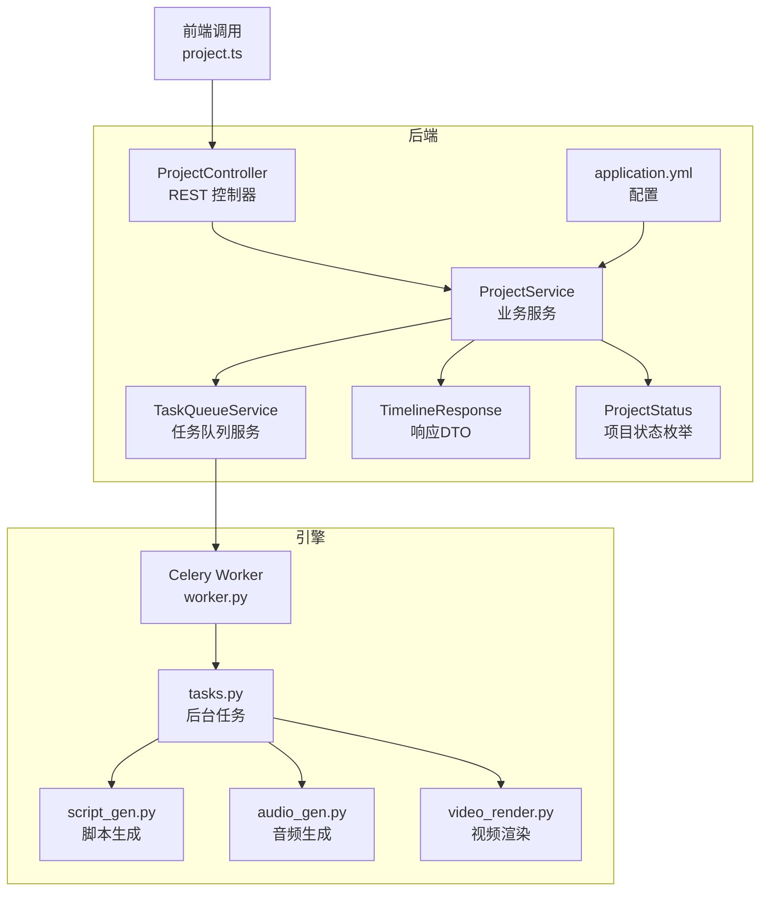
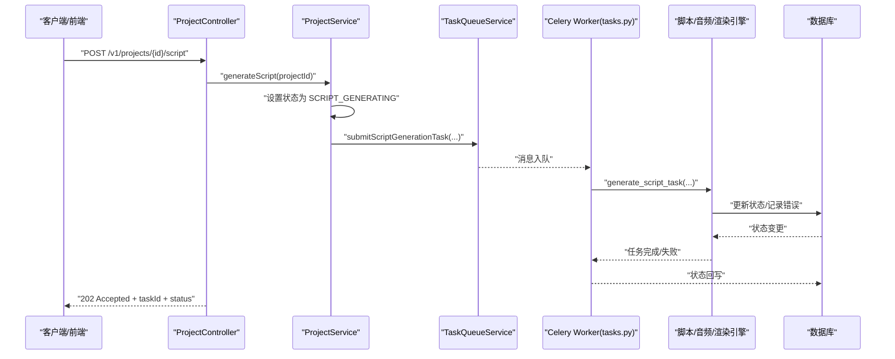
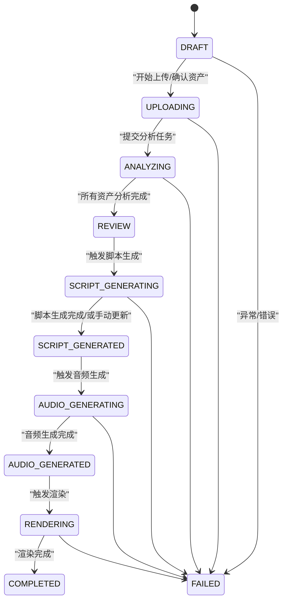
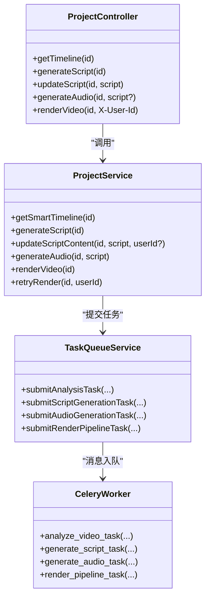

# AI处理流程API

<cite>
**本文引用的文件**
- [ProjectController.java](file://backend/src/main/java/com/aiscene/controller/ProjectController.java)
- [ProjectService.java](file://backend/src/main/java/com/aiscene/service/ProjectService.java)
- [TaskQueueService.java](file://backend/src/main/java/com/aiscene/service/TaskQueueService.java)
- [ProjectStatus.java](file://backend/src/main/java/com/aiscene/entity/ProjectStatus.java)
- [TimelineResponse.java](file://backend/src/main/java/com/aiscene/dto/TimelineResponse.java)
- [application.yml](file://backend/src/main/resources/application.yml)
- [tasks.py](file://engine/tasks.py)
- [script_gen.py](file://engine/script_gen.py)
- [audio_gen.py](file://engine/audio_gen.py)
- [video_render.py](file://engine/video_render.py)
- [worker.py](file://engine/worker.py)
- [project.ts](file://frontend/src/api/project.ts)
- [project.ts（store）](file://frontend/src/stores/project.ts)
- [README.md](file://README.md)
</cite>

## 目录
1. [简介](#简介)
2. [项目结构](#项目结构)
3. [核心组件](#核心组件)
4. [架构总览](#架构总览)
5. [详细组件分析](#详细组件分析)
6. [依赖关系分析](#依赖关系分析)
7. [性能考量](#性能考量)
8. [故障排查指南](#故障排查指南)
9. [结论](#结论)
10. [附录](#附录)

## 简介
本文件面向“从场景分析到视频渲染”的端到端AI处理流程，聚焦后端REST API与引擎流水线的协作方式，覆盖以下关键接口：
- GET /v1/projects/{id}/timeline：获取AI生成的智能时间线，返回TimelineResponse结构
- POST /v1/projects/{id}/script：触发脚本生成任务，返回任务ID与接受状态
- PUT /v1/projects/{id}/script：允许用户更新或修正生成的脚本内容（纯文本）
- POST /v1/projects/{id}/audio：生成音频解说（可选提供脚本内容）
- POST /v1/projects/{id}/render：启动视频渲染任务

同时，文档解释各状态（如SCRIPT_GENERATING）的流转逻辑，并给出任务触发后的状态轮询建议。

## 项目结构
后端采用Spring Boot，控制器位于controller包，服务层位于service包，实体与DTO位于entity与dto包；引擎侧使用Celery作为任务队列，Python模块负责视频理解、脚本生成、音频合成与视频渲染。

图表来源
- [ProjectController.java](file://backend/src/main/java/com/aiscene/controller/ProjectController.java#L1-L206)
- [ProjectService.java](file://backend/src/main/java/com/aiscene/service/ProjectService.java#L1-L356)
- [TaskQueueService.java](file://backend/src/main/java/com/aiscene/service/TaskQueueService.java#L1-L179)
- [TimelineResponse.java](file://backend/src/main/java/com/aiscene/dto/TimelineResponse.java#L1-L21)
- [ProjectStatus.java](file://backend/src/main/java/com/aiscene/entity/ProjectStatus.java#L1-L16)
- [application.yml](file://backend/src/main/resources/application.yml#L1-L66)
- [worker.py](file://engine/worker.py#L1-L99)
- [tasks.py](file://engine/tasks.py#L1-L1209)
- [script_gen.py](file://engine/script_gen.py#L1-L129)
- [audio_gen.py](file://engine/audio_gen.py#L1-L1059)
- [video_render.py](file://engine/video_render.py#L1-L526)
- [project.ts](file://frontend/src/api/project.ts#L1-L111)

章节来源
- [README.md](file://README.md#L1-L223)

## 核心组件
- REST控制器：提供项目管理、资产上传、脚本生成、音频生成、渲染等接口
- 业务服务：封装项目状态机、任务提交、数据准备与校验
- 任务队列服务：将任务序列化后推送到Redis队列，供Celery Worker消费
- 引擎任务：视频分析、脚本生成、音频合成、视频渲染
- 前端API封装：统一调用后端接口，便于状态轮询与UI展示

章节来源
- [ProjectController.java](file://backend/src/main/java/com/aiscene/controller/ProjectController.java#L1-L206)
- [ProjectService.java](file://backend/src/main/java/com/aiscene/service/ProjectService.java#L1-L356)
- [TaskQueueService.java](file://backend/src/main/java/com/aiscene/service/TaskQueueService.java#L1-L179)
- [worker.py](file://engine/worker.py#L1-L99)
- [tasks.py](file://engine/tasks.py#L1-L1209)
- [project.ts](file://frontend/src/api/project.ts#L1-L111)

## 架构总览
后端通过REST接口接收请求，将任务投递到Redis队列；引擎Worker监听队列并执行具体任务，期间通过数据库更新项目状态，最终由前端轮询状态完成全流程闭环。

图表来源
- [ProjectController.java](file://backend/src/main/java/com/aiscene/controller/ProjectController.java#L155-L165)
- [ProjectService.java](file://backend/src/main/java/com/aiscene/service/ProjectService.java#L143-L165)
- [TaskQueueService.java](file://backend/src/main/java/com/aiscene/service/TaskQueueService.java#L120-L179)
- [tasks.py](file://engine/tasks.py#L791-L860)
- [application.yml](file://backend/src/main/resources/application.yml#L60-L66)

## 详细组件分析

### 接口定义与行为

- GET /v1/projects/{id}/timeline
  - 功能：获取智能时间线，按场景优先级排序（若已分析），并返回脚本内容与当前状态
  - 返回：TimelineResponse（包含项目ID、标题、状态、错误信息、资产列表、脚本内容）
  - 关键实现：服务层读取资产并按场景优先级排序，构建响应对象
  - 状态影响：该接口不修改状态，仅读取

  章节来源
  - [ProjectController.java](file://backend/src/main/java/com/aiscene/controller/ProjectController.java#L139-L143)
  - [ProjectService.java](file://backend/src/main/java/com/aiscene/service/ProjectService.java#L86-L124)
  - [TimelineResponse.java](file://backend/src/main/java/com/aiscene/dto/TimelineResponse.java#L1-L21)

- POST /v1/projects/{id}/script
  - 功能：触发脚本生成任务
  - 请求体：无（或空）
  - 响应：202 Accepted，返回项目ID、任务ID、当前状态（通常为SCRIPT_GENERATING）、脚本内容（可能为空）
  - 关键实现：服务层设置状态为SCRIPT_GENERATING，提交脚本生成任务到队列
  - 状态影响：进入SCRIPT_GENERATING

  章节来源
  - [ProjectController.java](file://backend/src/main/java/com/aiscene/controller/ProjectController.java#L155-L165)
  - [ProjectService.java](file://backend/src/main/java/com/aiscene/service/ProjectService.java#L143-L165)
  - [TaskQueueService.java](file://backend/src/main/java/com/aiscene/service/TaskQueueService.java#L120-L179)

- PUT /v1/projects/{id}/script
  - 功能：允许用户更新或修正生成的脚本内容
  - 请求体：纯文本（text/plain）
  - 响应：202 Accepted（当成功更新）
  - 关键实现：服务层校验项目状态，禁止在音频生成或渲染中更新；成功后置为SCRIPT_GENERATED
  - 状态影响：进入SCRIPT_GENERATED（若未被锁定）

  章节来源
  - [ProjectController.java](file://backend/src/main/java/com/aiscene/controller/ProjectController.java#L167-L177)
  - [ProjectService.java](file://backend/src/main/java/com/aiscene/service/ProjectService.java#L178-L194)

- POST /v1/projects/{id}/audio
  - 功能：生成音频解说
  - 请求体：可选纯文本脚本；若未提供，则使用项目已有脚本内容
  - 响应：202 Accepted
  - 关键实现：服务层设置状态为AUDIO_GENERATING，提交音频生成任务
  - 状态影响：进入AUDIO_GENERATING

  章节来源
  - [ProjectController.java](file://backend/src/main/java/com/aiscene/controller/ProjectController.java#L179-L187)
  - [ProjectService.java](file://backend/src/main/java/com/aiscene/service/ProjectService.java#L167-L177)

- POST /v1/projects/{id}/render
  - 功能：启动视频渲染任务
  - 请求头：X-User-Id（可选，用于权限校验）
  - 响应：202 Accepted
  - 关键实现：服务层校验脚本与资产是否存在，原子性更新状态为RENDERING并提交渲染任务
  - 状态影响：进入RENDERING（若满足前置条件）

  章节来源
  - [ProjectController.java](file://backend/src/main/java/com/aiscene/controller/ProjectController.java#L189-L195)
  - [ProjectService.java](file://backend/src/main/java/com/aiscene/service/ProjectService.java#L196-L230)

### 状态机与流转逻辑

图表来源
- [ProjectStatus.java](file://backend/src/main/java/com/aiscene/entity/ProjectStatus.java#L1-L16)
- [ProjectService.java](file://backend/src/main/java/com/aiscene/service/ProjectService.java#L143-L230)
- [tasks.py](file://engine/tasks.py#L337-L463)

章节来源
- [ProjectStatus.java](file://backend/src/main/java/com/aiscene/entity/ProjectStatus.java#L1-L16)
- [ProjectService.java](file://backend/src/main/java/com/aiscene/service/ProjectService.java#L143-L230)

### 引擎任务与数据流

- 脚本生成
  - 触发：服务层提交脚本生成任务，携带房屋信息与时间线数据
  - 执行：引擎解析上下文，调用大模型生成结构化脚本
  - 更新：任务完成后回写状态与脚本内容

  章节来源
  - [ProjectService.java](file://backend/src/main/java/com/aiscene/service/ProjectService.java#L143-L165)
  - [tasks.py](file://engine/tasks.py#L791-L860)
  - [script_gen.py](file://engine/script_gen.py#L1-L129)

- 音频生成
  - 触发：服务层提交音频生成任务，携带脚本内容
  - 执行：引擎按片段时长与字数预算生成MP3音频，支持SSML与分段拼接
  - 更新：任务完成后回写状态

  章节来源
  - [ProjectService.java](file://backend/src/main/java/com/aiscene/service/ProjectService.java#L167-L177)
  - [tasks.py](file://engine/tasks.py#L1-L1209)
  - [audio_gen.py](file://engine/audio_gen.py#L1-L1059)

- 视频渲染
  - 触发：服务层提交渲染任务，携带脚本与资产清单
  - 执行：引擎下载视频、应用暖色滤镜、按音频弹性匹配、合成BGM并输出成品
  - 更新：任务完成后回写状态

  章节来源
  - [ProjectService.java](file://backend/src/main/java/com/aiscene/service/ProjectService.java#L196-L230)
  - [tasks.py](file://engine/tasks.py#L1-L1209)
  - [video_render.py](file://engine/video_render.py#L1-L526)

### 前端集成与状态轮询

- 前端API封装
  - 提供创建项目、上传资产、获取时间线、触发脚本/音频/渲染、更新脚本等方法
  - 使用X-User-Id进行权限校验（渲染接口）

- 状态轮询建议
  - 渲染完成后，前端可轮询项目详情接口以获取最终视频URL
  - 建议每2-5秒轮询一次，直到状态变为COMPLETED或出现错误

章节来源
- [project.ts](file://frontend/src/api/project.ts#L1-L111)
- [project.ts（store）](file://frontend/src/stores/project.ts#L1-L219)

## 依赖关系分析

图表来源
- [ProjectController.java](file://backend/src/main/java/com/aiscene/controller/ProjectController.java#L1-L206)
- [ProjectService.java](file://backend/src/main/java/com/aiscene/service/ProjectService.java#L1-L356)
- [TaskQueueService.java](file://backend/src/main/java/com/aiscene/service/TaskQueueService.java#L1-L179)
- [worker.py](file://engine/worker.py#L1-L99)

章节来源
- [ProjectController.java](file://backend/src/main/java/com/aiscene/controller/ProjectController.java#L1-L206)
- [ProjectService.java](file://backend/src/main/java/com/aiscene/service/ProjectService.java#L1-L356)
- [TaskQueueService.java](file://backend/src/main/java/com/aiscene/service/TaskQueueService.java#L1-L179)
- [worker.py](file://engine/worker.py#L1-L99)

## 性能考量
- 任务并发与重试
  - 引擎任务内置最大重试次数与指数退避策略，避免瞬时失败导致阻塞
- I/O优化
  - 视频下载与转码采用本地临时文件与分段处理，减少内存占用
  - 音频合成支持分段与拼接，降低单次请求负载
- 状态更新
  - 数据库状态更新采用原子性更新，避免竞态
- 配置项
  - Redis连接、队列名、上传限制、S3存储参数等均在配置文件中集中管理

章节来源
- [tasks.py](file://engine/tasks.py#L1-L1209)
- [application.yml](file://backend/src/main/resources/application.yml#L1-L66)

## 故障排查指南
- 常见错误与定位
  - 项目状态为FAILED：检查错误日志字段（错误任务ID、步骤、发生时间），定位具体环节
  - 渲染失败：确认脚本内容与资产是否齐全，音频是否成功生成
  - 脚本/音频/渲染被拒绝：检查项目状态是否处于处理中（如AUDIO_GENERATING、RENDERING）

- 建议排查步骤
  - 通过项目详情接口查看状态与错误字段
  - 在引擎日志中搜索对应任务ID与请求ID
  - 校验资产URL可访问性与S3存储配置

章节来源
- [tasks.py](file://engine/tasks.py#L418-L463)
- [ProjectService.java](file://backend/src/main/java/com/aiscene/service/ProjectService.java#L196-L230)

## 结论
本API文档梳理了从场景分析到视频渲染的完整端到端流程，明确了各接口职责、状态流转与前后端协作方式。通过任务队列与引擎流水线，系统实现了可扩展、可观测的自动化内容生产。

## 附录

### API一览表
- GET /v1/projects/{id}/timeline
  - 描述：获取智能时间线
  - 响应：TimelineResponse
  - 状态：仅读取，不变更

- POST /v1/projects/{id}/script
  - 描述：触发脚本生成
  - 响应：202 Accepted，包含任务ID与状态

- PUT /v1/projects/{id}/script
  - 描述：更新脚本内容（纯文本）
  - 响应：202 Accepted

- POST /v1/projects/{id}/audio
  - 描述：生成音频（可选提供脚本）
  - 响应：202 Accepted

- POST /v1/projects/{id}/render
  - 描述：启动视频渲染
  - 响应：202 Accepted

章节来源
- [ProjectController.java](file://backend/src/main/java/com/aiscene/controller/ProjectController.java#L139-L195)
- [ProjectService.java](file://backend/src/main/java/com/aiscene/service/ProjectService.java#L143-L230)
- [TimelineResponse.java](file://backend/src/main/java/com/aiscene/dto/TimelineResponse.java#L1-L21)