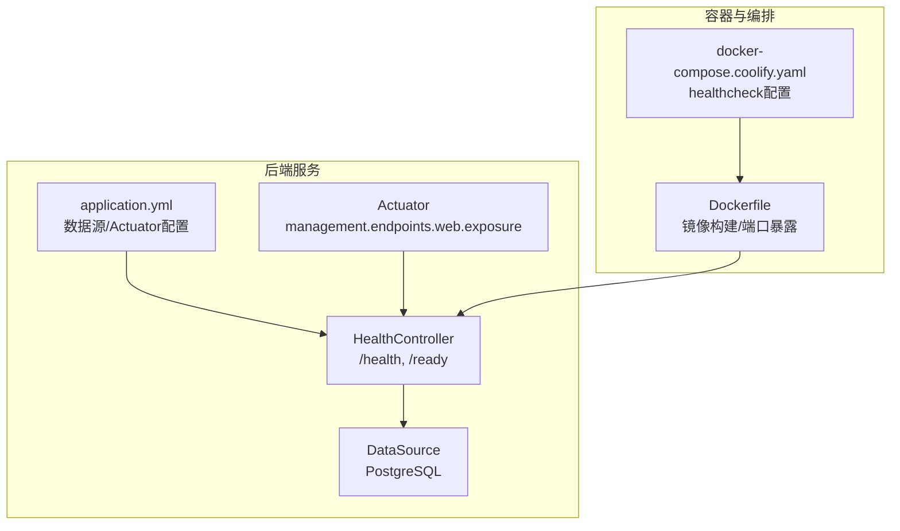
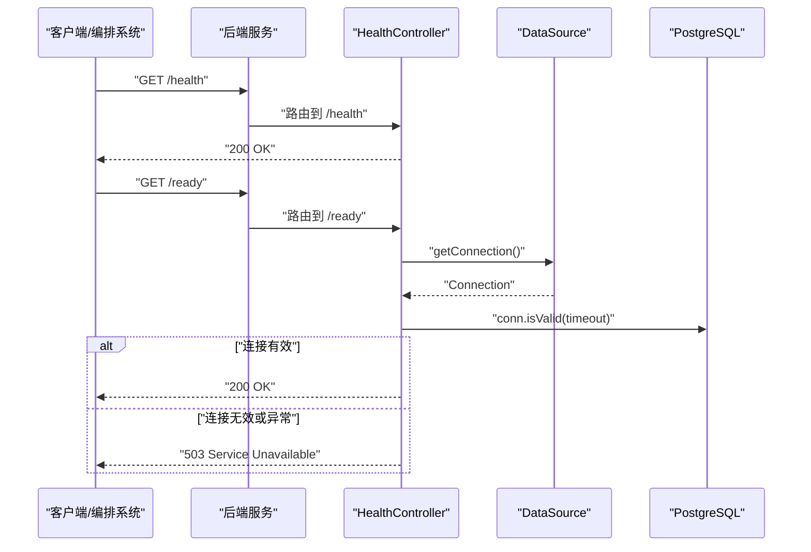
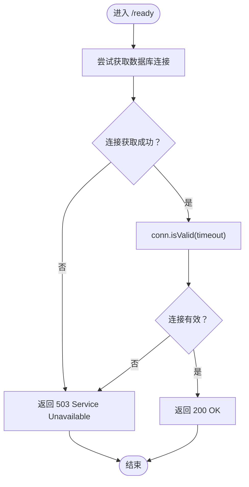
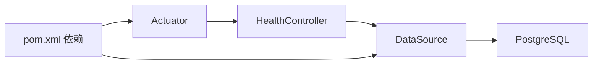

# 健康检查API

<cite>
**本文引用的文件**
- [HealthController.java](file://backend/src/main/java/com/aiscene/controller/HealthController.java)
- [HealthControllerTest.java](file://backend/src/test/java/com/aiscene/controller/HealthControllerTest.java)
- [application.yml](file://backend/src/main/resources/application.yml)
- [pom.xml](file://backend/pom.xml)
- [Dockerfile](file://backend/Dockerfile)
- [docker-compose.coolify.yaml](file://docker-compose.coolify.yaml)
</cite>

## 目录
1. [简介](#简介)
2. [项目结构](#项目结构)
3. [核心组件](#核心组件)
4. [架构总览](#架构总览)
5. [详细组件分析](#详细组件分析)
6. [依赖关系分析](#依赖关系分析)
7. [性能与可靠性考量](#性能与可靠性考量)
8. [故障排查指南](#故障排查指南)
9. [结论](#结论)
10. [附录](#附录)

## 简介
本文件面向运维与开发读者，系统性文档化后端服务的健康检查API，明确区分两类探针：
- GET /health：存活探针，仅检查应用进程是否运行，不依赖外部服务。
- GET /ready：就绪探针，检查应用是否准备好接收流量，会验证到PostgreSQL数据库的连接，失败时返回503状态码。

同时给出在Kubernetes或Docker等编排系统中如何使用这两个端点进行健康检查的实践建议，并提供监控集成思路。

## 项目结构
后端服务采用Spring Boot，健康检查端点位于控制器层；Actuator用于暴露管理端点；Dockerfile定义容器镜像；docker-compose.coolify.yaml演示了容器健康检查配置；application.yml包含数据源、JPA、Flyway、Redis、S3等配置。

图表来源
- [HealthController.java](file://backend/src/main/java/com/aiscene/controller/HealthController.java#L1-L38)
- [application.yml](file://backend/src/main/resources/application.yml#L1-L66)
- [Dockerfile](file://backend/Dockerfile#L1-L13)
- [docker-compose.coolify.yaml](file://docker-compose.coolify.yaml#L1-L86)

章节来源
- [HealthController.java](file://backend/src/main/java/com/aiscene/controller/HealthController.java#L1-L38)
- [application.yml](file://backend/src/main/resources/application.yml#L1-L66)
- [Dockerfile](file://backend/Dockerfile#L1-L13)
- [docker-compose.coolify.yaml](file://docker-compose.coolify.yaml#L1-L86)

## 核心组件
- 控制器：提供 /health 和 /ready 两个端点，分别对应存活与就绪探针。
- 数据源：通过DataSource访问PostgreSQL，/ready端点会尝试获取连接并校验有效性。
- Actuator：启用管理端点暴露，便于统一健康状态查询与扩展。
- 容器与编排：Dockerfile暴露端口；docker-compose.coolify.yaml配置了容器级健康检查。

章节来源
- [HealthController.java](file://backend/src/main/java/com/aiscene/controller/HealthController.java#L1-L38)
- [application.yml](file://backend/src/main/resources/application.yml#L1-L66)
- [pom.xml](file://backend/pom.xml#L1-L145)
- [Dockerfile](file://backend/Dockerfile#L1-L13)
- [docker-compose.coolify.yaml](file://docker-compose.coolify.yaml#L1-L86)

## 架构总览
下图展示了健康检查请求从客户端到后端控制器与数据库的交互流程。

图表来源
- [HealthController.java](file://backend/src/main/java/com/aiscene/controller/HealthController.java#L1-L38)
- [application.yml](file://backend/src/main/resources/application.yml#L1-L66)

## 详细组件分析

### 控制器：HealthController
- /health（存活探针）
  - 行为：直接返回200 OK，不依赖任何外部资源。
  - 用途：判断进程是否存活，适合用作livenessProbe。
- /ready（就绪探针）
  - 行为：尝试从DataSource获取连接并调用isValid进行快速校验；若成功则返回200 OK；否则返回503 Service Unavailable。
  - 用途：判断应用是否已准备好接收流量，适合用作readinessProbe。

图表来源
- [HealthController.java](file://backend/src/main/java/com/aiscene/controller/HealthController.java#L1-L38)

章节来源
- [HealthController.java](file://backend/src/main/java/com/aiscene/controller/HealthController.java#L1-L38)
- [HealthControllerTest.java](file://backend/src/test/java/com/aiscene/controller/HealthControllerTest.java#L1-L55)

### Actuator与配置
- Actuator已启用，管理端点暴露列表包含health与info；health端点支持probes开关，便于扩展自定义探针。
- 应用通过application.yml配置数据源URL、用户名、密码、驱动类名等，确保DataSource可用。

章节来源
- [application.yml](file://backend/src/main/resources/application.yml#L1-L66)
- [pom.xml](file://backend/pom.xml#L1-L145)

### 容器与编排集成
- Dockerfile将服务端口8090暴露给容器外访问。
- docker-compose.coolify.yaml为后端服务配置了healthcheck，使用curl探测/health端点，作为容器级存活检查。

章节来源
- [Dockerfile](file://backend/Dockerfile#L1-L13)
- [docker-compose.coolify.yaml](file://docker-compose.coolify.yaml#L1-L86)

## 依赖关系分析
- 控制器依赖DataSource以执行数据库连通性校验。
- Actuator依赖spring-boot-starter-actuator。
- 数据源依赖PostgreSQL驱动与运行中的数据库实例。

图表来源
- [HealthController.java](file://backend/src/main/java/com/aiscene/controller/HealthController.java#L1-L38)
- [pom.xml](file://backend/pom.xml#L1-L145)
- [application.yml](file://backend/src/main/resources/application.yml#L1-L66)

章节来源
- [pom.xml](file://backend/pom.xml#L1-L145)
- [application.yml](file://backend/src/main/resources/application.yml#L1-L66)

## 性能与可靠性考量
- /health端点无外部依赖，延迟极低，适合频繁探测。
- /ready端点每次都会建立数据库连接并进行快速校验，建议合理设置探测间隔与超时，避免对数据库造成压力。
- 当数据库连接失败或不可用时，/ready返回503，编排系统应将其标记为未就绪，避免向该实例转发流量。
- 建议在生产环境开启更细粒度的健康指标与日志记录，以便定位问题。

[本节为通用指导，无需列出具体文件来源]

## 故障排查指南
- /health返回非200
  - 检查容器是否正常运行、端口是否正确映射、应用是否启动完成。
  - 参考容器健康检查配置，确认curl探测命令与端口一致。
- /ready返回503
  - 检查数据库连接参数（URL、用户名、密码）是否正确。
  - 确认数据库实例可达且未处于只读或维护模式。
  - 查看应用日志，定位DataSource获取连接或isValid调用的异常。
- 编排系统未按预期滚动更新
  - 检查readinessProbe配置是否指向/ready，livenessProbe是否指向/health。
  - 调整探测间隔、超时与重试次数，避免误判。

章节来源
- [docker-compose.coolify.yaml](file://docker-compose.coolify.yaml#L1-L86)
- [HealthController.java](file://backend/src/main/java/com/aiscene/controller/HealthController.java#L1-L38)
- [application.yml](file://backend/src/main/resources/application.yml#L1-L66)

## 结论
本项目提供了简洁可靠的健康检查API：/health用于存活检测，/ready用于就绪检测并与数据库连通性绑定。结合Actuator与容器编排的健康检查配置，可实现自动化的服务发现与滚动更新。建议在生产环境中完善监控与告警策略，持续观察健康状态变化。

[本节为总结性内容，无需列出具体文件来源]

## 附录

### 在Kubernetes中使用健康检查端点
- livenessProbe：指向/health，用于判定容器是否需要重启。
- readinessProbe：指向/ready，用于判定容器是否可以接收流量。
- 建议配置合理的initialDelaySeconds、periodSeconds、timeoutSeconds与failureThreshold，避免频繁重启或长时间无法对外提供服务。

[本节为通用指导，无需列出具体文件来源]

### 在Docker Compose中使用健康检查端点
- 已在docker-compose.coolify.yaml中为后端服务配置了healthcheck，使用curl探测/health端点。
- 若需将就绪检查纳入容器级健康检查，可在compose中增加额外的探测逻辑或通过外部编排工具实现。

章节来源
- [docker-compose.coolify.yaml](file://docker-compose.coolify.yaml#L1-L86)

### 监控集成建议
- 使用Prometheus抓取Actuator暴露的健康指标，结合Grafana可视化。
- 将/health与/ready的响应时间、成功率与错误码纳入告警规则。
- 对数据库连接失败事件进行专项告警，结合应用日志定位根因。

[本节为通用指导，无需列出具体文件来源]