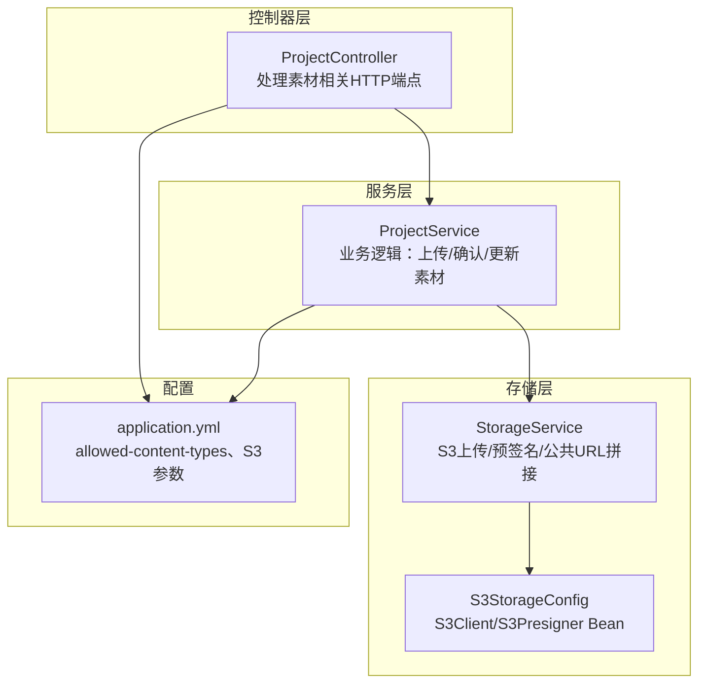
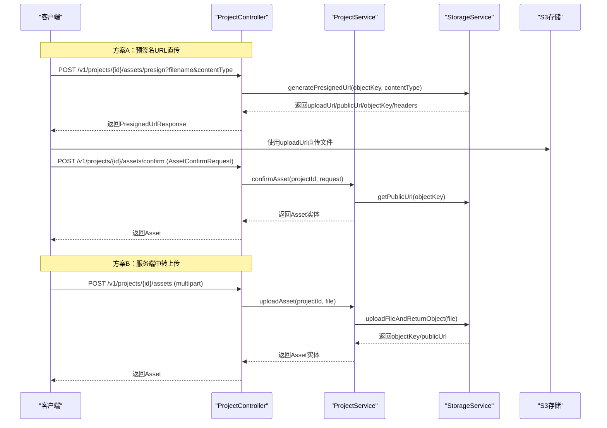
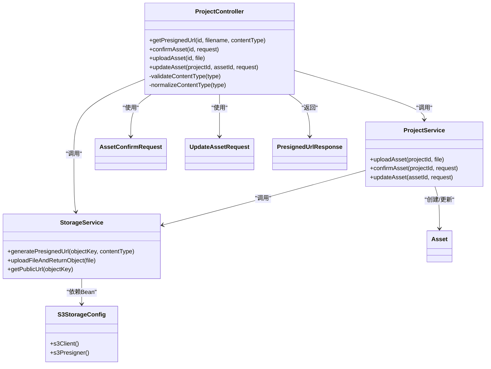

# 素材管理API

<cite>
**本文引用的文件**
- [ProjectController.java](file://backend/src/main/java/com/aiscene/controller/ProjectController.java)
- [StorageService.java](file://backend/src/main/java/com/aiscene/service/StorageService.java)
- [ProjectService.java](file://backend/src/main/java/com/aiscene/service/ProjectService.java)
- [S3StorageConfig.java](file://backend/src/main/java/com/aiscene/config/S3StorageConfig.java)
- [application.yml](file://backend/src/main/resources/application.yml)
- [AssetConfirmRequest.java](file://backend/src/main/java/com/aiscene/dto/AssetConfirmRequest.java)
- [UpdateAssetRequest.java](file://backend/src/main/java/com/aiscene/dto/UpdateAssetRequest.java)
- [PresignedUrlResponse.java](file://backend/src/main/java/com/aiscene/dto/PresignedUrlResponse.java)
- [Asset.java](file://backend/src/main/java/com/aiscene/entity/Asset.java)
- [ProjectControllerTest.java](file://backend/src/test/java/com/aiscene/controller/ProjectControllerTest.java)
</cite>

## 目录
1. [简介](#简介)
2. [项目结构](#项目结构)
3. [核心组件](#核心组件)
4. [架构总览](#架构总览)
5. [详细组件分析](#详细组件分析)
6. [依赖关系分析](#依赖关系分析)
7. [性能考量](#性能考量)
8. [故障排查指南](#故障排查指南)
9. [结论](#结论)
10. [附录](#附录)

## 简介
本文件系统性文档化与“视频素材上传与管理”相关的后端API，覆盖以下端点：
- POST /v1/projects/{id}/assets/presign：生成S3预签名URL，用于客户端直传；需要参数：filename、contentType
- POST /v1/projects/{id}/assets/confirm：确认素材上传完成，使用 AssetConfirmRequest DTO
- POST /v1/projects/{id}/assets：直接上传multipart/form-data文件
- PUT /v1/projects/{projectId}/assets/{assetId}：更新素材元数据，使用 UpdateAssetRequest DTO

同时说明 allowed-content-types 配置项的作用、预签名URL流程的优势，并给出各端点的请求/响应要点与错误处理示例（如不支持的Content-Type）。

## 项目结构
后端采用Spring Boot工程，素材相关能力由控制器、服务层、存储服务与S3配置共同组成：
- 控制器：负责接收HTTP请求、参数校验、调用服务层并返回响应
- 服务层：封装业务逻辑（创建素材、确认上传、更新素材等）
- 存储服务：封装S3客户端与预签名生成逻辑
- S3配置：提供S3Client与S3Presigner Bean，适配R2/MinIO/AWS S3
- 配置文件：定义允许的上传内容类型白名单、S3参数等

图表来源
- [ProjectController.java](file://backend/src/main/java/com/aiscene/controller/ProjectController.java#L73-L137)
- [ProjectService.java](file://backend/src/main/java/com/aiscene/service/ProjectService.java#L48-L83)
- [StorageService.java](file://backend/src/main/java/com/aiscene/service/StorageService.java#L42-L102)
- [S3StorageConfig.java](file://backend/src/main/java/com/aiscene/config/S3StorageConfig.java#L31-L60)
- [application.yml](file://backend/src/main/resources/application.yml#L50-L66)

章节来源
- [ProjectController.java](file://backend/src/main/java/com/aiscene/controller/ProjectController.java#L73-L137)
- [application.yml](file://backend/src/main/resources/application.yml#L50-L66)

## 核心组件
- ProjectController：暴露素材管理相关REST端点，执行内容类型校验与调用服务层
- ProjectService：实现素材上传、确认、更新等业务逻辑，维护项目状态与排序
- StorageService：封装S3上传与预签名URL生成，计算公共访问URL
- S3StorageConfig：提供S3Client与S3Presigner Bean，支持R2/MinIO/AWS S3
- DTO：AssetConfirmRequest、UpdateAssetRequest、PresignedUrlResponse
- 实体：Asset（素材表字段）

章节来源
- [ProjectController.java](file://backend/src/main/java/com/aiscene/controller/ProjectController.java#L73-L137)
- [ProjectService.java](file://backend/src/main/java/com/aiscene/service/ProjectService.java#L48-L83)
- [StorageService.java](file://backend/src/main/java/com/aiscene/service/StorageService.java#L42-L102)
- [S3StorageConfig.java](file://backend/src/main/java/com/aiscene/config/S3StorageConfig.java#L31-L60)
- [AssetConfirmRequest.java](file://backend/src/main/java/com/aiscene/dto/AssetConfirmRequest.java#L1-L13)
- [UpdateAssetRequest.java](file://backend/src/main/java/com/aiscene/dto/UpdateAssetRequest.java#L1-L16)
- [PresignedUrlResponse.java](file://backend/src/main/java/com/aiscene/dto/PresignedUrlResponse.java#L1-L15)
- [Asset.java](file://backend/src/main/java/com/aiscene/entity/Asset.java#L1-L61)

## 架构总览
素材上传与管理的整体流程如下：
- 客户端通过预签名URL直传到S3（或本地直传），随后向后端确认
- 后端根据请求内容类型白名单进行校验，确保安全与兼容
- 成功后写入素材记录，提交分析任务，更新项目状态

图表来源
- [ProjectController.java](file://backend/src/main/java/com/aiscene/controller/ProjectController.java#L73-L103)
- [ProjectService.java](file://backend/src/main/java/com/aiscene/service/ProjectService.java#L48-L83)
- [StorageService.java](file://backend/src/main/java/com/aiscene/service/StorageService.java#L42-L102)

## 详细组件分析

### 端点：POST /v1/projects/{id}/assets/presign
- 功能：生成S3预签名URL，供客户端直传文件
- 请求参数
  - 路径参数：id（项目ID）
  - 查询参数：filename（目标对象名）、contentType（MIME类型）
- 行为
  - 校验contentType是否在白名单内
  - 生成objectKey（UUID-原文件名）
  - 调用StorageService生成预签名上传URL与公共URL
  - 返回PresignedUrlResponse（包含uploadUrl、publicUrl、objectKey、signedHeaders）
- 错误处理
  - 缺少Content-Type：400
  - 白名单未配置：500
  - 不支持的Content-Type：400

请求/响应要点
- 请求：GET /v1/projects/{id}/assets/presign?filename={字符串}&contentType={字符串}
- 响应：PresignedUrlResponse（uploadUrl、publicUrl、objectKey、signedHeaders）

章节来源
- [ProjectController.java](file://backend/src/main/java/com/aiscene/controller/ProjectController.java#L73-L82)
- [StorageService.java](file://backend/src/main/java/com/aiscene/service/StorageService.java#L42-L68)
- [PresignedUrlResponse.java](file://backend/src/main/java/com/aiscene/dto/PresignedUrlResponse.java#L1-L15)
- [application.yml](file://backend/src/main/resources/application.yml#L64-L66)

### 端点：POST /v1/projects/{id}/assets/confirm
- 功能：确认素材上传完成，后端据此创建素材记录并提交分析任务
- 请求体：AssetConfirmRequest（objectKey、filename、contentType、size）
- 行为
  - 校验contentType是否在白名单内
  - 计算公共URL（基于objectKey）
  - 写入素材记录（ossUrl、storageType、storageBucket、storageKey、sortOrder等）
  - 提交分析任务到队列
  - 更新项目状态（若为DRAFT或UPLOADING则进入ANALYZING）
- 响应：返回Asset实体

请求/响应要点
- 请求：POST /v1/projects/{id}/assets/confirm
  - Body：AssetConfirmRequest（objectKey、filename、contentType、size）
- 响应：Asset

章节来源
- [ProjectController.java](file://backend/src/main/java/com/aiscene/controller/ProjectController.java#L84-L89)
- [ProjectService.java](file://backend/src/main/java/com/aiscene/service/ProjectService.java#L48-L83)
- [AssetConfirmRequest.java](file://backend/src/main/java/com/aiscene/dto/AssetConfirmRequest.java#L1-L13)
- [Asset.java](file://backend/src/main/java/com/aiscene/entity/Asset.java#L1-L61)

### 端点：POST /v1/projects/{id}/assets
- 功能：服务端中转上传multipart文件
- 请求
  - 路径参数：id（项目ID）
  - 参数：multipart file（键名file）
- 行为
  - 校验contentType是否在白名单内
  - 直接上传至S3并返回公共URL
  - 写入素材记录（ossUrl、storageType、storageBucket、storageKey、sortOrder等）
  - 提交分析任务到队列
  - 更新项目状态（若为DRAFT或UPLOADING则进入ANALYZING）
- 响应：返回Asset实体

请求/响应要点
- 请求：POST /v1/projects/{id}/assets
  - Body：multipart form-data，键名为file
- 响应：Asset

章节来源
- [ProjectController.java](file://backend/src/main/java/com/aiscene/controller/ProjectController.java#L91-L96)
- [ProjectService.java](file://backend/src/main/java/com/aiscene/service/ProjectService.java#L250-L283)
- [StorageService.java](file://backend/src/main/java/com/aiscene/service/StorageService.java#L104-L139)
- [Asset.java](file://backend/src/main/java/com/aiscene/entity/Asset.java#L1-L61)

### 端点：PUT /v1/projects/{projectId}/assets/{assetId}
- 功能：更新素材元数据（用户标签、排序）
- 请求体：UpdateAssetRequest（userLabel、sortOrder）
- 行为
  - 根据请求更新素材的userLabel、sceneLabel、sortOrder
  - 保存并返回更新后的Asset
- 响应：返回Asset实体

请求/响应要点
- 请求：PUT /v1/projects/{projectId}/assets/{assetId}
  - Body：UpdateAssetRequest（userLabel、sortOrder）
- 响应：Asset

章节来源
- [ProjectController.java](file://backend/src/main/java/com/aiscene/controller/ProjectController.java#L133-L137)
- [ProjectService.java](file://backend/src/main/java/com/aiscene/service/ProjectService.java#L125-L140)
- [UpdateAssetRequest.java](file://backend/src/main/java/com/aiscene/dto/UpdateAssetRequest.java#L1-L16)
- [Asset.java](file://backend/src/main/java/com/aiscene/entity/Asset.java#L1-L61)

### allowed-content-types 配置项
- 作用：限制允许上传的文件内容类型，提升安全性与兼容性
- 配置位置：application.yml 中 app.upload.allowed-content-types
- 默认值：包含常见视频格式（如mp4、mov、webm、3gpp等）
- 校验逻辑：
  - 控制器在每个上传/确认端点都会对Content-Type进行标准化与白名单检查
  - 若未配置白名单，将返回500；若不在白名单内，返回400

章节来源
- [application.yml](file://backend/src/main/resources/application.yml#L64-L66)
- [ProjectController.java](file://backend/src/main/java/com/aiscene/controller/ProjectController.java#L105-L116)

### 预签名URL流程的优势
- 降低服务器带宽压力：客户端直接上传至S3，后端仅做确认与记录
- 提升上传稳定性：断点续传、并发上传更易实现
- 更灵活的客户端实现：可使用任意HTTP客户端或SDK
- 便于CDN与公共URL分发：后端返回publicUrl，便于前端直接播放

章节来源
- [ProjectController.java](file://backend/src/main/java/com/aiscene/controller/ProjectController.java#L73-L82)
- [StorageService.java](file://backend/src/main/java/com/aiscene/service/StorageService.java#L42-L68)

### 错误处理示例
- 不支持的Content-Type
  - 触发条件：contentType不在白名单内
  - 响应：400 Bad Request
- 缺少Content-Type
  - 触发条件：请求未携带或为空
  - 响应：400 Bad Request
- 白名单未配置
  - 触发条件：allowed-content-types未设置
  - 响应：500 Internal Server Error
- 资源不存在（更新素材时）
  - 触发条件：assetId不存在
  - 响应：抛出运行时异常（通常映射为5xx）

章节来源
- [ProjectController.java](file://backend/src/main/java/com/aiscene/controller/ProjectController.java#L105-L116)
- [ProjectControllerTest.java](file://backend/src/test/java/com/aiscene/controller/ProjectControllerTest.java#L147-L172)

## 依赖关系分析

图表来源
- [ProjectController.java](file://backend/src/main/java/com/aiscene/controller/ProjectController.java#L73-L137)
- [ProjectService.java](file://backend/src/main/java/com/aiscene/service/ProjectService.java#L48-L83)
- [StorageService.java](file://backend/src/main/java/com/aiscene/service/StorageService.java#L42-L102)
- [S3StorageConfig.java](file://backend/src/main/java/com/aiscene/config/S3StorageConfig.java#L31-L60)
- [AssetConfirmRequest.java](file://backend/src/main/java/com/aiscene/dto/AssetConfirmRequest.java#L1-L13)
- [UpdateAssetRequest.java](file://backend/src/main/java/com/aiscene/dto/UpdateAssetRequest.java#L1-L16)
- [PresignedUrlResponse.java](file://backend/src/main/java/com/aiscene/dto/PresignedUrlResponse.java#L1-L15)
- [Asset.java](file://backend/src/main/java/com/aiscene/entity/Asset.java#L1-L61)

## 性能考量
- 预签名直传适合大文件与高并发场景，避免后端成为瓶颈
- 服务端中转上传适合小文件或需要严格控制的场景
- 公共URL拼接策略会根据public-url配置自动选择路径风格，减少额外网络跳转
- 分析任务异步提交，避免阻塞上传接口

章节来源
- [StorageService.java](file://backend/src/main/java/com/aiscene/service/StorageService.java#L76-L102)
- [ProjectService.java](file://backend/src/main/java/com/aiscene/service/ProjectService.java#L250-L283)

## 故障排查指南
- 400：不支持的Content-Type
  - 检查客户端是否正确传递contentType，且在白名单内
  - 参考：[ProjectController.java](file://backend/src/main/java/com/aiscene/controller/ProjectController.java#L105-L116)
- 500：白名单未配置
  - 检查环境变量APP_UPLOAD_ALLOWED_CONTENT_TYPES是否设置
  - 参考：[application.yml](file://backend/src/main/resources/application.yml#L64-L66)
- 400：缺少Content-Type
  - 检查客户端是否遗漏或为空
  - 参考：[ProjectController.java](file://backend/src/main/java/com/aiscene/controller/ProjectController.java#L105-L116)
- 上传后无法播放
  - 检查public-url配置与S3桶策略，确保可公开访问
  - 参考：[StorageService.java](file://backend/src/main/java/com/aiscene/service/StorageService.java#L76-L102)
- 更新素材失败
  - 确认assetId存在，请求体字段userLabel/sortOrder合法
  - 参考：[ProjectService.java](file://backend/src/main/java/com/aiscene/service/ProjectService.java#L125-L140)

章节来源
- [ProjectController.java](file://backend/src/main/java/com/aiscene/controller/ProjectController.java#L105-L116)
- [StorageService.java](file://backend/src/main/java/com/aiscene/service/StorageService.java#L76-L102)
- [ProjectService.java](file://backend/src/main/java/com/aiscene/service/ProjectService.java#L125-L140)
- [application.yml](file://backend/src/main/resources/application.yml#L64-L66)

## 结论
素材管理API围绕“白名单校验+预签名直传/服务端中转+异步分析”的模式构建，既保证了安全性与可扩展性，又兼顾了性能与易用性。通过清晰的DTO与实体模型，实现了从上传、确认到元数据更新的完整闭环。

## 附录

### API定义与示例（要点）
- POST /v1/projects/{id}/assets/presign
  - 参数：filename、contentType
  - 响应：PresignedUrlResponse（uploadUrl、publicUrl、objectKey、signedHeaders）
  - 示例：客户端先请求该端点获取uploadUrl，再以对应headers直传至S3
  - 参考：[ProjectController.java](file://backend/src/main/java/com/aiscene/controller/ProjectController.java#L73-L82)，[StorageService.java](file://backend/src/main/java/com/aiscene/service/StorageService.java#L42-L68)

- POST /v1/projects/{id}/assets/confirm
  - 请求体：AssetConfirmRequest（objectKey、filename、contentType、size）
  - 响应：Asset
  - 示例：客户端直传完成后调用此端点完成入库与分析任务提交
  - 参考：[ProjectController.java](file://backend/src/main/java/com/aiscene/controller/ProjectController.java#L84-L89)，[ProjectService.java](file://backend/src/main/java/com/aiscene/service/ProjectService.java#L48-L83)

- POST /v1/projects/{id}/assets
  - 请求体：multipart form-data，键名file
  - 响应：Asset
  - 示例：客户端直接将文件上传至后端，后端转发至S3
  - 参考：[ProjectController.java](file://backend/src/main/java/com/aiscene/controller/ProjectController.java#L91-L96)，[ProjectService.java](file://backend/src/main/java/com/aiscene/service/ProjectService.java#L250-L283)

- PUT /v1/projects/{projectId}/assets/{assetId}
  - 请求体：UpdateAssetRequest（userLabel、sortOrder）
  - 响应：Asset
  - 示例：更新素材的用户标签与排序
  - 参考：[ProjectController.java](file://backend/src/main/java/com/aiscene/controller/ProjectController.java#L133-L137)，[ProjectService.java](file://backend/src/main/java/com/aiscene/service/ProjectService.java#L125-L140)

### 数据模型要点
- AssetConfirmRequest：objectKey、filename、contentType、size
- UpdateAssetRequest：userLabel、sortOrder
- PresignedUrlResponse：uploadUrl、publicUrl、objectKey、signedHeaders
- Asset：id、ossUrl、storageType、storageBucket、storageKey、localPath、duration、sceneLabel、sceneScore、userLabel、sortOrder、isDeleted

章节来源
- [AssetConfirmRequest.java](file://backend/src/main/java/com/aiscene/dto/AssetConfirmRequest.java#L1-L13)
- [UpdateAssetRequest.java](file://backend/src/main/java/com/aiscene/dto/UpdateAssetRequest.java#L1-L16)
- [PresignedUrlResponse.java](file://backend/src/main/java/com/aiscene/dto/PresignedUrlResponse.java#L1-L15)
- [Asset.java](file://backend/src/main/java/com/aiscene/entity/Asset.java#L1-L61)