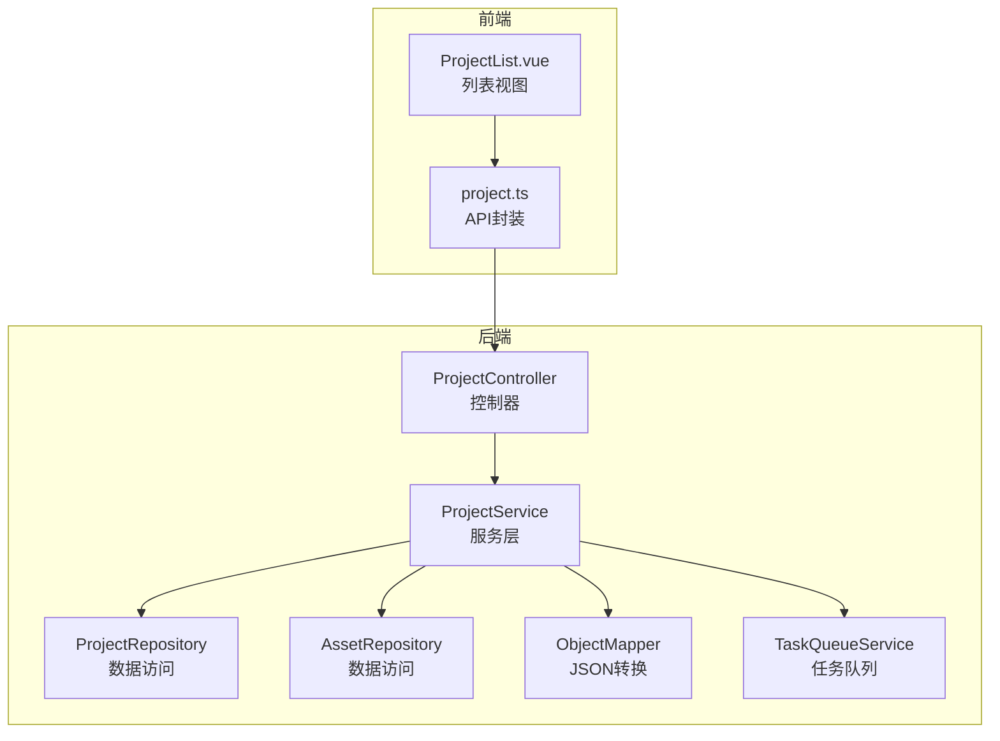
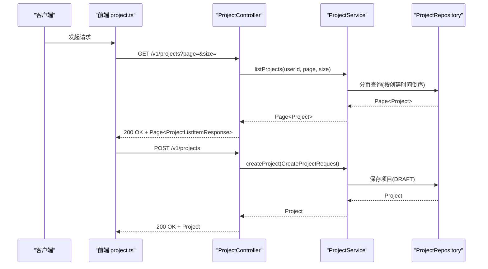
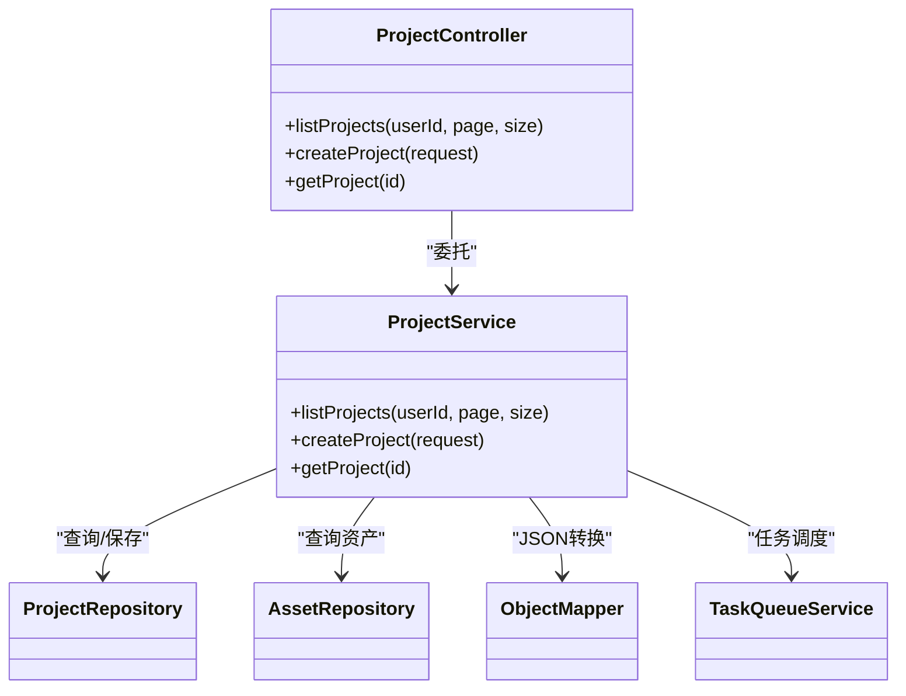

# 项目管理API

<cite>
**本文引用的文件**
- [ProjectController.java](file://backend/src/main/java/com/aiscene/controller/ProjectController.java)
- [ProjectService.java](file://backend/src/main/java/com/aiscene/service/ProjectService.java)
- [CreateProjectRequest.java](file://backend/src/main/java/com/aiscene/dto/CreateProjectRequest.java)
- [ProjectListItemResponse.java](file://backend/src/main/java/com/aiscene/dto/ProjectListItemResponse.java)
- [ProjectStatus.java](file://backend/src/main/java/com/aiscene/entity/ProjectStatus.java)
- [ProjectControllerTest.java](file://backend/src/test/java/com/aiscene/controller/ProjectControllerTest.java)
- [ProjectServiceTest.java](file://backend/src/test/java/com/aiscene/service/ProjectServiceTest.java)
- [project.ts](file://frontend/src/api/project.ts)
- [ProjectList.vue](file://frontend/src/views/ProjectList.vue)
</cite>

## 目录
1. [简介](#简介)
2. [项目结构](#项目结构)
3. [核心组件](#核心组件)
4. [架构总览](#架构总览)
5. [详细组件分析](#详细组件分析)
6. [依赖关系分析](#依赖关系分析)
7. [性能与分页特性](#性能与分页特性)
8. [故障排查指南](#故障排查指南)
9. [结论](#结论)
10. [附录](#附录)

## 简介
本文件面向项目管理相关的RESTful API，聚焦于以下三个端点：
- GET /v1/projects：分页查询项目列表，支持通过请求头 X-User-Id 进行用户维度过滤
- POST /v1/projects：创建新项目，请求体为 CreateProjectRequest DTO
- GET /v1/projects/{id}：获取指定项目详情

文档将详细说明每个端点的HTTP方法、URL路径、请求头、请求体（字段类型、约束与示例）、响应体结构（如 ProjectListItemResponse）以及可能的HTTP状态码，并解释 X-User-Id 头的作用与分页参数 page、size 的使用方式。同时提供 curl 示例与前端调用片段，帮助快速集成。

## 项目结构
后端采用Spring MVC + Spring Data分页的典型结构，控制器负责路由与参数绑定，服务层处理业务逻辑与数据访问，DTO用于请求/响应的数据传输。

图表来源
- [ProjectController.java](file://backend/src/main/java/com/aiscene/controller/ProjectController.java#L42-L71)
- [ProjectService.java](file://backend/src/main/java/com/aiscene/service/ProjectService.java#L320-L326)
- [project.ts](file://frontend/src/api/project.ts#L36-L43)
- [ProjectList.vue](file://frontend/src/views/ProjectList.vue#L64-L87)

章节来源
- [ProjectController.java](file://backend/src/main/java/com/aiscene/controller/ProjectController.java#L42-L71)
- [ProjectService.java](file://backend/src/main/java/com/aiscene/service/ProjectService.java#L320-L326)
- [project.ts](file://frontend/src/api/project.ts#L36-L43)
- [ProjectList.vue](file://frontend/src/views/ProjectList.vue#L64-L87)

## 核心组件
- 控制器：负责HTTP路由、参数校验、异常处理与响应封装
- 服务层：实现业务规则、分页查询、状态机推进与任务调度
- DTO：定义请求/响应的数据结构
- 实体枚举：项目状态枚举，用于状态流转控制

章节来源
- [ProjectController.java](file://backend/src/main/java/com/aiscene/controller/ProjectController.java#L42-L71)
- [ProjectService.java](file://backend/src/main/java/com/aiscene/service/ProjectService.java#L320-L326)
- [CreateProjectRequest.java](file://backend/src/main/java/com/aiscene/dto/CreateProjectRequest.java#L7-L13)
- [ProjectListItemResponse.java](file://backend/src/main/java/com/aiscene/dto/ProjectListItemResponse.java#L13-L27)
- [ProjectStatus.java](file://backend/src/main/java/com/aiscene/entity/ProjectStatus.java#L1-L15)

## 架构总览
下图展示从客户端到后端的关键交互流程，包括分页查询与创建项目的典型序列。

图表来源
- [ProjectController.java](file://backend/src/main/java/com/aiscene/controller/ProjectController.java#L42-L71)
- [ProjectService.java](file://backend/src/main/java/com/aiscene/service/ProjectService.java#L320-L326)
- [ProjectControllerTest.java](file://backend/src/test/java/com/aiscene/controller/ProjectControllerTest.java#L313-L331)
- [ProjectServiceTest.java](file://backend/src/test/java/com/aiscene/service/ProjectServiceTest.java#L494-L507)

## 详细组件分析

### 端点一：GET /v1/projects（分页查询项目列表）
- 方法与路径：GET /v1/projects
- 请求头
  - X-User-Id: Long（可选），用于按用户维度过滤项目；若为空则返回全量项目
- 查询参数
  - page: int，默认值为1（第一页）
  - size: int，默认值为10（每页条数）
- 响应体
  - 类型：分页对象 Page<ProjectListItemResponse>
  - 内容：列表项为 ProjectListItemResponse，包含 id、title、status、houseInfo、createdAt、errorRequestId、errorStep、errorAt 等字段
- 状态码
  - 200：成功
  - 400：当 page 或 size 非法时（由框架默认行为或上层拦截器决定）
- 行为说明
  - 使用 Spring Data 分页，按创建时间降序排序
  - 当 X-User-Id 存在时，按用户ID过滤；否则返回全部项目
- curl 示例
  - 获取当前用户项目列表（假设用户ID为123）：
    - curl -H "X-User-Id: 123" "http://localhost:8080/v1/projects?page=1&size=10"
  - 获取全量项目列表：
    - curl "http://localhost:8080/v1/projects?page=1&size=10"
- 前端调用片段
  - 前端通过 project.ts 的 list 接口发起请求，参数为 { page, size }，内部会将分页参数以查询字符串形式传递给后端
  - 列表页面 ProjectList.vue 中使用该接口进行分页加载

章节来源
- [ProjectController.java](file://backend/src/main/java/com/aiscene/controller/ProjectController.java#L42-L59)
- [ProjectService.java](file://backend/src/main/java/com/aiscene/service/ProjectService.java#L320-L326)
- [ProjectListItemResponse.java](file://backend/src/main/java/com/aiscene/dto/ProjectListItemResponse.java#L13-L27)
- [ProjectControllerTest.java](file://backend/src/test/java/com/aiscene/controller/ProjectControllerTest.java#L313-L331)
- [ProjectServiceTest.java](file://backend/src/test/java/com/aiscene/service/ProjectServiceTest.java#L494-L507)
- [project.ts](file://frontend/src/api/project.ts#L41-L43)
- [ProjectList.vue](file://frontend/src/views/ProjectList.vue#L64-L87)

### 端点二：POST /v1/projects（创建新项目）
- 方法与路径：POST /v1/projects
- 请求头：无强制要求
- 请求体：CreateProjectRequest DTO
  - 字段
    - userId: Long（可选），用于标识项目归属
    - title: String（必填），项目标题
    - houseInfo: Map<String, Object>（必填），房屋信息，包含房间、厅、面积、价格等键值对
  - 约束
    - houseInfo 必须为非空映射；后端会将其转换为 JSON Node 存储
- 响应体
  - 类型：Project（实体）
  - 初始状态：DRAFT
- 状态码
  - 200：成功
- curl 示例
  - curl -X POST "http://localhost:8080/v1/projects" -H "Content-Type: application/json" -d '{
    "userId": 123,
    "title": "阳光花园 2室1厅",
    "houseInfo": {
      "community": "阳光花园",
      "room": 2,
      "hall": 1,
      "price": 300,
      "area": 88,
      "sellingPoints": ["南北通透"],
      "remarks": "房东急售"
    }
  }'
- 前端调用片段
  - 前端通过 project.ts 的 create 接口发起请求，参数为 CreateProjectParams（与 DTO 结构一致）

章节来源
- [ProjectController.java](file://backend/src/main/java/com/aiscene/controller/ProjectController.java#L61-L65)
- [ProjectService.java](file://backend/src/main/java/com/aiscene/service/ProjectService.java#L232-L244)
- [CreateProjectRequest.java](file://backend/src/main/java/com/aiscene/dto/CreateProjectRequest.java#L7-L13)
- [ProjectControllerTest.java](file://backend/src/test/java/com/aiscene/controller/ProjectControllerTest.java#L33-L46)
- [project.ts](file://frontend/src/api/project.ts#L36-L43)

### 端点三：GET /v1/projects/{id}（获取指定项目详情）
- 方法与路径：GET /v1/projects/{id}
- 路径参数
  - id: UUID（必填），项目唯一标识
- 请求头：无强制要求
- 响应体
  - 类型：Project（实体）
- 状态码
  - 200：成功
  - 404：未找到对应项目（由服务层抛出异常，控制器转换为404）
- curl 示例
  - curl "http://localhost:8080/v1/projects/<项目UUID>"
- 前端调用片段
  - 前端通过 project.ts 的 getProject 接口发起请求

章节来源
- [ProjectController.java](file://backend/src/main/java/com/aiscene/controller/ProjectController.java#L67-L71)
- [ProjectService.java](file://backend/src/main/java/com/aiscene/service/ProjectService.java#L246-L249)
- [ProjectControllerTest.java](file://backend/src/test/java/com/aiscene/controller/ProjectControllerTest.java#L49-L62)
- [project.ts](file://frontend/src/api/project.ts#L107-L110)

### 数据模型与状态
- ProjectListItemResponse
  - 字段：id（UUID）、title（String）、status（ProjectStatus）、houseInfo（JsonNode）、createdAt（LocalDateTime）、errorRequestId（String）、errorStep（String）、errorAt（LocalDateTime）
- ProjectStatus（枚举）
  - DRAFT、UPLOADING、ANALYZING、REVIEW、SCRIPT_GENERATING、SCRIPT_GENERATED、AUDIO_GENERATING、AUDIO_GENERATED、RENDERING、COMPLETED、FAILED

章节来源
- [ProjectListItemResponse.java](file://backend/src/main/java/com/aiscene/dto/ProjectListItemResponse.java#L13-L27)
- [ProjectStatus.java](file://backend/src/main/java/com/aiscene/entity/ProjectStatus.java#L1-L15)

## 依赖关系分析
- 控制器依赖服务层：listProjects、createProject、getProject
- 服务层依赖仓库与工具：ProjectRepository、AssetRepository、ObjectMapper、JdbcTemplate、TaskQueueService
- 前端通过统一API封装调用后端控制器

图表来源
- [ProjectController.java](file://backend/src/main/java/com/aiscene/controller/ProjectController.java#L42-L71)
- [ProjectService.java](file://backend/src/main/java/com/aiscene/service/ProjectService.java#L320-L326)

章节来源
- [ProjectController.java](file://backend/src/main/java/com/aiscene/controller/ProjectController.java#L42-L71)
- [ProjectService.java](file://backend/src/main/java/com/aiscene/service/ProjectService.java#L320-L326)

## 性能与分页特性
- 分页策略
  - 使用 Spring Data PageRequest，按 createdAt 降序排序
  - page 默认从1开始，服务层转换为从0开始的偏移
- 用户过滤
  - 当 X-User-Id 存在时，使用按用户ID查询；否则查询全量
- 响应结构
  - 返回 Page<ProjectListItemResponse>，便于前端实现无限滚动与懒加载
- 前端分页实践
  - ProjectList.vue 中维护 page 与 size，每次加载追加内容，直至后端返回不足一页的数据

章节来源
- [ProjectService.java](file://backend/src/main/java/com/aiscene/service/ProjectService.java#L320-L326)
- [ProjectControllerTest.java](file://backend/src/test/java/com/aiscene/controller/ProjectControllerTest.java#L313-L331)
- [ProjectList.vue](file://frontend/src/views/ProjectList.vue#L64-L87)

## 故障排查指南
- 400 错误
  - 可能原因：请求参数非法（如 page、size 非法），或内容类型不被允许（上传相关端点）
  - 定位：控制器内参数校验与异常处理
- 404 错误
  - 可能原因：项目不存在
  - 定位：服务层抛出“未找到”异常，控制器转换为404
- 5xx 错误
  - 可能原因：服务端内部错误（如配置缺失导致的白名单未配置）
  - 定位：控制器捕获异常并返回相应状态码

章节来源
- [ProjectController.java](file://backend/src/main/java/com/aiscene/controller/ProjectController.java#L105-L116)
- [ProjectService.java](file://backend/src/main/java/com/aiscene/service/ProjectService.java#L246-L249)

## 结论
本文档系统梳理了项目管理API的核心端点，明确了请求/响应结构、分页与用户过滤机制、状态码与常见问题定位方法，并提供了前后端调用参考。实际部署时，建议结合网关与鉴权层统一注入 X-User-Id，确保数据隔离与安全。

## 附录

### API定义汇总
- GET /v1/projects
  - 请求头：X-User-Id: Long（可选）
  - 查询参数：page: int（默认1）、size: int（默认10）
  - 响应：200 OK + Page<ProjectListItemResponse>
- POST /v1/projects
  - 请求体：CreateProjectRequest
    - userId: Long（可选）
    - title: String（必填）
    - houseInfo: Map<String, Object>（必填）
  - 响应：200 OK + Project（初始状态 DRAFT）
- GET /v1/projects/{id}
  - 路径参数：id: UUID（必填）
  - 响应：200 OK + Project

章节来源
- [ProjectController.java](file://backend/src/main/java/com/aiscene/controller/ProjectController.java#L42-L71)
- [CreateProjectRequest.java](file://backend/src/main/java/com/aiscene/dto/CreateProjectRequest.java#L7-L13)
- [ProjectListItemResponse.java](file://backend/src/main/java/com/aiscene/dto/ProjectListItemResponse.java#L13-L27)
- [ProjectStatus.java](file://backend/src/main/java/com/aiscene/entity/ProjectStatus.java#L1-L15)