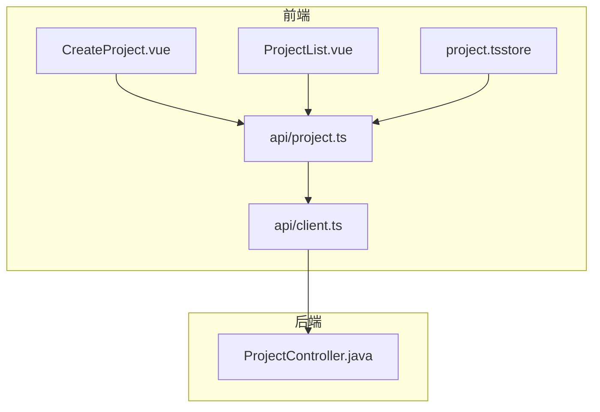
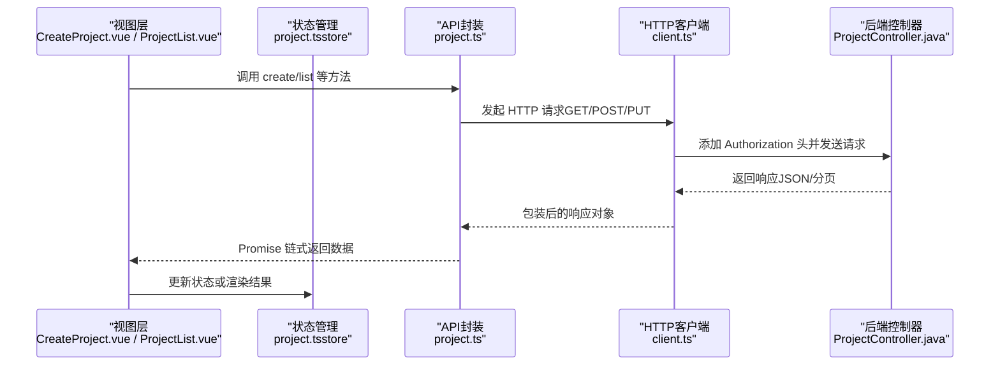
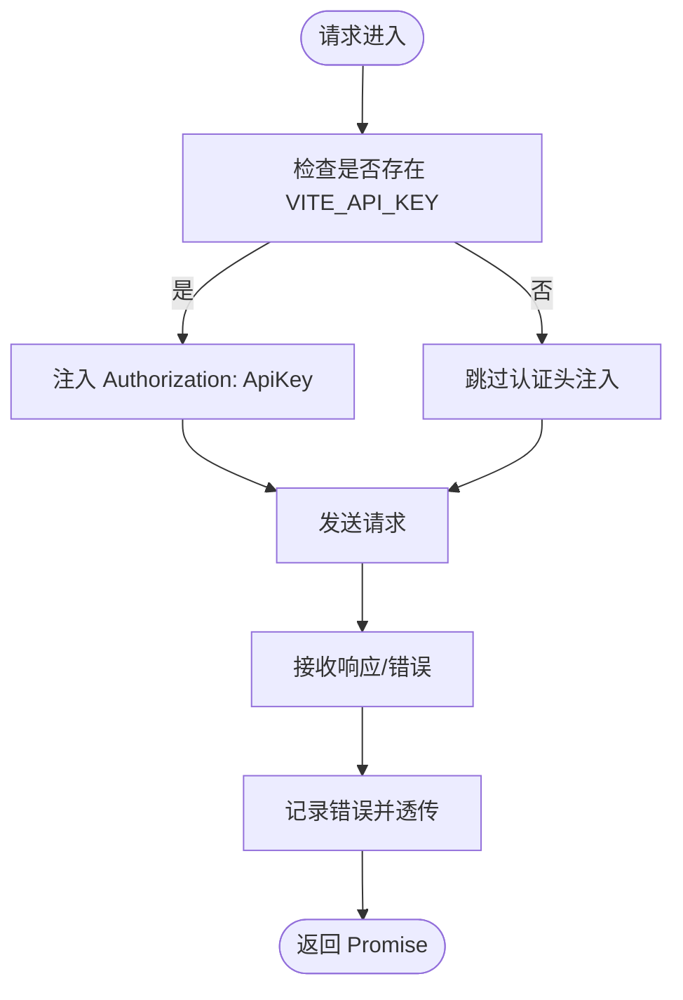
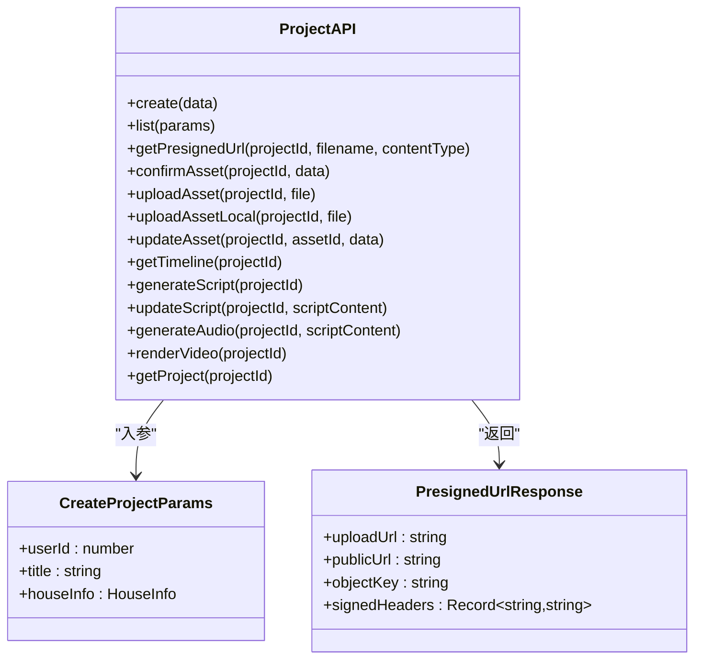
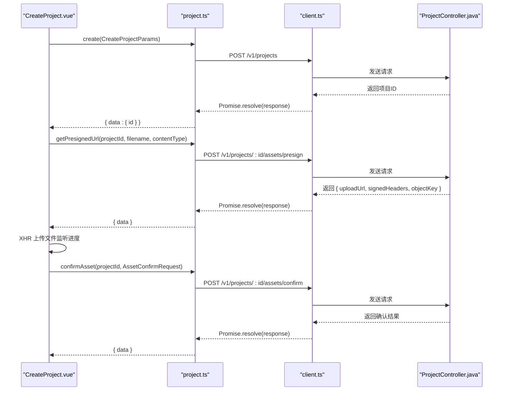
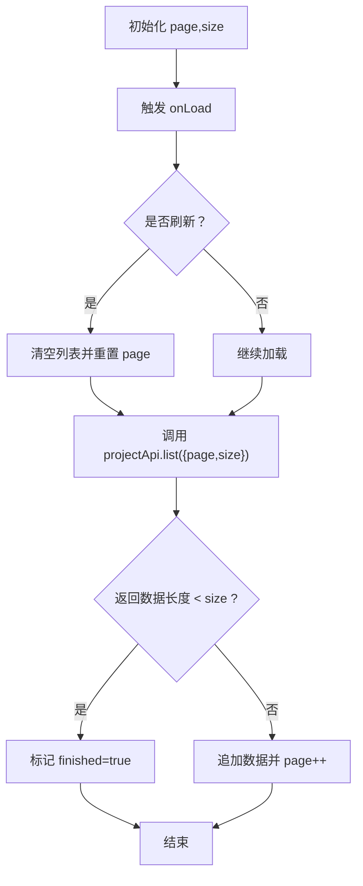
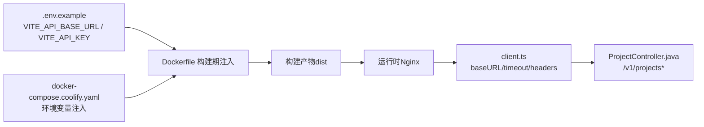

# API客户端

<cite>
**本文引用的文件**
- [client.ts](file://frontend/src/api/client.ts)
- [project.ts](file://frontend/src/api/project.ts)
- [project.ts（store）](file://frontend/src/stores/project.ts)
- [CreateProject.vue](file://frontend/src/views/CreateProject.vue)
- [ProjectList.vue](file://frontend/src/views/ProjectList.vue)
- [.env.example](file://frontend/.env.example)
- [Dockerfile（前端）](file://frontend/Dockerfile)
- [docker-compose.coolify.yaml](file://docker-compose.coolify.yaml)
- [ProjectController.java](file://backend/src/main/java/com/aiscene/controller/ProjectController.java)
- [CreateProjectRequest.java](file://backend/src/main/java/com/aiscene/dto/CreateProjectRequest.java)
- [ProjectListItemResponse.java](file://backend/src/main/java/com/aiscene/dto/ProjectListItemResponse.java)
- [Project.java](file://backend/src/main/java/com/aiscene/entity/Project.java)
</cite>

## 目录
1. [简介](#简介)
2. [项目结构](#项目结构)
3. [核心组件](#核心组件)
4. [架构总览](#架构总览)
5. [详细组件分析](#详细组件分析)
6. [依赖关系分析](#依赖关系分析)
7. [性能考量](#性能考量)
8. [故障排查指南](#故障排查指南)
9. [结论](#结论)
10. [附录：扩展新端点指南](#附录扩展新端点指南)

## 简介
本文件系统性解析前端API客户端的封装设计，重点说明：
- client.ts 如何基于 axios 实例化，实现请求拦截、响应处理与错误统一捕获；
- 超时设置、认证头注入与环境适配逻辑；
- project.ts 中 RESTful API 的类型安全封装与 Promise 链式调用模式；
- 结合 CreateProject.vue 与 ProjectList.vue 展示 GET/POST 请求的构造方式、参数序列化与异常处理策略；
- 指导开发者如何扩展新的 API 端点，并确保类型一致性与可维护性。

## 项目结构
前端 API 客户端位于 frontend/src/api，包含：
- client.ts：axios 实例化与全局拦截器配置
- project.ts：项目相关 API 方法集合，含类型定义与端点封装

视图层使用这些 API：
- CreateProject.vue：创建项目、获取预签名URL、直传 OSS、确认素材等流程
- ProjectList.vue：分页拉取项目列表

图表来源
- [client.ts](file://frontend/src/api/client.ts#L1-L36)
- [project.ts](file://frontend/src/api/project.ts#L1-L111)
- [CreateProject.vue](file://frontend/src/views/CreateProject.vue#L257-L333)
- [ProjectList.vue](file://frontend/src/views/ProjectList.vue#L64-L87)
- [ProjectController.java](file://backend/src/main/java/com/aiscene/controller/ProjectController.java#L42-L71)

章节来源
- [client.ts](file://frontend/src/api/client.ts#L1-L36)
- [project.ts](file://frontend/src/api/project.ts#L1-L111)
- [CreateProject.vue](file://frontend/src/views/CreateProject.vue#L257-L333)
- [ProjectList.vue](file://frontend/src/views/ProjectList.vue#L64-L87)

## 核心组件
- axios 实例化与默认配置
  - 基础地址来自环境变量，超时时间统一设置，Content-Type 默认为 application/json
- 请求拦截器
  - 自动注入 Authorization 头（ApiKey 方案），来源于环境变量
- 响应拦截器
  - 统一记录错误并透传给调用方，便于上层统一处理
- 项目 API 封装
  - 使用强类型接口描述入参与返回值，暴露语义化方法（create/list/getPresignedUrl/confirmAsset/uploadAsset 等）
  - 对 multipart/form-data 与纯文本请求分别设置 Content-Type

章节来源
- [client.ts](file://frontend/src/api/client.ts#L1-L36)
- [project.ts](file://frontend/src/api/project.ts#L1-L111)

## 架构总览
下图展示了从视图层到 API 客户端再到后端控制器的调用链路与数据流。

图表来源
- [CreateProject.vue](file://frontend/src/views/CreateProject.vue#L257-L333)
- [ProjectList.vue](file://frontend/src/views/ProjectList.vue#L64-L87)
- [project.ts](file://frontend/src/api/project.ts#L1-L111)
- [client.ts](file://frontend/src/api/client.ts#L1-L36)
- [ProjectController.java](file://backend/src/main/java/com/aiscene/controller/ProjectController.java#L42-L71)

## 详细组件分析

### axios 客户端封装（client.ts）
- 实例化与默认配置
  - 基础路径：import.meta.env.VITE_API_BASE_URL
  - 超时：30000ms
  - 默认 Content-Type：application/json
- 请求拦截器
  - 若存在 VITE_API_KEY，则在请求头添加 Authorization: ApiKey <key>
- 响应拦截器
  - 记录错误并透传 Promise.reject，便于上层统一处理

图表来源
- [client.ts](file://frontend/src/api/client.ts#L1-L36)

章节来源
- [client.ts](file://frontend/src/api/client.ts#L1-L36)

### 项目 API 类型安全封装（project.ts）
- 类型定义
  - CreateProjectParams：用户ID、标题、房屋信息（社区、房间数、厅数、价格、面积、卖点、备注）
  - UpdateAssetParams：素材更新字段（用户标签、排序）
  - PresignedUrlResponse：预签名上传地址、公开访问地址、对象键、签名头部
  - AssetConfirmRequest：素材确认所需字段（对象键、文件名、内容类型、大小）
- 端点封装
  - create：POST /v1/projects
  - list：GET /v1/projects（查询参数 page/size）
  - getPresignedUrl：POST /v1/projects/{id}/assets/presign（查询参数 filename/contentType）
  - confirmAsset：POST /v1/projects/{id}/assets/confirm
  - uploadAsset：POST /v1/projects/{id}/assets（multipart/form-data）
  - uploadAssetLocal：POST /v1/projects/{id}/assets/local（multipart/form-data）
  - updateAsset：PUT /v1/projects/{id}/assets/{assetId}
  - getTimeline：GET /v1/projects/{id}/timeline
  - generateScript：POST /v1/projects/{id}/script
  - updateScript：PUT /v1/projects/{id}/script（text/plain）
  - generateAudio：POST /v1/projects/{id}/audio（text/plain）
  - renderVideo：POST /v1/projects/{id}/render
  - getProject：GET /v1/projects/{id}

图表来源
- [project.ts](file://frontend/src/api/project.ts#L1-L111)

章节来源
- [project.ts](file://frontend/src/api/project.ts#L1-L111)

### 视图层调用示例与流程（CreateProject.vue）
- 创建项目
  - 调用 projectApi.create，传入 CreateProjectParams
  - 解析返回的项目ID
- 获取预签名URL并直传 OSS
  - 调用 projectApi.getPresignedUrl，得到 uploadUrl 与 signedHeaders
  - 使用原生 XMLHttpRequest 上传文件，监听进度并更新 UI
- 确认素材
  - 调用 projectApi.confirmAsset，传入 AssetConfirmRequest
- 异常处理
  - 任一步骤失败均捕获并提示用户
- Promise 链式调用
  - 串行执行创建项目、上传素材、确认素材；最后跳转到详情页

图表来源
- [CreateProject.vue](file://frontend/src/views/CreateProject.vue#L257-L333)
- [project.ts](file://frontend/src/api/project.ts#L1-L111)
- [client.ts](file://frontend/src/api/client.ts#L1-L36)
- [ProjectController.java](file://backend/src/main/java/com/aiscene/controller/ProjectController.java#L42-L71)

章节来源
- [CreateProject.vue](file://frontend/src/views/CreateProject.vue#L257-L333)

### 列表页分页加载（ProjectList.vue）
- 调用 projectApi.list，传入 { page, size }
- 支持下拉刷新与上拉加载，自动判断是否还有更多数据
- 错误时统一提示并停止加载

图表来源
- [ProjectList.vue](file://frontend/src/views/ProjectList.vue#L64-L87)
- [project.ts](file://frontend/src/api/project.ts#L1-L111)

章节来源
- [ProjectList.vue](file://frontend/src/views/ProjectList.vue#L64-L87)

### 状态管理与数据映射（project.ts store）
- 从 projectApi.getTimeline 与 projectApi.getProject 获取数据后，进行字段映射与本地 URL 适配
- 对于 OSS URL，根据 VITE_API_BASE_URL 的 origin 进行替换，兼容本地与网关场景

章节来源
- [project.ts（store）](file://frontend/src/stores/project.ts#L66-L153)

## 依赖关系分析
- 环境变量注入
  - VITE_API_BASE_URL：决定所有 API 请求的基础路径
  - VITE_API_KEY：决定是否注入 Authorization 头
- 构建期注入
  - 前端 Dockerfile 通过 ARG/VITE_* 注入构建期环境变量
  - docker-compose.coolify.yaml 通过环境变量传递给容器
- 后端控制器
  - ProjectController.java 提供 /v1/projects 及其子资源的 REST 接口，与前端 project.ts 的端点一一对应

图表来源
- [.env.example](file://frontend/.env.example#L1-L3)
- [Dockerfile（前端）](file://frontend/Dockerfile#L1-L24)
- [docker-compose.coolify.yaml](file://docker-compose.coolify.yaml#L70-L71)
- [client.ts](file://frontend/src/api/client.ts#L1-L36)
- [ProjectController.java](file://backend/src/main/java/com/aiscene/controller/ProjectController.java#L42-L71)

章节来源
- [.env.example](file://frontend/.env.example#L1-L3)
- [Dockerfile（前端）](file://frontend/Dockerfile#L1-L24)
- [docker-compose.coolify.yaml](file://docker-compose.coolify.yaml#L70-L71)
- [client.ts](file://frontend/src/api/client.ts#L1-L36)
- [ProjectController.java](file://backend/src/main/java/com/aiscene/controller/ProjectController.java#L42-L71)

## 性能考量
- 超时控制：统一 30000ms，避免请求长时间挂起影响用户体验
- 分页加载：ProjectList.vue 使用分页与“无更多”判断，减少一次性数据量
- 上传优化：采用预签名直传 OSS，降低前端服务器压力
- 并发控制：CreateProject.vue 中对多个文件上传使用 Promise.all 并发处理，提升整体效率

[本节为通用建议，不直接分析具体文件]

## 故障排查指南
- 无法连接后端
  - 检查 VITE_API_BASE_URL 是否正确，且与后端网关一致
  - 在 Nginx 或反向代理环境下确认跨域与路径转发
- 认证失败
  - 确认 VITE_API_KEY 已设置，且格式为 ApiKey <key>
  - 后端需按相同规则校验 Authorization 头
- 上传失败
  - 检查 getPresignedUrl 返回的 uploadUrl 与 signedHeaders 是否完整
  - 确认文件大小、类型与后端限制匹配
- 响应异常
  - client.ts 的响应拦截器会记录错误并透传，可在调用处统一捕获并提示用户

章节来源
- [client.ts](file://frontend/src/api/client.ts#L1-L36)
- [CreateProject.vue](file://frontend/src/views/CreateProject.vue#L257-L333)

## 结论
该前端 API 客户端以 axios 为核心，通过统一的实例化与拦截器机制实现了：
- 环境适配（baseURL、超时、Content-Type）
- 认证头注入（ApiKey）
- 错误统一捕获与透传
- 类型安全的 API 封装与清晰的端点语义
配合视图层的 Promise 链式调用与状态管理的数据映射，形成了高内聚、低耦合的前后端交互体系。

[本节为总结性内容，不直接分析具体文件]

## 附录：扩展新端点指南
- 新增类型定义
  - 在 project.ts 中新增接口类型（如 Params/Response），确保字段与后端 DTO 保持一致
- 新增 API 方法
  - 在 projectApi 对象中添加新方法，遵循现有命名规范（动词+名词）
  - 对于文件上传，使用 multipart/form-data 并显式设置 Content-Type
  - 对于纯文本请求（如脚本/音频），设置正确的 Content-Type
- 在视图层使用
  - 通过 projectApi.<method> 调用，使用 Promise 链式处理成功与失败分支
  - 对分页场景，复用 ProjectList.vue 的 onLoad/refresh 模式
- 环境与构建
  - 如需新增环境变量，同步更新 .env.example、Dockerfile ARG 与 docker-compose.coolify.yaml
- 后端对接
  - 确保后端控制器提供对应的 REST 端点，返回结构与前端类型定义一致

章节来源
- [project.ts](file://frontend/src/api/project.ts#L1-L111)
- [.env.example](file://frontend/.env.example#L1-L3)
- [Dockerfile（前端）](file://frontend/Dockerfile#L1-L24)
- [docker-compose.coolify.yaml](file://docker-compose.coolify.yaml#L70-L71)
- [ProjectController.java](file://backend/src/main/java/com/aiscene/controller/ProjectController.java#L42-L71)