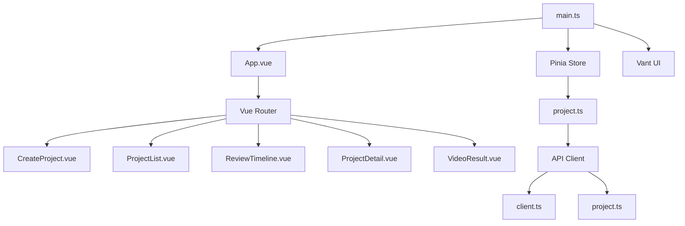
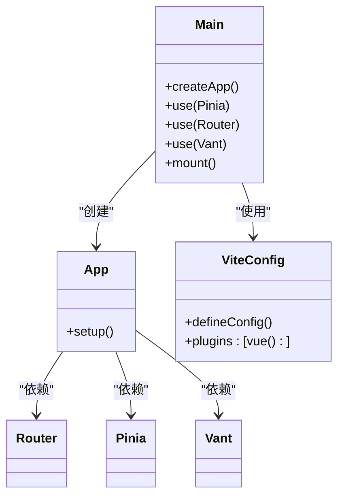
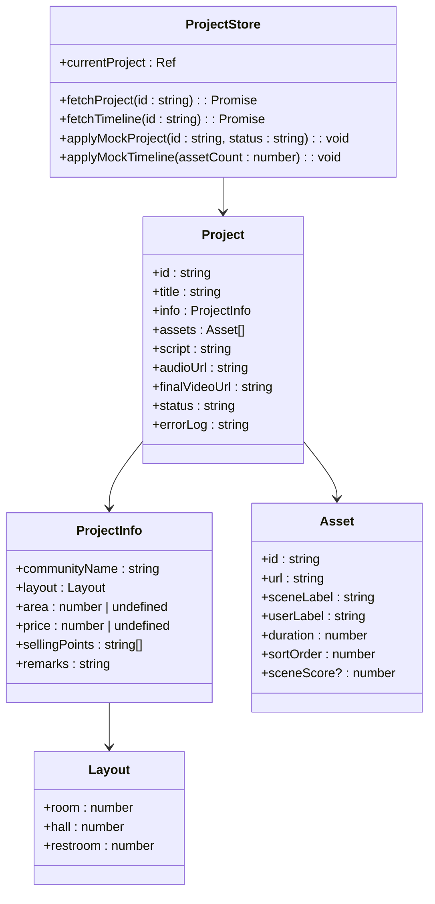
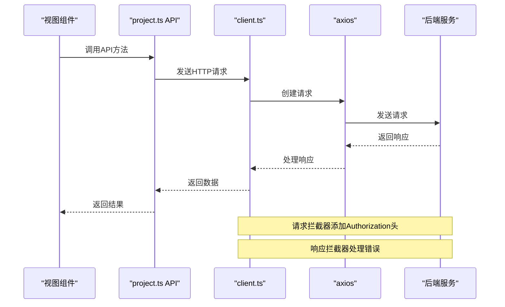
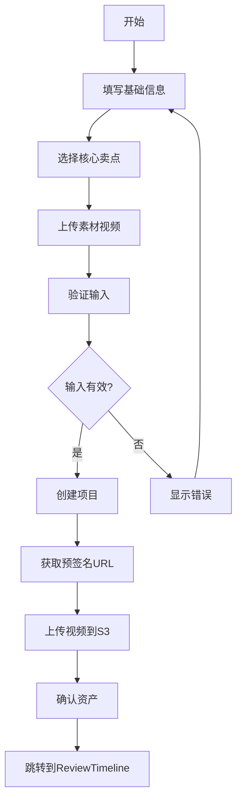
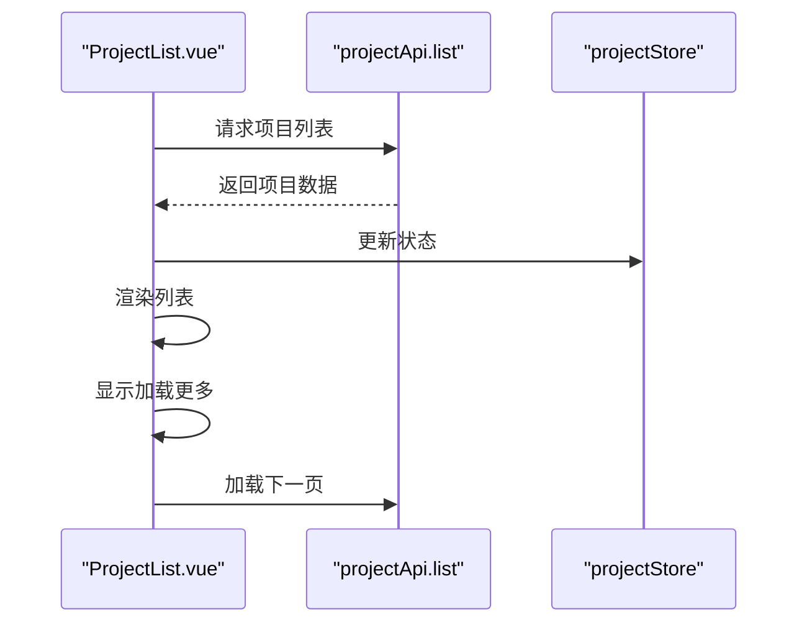
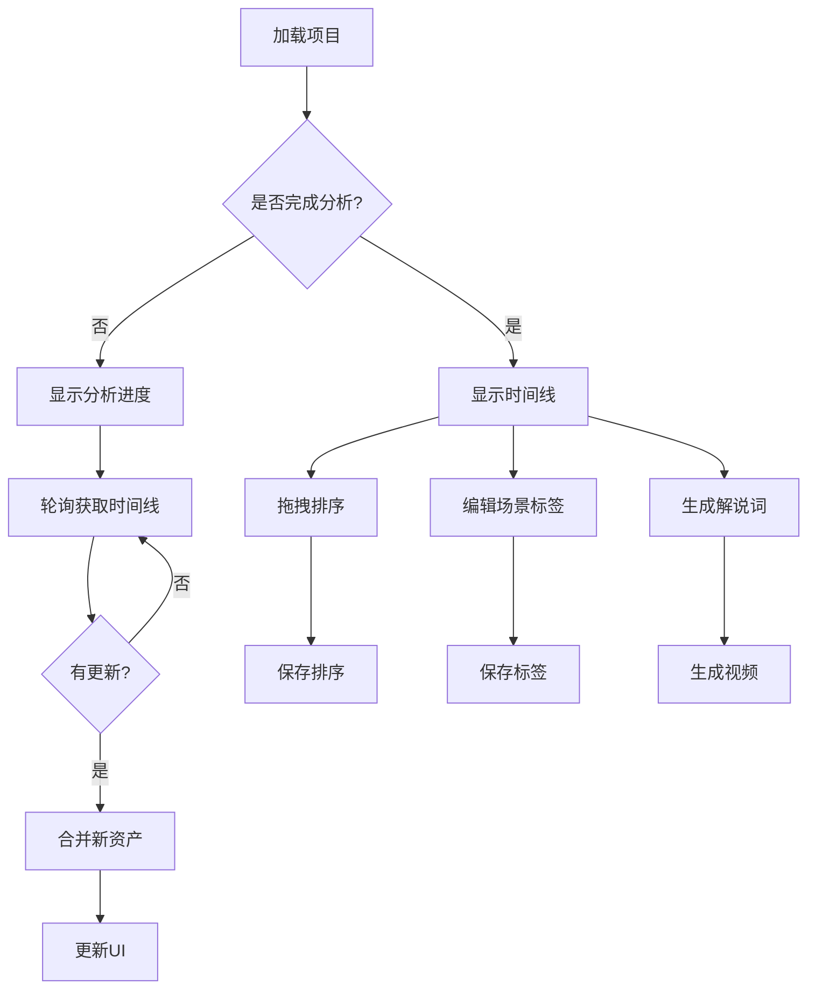
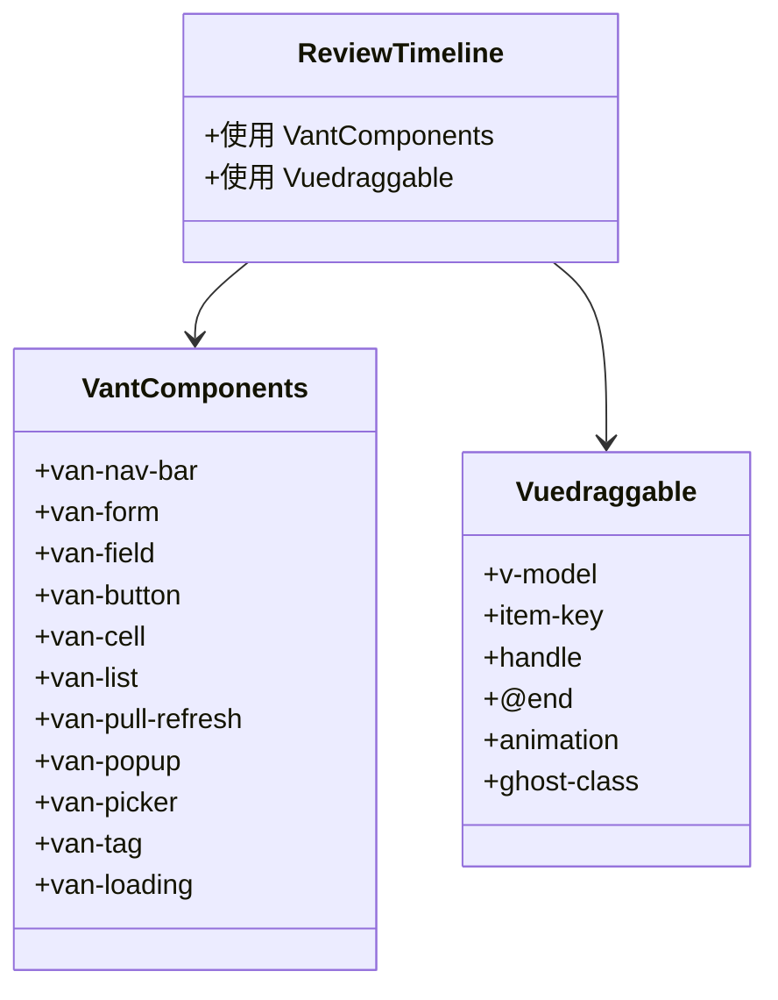

# 前端架构

<cite>
**本文档中引用的文件**  
- [main.ts](file://frontend/src/main.ts)
- [App.vue](file://frontend/src/App.vue)
- [router/index.ts](file://frontend/src/router/index.ts)
- [stores/project.ts](file://frontend/src/stores/project.ts)
- [api/client.ts](file://frontend/src/api/client.ts)
- [api/project.ts](file://frontend/src/api/project.ts)
- [views/CreateProject.vue](file://frontend/src/views/CreateProject.vue)
- [views/ProjectList.vue](file://frontend/src/views/ProjectList.vue)
- [views/ReviewTimeline.vue](file://frontend/src/views/ReviewTimeline.vue)
- [vite.config.ts](file://frontend/vite.config.ts)
- [package.json](file://frontend/package.json)
</cite>

## 目录
1. [项目结构](#项目结构)
2. [核心架构设计](#核心架构设计)
3. [状态管理](#状态管理)
4. [API客户端设计](#api客户端设计)
5. [核心视图组件](#核心视图组件)
6. [UI组件库与交互](#ui组件库与交互)
7. [组件通信与数据流](#组件通信与数据流)
8. [开发最佳实践](#开发最佳实践)

## 项目结构

前端应用采用基于Vue 3和TypeScript的标准Vite项目结构，遵循模块化设计原则。项目入口为`main.ts`，通过`App.vue`作为根组件，结合Vue Router实现路由控制，Pinia管理全局状态。



**Diagram sources**  
- [main.ts](file://frontend/src/main.ts#L1-L15)
- [App.vue](file://frontend/src/App.vue#L1-L15)
- [router/index.ts](file://frontend/src/router/index.ts#L1-L45)

**Section sources**
- [main.ts](file://frontend/src/main.ts#L1-L16)
- [App.vue](file://frontend/src/App.vue#L1-L15)
- [router/index.ts](file://frontend/src/router/index.ts#L1-L45)

## 核心架构设计

项目采用MVVM（Model-View-ViewModel）架构模式，基于Vue 3的Composition API和TypeScript实现。Vite作为构建工具提供了快速的开发服务器和高效的生产构建，支持热模块替换（HMR）和按需编译。



**Diagram sources**  
- [main.ts](file://frontend/src/main.ts#L1-L15)
- [vite.config.ts](file://frontend/vite.config.ts#L1-L8)
- [package.json](file://frontend/package.json#L1-L28)

**Section sources**
- [main.ts](file://frontend/src/main.ts#L1-L16)
- [vite.config.ts](file://frontend/vite.config.ts#L1-L8)
- [package.json](file://frontend/package.json#L1-L28)

## 状态管理

项目使用Pinia作为状态管理库，`project.ts` store集中管理项目创建、列表和详情等全局状态。store通过`defineStore`定义，使用`ref`响应式变量存储当前项目数据，并提供异步操作方法。



**Diagram sources**  
- [stores/project.ts](file://frontend/src/stores/project.ts#L1-L219)

**Section sources**
- [stores/project.ts](file://frontend/src/stores/project.ts#L1-L219)

## API客户端设计

API客户端设计采用分层架构，`client.ts`封装axios实例，统一处理请求、响应和错误。`project.ts` API模块基于client构建，提供类型安全的项目相关操作接口。



**Diagram sources**  
- [api/client.ts](file://frontend/src/api/client.ts#L1-L36)
- [api/project.ts](file://frontend/src/api/project.ts#L1-L111)

**Section sources**
- [api/client.ts](file://frontend/src/api/client.ts#L1-L36)
- [api/project.ts](file://frontend/src/api/project.ts#L1-L111)

## 核心视图组件

### CreateProject.vue 组件

`CreateProject.vue`组件负责项目创建流程，包含基础信息、核心卖点和素材上传三个主要部分。组件使用Vant的表单组件收集用户输入，并通过API提交项目创建请求。



**Diagram sources**  
- [views/CreateProject.vue](file://frontend/src/views/CreateProject.vue#L1-L534)

**Section sources**
- [views/CreateProject.vue](file://frontend/src/views/CreateProject.vue#L1-L534)

### ProjectList.vue 组件

`ProjectList.vue`组件展示项目列表，支持下拉刷新和分页加载。组件通过`van-pull-refresh`和`van-list`实现流畅的滚动加载体验，并提供浮动按钮快速创建新项目。



**Diagram sources**  
- [views/ProjectList.vue](file://frontend/src/views/ProjectList.vue#L1-L143)

**Section sources**
- [views/ProjectList.vue](file://frontend/src/views/ProjectList.vue#L1-L143)

### ReviewTimeline.vue 组件

`ReviewTimeline.vue`组件提供视频时间线的确认和编辑功能，支持拖拽排序、场景标签修正和解说词编辑。组件通过轮询机制实时获取AI分析进度。



**Diagram sources**  
- [views/ReviewTimeline.vue](file://frontend/src/views/ReviewTimeline.vue#L1-L800)

**Section sources**
- [views/ReviewTimeline.vue](file://frontend/src/views/ReviewTimeline.vue#L1-L800)

## UI组件库与交互

项目集成Vant UI组件库，提供一致的移动端用户体验。`vuedraggable`用于实现时间线片段的拖拽排序功能，通过`draggable`组件和`v-model`实现双向数据绑定。



**Diagram sources**  
- [views/ReviewTimeline.vue](file://frontend/src/views/ReviewTimeline.vue#L71-L79)
- [package.json](file://frontend/package.json#L1-L28)

**Section sources**
- [views/ReviewTimeline.vue](file://frontend/src/views/ReviewTimeline.vue#L71-L79)
- [package.json](file://frontend/package.json#L1-L28)

## 组件通信与状态同步

组件间通过Pinia store进行状态同步，避免了深层嵌套的prop传递。视图组件通过调用store的action方法触发状态变更，同时监听store的响应式数据实现UI更新。

```mermaid
sequenceDiagram
participant Create as "CreateProject.vue"
participant Review as "ReviewTimeline.vue"
participant Store as "projectStore"
Create->>Store : fetchProject()
Store->>API : getProject()
API-->>Store : 返回数据
Store-->>Create : 更新currentProject
Create->>Store : fetchTimeline()
Store->>API : getTimeline()
API-->>Store : 返回时间线
Store-->>Create : 更新assets
Create->>Review : 路由跳转
Review->>Store : 监听currentProject
Store-->>Review : 响应式更新
```

**Diagram sources**  
- [stores/project.ts](file://frontend/src/stores/project.ts#L66-L102)
- [views/CreateProject.vue](file://frontend/src/views/CreateProject.vue#L257-L325)
- [views/ReviewTimeline.vue](file://frontend/src/views/ReviewTimeline.vue#L296-L316)

**Section sources**
- [stores/project.ts](file://frontend/src/stores/project.ts#L66-L102)
- [views/CreateProject.vue](file://frontend/src/views/CreateProject.vue#L257-L325)
- [views/ReviewTimeline.vue](file://frontend/src/views/ReviewTimeline.vue#L296-L316)

## 开发最佳实践

1. **类型安全**：使用TypeScript定义接口，确保API响应和状态结构的类型安全
2. **模块化设计**：将API调用、状态管理、视图组件分离，提高代码可维护性
3. **错误处理**：在API客户端和视图组件中实现统一的错误处理机制
4. **性能优化**：使用Vite的按需编译和HMR，提高开发效率
5. **用户体验**：通过加载状态、进度指示和错误提示提升用户体验
6. **代码复用**：通过Pinia store实现跨组件状态共享，避免重复请求

**Section sources**
- [main.ts](file://frontend/src/main.ts#L1-L16)
- [api/client.ts](file://frontend/src/api/client.ts#L1-L36)
- [stores/project.ts](file://frontend/src/stores/project.ts#L1-L219)
- [views/CreateProject.vue](file://frontend/src/views/CreateProject.vue#L1-L534)
- [views/ReviewTimeline.vue](file://frontend/src/views/ReviewTimeline.vue#L1-L800)