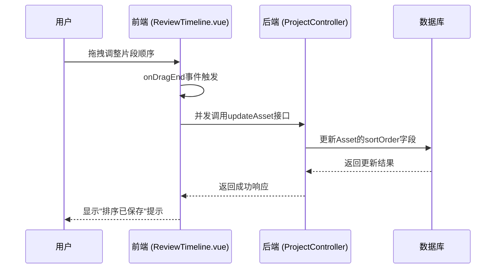

# 时间线评审组件

<cite>
**本文档引用的文件**
- [ReviewTimeline.vue](file://frontend/src/views/ReviewTimeline.vue#L1-L1076)
- [project.ts](file://frontend/src/stores/project.ts#L1-L219)
- [project.ts](file://frontend/src/api/project.ts#L1-L111)
- [UpdateAssetRequest.java](file://backend/src/main/java/com/aiscene/dto/UpdateAssetRequest.java#L1-L16)
- [ProjectController.java](file://backend/src/main/java/com/aiscene/controller/ProjectController.java#L133-L137)
- [ProjectService.java](file://backend/src/main/java/com/aiscene/service/ProjectService.java#L126-L140)
- [Asset.java](file://backend/src/main/java/com/aiscene/entity/Asset.java#L54-L55)
</cite>

## 目录
1. [简介](#简介)
2. [核心功能实现](#核心功能实现)
3. [拖拽排序与状态同步](#拖拽排序与状态同步)
4. [脏检查与保存提示](#脏检查与保存提示)
5. [脚本生成与视频合成流程](#脚本生成与视频合成流程)
6. [交互优化建议](#交互优化建议)
7. [结论](#结论)

## 简介
时间线评审组件（ReviewTimeline.vue）是AI场景到视频生成系统中的关键界面，用于展示AI识别出的各个场景片段（Asset）并允许用户调整其播放顺序。该组件基于vuedraggable库实现了直观的拖拽排序功能，支持用户通过长按拖拽的方式重新排列视频片段。组件不仅实现了本地状态的实时更新，还通过与后端UpdateAssetRequest的同步机制确保了排序结果的持久化。此外，组件还包含了拖拽结束后的脏检查与保存提示逻辑，以及确认修改后触发脚本生成任务的完整流程。

## 核心功能实现
时间线评审组件的核心功能是基于vuedraggable库实现的拖拽排序功能。组件通过`<draggable>`标签包裹时间线项目列表，利用`v-model="assets"`实现双向数据绑定，确保拖拽操作能够直接反映在数据模型上。每个时间线项目包含视频预览、场景标签、播放时长等信息，并通过`index-badge`显示片段序号。组件还提供了场景标签修正功能，用户可以通过点击编辑图标打开选择器来修正AI识别的场景标签。

**组件来源**
- [ReviewTimeline.vue](file://frontend/src/views/ReviewTimeline.vue#L71-L140)

## 拖拽排序与状态同步
拖拽排序功能通过vuedraggable的`@end`事件监听器实现，当拖拽操作结束后触发`onDragEnd`方法。该方法遍历当前assets数组，为每个片段调用`projectApi.updateAsset`方法，将新的排序索引（sortOrder）发送到后端。后端通过UpdateAssetRequest DTO接收排序更新请求，并在ProjectService中更新数据库中的sortOrder字段。前端通过`Promise.all`并发执行所有更新请求，确保排序结果能够快速同步到服务器。



**图示来源**
- [ReviewTimeline.vue](file://frontend/src/views/ReviewTimeline.vue#L76-L78)
- [project.ts](file://frontend/src/api/project.ts#L75-L77)
- [UpdateAssetRequest.java](file://backend/src/main/java/com/aiscene/dto/UpdateAssetRequest.java#L14)
- [ProjectController.java](file://backend/src/main/java/com/aiscene/controller/ProjectController.java#L133-L137)
- [ProjectService.java](file://backend/src/main/java/com/aiscene/service/ProjectService.java#L126-L140)
- [Asset.java](file://backend/src/main/java/com/aiscene/entity/Asset.java#L54-L55)

## 脏检查与保存提示
组件通过`onDragEnd`方法实现脏检查与保存提示逻辑。当拖拽操作结束后，系统会自动检测排序是否发生变化，并通过`Promise.all`并发执行所有排序更新请求。如果所有更新请求成功完成，系统会显示"排序已保存"的提示信息；如果任一请求失败，则显示"排序保存失败"的错误提示。这种机制确保了用户能够及时了解排序操作的结果，提高了用户体验。

**组件来源**
- [ReviewTimeline.vue](file://frontend/src/views/ReviewTimeline.vue#L602-L618)

## 脚本生成与视频合成流程
确认修改后，用户可以触发脚本生成任务。组件通过`onGenerateScript`方法提交生成解说词任务，并启动轮询以监控任务状态。当脚本生成完成后，系统会自动将生成的解说词分配到各个片段。用户还可以通过`onGenerateVideo`方法提交视频合成任务，在提交前会检查解说词是否为空，确保合成任务的完整性。整个流程通过状态管理实现了无缝衔接，确保了从排序调整到视频生成的流畅体验。

```mermaid
flowchart TD
A[用户调整片段顺序] --> B[拖拽结束触发onDragEnd]
B --> C[并发更新所有片段的sortOrder]
C --> D{更新成功?}
D --> |是| E[显示"排序已保存"]
D --> |否| F[显示"排序保存失败"]
E --> G[用户点击生成解说]
G --> H[调用generateScript接口]
H --> I[启动轮询监控状态]
I --> J{脚本生成完成?}
J --> |是| K[分配解说词到各片段]
J --> |否| I
K --> L[用户点击生成视频]
L --> M[检查解说词是否为空]
M --> N{解说词存在?}
N --> |是| O[调用renderVideo接口]
N --> |否| P[提示"请先生成或填写解说词"]
```

**图示来源**
- [ReviewTimeline.vue](file://frontend/src/views/ReviewTimeline.vue#L648-L694)
- [project.ts](file://frontend/src/api/project.ts#L83-L84)
- [ProjectService.java](file://backend/src/main/java/com/aiscene/service/ProjectService.java#L144-L164)

## 交互优化建议
为了进一步提升用户体验，建议实施以下交互优化措施：

1. **拖拽反馈动画**：当前组件已通过`ghost-class="ghost-item"`实现了基本的拖拽反馈效果，建议进一步优化动画效果，如添加平滑的移动过渡和阴影效果，使拖拽过程更加流畅自然。

2. **冲突检测**：建议在拖拽过程中增加冲突检测机制，当用户尝试将片段拖拽到不合法位置时（如超出边界），系统应提供视觉反馈并阻止该操作。

3. **用户操作撤销支持**：建议增加撤销功能，允许用户撤销最近的排序操作。可以通过维护一个操作历史栈来实现，用户可以通过点击撤销按钮恢复到上一个状态。

4. **批量操作支持**：建议增加批量选择和批量排序功能，允许用户同时选择多个片段进行统一操作，提高操作效率。

5. **键盘辅助操作**：建议增加键盘快捷键支持，如使用方向键微调片段位置，使用Ctrl+Z撤销操作等，提升可访问性。

## 结论
时间线评审组件通过vuedraggable库实现了直观的拖拽排序功能，结合后端UpdateAssetRequest的同步机制，确保了排序结果的准确性和持久性。组件不仅实现了基本的排序功能，还包含了完善的脏检查、保存提示和任务触发流程，为用户提供了一个完整的时间线编辑体验。通过实施建议的交互优化措施，可以进一步提升用户体验，使时间线评审过程更加高效和愉悦。