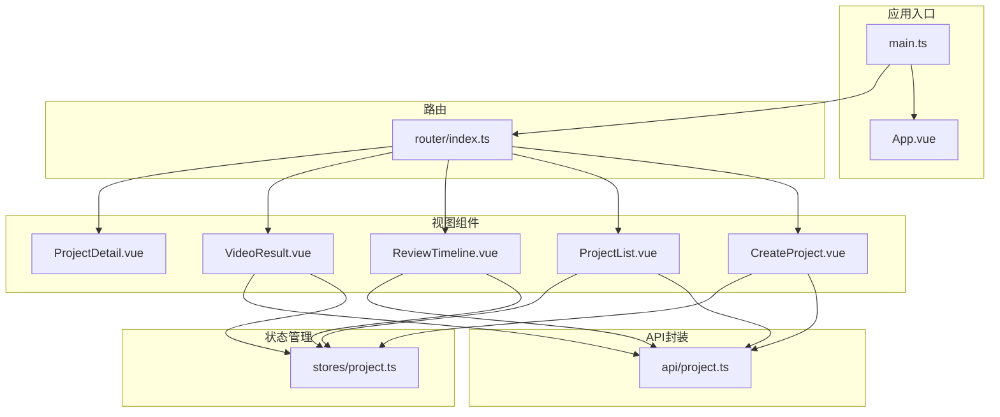
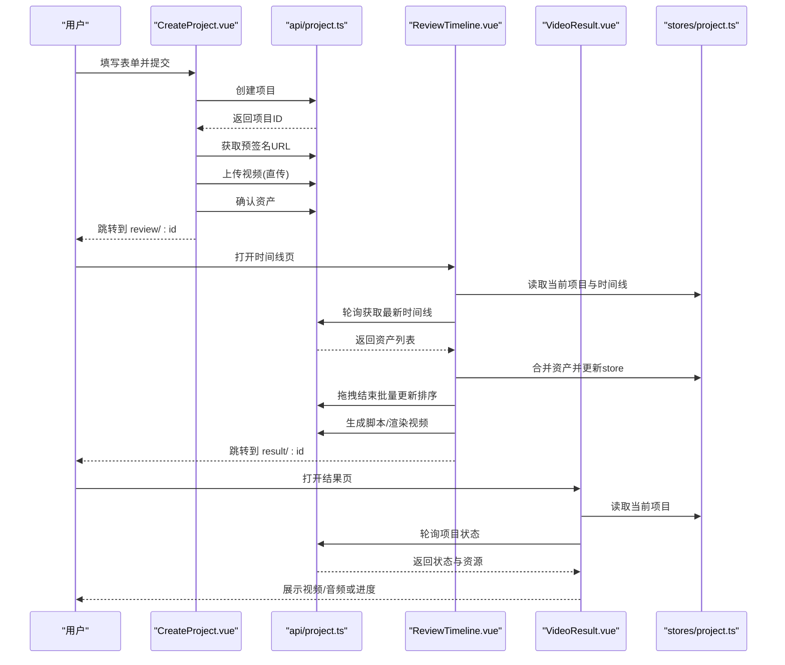
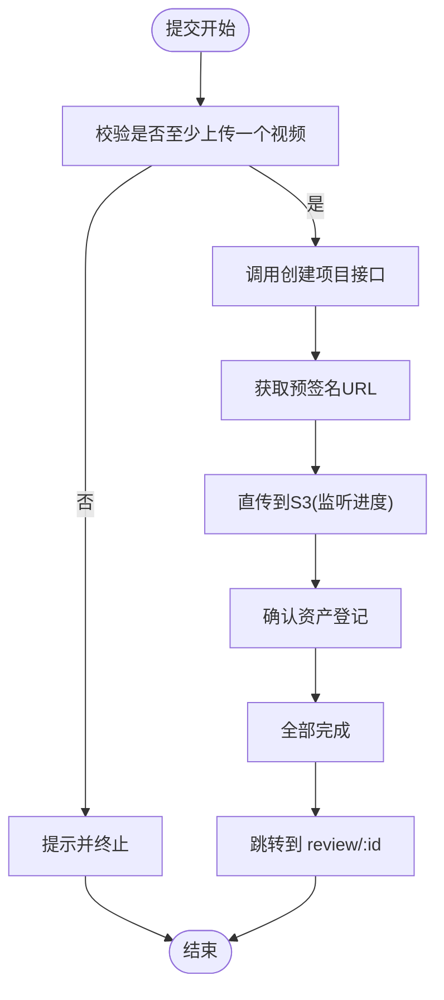
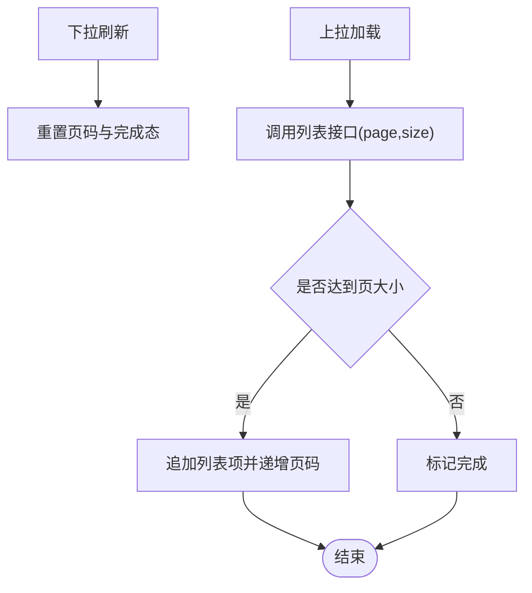
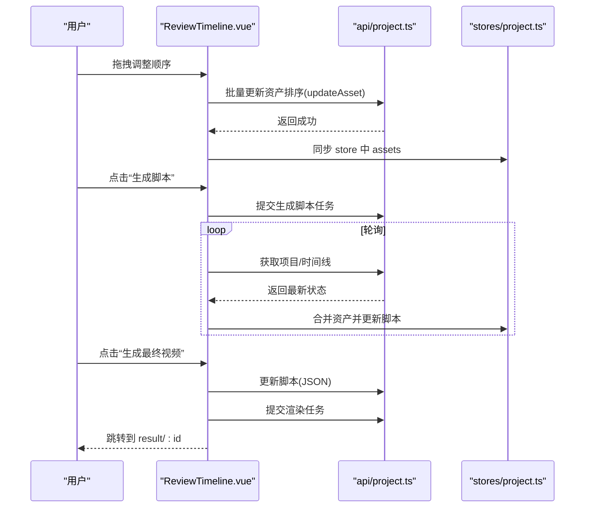
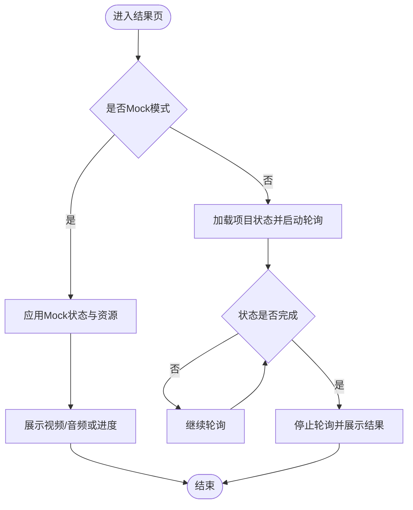
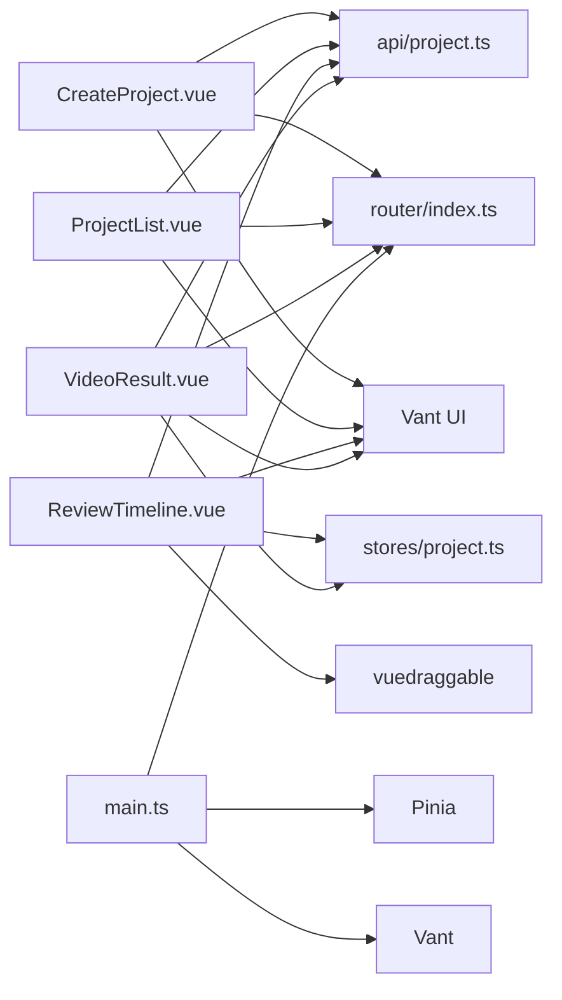

# 核心UI组件

<cite>
**本文引用的文件**
- [frontend/src/views/CreateProject.vue](file://frontend/src/views/CreateProject.vue)
- [frontend/src/views/ProjectList.vue](file://frontend/src/views/ProjectList.vue)
- [frontend/src/views/ReviewTimeline.vue](file://frontend/src/views/ReviewTimeline.vue)
- [frontend/src/views/VideoResult.vue](file://frontend/src/views/VideoResult.vue)
- [frontend/src/views/ProjectDetail.vue](file://frontend/src/views/ProjectDetail.vue)
- [frontend/src/components/HelloWorld.vue](file://frontend/src/components/HelloWorld.vue)
- [frontend/src/api/project.ts](file://frontend/src/api/project.ts)
- [frontend/src/stores/project.ts](file://frontend/src/stores/project.ts)
- [frontend/src/router/index.ts](file://frontend/src/router/index.ts)
- [frontend/src/main.ts](file://frontend/src/main.ts)
- [frontend/src/App.vue](file://frontend/src/App.vue)
</cite>

## 目录
1. [简介](#简介)
2. [项目结构](#项目结构)
3. [核心组件](#核心组件)
4. [架构总览](#架构总览)
5. [详细组件分析](#详细组件分析)
6. [依赖分析](#依赖分析)
7. [性能考虑](#性能考虑)
8. [故障排查指南](#故障排查指南)
9. [结论](#结论)
10. [附录](#附录)

## 简介
本文件系统化梳理前端核心视图组件的设计与实现，围绕以下目标展开：
- CreateProject.vue 的表单结构与路由导航逻辑
- ProjectList.vue 的列表渲染与状态过滤机制
- ReviewTimeline.vue 中基于 vuedraggable 的时间线排序交互
- VideoResult.vue 的视频播放与结果展示逻辑
- 组件间父子关系与事件通信模式（props 接收状态、emit 传递用户操作）
- 结合 HelloWorld.vue 示例阐述基础组件开发规范
- 提供组件复用建议、响应式布局实现及可访问性优化技巧

## 项目结构
前端采用 Vue 3 + Vite + Pinia + Vant 的技术栈，路由采用 vue-router，核心页面集中在 views 目录，状态管理在 stores，API 封装在 api，入口在 main.ts 中注册插件与路由。

图表来源
- [frontend/src/main.ts](file://frontend/src/main.ts#L1-L16)
- [frontend/src/App.vue](file://frontend/src/App.vue#L1-L15)
- [frontend/src/router/index.ts](file://frontend/src/router/index.ts#L1-L45)
- [frontend/src/views/CreateProject.vue](file://frontend/src/views/CreateProject.vue#L1-L534)
- [frontend/src/views/ProjectList.vue](file://frontend/src/views/ProjectList.vue#L1-L143)
- [frontend/src/views/ReviewTimeline.vue](file://frontend/src/views/ReviewTimeline.vue#L1-L800)
- [frontend/src/views/VideoResult.vue](file://frontend/src/views/VideoResult.vue#L1-L427)
- [frontend/src/views/ProjectDetail.vue](file://frontend/src/views/ProjectDetail.vue)
- [frontend/src/stores/project.ts](file://frontend/src/stores/project.ts#L1-L219)
- [frontend/src/api/project.ts](file://frontend/src/api/project.ts#L1-L111)

章节来源
- [frontend/src/main.ts](file://frontend/src/main.ts#L1-L16)
- [frontend/src/App.vue](file://frontend/src/App.vue#L1-L15)
- [frontend/src/router/index.ts](file://frontend/src/router/index.ts#L1-L45)

## 核心组件
本节从职责、数据流、交互与状态管理四个维度，对四个核心视图组件进行深入剖析，并给出组件间通信与复用建议。

- CreateProject.vue
  - 表单结构：包含基础信息（社区名、户型、面积、价格）、核心卖点标签选择、补充说明文本域、素材上传（多视频、进度覆盖层、失败提示、删除遮罩）。
  - 上传流程：使用后端预签名直传（presigned URL），通过 XHR 监听进度，逐个资产 confirm 登记，最后跳转 review 页面。
  - 路由导航：提交成功后跳转到 review/:id。
  - 关键交互：户型三段输入、卖点标签切换、上传文件预览与删除、提交按钮 loading 与提示文案。
  - 章节来源
    - [frontend/src/views/CreateProject.vue](file://frontend/src/views/CreateProject.vue#L1-L534)

- ProjectList.vue
  - 列表渲染：基于 van-list 与 van-pull-refresh 实现上拉加载与下拉刷新；每项显示标题、ID、创建时间、状态标签与错误追踪信息。
  - 状态过滤：根据状态映射不同 tag 类型（成功/失败/渲染中/默认）。
  - 导航：点击条目进入详情页，悬浮按钮跳转创建页。
  - 章节来源
    - [frontend/src/views/ProjectList.vue](file://frontend/src/views/ProjectList.vue#L1-L143)

- ReviewTimeline.vue
  - 时间线排序：使用 vuedraggable 对资产数组进行拖拽排序，拖拽结束时批量更新排序并同步 store。
  - 实时进度：轮询后端 timeline，合并新资产，动态更新“分析进度”与“刷新错误”提示。
  - 编辑能力：支持修正场景标签（弹窗选择）、为每个片段编辑脚本（字数预算提示）。
  - 生成流程：提交生成脚本任务、提交渲染任务，最终跳转结果页。
  - 章节来源
    - [frontend/src/views/ReviewTimeline.vue](file://frontend/src/views/ReviewTimeline.vue#L1-L800)

- VideoResult.vue
  - 结果展示：当 finalVideoUrl 存在时展示视频与音频；否则根据状态展示“合成中”进度与步骤。
  - 轮询机制：定时轮询项目状态，直到 COMPLETED 或 FAILED。
  - 用户操作：保存到相册（模拟下载）、复制链接分享、返回首页。
  - 章节来源
    - [frontend/src/views/VideoResult.vue](file://frontend/src/views/VideoResult.vue#L1-L427)

章节来源
- [frontend/src/views/CreateProject.vue](file://frontend/src/views/CreateProject.vue#L1-L534)
- [frontend/src/views/ProjectList.vue](file://frontend/src/views/ProjectList.vue#L1-L143)
- [frontend/src/views/ReviewTimeline.vue](file://frontend/src/views/ReviewTimeline.vue#L1-L800)
- [frontend/src/views/VideoResult.vue](file://frontend/src/views/VideoResult.vue#L1-L427)

## 架构总览
下面以序列图展示从创建到结果的关键流程，体现组件间的数据与控制流转。

图表来源
- [frontend/src/views/CreateProject.vue](file://frontend/src/views/CreateProject.vue#L257-L333)
- [frontend/src/views/ReviewTimeline.vue](file://frontend/src/views/ReviewTimeline.vue#L498-L695)
- [frontend/src/views/VideoResult.vue](file://frontend/src/views/VideoResult.vue#L152-L205)
- [frontend/src/api/project.ts](file://frontend/src/api/project.ts#L36-L111)
- [frontend/src/stores/project.ts](file://frontend/src/stores/project.ts#L66-L153)

## 详细组件分析

### CreateProject.vue：表单结构与路由导航
- 表单字段与校验
  - 基础信息：社区名必填、户型三段数字输入、面积与价格数值输入、必填校验。
  - 卖点标签：多选标签集合，点击切换 active 状态。
  - 备注：文本域，支持自动高度。
- 素材上传
  - 使用 van-uploader 支持多文件、限制大小、after-read 回调生成 objectUrl 并初始化状态。
  - 上传覆盖层：上传中显示进度与百分比，失败显示失败提示。
  - 删除：点击遮罩删除对应文件项。
- 上传与提交流程
  - 提交前校验至少上传一个视频。
  - 创建项目 -> 获取预签名 URL -> 上传到 S3 -> 确认资产 -> 跳转 review。
  - 上传过程通过 XHR onprogress 计算百分比并更新 UI。
- 路由导航
  - 成功后 router.push 到 review/:id。
- 章节来源
  - [frontend/src/views/CreateProject.vue](file://frontend/src/views/CreateProject.vue#L1-L534)

图表来源
- [frontend/src/views/CreateProject.vue](file://frontend/src/views/CreateProject.vue#L257-L333)

### ProjectList.vue：列表渲染与状态过滤
- 渲染与分页
  - van-list 与 loading/finished 控制加载状态；下拉刷新重置页码并清空列表。
  - 每页固定数量，不足一页即标记 finished。
- 状态标签
  - 根据 status 返回不同类型标签（成功/失败/渲染中/默认）。
- 导航
  - 点击条目跳转至项目详情；悬浮按钮跳转创建页。
- 章节来源
  - [frontend/src/views/ProjectList.vue](file://frontend/src/views/ProjectList.vue#L1-L143)

图表来源
- [frontend/src/views/ProjectList.vue](file://frontend/src/views/ProjectList.vue#L64-L103)

### ReviewTimeline.vue：vuedraggable 时间线排序交互
- 拖拽排序
  - v-model 绑定资产数组，handle 指定拖拽手柄，end 事件触发保存排序。
  - onDragEnd 批量调用 updateAsset 更新 sortOrder，成功后同步 store。
- 实时进度与轮询
  - 轮询 timeline，合并新资产，动态更新“识别进度”、“刷新元信息”、“错误提示”。
  - 当识别完成且状态满足条件，停止轮询并提示完成。
- 场景标签与脚本编辑
  - 弹窗选择场景标签，支持用户自定义 userLabel。
  - 每个片段支持编辑脚本，字数预算按片段时长计算。
- 生成流程
  - 生成脚本：提交任务并轮询直到 SCRIPT_GENERATED，自动分发脚本到各片段。
  - 生成视频：校验脚本存在，提交更新脚本与渲染任务，跳转结果页。
- 章节来源
  - [frontend/src/views/ReviewTimeline.vue](file://frontend/src/views/ReviewTimeline.vue#L1-L800)

图表来源
- [frontend/src/views/ReviewTimeline.vue](file://frontend/src/views/ReviewTimeline.vue#L498-L695)
- [frontend/src/api/project.ts](file://frontend/src/api/project.ts#L75-L110)
- [frontend/src/stores/project.ts](file://frontend/src/stores/project.ts#L66-L153)

### VideoResult.vue：视频播放与结果展示
- 成功态：展示 finalVideoUrl 与 audioUrl，提供保存到相册与复制链接分享。
- 进行中态：根据状态映射百分比与步骤，展示语音生成、智能剪辑、合成字幕阶段。
- 轮询机制：onMounted 后启动轮询，定时检查项目状态，COMPLETED/FAILED 停止轮询。
- 错误态：显示错误描述与返回首页按钮。
- 章节来源
  - [frontend/src/views/VideoResult.vue](file://frontend/src/views/VideoResult.vue#L1-L427)

图表来源
- [frontend/src/views/VideoResult.vue](file://frontend/src/views/VideoResult.vue#L152-L205)

### HelloWorld.vue：基础组件开发规范示例
- Props 定义：通过 defineProps 声明外部传入属性，便于类型约束与文档化。
- 响应式状态：使用 ref 管理内部状态，模板中绑定与事件处理。
- 最小可运行示例：适合演示组件交互与热更新（HMR）。
- 章节来源
  - [frontend/src/components/HelloWorld.vue](file://frontend/src/components/HelloWorld.vue#L1-L42)

## 依赖分析
- 组件与外部依赖
  - CreateProject.vue 依赖 api/project.ts（创建项目、上传、确认资产）、router（导航）、Vant UI 组件库。
  - ProjectList.vue 依赖 api/project.ts（列表查询）、router（导航）、Vant UI 组件库。
  - ReviewTimeline.vue 依赖 stores/project.ts（全局项目状态）、api/project.ts（轮询、更新、生成脚本/渲染）、vuedraggable（拖拽）、Vant UI 组件库。
  - VideoResult.vue 依赖 stores/project.ts（读取项目状态）、api/project.ts（轮询）、router（导航）。
- 入口与插件
  - main.ts 注册 Pinia、router、Vant，并挂载应用。
- 章节来源
  - [frontend/src/main.ts](file://frontend/src/main.ts#L1-L16)
  - [frontend/src/api/project.ts](file://frontend/src/api/project.ts#L1-L111)
  - [frontend/src/stores/project.ts](file://frontend/src/stores/project.ts#L1-L219)
  - [frontend/src/router/index.ts](file://frontend/src/router/index.ts#L1-L45)

图表来源
- [frontend/src/main.ts](file://frontend/src/main.ts#L1-L16)
- [frontend/src/router/index.ts](file://frontend/src/router/index.ts#L1-L45)
- [frontend/src/api/project.ts](file://frontend/src/api/project.ts#L1-L111)
- [frontend/src/stores/project.ts](file://frontend/src/stores/project.ts#L1-L219)
- [frontend/src/views/ReviewTimeline.vue](file://frontend/src/views/ReviewTimeline.vue#L1-L800)

## 性能考虑
- 上传性能
  - 使用预签名直传减少网关压力，XHR 监听进度避免阻塞 UI。
  - 上传失败快速反馈并保留失败状态，避免重复尝试造成资源浪费。
- 列表加载
  - 上拉加载与下拉刷新配合，合理设置页大小，避免一次性加载过多数据。
- 轮询策略
  - ReviewTimeline 与 VideoResult 的轮询间隔适中，识别完成或任务完成后及时停止，降低请求频率。
- 拖拽排序
  - v-model 直接绑定数组，拖拽结束批量更新排序，减少多次细粒度请求。
- 响应式与布局
  - 使用相对单位与 max-height 控制视频容器尺寸，避免布局抖动。
- 可访问性
  - 为按钮与图标提供语义化标签与替代文本，确保键盘可达与屏幕阅读器友好。
  - 为视频与音频控件提供明确的标题与说明，避免仅依赖视觉提示。

## 故障排查指南
- 上传失败
  - 现象：上传覆盖层显示失败，消息提示“失败”。
  - 排查：检查预签名 URL 获取、网络状态、文件大小限制、S3 权限。
  - 章节来源
    - [frontend/src/views/CreateProject.vue](file://frontend/src/views/CreateProject.vue#L284-L333)

- 列表加载异常
  - 现象：加载失败提示，或无法继续加载。
  - 排查：确认接口返回格式、页码与页大小、finished 标志位。
  - 章节来源
    - [frontend/src/views/ProjectList.vue](file://frontend/src/views/ProjectList.vue#L64-L103)

- 时间线轮询错误
  - 现象：刷新失败提示，自动重试。
  - 排查：检查网络、后端轮询接口可用性、错误计数与最后一次错误时间。
  - 章节来源
    - [frontend/src/views/ReviewTimeline.vue](file://frontend/src/views/ReviewTimeline.vue#L498-L575)

- 生成脚本/渲染失败
  - 现象：提交任务后未完成或报错。
  - 排查：确认脚本内容非空、后端任务队列状态、轮询是否停止。
  - 章节来源
    - [frontend/src/views/ReviewTimeline.vue](file://frontend/src/views/ReviewTimeline.vue#L648-L695)

- 结果页状态异常
  - 现象：长时间处于进行中或显示错误。
  - 排查：检查项目状态轮询、finalVideoUrl/audioUrl 是否就绪。
  - 章节来源
    - [frontend/src/views/VideoResult.vue](file://frontend/src/views/VideoResult.vue#L152-L205)

## 结论
四个核心视图组件围绕“创建-确认-生成-结果”的完整流程协同工作：CreateProject.vue 负责素材与项目创建，ProjectList.vue 提供项目概览与导航，ReviewTimeline.vue 实现时间线编辑与生成流程，VideoResult.vue 展示最终成果并提供分享与下载能力。组件间通过 props 与 emit 传递状态与事件，结合 Pinia 管理全局状态，API 层统一处理后端交互，形成清晰的职责边界与稳定的扩展空间。

## 附录
- 组件复用建议
  - 将通用的上传卡片、进度条、标签选择等 UI 抽象为可复用子组件，通过 props 传参与事件发射解耦。
  - 将轮询逻辑抽象为通用 Hook，统一错误处理与重试策略。
- 响应式布局实现
  - 使用相对单位与 max-height 控制媒体容器，保证竖屏视频在不同设备上的良好显示。
  - 为关键按钮与表单元素设置合适的最小点击区域，提升移动端可用性。
- 可访问性优化技巧
  - 为图标与按钮提供 aria-label 或替代文本，确保屏幕阅读器可读。
  - 为视频与音频控件提供清晰的标题与说明，避免仅依赖颜色与图标传达信息。
- 事件通信模式
  - 父子组件：通过 props 下发状态，通过 $emit 上抛用户操作（如点击、拖拽结束、输入变更）。
  - 跨组件：通过 Pinia 共享状态，避免深层嵌套与繁琐的 props 传递。
- 章节来源
  - [frontend/src/stores/project.ts](file://frontend/src/stores/project.ts#L1-L219)
  - [frontend/src/api/project.ts](file://frontend/src/api/project.ts#L1-L111)