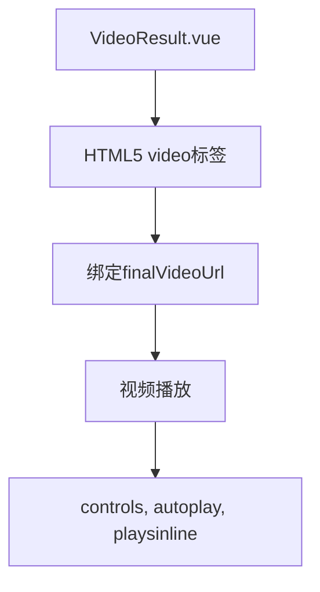
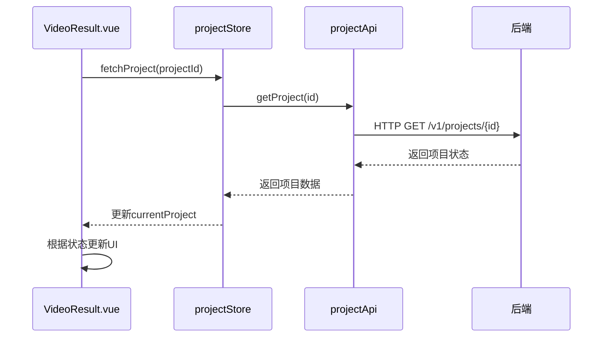
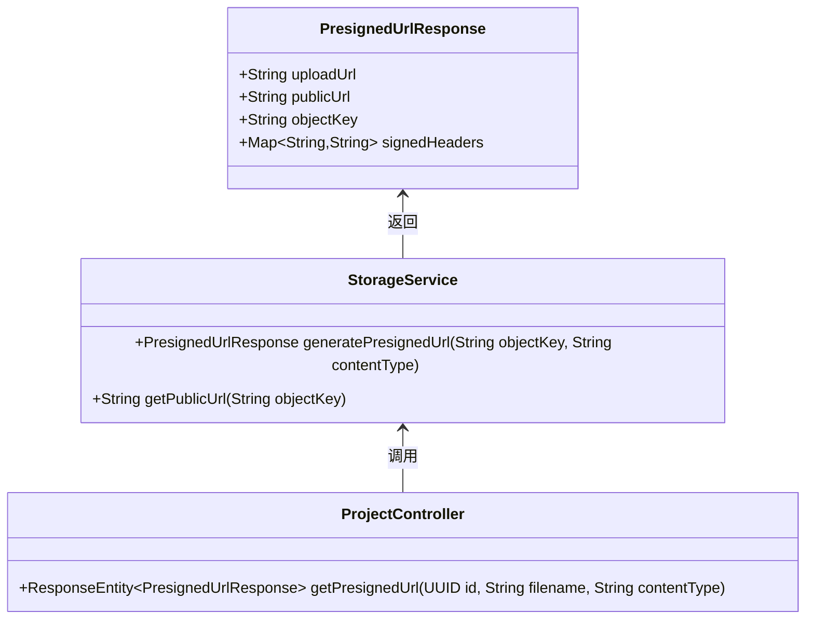

# 视频结果展示组件

<cite>
**本文档引用的文件**   
- [VideoResult.vue](file://frontend/src/views/VideoResult.vue)
- [project.ts](file://frontend/src/stores/project.ts)
- [project.ts](file://frontend/src/api/project.ts)
- [client.ts](file://frontend/src/api/client.ts)
- [PresignedUrlResponse.java](file://backend/src/main/java/com/aiscene/dto/PresignedUrlResponse.java)
- [StorageService.java](file://backend/src/main/java/com/aiscene/service/StorageService.java)
- [ProjectController.java](file://backend/src/main/java/com/aiscene/controller/ProjectController.java)
- [ProjectService.java](file://backend/src/main/java/com/aiscene/service/ProjectService.java)
- [TaskQueueService.java](file://backend/src/main/java/com/aiscene/service/TaskQueueService.java)
- [video_render.py](file://engine/video_render.py)
- [worker.py](file://engine/worker.py)
</cite>

## 目录
1. [简介](#简介)
2. [核心功能实现](#核心功能实现)
3. [视频播放器集成](#视频播放器集成)
4. [下载与分享功能](#下载与分享功能)
5. [渲染状态监听与进度展示](#渲染状态监听与进度展示)
6. [元数据呈现与重编辑入口](#元数据呈现与重编辑入口)
7. [预签名URL机制与大文件安全访问](#预签名url机制与大文件安全访问)
8. [结论](#结论)

## 简介
`VideoResult.vue` 是一个用于展示AI生成视频结果的前端组件，负责呈现最终渲染完成的房产解说视频。该组件不仅集成了视频播放功能，还提供了下载、分享等用户交互操作，并通过轮询机制实时监听渲染任务状态，展示渲染进度和完成情况。组件通过与后端服务的深度集成，实现了对大文件的安全访问控制，确保了用户体验和数据安全。

## 核心功能实现

`VideoResult.vue` 组件通过Vue 3的组合式API实现，利用Pinia状态管理库维护项目状态。组件根据项目状态动态切换UI视图：当视频已生成时显示播放器和操作按钮；在渲染过程中展示进度条和步骤指示；若任务失败则显示错误状态。组件通过`useProjectStore`获取当前项目信息，并在挂载时根据项目ID调用`fetchProject`方法获取项目详情。

**组件状态管理**
- `isInProgress`：计算属性，判断是否处于渲染过程中
- `stepIndex`：计算属性，根据项目状态确定当前渲染步骤
- `loadingPercent`：计算属性，根据项目状态计算加载进度百分比

**Section sources**
- [VideoResult.vue](file://frontend/src/views/VideoResult.vue#L128-L150)

## 视频播放器集成

该组件使用原生HTML5 `video` 标签集成视频播放功能，通过绑定`projectStore.currentProject.finalVideoUrl`实现视频源的动态加载。播放器配置了`controls`、`autoplay`和`playsinline`属性，提供基本的播放控制、自动播放和内联播放体验。视频容器设置了最大高度限制（60vh）和`object-fit: contain`，确保视频在不同设备上都能良好显示。

**Diagram sources **
- [VideoResult.vue](file://frontend/src/views/VideoResult.vue#L15-L21)

## 下载与分享功能

组件提供了两个主要的用户操作功能：下载视频和分享链接。

**下载功能**通过`downloadVideo`方法实现，该方法创建一个隐藏的`<a>`元素，设置其`href`为视频URL，`download`属性为包含楼盘名称的文件名，然后触发点击事件实现下载。此方法利用了HTML5的download属性，无需后端支持即可实现文件下载。

**分享功能**通过`shareVideo`方法实现，该方法使用`navigator.clipboard.writeText` API将当前页面URL复制到剪贴板，并通过Vant Toast组件提示用户。该实现考虑了现代浏览器的剪贴板权限机制，提供了复制成功和失败的反馈。

**Section sources**
- [VideoResult.vue](file://frontend/src/views/VideoResult.vue#L206-L226)

## 渲染状态监听与进度展示

组件通过轮询机制实时监听渲染任务状态。在`onMounted`生命周期钩子中，组件调用`checkStatus`方法获取项目状态，并启动一个3秒间隔的轮询定时器。`checkStatus`方法通过`projectStore.fetchProject`更新项目信息，当状态变为`COMPLETED`或`FAILED`时停止轮询。

进度展示通过`loadingPercent`计算属性和`stepIndex`计算属性实现。组件根据项目状态（`AUDIO_GENERATING`、`AUDIO_GENERATED`、`RENDERING`）动态更新进度百分比和当前步骤指示，为用户提供清晰的渲染过程反馈。

**Diagram sources **
- [VideoResult.vue](file://frontend/src/views/VideoResult.vue#L152-L204)
- [project.ts](file://frontend/src/stores/project.ts#L66-L81)
- [project.ts](file://frontend/src/api/project.ts#L107-L109)

## 元数据呈现与重编辑入口

组件通过`success-card`区域呈现视频生成成功的元数据，包括"视频制作成功"的标题和"AI 已为您完成剪辑、配音与字幕"的描述信息。成品视频的元数据（如楼盘名称、户型、面积等）通过`projectStore.currentProject.info`获取，并在相关页面中展示。

重编辑入口设计体现在"再做一个"按钮上，该按钮通过`router.push('/create')`导航到创建页面，允许用户基于相同或不同的输入重新生成视频。这种设计提供了良好的用户体验闭环，鼓励用户进行多次创作尝试。

**Section sources**
- [VideoResult.vue](file://frontend/src/views/VideoResult.vue#L28-L67)

## 预签名URL机制与大文件安全访问

系统通过`StorageService`生成预签名URL实现大文件的安全访问。`PresignedUrlResponse` DTO包含`uploadUrl`、`publicUrl`、`objectKey`和`signedHeaders`四个字段，其中`uploadUrl`是临时的上传地址，`publicUrl`是公开访问地址。

前端通过`projectApi.getPresignedUrl`调用后端API获取预签名URL，后端`StorageService.generatePresignedUrl`方法使用AWS SDK生成有效期为20分钟的预签名URL。对于已生成的视频，系统直接使用`publicUrl`进行访问，避免了长期暴露存储桶的需要。这种机制确保了大文件（如视频）的安全传输和访问，同时提供了良好的性能表现。

**Diagram sources **
- [PresignedUrlResponse.java](file://backend/src/main/java/com/aiscene/dto/PresignedUrlResponse.java#L7-L14)
- [StorageService.java](file://backend/src/main/java/com/aiscene/service/StorageService.java#L42-L69)
- [ProjectController.java](file://backend/src/main/java/com/aiscene/controller/ProjectController.java#L73-L82)

## 结论
`VideoResult.vue` 组件通过精心设计的UI和流畅的用户体验，成功实现了AI生成视频的展示功能。组件不仅提供了基本的视频播放、下载和分享功能，还通过实时状态监听和进度展示增强了用户交互体验。通过与后端预签名URL机制的集成，组件实现了大文件的安全访问，确保了系统的安全性和可靠性。整体设计体现了前后端分离架构下的高效协作，为用户提供了一个完整、直观的视频结果展示解决方案。