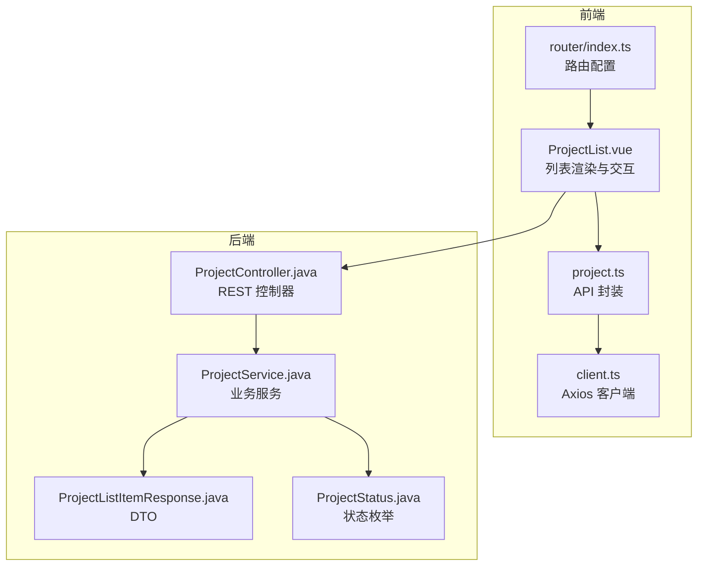
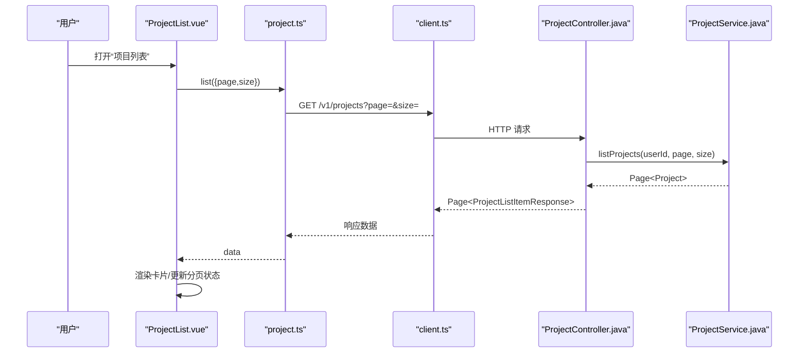
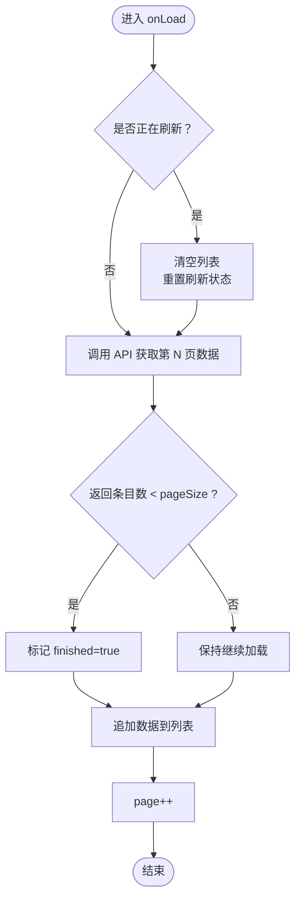
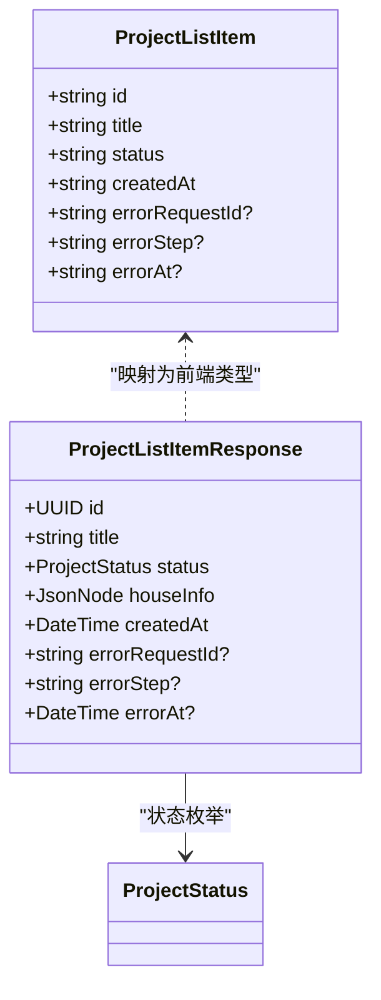
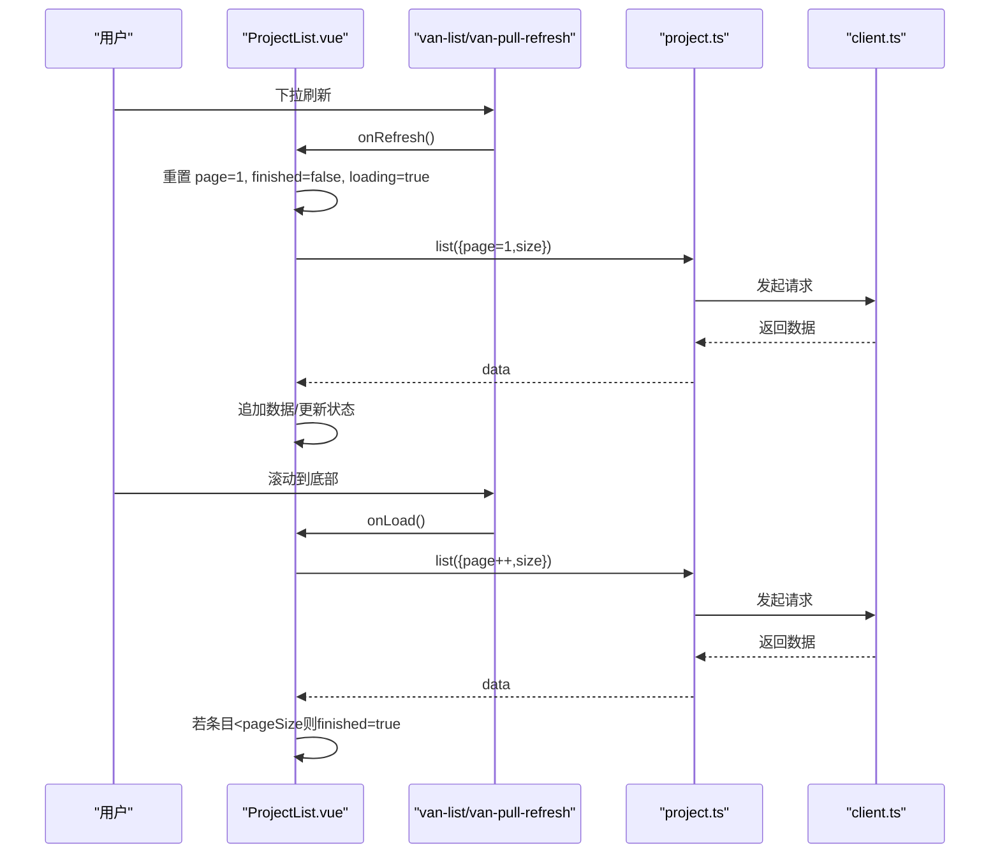
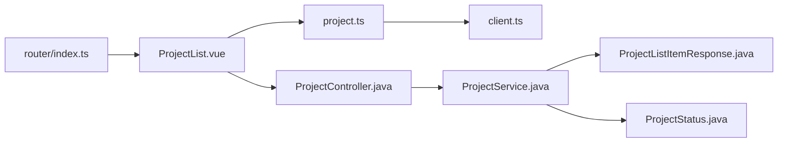

# 项目列表管理组件

<cite>
**本文引用的文件**
- [ProjectList.vue](file://frontend/src/views/ProjectList.vue)
- [project.ts](file://frontend/src/api/project.ts)
- [client.ts](file://frontend/src/api/client.ts)
- [ProjectController.java](file://backend/src/main/java/com/aiscene/controller/ProjectController.java)
- [ProjectService.java](file://backend/src/main/java/com/aiscene/service/ProjectService.java)
- [ProjectListItemResponse.java](file://backend/src/main/java/com/aiscene/dto/ProjectListItemResponse.java)
- [ProjectStatus.java](file://backend/src/main/java/com/aiscene/entity/ProjectStatus.java)
- [.env.example](file://frontend/.env.example)
- [index.ts（路由）](file://frontend/src/router/index.ts)
- [ProjectDetail.vue](file://frontend/src/views/ProjectDetail.vue)
</cite>

## 目录
1. [简介](#简介)
2. [项目结构](#项目结构)
3. [核心组件](#核心组件)
4. [架构总览](#架构总览)
5. [详细组件分析](#详细组件分析)
6. [依赖关系分析](#依赖关系分析)
7. [性能考虑](#性能考虑)
8. [故障排查指南](#故障排查指南)
9. [结论](#结论)
10. [附录](#附录)

## 简介
本文件围绕前端视图组件 ProjectList.vue 的实现机制进行系统化剖析，重点覆盖以下方面：
- 项目数据的异步加载流程与分页渲染策略
- 基于项目状态（如分析中、待确认、已完成等）的过滤能力现状与扩展建议
- 如何调用 project.ts 中的 API 方法获取项目列表，并将后端返回的 ProjectListItemResponse 映射为可视化卡片
- 搜索框与状态筛选器的响应式联动逻辑现状与实现建议
- 下拉刷新与无限滚动的实现方式
- 性能优化建议（虚拟滚动、请求节流、缓存）
- 在用户项目导航中的核心地位与价值

## 项目结构
ProjectList.vue 位于前端 views 层，通过 API 层与后端交互；后端提供 REST 接口，返回分页的项目列表 DTO。整体采用前后端分离架构，前端使用 Vue 3 + Vant UI 组件库完成列表渲染与交互。

图表来源
- [ProjectList.vue](file://frontend/src/views/ProjectList.vue#L1-L143)
- [project.ts](file://frontend/src/api/project.ts#L1-L111)
- [client.ts](file://frontend/src/api/client.ts#L1-L36)
- [index.ts（路由）](file://frontend/src/router/index.ts#L1-L45)
- [ProjectController.java](file://backend/src/main/java/com/aiscene/controller/ProjectController.java#L42-L59)
- [ProjectService.java](file://backend/src/main/java/com/aiscene/service/ProjectService.java#L320-L326)
- [ProjectListItemResponse.java](file://backend/src/main/java/com/aiscene/dto/ProjectListItemResponse.java#L1-L27)
- [ProjectStatus.java](file://backend/src/main/java/com/aiscene/entity/ProjectStatus.java#L1-L16)

章节来源
- [ProjectList.vue](file://frontend/src/views/ProjectList.vue#L1-L143)
- [project.ts](file://frontend/src/api/project.ts#L1-L111)
- [client.ts](file://frontend/src/api/client.ts#L1-L36)
- [index.ts（路由）](file://frontend/src/router/index.ts#L1-L45)
- [ProjectController.java](file://backend/src/main/java/com/aiscene/controller/ProjectController.java#L42-L59)
- [ProjectService.java](file://backend/src/main/java/com/aiscene/service/ProjectService.java#L320-L326)
- [ProjectListItemResponse.java](file://backend/src/main/java/com/aiscene/dto/ProjectListItemResponse.java#L1-L27)
- [ProjectStatus.java](file://backend/src/main/java/com/aiscene/entity/ProjectStatus.java#L1-L16)

## 核心组件
- 视图组件：ProjectList.vue 负责渲染项目卡片、处理下拉刷新与无限滚动、跳转到项目详情。
- API 层：project.ts 提供 list 接口封装，内部通过 client.ts 发起 HTTP 请求。
- 后端控制器：ProjectController.java 提供 GET /v1/projects 分页接口，返回 Page<ProjectListItemResponse>。
- 业务服务：ProjectService.java 实现分页查询并按创建时间倒序排序。
- 数据传输对象：ProjectListItemResponse.java 定义列表项字段，包含状态、创建时间、错误追踪等。
- 状态枚举：ProjectStatus.java 定义项目生命周期状态集合。

章节来源
- [ProjectList.vue](file://frontend/src/views/ProjectList.vue#L40-L121)
- [project.ts](file://frontend/src/api/project.ts#L41-L43)
- [ProjectController.java](file://backend/src/main/java/com/aiscene/controller/ProjectController.java#L42-L59)
- [ProjectService.java](file://backend/src/main/java/com/aiscene/service/ProjectService.java#L320-L326)
- [ProjectListItemResponse.java](file://backend/src/main/java/com/aiscene/dto/ProjectListItemResponse.java#L1-L27)
- [ProjectStatus.java](file://backend/src/main/java/com/aiscene/entity/ProjectStatus.java#L1-L16)

## 架构总览
从前端到后端的数据流如下：
- 前端 ProjectList.vue 调用 projectApi.list(page, size)，通过 client.ts 设置 baseURL 和认证头。
- 后端 ProjectController.java 接收分页参数，调用 ProjectService.java 获取 Page<Project> 并映射为 Page<ProjectListItemResponse>。
- 前端将返回的数组内容渲染为卡片列表，支持下拉刷新与无限滚动。

图表来源
- [ProjectList.vue](file://frontend/src/views/ProjectList.vue#L64-L87)
- [project.ts](file://frontend/src/api/project.ts#L41-L43)
- [client.ts](file://frontend/src/api/client.ts#L1-L36)
- [ProjectController.java](file://backend/src/main/java/com/aiscene/controller/ProjectController.java#L42-L59)
- [ProjectService.java](file://backend/src/main/java/com/aiscene/service/ProjectService.java#L320-L326)

## 详细组件分析

### 异步加载与分页渲染策略
- 加载触发：onLoad 在 van-list 的 load 事件中被调用，负责追加加载下一页数据。
- 刷新重置：onRefresh 将 finished、loading、page 重置为初始状态并触发一次加载。
- 分页参数：默认每页大小为 10，page 从 1 开始递增。
- 结束条件：当后端返回条目数小于 pageSize 时，前端标记 finished 为 true，停止继续加载。
- 错误处理：捕获异常后提示“加载失败”，并将 finished 设为 true，避免重复尝试。

图表来源
- [ProjectList.vue](file://frontend/src/views/ProjectList.vue#L64-L87)

章节来源
- [ProjectList.vue](file://frontend/src/views/ProjectList.vue#L64-L87)

### 数据结构映射与可视化呈现
- 前端类型：ProjectList.vue 定义了本地 ProjectListItem 接口，包含 id、title、status、createdAt、可选错误字段等。
- 后端 DTO：ProjectListItemResponse.java 包含 id、title、status、houseInfo、createdAt、错误追踪字段等。
- 映射策略：onLoad 中对后端返回的 data 进行判断，若为数组则直接使用，否则取 data.content；随后将 items 推入本地 list。
- 可视化卡片：使用 van-cell 组件展示标题、ID、创建时间、错误追踪（当存在）；右侧使用 van-tag 根据状态类型显示不同样式。

图表来源
- [ProjectList.vue](file://frontend/src/views/ProjectList.vue#L46-L54)
- [ProjectListItemResponse.java](file://backend/src/main/java/com/aiscene/dto/ProjectListItemResponse.java#L1-L27)
- [ProjectStatus.java](file://backend/src/main/java/com/aiscene/entity/ProjectStatus.java#L1-L16)

章节来源
- [ProjectList.vue](file://frontend/src/views/ProjectList.vue#L46-L54)
- [ProjectList.vue](file://frontend/src/views/ProjectList.vue#L70-L79)
- [ProjectListItemResponse.java](file://backend/src/main/java/com/aiscene/dto/ProjectListItemResponse.java#L1-L27)
- [ProjectStatus.java](file://backend/src/main/java/com/aiscene/entity/ProjectStatus.java#L1-L16)

### 状态过滤功能现状与扩展建议
- 现状：当前列表未实现按状态过滤。状态在卡片右侧以标签形式展示，但不参与筛选。
- 扩展建议：
  - 在视图层新增状态多选/单选筛选器，维护一个 selectedStatuses 数组。
  - 在 onLoad 前置校验：若 selectedStatuses 非空，则将状态作为查询参数传给后端（需后端支持）。
  - 若后端暂不支持，可在前端本地过滤（仅适用于小规模数据集），或结合虚拟滚动优化。

章节来源
- [ProjectList.vue](file://frontend/src/views/ProjectList.vue#L20-L30)
- [ProjectList.vue](file://frontend/src/views/ProjectList.vue#L104-L115)

### 搜索框与状态筛选器的响应式联动
- 现状：未发现搜索框与状态筛选器的实现代码。
- 建议实现：
  - 新增搜索输入框与状态筛选器，双向绑定到本地响应式状态。
  - 在 onRefresh/onLoad 前合并查询参数：page=1、size 固定、searchTerm、selectedStatuses。
  - 重置分页：每次搜索或筛选变更时将 page 归 1 并清空列表，再触发加载。
  - 与后端协作：后端需提供模糊搜索与状态过滤的查询参数。

章节来源
- [ProjectList.vue](file://frontend/src/views/ProjectList.vue#L64-L94)

### 下拉刷新与无限滚动实现
- 下拉刷新：van-pull-refresh 绑定 refreshing，onRefresh 将 page 置 1、finished 置 false、loading 置 true，然后调用 onLoad。
- 无限滚动：van-list 绑定 loading 与 finished，onLoad 中根据返回条目数决定是否继续加载；当条目不足 pageSize 时标记 finished=true。
- 导航跳转：点击卡片项跳转至项目详情页，路由由 router/index.ts 配置。

图表来源
- [ProjectList.vue](file://frontend/src/views/ProjectList.vue#L5-L31)
- [ProjectList.vue](file://frontend/src/views/ProjectList.vue#L64-L94)
- [index.ts（路由）](file://frontend/src/router/index.ts#L16-L25)

章节来源
- [ProjectList.vue](file://frontend/src/views/ProjectList.vue#L5-L31)
- [ProjectList.vue](file://frontend/src/views/ProjectList.vue#L64-L94)
- [index.ts（路由）](file://frontend/src/router/index.ts#L16-L25)

### 项目详情导航与核心地位
- 导航入口：列表卡片点击后跳转至 /projects/:id 对应的 ProjectDetail.vue。
- 详情页职责：展示项目状态横幅、基本信息、脚本内容、错误信息、操作按钮（编辑脚本、重试渲染、查看结果）。
- 核心地位：ProjectList.vue 是用户项目入口与中枢，承载项目浏览、筛选、跳转与状态概览，是后续工作流（脚本生成、音频生成、渲染）的起点。

章节来源
- [ProjectList.vue](file://frontend/src/views/ProjectList.vue#L96-L102)
- [index.ts（路由）](file://frontend/src/router/index.ts#L21-L25)
- [ProjectDetail.vue](file://frontend/src/views/ProjectDetail.vue#L1-L100)

## 依赖关系分析
- 前端依赖链：
  - ProjectList.vue 依赖 project.ts 的 list 方法。
  - project.ts 依赖 client.ts 的 Axios 实例与拦截器。
  - 路由 index.ts 将 /projects 与 ProjectList.vue 关联。
- 后端依赖链：
  - ProjectController.java 依赖 ProjectService.java。
  - ProjectService.java 依赖 ProjectRepository 与 PageRequest/Sort。
  - 返回类型 ProjectListItemResponse.java 依赖 ProjectStatus.java。

图表来源
- [ProjectList.vue](file://frontend/src/views/ProjectList.vue#L40-L50)
- [project.ts](file://frontend/src/api/project.ts#L41-L43)
- [client.ts](file://frontend/src/api/client.ts#L1-L36)
- [index.ts（路由）](file://frontend/src/router/index.ts#L16-L25)
- [ProjectController.java](file://backend/src/main/java/com/aiscene/controller/ProjectController.java#L42-L59)
- [ProjectService.java](file://backend/src/main/java/com/aiscene/service/ProjectService.java#L320-L326)
- [ProjectListItemResponse.java](file://backend/src/main/java/com/aiscene/dto/ProjectListItemResponse.java#L1-L27)
- [ProjectStatus.java](file://backend/src/main/java/com/aiscene/entity/ProjectStatus.java#L1-L16)

章节来源
- [ProjectList.vue](file://frontend/src/views/ProjectList.vue#L40-L50)
- [project.ts](file://frontend/src/api/project.ts#L41-L43)
- [client.ts](file://frontend/src/api/client.ts#L1-L36)
- [index.ts（路由）](file://frontend/src/router/index.ts#L16-L25)
- [ProjectController.java](file://backend/src/main/java/com/aiscene/controller/ProjectController.java#L42-L59)
- [ProjectService.java](file://backend/src/main/java/com/aiscene/service/ProjectService.java#L320-L326)
- [ProjectListItemResponse.java](file://backend/src/main/java/com/aiscene/dto/ProjectListItemResponse.java#L1-L27)
- [ProjectStatus.java](file://backend/src/main/java/com/aiscene/entity/ProjectStatus.java#L1-L16)

## 性能考虑
- 虚拟滚动（推荐）：当项目数量增长时，优先采用虚拟滚动组件（如 vant 的虚拟列表）减少 DOM 节点数量，提升滚动性能。
- 请求节流/防抖：在搜索与筛选频繁变更场景，对 onLoad 增加防抖，避免短时间内多次请求。
- 缓存策略：对最近一次分页结果进行轻量缓存，刷新时命中缓存可减少网络往返。
- 图片与资源优化：卡片中如涉及缩略图，建议懒加载与尺寸裁剪，降低带宽占用。
- 本地过滤降级：若后端暂不支持状态/搜索过滤，可在前端本地过滤，但需限制数据规模并提供加载提示。
- 分页参数校验：确保 page 与 size 的边界值与默认值一致，避免无效请求。

## 故障排查指南
- 网络错误：client.ts 已在响应拦截器中输出错误日志，可在浏览器控制台查看具体错误信息。
- 认证失败：检查 .env.example 中的 VITE_API_KEY 是否正确配置，确保请求头 Authorization 正常注入。
- 分页异常：确认后端分页参数 page 从 1 开始，且排序规则与前端期望一致。
- 状态显示异常：确认后端返回的状态枚举与前端映射一致，必要时在前端统一转换为标准字符串。

章节来源
- [client.ts](file://frontend/src/api/client.ts#L12-L33)
- [.env.example](file://frontend/.env.example#L1-L3)
- [ProjectController.java](file://backend/src/main/java/com/aiscene/controller/ProjectController.java#L42-L59)
- [ProjectService.java](file://backend/src/main/java/com/aiscene/service/ProjectService.java#L320-L326)

## 结论
ProjectList.vue 以简洁的下拉刷新与无限滚动实现了项目列表的高效浏览，配合后端分页接口与 DTO 映射，满足了基本的项目导航需求。当前尚未实现搜索与状态筛选，建议在保持现有分页与刷新机制的基础上，逐步引入搜索框与状态筛选器，并与后端协作完善过滤参数。同时，随着数据规模增长，应优先引入虚拟滚动与请求节流等性能优化手段，确保用户体验与系统稳定性。

## 附录
- 环境变量参考：VITE_API_BASE_URL、VITE_API_KEY
- 路由入口：/projects（列表）、/projects/:id（详情）

章节来源
- [.env.example](file://frontend/.env.example#L1-L3)
- [index.ts（路由）](file://frontend/src/router/index.ts#L16-L25)