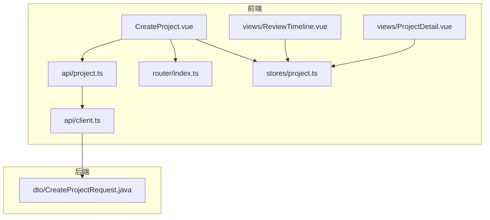
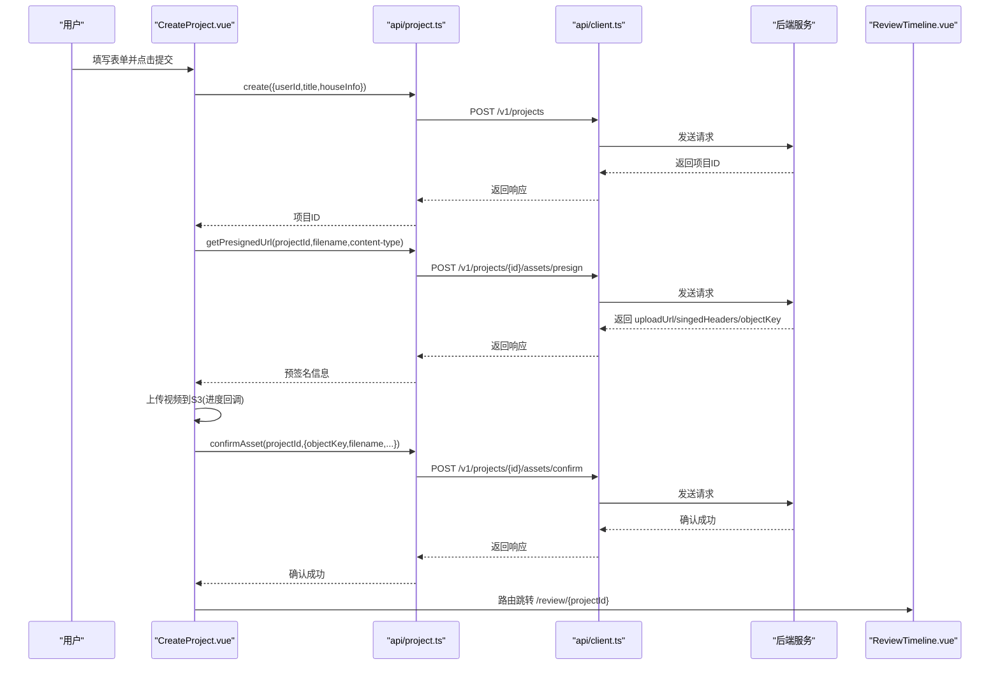
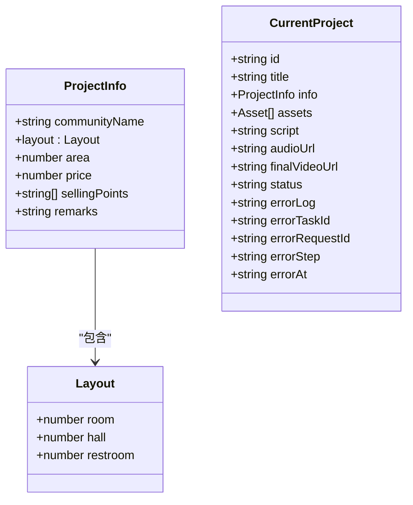
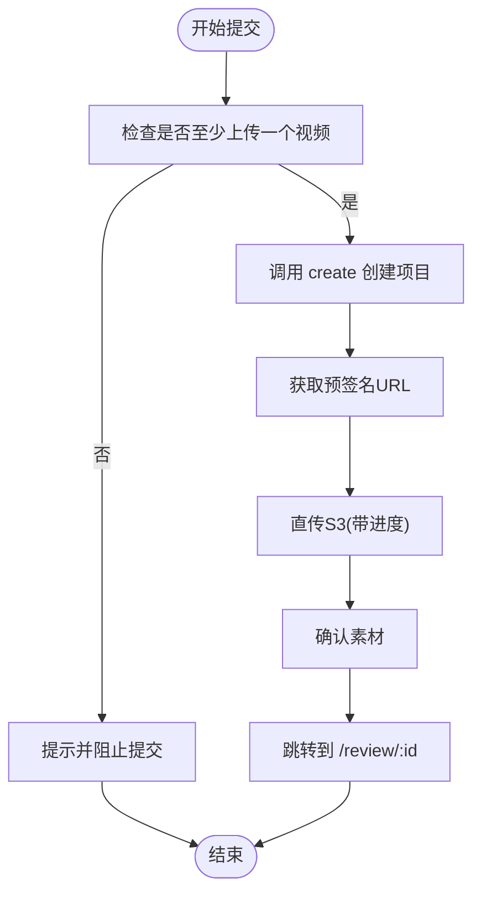
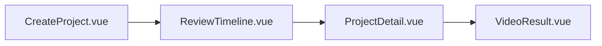
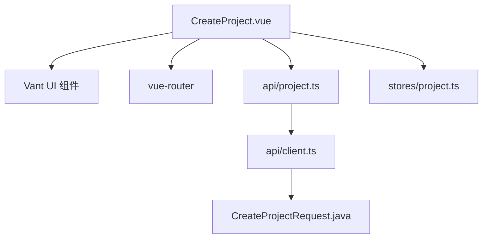

# 项目创建组件

<cite>
**本文引用的文件列表**
- [CreateProject.vue](file://frontend/src/views/CreateProject.vue)
- [project.ts（前端状态）](file://frontend/src/stores/project.ts)
- [project.ts（API 定义）](file://frontend/src/api/project.ts)
- [client.ts（HTTP 客户端）](file://frontend/src/api/client.ts)
- [router/index.ts（路由配置）](file://frontend/src/router/index.ts)
- [ReviewTimeline.vue](file://frontend/src/views/ReviewTimeline.vue)
- [ProjectDetail.vue](file://frontend/src/views/ProjectDetail.vue)
- [CreateProjectRequest.java（后端 DTO）](file://backend/src/main/java/com/aiscene/dto/CreateProjectRequest.java)
</cite>

## 目录
1. [简介](#简介)
2. [项目结构](#项目结构)
3. [核心组件](#核心组件)
4. [架构总览](#架构总览)
5. [详细组件分析](#详细组件分析)
6. [依赖关系分析](#依赖关系分析)
7. [性能考量](#性能考量)
8. [故障排查指南](#故障排查指南)
9. [结论](#结论)
10. [附录](#附录)

## 简介
本文件深入解析 CreateProject.vue 组件的实现细节，覆盖表单结构设计、输入验证逻辑、与 Pinia 状态管理模块的绑定机制、提交流程中的路由跳转处理，以及与后端 CreateProjectRequest DTO 的字段映射关系。同时，结合实际代码展示如何通过 Pinia 与 project.ts 实现房源信息的本地暂存与跨页面共享，并给出用户体验优化建议（加载状态反馈、错误提示样式统一、移动端适配方案）。最后分析该组件作为用户工作流起点的关键作用及与其他视图的导航衔接。

## 项目结构
前端采用 Vue 3 + Vite + Vant 移动端组件库，使用 Pinia 进行状态管理，Axios 封装为 API 客户端，配合路由进行页面导航。CreateProject.vue 位于 views 层，负责收集用户输入并发起项目创建与素材上传；随后通过路由跳转至 ReviewTimeline.vue 进入智能分段与脚本编辑阶段。

图表来源
- [CreateProject.vue](file://frontend/src/views/CreateProject.vue#L1-L160)
- [project.ts（前端状态）](file://frontend/src/stores/project.ts#L1-L64)
- [project.ts（API 定义）](file://frontend/src/api/project.ts#L1-L63)
- [client.ts（HTTP 客户端）](file://frontend/src/api/client.ts#L1-L36)
- [router/index.ts（路由配置）](file://frontend/src/router/index.ts#L1-L45)
- [ReviewTimeline.vue](file://frontend/src/views/ReviewTimeline.vue#L1-L120)
- [ProjectDetail.vue](file://frontend/src/views/ProjectDetail.vue#L1-L120)
- [CreateProjectRequest.java（后端 DTO）](file://backend/src/main/java/com/aiscene/dto/CreateProjectRequest.java#L1-L13)

章节来源
- [CreateProject.vue](file://frontend/src/views/CreateProject.vue#L1-L160)
- [router/index.ts（路由配置）](file://frontend/src/router/index.ts#L1-L45)

## 核心组件
- 表单结构与字段
  - 基础信息：小区名称、户型结构（室/厅/卫）、建筑面积、挂牌价格
  - 核心卖点：多选标签集合
  - 补充说明：文本域
  - 素材上传：视频文件列表，支持预览、进度条、失败标记与删除
- 输入验证
  - 使用 Vant Form 的规则校验基础必填项
  - 提交前校验至少上传一个视频片段
- 状态绑定
  - 使用 reactive 构建表单数据对象，与 Vant Field 双向绑定
  - 通过 Pinia store 的 ProjectInfo 类型定义，确保字段一致性
- 提交流程
  - 创建项目 -> 获取预签名 URL -> 直传 S3 -> 确认素材 -> 跳转 Review 页面
- 路由跳转
  - 成功后跳转至 ReviewTimeline.vue，路径包含项目 ID

章节来源
- [CreateProject.vue](file://frontend/src/views/CreateProject.vue#L1-L160)
- [project.ts（前端状态）](file://frontend/src/stores/project.ts#L1-L64)
- [project.ts（API 定义）](file://frontend/src/api/project.ts#L1-L63)
- [router/index.ts（路由配置）](file://frontend/src/router/index.ts#L1-L45)

## 架构总览
CreateProject.vue 作为用户工作流的入口，承担以下职责：
- 收集房源与素材信息
- 与后端交互创建项目并上传素材
- 通过路由将用户引导至智能分段与脚本编辑阶段
- 与 Pinia store 共享项目信息，便于后续页面复用

图表来源
- [CreateProject.vue](file://frontend/src/views/CreateProject.vue#L257-L333)
- [project.ts（API 定义）](file://frontend/src/api/project.ts#L36-L53)
- [client.ts（HTTP 客户端）](file://frontend/src/api/client.ts#L1-L36)
- [ReviewTimeline.vue](file://frontend/src/views/ReviewTimeline.vue#L1-L120)

## 详细组件分析

### 表单结构与字段设计
- 基础信息区域
  - 小区名称：必填
  - 户型结构：三列数字输入框，分别对应室/厅/卫
  - 建筑面积：数值类型，必填
  - 挂牌价格：数值类型，必填
- 核心卖点区域
  - 多个标签按钮，点击切换选中状态
  - 选中值以数组形式存储在表单数据中
- 补充说明
  - 文本域，支持换行与自适应高度
- 素材上传区域
  - 视频预览网格，支持多文件上传
  - 上传进度与失败状态可视化
  - 删除单个文件

章节来源
- [CreateProject.vue](file://frontend/src/views/CreateProject.vue#L7-L160)

### 输入验证逻辑
- Vant Form 的 rules 用于基础字段必填校验
- 提交事件中额外校验：至少上传一个视频片段
- 文件大小限制：通过 uploader 的 max-size 与 oversize 回调提示

章节来源
- [CreateProject.vue](file://frontend/src/views/CreateProject.vue#L9-L160)

### 与 Pinia 的状态绑定机制
- 表单数据使用 reactive 构建，直接与 Vant Field 绑定
- 项目信息类型定义来自 store 的 ProjectInfo 接口，确保字段一致
- 当前项目状态（currentProject）在 ReviewTimeline.vue 中被读取与更新，形成跨页面共享

图表来源
- [project.ts（前端状态）](file://frontend/src/stores/project.ts#L1-L64)

章节来源
- [project.ts（前端状态）](file://frontend/src/stores/project.ts#L1-L64)
- [CreateProject.vue](file://frontend/src/views/CreateProject.vue#L164-L200)

### 提交流程与路由跳转
- 创建项目：调用 projectApi.create，传入 userId、title、houseInfo
- 素材直传：获取预签名 URL 后，使用 XMLHttpRequest 上传到 S3，并实时更新进度
- 确认素材：上传完成后调用 projectApi.confirmAsset
- 路由跳转：成功后跳转至 ReviewTimeline.vue 的 /review/:id 路径

图表来源
- [CreateProject.vue](file://frontend/src/views/CreateProject.vue#L257-L333)
- [project.ts（API 定义）](file://frontend/src/api/project.ts#L36-L53)
- [router/index.ts（路由配置）](file://frontend/src/router/index.ts#L1-L45)

章节来源
- [CreateProject.vue](file://frontend/src/views/CreateProject.vue#L257-L333)
- [project.ts（API 定义）](file://frontend/src/api/project.ts#L36-L53)
- [router/index.ts（路由配置）](file://frontend/src/router/index.ts#L1-L45)

### 与后端 CreateProjectRequest DTO 的字段映射
- 前端 CreateProjectParams 映射到后端 CreateProjectRequest 的字段关系如下：
  - userId -> userId
  - title -> title
  - houseInfo -> houseInfo（Map<String,Object>）
    - community -> community
    - room -> room
    - hall -> hall
    - price -> price
    - area -> area
    - sellingPoints -> sellingPoints
    - remarks -> remarks

章节来源
- [project.ts（API 定义）](file://frontend/src/api/project.ts#L3-L15)
- [CreateProjectRequest.java（后端 DTO）](file://backend/src/main/java/com/aiscene/dto/CreateProjectRequest.java#L1-L13)

### 用户工作流与导航衔接
- CreateProject.vue 是工作流起点，成功提交后进入 ReviewTimeline.vue
- ReviewTimeline.vue 负责智能分段、脚本生成与视频渲染
- ProjectDetail.vue 提供项目状态查看与重试渲染等操作
- 路由配置明确了各页面的路径与组件映射

图表来源
- [router/index.ts（路由配置）](file://frontend/src/router/index.ts#L1-L45)
- [ReviewTimeline.vue](file://frontend/src/views/ReviewTimeline.vue#L1-L120)
- [ProjectDetail.vue](file://frontend/src/views/ProjectDetail.vue#L1-L120)

章节来源
- [router/index.ts（路由配置）](file://frontend/src/router/index.ts#L1-L45)
- [ReviewTimeline.vue](file://frontend/src/views/ReviewTimeline.vue#L1-L120)
- [ProjectDetail.vue](file://frontend/src/views/ProjectDetail.vue#L1-L120)

## 依赖关系分析
- 组件依赖
  - CreateProject.vue 依赖 Vant 表单/上传/按钮组件与路由
  - 依赖 project.ts（API 定义）与 client.ts（HTTP 客户端）
  - 依赖 Pinia store 的 ProjectInfo 类型
- 路由依赖
  - 路由配置将 /create 映射到 CreateProject.vue，/review/:id 映射到 ReviewTimeline.vue
- 后端依赖
  - CreateProjectRequest.java 定义了后端期望的数据结构

图表来源
- [CreateProject.vue](file://frontend/src/views/CreateProject.vue#L1-L160)
- [project.ts（API 定义）](file://frontend/src/api/project.ts#L1-L63)
- [client.ts（HTTP 客户端）](file://frontend/src/api/client.ts#L1-L36)
- [CreateProjectRequest.java（后端 DTO）](file://backend/src/main/java/com/aiscene/dto/CreateProjectRequest.java#L1-L13)
- [project.ts（前端状态）](file://frontend/src/stores/project.ts#L1-L64)

章节来源
- [CreateProject.vue](file://frontend/src/views/CreateProject.vue#L1-L160)
- [project.ts（API 定义）](file://frontend/src/api/project.ts#L1-L63)
- [client.ts（HTTP 客户端）](file://frontend/src/api/client.ts#L1-L36)
- [CreateProjectRequest.java（后端 DTO）](file://backend/src/main/java/com/aiscene/dto/CreateProjectRequest.java#L1-L13)
- [project.ts（前端状态）](file://frontend/src/stores/project.ts#L1-L64)

## 性能考量
- 上传性能
  - 使用预签名直传 S3，避免前端代理大文件，降低服务器压力
  - 上传进度基于 XMLHttpRequest 的 onprogress，实时更新 UI
- 并发上传
  - 对每个文件独立发起上传，Promise.all 并发等待全部完成
- 错误处理
  - 上传失败时设置状态为 failed，并保留 message 以便 UI 展示
- 渲染与交互
  - 提交按钮 loading 状态与 loading-text 提升用户感知
  - 上传 overlay 层叠加进度与百分比，提升反馈清晰度

章节来源
- [CreateProject.vue](file://frontend/src/views/CreateProject.vue#L221-L333)

## 故障排查指南
- 提交失败
  - 检查是否至少上传一个视频片段
  - 查看控制台错误日志与 toast 提示
- 上传失败
  - 确认文件大小未超过限制
  - 检查网络连接与 S3 预签名 URL 是否有效
  - 查看文件状态是否标记为 failed
- 路由跳转问题
  - 确认项目创建成功并获得项目 ID
  - 检查路由配置与路径参数是否正确

章节来源
- [CreateProject.vue](file://frontend/src/views/CreateProject.vue#L196-L200)
- [CreateProject.vue](file://frontend/src/views/CreateProject.vue#L257-L333)
- [router/index.ts（路由配置）](file://frontend/src/router/index.ts#L1-L45)

## 结论
CreateProject.vue 通过简洁直观的表单与完善的上传流程，为用户提供了从房源信息录入到素材上传的一站式体验。借助 Pinia 的状态模型，项目信息得以在多个视图间共享，配合路由实现顺畅的工作流衔接。后端 DTO 的字段映射清晰明确，前后端协作高效稳定。建议在后续迭代中进一步统一错误提示样式、增强移动端交互细节与可访问性，以提升整体用户体验。

## 附录
- 术语说明
  - 预签名直传：后端签发临时上传凭证，前端直接上传至对象存储，提高吞吐能力
  - 脚本分段：将全局脚本按片段长度拆分，分配给各视频片段
- 最佳实践
  - 在上传前对文件类型与尺寸进行严格校验
  - 对上传失败的文件提供重试与删除选项
  - 在路由跳转前确保项目 ID 有效且状态正常