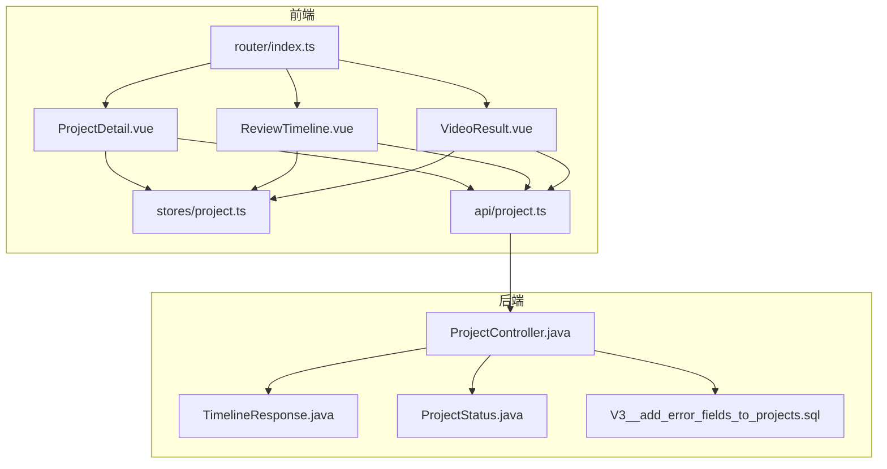
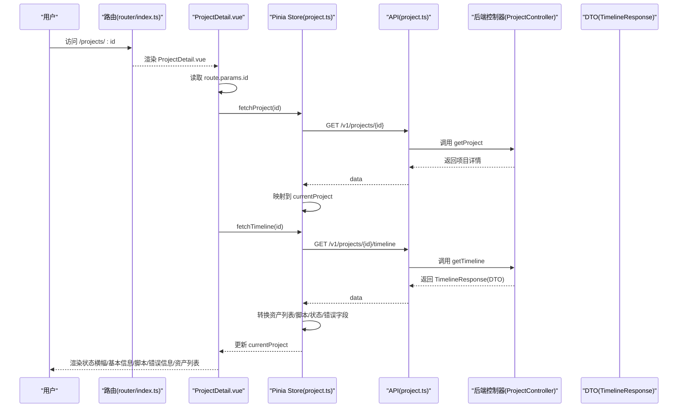
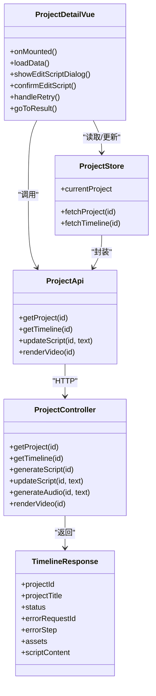

# 项目详情展示组件

<cite>
**本文引用的文件**
- [ProjectDetail.vue](file://frontend/src/views/ProjectDetail.vue)
- [project.ts（Pinia Store）](file://frontend/src/stores/project.ts)
- [project.ts（API 客户端封装）](file://frontend/src/api/project.ts)
- [ProjectStatus 枚举（后端）](file://backend/src/main/java/com/aiscene/entity/ProjectStatus.java)
- [V3__add_error_fields_to_projects.sql（数据库迁移）](file://backend/src/main/resources/db/migration/V3__add_error_fields_to_projects.sql)
- [ProjectController（后端）](file://backend/src/main/java/com/aiscene/controller/ProjectController.java)
- [TimelineResponse（后端 DTO）](file://backend/src/main/java/com/aiscene/dto/TimelineResponse.java)
- [ReviewTimeline.vue（资产列表渲染）](file://frontend/src/views/ReviewTimeline.vue)
- [VideoResult.vue（结果页）](file://frontend/src/views/VideoResult.vue)
- [router/index.ts（路由）](file://frontend/src/router/index.ts)
</cite>

## 目录
1. [简介](#简介)
2. [项目结构](#项目结构)
3. [核心组件](#核心组件)
4. [架构总览](#架构总览)
5. [详细组件分析](#详细组件分析)
6. [依赖关系分析](#依赖关系分析)
7. [性能考量](#性能考量)
8. [故障排查指南](#故障排查指南)
9. [结论](#结论)

## 简介
本文件围绕前端“项目详情”视图组件 ProjectDetail.vue 的结构与行为进行系统化解析，重点说明：
- 如何基于 URL 参数动态加载特定项目详情；
- 房源基本信息、素材上传进度与 AI 分析状态的展示；
- 与后端 TimelineResponse 数据模型的绑定方式；
- 资产列表在 ReviewTimeline 中的渲染逻辑；
- 状态指示器设计（ProjectStatus 枚举）与错误信息呈现机制（参考数据库迁移字段）；
- 作为用户监控任务进展的核心界面所承担的信息聚合职责。

## 项目结构
ProjectDetail.vue 所属的前端目录采用按功能模块划分的方式组织，其中 views 下包含各页面视图，stores 提供全局状态管理，api 封装后端接口调用。路由通过 vue-router 在前端定义了从项目列表到详情、到智能分段、再到结果页的完整路径。

图表来源
- [ProjectDetail.vue](file://frontend/src/views/ProjectDetail.vue#L1-L206)
- [ReviewTimeline.vue](file://frontend/src/views/ReviewTimeline.vue#L1-L195)
- [VideoResult.vue](file://frontend/src/views/VideoResult.vue#L1-L105)
- [project.ts（Pinia Store）](file://frontend/src/stores/project.ts#L1-L219)
- [project.ts（API 客户端封装）](file://frontend/src/api/project.ts#L1-L111)
- [router/index.ts（路由）](file://frontend/src/router/index.ts#L1-L45)
- [ProjectController（后端）](file://backend/src/main/java/com/aiscene/controller/ProjectController.java#L1-L206)
- [TimelineResponse（后端 DTO）](file://backend/src/main/java/com/aiscene/dto/TimelineResponse.java#L1-L21)
- [ProjectStatus 枚举（后端）](file://backend/src/main/java/com/aiscene/entity/ProjectStatus.java#L1-L16)
- [V3__add_error_fields_to_projects.sql（数据库迁移）](file://backend/src/main/resources/db/migration/V3__add_error_fields_to_projects.sql#L1-L6)

章节来源
- [ProjectDetail.vue](file://frontend/src/views/ProjectDetail.vue#L1-L206)
- [router/index.ts（路由）](file://frontend/src/router/index.ts#L1-L45)

## 核心组件
- ProjectDetail.vue：负责根据 URL 参数加载项目详情，展示状态横幅、基本信息、脚本内容、错误信息，并提供编辑脚本、重试渲染、查看视频等操作入口。
- Pinia Store（project.ts）：集中管理当前项目对象 currentProject，包括基础信息、脚本、音频、最终视频地址、状态、错误字段，以及从后端拉取项目与时间线数据的方法。
- API 封装（project.ts）：对后端 /v1/projects/{id}、/v1/projects/{id}/timeline、/v1/projects/{id}/script、/v1/projects/{id}/render 等接口进行统一封装。
- 后端控制器（ProjectController）：提供项目详情、时间线、脚本生成/更新、音频生成、渲染重试等接口；返回 TimelineResponse DTO，包含项目状态、错误字段、资产列表与脚本内容。
- 错误字段（数据库迁移）：为项目表新增 error_log、error_task_id、error_request_id、error_step、error_at 字段，支撑前端错误信息展示。
- 状态枚举（ProjectStatus）：统一后端项目状态值，前端据此进行状态判断与 UI 呈现。

章节来源
- [ProjectDetail.vue](file://frontend/src/views/ProjectDetail.vue#L1-L206)
- [project.ts（Pinia Store）](file://frontend/src/stores/project.ts#L1-L219)
- [project.ts（API 客户端封装）](file://frontend/src/api/project.ts#L1-L111)
- [ProjectController（后端）](file://backend/src/main/java/com/aiscene/controller/ProjectController.java#L61-L143)
- [V3__add_error_fields_to_projects.sql（数据库迁移）](file://backend/src/main/resources/db/migration/V3__add_error_fields_to_projects.sql#L1-L6)
- [ProjectStatus 枚举（后端）](file://backend/src/main/java/com/aiscene/entity/ProjectStatus.java#L1-L16)

## 架构总览
ProjectDetail.vue 通过路由参数获取项目 ID，随后调用 Pinia Store 的 fetchProject 方法，后者通过 API 封装访问后端 /v1/projects/{id} 接口，将响应映射到 currentProject。同时，ProjectDetail.vue 也通过 store.fetchTimeline 获取 TimelineResponse，从而获得资产列表与脚本内容，实现“AI 分析状态 + 资产列表”的信息聚合。

图表来源
- [router/index.ts（路由）](file://frontend/src/router/index.ts#L16-L25)
- [ProjectDetail.vue](file://frontend/src/views/ProjectDetail.vue#L145-L162)
- [project.ts（Pinia Store）](file://frontend/src/stores/project.ts#L66-L102)
- [project.ts（API 客户端封装）](file://frontend/src/api/project.ts#L79-L81)
- [ProjectController（后端）](file://backend/src/main/java/com/aiscene/controller/ProjectController.java#L67-L71)
- [TimelineResponse（后端 DTO）](file://backend/src/main/java/com/aiscene/dto/TimelineResponse.java#L1-L21)

## 详细组件分析

### ProjectDetail.vue 结构与行为
- URL 参数与生命周期
  - 使用 useRoute 读取 params.id 作为项目标识；onMounted 中校验参数有效性并触发 loadData。
  - loadData 内部调用 store.fetchProject，捕获异常并提示“加载项目详情失败”。

- 状态横幅与样式
  - 基于 computed 计算 statusClass，依据状态值选择背景色类名，实现“已完成/失败/其他”的视觉区分。

- 基本信息展示
  - 展示标题、小区名称、户型（室/厅）、面积、价格等字段，来源于 currentProject.info 的 houseInfo 字段映射。

- 脚本内容展示
  - 当存在 script 时显示“脚本内容”分组，用于展示生成的文案。

- 错误信息展示
  - 条件渲染“错误信息”分组，展示 errorStep、errorRequestId、errorAt（格式化为本地时间）与 errorLog，体现数据库迁移新增的错误字段。

- 操作按钮
  - 编辑脚本：当状态为 SCRIPT_GENERATED 或 FAILED 时可用；
  - 重试渲染：当状态为 FAILED 时可用；
  - 查看视频：当状态为 COMPLETED 时可用，跳转至 VideoResult.vue。

- 编辑脚本对话框
  - 打开时将当前脚本赋给 editingScript，确认后调用 projectApi.updateScript 并刷新数据。

- 重试渲染
  - 通过对话框确认后，调用 projectApi.renderVideo 提交渲染任务，并刷新数据。

- 查看视频
  - 路由跳转至 result 页面，携带项目 ID。

章节来源
- [ProjectDetail.vue](file://frontend/src/views/ProjectDetail.vue#L1-L206)
- [V3__add_error_fields_to_projects.sql（数据库迁移）](file://backend/src/main/resources/db/migration/V3__add_error_fields_to_projects.sql#L1-L6)

### 与后端 TimelineResponse 的绑定
- 数据来源
  - ProjectDetail.vue 通过 store.fetchTimeline 获取 TimelineResponse，其中包含：
    - status：项目整体状态；
    - errorRequestId、errorStep：错误追踪字段；
    - assets：资产列表；
    - scriptContent：脚本内容。

- 绑定与转换
  - store.fetchTimeline 将 assets 映射为 UI 友好的资产对象（含 url、sceneLabel、userLabel、duration、sortOrder、sceneScore 等），并对 ossUrl 进行跨域/代理路径适配，确保前端可直接播放。
  - 若后端返回 scriptContent，则覆盖 currentProject.script；若返回 status，则覆盖 currentProject.status；若返回 errorRequestId/errorStep，则写入对应字段。

- 与资产列表渲染的关系
  - ReviewTimeline.vue 会复用 store.currentProject.assets 进行拖拽排序、场景标签修正、脚本分发等交互；ProjectDetail.vue 侧重展示与操作，二者共享同一 store 数据源。

章节来源
- [project.ts（Pinia Store）](file://frontend/src/stores/project.ts#L104-L153)
- [TimelineResponse（后端 DTO）](file://backend/src/main/java/com/aiscene/dto/TimelineResponse.java#L1-L21)
- [ProjectController（后端）](file://backend/src/main/java/com/aiscene/controller/ProjectController.java#L139-L143)
- [ReviewTimeline.vue（资产列表渲染）](file://frontend/src/views/ReviewTimeline.vue#L296-L316)

### 状态指示器设计（ProjectStatus）
- 后端状态枚举
  - ProjectStatus 包含 DRAFT、UPLOADING、ANALYZING、REVIEW、SCRIPT_GENERATING、SCRIPT_GENERATED、AUDIO_GENERATING、AUDIO_GENERATED、RENDERING、COMPLETED、FAILED 等值，覆盖从上传、AI 分析、脚本生成、音频生成、渲染到完成/失败的全链路。

- 前端状态使用
  - ProjectDetail.vue 的 statusClass 与按钮可用性均基于状态值进行分支判断；
  - ReviewTimeline.vue 与 VideoResult.vue 亦依据相同状态值进行流程推进与 UI 呈现。

章节来源
- [ProjectStatus 枚举（后端）](file://backend/src/main/java/com/aiscene/entity/ProjectStatus.java#L1-L16)
- [ProjectDetail.vue](file://frontend/src/views/ProjectDetail.vue#L121-L139)
- [ReviewTimeline.vue](file://frontend/src/views/ReviewTimeline.vue#L329-L340)
- [VideoResult.vue](file://frontend/src/views/VideoResult.vue#L134-L150)

### 错误信息呈现机制
- 数据库层
  - V3__add_error_fields_to_projects.sql 为 projects 表新增 error_log、error_task_id、error_request_id、error_step、error_at 字段，用于记录错误日志、任务 ID、请求追踪 ID、错误阶段与发生时间。

- 后端层
  - ProjectController 在查询项目详情时返回这些字段；TimelineResponse 同样包含 errorRequestId、errorStep 等字段，便于前端统一展示。

- 前端层
  - ProjectDetail.vue 条件渲染“错误信息”分组，展示上述字段，帮助用户定位问题来源与时间点。

章节来源
- [V3__add_error_fields_to_projects.sql（数据库迁移）](file://backend/src/main/resources/db/migration/V3__add_error_fields_to_projects.sql#L1-L6)
- [ProjectController（后端）](file://backend/src/main/java/com/aiscene/controller/ProjectController.java#L67-L71)
- [TimelineResponse（后端 DTO）](file://backend/src/main/java/com/aiscene/dto/TimelineResponse.java#L1-L21)
- [ProjectDetail.vue](file://frontend/src/views/ProjectDetail.vue#L39-L50)

### 作为用户监控任务进展的核心界面
- 信息聚合职责
  - ProjectDetail.vue 聚合项目状态、房源信息、脚本内容、错误信息与资产列表（通过 TimelineResponse），并提供关键操作入口（编辑脚本、重试渲染、查看视频），是用户监控与干预任务进展的中枢界面。

- 与资产列表渲染的衔接
  - ReviewTimeline.vue 基于 store.currentProject.assets 进行拖拽排序、场景标签修正、脚本分发与生成视频；ProjectDetail.vue 则负责展示与引导用户进入该流程。

章节来源
- [ProjectDetail.vue](file://frontend/src/views/ProjectDetail.vue#L1-L206)
- [ReviewTimeline.vue（资产列表渲染）](file://frontend/src/views/ReviewTimeline.vue#L296-L316)

## 依赖关系分析
- 组件耦合
  - ProjectDetail.vue 与 Pinia Store 强耦合，通过 store.currentProject 与 fetchProject/fetchTimeline 获取/更新数据；
  - 与 API 封装弱耦合，仅通过 projectApi 调用后端接口；
  - 与路由强耦合，依赖 route.params.id 作为数据入口。

- 外部依赖
  - 后端 ProjectController 提供统一接口；
  - TimelineResponse DTO 定义了资产列表、脚本与状态的结构；
  - ProjectStatus 枚举统一前后端状态语义；
  - 数据库迁移字段支撑错误信息展示。

图表来源
- [ProjectDetail.vue](file://frontend/src/views/ProjectDetail.vue#L145-L206)
- [project.ts（Pinia Store）](file://frontend/src/stores/project.ts#L66-L153)
- [project.ts（API 客户端封装）](file://frontend/src/api/project.ts#L79-L110)
- [ProjectController（后端）](file://backend/src/main/java/com/aiscene/controller/ProjectController.java#L67-L143)
- [TimelineResponse（后端 DTO）](file://backend/src/main/java/com/aiscene/dto/TimelineResponse.java#L1-L21)

## 性能考量
- 请求合并与去抖
  - 在 ReviewTimeline.vue 中对时间线轮询采用固定间隔（约 3 秒），避免频繁请求；ProjectDetail.vue 未内置轮询，适合按需加载与手动刷新。
- 资产 URL 适配
  - store.fetchTimeline 对 ossUrl 进行跨域/代理路径适配，减少前端播放失败与二次请求成本。
- UI 渲染优化
  - ProjectDetail.vue 仅在存在脚本时渲染“脚本内容”分组，减少不必要的 DOM 渲染。
- 错误处理
  - ProjectDetail.vue 在加载失败时给出 Toast 提示，避免页面空白影响体验。

[本节为通用指导，无需列出具体文件来源]

## 故障排查指南
- 无法加载项目详情
  - 检查 route.params.id 是否有效；确认后端 /v1/projects/{id} 是否可达；查看 store.fetchProject 的异常抛出与前端 Toast 提示。
- 无资产列表或状态异常
  - 确认 /v1/projects/{id}/timeline 是否返回 assets；检查 store.fetchTimeline 的映射逻辑与 URL 适配是否生效。
- 错误信息未显示
  - 确认数据库迁移字段是否已执行；检查后端 ProjectController 是否返回 errorRequestId、errorStep 等字段；确认前端条件渲染逻辑。
- 重试渲染无效
  - 确认按钮可用性（FAILED 状态）；检查 projectApi.renderVideo 的调用与后端 /v1/projects/{id}/render 是否返回 accepted；刷新后观察状态变化。

章节来源
- [ProjectDetail.vue](file://frontend/src/views/ProjectDetail.vue#L145-L206)
- [project.ts（Pinia Store）](file://frontend/src/stores/project.ts#L104-L153)
- [project.ts（API 客户端封装）](file://frontend/src/api/project.ts#L102-L110)
- [V3__add_error_fields_to_projects.sql（数据库迁移）](file://backend/src/main/resources/db/migration/V3__add_error_fields_to_projects.sql#L1-L6)
- [ProjectController（后端）](file://backend/src/main/java/com/aiscene/controller/ProjectController.java#L189-L195)

## 结论
ProjectDetail.vue 作为用户监控与干预项目任务进展的核心界面，通过路由参数驱动的数据加载、与 Pinia Store 的紧密协作、以及与后端 TimelineResponse 的结构化绑定，实现了对项目状态、房源信息、脚本与资产的统一呈现。配合 ProjectStatus 枚举与数据库迁移新增的错误字段，前端能够清晰地向用户反馈任务进度与异常信息。资产列表的渲染逻辑由 ReviewTimeline.vue 承担，ProjectDetail.vue 则聚焦于状态横幅、基本信息、脚本与错误信息展示以及关键操作入口，三者共同构成完整的用户工作流。