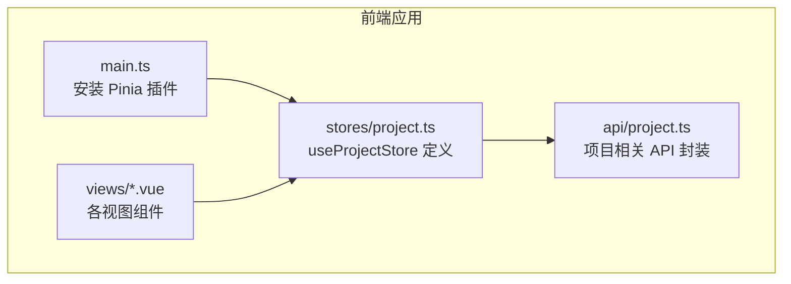
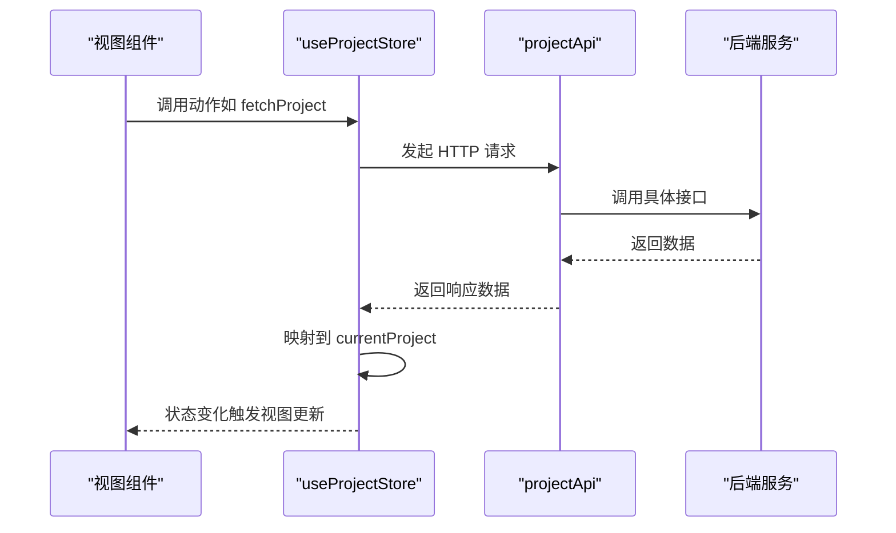
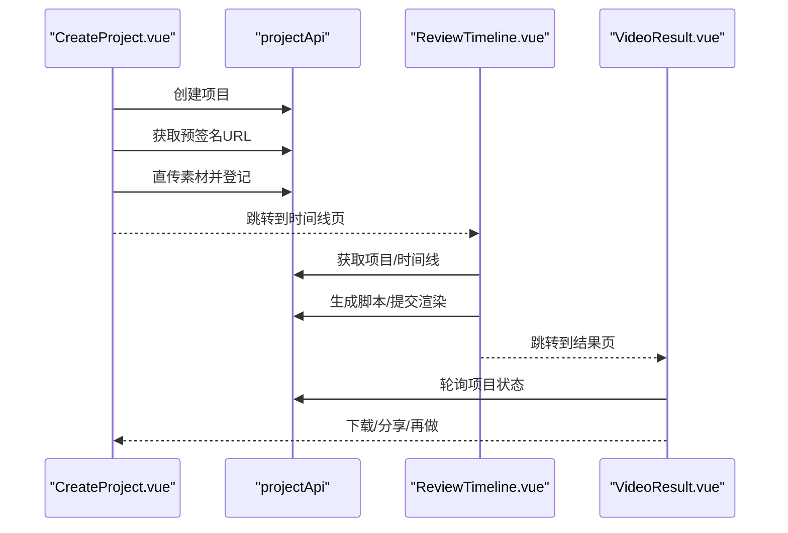
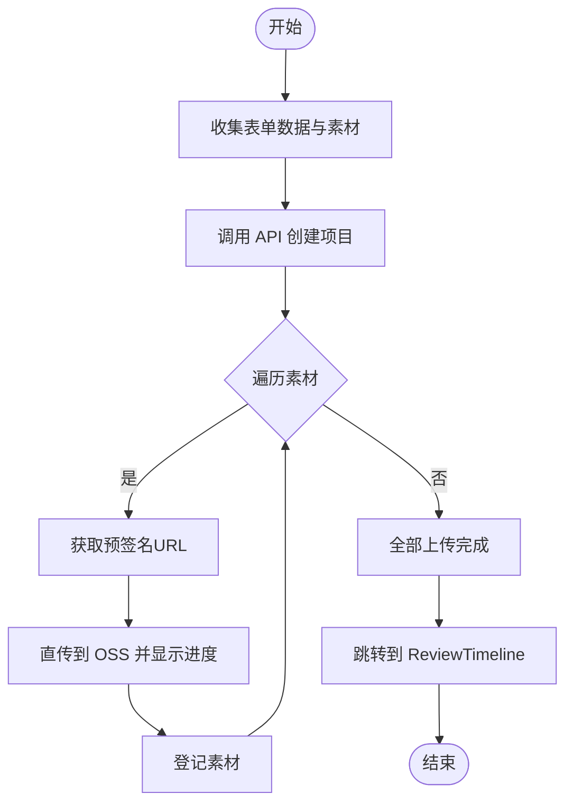
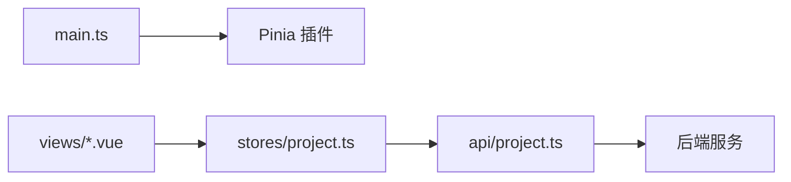

# 状态管理

<cite>
**本文引用的文件**
- [frontend/src/stores/project.ts](file://frontend/src/stores/project.ts)
- [frontend/src/main.ts](file://frontend/src/main.ts)
- [frontend/src/api/project.ts](file://frontend/src/api/project.ts)
- [frontend/src/views/CreateProject.vue](file://frontend/src/views/CreateProject.vue)
- [frontend/src/views/ReviewTimeline.vue](file://frontend/src/views/ReviewTimeline.vue)
- [frontend/src/views/ProjectDetail.vue](file://frontend/src/views/ProjectDetail.vue)
- [frontend/src/views/VideoResult.vue](file://frontend/src/views/VideoResult.vue)
- [frontend/src/views/ProjectList.vue](file://frontend/src/views/ProjectList.vue)
</cite>

## 目录
1. [简介](#简介)
2. [项目结构](#项目结构)
3. [核心组件](#核心组件)
4. [架构总览](#架构总览)
5. [详细组件分析](#详细组件分析)
6. [依赖关系分析](#依赖关系分析)
7. [性能考量](#性能考量)
8. [故障排查指南](#故障排查指南)
9. [结论](#结论)

## 简介
本项目采用 Pinia 作为前端状态管理方案，围绕“项目”这一核心业务实体构建了统一的状态仓库。仓库通过响应式 ref 管理当前项目的完整生命周期状态（草稿、分析、脚本生成、音频生成、渲染、完成、失败等），并通过一组异步 actions 与后端 API 协作，实现从创建、加载、更新到结果呈现的全链路闭环。组件通过 Composition API 的组合式函数与 store 解耦协作，既保证了状态的一致性，也提升了可测试性和可维护性。

## 项目结构
- 状态仓库位于 stores 目录，集中定义了项目状态、动作与辅助方法。
- 视图层组件通过 useProjectStore 在不同阶段读取/更新状态，并触发 API 请求。
- API 层封装了与后端交互的接口，为 store 提供数据来源。

图表来源
- [frontend/src/main.ts](file://frontend/src/main.ts#L1-L16)
- [frontend/src/stores/project.ts](file://frontend/src/stores/project.ts#L1-L219)
- [frontend/src/api/project.ts](file://frontend/src/api/project.ts#L1-L111)

章节来源
- [frontend/src/main.ts](file://frontend/src/main.ts#L1-L16)
- [frontend/src/stores/project.ts](file://frontend/src/stores/project.ts#L1-L219)

## 核心组件
- useProjectStore：定义了 currentProject 响应式对象，包含项目标识、标题、房屋信息、素材列表、脚本、音频、最终视频、状态与错误信息等字段；提供 fetchProject、fetchTimeline、applyMockProject、applyMockTimeline 等动作，用于从后端拉取数据或注入模拟数据。
- API 层 projectApi：封装了创建项目、分页查询、获取预签名上传地址、确认素材、更新素材、获取时间线、生成脚本、更新脚本、生成音频、发起渲染、获取项目详情等接口。
- 视图组件：
  - CreateProject.vue：负责表单收集与项目创建、素材直传（Presigned URL）与登记，随后跳转至 ReviewTimeline 页面。
  - ReviewTimeline.vue：负责轮询时间线、编辑片段标签与排序、生成脚本、提交渲染并跳转结果页。
  - ProjectDetail.vue：负责展示项目详情、编辑脚本、重试渲染。
  - VideoResult.vue：负责轮询渲染进度、展示最终视频与音频、提供下载与分享。
  - ProjectList.vue：负责分页加载项目列表，展示状态与错误追踪信息。

章节来源
- [frontend/src/stores/project.ts](file://frontend/src/stores/project.ts#L1-L219)
- [frontend/src/api/project.ts](file://frontend/src/api/project.ts#L1-L111)
- [frontend/src/views/CreateProject.vue](file://frontend/src/views/CreateProject.vue#L1-L334)
- [frontend/src/views/ReviewTimeline.vue](file://frontend/src/views/ReviewTimeline.vue#L1-L696)
- [frontend/src/views/ProjectDetail.vue](file://frontend/src/views/ProjectDetail.vue#L1-L258)
- [frontend/src/views/VideoResult.vue](file://frontend/src/views/VideoResult.vue#L1-L427)
- [frontend/src/views/ProjectList.vue](file://frontend/src/views/ProjectList.vue#L1-L143)

## 架构总览
Pinia Store 与组件之间的交互遵循“动作驱动数据”的原则：组件通过调用 store 的动作发起异步请求，动作内部将后端返回的数据映射到 currentProject，从而驱动视图更新。API 层与后端服务解耦，便于替换与扩展。

图表来源
- [frontend/src/stores/project.ts](file://frontend/src/stores/project.ts#L66-L102)
- [frontend/src/api/project.ts](file://frontend/src/api/project.ts#L79-L110)
- [frontend/src/views/ReviewTimeline.vue](file://frontend/src/views/ReviewTimeline.vue#L296-L316)
- [frontend/src/views/ProjectDetail.vue](file://frontend/src/views/ProjectDetail.vue#L153-L162)
- [frontend/src/views/VideoResult.vue](file://frontend/src/views/VideoResult.vue#L181-L195)

## 详细组件分析

### 项目状态模型与生命周期
- 状态模型：currentProject 包含项目基础信息、房屋信息、素材数组、脚本文本、音频与最终视频 URL、状态与错误追踪字段。
- 生命周期状态：包括草稿、分析中、待审核、脚本生成中/完成、音频生成中/完成、渲染中、完成、失败等。组件根据状态切换 UI 逻辑与交互行为。
- 持久化策略：当前实现未见本地持久化（如 localStorage/sessionStorage 或 IndexedDB）。状态主要来源于后端 API，组件在进入页面时主动拉取最新数据，确保 UI 与后端一致。

章节来源
- [frontend/src/stores/project.ts](file://frontend/src/stores/project.ts#L28-L64)
- [frontend/src/stores/project.ts](file://frontend/src/stores/project.ts#L66-L102)
- [frontend/src/stores/project.ts](file://frontend/src/stores/project.ts#L104-L153)
- [frontend/src/views/ReviewTimeline.vue](file://frontend/src/views/ReviewTimeline.vue#L327-L340)
- [frontend/src/views/VideoResult.vue](file://frontend/src/views/VideoResult.vue#L134-L150)

### 动作与数据流（CreateProject -> ReviewTimeline -> VideoResult）
- 创建项目与素材上传：
  - CreateProject.vue 收集表单数据，调用 API 创建项目，随后为每个素材获取预签名 URL 并直传 OSS，最后登记素材。
  - 完成后跳转 ReviewTimeline 页面。
- 时间线与脚本：
  - ReviewTimeline.vue 加载项目与时间线，轮询时间线以获取 AI 分析结果，支持拖拽排序与场景标签修正；支持生成脚本与提交渲染。
- 结果页：
  - VideoResult.vue 轮询项目状态，展示最终视频与音频，提供下载与分享。

图表来源
- [frontend/src/views/CreateProject.vue](file://frontend/src/views/CreateProject.vue#L257-L333)
- [frontend/src/api/project.ts](file://frontend/src/api/project.ts#L37-L53)
- [frontend/src/views/ReviewTimeline.vue](file://frontend/src/views/ReviewTimeline.vue#L498-L541)
- [frontend/src/views/ReviewTimeline.vue](file://frontend/src/views/ReviewTimeline.vue#L648-L695)
- [frontend/src/views/VideoResult.vue](file://frontend/src/views/VideoResult.vue#L197-L204)

章节来源
- [frontend/src/views/CreateProject.vue](file://frontend/src/views/CreateProject.vue#L257-L333)
- [frontend/src/views/ReviewTimeline.vue](file://frontend/src/views/ReviewTimeline.vue#L296-L316)
- [frontend/src/views/ReviewTimeline.vue](file://frontend/src/views/ReviewTimeline.vue#L498-L541)
- [frontend/src/views/ReviewTimeline.vue](file://frontend/src/views/ReviewTimeline.vue#L648-L695)
- [frontend/src/views/VideoResult.vue](file://frontend/src/views/VideoResult.vue#L181-L204)

### 组件间数据共享机制
- 共享方式：所有视图组件通过 useProjectStore 访问同一份响应式状态 currentProject，无需 props 逐层传递，降低耦合度。
- 更新路径：组件通过调用 store 的动作（如 fetchProject、fetchTimeline、applyMockProject、applyMockTimeline）更新状态；store 内部将后端数据映射到 currentProject，从而驱动全局视图更新。
- 事件与轮询：ReviewTimeline.vue 与 VideoResult.vue 使用定时器轮询后端状态，确保 UI 与后端保持一致。

章节来源
- [frontend/src/stores/project.ts](file://frontend/src/stores/project.ts#L28-L64)
- [frontend/src/stores/project.ts](file://frontend/src/stores/project.ts#L66-L102)
- [frontend/src/stores/project.ts](file://frontend/src/stores/project.ts#L104-L153)
- [frontend/src/views/ReviewTimeline.vue](file://frontend/src/views/ReviewTimeline.vue#L533-L541)
- [frontend/src/views/VideoResult.vue](file://frontend/src/views/VideoResult.vue#L197-L204)

### 模块化 store 设计优势与与 Composition API 的集成
- 模块化优势：
  - 单一职责：store 专注于项目状态与动作，API 专注于网络请求，视图组件专注于 UI 行为。
  - 可复用性强：多个视图共享同一 store，减少重复逻辑。
  - 易于测试：store 动作与 API 可独立测试，组件通过依赖注入或 mock 方式隔离。
- 与 Composition API 集成：
  - 组件通过 setup 中的 useProjectStore 获取状态与动作，配合 ref/computed/reactive 管理本地 UI 状态，实现“全局状态 + 局部状态”的清晰分离。

章节来源
- [frontend/src/stores/project.ts](file://frontend/src/stores/project.ts#L1-L219)
- [frontend/src/views/ReviewTimeline.vue](file://frontend/src/views/ReviewTimeline.vue#L197-L214)
- [frontend/src/views/ProjectDetail.vue](file://frontend/src/views/ProjectDetail.vue#L103-L120)

### 状态变更流程示例（以 CreateProject 为例）
- 表单收集：组件收集房屋信息、卖点与备注，以及素材文件列表。
- 创建项目：调用 API 创建项目并获取项目 ID。
- 素材直传：为每个素材获取预签名 URL，使用 XHR 上传并显示进度，完成后登记素材。
- 跳转确认页：上传完成后跳转 ReviewTimeline 页面。

图表来源
- [frontend/src/views/CreateProject.vue](file://frontend/src/views/CreateProject.vue#L257-L333)
- [frontend/src/api/project.ts](file://frontend/src/api/project.ts#L45-L53)

章节来源
- [frontend/src/views/CreateProject.vue](file://frontend/src/views/CreateProject.vue#L164-L334)
- [frontend/src/api/project.ts](file://frontend/src/api/project.ts#L37-L53)

### 状态持久化策略
- 当前实现未发现本地持久化逻辑。状态主要来源于后端 API，组件在进入页面时主动拉取最新数据，确保 UI 与后端一致。
- 若需增强体验，可在 store 中引入持久化（如 localStorage/sessionStorage），但需注意：
  - 仅持久化必要的 UI 状态（如草稿数据、临时排序），不持久化敏感或易过期的后端数据。
  - 在页面卸载或切换用户时清理持久化数据，避免跨用户污染。

章节来源
- [frontend/src/stores/project.ts](file://frontend/src/stores/project.ts#L1-L219)
- [frontend/src/views/ReviewTimeline.vue](file://frontend/src/views/ReviewTimeline.vue#L296-L316)
- [frontend/src/views/VideoResult.vue](file://frontend/src/views/VideoResult.vue#L181-L195)

## 依赖关系分析
- 应用入口安装 Pinia 插件，使全局可用。
- 视图组件依赖 store 与 API；store 依赖 API；API 依赖底层 HTTP 客户端。
- 组件之间通过共享 store 状态间接通信，避免了复杂的 props 传递。

图表来源
- [frontend/src/main.ts](file://frontend/src/main.ts#L1-L16)
- [frontend/src/stores/project.ts](file://frontend/src/stores/project.ts#L1-L219)
- [frontend/src/api/project.ts](file://frontend/src/api/project.ts#L1-L111)

章节来源
- [frontend/src/main.ts](file://frontend/src/main.ts#L1-L16)
- [frontend/src/stores/project.ts](file://frontend/src/stores/project.ts#L1-L219)
- [frontend/src/api/project.ts](file://frontend/src/api/project.ts#L1-L111)

## 性能考量
- 轮询频率：ReviewTimeline.vue 与 VideoResult.vue 的轮询间隔为固定值，建议根据业务场景动态调整或在组件卸载时及时停止轮询，避免资源浪费。
- 批量更新：在需要同时更新多个字段时，优先使用一次性映射赋值，减少多次响应式触发带来的开销。
- 图片/视频预览：CreateProject.vue 对大文件生成 objectURL，注意在组件卸载时释放内存，避免内存泄漏。

章节来源
- [frontend/src/views/ReviewTimeline.vue](file://frontend/src/views/ReviewTimeline.vue#L533-L541)
- [frontend/src/views/VideoResult.vue](file://frontend/src/views/VideoResult.vue#L197-L204)
- [frontend/src/views/CreateProject.vue](file://frontend/src/views/CreateProject.vue#L200-L218)

## 故障排查指南
- 常见问题与定位
  - 状态未更新：确认组件是否调用了 store 的动作（如 fetchProject/fetchTimeline），并在动作内部正确映射后端数据到 currentProject。
  - 轮询无响应：检查轮询定时器是否启动、是否在组件卸载时被清理、网络请求是否抛错。
  - 上传失败：检查预签名 URL 获取与直传过程的日志，关注状态码与错误信息。
- 最佳实践
  - 避免直接修改 state：通过 store 的动作进行状态变更，保持单一数据入口。
  - 合理使用 $patch：当需要批量更新少量字段时，使用 $patch 一次性合并，减少响应式触发次数。
  - 错误处理：在动作与组件中统一捕获错误并提示用户，必要时回退到上一个稳定状态。
  - 清理资源：在 onUnmounted 中停止轮询、释放 objectURL、取消未完成的请求。

章节来源
- [frontend/src/stores/project.ts](file://frontend/src/stores/project.ts#L66-L102)
- [frontend/src/stores/project.ts](file://frontend/src/stores/project.ts#L104-L153)
- [frontend/src/views/ReviewTimeline.vue](file://frontend/src/views/ReviewTimeline.vue#L533-L541)
- [frontend/src/views/ReviewTimeline.vue](file://frontend/src/views/ReviewTimeline.vue#L525-L531)
- [frontend/src/views/VideoResult.vue](file://frontend/src/views/VideoResult.vue#L197-L204)
- [frontend/src/views/CreateProject.vue](file://frontend/src/views/CreateProject.vue#L221-L255)

## 结论
本项目通过 Pinia 将“项目生命周期状态”抽象为统一的 store，配合 API 层与视图组件形成清晰的职责边界。模块化设计与 Composition API 的结合，使得状态管理具备良好的可维护性与可扩展性。建议在现有基础上进一步完善错误处理与轮询优化，并在需要时引入本地持久化策略，以提升用户体验与系统稳定性。