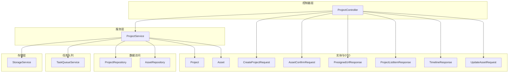
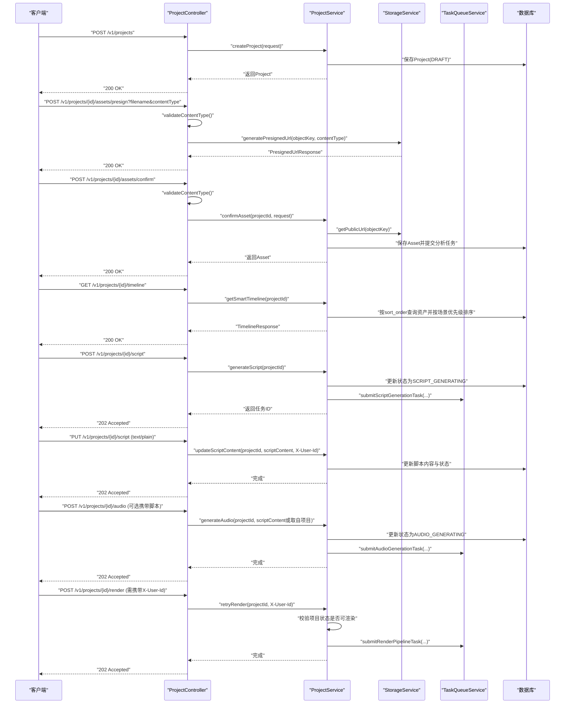
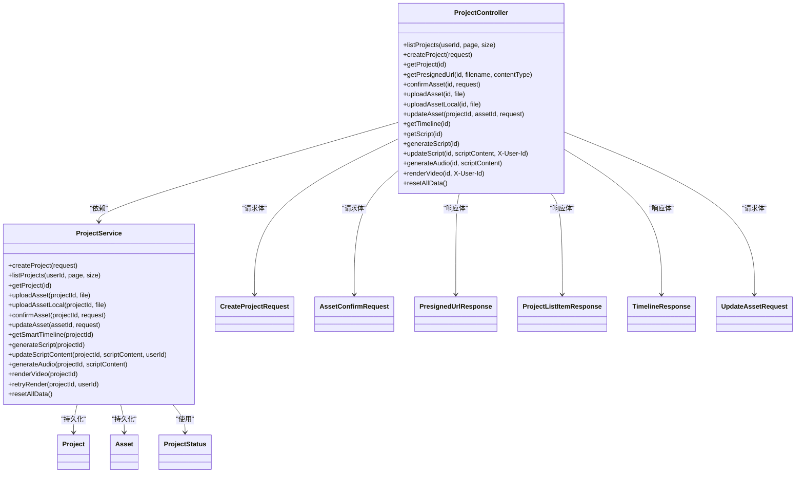

# API端点

<cite>
**本文引用的文件**
- [ProjectController.java](file://backend/src/main/java/com/aiscene/controller/ProjectController.java)
- [ProjectService.java](file://backend/src/main/java/com/aiscene/service/ProjectService.java)
- [CreateProjectRequest.java](file://backend/src/main/java/com/aiscene/dto/CreateProjectRequest.java)
- [AssetConfirmRequest.java](file://backend/src/main/java/com/aiscene/dto/AssetConfirmRequest.java)
- [PresignedUrlResponse.java](file://backend/src/main/java/com/aiscene/dto/PresignedUrlResponse.java)
- [ProjectListItemResponse.java](file://backend/src/main/java/com/aiscene/dto/ProjectListItemResponse.java)
- [TimelineResponse.java](file://backend/src/main/java/com/aiscene/dto/TimelineResponse.java)
- [UpdateAssetRequest.java](file://backend/src/main/java/com/aiscene/dto/UpdateAssetRequest.java)
- [Project.java](file://backend/src/main/java/com/aiscene/entity/Project.java)
- [Asset.java](file://backend/src/main/java/com/aiscene/entity/Asset.java)
- [ProjectStatus.java](file://backend/src/main/java/com/aiscene/entity/ProjectStatus.java)
- [application.yml](file://backend/src/main/resources/application.yml)
- [ProjectControllerTest.java](file://backend/src/test/java/com/aiscene/controller/ProjectControllerTest.java)
</cite>

## 目录
1. [简介](#简介)
2. [项目结构](#项目结构)
3. [核心组件](#核心组件)
4. [架构总览](#架构总览)
5. [详细端点说明](#详细端点说明)
6. [依赖关系分析](#依赖关系分析)
7. [性能与容量考虑](#性能与容量考虑)
8. [故障排查指南](#故障排查指南)
9. [结论](#结论)
10. [附录：最佳实践与示例](#附录最佳实践与示例)

## 简介
本文件为后端API的完整参考文档，聚焦于 ProjectController 中定义的RESTful端点，覆盖项目管理（创建、列表、详情）、素材上传（预签名URL生成、直接上传、本地上传、确认）、时间线获取、脚本生成与更新、音频生成、视频渲染等核心流程。文档同时说明HTTP方法、URL路径、请求头（如 X-User-Id）、请求参数与请求体结构、响应格式（含成功与错误状态码）、分页机制、内容类型校验逻辑，并给出前端调用最佳实践与常见问题排查建议。

## 项目结构
- 控制器层：ProjectController 提供所有对外API
- 服务层：ProjectService 实现业务逻辑与任务队列提交
- DTO层：封装请求与响应数据结构
- 实体层：Project、Asset、ProjectStatus 描述领域模型
- 配置：application.yml 定义上传限制、S3配置、开发重置开关等

图表来源
- [ProjectController.java](file://backend/src/main/java/com/aiscene/controller/ProjectController.java#L1-L206)
- [ProjectService.java](file://backend/src/main/java/com/aiscene/service/ProjectService.java#L1-L356)
- [Project.java](file://backend/src/main/java/com/aiscene/entity/Project.java#L1-L72)
- [Asset.java](file://backend/src/main/java/com/aiscene/entity/Asset.java#L1-L61)
- [CreateProjectRequest.java](file://backend/src/main/java/com/aiscene/dto/CreateProjectRequest.java#L1-L13)
- [AssetConfirmRequest.java](file://backend/src/main/java/com/aiscene/dto/AssetConfirmRequest.java#L1-L13)
- [PresignedUrlResponse.java](file://backend/src/main/java/com/aiscene/dto/PresignedUrlResponse.java#L1-L15)
- [ProjectListItemResponse.java](file://backend/src/main/java/com/aiscene/dto/ProjectListItemResponse.java#L1-L27)
- [TimelineResponse.java](file://backend/src/main/java/com/aiscene/dto/TimelineResponse.java#L1-L21)
- [UpdateAssetRequest.java](file://backend/src/main/java/com/aiscene/dto/UpdateAssetRequest.java#L1-L16)

章节来源
- [ProjectController.java](file://backend/src/main/java/com/aiscene/controller/ProjectController.java#L1-L206)
- [application.yml](file://backend/src/main/resources/application.yml#L1-L66)

## 核心组件
- ProjectController：统一暴露REST接口，负责参数解析、内容类型校验、调用服务层并返回标准响应
- ProjectService：实现业务流程（项目创建、素材上传/确认、脚本生成、音频生成、视频渲染、时间线排序、分页查询等），并与存储与任务队列交互
- DTO：CreateProjectRequest、AssetConfirmRequest、PresignedUrlResponse、ProjectListItemResponse、TimelineResponse、UpdateAssetRequest
- 实体：Project、Asset、ProjectStatus
- 配置：application.yml中的上传大小限制、S3配置、开发重置开关、允许的上传内容类型

章节来源
- [ProjectController.java](file://backend/src/main/java/com/aiscene/controller/ProjectController.java#L1-L206)
- [ProjectService.java](file://backend/src/main/java/com/aiscene/service/ProjectService.java#L1-L356)
- [application.yml](file://backend/src/main/resources/application.yml#L1-L66)

## 架构总览
下图展示了从客户端到控制器、服务层、存储与任务队列的整体交互。

图表来源
- [ProjectController.java](file://backend/src/main/java/com/aiscene/controller/ProjectController.java#L1-L206)
- [ProjectService.java](file://backend/src/main/java/com/aiscene/service/ProjectService.java#L1-L356)

## 详细端点说明

### 通用约定
- 基础路径：/v1/projects
- 请求头：
  - X-User-Id：用于渲染与脚本更新时的项目归属校验（非必需）
- 分页参数：
  - page：当前页，默认1
  - size：每页数量，默认10
- 内容类型校验：
  - 所有上传/确认接口均对 Content-Type 进行白名单校验，支持的类型由配置项提供
  - 校验规则：去除空白与分号后的纯小写类型必须在白名单内；否则返回400

章节来源
- [ProjectController.java](file://backend/src/main/java/com/aiscene/controller/ProjectController.java#L42-L116)
- [application.yml](file://backend/src/main/resources/application.yml#L60-L66)

### 1) 创建项目
- 方法与路径：POST /v1/projects
- 请求头：无强制要求
- 请求体：CreateProjectRequest
  - 字段说明：
    - userId：Long，用户ID（可空）
    - title：String，项目标题
    - houseInfo：Map<String,Object>，房屋信息（如房间、厅、面积、价格等键值）
- 成功响应：200 OK，返回 Project 对象
- 错误响应：无显式4xx/5xx定义，内部异常将由全局异常处理返回

请求体示例（JSON结构路径）
- [CreateProjectRequest.java](file://backend/src/main/java/com/aiscene/dto/CreateProjectRequest.java#L1-L13)

章节来源
- [ProjectController.java](file://backend/src/main/java/com/aiscene/controller/ProjectController.java#L61-L65)
- [ProjectService.java](file://backend/src/main/java/com/aiscene/service/ProjectService.java#L232-L244)
- [Project.java](file://backend/src/main/java/com/aiscene/entity/Project.java#L1-L72)

### 2) 列出项目（分页）
- 方法与路径：GET /v1/projects
- 请求头：X-User-Id：Long（可空）
- 查询参数：
  - page：整数，默认1
  - size：整数，默认10
- 成功响应：200 OK，返回 Page<ProjectListItemResponse>
  - 元素字段：id、title、status、houseInfo、createdAt、errorRequestId、errorStep、errorAt
- 错误响应：无显式4xx/5xx定义

响应示例（结构路径）
- [ProjectListItemResponse.java](file://backend/src/main/java/com/aiscene/dto/ProjectListItemResponse.java#L1-L27)

章节来源
- [ProjectController.java](file://backend/src/main/java/com/aiscene/controller/ProjectController.java#L42-L59)
- [ProjectService.java](file://backend/src/main/java/com/aiscene/service/ProjectService.java#L320-L326)

### 3) 获取项目详情
- 方法与路径：GET /v1/projects/{id}
- 路径参数：id：UUID
- 成功响应：200 OK，返回 Project 对象
- 错误响应：未找到时抛出异常（由全局异常处理返回）

章节来源
- [ProjectController.java](file://backend/src/main/java/com/aiscene/controller/ProjectController.java#L67-L71)
- [ProjectService.java](file://backend/src/main/java/com/aiscene/service/ProjectService.java#L246-L249)
- [Project.java](file://backend/src/main/java/com/aiscene/entity/Project.java#L1-L72)

### 4) 生成素材上传预签名URL
- 方法与路径：POST /v1/projects/{id}/assets/presign
- 路径参数：id：UUID
- 查询参数：
  - filename：字符串，目标文件名
  - contentType：字符串，MIME类型
- 成功响应：200 OK，返回 PresignedUrlResponse
  - 字段：uploadUrl、publicUrl、objectKey、signedHeaders
- 错误响应：
  - 400 Bad Request：缺少或不支持的 Content-Type
  - 500 Internal Server Error：未配置白名单或白名单为空

请求体示例（结构路径）
- [PresignedUrlResponse.java](file://backend/src/main/java/com/aiscene/dto/PresignedUrlResponse.java#L1-L15)

章节来源
- [ProjectController.java](file://backend/src/main/java/com/aiscene/controller/ProjectController.java#L73-L82)
- [ProjectController.java](file://backend/src/main/java/com/aiscene/controller/ProjectController.java#L105-L116)
- [ProjectControllerTest.java](file://backend/src/test/java/com/aiscene/controller/ProjectControllerTest.java#L102-L125)

### 5) 确认素材（通过预签名上传后）
- 方法与路径：POST /v1/projects/{id}/assets/confirm
- 路径参数：id：UUID
- 请求体：AssetConfirmRequest
  - 字段：objectKey、filename、contentType、size
- 成功响应：200 OK，返回 Asset 对象
- 错误响应：
  - 400 Bad Request：不支持的 Content-Type
  - 500 Internal Server Error：未配置白名单或白名单为空

请求体示例（结构路径）
- [AssetConfirmRequest.java](file://backend/src/main/java/com/aiscene/dto/AssetConfirmRequest.java#L1-L13)

章节来源
- [ProjectController.java](file://backend/src/main/java/com/aiscene/controller/ProjectController.java#L84-L89)
- [ProjectController.java](file://backend/src/main/java/com/aiscene/controller/ProjectController.java#L105-L116)
- [ProjectService.java](file://backend/src/main/java/com/aiscene/service/ProjectService.java#L49-L84)
- [Asset.java](file://backend/src/main/java/com/aiscene/entity/Asset.java#L1-L61)

### 6) 直接上传素材（服务端直传S3）
- 方法与路径：POST /v1/projects/{id}/assets
- 路径参数：id：UUID
- 查询参数：file：multipart 文件
- 成功响应：200 OK，返回 Asset 对象
- 错误响应：
  - 400 Bad Request：不支持的 Content-Type
  - 500 Internal Server Error：未配置白名单或白名单为空

章节来源
- [ProjectController.java](file://backend/src/main/java/com/aiscene/controller/ProjectController.java#L91-L96)
- [ProjectController.java](file://backend/src/main/java/com/aiscene/controller/ProjectController.java#L105-L116)
- [ProjectService.java](file://backend/src/main/java/com/aiscene/service/ProjectService.java#L252-L284)
- [Asset.java](file://backend/src/main/java/com/aiscene/entity/Asset.java#L1-L61)

### 7) 本地上传素材（服务端直传S3，本地路径）
- 方法与路径：POST /v1/projects/{id}/assets/local
- 路径参数：id：UUID
- 查询参数：file：multipart 文件
- 成功响应：200 OK，返回 Asset 对象
- 错误响应：
  - 400 Bad Request：不支持的 Content-Type
  - 500 Internal Server Error：未配置白名单或白名单为空

章节来源
- [ProjectController.java](file://backend/src/main/java/com/aiscene/controller/ProjectController.java#L98-L103)
- [ProjectController.java](file://backend/src/main/java/com/aiscene/controller/ProjectController.java#L105-L116)
- [ProjectService.java](file://backend/src/main/java/com/aiscene/service/ProjectService.java#L286-L318)
- [Asset.java](file://backend/src/main/java/com/aiscene/entity/Asset.java#L1-L61)

### 8) 更新素材标签与排序
- 方法与路径：PUT /v1/projects/{projectId}/assets/{assetId}
- 路径参数：projectId、assetId：UUID
- 请求体：UpdateAssetRequest
  - 字段：userLabel、sortOrder
- 成功响应：200 OK，返回 Asset 对象
- 错误响应：未找到素材时抛出异常（由全局异常处理返回）

请求体示例（结构路径）
- [UpdateAssetRequest.java](file://backend/src/main/java/com/aiscene/dto/UpdateAssetRequest.java#L1-L16)

章节来源
- [ProjectController.java](file://backend/src/main/java/com/aiscene/controller/ProjectController.java#L133-L137)
- [ProjectService.java](file://backend/src/main/java/com/aiscene/service/ProjectService.java#L126-L141)
- [Asset.java](file://backend/src/main/java/com/aiscene/entity/Asset.java#L1-L61)

### 9) 获取智能时间线
- 方法与路径：GET /v1/projects/{id}/timeline
- 路径参数：id：UUID
- 成功响应：200 OK，返回 TimelineResponse
  - 字段：projectId、projectTitle、status、errorRequestId、errorStep、assets、scriptContent
  - 排序逻辑：若资产已分析（存在场景标签），按“小区门头/小区环境/客厅/餐厅/厨房/卧室/卫生间/阳台/走廊”优先级排序
- 错误响应：未找到项目时抛出异常（由全局异常处理返回）

响应示例（结构路径）
- [TimelineResponse.java](file://backend/src/main/java/com/aiscene/dto/TimelineResponse.java#L1-L21)

章节来源
- [ProjectController.java](file://backend/src/main/java/com/aiscene/controller/ProjectController.java#L139-L143)
- [ProjectService.java](file://backend/src/main/java/com/aiscene/service/ProjectService.java#L86-L124)

### 10) 获取脚本内容
- 方法与路径：GET /v1/projects/{id}/script
- 路径参数：id：UUID
- 成功响应：200 OK，返回包含以下字段的对象：
  - projectId：UUID字符串
  - status：枚举名称（如 SCRIPT_GENERATED）
  - scriptContent：脚本文本
- 错误响应：未找到项目时抛出异常（由全局异常处理返回）

章节来源
- [ProjectController.java](file://backend/src/main/java/com/aiscene/controller/ProjectController.java#L145-L153)
- [ProjectService.java](file://backend/src/main/java/com/aiscene/service/ProjectService.java#L246-L249)
- [ProjectStatus.java](file://backend/src/main/java/com/aiscene/entity/ProjectStatus.java#L1-L16)

### 11) 生成脚本（异步）
- 方法与路径：POST /v1/projects/{id}/script
- 路径参数：id：UUID
- 成功响应：202 Accepted，返回包含以下字段的对象：
  - projectId：UUID字符串
  - taskId：任务ID
  - status：当前状态（可能为 SCRIPT_GENERATING 或原状态）
  - scriptContent：当前脚本内容（可能为空或已有）
- 错误响应：无显式4xx/5xx定义，内部异常将由全局异常处理返回

章节来源
- [ProjectController.java](file://backend/src/main/java/com/aiscene/controller/ProjectController.java#L155-L165)
- [ProjectService.java](file://backend/src/main/java/com/aiscene/service/ProjectService.java#L143-L165)

### 12) 更新脚本内容（同步）
- 方法与路径：PUT /v1/projects/{id}/script
- 路径参数：id：UUID
- 请求头：X-User-Id：Long（可空，用于校验归属）
- 请求体：text/plain，脚本文本
- 成功响应：202 Accepted
- 错误响应：
  - 400 Bad Request：请求体为空
  - 403 Forbidden：项目已完成或正在处理中（根据服务层校验）
  - 404 Not Found：项目不存在（由服务层异常处理）

章节来源
- [ProjectController.java](file://backend/src/main/java/com/aiscene/controller/ProjectController.java#L167-L177)
- [ProjectService.java](file://backend/src/main/java/com/aiscene/service/ProjectService.java#L178-L194)
- [ProjectService.java](file://backend/src/main/java/com/aiscene/service/ProjectService.java#L328-L341)

### 13) 生成音频（异步）
- 方法与路径：POST /v1/projects/{id}/audio
- 路径参数：id：UUID
- 请求体：text/plain（可选），脚本文本
- 行为：若携带脚本文本则使用该文本；否则回退到项目当前脚本内容
- 成功响应：202 Accepted
- 错误响应：无显式4xx/5xx定义，内部异常将由全局异常处理返回

章节来源
- [ProjectController.java](file://backend/src/main/java/com/aiscene/controller/ProjectController.java#L179-L187)
- [ProjectService.java](file://backend/src/main/java/com/aiscene/service/ProjectService.java#L167-L176)

### 14) 触发视频渲染（异步）
- 方法与路径：POST /v1/projects/{id}/render
- 路径参数：id：UUID
- 请求头：X-User-Id：Long（可空，用于校验归属）
- 成功响应：202 Accepted
- 错误响应：
  - 403 Forbidden：项目已完成或正在处理中（根据服务层校验）
  - 404 Not Found：项目不存在（由服务层异常处理）

章节来源
- [ProjectController.java](file://backend/src/main/java/com/aiscene/controller/ProjectController.java#L189-L195)
- [ProjectService.java](file://backend/src/main/java/com/aiscene/service/ProjectService.java#L196-L230)
- [ProjectService.java](file://backend/src/main/java/com/aiscene/service/ProjectService.java#L335-L341)

### 15) 开发重置（仅开发环境）
- 方法与路径：POST /v1/projects/dev/reset
- 成功响应：204 No Content（当开发重置开关开启）
- 错误响应：404 Not Found（当开发重置开关关闭）
- 开关：由配置项控制

章节来源
- [ProjectController.java](file://backend/src/main/java/com/aiscene/controller/ProjectController.java#L197-L205)
- [ProjectService.java](file://backend/src/main/java/com/aiscene/service/ProjectService.java#L342-L345)
- [application.yml](file://backend/src/main/resources/application.yml#L60-L66)

## 依赖关系分析

图表来源
- [ProjectController.java](file://backend/src/main/java/com/aiscene/controller/ProjectController.java#L1-L206)
- [ProjectService.java](file://backend/src/main/java/com/aiscene/service/ProjectService.java#L1-L356)
- [Project.java](file://backend/src/main/java/com/aiscene/entity/Project.java#L1-L72)
- [Asset.java](file://backend/src/main/java/com/aiscene/entity/Asset.java#L1-L61)
- [ProjectStatus.java](file://backend/src/main/java/com/aiscene/entity/ProjectStatus.java#L1-L16)
- [CreateProjectRequest.java](file://backend/src/main/java/com/aiscene/dto/CreateProjectRequest.java#L1-L13)
- [AssetConfirmRequest.java](file://backend/src/main/java/com/aiscene/dto/AssetConfirmRequest.java#L1-L13)
- [PresignedUrlResponse.java](file://backend/src/main/java/com/aiscene/dto/PresignedUrlResponse.java#L1-L15)
- [ProjectListItemResponse.java](file://backend/src/main/java/com/aiscene/dto/ProjectListItemResponse.java#L1-L27)
- [TimelineResponse.java](file://backend/src/main/java/com/aiscene/dto/TimelineResponse.java#L1-L21)
- [UpdateAssetRequest.java](file://backend/src/main/java/com/aiscene/dto/UpdateAssetRequest.java#L1-L16)

## 性能与容量考虑
- 上传限制：单次上传最大500MB（由Spring配置限制）
- 内容类型白名单：默认支持多种视频格式，建议在生产环境严格维护白名单以避免资源浪费
- 分页：列表接口支持分页，建议前端按需加载，避免一次性拉取过多数据
- 异步任务：脚本生成、音频生成、视频渲染均为异步，前端应轮询状态或监听任务结果
- 数据库索引：项目表按用户ID建立索引，有助于按用户筛选

章节来源
- [application.yml](file://backend/src/main/resources/application.yml#L25-L27)
- [application.yml](file://backend/src/main/resources/application.yml#L60-L66)
- [ProjectService.java](file://backend/src/main/java/com/aiscene/service/ProjectService.java#L320-L326)

## 故障排查指南
- 400 Bad Request
  - 不支持的 Content-Type：检查请求头或参数中的 MIME 类型是否在白名单内
  - PUT /v1/projects/{id}/script 缺少请求体：确保发送纯文本脚本内容
- 403 Forbidden
  - 更新脚本或渲染视频时校验失败：确认 X-User-Id 与项目归属一致，且项目状态允许操作
- 404 Not Found
  - 项目不存在或开发重置开关关闭
- 500 Internal Server Error
  - 未配置上传内容类型白名单或白名单为空
- 建议
  - 使用测试用例作为参考行为：例如预签名URL生成、素材确认、脚本更新、音频生成、渲染触发等均有对应测试

章节来源
- [ProjectController.java](file://backend/src/main/java/com/aiscene/controller/ProjectController.java#L105-L116)
- [ProjectControllerTest.java](file://backend/src/test/java/com/aiscene/controller/ProjectControllerTest.java#L147-L173)
- [ProjectControllerTest.java](file://backend/src/test/java/com/aiscene/controller/ProjectControllerTest.java#L273-L297)
- [ProjectControllerTest.java](file://backend/src/test/java/com/aiscene/controller/ProjectControllerTest.java#L298-L310)
- [ProjectControllerTest.java](file://backend/src/test/java/com/aiscene/controller/ProjectControllerTest.java#L346-L370)

## 结论
本API围绕“项目-素材-脚本-音频-渲染”的完整工作流提供了清晰的REST接口，采用异步任务与严格的上传校验保障稳定性。前端应遵循分页、内容类型白名单、异步状态轮询等最佳实践，以获得稳定可靠的用户体验。

## 附录：最佳实践与示例

- 最佳实践
  - 上传前先调用预签名URL接口，再进行直传，最后调用确认接口完成入库
  - 使用 X-User-Id 头部确保渲染与脚本更新的权限校验
  - 列表接口使用分页参数，避免一次性加载过多数据
  - 脚本、音频、渲染接口返回202，前端应基于任务ID或轮询状态推进UI
- 示例（JSON结构路径）
  - 创建项目请求体：[CreateProjectRequest.java](file://backend/src/main/java/com/aiscene/dto/CreateProjectRequest.java#L1-L13)
  - 素材确认请求体：[AssetConfirmRequest.java](file://backend/src/main/java/com/aiscene/dto/AssetConfirmRequest.java#L1-L13)
  - 预签名URL响应体：[PresignedUrlResponse.java](file://backend/src/main/java/com/aiscene/dto/PresignedUrlResponse.java#L1-L15)
  - 项目列表项响应体：[ProjectListItemResponse.java](file://backend/src/main/java/com/aiscene/dto/ProjectListItemResponse.java#L1-L27)
  - 时间线响应体：[TimelineResponse.java](file://backend/src/main/java/com/aiscene/dto/TimelineResponse.java#L1-L21)
  - 更新素材请求体：[UpdateAssetRequest.java](file://backend/src/main/java/com/aiscene/dto/UpdateAssetRequest.java#L1-L16)