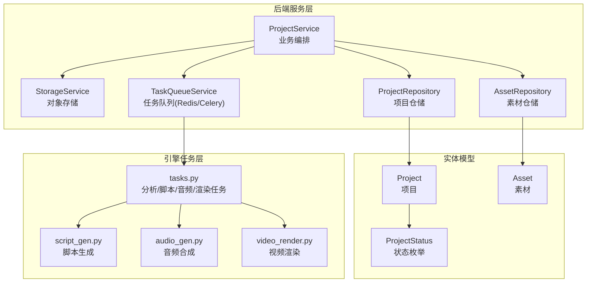
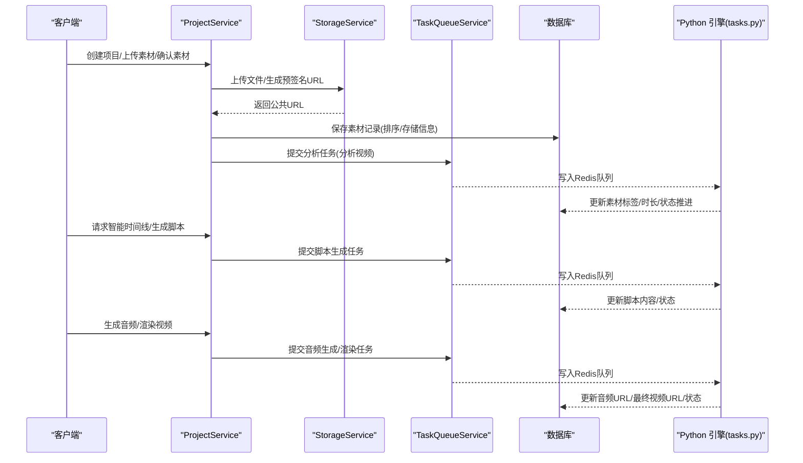
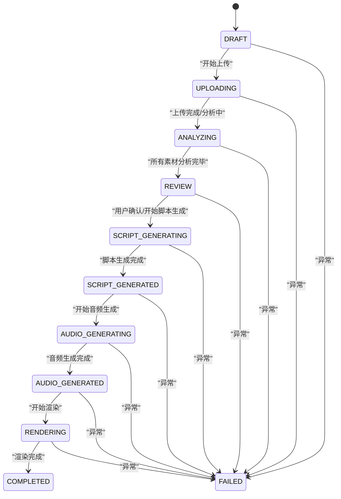
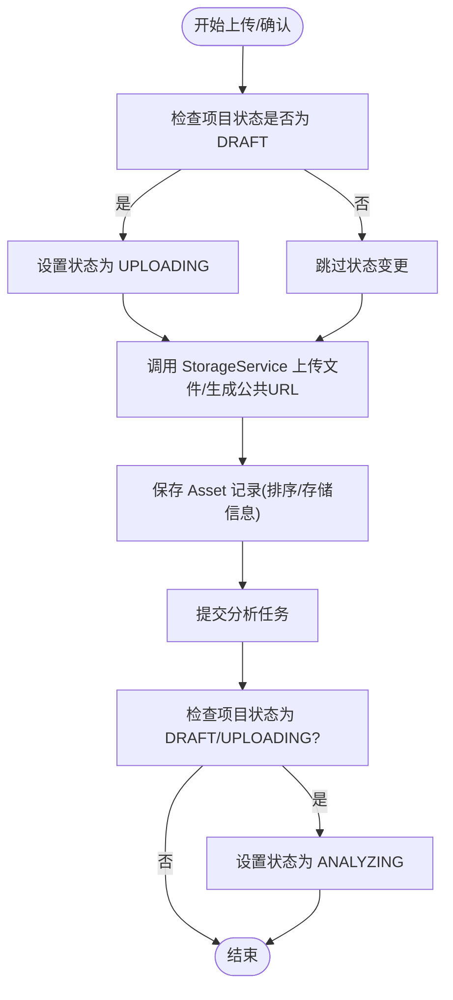
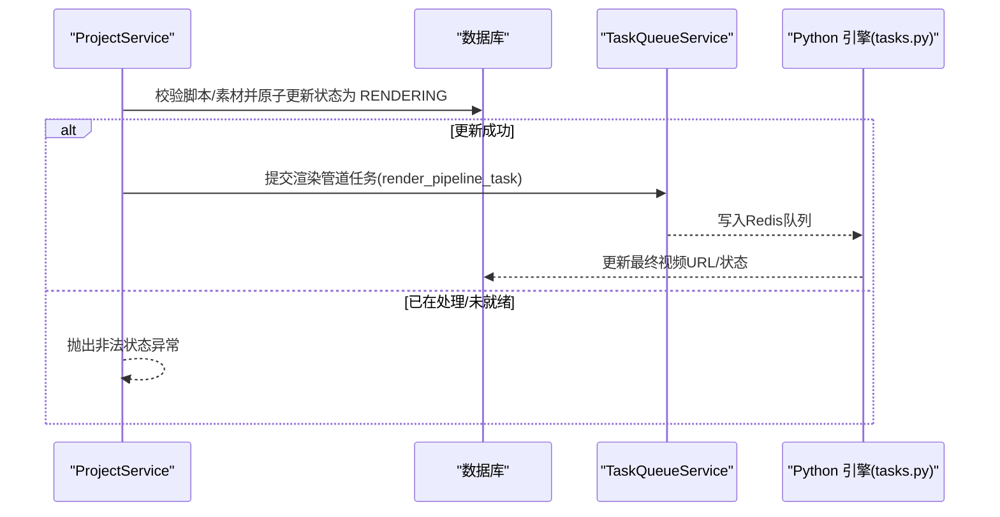
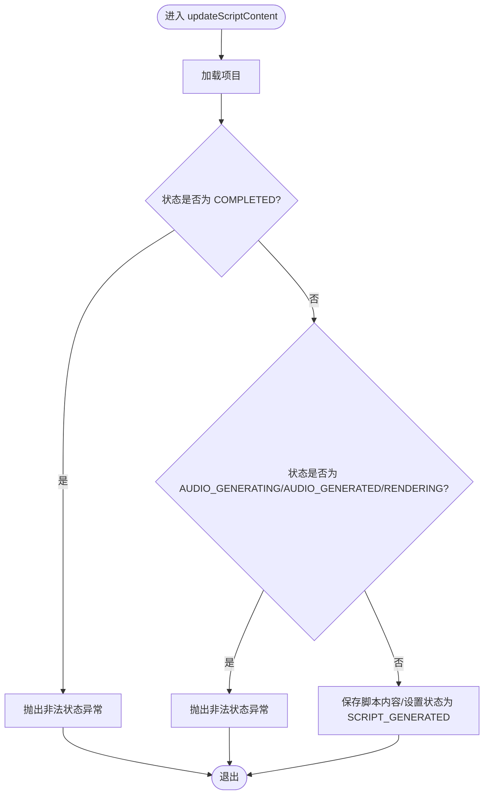
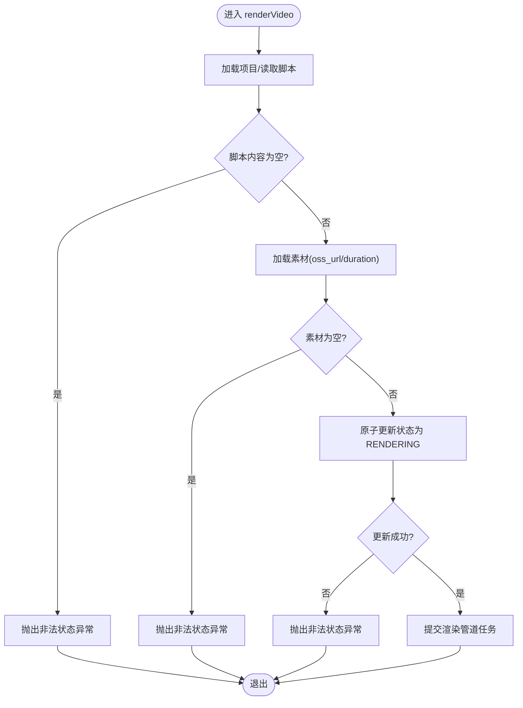
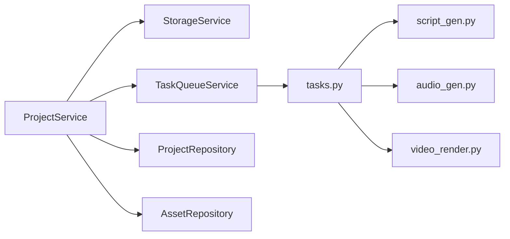

# 业务逻辑层

<cite>
**本文引用的文件**
- [ProjectService.java](file://backend/src/main/java/com/aiscene/service/ProjectService.java)
- [StorageService.java](file://backend/src/main/java/com/aiscene/service/StorageService.java)
- [TaskQueueService.java](file://backend/src/main/java/com/aiscene/service/TaskQueueService.java)
- [Project.java](file://backend/src/main/java/com/aiscene/entity/Project.java)
- [Asset.java](file://backend/src/main/java/com/aiscene/entity/Asset.java)
- [ProjectStatus.java](file://backend/src/main/java/com/aiscene/entity/ProjectStatus.java)
- [ProjectRepository.java](file://backend/src/main/java/com/aiscene/repository/ProjectRepository.java)
- [AssetRepository.java](file://backend/src/main/java/com/aiscene/repository/AssetRepository.java)
- [CreateProjectRequest.java](file://backend/src/main/java/com/aiscene/dto/CreateProjectRequest.java)
- [AssetConfirmRequest.java](file://backend/src/main/java/com/aiscene/dto/AssetConfirmRequest.java)
- [tasks.py](file://engine/tasks.py)
- [script_gen.py](file://engine/script_gen.py)
- [audio_gen.py](file://engine/audio_gen.py)
- [video_render.py](file://engine/video_render.py)
</cite>

## 目录
1. [简介](#简介)
2. [项目结构](#项目结构)
3. [核心组件](#核心组件)
4. [架构总览](#架构总览)
5. [详细组件分析](#详细组件分析)
6. [依赖关系分析](#依赖关系分析)
7. [性能考量](#性能考量)
8. [故障排查指南](#故障排查指南)
9. [结论](#结论)
10. [附录](#附录)

## 简介
本文面向后端开发者，系统性解析 ProjectService 类在项目生命周期中的核心业务逻辑，覆盖项目创建、素材上传与确认、智能时间线排序、脚本生成、音频合成与视频渲染等关键流程。重点阐述服务层如何协调 StorageService 进行对象存储操作，以及如何通过 TaskQueueService 向 Redis/Celery 发送分析、脚本生成、音频生成和渲染任务。同时，解释项目状态机（ProjectStatus）的流转逻辑，给出 updateScriptContent、renderVideo 的执行流程图，并说明用户权限校验（validateProjectOwnership）与事务管理（@Transactional）的应用，最后提供扩展与修改现有逻辑的实践指导。

## 项目结构
后端采用分层设计：controller 层负责接口入口，service 层承载业务编排，repository 层访问数据库，engine 层提供 Python 引擎任务。ProjectService 作为核心业务编排者，贯穿上传、分析、脚本、音频、渲染全流程。

图表来源
- [ProjectService.java](file://backend/src/main/java/com/aiscene/service/ProjectService.java#L1-L356)
- [StorageService.java](file://backend/src/main/java/com/aiscene/service/StorageService.java#L1-L141)
- [TaskQueueService.java](file://backend/src/main/java/com/aiscene/service/TaskQueueService.java#L1-L180)
- [ProjectRepository.java](file://backend/src/main/java/com/aiscene/repository/ProjectRepository.java#L1-L27)
- [AssetRepository.java](file://backend/src/main/java/com/aiscene/repository/AssetRepository.java#L1-L15)
- [Project.java](file://backend/src/main/java/com/aiscene/entity/Project.java#L1-L72)
- [Asset.java](file://backend/src/main/java/com/aiscene/entity/Asset.java#L1-L61)
- [ProjectStatus.java](file://backend/src/main/java/com/aiscene/entity/ProjectStatus.java#L1-L16)
- [tasks.py](file://engine/tasks.py#L1-L1209)
- [script_gen.py](file://engine/script_gen.py#L1-L129)
- [audio_gen.py](file://engine/audio_gen.py#L1-L1059)
- [video_render.py](file://engine/video_render.py#L1-L526)

章节来源
- [ProjectService.java](file://backend/src/main/java/com/aiscene/service/ProjectService.java#L1-L356)
- [ProjectRepository.java](file://backend/src/main/java/com/aiscene/repository/ProjectRepository.java#L1-L27)
- [AssetRepository.java](file://backend/src/main/java/com/aiscene/repository/AssetRepository.java#L1-L15)

## 核心组件
- ProjectService：项目生命周期编排，负责创建、上传/确认素材、智能时间线排序、脚本生成、音频生成、渲染提交、状态更新与权限校验。
- StorageService：封装 S3 客户端与预签名上传，提供公共访问 URL 与上传能力。
- TaskQueueService：将任务序列化为 Celery 消息，写入 Redis 队列，支持事务后提交。
- Project/Asset 实体：持久化项目与素材元数据，含状态、脚本、音频 URL、错误追踪等字段。
- ProjectStatus 枚举：定义项目状态机流转规则。
- ProjectRepository/AssetRepository：基于 JPA 的数据访问层，提供状态原子更新与查询。

章节来源
- [ProjectService.java](file://backend/src/main/java/com/aiscene/service/ProjectService.java#L1-L356)
- [StorageService.java](file://backend/src/main/java/com/aiscene/service/StorageService.java#L1-L141)
- [TaskQueueService.java](file://backend/src/main/java/com/aiscene/service/TaskQueueService.java#L1-L180)
- [Project.java](file://backend/src/main/java/com/aiscene/entity/Project.java#L1-L72)
- [Asset.java](file://backend/src/main/java/com/aiscene/entity/Asset.java#L1-L61)
- [ProjectStatus.java](file://backend/src/main/java/com/aiscene/entity/ProjectStatus.java#L1-L16)
- [ProjectRepository.java](file://backend/src/main/java/com/aiscene/repository/ProjectRepository.java#L1-L27)
- [AssetRepository.java](file://backend/src/main/java/com/aiscene/repository/AssetRepository.java#L1-L15)

## 架构总览
ProjectService 作为中枢，协调以下交互：
- 对象存储：通过 StorageService 将素材上传至 S3 并生成可公开访问 URL。
- 任务队列：通过 TaskQueueService 将分析、脚本、音频、渲染任务投递到 Redis/Celery。
- 数据库：使用 ProjectRepository/AssetRepository 更新项目与素材状态、排序与标注。
- 引擎任务：Python 引擎 tasks.py 负责具体分析、脚本生成、音频合成与视频渲染。

图表来源
- [ProjectService.java](file://backend/src/main/java/com/aiscene/service/ProjectService.java#L1-L356)
- [StorageService.java](file://backend/src/main/java/com/aiscene/service/StorageService.java#L1-L141)
- [TaskQueueService.java](file://backend/src/main/java/com/aiscene/service/TaskQueueService.java#L1-L180)
- [ProjectRepository.java](file://backend/src/main/java/com/aiscene/repository/ProjectRepository.java#L1-L27)
- [AssetRepository.java](file://backend/src/main/java/com/aiscene/repository/AssetRepository.java#L1-L15)
- [tasks.py](file://engine/tasks.py#L1-L1209)

## 详细组件分析

### 项目状态机（ProjectStatus）
状态机定义了项目从草稿到完成的关键阶段，支持失败回退与重试。典型流转路径：
- DRAFT → UPLOADING → ANALYZING → REVIEW → SCRIPT_GENERATING → SCRIPT_GENERATED → AUDIO_GENERATING → AUDIO_GENERATED → RENDERING → COMPLETED
- 失败路径：任意阶段可进入 FAILED，保留错误上下文（错误日志、请求ID、步骤、时间）

图表来源
- [ProjectStatus.java](file://backend/src/main/java/com/aiscene/entity/ProjectStatus.java#L1-L16)

章节来源
- [ProjectStatus.java](file://backend/src/main/java/com/aiscene/entity/ProjectStatus.java#L1-L16)
- [ProjectService.java](file://backend/src/main/java/com/aiscene/service/ProjectService.java#L1-L356)
- [tasks.py](file://engine/tasks.py#L337-L463)

### 项目创建（createProject）
- 输入：CreateProjectRequest（用户ID、标题、房屋信息）
- 输出：持久化后的 Project（初始状态 DRAFT）
- 关键点：使用 JSON 存储房屋信息，便于后续脚本生成时使用

章节来源
- [ProjectService.java](file://backend/src/main/java/com/aiscene/service/ProjectService.java#L232-L244)
- [CreateProjectRequest.java](file://backend/src/main/java/com/aiscene/dto/CreateProjectRequest.java#L1-L13)
- [Project.java](file://backend/src/main/java/com/aiscene/entity/Project.java#L1-L72)

### 素材上传与确认（uploadAsset/uploadAssetLocal/confirmAsset）
- 上传流程：
  - 若项目状态为 DRAFT，则置为 UPLOADING
  - StorageService 上传文件并返回公共 URL
  - 新建 Asset 记录（存储类型、桶名、对象键、排序号、默认时长 0）
  - 保存后提交分析任务（submitAnalysisTask）
  - 若项目状态为 DRAFT 或 UPLOADING，则置为 ANALYZING
- 确认流程（confirmAsset）：
  - 通过对象键生成公共 URL
  - 以当前素材数量为基准计算排序号
  - 保存 Asset 并提交分析任务
  - 状态推进逻辑同上

图表来源
- [ProjectService.java](file://backend/src/main/java/com/aiscene/service/ProjectService.java#L252-L318)
- [ProjectService.java](file://backend/src/main/java/com/aiscene/service/ProjectService.java#L49-L84)
- [StorageService.java](file://backend/src/main/java/com/aiscene/service/StorageService.java#L104-L140)
- [TaskQueueService.java](file://backend/src/main/java/com/aiscene/service/TaskQueueService.java#L32-L62)

章节来源
- [ProjectService.java](file://backend/src/main/java/com/aiscene/service/ProjectService.java#L49-L84)
- [ProjectService.java](file://backend/src/main/java/com/aiscene/service/ProjectService.java#L252-L318)
- [StorageService.java](file://backend/src/main/java/com/aiscene/service/StorageService.java#L104-L140)
- [TaskQueueService.java](file://backend/src/main/java/com/aiscene/service/TaskQueueService.java#L32-L62)

### 智能时间线排序（getSmartTimeline）
- 依据素材的场景标签 scene_label 进行优先级排序
- 优先级映射：门头、环境、客厅、餐厅、厨房、卧室、卫生间、阳台、走廊
- 若存在已分析的素材（具备场景标签），则按优先级排序；否则保持原始顺序
- 返回 TimelineResponse（包含项目信息、资产列表、脚本内容等）

章节来源
- [ProjectService.java](file://backend/src/main/java/com/aiscene/service/ProjectService.java#L86-L124)
- [AssetRepository.java](file://backend/src/main/java/com/aiscene/repository/AssetRepository.java#L10-L15)

### 脚本生成（generateScript）
- 准备数据：将项目房屋信息与素材列表转换为 Python 可消费的数据结构
- 状态推进：设置为 SCRIPT_GENERATING
- 通过 TaskQueueService 提交 generate_script_task，返回任务ID
- Python 引擎 script_gen.py 使用大模型生成 JSON 结构化的脚本，包含每段的文本、视觉提示与音效建议

章节来源
- [ProjectService.java](file://backend/src/main/java/com/aiscene/service/ProjectService.java#L143-L165)
- [TaskQueueService.java](file://backend/src/main/java/com/aiscene/service/TaskQueueService.java#L64-L74)
- [script_gen.py](file://engine/script_gen.py#L1-L129)

### 音频合成（generateAudio）
- 可选：若用户编辑了脚本内容，先更新数据库中的脚本内容
- 状态推进：设置为 AUDIO_GENERATING
- 通过 TaskQueueService 提交 generate_audio_task，传入脚本内容
- Python 引擎 audio_gen.py 将脚本分段对齐视频时长，生成 MP3 片段并拼接

章节来源
- [ProjectService.java](file://backend/src/main/java/com/aiscene/service/ProjectService.java#L167-L176)
- [TaskQueueService.java](file://backend/src/main/java/com/aiscene/service/TaskQueueService.java#L76-L85)
- [audio_gen.py](file://engine/audio_gen.py#L729-L800)

### 视频渲染（renderVideo）
- 前置校验：脚本内容不能为空，且项目状态需处于 SCRIPT_GENERATED 或 FAILED（允许重试）
- 准备数据：收集素材的 OSS URL 与时长，构建渲染所需的时间线数据
- 原子状态更新：使用 ProjectRepository.updateStatusIfIn 将状态从允许集合原子切换到 RENDERING
- 通过 TaskQueueService 提交 render_pipeline_task，传入脚本与时间线
- Python 引擎 video_render.py 下载素材、应用暖色滤镜、弹性同步音视频、拼接并导出最终视频

图表来源
- [ProjectService.java](file://backend/src/main/java/com/aiscene/service/ProjectService.java#L196-L230)
- [ProjectRepository.java](file://backend/src/main/java/com/aiscene/repository/ProjectRepository.java#L20-L26)
- [TaskQueueService.java](file://backend/src/main/java/com/aiscene/service/TaskQueueService.java#L98-L107)
- [tasks.py](file://engine/tasks.py#L1-L1209)

章节来源
- [ProjectService.java](file://backend/src/main/java/com/aiscene/service/ProjectService.java#L196-L230)
- [ProjectRepository.java](file://backend/src/main/java/com/aiscene/repository/ProjectRepository.java#L20-L26)
- [TaskQueueService.java](file://backend/src/main/java/com/aiscene/service/TaskQueueService.java#L98-L107)
- [video_render.py](file://engine/video_render.py#L233-L448)

### updateScriptContent 执行流程图

图表来源
- [ProjectService.java](file://backend/src/main/java/com/aiscene/service/ProjectService.java#L178-L194)

章节来源
- [ProjectService.java](file://backend/src/main/java/com/aiscene/service/ProjectService.java#L178-L194)

### renderVideo 执行流程图

图表来源
- [ProjectService.java](file://backend/src/main/java/com/aiscene/service/ProjectService.java#L196-L230)
- [ProjectRepository.java](file://backend/src/main/java/com/aiscene/repository/ProjectRepository.java#L20-L26)

章节来源
- [ProjectService.java](file://backend/src/main/java/com/aiscene/service/ProjectService.java#L196-L230)
- [ProjectRepository.java](file://backend/src/main/java/com/aiscene/repository/ProjectRepository.java#L20-L26)

### 用户权限校验与事务管理
- 权限校验（validateProjectOwnership）：当 userId 非空时，校验项目归属，不匹配则抛出禁止访问异常
- 事务管理（@Transactional）：
  - 在 createProject、uploadAsset/Local、confirmAsset、updateAsset、updateScriptContent、renderVideo、resetAllData 等方法上使用，确保数据库一致性
  - TaskQueueService 在事务完成后才提交任务，避免“先提交任务再落库”的竞态问题

章节来源
- [ProjectService.java](file://backend/src/main/java/com/aiscene/service/ProjectService.java#L328-L354)
- [ProjectService.java](file://backend/src/main/java/com/aiscene/service/ProjectService.java#L232-L244)
- [ProjectService.java](file://backend/src/main/java/com/aiscene/service/ProjectService.java#L252-L318)
- [ProjectService.java](file://backend/src/main/java/com/aiscene/service/ProjectService.java#L49-L84)
- [ProjectService.java](file://backend/src/main/java/com/aiscene/service/ProjectService.java#L126-L141)
- [ProjectService.java](file://backend/src/main/java/com/aiscene/service/ProjectService.java#L178-L194)
- [ProjectService.java](file://backend/src/main/java/com/aiscene/service/ProjectService.java#L196-L230)
- [ProjectService.java](file://backend/src/main/java/com/aiscene/service/ProjectService.java#L342-L345)
- [TaskQueueService.java](file://backend/src/main/java/com/aiscene/service/TaskQueueService.java#L32-L62)

## 依赖关系分析
- ProjectService 依赖：
  - StorageService：上传与 URL 生成
  - TaskQueueService：任务投递
  - ProjectRepository/AssetRepository：状态更新与查询
- 引擎任务依赖：
  - tasks.py 调用 script_gen.py、audio_gen.py、video_render.py
  - 通过数据库连接更新项目与素材状态，维护错误追踪

图表来源
- [ProjectService.java](file://backend/src/main/java/com/aiscene/service/ProjectService.java#L1-L356)
- [StorageService.java](file://backend/src/main/java/com/aiscene/service/StorageService.java#L1-L141)
- [TaskQueueService.java](file://backend/src/main/java/com/aiscene/service/TaskQueueService.java#L1-L180)
- [ProjectRepository.java](file://backend/src/main/java/com/aiscene/repository/ProjectRepository.java#L1-L27)
- [AssetRepository.java](file://backend/src/main/java/com/aiscene/repository/AssetRepository.java#L1-L15)
- [tasks.py](file://engine/tasks.py#L1-L1209)
- [script_gen.py](file://engine/script_gen.py#L1-L129)
- [audio_gen.py](file://engine/audio_gen.py#L1-L1059)
- [video_render.py](file://engine/video_render.py#L1-L526)

章节来源
- [ProjectService.java](file://backend/src/main/java/com/aiscene/service/ProjectService.java#L1-L356)
- [TaskQueueService.java](file://backend/src/main/java/com/aiscene/service/TaskQueueService.java#L1-L180)
- [tasks.py](file://engine/tasks.py#L1-L1209)

## 性能考量
- 上传与下载：
  - StorageService 支持预签名上传，减少后端压力；video_render.py 优先从 S3 直接下载，避免重复传输
- 任务并发：
  - Redis 队列异步处理，避免阻塞主流程；TaskQueueService 在事务提交后再发任务，保证一致性
- 渲染优化：
  - video_render.py 采用弹性音视频同步策略（裁剪/循环 Boomerang），提升拼接质量与稳定性
- 状态推进：
  - ProjectRepository.updateStatusIfIn 使用原子更新，避免竞态导致的状态错乱

章节来源
- [StorageService.java](file://backend/src/main/java/com/aiscene/service/StorageService.java#L104-L140)
- [TaskQueueService.java](file://backend/src/main/java/com/aiscene/service/TaskQueueService.java#L32-L62)
- [ProjectRepository.java](file://backend/src/main/java/com/aiscene/repository/ProjectRepository.java#L20-L26)
- [video_render.py](file://engine/video_render.py#L233-L448)

## 故障排查指南
- 常见异常与定位
  - “脚本内容为空/无素材/状态非法”：renderVideo 前置校验失败，检查脚本生成与素材上传是否完成
  - “项目正在处理/已完成”：updateScriptContent 与 renderVideo 的状态限制，等待处理完成或重试
  - “权限禁止”：validateProjectOwnership 校验失败，确认用户ID与项目归属一致
- 错误追踪
  - 项目表包含 error_log、error_task_id、error_request_id、error_step、error_at 字段，用于定位失败环节
- 重试与回退
  - 引擎任务具备最大重试次数，失败后将项目置为 FAILED 并记录错误上下文

章节来源
- [ProjectService.java](file://backend/src/main/java/com/aiscene/service/ProjectService.java#L178-L194)
- [ProjectService.java](file://backend/src/main/java/com/aiscene/service/ProjectService.java#L196-L230)
- [ProjectService.java](file://backend/src/main/java/com/aiscene/service/ProjectService.java#L342-L354)
- [Project.java](file://backend/src/main/java/com/aiscene/entity/Project.java#L1-L72)
- [tasks.py](file://engine/tasks.py#L418-L463)

## 结论
ProjectService 通过清晰的事务边界与状态机约束，将上传、分析、脚本、音频、渲染串联为稳定可靠的流水线。配合 StorageService 的对象存储能力与 TaskQueueService 的异步任务机制，实现了高可用的视频生成服务。扩展新功能时，建议遵循：
- 保持状态机约束与原子更新
- 在事务完成后提交任务
- 明确错误追踪字段，便于定位与回退
- 评估渲染与合成的资源开销，合理拆分任务粒度

## 附录
- 术语
  - 项目：一次视频生成任务的载体，包含房屋信息、素材与脚本
  - 素材：单个视频片段，包含存储信息、场景标签、时长与排序
  - 状态机：项目生命周期的状态集合与转换规则
- 参考实现位置
  - 项目创建：[ProjectService.java](file://backend/src/main/java/com/aiscene/service/ProjectService.java#L232-L244)
  - 素材上传/确认：[ProjectService.java](file://backend/src/main/java/com/aiscene/service/ProjectService.java#L252-L318), [ProjectService.java](file://backend/src/main/java/com/aiscene/service/ProjectService.java#L49-L84)
  - 智能时间线：[ProjectService.java](file://backend/src/main/java/com/aiscene/service/ProjectService.java#L86-L124)
  - 脚本生成：[ProjectService.java](file://backend/src/main/java/com/aiscene/service/ProjectService.java#L143-L165), [TaskQueueService.java](file://backend/src/main/java/com/aiscene/service/TaskQueueService.java#L64-L74), [script_gen.py](file://engine/script_gen.py#L1-L129)
  - 音频合成：[ProjectService.java](file://backend/src/main/java/com/aiscene/service/ProjectService.java#L167-L176), [TaskQueueService.java](file://backend/src/main/java/com/aiscene/service/TaskQueueService.java#L76-L85), [audio_gen.py](file://engine/audio_gen.py#L729-L800)
  - 视频渲染：[ProjectService.java](file://backend/src/main/java/com/aiscene/service/ProjectService.java#L196-L230), [TaskQueueService.java](file://backend/src/main/java/com/aiscene/service/TaskQueueService.java#L98-L107), [video_render.py](file://engine/video_render.py#L233-L448)