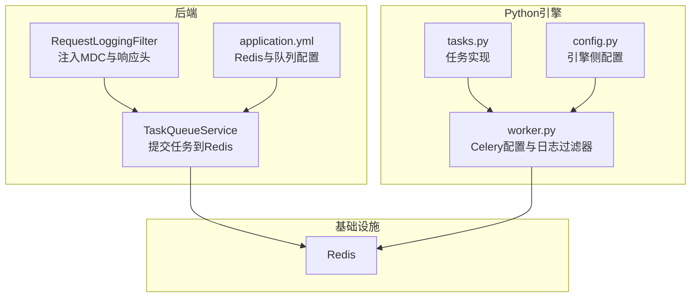
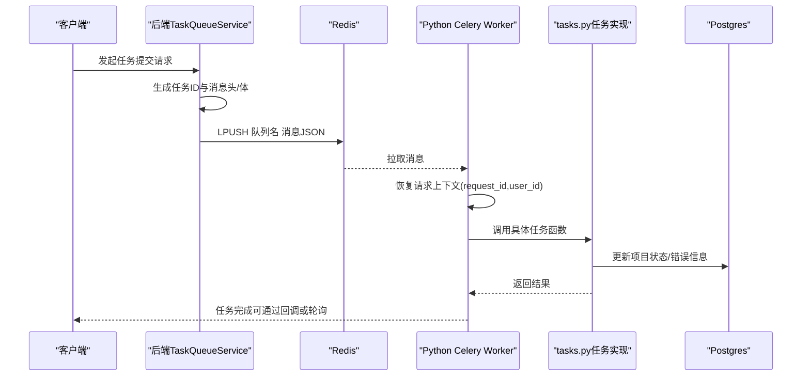
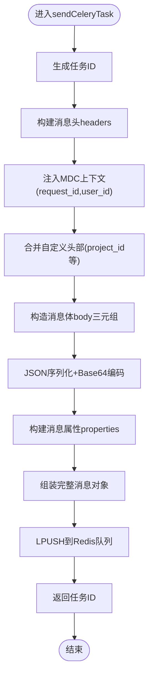
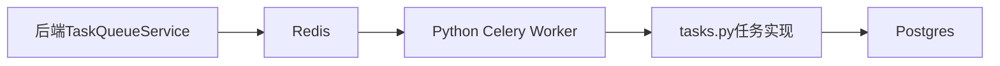

# 任务调度

<cite>
**本文引用的文件**
- [TaskQueueService.java](file://backend/src/main/java/com/aiscene/service/TaskQueueService.java)
- [tasks.py](file://engine/tasks.py)
- [worker.py](file://engine/worker.py)
- [application.yml](file://backend/src/main/resources/application.yml)
- [config.py](file://engine/config.py)
- [TaskQueueServiceTest.java](file://backend/src/test/java/com/aiscene/service/TaskQueueServiceTest.java)
- [RequestLoggingFilter.java](file://backend/src/main/java/com/aiscene/config/RequestLoggingFilter.java)
- [RequestLoggingFilterTest.java](file://backend/src/test/java/com/aiscene/config/RequestLoggingFilterTest.java)
- [Project.java](file://backend/src/main/java/com/aiscene/entity/Project.java)
- [V3__add_error_fields_to_projects.sql](file://backend/src/main/resources/db/migration/V3__add_error_fields_to_projects.sql)
</cite>

## 目录
1. [简介](#简介)
2. [项目结构](#项目结构)
3. [核心组件](#核心组件)
4. [架构总览](#架构总览)
5. [详细组件分析](#详细组件分析)
6. [依赖关系分析](#依赖关系分析)
7. [性能考量](#性能考量)
8. [故障排查指南](#故障排查指南)
9. [结论](#结论)
10. [附录：扩展指南](#附录扩展指南)

## 简介
本文件系统性解析后端如何通过Redis实现与Python AI引擎的Celery任务队列集成，重点覆盖以下内容：
- TaskQueueService如何构造并发送Celery消息（包含消息头headers与消息体body的序列化）
- 任务ID生成策略、请求上下文（MDC）透传与事务同步（TransactionSynchronization）机制
- 任务提交失败的异常处理策略与日志记录规范
- 针对submitAnalysisTask、submitScriptGenerationTask、submitAudioGenerationTask、submitRenderPipelineTask等方法的内部实现细节
- 新增AI任务类型或修改任务参数结构的扩展指南

## 项目结构
该仓库采用前后端分离架构，后端使用Spring Boot，AI引擎使用Python Celery，二者通过Redis进行异步通信。关键文件分布如下：
- 后端服务：TaskQueueService负责将任务封装为Celery消息并写入Redis队列
- Python引擎：worker.py配置Celery连接与日志过滤器；tasks.py定义具体任务逻辑
- 配置：application.yml提供后端Redis连接与队列名称；config.py提供引擎侧Redis、队列名等环境变量
- 测试：TaskQueueServiceTest验证消息头与消息体的序列化正确性；RequestLoggingFilterTest验证MDC上下文透传

图表来源
- [TaskQueueService.java](file://backend/src/main/java/com/aiscene/service/TaskQueueService.java#L1-L180)
- [RequestLoggingFilter.java](file://backend/src/main/java/com/aiscene/config/RequestLoggingFilter.java#L1-L69)
- [application.yml](file://backend/src/main/resources/application.yml#L1-L66)
- [worker.py](file://engine/worker.py#L1-L137)
- [tasks.py](file://engine/tasks.py#L1-L1209)
- [config.py](file://engine/config.py#L1-L46)

章节来源
- [TaskQueueService.java](file://backend/src/main/java/com/aiscene/service/TaskQueueService.java#L1-L180)
- [application.yml](file://backend/src/main/resources/application.yml#L1-L66)

## 核心组件
- 后端TaskQueueService：封装任务参数为Celery消息，写入Redis队列，并在事务提交后执行以保证数据一致性
- Python引擎worker：配置Celery连接、队列、序列化方式，以及日志过滤器，从Redis拉取任务并恢复请求上下文
- Python引擎tasks：定义具体任务（如视频分析、脚本生成、音频生成、渲染等），并在失败时持久化错误信息
- 请求过滤器RequestLoggingFilter：在HTTP入口处生成/透传请求ID与用户ID至MDC，供任务头透传

章节来源
- [TaskQueueService.java](file://backend/src/main/java/com/aiscene/service/TaskQueueService.java#L1-L180)
- [worker.py](file://engine/worker.py#L1-L137)
- [tasks.py](file://engine/tasks.py#L1-L1209)
- [RequestLoggingFilter.java](file://backend/src/main/java/com/aiscene/config/RequestLoggingFilter.java#L1-L69)

## 架构总览
后端通过TaskQueueService将任务序列化为符合Celery协议的消息，写入Redis队列；Python引擎的Celery worker从队列中取出消息，恢复请求上下文（request_id、user_id），执行对应任务逻辑，并在必要时更新数据库状态。

图表来源
- [TaskQueueService.java](file://backend/src/main/java/com/aiscene/service/TaskQueueService.java#L109-L179)
- [worker.py](file://engine/worker.py#L101-L134)
- [tasks.py](file://engine/tasks.py#L646-L790)
- [application.yml](file://backend/src/main/resources/application.yml#L60-L66)

## 详细组件分析

### TaskQueueService：消息构造与提交
- 队列名称：固定为“ai-video:celery”，与后端配置一致
- 任务ID生成：UUID随机生成，作为消息ID与根ID
- 消息头headers：
  - 固定字段：lang、task、id、root_id、parent_id、group、retries、timelimit、argsrepr、kwargsrepr
  - 上下文字段：request_id（来自MDC，若不存在则生成）、user_id（可选）
  - 自定义字段：支持额外键值对（如project_id、asset_id等）
- 消息体body：
  - 结构为三元组：[args列表, kwargs字典, 额外控制项embed]
  - 以JSON序列化后进行Base64编码
- 消息属性properties：
  - correlation_id、reply_to、delivery_mode、delivery_tag、priority、body_encoding
  - delivery_info包含exchange与routing_key（即队列名）
- 提交流程：
  - 将消息整体序列化为JSON并LPUSH到Redis队列
  - 若序列化失败，记录错误并抛出运行时异常
- 事务同步：
  - 在存在实际事务时，注册afterCommit回调，确保数据库提交后再发送消息，避免脏读或不一致

图表来源
- [TaskQueueService.java](file://backend/src/main/java/com/aiscene/service/TaskQueueService.java#L109-L179)

章节来源
- [TaskQueueService.java](file://backend/src/main/java/com/aiscene/service/TaskQueueService.java#L1-L180)

### 方法实现要点
- submitAnalysisTask：构造AnalyzeTaskDto，设置project_id、asset_id等自定义头，调用sendCeleryTask发送analyze_video_task
- submitScriptGenerationTask：发送generate_script_task，参数为project_id、houseInfo、timelineData
- submitAudioGenerationTask：发送generate_audio_task，参数为project_id、scriptContent
- submitRenderVideoTask：发送render_video_task，参数为project_id、timelineAssets、audioPath
- submitRenderPipelineTask：发送render_pipeline_task，参数为project_id、scriptContent、timelineAssets

章节来源
- [TaskQueueService.java](file://backend/src/main/java/com/aiscene/service/TaskQueueService.java#L32-L107)

### 请求上下文（MDC）透传与事务同步
- MDC透传：在消息头中注入request_id与user_id，若MDC中无request_id则生成新的UUID
- 事务同步：当存在实际数据库事务时，使用TransactionSynchronizationManager在事务提交后才执行任务提交，确保一致性

章节来源
- [TaskQueueService.java](file://backend/src/main/java/com/aiscene/service/TaskQueueService.java#L109-L179)
- [RequestLoggingFilter.java](file://backend/src/main/java/com/aiscene/config/RequestLoggingFilter.java#L1-L69)
- [TaskQueueServiceTest.java](file://backend/src/test/java/com/aiscene/service/TaskQueueServiceTest.java#L1-L88)

### Python引擎：Celery配置与日志过滤器
- Celery配置：broker与backend均为Redis URL，task_serializer/accept/result_serializer为json，队列名为CELERY_QUEUE_NAME
- 日志过滤器：RequestIdFilter将request_id、user_id、task_id注入日志记录；JsonFormatter输出结构化JSON日志
- 任务预运行钩子：在任务开始前从headers恢复request_id、user_id、task_id到contextvars，供日志格式化使用

章节来源
- [worker.py](file://engine/worker.py#L1-L137)
- [config.py](file://engine/config.py#L1-L46)

### 任务实现与失败处理
- analyze_video_task：下载视频、场景分割（可选）、关键帧分析、更新资产与项目状态；失败时按指数退避重试，超过最大重试次数则标记项目失败并持久化错误信息
- generate_script_task：根据房屋信息与时间线生成脚本，失败时重试
- generate_audio_task：对齐片段生成音频、拼接预览、上传并更新项目状态；失败时重试，超过上限则标记失败
- render_video_task：拉取脚本、重新对齐音频、渲染最终视频、上传并更新项目状态；失败时重试，超过上限则标记失败
- render_pipeline_task：脚本生成与音频生成、预览、渲染一体化流水线；失败时重试，超过上限则标记失败
- 失败持久化：tasks.py中的_set_project_failed将错误日志、错误任务ID、错误请求ID、错误步骤与时间写入projects表

章节来源
- [tasks.py](file://engine/tasks.py#L646-L790)
- [tasks.py](file://engine/tasks.py#L800-L977)
- [tasks.py](file://engine/tasks.py#L978-L1165)
- [tasks.py](file://engine/tasks.py#L418-L462)
- [Project.java](file://backend/src/main/java/com/aiscene/entity/Project.java#L53-L71)
- [V3__add_error_fields_to_projects.sql](file://backend/src/main/resources/db/migration/V3__add_error_fields_to_projects.sql#L1-L5)

## 依赖关系分析
- 后端依赖Redis：通过StringRedisTemplate向队列名ai-video:celery写入消息
- 引擎依赖Redis：Celery broker/backend指向同一Redis，队列名由Config.CELERY_QUEUE_NAME决定
- 任务间依赖：Python tasks中部分任务会查询数据库以获取资产与脚本信息，失败时更新项目状态

图表来源
- [TaskQueueService.java](file://backend/src/main/java/com/aiscene/service/TaskQueueService.java#L1-L180)
- [worker.py](file://engine/worker.py#L83-L100)
- [tasks.py](file://engine/tasks.py#L1-L1209)

章节来源
- [application.yml](file://backend/src/main/resources/application.yml#L30-L66)
- [config.py](file://engine/config.py#L1-L46)

## 性能考量
- 序列化开销：消息体先JSON再Base64，注意payload大小对网络与Redis内存的影响
- 队列长度：大量任务堆积可能导致延迟，应监控队列长度与消费者吞吐
- 重试策略：指数退避减少瞬时抖动，但需关注最大重试次数与超时设置
- 日志结构化：统一的日志格式便于链路追踪与问题定位

## 故障排查指南
- 任务未入队
  - 检查Redis连接与URL是否正确
  - 确认队列名与后端配置一致
  - 查看序列化异常日志
- 任务无法被消费
  - 检查Python引擎是否启动且连接到相同Redis
  - 确认task_serializer与accept_content为json
  - 核对队列名配置
- 失败回滚与状态不一致
  - 确保在事务提交后才提交任务（后端已内置afterCommit回调）
  - 检查_set_project_failed是否被调用，确认数据库字段存在
- 日志链路缺失
  - 确认MDC中request_id、user_id是否注入
  - 检查RequestIdFilter与JsonFormatter是否生效

章节来源
- [TaskQueueService.java](file://backend/src/main/java/com/aiscene/service/TaskQueueService.java#L109-L179)
- [worker.py](file://engine/worker.py#L101-L134)
- [tasks.py](file://engine/tasks.py#L418-L462)
- [RequestLoggingFilterTest.java](file://backend/src/test/java/com/aiscene/config/RequestLoggingFilterTest.java#L1-L63)
- [TaskQueueServiceTest.java](file://backend/src/test/java/com/aiscene/service/TaskQueueServiceTest.java#L1-L88)

## 结论
该方案通过Redis与Celery实现了后端与Python AI引擎之间的可靠异步通信。后端负责消息构造与事务同步，引擎负责任务执行与状态持久化。MDC上下文透传与结构化日志为问题诊断提供了清晰线索。通过标准化的消息协议与严格的失败处理，系统具备良好的可维护性与可观测性。

## 附录：扩展指南
- 新增任务类型
  - 后端：在TaskQueueService中新增方法，构造参数数组与必要的自定义头，调用sendCeleryTask
  - 引擎：在tasks.py中定义新任务函数，绑定Celery装饰器，实现业务逻辑与失败处理
  - 配置：确保队列名一致，必要时调整重试次数与超时
- 修改任务参数结构
  - 后端：调整参数数组顺序与类型，保持与引擎任务签名一致
  - 引擎：同步修改任务函数签名与内部解析逻辑
  - 测试：补充单元测试验证消息头与消息体序列化
- 参数校验与健壮性
  - 建议在后端对关键参数进行校验，避免无效payload导致引擎异常
  - 对于大对象（如列表、字典），评估序列化体积与网络开销
- 日志与追踪
  - 保持MDC字段一致性，确保request_id、user_id贯穿全链路
  - 使用结构化日志，便于检索与告警

章节来源
- [TaskQueueService.java](file://backend/src/main/java/com/aiscene/service/TaskQueueService.java#L32-L107)
- [tasks.py](file://engine/tasks.py#L646-L790)
- [application.yml](file://backend/src/main/resources/application.yml#L60-L66)
- [config.py](file://engine/config.py#L1-L46)