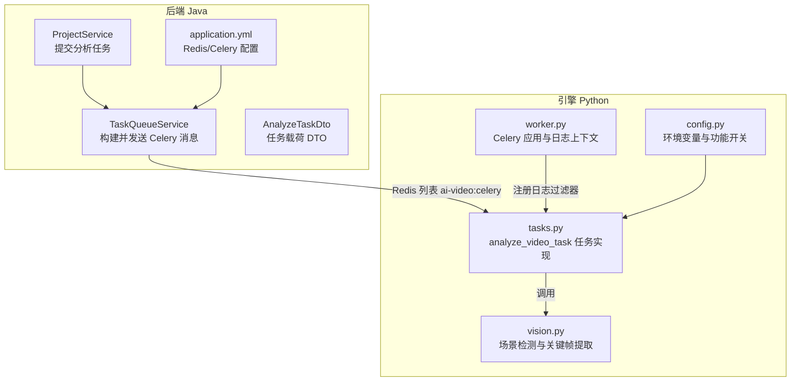
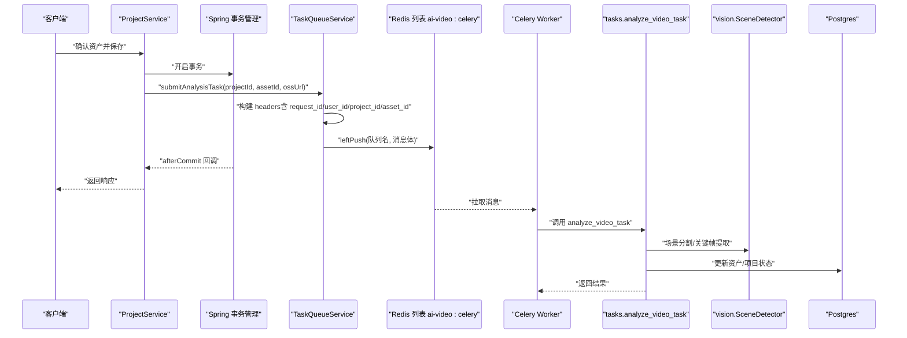
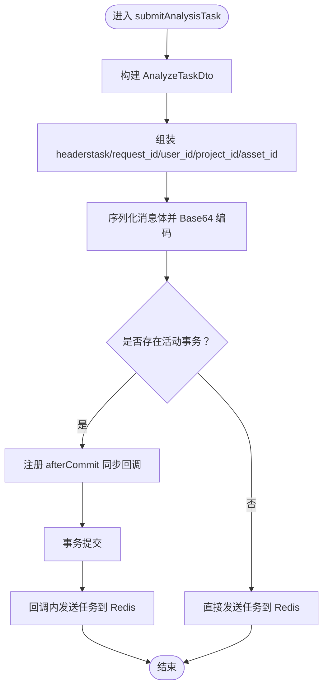
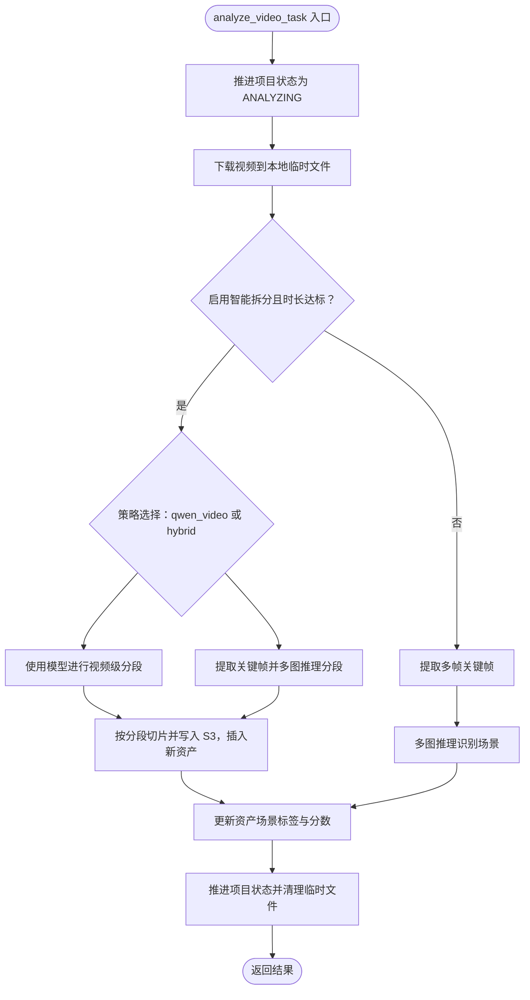
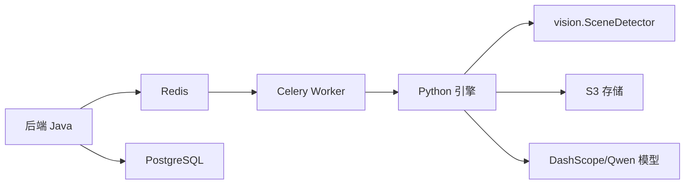

# 分析任务

<cite>
**本文引用的文件**
- [AnalyzeTaskDto.java](file://backend/src/main/java/com/aiscene/dto/AnalyzeTaskDto.java)
- [TaskQueueService.java](file://backend/src/main/java/com/aiscene/service/TaskQueueService.java)
- [ProjectService.java](file://backend/src/main/java/com/aiscene/service/ProjectService.java)
- [tasks.py](file://engine/tasks.py)
- [vision.py](file://engine/vision.py)
- [worker.py](file://engine/worker.py)
- [config.py](file://engine/config.py)
- [application.yml](file://backend/src/main/resources/application.yml)
- [V3__add_error_fields_to_projects.sql](file://backend/src/main/resources/db/migration/V3__add_error_fields_to_projects.sql)
- [TaskQueueServiceTest.java](file://backend/src/test/java/com/aiscene/service/TaskQueueServiceTest.java)
</cite>

## 目录
1. [简介](#简介)
2. [项目结构](#项目结构)
3. [核心组件](#核心组件)
4. [架构总览](#架构总览)
5. [详细组件分析](#详细组件分析)
6. [依赖关系分析](#依赖关系分析)
7. [性能考量](#性能考量)
8. [故障排查指南](#故障排查指南)
9. [结论](#结论)

## 简介
本文件围绕后端如何通过 Celery 队列提交视频分析任务展开，重点说明：
- submitAnalysisTask 方法如何将分析任务写入 Redis 队列；
- AnalyzeTaskDto 数据传输对象的结构与职责；
- 视觉识别流程（场景分割与关键帧提取）由 Python 引擎的 vision.py 和 tasks.py 触发；
- 事务同步机制（TransactionSynchronization）确保数据库持久化后再发送任务；
- 任务头中附加上下文（如 request_id）的调试价值；
- 常见失败场景（Redis 连接异常、序列化错误）的排查方法。

## 项目结构
后端采用 Spring Boot，使用 Redis 作为 Celery 的消息中间件；Python 引擎负责实际的视频分析与渲染任务。关键文件分布如下：
- 后端 Java 层：DTO、服务层、配置与测试
- 引擎 Python 层：任务定义、视觉识别、工作进程与配置

图表来源
- [ProjectService.java](file://backend/src/main/java/com/aiscene/service/ProjectService.java#L49-L84)
- [TaskQueueService.java](file://backend/src/main/java/com/aiscene/service/TaskQueueService.java#L32-L62)
- [AnalyzeTaskDto.java](file://backend/src/main/java/com/aiscene/dto/AnalyzeTaskDto.java#L1-L17)
- [application.yml](file://backend/src/main/resources/application.yml#L30-L66)
- [worker.py](file://engine/worker.py#L1-L43)
- [tasks.py](file://engine/tasks.py#L646-L790)
- [vision.py](file://engine/vision.py#L1-L298)
- [config.py](file://engine/config.py#L1-L46)

章节来源
- [ProjectService.java](file://backend/src/main/java/com/aiscene/service/ProjectService.java#L49-L84)
- [TaskQueueService.java](file://backend/src/main/java/com/aiscene/service/TaskQueueService.java#L32-L62)
- [application.yml](file://backend/src/main/resources/application.yml#L30-L66)

## 核心组件
- AnalyzeTaskDto：封装一次视频分析任务所需的最小必要字段，用于跨语言传递。
- TaskQueueService：负责将任务序列化为 Celery 消息体，写入 Redis 队列，并在事务提交后异步发送。
- ProjectService：业务入口，在资产确认后调用 TaskQueueService 提交分析任务。
- tasks.analyze_video_task：Python 引擎的任务实现，负责下载视频、场景分割、关键帧提取、更新数据库状态等。
- vision.SceneDetector：提供场景检测、关键帧提取、多图推理等能力。
- worker.py：Celery 应用初始化与日志上下文注入（request_id、user_id、task_id）。
- config.py：统一读取环境变量，控制功能开关与模型参数。

章节来源
- [AnalyzeTaskDto.java](file://backend/src/main/java/com/aiscene/dto/AnalyzeTaskDto.java#L1-L17)
- [TaskQueueService.java](file://backend/src/main/java/com/aiscene/service/TaskQueueService.java#L32-L62)
- [ProjectService.java](file://backend/src/main/java/com/aiscene/service/ProjectService.java#L49-L84)
- [tasks.py](file://engine/tasks.py#L646-L790)
- [vision.py](file://engine/vision.py#L1-L298)
- [worker.py](file://engine/worker.py#L1-L43)
- [config.py](file://engine/config.py#L1-L46)

## 架构总览
下面的时序图展示了从资产确认到分析任务入队、再到 Python 引擎执行的完整链路。

图表来源
- [ProjectService.java](file://backend/src/main/java/com/aiscene/service/ProjectService.java#L49-L84)
- [TaskQueueService.java](file://backend/src/main/java/com/aiscene/service/TaskQueueService.java#L32-L62)
- [TaskQueueService.java](file://backend/src/main/java/com/aiscene/service/TaskQueueService.java#L109-L179)
- [tasks.py](file://engine/tasks.py#L646-L790)
- [vision.py](file://engine/vision.py#L1-L298)

## 详细组件分析

### AnalyzeTaskDto 数据传输对象
- 字段含义
  - project_id：项目唯一标识，用于后续状态推进与错误回写。
  - asset_id：资产唯一标识，用于定位具体视频资源并更新其场景标签与分数。
  - video_url：视频访问地址，支持 HTTP(S) 或本地文件协议（file://）。
- 作用
  - 作为任务载荷的最小载体，被序列化后通过 Celery 发送到 Python 引擎。
  - 在任务头中额外附带 project_id、asset_id，便于日志追踪与错误回写。

章节来源
- [AnalyzeTaskDto.java](file://backend/src/main/java/com/aiscene/dto/AnalyzeTaskDto.java#L1-L17)
- [TaskQueueService.java](file://backend/src/main/java/com/aiscene/service/TaskQueueService.java#L32-L62)

### submitAnalysisTask 方法与事务同步机制
- 关键行为
  - 构建 AnalyzeTaskDto 并设置任务头（headers）：包含 task 名称、request_id、user_id、project_id、asset_id 等。
  - 使用 ObjectMapper 将参数打包为 Celery 消息体，Base64 编码后写入 Redis 列表队列。
  - 若当前存在活动事务，则通过 TransactionSynchronizationManager 注册 afterCommit 回调，确保数据库持久化成功后再发送任务，避免“先发任务后入库”的竞态问题。
- 头部上下文的价值
  - request_id：贯穿请求链路的日志追踪 ID，便于跨服务串联日志。
  - user_id：用户标识，便于审计与统计。
  - project_id/asset_id：任务维度的业务上下文，便于 Python 侧快速定位资源与状态推进。

图表来源
- [TaskQueueService.java](file://backend/src/main/java/com/aiscene/service/TaskQueueService.java#L32-L62)
- [TaskQueueService.java](file://backend/src/main/java/com/aiscene/service/TaskQueueService.java#L109-L179)

章节来源
- [TaskQueueService.java](file://backend/src/main/java/com/aiscene/service/TaskQueueService.java#L32-L62)
- [TaskQueueService.java](file://backend/src/main/java/com/aiscene/service/TaskQueueService.java#L109-L179)

### 视频分析任务在 Python 引擎中的执行
- 任务入口：tasks.analyze_video_task
- 执行步骤
  - 下载视频（支持 HTTP 与本地 file:// 协议）
  - 场景分割策略
    - 当启用智能拆分且时长满足阈值时，优先使用模型进行视频级分段（qwen_video）或基于场景检测的混合策略（hybrid）。
    - 混合策略会提取关键帧并使用多图推理得到分段，随后调用 split 逻辑将原视频切分为多个片段并写入 S3，再更新资产表。
  - 回退策略：若无有效分段，提取多帧关键帧并进行单帧场景识别，更新资产的 scene_label 与 scene_score。
  - 更新项目状态（ANALYZING/REVIEW/FAILED），并在失败时记录 request_id、task_id、错误步骤等信息。
- 视觉识别能力：vision.SceneDetector 提供场景检测、关键帧提取、多图推理等接口。

图表来源
- [tasks.py](file://engine/tasks.py#L646-L790)
- [vision.py](file://engine/vision.py#L1-L298)

章节来源
- [tasks.py](file://engine/tasks.py#L646-L790)
- [vision.py](file://engine/vision.py#L1-L298)

### 日志上下文与调试价值
- 上下文注入：worker.py 通过 contextvars 注入 request_id、user_id、task_id，并在日志过滤器中透出到日志字段。
- 任务头携带：TaskQueueService 在发送消息前将 request_id、user_id、project_id、asset_id 写入 headers，便于 Python 侧读取。
- 调试价值
  - 通过 request_id 可在后端、Redis、Celery Worker、Python 日志中串联同一次请求的全链路日志。
  - 通过 user_id 可区分不同用户的任务流。
  - 通过 project_id/asset_id 可快速定位业务实体。

章节来源
- [worker.py](file://engine/worker.py#L1-L43)
- [TaskQueueService.java](file://backend/src/main/java/com/aiscene/service/TaskQueueService.java#L125-L139)
- [TaskQueueServiceTest.java](file://backend/src/test/java/com/aiscene/service/TaskQueueServiceTest.java#L33-L62)

## 依赖关系分析
- 后端依赖
  - Redis：作为 Celery 消息中间件，队列名为 ai-video:celery。
  - PostgreSQL：存储项目与资产元数据，失败信息字段在迁移脚本中新增。
- 引擎依赖
  - DashScope/Qwen 多模态模型：用于视频/图像理解。
  - S3：用于上传切片视频并生成公开 URL。
  - OpenCV/FFmpeg/MoviePy：用于视频读取、裁剪与编码。
- 配置
  - application.yml：Redis 连接、Celery 队列名、S3 存储等。
  - config.py：读取环境变量，控制智能拆分、阈值、模型参数等。

图表来源
- [application.yml](file://backend/src/main/resources/application.yml#L30-L66)
- [config.py](file://engine/config.py#L1-L46)
- [tasks.py](file://engine/tasks.py#L646-L790)
- [vision.py](file://engine/vision.py#L1-L298)

章节来源
- [application.yml](file://backend/src/main/resources/application.yml#L30-L66)
- [config.py](file://engine/config.py#L1-L46)
- [V3__add_error_fields_to_projects.sql](file://backend/src/main/resources/db/migration/V3__add_error_fields_to_projects.sql#L1-L5)

## 性能考量
- 智能拆分策略
  - qwen_video：适合长视频的整体分段，减少后续处理成本。
  - hybrid：对短视频更稳健，结合场景检测与关键帧推理。
- 关键帧提取
  - 控制关键帧数量与缩放尺寸，降低上传与推理开销。
- 视频切片
  - MoviePy 写入时可选择无音频回退路径，保证可用性。
- 日志与追踪
  - 通过 headers 与日志上下文，快速定位瓶颈与异常点。

[本节为通用指导，无需列出具体文件来源]

## 故障排查指南
- Redis 连接异常
  - 现象：任务未入队，后端抛出序列化异常或无法写入 Redis。
  - 排查要点：
    - 检查 application.yml 中 spring.data.redis.url 是否正确。
    - 确认 Redis 服务可达，网络与认证配置无误。
    - 查看 TaskQueueService 的序列化与写队列日志。
- 序列化错误
  - 现象：JsonProcessingException，任务无法发送。
  - 排查要点：
    - 检查 AnalyzeTaskDto 字段是否可序列化（不可变、非循环引用）。
    - 检查 ObjectMapper 配置与版本兼容性。
- Python 模型调用失败
  - 现象：analyze_video_task 抛出异常并标记项目为 FAILED。
  - 排查要点：
    - 检查 DASHSCOPE_API_KEY、QWEN_VIDEO_MODEL、QWEN_IMAGE_MODEL 等环境变量。
    - 检查 S3 公网 URL、鉴权与桶权限。
    - 查看 Python 日志中的 error_log、error_request_id、error_step。
- 数据库状态不一致
  - 现象：项目状态未推进或错误信息缺失。
  - 排查要点：
    - 确认事务已提交后再发送任务（TransactionSynchronization）。
    - 检查 V3__add_error_fields_to_projects.sql 是否执行。
    - 查看 _set_project_failed 的回写字段是否正确。

章节来源
- [TaskQueueService.java](file://backend/src/main/java/com/aiscene/service/TaskQueueService.java#L171-L179)
- [application.yml](file://backend/src/main/resources/application.yml#L30-L66)
- [config.py](file://engine/config.py#L1-L46)
- [tasks.py](file://engine/tasks.py#L418-L462)
- [V3__add_error_fields_to_projects.sql](file://backend/src/main/resources/db/migration/V3__add_error_fields_to_projects.sql#L1-L5)

## 结论
- submitAnalysisTask 通过 DTO 与任务头将最小必要的业务上下文传递给 Python 引擎，确保任务可追踪、可观测。
- 事务同步机制保障了“先入库后发任务”的一致性，避免竞态导致的数据不一致。
- Python 引擎在 analyze_video_task 中实现了灵活的场景分割与关键帧提取策略，并在失败时回写项目状态与错误上下文。
- 通过 headers 与日志上下文（request_id、user_id、project_id、asset_id），可实现端到端的调试与排障。