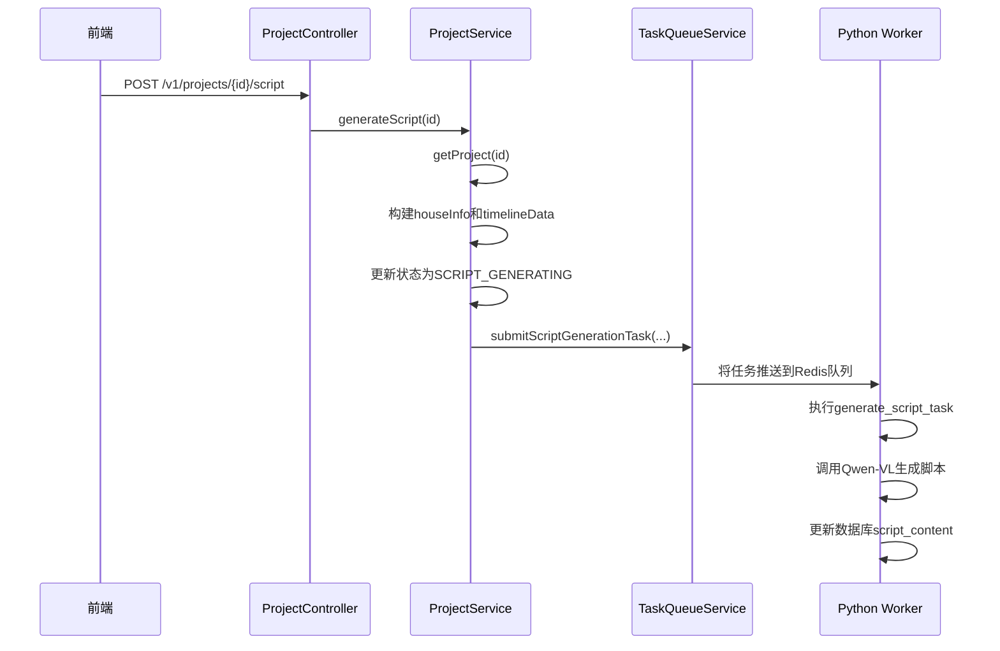
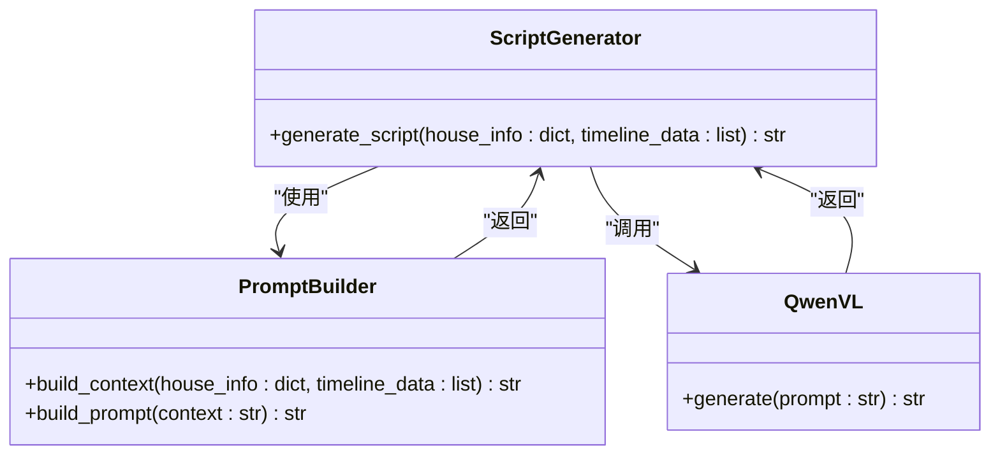

# 脚本生成任务

<cite>
**本文档引用的文件**  
- [ProjectController.java](file://backend/src/main/java/com/aiscene/controller/ProjectController.java)
- [ProjectService.java](file://backend/src/main/java/com/aiscene/service/ProjectService.java)
- [TaskQueueService.java](file://backend/src/main/java/com/aiscene/service/TaskQueueService.java)
- [script_gen.py](file://engine/script_gen.py)
- [tasks.py](file://engine/tasks.py)
- [Project.java](file://backend/src/main/java/com/aiscene/entity/Project.java)
- [application.yml](file://backend/src/main/resources/application.yml)
</cite>

## 目录
1. [脚本生成任务流程](#脚本生成任务流程)
2. [参数传递机制](#参数传递机制)
3. [Qwen-VL大模型脚本生成原理](#qwen-vl大模型脚本生成原理)
4. [任务ID与前端状态追踪](#任务id与前端状态追踪)
5. [JSON序列化风险与ObjectMapper配置](#json序列化风险与objectmapper配置)
6. [开发者集成路径](#开发者集成路径)

## 脚本生成任务流程

脚本生成任务的完整流程始于前端调用`/v1/projects/{id}/script`的POST请求，该请求由`ProjectController.generateScript`方法处理。此方法调用`ProjectService.generateScript`服务方法，该方法负责准备必要的数据并提交脚本生成任务。

在`ProjectService.generateScript`中，首先通过`getProject`方法获取指定ID的项目实体。接着，从项目中提取`houseInfo`元数据，并将项目关联的资产（视频片段）转换为一个包含场景标签、时长和ID的`timelineData`列表。随后，项目状态被更新为`SCRIPT_GENERATING`并持久化到数据库。最后，`TaskQueueService.submitScriptGenerationTask`被调用，将任务提交到Celery消息队列。



**Diagram sources**
- [ProjectController.java](file://backend/src/main/java/com/aiscene/controller/ProjectController.java#L155-L165)
- [ProjectService.java](file://backend/src/main/java/com/aiscene/service/ProjectService.java#L143-L165)
- [TaskQueueService.java](file://backend/src/main/java/com/aiscene/service/TaskQueueService.java#L64-L74)
- [tasks.py](file://engine/tasks.py#L792-L817)

**Section sources**
- [ProjectController.java](file://backend/src/main/java/com/aiscene/controller/ProjectController.java#L155-L165)
- [ProjectService.java](file://backend/src/main/java/com/aiscene/service/ProjectService.java#L143-L165)

## 参数传递机制

`houseInfo`和`timelineData`参数的传递涉及Java后端和Python引擎之间的跨语言通信。`ProjectService.generateScript`方法首先将`Project`实体中的`houseInfo`字段（一个`JsonNode`对象）通过`ObjectMapper.convertValue`转换为一个通用的`Object`，这通常会生成一个`Map<String, Object>`结构。`timelineData`列表通过Java Stream API从`Asset`实体列表构建，每个资产被映射为一个包含`id`、`scene_label`、`duration`等键的`Map<String, Object>`。

`TaskQueueService.submitScriptGenerationTask`方法负责将这些Java对象序列化并发送到消息队列。它调用`sendCeleryTask`方法，该方法使用`ObjectMapper`将Java对象数组（包含`projectId`、`houseInfo`和`timelineData`）序列化为JSON字符串。这个JSON字符串随后被Base64编码，并作为Celery任务消息的`body`部分，通过`StringRedisTemplate`推送到名为`ai-video:celery`的Redis列表中。

在Python端，Celery Worker从Redis队列中消费该消息。消息的`body`部分被Base64解码并反序列化回一个元组，其中包含了传递的参数。`generate_script_task`函数接收这些参数，并将`houseInfo`和`timelineData`作为原生的Python `dict`和`list`对象进行处理，从而实现了从Java到Python的无缝数据传递。

```mermaid
flowchart TD
A[Java后端] --> B[ProjectService]
B --> C[提取houseInfo (JsonNode)]
B --> D[构建timelineData (List<Map>)]
C --> E[ObjectMapper.convertValue]
D --> E
E --> F[Object]
F --> G[TaskQueueService]
G --> H[sendCeleryTask]
H --> I[ObjectMapper.writeValueAsString]
I --> J[JSON字符串]
J --> K[Base64编码]
K --> L[Redis队列]
L --> M[Python Worker]
M --> N[Base64解码]
N --> O[JSON反序列化]
O --> P[houseInfo (dict)]
O --> Q[timelineData (list)]
P --> R[generate_script_task]
Q --> R
```

**Diagram sources**
- [ProjectService.java](file://backend/src/main/java/com/aiscene/service/ProjectService.java#L148-L159)
- [TaskQueueService.java](file://backend/src/main/java/com/aiscene/service/TaskQueueService.java#L69-L70)
- [tasks.py](file://engine/tasks.py#L792-L799)

**Section sources**
- [ProjectService.java](file://backend/src/main/java/com/aiscene/service/ProjectService.java#L143-L165)
- [TaskQueueService.java](file://backend/src/main/java/com/aiscene/service/TaskQueueService.java#L64-L74)

## Qwen-VL大模型脚本生成原理

Qwen-VL大模型通过`script_gen.py`文件中的`ScriptGenerator`类驱动，生成符合“温情生活风”风格的房产解说脚本。`generate_script`方法是核心，它接收`houseInfo`和`timelineData`作为输入。

生成过程分为三个阶段：
1.  **上下文构建**：方法首先将`houseInfo`字典和`timelineData`列表中的每个片段信息（包括场景标签、时长和建议字数）格式化为一个结构化的字符串。这个字符串作为大模型的上下文，确保模型了解房源的全部信息和视频的结构。
2.  **提示词工程**：一个精心设计的提示词（prompt）被构造，它包含角色设定（“专业的房产短视频解说达人”）、风格指南（“情感化”、“口语拟真”、“高级感”）和关键约束。最关键的约束是要求模型必须返回一个JSON数组，其中每个对象包含`asset_id`、`text`（解说词）、`visual_prompt`（视觉提示）和`audio_cue`（音效提示）。提示词还严格规定了每个片段的“建议字数”，以控制语速（约每秒4字）。
3.  **模型调用与后处理**：使用`dashscope.Generation.call` API调用`qwen-plus`模型。模型的响应经过后处理，移除可能的Markdown代码块标记（如```json），并尝试从响应中提取纯JSON部分。最终的JSON字符串被返回，其结构为`[{"asset_id": "...", "text": "...", "visual_prompt": "...", "audio_cue": "..."}, ...]`。



**Diagram sources**
- [script_gen.py](file://engine/script_gen.py#L12-L127)
- [tasks.py](file://engine/tasks.py#L798-L799)

**Section sources**
- [script_gen.py](file://engine/script_gen.py#L12-L127)

## 任务ID与前端状态追踪

任务ID是前端追踪脚本生成任务状态的关键。当`TaskQueueService.submitScriptGenerationTask`方法被调用时，它会生成一个`UUID.randomUUID().toString()`作为`taskId`。这个`taskId`被用作Celery任务的唯一标识符，并被记录在日志中。

`submitScriptGenerationTask`方法将这个生成的`taskId`直接返回给`ProjectService`，后者再将其返回给`ProjectController`。`ProjectController.generateScript`方法将这个`taskId`包含在HTTP响应体中，与`projectId`、当前状态和脚本内容（此时为空）一起返回给前端。

前端收到响应后，可以利用这个`taskId`和`projectId`进行状态轮询。例如，前端可以定期调用`GET /v1/projects/{id}`或`GET /v1/projects/{id}/script`来检查项目状态是否已从`SCRIPT_GENERATING`变为`SCRIPT_GENERATED`，并获取最终生成的脚本内容。这种机制允许前端提供实时的进度反馈，而无需阻塞用户界面。

**Section sources**
- [TaskQueueService.java](file://backend/src/main/java/com/aiscene/service/TaskQueueService.java#L111)
- [ProjectController.java](file://backend/src/main/java/com/aiscene/controller/ProjectController.java#L157-L164)

## JSON序列化风险与ObjectMapper配置

在`TaskQueueService.sendCeleryTask`方法中，将包含复杂对象（如`houseInfo`和`timelineData`）的Java对象列表序列化为JSON时存在潜在风险。主要风险包括：
1.  **循环引用**：如果`houseInfo`或`timelineData`中的对象存在循环引用，标准的`ObjectMapper`会抛出`JsonMappingException`。
2.  **不可序列化类型**：如果对象包含`InputStream`、`Thread`或其他无法转换为JSON基本类型的对象，序列化会失败。
3.  **精度丢失**：对于`float`或`double`类型的时长数据，可能存在精度问题。

为了应对这些风险，代码库依赖于Spring Boot的默认`ObjectMapper`配置。虽然代码中没有显式配置，但`pom.xml`文件引入了`spring-boot-starter-web`依赖，它会自动配置一个`ObjectMapper` Bean。这个默认配置通常包含`SerializationFeature.FAIL_ON_EMPTY_BEANS`为`false`和`DeserializationFeature.FAIL_ON_UNKNOWN_PROPERTIES`为`false`等安全设置，这有助于处理一些边缘情况。然而，对于循环引用，最安全的实践是确保`houseInfo`和`timelineData`的数据结构是扁平的、无循环的POJO或`Map`，这在当前的实现中通过使用`Map<String, Object>`和`JsonNode`得到了保证。

**Section sources**
- [TaskQueueService.java](file://backend/src/main/java/com/aiscene/service/TaskQueueService.java#L149)
- [ProjectService.java](file://backend/src/main/java/com/aiscene/service/ProjectService.java#L148-L159)
- [pom.xml](file://backend/pom.xml#L31-L122)

## 开发者集成路径

开发者可以通过以下路径修改脚本提示词或扩展输入元数据：
1.  **修改提示词**：直接编辑`engine/script_gen.py`文件中的`prompt`字符串。可以调整`# Style Guidelines`和`# Critical Constraints`部分来改变文案风格、语速或输出格式。
2.  **扩展输入元数据**：在`Project`实体的`houseInfo`字段中添加新的键值对。由于`houseInfo`是`JsonNode`类型，它可以存储任意JSON结构。然后，在`script_gen.py`的`generate_script`方法中，修改上下文构建逻辑，将新字段包含在传递给大模型的上下文中。
3.  **扩展timelineData**：在`ProjectService.generateScript`方法中，向`timelineData`的`Map`中添加新的键（例如`camera_angle`或`lighting`），这些信息可以从`Asset`实体中获取。然后在`script_gen.py`的提示词中引用这些新字段。

**Section sources**
- [script_gen.py](file://engine/script_gen.py#L33-L88)
- [Project.java](file://backend/src/main/java/com/aiscene/entity/Project.java#L36-L39)
- [ProjectService.java](file://backend/src/main/java/com/aiscene/service/ProjectService.java#L150-L159)