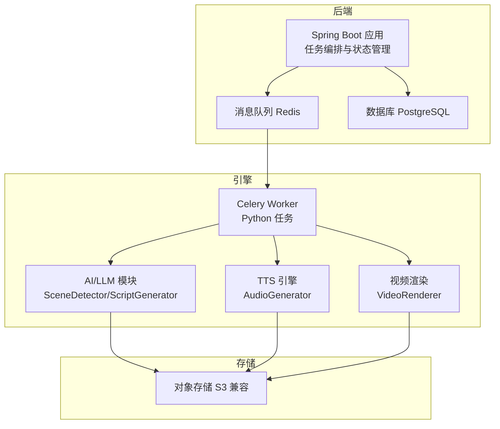
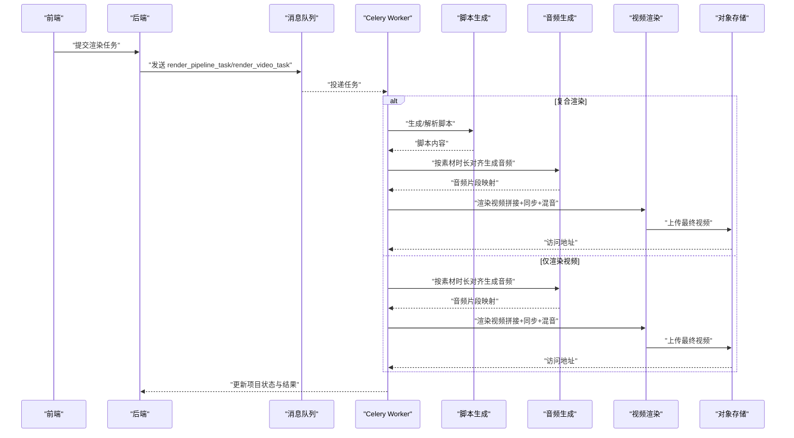
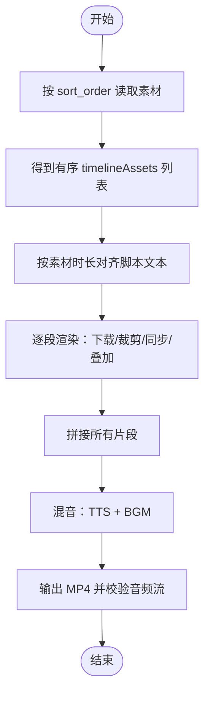
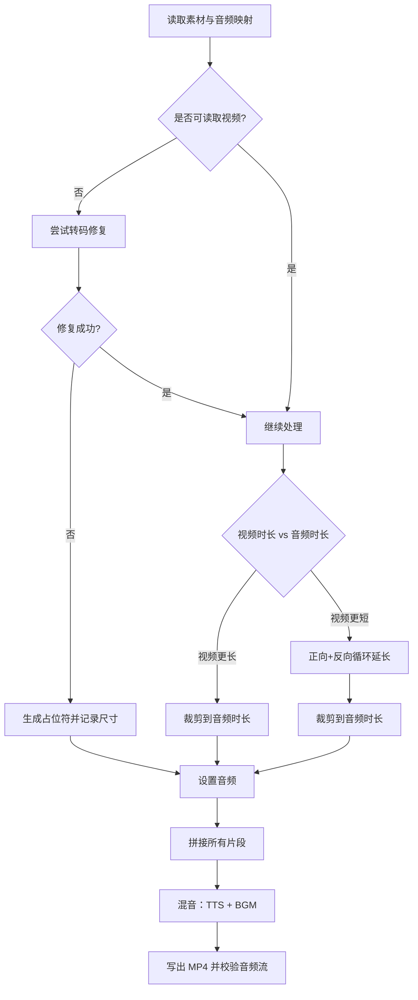
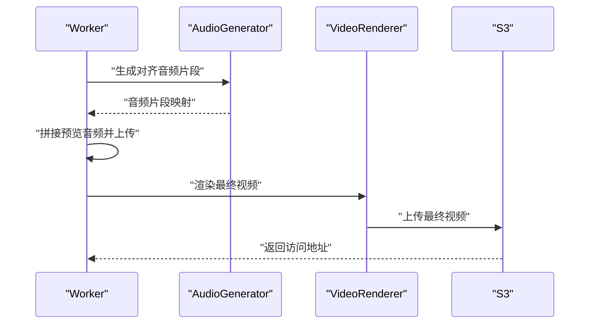
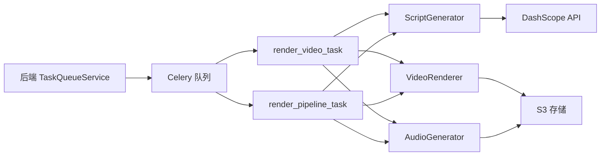

# 视频渲染任务

<cite>
**本文引用的文件**
- [engine/tasks.py](file://engine/tasks.py)
- [engine/video_render.py](file://engine/video_render.py)
- [engine/audio_gen.py](file://engine/audio_gen.py)
- [engine/script_gen.py](file://engine/script_gen.py)
- [engine/config.py](file://engine/config.py)
- [backend/src/main/java/com/aiscene/service/TaskQueueService.java](file://backend/src/main/java/com/aiscene/service/TaskQueueService.java)
- [backend/src/main/java/com/aiscene/entity/RenderJob.java](file://backend/src/main/java/com/aiscene/entity/RenderJob.java)
- [docs/Technical_Architecture.md](file://docs/Technical_Architecture.md)
- [integration_test.py](file://integration_test.py)
</cite>

## 目录
1. [引言](#引言)
2. [项目结构](#项目结构)
3. [核心组件](#核心组件)
4. [架构总览](#架构总览)
5. [详细组件分析](#详细组件分析)
6. [依赖关系分析](#依赖关系分析)
7. [性能考量](#性能考量)
8. [故障排查指南](#故障排查指南)
9. [结论](#结论)
10. [附录](#附录)

## 引言
本文件系统性阐述两类视频渲染任务：submitRenderVideoTask 与 submitRenderPipelineTask 的差异与适用场景；timelineAssets 结构如何定义视频剪辑顺序、转场效果与视觉元素叠加；FFmpeg 如何依据任务指令执行视频合成（分辨率适配、音频同步、字幕嵌入等）；render_pipeline_task 作为复合任务如何协调脚本、音频与视频素材的一体化处理；以及渲染任务资源消耗监控与超时处理机制配置建议。

## 项目结构
- 后端（Spring Boot）负责业务编排与状态管理，通过消息队列向 Python 引擎下发任务。
- 引擎（Python/Celery）负责 AI 分析、脚本生成、TTS、视频渲染与上传。
- 前端负责素材上传、时间轴排序与预览。

图表来源
- [docs/Technical_Architecture.md](file://docs/Technical_Architecture.md#L1-L180)
- [backend/src/main/java/com/aiscene/service/TaskQueueService.java](file://backend/src/main/java/com/aiscene/service/TaskQueueService.java#L87-L107)

章节来源
- [docs/Technical_Architecture.md](file://docs/Technical_Architecture.md#L1-L180)

## 核心组件
- 任务编排与提交
  - 后端通过消息队列提交两类渲染任务：render_video_task 与 render_pipeline_task。
  - 提交入口分别对应“仅渲染视频”和“脚本→音频→视频一体化渲染”。

- 时间轴与素材
  - timelineAssets 由后端按 sort_order 排序后传入引擎，引擎据此拼接视频片段。
  - 每个素材包含 id、oss_url、duration、scene_label 等字段，用于脚本对齐与时长预算。

- 脚本生成
  - ScriptGenerator 基于房源信息与时间轴数据生成结构化 JSON，包含每段的文本、视觉提示与音效建议。

- 音频生成
  - AudioGenerator 将脚本按素材时长进行对齐与切分，生成与视频时长严格匹配的音频片段，并支持 SSML 与情感停顿分布。

- 视频渲染
  - VideoRenderer 按 timelineAssets 顺序拼接视频，自动进行分辨率适配、音频同步（弹性匹配）、背景音乐混合与输出校验。

章节来源
- [backend/src/main/java/com/aiscene/service/TaskQueueService.java](file://backend/src/main/java/com/aiscene/service/TaskQueueService.java#L87-L107)
- [engine/tasks.py](file://engine/tasks.py#L821-L904)
- [engine/script_gen.py](file://engine/script_gen.py#L1-L129)
- [engine/audio_gen.py](file://engine/audio_gen.py#L729-L821)
- [engine/video_render.py](file://engine/video_render.py#L233-L448)

## 架构总览
两类渲染任务的差异与适用场景

- submitRenderVideoTask（仅渲染视频）
  - 适用场景：已有脚本与音频，仅需将素材按时间轴拼接并导出视频。
  - 流程：后端提交 render_video_task，引擎重新解析脚本、对齐音频、渲染视频并上传。
  - 优点：流程简洁，适合“素材已就绪”的快速出片。

- submitRenderPipelineTask（复合渲染）
  - 适用场景：从脚本生成到音频再到视频的一体化流水线，便于预览与质量把控。
  - 流程：后端提交 render_pipeline_task，引擎先生成/对齐音频并生成预览，再渲染最终视频并上传。
  - 优点：可先出音频预览，便于审阅与调整，再进行最终视频渲染。

图表来源
- [backend/src/main/java/com/aiscene/service/TaskQueueService.java](file://backend/src/main/java/com/aiscene/service/TaskQueueService.java#L87-L107)
- [engine/tasks.py](file://engine/tasks.py#L978-L1061)
- [engine/tasks.py](file://engine/tasks.py#L1063-L1164)

章节来源
- [backend/src/main/java/com/aiscene/service/TaskQueueService.java](file://backend/src/main/java/com/aiscene/service/TaskQueueService.java#L87-L107)
- [engine/tasks.py](file://engine/tasks.py#L978-L1061)
- [engine/tasks.py](file://engine/tasks.py#L1063-L1164)

## 详细组件分析

### timelineAssets 结构与视频剪辑顺序
- 排序依据：后端按 sort_order 升序排列，确保素材顺序与用户在前端的时间轴一致。
- 字段要点：
  - id：素材唯一标识，用于音频对齐与结果映射。
  - oss_url：素材地址（支持 S3 公共 URL 或本地协议）。
  - duration：素材时长（秒），用于脚本对齐与音频弹性匹配。
  - scene_label：场景标签，用于脚本生成与可视化提示。
- 转场与叠加：
  - 当前实现未显式插入转场效果；视频拼接采用 MoviePy 的 compose 方式，无内置转场参数。
  - 视觉增强：全局暖色调滤镜应用于每段视频，体现“温情生活风格”。

图表来源
- [engine/tasks.py](file://engine/tasks.py#L821-L904)
- [engine/video_render.py](file://engine/video_render.py#L233-L448)

章节来源
- [engine/tasks.py](file://engine/tasks.py#L821-L904)
- [engine/video_render.py](file://engine/video_render.py#L233-L448)

### FFmpeg 执行与合成细节
- 分辨率适配
  - 若素材高度非 720p，则统一缩放至 720p 高度；若存在占位符，会在首个可用素材尺寸确定后批量重设占位符尺寸。
- 音频同步（弹性匹配）
  - 以音频为主时基：当视频较长则裁剪，当视频较短则通过正向+反向循环（boomerang）延长，最后裁剪到精确时长。
  - 若视频无法读取，尝试转码修复后再拼接；否则生成黑屏占位符并记录占位。
- 背景音乐混合
  - BGM 时长不足时循环至视频长度，音量降低至 15%，与 TTS 音轨混合。
- 输出校验
  - 写出 MP4 后通过 ffprobe 检查是否存在音频流，确保成品可用。

图表来源
- [engine/video_render.py](file://engine/video_render.py#L273-L431)

章节来源
- [engine/video_render.py](file://engine/video_render.py#L273-L431)

### render_pipeline_task 作为复合任务
- 步骤分解
  - 解析脚本与素材，生成对齐音频片段并拼接为预览音频，上传并更新项目状态。
  - 进入渲染阶段，按相同逻辑渲染最终视频并上传。
- 优势
  - 可在音频预览阶段发现节奏问题，避免最终渲染后才发现时长不匹配。
  - 统一的错误处理与重试策略，提升稳定性。

图表来源
- [engine/tasks.py](file://engine/tasks.py#L1063-L1164)
- [engine/audio_gen.py](file://engine/audio_gen.py#L729-L821)

章节来源
- [engine/tasks.py](file://engine/tasks.py#L1063-L1164)
- [engine/audio_gen.py](file://engine/audio_gen.py#L729-L821)

### 资源消耗监控与超时处理建议
- 资源监控
  - CPU/内存：渲染阶段 CPU 占用高，建议限制并发队列大小与单任务超时阈值。
  - I/O：S3 上传与下载耗时可观，建议开启断点续传与多段上传（如支持）。
  - 存储：临时文件清理需确保异常路径也能回收。
- 超时与重试
  - 任务最大重试次数与指数退避已在任务装饰器中配置，建议结合队列限流与任务超时参数共同使用。
  - 对外部依赖（S3、TTS、FFmpeg）增加超时与失败降级策略。

章节来源
- [engine/tasks.py](file://engine/tasks.py#L646-L790)
- [engine/tasks.py](file://engine/tasks.py#L978-L1061)
- [engine/tasks.py](file://engine/tasks.py#L1063-L1164)

## 依赖关系分析
- 后端到引擎
  - 后端通过消息队列提交任务名称与参数，引擎侧 Celery 任务绑定相应函数。
- 引擎内部模块
  - 任务调度器依赖脚本生成器、音频生成器与视频渲染器。
  - 配置中心提供 API 密钥、存储与 TTS 参数。

图表来源
- [backend/src/main/java/com/aiscene/service/TaskQueueService.java](file://backend/src/main/java/com/aiscene/service/TaskQueueService.java#L87-L107)
- [engine/tasks.py](file://engine/tasks.py#L978-L1164)
- [engine/script_gen.py](file://engine/script_gen.py#L1-L129)
- [engine/audio_gen.py](file://engine/audio_gen.py#L729-L821)
- [engine/video_render.py](file://engine/video_render.py#L1-L120)

章节来源
- [backend/src/main/java/com/aiscene/service/TaskQueueService.java](file://backend/src/main/java/com/aiscene/service/TaskQueueService.java#L87-L107)
- [engine/tasks.py](file://engine/tasks.py#L978-L1164)
- [engine/script_gen.py](file://engine/script_gen.py#L1-L129)
- [engine/audio_gen.py](file://engine/audio_gen.py#L729-L821)
- [engine/video_render.py](file://engine/video_render.py#L1-L120)

## 性能考量
- 渲染性能
  - 使用 MoviePy 的 compose 拼接与 ffmpeg 写出，建议在资源允许时提高线程数与编码预设以平衡速度与质量。
  - 对于长视频，建议分段渲染后二次拼接，减少单次任务时长。
- 音频对齐
  - 严格按素材时长对齐脚本文本，避免 TTS 与画面不同步。
  - 使用 SSML 与停顿分布可提升自然度，但需注意字符长度限制。
- 存储与网络
  - 优先使用 S3 私有 URL 直接下载，减少中间层转发。
  - 上传完成后立即清理临时文件，避免磁盘压力。

## 故障排查指南
- 常见问题
  - 渲染后无音频流：检查写入阶段是否抛出异常，或 ffprobe 校验失败。
  - 占位符导致尺寸不一致：确认首个可用素材尺寸后，占位符会被重设。
  - 音频与视频不同步：检查弹性匹配逻辑是否生效，必要时调整素材时长或脚本文本。
- 日志与追踪
  - 任务头包含 request_id 与 user_id，便于跨服务定位。
  - 失败时记录错误日志与步骤，便于回溯。
- 集成测试
  - 提供音频流检测脚本，可在 CI 中验证最终产物。

章节来源
- [engine/video_render.py](file://engine/video_render.py#L417-L448)
- [integration_test.py](file://integration_test.py#L156-L199)
- [engine/tasks.py](file://engine/tasks.py#L418-L463)

## 结论
- submitRenderVideoTask 适用于“素材已就绪”的快速出片；submitRenderPipelineTask 更适合需要预览与质量把关的一体化流程。
- timelineAssets 通过 sort_order 严格定义顺序，配合脚本对齐与音频弹性匹配，保障最终成品的节奏与时长一致性。
- FFmpeg 在引擎侧承担了分辨率适配、音频同步与输出校验的关键职责，确保成品质量与稳定性。
- 建议在生产环境中完善资源监控、超时与重试策略，并在 CI 中加入音频流校验，持续保障渲染质量。

## 附录
- 关键配置项（示例）
  - TTS 引擎与音色、SSML 开关、语速与音量。
  - S3 存储区域、端点、桶名与公共 URL。
  - 智能拆分开关、策略与最小时长阈值。
- 数据模型要点
  - 项目状态机：DRAFT → UPLOADING → ANALYZING → REVIEW → RENDERING → COMPLETED/FAILED。
  - 渲染作业表用于追踪进度与错误日志。

章节来源
- [engine/config.py](file://engine/config.py#L1-L46)
- [backend/src/main/java/com/aiscene/entity/RenderJob.java](file://backend/src/main/java/com/aiscene/entity/RenderJob.java#L1-L32)
- [docs/Technical_Architecture.md](file://docs/Technical_Architecture.md#L68-L111)