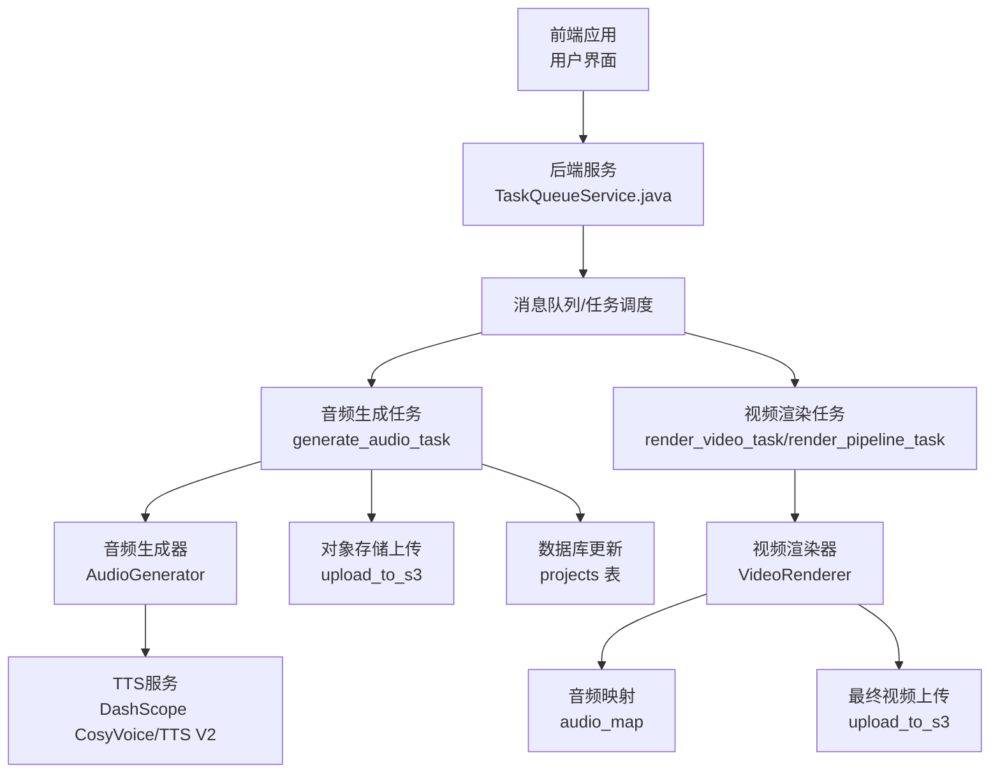
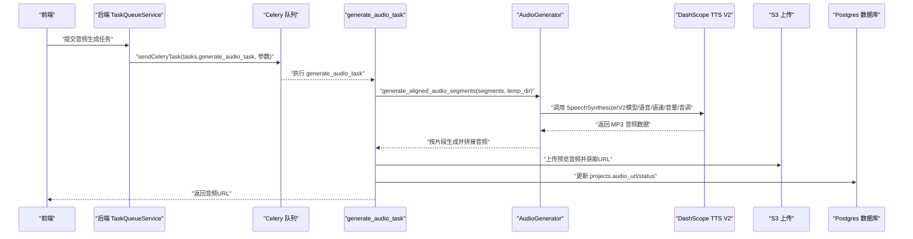
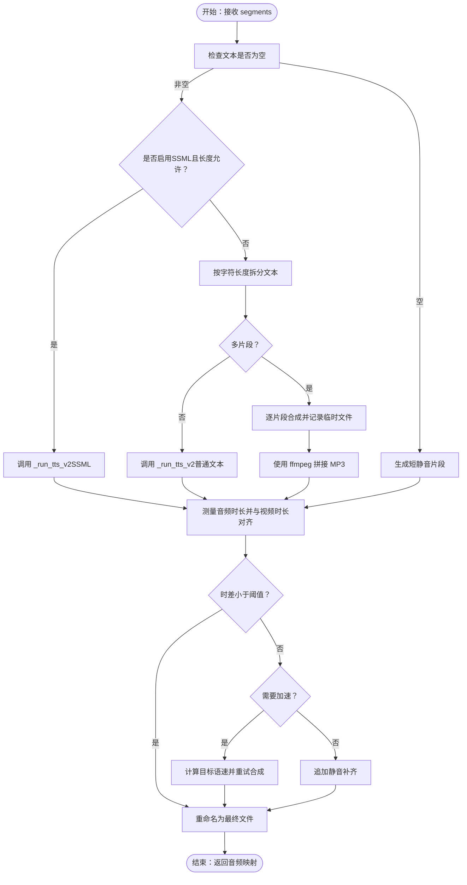
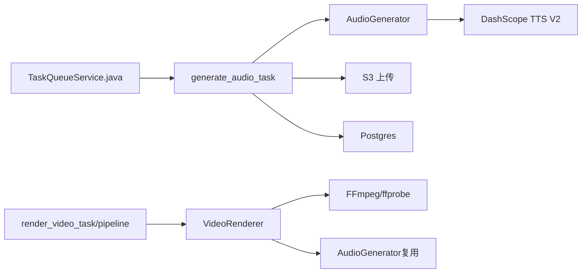

# 音频合成任务

<cite>
**本文引用的文件**
- [engine/tasks.py](file://engine/tasks.py)
- [engine/audio_gen.py](file://engine/audio_gen.py)
- [engine/config.py](file://engine/config.py)
- [engine/video_render.py](file://engine/video_render.py)
- [backend/src/main/java/com/aiscene/service/TaskQueueService.java](file://backend/src/main/java/com/aiscene/service/TaskQueueService.java)
- [integration_test.py](file://integration_test.py)
</cite>

## 目录
1. [简介](#简介)
2. [项目结构](#项目结构)
3. [核心组件](#核心组件)
4. [架构总览](#架构总览)
5. [详细组件分析](#详细组件分析)
6. [依赖关系分析](#依赖关系分析)
7. [性能考量](#性能考量)
8. [故障排查指南](#故障排查指南)
9. [结论](#结论)
10. [附录](#附录)

## 简介
本文件围绕“音频合成任务”的完整流程展开，重点说明如何将生成的文本脚本提交到TTS服务进行语音合成，涵盖以下要点：
- submitAudioGenerationTask 如何触发音频生成任务
- 与阿里云TTS（DashScope）及Edge TTS（CosyVoice）的集成方式
- 语音角色、语速、语调等参数的传递机制
- audioPath 在视频渲染流程中的关键作用
- Base64 编码与 UTF-8 字符集处理的重要性
- 合成失败时的降级策略与性能优化建议

## 项目结构
后端采用 Celery 异步任务队列，前端通过 Java 服务封装任务提交入口，引擎侧负责脚本生成、音频合成与视频渲染。

图表来源
- [backend/src/main/java/com/aiscene/service/TaskQueueService.java](file://backend/src/main/java/com/aiscene/service/TaskQueueService.java#L76-L85)
- [engine/tasks.py](file://engine/tasks.py#L906-L977)
- [engine/audio_gen.py](file://engine/audio_gen.py#L717-L911)
- [engine/video_render.py](file://engine/video_render.py#L233-L448)

章节来源
- [backend/src/main/java/com/aiscene/service/TaskQueueService.java](file://backend/src/main/java/com/aiscene/service/TaskQueueService.java#L76-L85)
- [engine/tasks.py](file://engine/tasks.py#L906-L977)

## 核心组件
- 任务提交入口：Java 后端通过 TaskQueueService 提交 generate_audio_task
- 任务执行：Celery 任务 generate_audio_task 调用 AudioGenerator 生成音频并上传
- 音频生成器：AudioGenerator 使用 DashScope TTS V2 接口，支持 SSML、语速、音量、音调等参数
- 视频渲染：VideoRenderer 将音频与视频片段对齐并合成最终视频，audioPath 即音频文件路径映射

章节来源
- [backend/src/main/java/com/aiscene/service/TaskQueueService.java](file://backend/src/main/java/com/aiscene/service/TaskQueueService.java#L76-L85)
- [engine/tasks.py](file://engine/tasks.py#L906-L977)
- [engine/audio_gen.py](file://engine/audio_gen.py#L717-L911)
- [engine/video_render.py](file://engine/video_render.py#L233-L448)

## 架构总览
下面的序列图展示了从提交音频生成任务到音频文件可用的关键交互：

图表来源
- [backend/src/main/java/com/aiscene/service/TaskQueueService.java](file://backend/src/main/java/com/aiscene/service/TaskQueueService.java#L76-L85)
- [engine/tasks.py](file://engine/tasks.py#L906-L977)
- [engine/audio_gen.py](file://engine/audio_gen.py#L717-L911)

## 详细组件分析

### submitAudioGenerationTask 的实现与调用链
- Java 后端通过 TaskQueueService.submitAudioGenerationTask 提交任务，携带 project_id 和 script_content
- Celery 任务 generate_audio_task 会解析脚本，按资产时长切分生成片段，调用 AudioGenerator 生成音频并上传，最后更新数据库状态

章节来源
- [backend/src/main/java/com/aiscene/service/TaskQueueService.java](file://backend/src/main/java/com/aiscene/service/TaskQueueService.java#L76-L85)
- [engine/tasks.py](file://engine/tasks.py#L906-L977)

### AudioGenerator 与 TTS 集成
- AudioGenerator 初始化时设置 DashScope API Key，并根据配置选择 TTS 引擎（cosyvoice/tts_v2）
- 生成流程：
  - 文本预处理：优先尝试 SSML（情感断句与停顿），否则按字符长度限制拆分
  - 调用 _run_tts_v2：内部重试、参数校验、Base64 解码、MP3 校验
  - 对齐与拼接：按视频片段时长生成音频，必要时插入静音或调整语速
  - 输出：每个片段生成独立 MP3，最终由上层任务拼接为预览音频

章节来源
- [engine/audio_gen.py](file://engine/audio_gen.py#L717-L911)
- [engine/audio_gen.py](file://engine/audio_gen.py#L921-L1011)
- [engine/audio_gen.py](file://engine/audio_gen.py#L1012-L1059)

### 语音角色、语速、语调参数传递机制
- 配置项：
  - TTS_ENGINE、TTS_MODEL、TTS_VOICE：决定使用的模型与语音
  - TTS_VOLUME：音量
  - TTS_SPEECH_RATE：语速
  - TTS_PITCH_RATE：音调
  - TTS_ENABLE_SSML：是否启用 SSML
- 传递路径：
  - AudioGenerator 读取配置，构造 SpeechSynthesizerV2 调用参数
  - _run_tts_v2 内部调用 _call_tts_v2_once，传入 model、voice、format、volume、speech_rate、pitch_rate
  - SSML 开关通过 enable_ssml 控制

章节来源
- [engine/config.py](file://engine/config.py#L37-L46)
- [engine/audio_gen.py](file://engine/audio_gen.py#L388-L432)
- [engine/audio_gen.py](file://engine/audio_gen.py#L921-L1011)

### audioPath 在视频渲染流程中的关键作用
- render_video_task/render_pipeline_task 会重新解析脚本并生成音频映射 audio_map（asset_id -> 本地音频路径）
- VideoRenderer.render_video 通过 audio_map 获取每个片段对应的音频文件路径 audio_path
- 渲染逻辑以音频为主时序，先匹配音频时长，再对视频进行裁剪或弹性循环扩展，确保音画同步
- 最终写入视频并校验音频流存在性

章节来源
- [engine/tasks.py](file://engine/tasks.py#L978-L1061)
- [engine/tasks.py](file://engine/tasks.py#L1064-L1148)
- [engine/video_render.py](file://engine/video_render.py#L233-L448)

### Base64 编码与 UTF-8 字符集处理的重要性
- Base64 处理：
  - _bytes_from_audio 支持从字符串音频数据中识别并解码 Base64
  - _maybe_decode_base64 提供通用的 Base64 解码入口，用于兼容不同来源的音频数据
- UTF-8 字符集：
  - ScriptGenerator 在构建上下文时使用 ensure_ascii=False，保证中文等非 ASCII 字符正确输出
  - DashScope 请求体使用 UTF-8 编码（请求体编码在底层库中处理）

章节来源
- [engine/audio_gen.py](file://engine/audio_gen.py#L169-L179)
- [engine/audio_gen.py](file://engine/audio_gen.py#L959-L971)
- [engine/script_gen.py](file://engine/script_gen.py#L18-L20)

### 任务提交过程中的错误分类与降级策略
- 错误分类：
  - _classify_tts_exception 将异常归类为无效参数、超时、网络错误、SDK 不兼容等
  - _is_invalid_parameter_error 识别参数非法错误，避免无意义重试
- 降级策略：
  - SSML 失败时自动回退到普通文本合成
  - 语速不匹配时按目标时长计算目标语速并重试
  - 无法生成有效音频时抛出明确错误，便于上层任务重试或回退

章节来源
- [engine/audio_gen.py](file://engine/audio_gen.py#L500-L522)
- [engine/audio_gen.py](file://engine/audio_gen.py#L557-L560)
- [engine/audio_gen.py](file://engine/audio_gen.py#L800-L886)

### 复杂逻辑流程图：音频生成与对齐

图表来源
- [engine/audio_gen.py](file://engine/audio_gen.py#L561-L635)
- [engine/audio_gen.py](file://engine/audio_gen.py#L800-L886)

## 依赖关系分析
- 组件耦合：
  - TaskQueueService 仅负责任务提交，与引擎模块通过 Celery 任务名解耦
  - generate_audio_task 依赖 AudioGenerator 与 S3 上传能力
  - VideoRenderer 依赖 MoviePy 与 FFmpeg 工具链，通过 audio_map 与音频生成结果解耦
- 外部依赖：
  - DashScope TTS V2 SDK（语音合成）
  - FFmpeg/ffprobe（音频/视频处理与校验）
  - Cloudflare R2/AWS S3（对象存储）

图表来源
- [backend/src/main/java/com/aiscene/service/TaskQueueService.java](file://backend/src/main/java/com/aiscene/service/TaskQueueService.java#L76-L85)
- [engine/tasks.py](file://engine/tasks.py#L906-L977)
- [engine/video_render.py](file://engine/video_render.py#L233-L448)

章节来源
- [backend/src/main/java/com/aiscene/service/TaskQueueService.java](file://backend/src/main/java/com/aiscene/service/TaskQueueService.java#L76-L85)
- [engine/tasks.py](file://engine/tasks.py#L906-L977)
- [engine/video_render.py](file://engine/video_render.py#L233-L448)

## 性能考量
- 文本切分与 SSML：
  - 优先使用 SSML 并控制长度，避免超限导致失败重试
  - 对长文本按标点拆分，减少单次请求压力
- 重试与退避：
  - _run_tts_v2 内部最多三次重试，带指数退避，降低瞬时错误影响
- 音频拼接：
  - 使用 ffmpeg 拼接多片段 MP3，避免重复解码/编码
- 渲染阶段：
  - 以音频为主时序，减少视频裁剪/循环次数
  - BGM 与 TTS 混音时统一音量，避免失真

章节来源
- [engine/audio_gen.py](file://engine/audio_gen.py#L921-L1011)
- [engine/audio_gen.py](file://engine/audio_gen.py#L249-L315)
- [engine/video_render.py](file://engine/video_render.py#L390-L415)

## 故障排查指南
- 常见错误类型与定位：
  - 无效参数：检查模型/语音组合是否匹配（如 vc-realtime 需克隆声线）
  - 超时/网络错误：检查 DashScope API Key 与网络连通性
  - SSML 过长：缩短文本或关闭 SSML
- 日志与诊断：
  - 任务日志包含 request_id、事件标签与关键参数，便于定位
  - render 阶段可使用 ffprobe 校验最终视频是否包含音频流
- 回退策略：
  - SSML 失败自动回退到普通文本
  - 语速不匹配时按目标时长计算目标语速并重试
  - 若仍失败，可在上层任务中使用默认音频模板兜底

章节来源
- [engine/audio_gen.py](file://engine/audio_gen.py#L500-L522)
- [engine/audio_gen.py](file://engine/audio_gen.py#L800-L886)
- [integration_test.py](file://integration_test.py#L156-L199)

## 结论
submitAudioGenerationTask 通过 Celery 任务链路，将脚本驱动的文本与视频片段时长对齐，借助 DashScope TTS V2 实现高质量语音合成，并在渲染阶段以音频为主时序完成音画同步。系统内置完善的错误分类、降级与重试机制，结合 FFmpeg 工具链与对象存储，形成稳定高效的端到端流水线。audioPath 在渲染阶段承担关键桥梁作用，确保每个片段的音频与视频精确对齐。

## 附录
- 关键参数一览
  - 引擎与模型：TTS_ENGINE、TTS_MODEL、TTS_VOICE
  - 语音属性：TTS_VOLUME、TTS_SPEECH_RATE、TTS_PITCH_RATE
  - SSML 开关：TTS_ENABLE_SSML
- 参考实现路径
  - 任务提交入口：[backend/src/main/java/com/aiscene/service/TaskQueueService.java](file://backend/src/main/java/com/aiscene/service/TaskQueueService.java#L76-L85)
  - 音频生成任务：[engine/tasks.py](file://engine/tasks.py#L906-L977)
  - 音频生成器与 TTS 调用：[engine/audio_gen.py](file://engine/audio_gen.py#L388-L432)
  - 渲染阶段音频对齐：[engine/video_render.py](file://engine/video_render.py#L292-L370)