# 上传流程

<cite>
**本文档引用的文件**
- [ProjectService.java](file://backend/src/main/java/com/aiscene/service/ProjectService.java)
- [StorageService.java](file://backend/src/main/java/com/aiscene/service/StorageService.java)
- [Asset.java](file://backend/src/main/java/com/aiscene/entity/Asset.java)
- [AssetRepository.java](file://backend/src/main/java/com/aiscene/repository/AssetRepository.java)
- [TaskQueueService.java](file://backend/src/main/java/com/aiscene/service/TaskQueueService.java)
- [ProjectController.java](file://backend/src/main/java/com/aiscene/controller/ProjectController.java)
- [PresignedUrlResponse.java](file://backend/src/main/java/com/aiscene/dto/PresignedUrlResponse.java)
- [AssetConfirmRequest.java](file://backend/src/main/java/com/aiscene/dto/AssetConfirmRequest.java)
- [S3StorageConfig.java](file://backend/src/main/java/com/aiscene/config/S3StorageConfig.java)
- [V5__add_storage_fields_to_assets.sql](file://backend/src/main/resources/db/migration/V5__add_storage_fields_to_assets.sql)
- [application.yml](file://backend/src/main/resources/application.yml)
</cite>

## 目录
1. [上传流程概述](#上传流程概述)
2. [预签名URL获取](#预签名url获取)
3. [素材上传(uploadAsset)](#素材上传uploadasset)
4. [素材确认(confirmAsset)](#素材确认confirmasset)
5. [用户标签更新(updateAsset)](#用户标签更新updateasset)
6. [核心实体与数据结构](#核心实体与数据结构)
7. [项目状态自动升级机制](#项目状态自动升级机制)
8. [AI分析任务触发](#ai分析任务触发)
9. [大文件上传支持](#大文件上传支持)
10. [存储权限配置](#存储权限配置)
11. [错误处理策略](#错误处理策略)

## 上传流程概述

本系统实现了完整的素材上传处理流程，包括预签名URL获取、文件上传、素材确认和用户标签更新等核心功能。上传流程通过ProjectService协调StorageService、AssetRepository和TaskQueueService等组件，确保文件安全存储、元数据持久化和后续AI分析任务的自动触发。

**Section sources**
- [ProjectService.java](file://backend/src/main/java/com/aiscene/service/ProjectService.java#L252-L318)
- [ProjectController.java](file://backend/src/main/java/com/aiscene/controller/ProjectController.java#L91-L103)

## 预签名URL获取

系统通过预签名URL机制实现安全的文件上传。前端首先调用`/v1/projects/{id}/assets/presign`接口获取预签名URL，然后直接将文件上传到对象存储，避免了通过后端中转大文件。

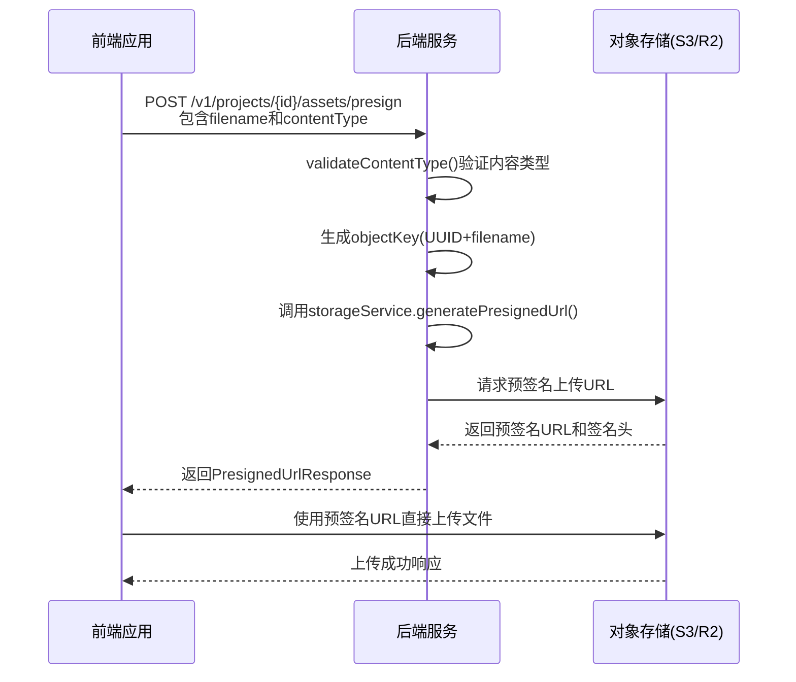

**Diagram sources**
- [ProjectController.java](file://backend/src/main/java/com/aiscene/controller/ProjectController.java#L73-L82)
- [StorageService.java](file://backend/src/main/java/com/aiscene/service/StorageService.java#L42-L69)

## 素材上传(uploadAsset)

`uploadAsset`方法是直接上传模式的核心处理逻辑，当文件较小或前端选择直接上传时使用。

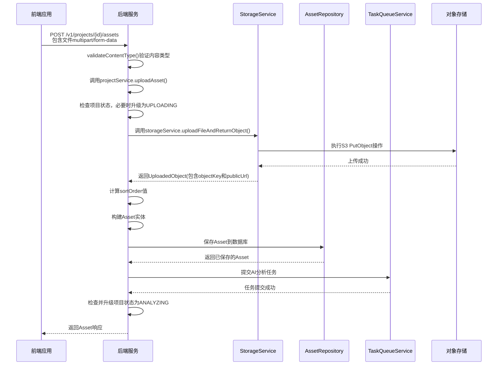

**Diagram sources**
- [ProjectService.java](file://backend/src/main/java/com/aiscene/service/ProjectService.java#L252-L283)
- [ProjectController.java](file://backend/src/main/java/com/aiscene/controller/ProjectController.java#L91-L96)

## 素材确认(confirmAsset)

`confirmAsset`方法用于预签名URL直传模式的确认流程，当文件已通过预签名URL直接上传到对象存储后调用。

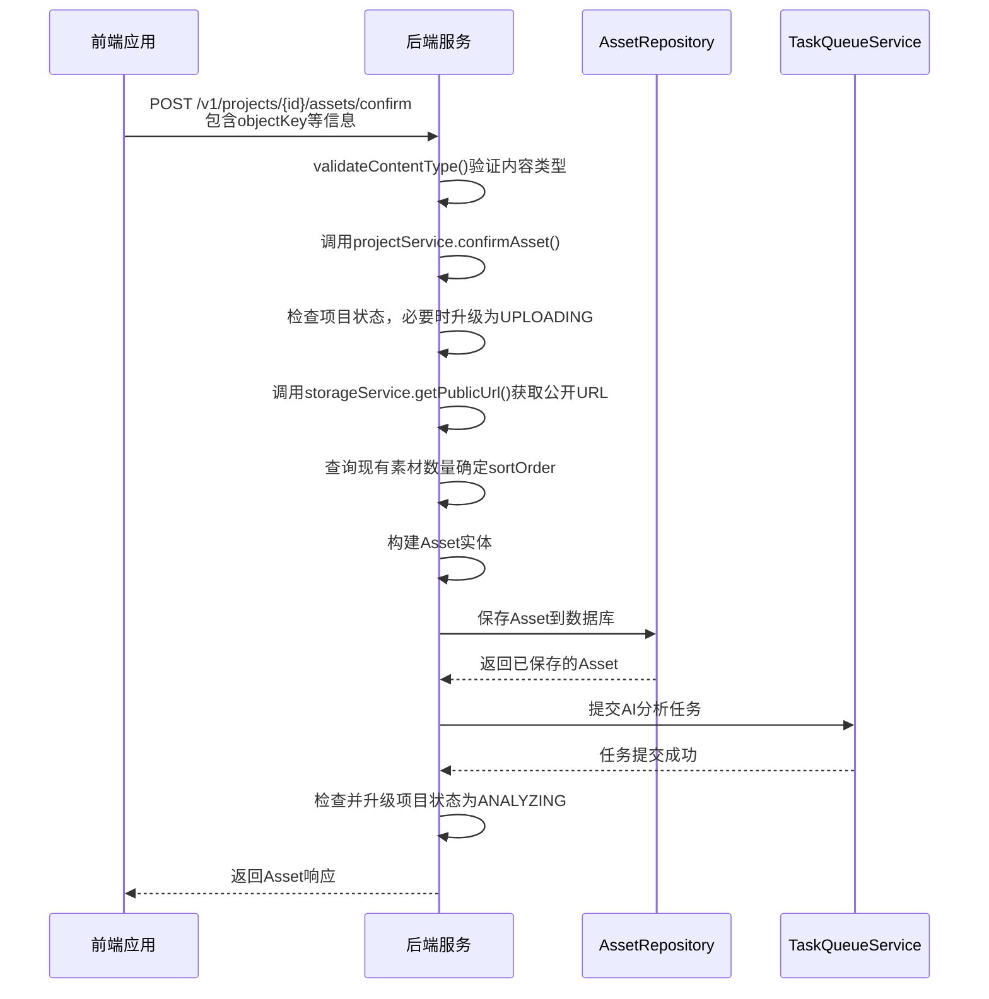

**Diagram sources**
- [ProjectService.java](file://backend/src/main/java/com/aiscene/service/ProjectService.java#L49-L83)
- [ProjectController.java](file://backend/src/main/java/com/aiscene/controller/ProjectController.java#L84-L88)

## 用户标签更新(updateAsset)

`updateAsset`方法允许用户更新素材的用户标签和排序顺序。

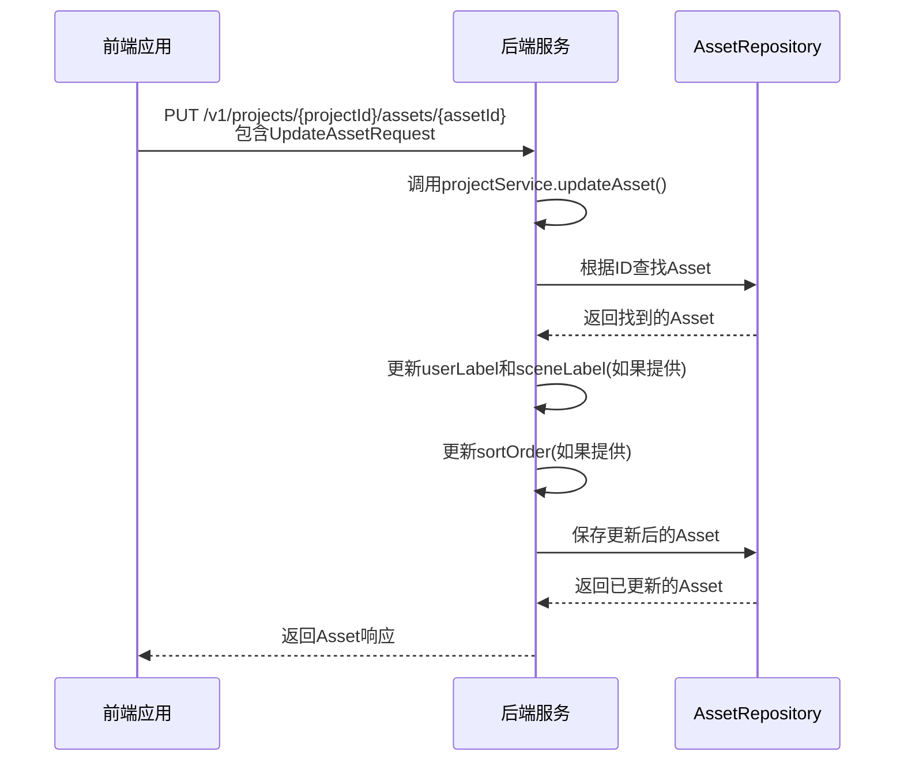

**Diagram sources**
- [ProjectService.java](file://backend/src/main/java/com/aiscene/service/ProjectService.java#L126-L141)
- [ProjectController.java](file://backend/src/main/java/com/aiscene/controller/ProjectController.java#L133-L137)

## 核心实体与数据结构

### Asset实体结构

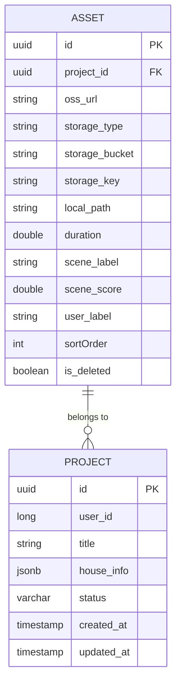

**Diagram sources**
- [Asset.java](file://backend/src/main/java/com/aiscene/entity/Asset.java#L11-L60)
- [V5__add_storage_fields_to_assets.sql](file://backend/src/main/resources/db/migration/V5__add_storage_fields_to_assets.sql#L1-L6)

### 存储信息持久化

当素材上传或确认时，以下存储信息被持久化到Asset实体中：

- **storageType**: 存储类型，固定为"S3"
- **storageBucket**: 存储桶名称，从StorageService获取
- **storageKey**: 对象键，唯一标识存储中的文件

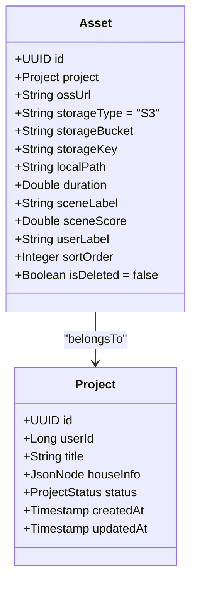

**Diagram sources**
- [Asset.java](file://backend/src/main/java/com/aiscene/entity/Asset.java#L11-L60)
- [ProjectService.java](file://backend/src/main/java/com/aiscene/service/ProjectService.java#L65-L68)

## sortOrder字段的自动递增逻辑

`sortOrder`字段用于确定素材在时间线中的显示顺序，其值基于项目中现有素材的数量自动确定。

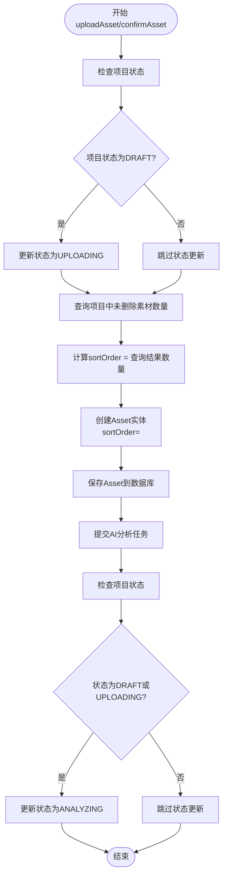

**Diagram sources**
- [ProjectService.java](file://backend/src/main/java/com/aiscene/service/ProjectService.java#L61-L71)
- [ProjectService.java](file://backend/src/main/java/com/aiscene/service/ProjectService.java#L262-L270)

## 项目状态自动升级机制

上传过程中，项目状态会根据当前状态和上传情况自动升级：

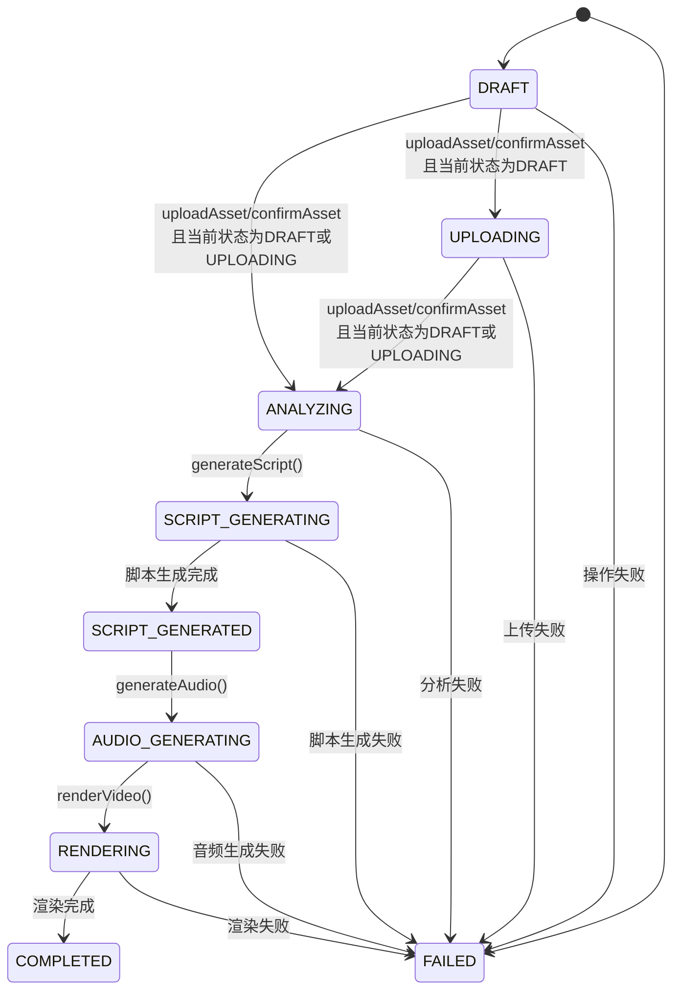

**Diagram sources**
- [ProjectService.java](file://backend/src/main/java/com/aiscene/service/ProjectService.java#L53-L56)
- [ProjectService.java](file://backend/src/main/java/com/aiscene/service/ProjectService.java#L78-L81)

## AI分析任务触发

上传完成后，系统通过Redis队列自动触发AI分析任务。

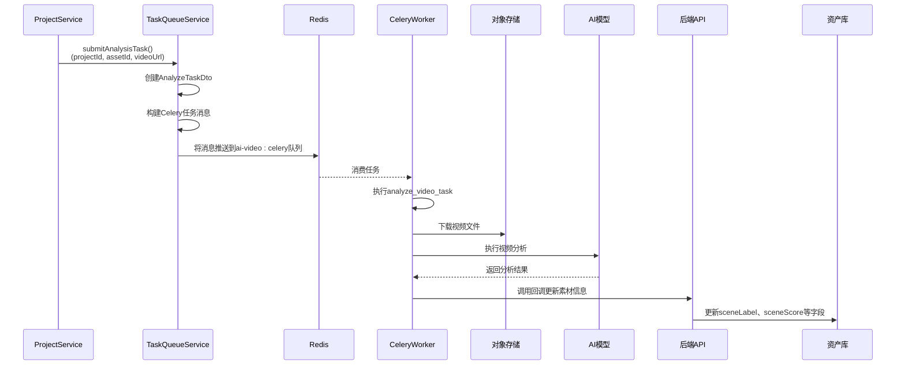

**Diagram sources**
- [ProjectService.java](file://backend/src/main/java/com/aiscene/service/ProjectService.java#L75-L76)
- [TaskQueueService.java](file://backend/src/main/java/com/aiscene/service/TaskQueueService.java#L32-L62)

## 大文件上传支持

系统通过预签名URL直传模式支持大文件上传，避免了通过后端中转大文件。

```mermaid
flowchart TD
A[前端] --> B{文件大小}
B --> |小于10MB| C[直接上传模式<br/>POST /v1/projects/{id}/assets]
B --> |大于10MB| D[预签名URL直传模式]
D --> E[请求预签名URL]
E --> F[获取uploadUrl和signedHeaders]
F --> G[使用XMLHttpRequest直接上传到S3]
G --> H[监听上传进度]
H --> I[上传完成后调用confirmAsset]
I --> J[确认素材信息]
```

**Diagram sources**
- [ProjectController.java](file://backend/src/main/java/com/aiscene/controller/ProjectController.java#L73-L82)
- [CreateProject.vue](file://frontend/src/views/CreateProject.vue#L221-L254)

## 存储权限配置

系统通过AWS SDK配置安全的存储访问权限。

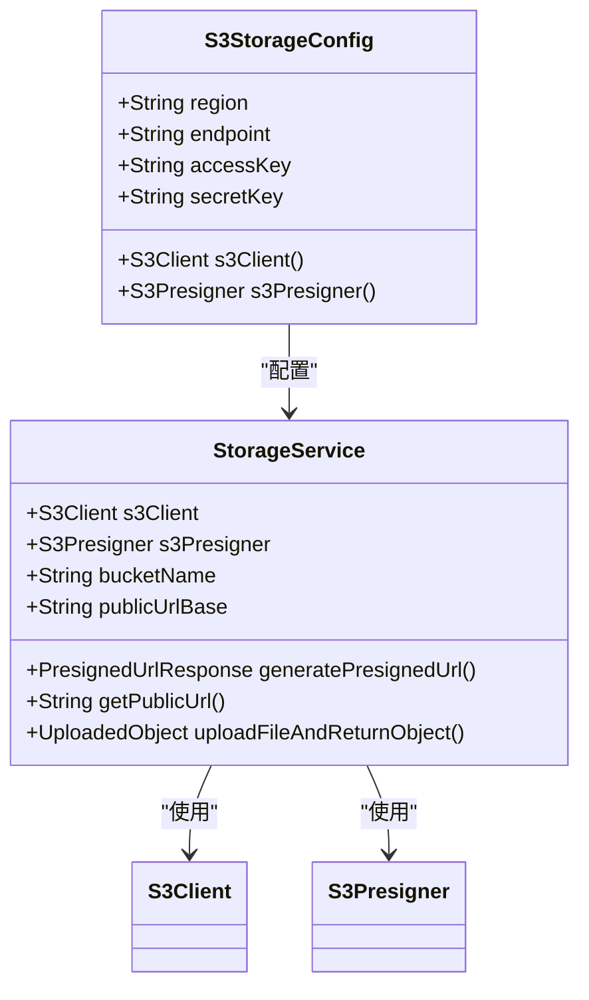

**Diagram sources**
- [S3StorageConfig.java](file://backend/src/main/java/com/aiscene/config/S3StorageConfig.java#L16-L60)
- [StorageService.java](file://backend/src/main/java/com/aiscene/service/StorageService.java#L25-L140)

## 错误处理策略

系统实现了多层次的错误处理机制，确保上传流程的稳定性和可靠性。

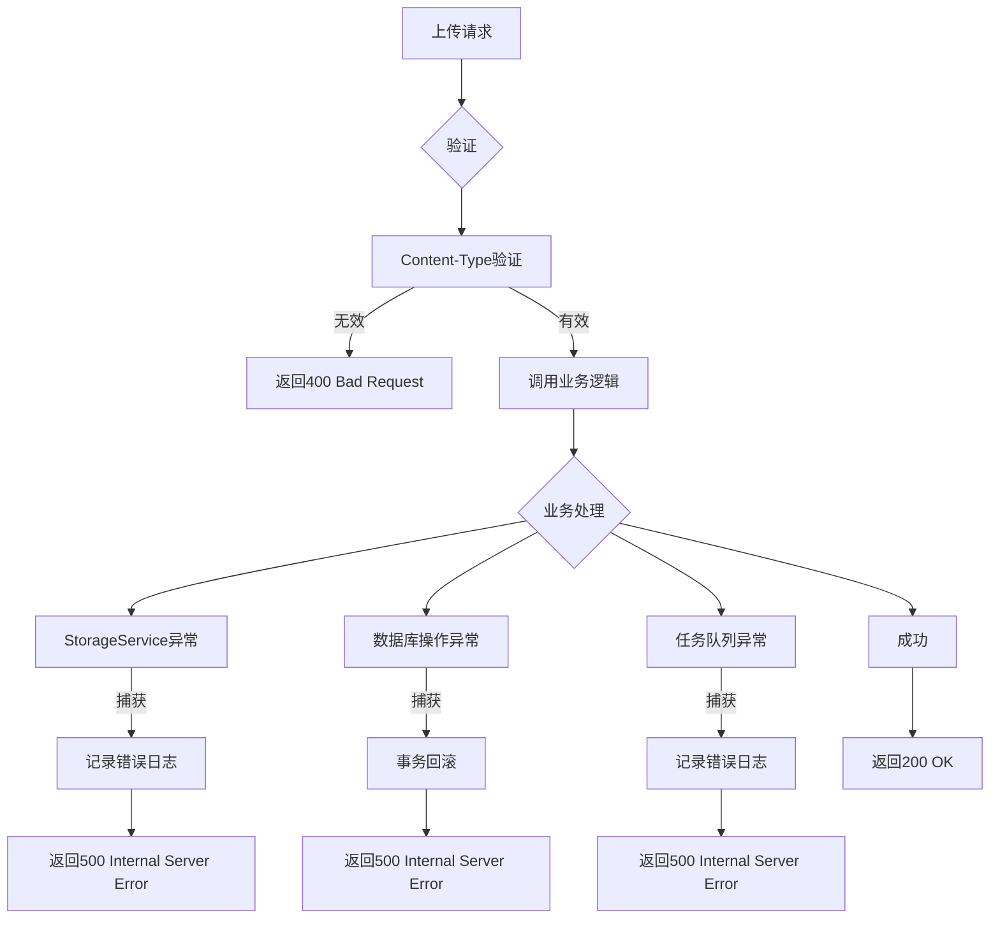

**Section sources**
- [StorageService.java](file://backend/src/main/java/com/aiscene/service/StorageService.java#L70-L73)
- [ProjectController.java](file://backend/src/main/java/com/aiscene/controller/ProjectController.java#L105-L115)
- [ProjectService.java](file://backend/src/main/java/com/aiscene/service/ProjectService.java#L252-L318)