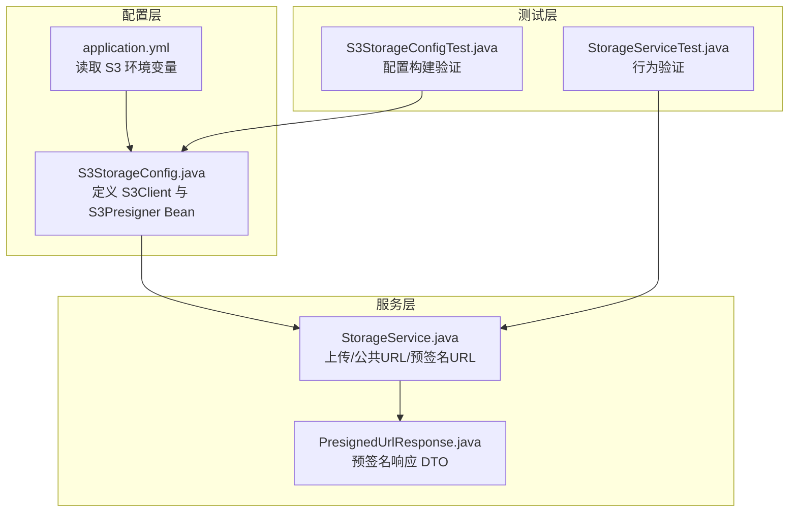
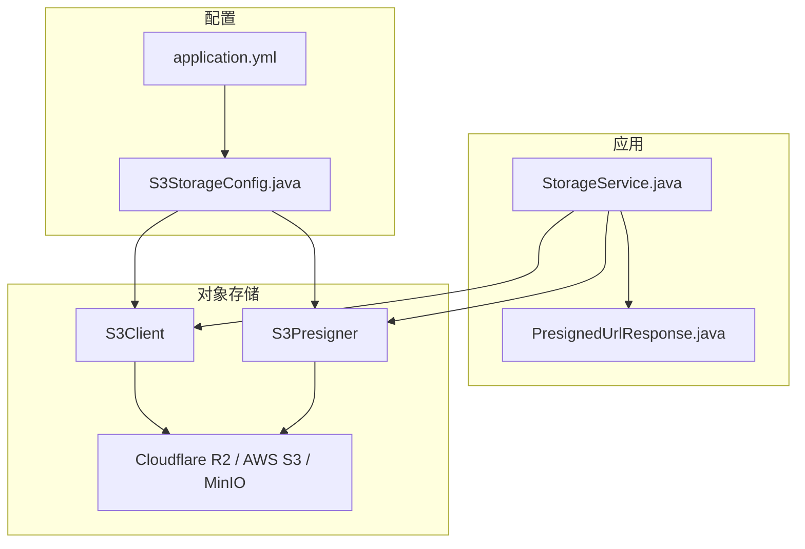
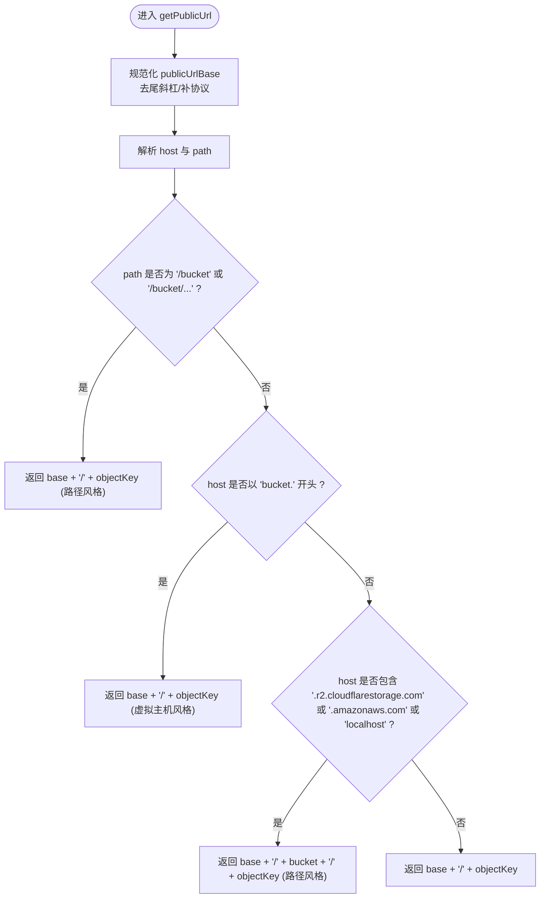
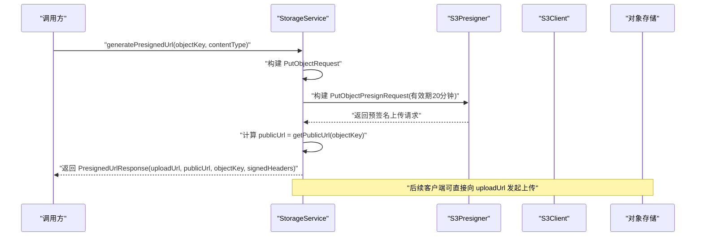
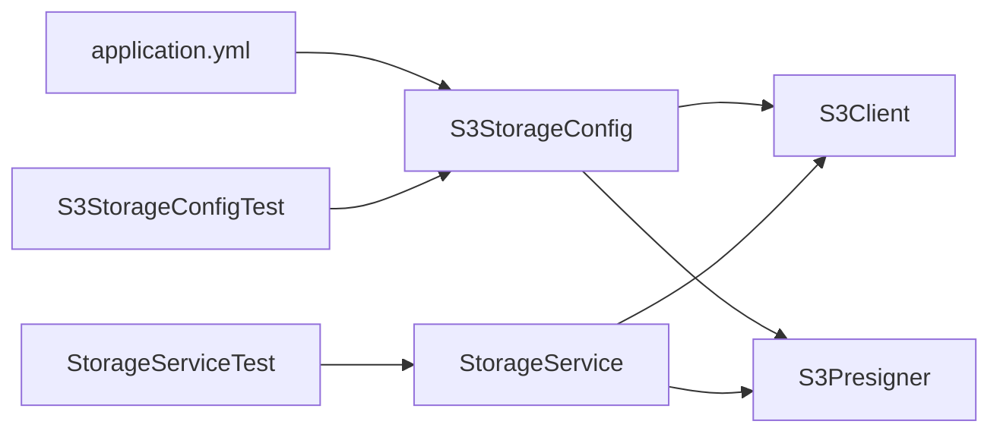

# 存储服务

<cite>
**本文引用的文件**
- [StorageService.java](file://backend/src/main/java/com/aiscene/service/StorageService.java)
- [S3StorageConfig.java](file://backend/src/main/java/com/aiscene/config/S3StorageConfig.java)
- [application.yml](file://backend/src/main/resources/application.yml)
- [PresignedUrlResponse.java](file://backend/src/main/java/com/aiscene/dto/PresignedUrlResponse.java)
- [StorageServiceTest.java](file://backend/src/test/java/com/aiscene/service/StorageServiceTest.java)
- [S3StorageConfigTest.java](file://backend/src/test/java/com/aiscene/config/S3StorageConfigTest.java)
- [docker-compose.coolify.yaml](file://docker-compose.coolify.yaml)
- [COOLIFY_DEPLOY.md](file://COOLIFY_DEPLOY.md)
</cite>

## 目录
1. [简介](#简介)
2. [项目结构](#项目结构)
3. [核心组件](#核心组件)
4. [架构总览](#架构总览)
5. [详细组件分析](#详细组件分析)
6. [依赖关系分析](#依赖关系分析)
7. [性能考量](#性能考量)
8. [故障排查指南](#故障排查指南)
9. [结论](#结论)
10. [附录](#附录)

## 简介
本文件围绕后端存储服务 StorageService 展开，系统性阐述其如何通过 S3Client 与多种对象存储服务（Cloudflare R2、AWS S3、MinIO）进行交互，重点覆盖以下能力：
- 文件上传：uploadFileAndReturnObject 的实现细节与对象键生成策略
- 公共 URL 生成：getPublicUrl 的 URL 构造逻辑与路径风格/虚拟主机风格的自动适配
- 预签名 URL 生成：generatePresignedUrl 的安全机制（有效期与 Content-Type 签名头）
- 不同网络环境下的 publicUrlBase 最佳实践（内网/外网）

## 项目结构
后端采用 Spring Boot 结构，存储相关的关键文件位于：
- 配置层：S3StorageConfig 定义 S3Client 与 S3Presigner 的 Bean，并通过 application.yml 注入环境变量
- 服务层：StorageService 封装上传、公共 URL 与预签名 URL 的业务逻辑
- DTO 层：PresignedUrlResponse 描述预签名响应结构
- 测试层：StorageServiceTest 与 S3StorageConfigTest 提供行为验证与配置构建验证

图表来源
- [S3StorageConfig.java](file://backend/src/main/java/com/aiscene/config/S3StorageConfig.java#L1-L60)
- [application.yml](file://backend/src/main/resources/application.yml#L50-L66)
- [StorageService.java](file://backend/src/main/java/com/aiscene/service/StorageService.java#L1-L141)
- [PresignedUrlResponse.java](file://backend/src/main/java/com/aiscene/dto/PresignedUrlResponse.java#L1-L15)
- [StorageServiceTest.java](file://backend/src/test/java/com/aiscene/service/StorageServiceTest.java#L1-L83)
- [S3StorageConfigTest.java](file://backend/src/test/java/com/aiscene/config/S3StorageConfigTest.java#L1-L23)

章节来源
- [S3StorageConfig.java](file://backend/src/main/java/com/aiscene/config/S3StorageConfig.java#L1-L60)
- [application.yml](file://backend/src/main/resources/application.yml#L50-L66)

## 核心组件
- S3StorageConfig：负责创建 S3Client 与 S3Presigner，设置区域、端点、凭据，并强制启用路径风格访问以适配 R2/MinIO/OSS 等兼容 S3 的服务
- StorageService：封装上传、公共 URL 生成与预签名 URL 生成；内部通过 UUID+原始文件名生成对象键，支持自定义 publicUrlBase 的自动适配
- PresignedUrlResponse：预签名响应的数据结构，包含上传 URL、公共 URL、对象键与签名头

章节来源
- [S3StorageConfig.java](file://backend/src/main/java/com/aiscene/config/S3StorageConfig.java#L1-L60)
- [StorageService.java](file://backend/src/main/java/com/aiscene/service/StorageService.java#L1-L141)
- [PresignedUrlResponse.java](file://backend/src/main/java/com/aiscene/dto/PresignedUrlResponse.java#L1-L15)

## 架构总览
下图展示从应用到对象存储的交互路径，以及各组件之间的依赖关系。

图表来源
- [S3StorageConfig.java](file://backend/src/main/java/com/aiscene/config/S3StorageConfig.java#L1-L60)
- [application.yml](file://backend/src/main/resources/application.yml#L50-L66)
- [StorageService.java](file://backend/src/main/java/com/aiscene/service/StorageService.java#L1-L141)
- [PresignedUrlResponse.java](file://backend/src/main/java/com/aiscene/dto/PresignedUrlResponse.java#L1-L15)

## 详细组件分析

### 组件一：S3StorageConfig（S3 客户端与预签名器配置）
- 关键点
  - 通过 application.yml 注入 region、endpoint、access-key、secret-key、bucket、public-url
  - S3Client 与 S3Presigner 均使用 endpointOverride 指向具体对象存储端点
  - 强制路径风格访问（forcePathStyle 与 pathStyleAccessEnabled），确保兼容 R2、MinIO、阿里云 OSS 等
  - Region 必须显式指定（例如 auto/us-east-1），即使 R2 是全局服务

- 适用场景
  - Cloudflare R2：endpoint 为 r2 域名，region 通常为 auto/us-east-1
  - AWS S3：endpoint 为 s3.amazonaws.com 或自定义加速域名
  - MinIO：endpoint 为 MinIO 服务器地址，常为 localhost:9000
  - 阿里云 OSS：endpoint 为 OSS 域名，需按 OSS 规范配置

章节来源
- [S3StorageConfig.java](file://backend/src/main/java/com/aiscene/config/S3StorageConfig.java#L1-L60)
- [application.yml](file://backend/src/main/resources/application.yml#L50-L66)

### 组件二：StorageService（上传、公共 URL、预签名 URL）
- uploadFileAndReturnObject
  - 对象键生成：UUID.randomUUID() + "-" + 原始文件名，避免重名冲突并保留原始扩展名
  - 上传流程：构建 PutObjectRequest，使用 RequestBody.fromInputStream 上传，返回 UploadedObject（包含 objectKey 与 publicUrl）
  - 返回值：UploadedObject.publicUrl 由 getPublicUrl 计算得到

- getPublicUrl（URL 构造与风格适配）
  - 输入：objectKey
  - 处理逻辑要点：
    - 规范化 publicUrlBase：去除末尾斜杠，若无协议则补上 https://
    - 解析 host 与 path：
      - 若 path 为 “/bucket” 或 “/bucket/...”，采用路径风格：base + "/" + objectKey
      - 若 host 以 “bucket.” 开头（虚拟主机风格），采用 base + "/" + objectKey
      - 若 host 包含 r2.cloudflarestorage.com、amazonaws.com 或 localhost，则采用 base + "/" + bucket + "/" + objectKey（路径风格）
      - 默认返回 base + "/" + objectKey
  - 适配范围：Cloudflare R2、AWS S3、MinIO、自定义域名等

- generatePresignedUrl（预签名上传）
  - 构建 PutObjectRequest，设置 bucket、key、contentType
  - 设置签名有效期为 20 分钟（signatureDuration=20min）
  - 生成预签名上传 URL，并返回 PresignedUrlResponse，其中包含：
    - uploadUrl：预签名上传地址
    - publicUrl：基于 getPublicUrl 计算的公共访问 URL
    - objectKey：对象键
    - signedHeaders：包含 Content-Type 的签名头集合

- uploadFile（便捷方法）
  - 直接调用 uploadFileAndReturnObject 并返回 publicUrl

图表来源
- [StorageService.java](file://backend/src/main/java/com/aiscene/service/StorageService.java#L76-L102)

章节来源
- [StorageService.java](file://backend/src/main/java/com/aiscene/service/StorageService.java#L1-L141)
- [PresignedUrlResponse.java](file://backend/src/main/java/com/aiscene/dto/PresignedUrlResponse.java#L1-L15)

### 组件三：预签名 URL 序列流程（generatePresignedUrl）

图表来源
- [StorageService.java](file://backend/src/main/java/com/aiscene/service/StorageService.java#L42-L68)

## 依赖关系分析
- StorageService 依赖 S3Client 与 S3Presigner，二者均由 S3StorageConfig 提供
- S3StorageConfig 依赖 application.yml 中的环境变量（region、endpoint、access-key、secret-key、bucket、public-url）
- StorageServiceTest 与 S3StorageConfigTest 分别验证上传 URL 生成与客户端构建

图表来源
- [application.yml](file://backend/src/main/resources/application.yml#L50-L66)
- [S3StorageConfig.java](file://backend/src/main/java/com/aiscene/config/S3StorageConfig.java#L1-L60)
- [StorageService.java](file://backend/src/main/java/com/aiscene/service/StorageService.java#L1-L141)
- [StorageServiceTest.java](file://backend/src/test/java/com/aiscene/service/StorageServiceTest.java#L1-L83)
- [S3StorageConfigTest.java](file://backend/src/test/java/com/aiscene/config/S3StorageConfigTest.java#L1-L23)

章节来源
- [application.yml](file://backend/src/main/resources/application.yml#L50-L66)
- [S3StorageConfig.java](file://backend/src/main/java/com/aiscene/config/S3StorageConfig.java#L1-L60)
- [StorageService.java](file://backend/src/main/java/com/aiscene/service/StorageService.java#L1-L141)
- [StorageServiceTest.java](file://backend/src/test/java/com/aiscene/service/StorageServiceTest.java#L1-L83)
- [S3StorageConfigTest.java](file://backend/src/test/java/com/aiscene/config/S3StorageConfigTest.java#L1-L23)

## 性能考量
- 上传性能
  - 使用 RequestBody.fromInputStream 传输流，避免将整个文件加载到内存
  - 上传前不进行桶存在性校验，减少一次网络往返
- 预签名 URL
  - 20 分钟有效期较短，降低泄露风险；如需更长有效期，可在业务侧评估调整
  - 签名头仅包含 Content-Type，避免不必要的头部参与签名
- URL 生成
  - getPublicUrl 为纯字符串拼接逻辑，时间复杂度低，适合高频调用

[本节为通用性能讨论，不直接分析具体文件]

## 故障排查指南
- 上传失败
  - 现象：抛出运行时异常，日志记录错误
  - 排查：确认 S3StorageConfig 中 region、endpoint、access-key、secret-key 配置正确；确认 bucket 已创建且具备写权限
- 预签名 URL 无法访问
  - 现象：客户端上传 403/404
  - 排查：检查签名有效期是否过期；确认签名头 Content-Type 与实际上传一致；核对 publicUrlBase 与对象存储端点匹配
- 公共 URL 无法访问
  - 现象：浏览器打开返回 404/403
  - 排查：确认对象存储的访问策略允许公开读；检查 getPublicUrl 的适配分支是否命中（路径风格/虚拟主机风格）

章节来源
- [StorageService.java](file://backend/src/main/java/com/aiscene/service/StorageService.java#L104-L141)
- [S3StorageConfig.java](file://backend/src/main/java/com/aiscene/config/S3StorageConfig.java#L1-L60)

## 结论
StorageService 通过 S3Client 与 S3Presigner 实现了对多种对象存储后端的一致访问，结合 S3StorageConfig 的路径风格强制与端点覆盖，有效适配 Cloudflare R2、AWS S3、MinIO 与阿里云 OSS 等。其 URL 生成逻辑对路径风格与虚拟主机风格进行了智能适配，预签名上传提供了 20 分钟的有效期与必要的签名头，满足安全与易用性的平衡。配合合理的 publicUrlBase 配置，可在内网/外网环境中稳定运行。

[本节为总结性内容，不直接分析具体文件]

## 附录

### A. uploadFileAndReturnObject 的对象键生成与上传流程
- 对象键生成：UUID.randomUUID() + "-" + 原始文件名
- 上传请求：PutObjectRequest（bucket、key、contentType）
- 上传实现：S3Client.putObject(RequestBody.fromInputStream(...))

章节来源
- [StorageService.java](file://backend/src/main/java/com/aiscene/service/StorageService.java#L118-L139)

### B. getPublicUrl 的 URL 构造逻辑与风格适配
- 路径风格：当 publicUrlBase 的 path 为 “/bucket” 或 “/bucket/...” 时，返回 base + "/" + objectKey
- 虚拟主机风格：当 publicUrlBase 的 host 以 “bucket.” 开头时，返回 base + "/" + objectKey
- 特殊服务：当 host 包含 r2.cloudflarestorage.com、amazonaws.com 或 localhost 时，返回 base + "/" + bucket + "/" + objectKey
- 默认：返回 base + "/" + objectKey

章节来源
- [StorageService.java](file://backend/src/main/java/com/aiscene/service/StorageService.java#L76-L102)

### C. 预签名 URL 的安全机制
- 有效期：20 分钟
- 签名头：Content-Type
- 返回结构：PresignedUrlResponse（uploadUrl、publicUrl、objectKey、signedHeaders）

章节来源
- [StorageService.java](file://backend/src/main/java/com/aiscene/service/StorageService.java#L42-L68)
- [PresignedUrlResponse.java](file://backend/src/main/java/com/aiscene/dto/PresignedUrlResponse.java#L1-L15)

### D. 不同网络环境下的 publicUrlBase 最佳实践
- 内网
  - 使用内网域名或 IP + 端口作为 publicUrlBase，确保客户端可访问
  - 若使用 MinIO/R2/OSS 的虚拟主机风格，需保证 DNS 解析到内网地址
- 外网
  - 使用公网域名（CDN 加速域名或对象存储提供的自定义域名）
  - 若使用路径风格，确保路径包含 bucket 名称
- 部署参考
  - Coolify 部署文档提供了 S3_STORAGE_PUBLIC_URL 的示例配置，便于在生产环境快速落地

章节来源
- [COOLIFY_DEPLOY.md](file://COOLIFY_DEPLOY.md#L59-L68)
- [docker-compose.coolify.yaml](file://docker-compose.coolify.yaml#L18-L24)