# 素材处理

<cite>
**本文档中引用的文件**  
- [StorageService.java](file://backend/src/main/java/com/aiscene/service/StorageService.java)
- [ProjectService.java](file://backend/src/main/java/com/aiscene/service/ProjectService.java)
- [Asset.java](file://backend/src/main/java/com/aiscene/entity/Asset.java)
- [ProjectController.java](file://backend/src/main/java/com/aiscene/controller/ProjectController.java)
- [S3StorageConfig.java](file://backend/src/main/java/com/aiscene/config/S3StorageConfig.java)
- [application.yml](file://backend/src/main/resources/application.yml)
- [TaskQueueService.java](file://backend/src/main/java/com/aiscene/service/TaskQueueService.java)
- [CreateProject.vue](file://frontend/src/views/CreateProject.vue)
</cite>

## 目录
1. [简介](#简介)
2. [核心处理流程](#核心处理流程)
3. [StorageService与S3存储交互机制](#storageservice与s3存储交互机制)
4. [Asset实体中sortOrder字段的自动递增逻辑](#asset实体中sortorder字段的自动递增逻辑)
5. [项目状态自动升级机制](#项目状态自动升级机制)
6. [大文件上传与断点续传最佳实践](#大文件上传与断点续传最佳实践)
7. [存储权限配置建议](#存储权限配置建议)

## 简介
本系统实现了从素材上传到视频生成的完整流程，涵盖素材上传(uploadAsset)、预签名URL生成、素材确认(confirmAsset)和用户标签更新(updateAsset)等核心功能。系统通过StorageService与MinIO/阿里云OSS等S3兼容存储服务进行交互，利用预签名URL实现前端直传，确保高效安全的文件上传机制。同时，系统通过sortOrder字段管理素材在时间线中的排序，并在上传过程中自动升级项目状态，确保流程的连贯性和状态的一致性。

## 核心处理流程

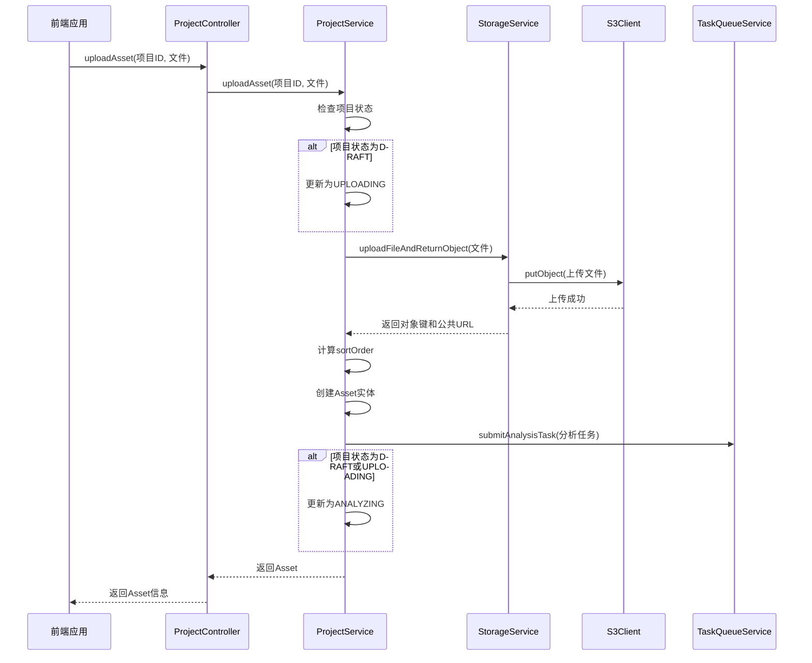

**流程图来源**
- [ProjectService.java](file://backend/src/main/java/com/aiscene/service/ProjectService.java#L252-L284)
- [StorageService.java](file://backend/src/main/java/com/aiscene/service/StorageService.java#L118-L135)

**流程说明**
1. 前端调用`uploadAsset`接口上传文件
2. `ProjectController`接收请求并委托给`ProjectService`
3. `ProjectService`检查项目状态，若为DRAFT则更新为UPLOADING
4. 调用`StorageService`的`uploadFileAndReturnObject`方法上传文件
5. `StorageService`使用S3Client将文件上传到对象存储
6. 计算新的`sortOrder`值并创建Asset实体
7. 提交分析任务到任务队列
8. 若项目状态为DRAFT或UPLOADING，则更新为ANALYZING
9. 返回Asset信息给前端

**流程图来源**
- [ProjectService.java](file://backend/src/main/java/com/aiscene/service/ProjectService.java#L252-L284)
- [StorageService.java](file://backend/src/main/java/com/aiscene/service/StorageService.java#L118-L135)

## StorageService与S3存储交互机制

### 预签名URL生成

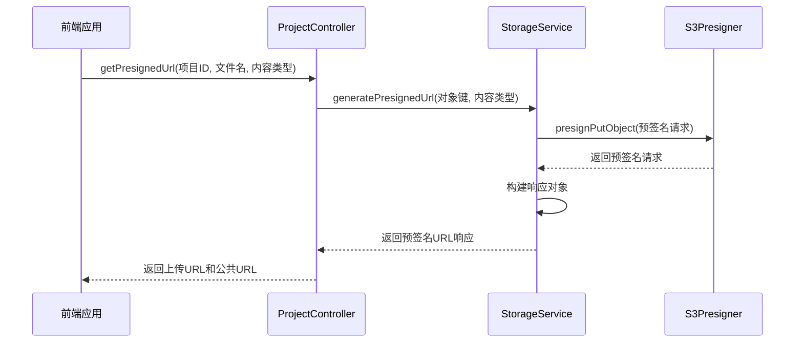

**流程图来源**
- [ProjectController.java](file://backend/src/main/java/com/aiscene/controller/ProjectController.java#L73-L82)
- [StorageService.java](file://backend/src/main/java/com/aiscene/service/StorageService.java#L42-L69)

### 文件上传实现

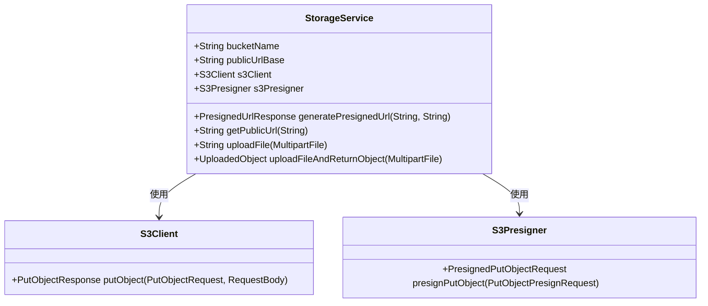

**类图来源**
- [StorageService.java](file://backend/src/main/java/com/aiscene/service/StorageService.java#L25-L141)
- [S3StorageConfig.java](file://backend/src/main/java/com/aiscene/config/S3StorageConfig.java#L17-L61)

### 公共URL生成逻辑

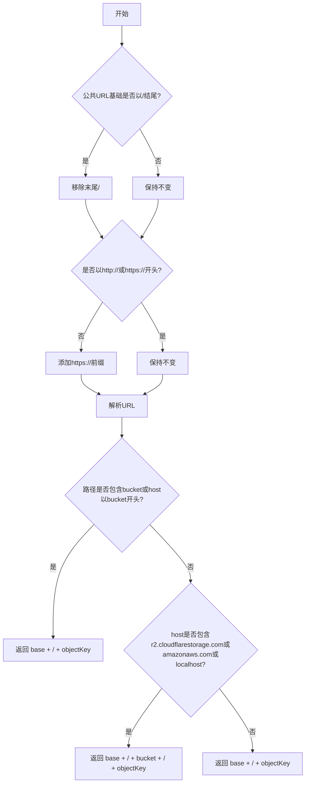

**流程图来源**
- [StorageService.java](file://backend/src/main/java/com/aiscene/service/StorageService.java#L76-L102)

## Asset实体中sortOrder字段的自动递增逻辑

### 自动递增实现

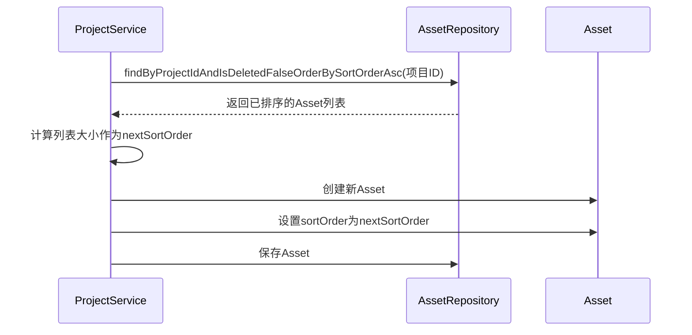

**流程图来源**
- [ProjectService.java](file://backend/src/main/java/com/aiscene/service/ProjectService.java#L262-L271)
- [AssetRepository.java](file://backend/src/main/java/com/aiscene/repository/AssetRepository.java#L10-L14)

### 时间线排序作用

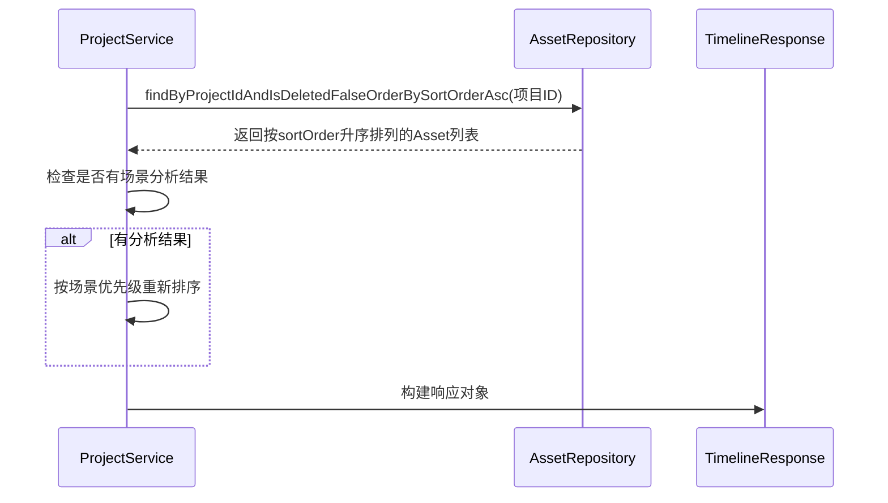

**流程图来源**
- [ProjectService.java](file://backend/src/main/java/com/aiscene/service/ProjectService.java#L86-L124)
- [AssetRepository.java](file://backend/src/main/java/com/aiscene/repository/AssetRepository.java#L10-L14)

## 项目状态自动升级机制

### 状态升级流程

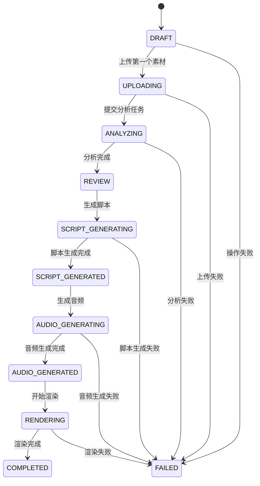

**状态图来源**
- [ProjectService.java](file://backend/src/main/java/com/aiscene/service/ProjectService.java#L53-L55)
- [ProjectService.java](file://backend/src/main/java/com/aiscene/service/ProjectService.java#L78-L81)
- [ProjectStatus.java](file://backend/src/main/java/com/aiscene/entity/ProjectStatus.java#L3-L15)

### 状态升级实现

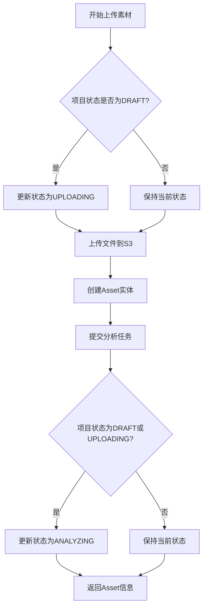

**流程图来源**
- [ProjectService.java](file://backend/src/main/java/com/aiscene/service/ProjectService.java#L253-L281)
- [ProjectService.java](file://backend/src/main/java/com/aiscene/service/ProjectService.java#L50-L83)

## 大文件上传与断点续传最佳实践

### 前端上传实现

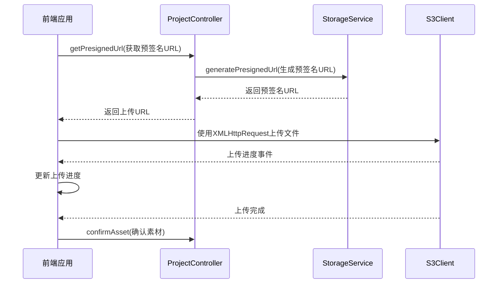

**流程图来源**
- [CreateProject.vue](file://frontend/src/views/CreateProject.vue#L221-L254)
- [ProjectController.java](file://backend/src/main/java/com/aiscene/controller/ProjectController.java#L84-L89)

### 断点续传建议

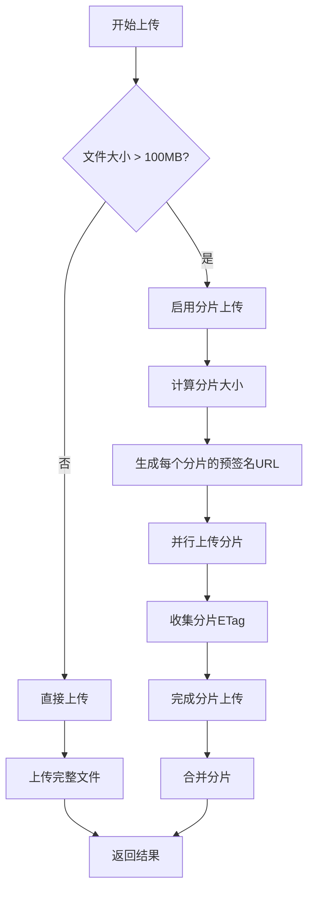

**流程图来源**
- [application.yml](file://backend/src/main/resources/application.yml#L26-L27)
- [StorageService.java](file://backend/src/main/java/com/aiscene/service/StorageService.java#L118-L135)

## 存储权限配置建议

### S3存储配置

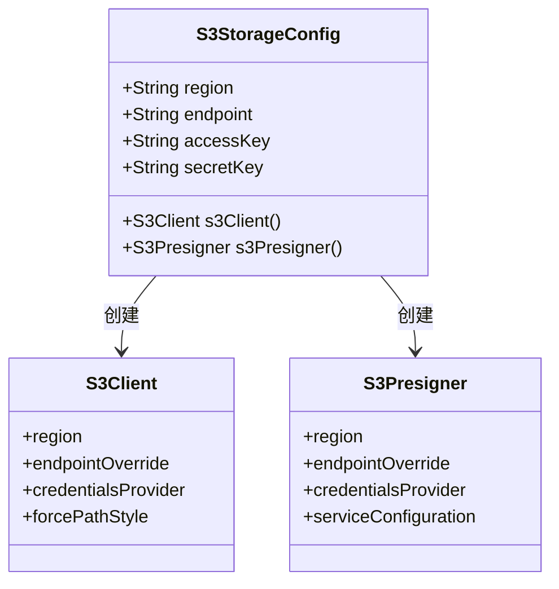

**类图来源**
- [S3StorageConfig.java](file://backend/src/main/java/com/aiscene/config/S3StorageConfig.java#L17-L61)
- [application.yml](file://backend/src/main/resources/application.yml#L50-L59)

### 安全配置建议

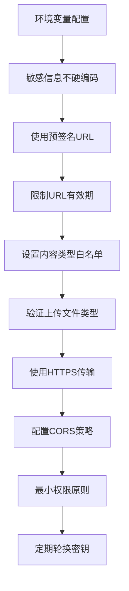

**流程图来源**
- [application.yml](file://backend/src/main/resources/application.yml#L64-L65)
- [ProjectController.java](file://backend/src/main/java/com/aiscene/controller/ProjectController.java#L105-L116)
- [S3StorageConfig.java](file://backend/src/main/java/com/aiscene/config/S3StorageConfig.java#L32-L43)