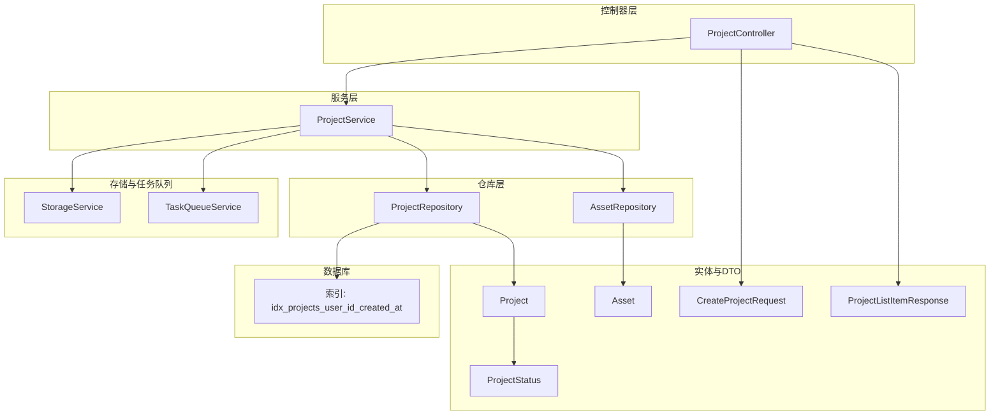
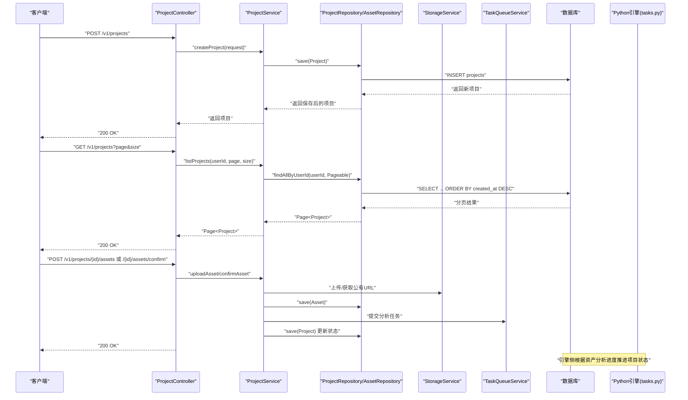
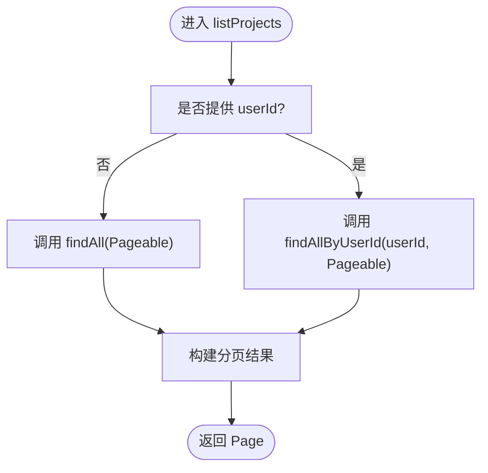
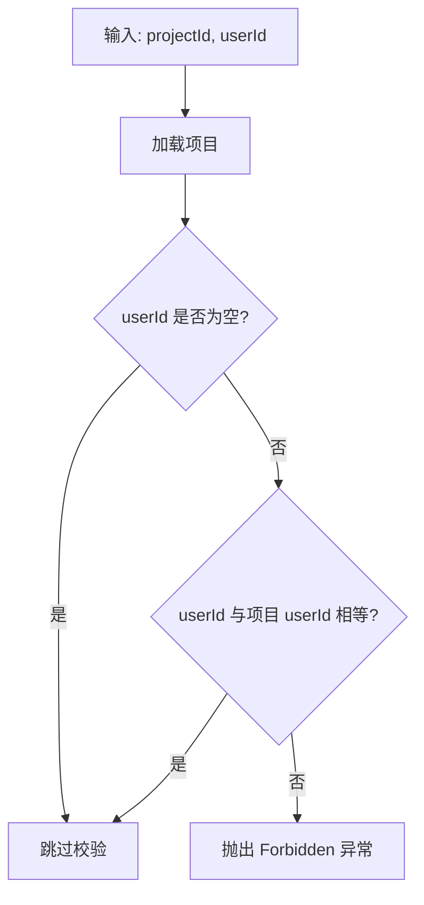
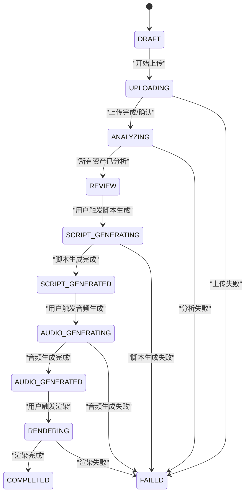
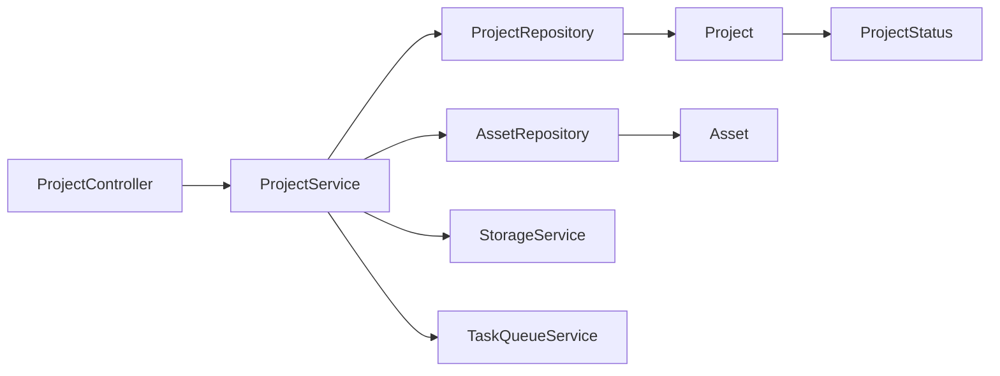

# 项目管理

<cite>
**本文引用的文件**
- [ProjectService.java](file://backend/src/main/java/com/aiscene/service/ProjectService.java)
- [ProjectController.java](file://backend/src/main/java/com/aiscene/controller/ProjectController.java)
- [Project.java](file://backend/src/main/java/com/aiscene/entity/Project.java)
- [ProjectStatus.java](file://backend/src/main/java/com/aiscene/entity/ProjectStatus.java)
- [CreateProjectRequest.java](file://backend/src/main/java/com/aiscene/dto/CreateProjectRequest.java)
- [ProjectRepository.java](file://backend/src/main/java/com/aiscene/repository/ProjectRepository.java)
- [Asset.java](file://backend/src/main/java/com/aiscene/entity/Asset.java)
- [V4__add_index_projects_user_id.sql](file://backend/src/main/resources/db/migration/V4__add_index_projects_user_id.sql)
- [tasks.py](file://engine/tasks.py)
- [ProjectServiceTest.java](file://backend/src/test/java/com/aiscene/service/ProjectServiceTest.java)
- [ProjectListItemResponse.java](file://backend/src/main/java/com/aiscene/dto/ProjectListItemResponse.java)
</cite>

## 目录
1. [简介](#简介)
2. [项目结构](#项目结构)
3. [核心组件](#核心组件)
4. [架构总览](#架构总览)
5. [详细组件分析](#详细组件分析)
6. [依赖关系分析](#依赖关系分析)
7. [性能考虑](#性能考虑)
8. [故障排查指南](#故障排查指南)
9. [结论](#结论)
10. [附录](#附录)

## 简介
本文件围绕后端服务中的项目管理能力进行系统化技术文档梳理，重点覆盖以下目标：
- 深入解析 ProjectService 中的项目创建(createProject)、项目列表查询(listProjects)与项目所有权校验(validateProjectOwnership)的实现逻辑
- 详述 Project 实体的状态机(ProjectStatus)在项目生命周期中的流转机制，包括 DRAFT、UPLOADING、ANALYZING、SCRIPT_GENERATING 等状态的转换条件
- 描述分页查询的实现方式及数据库索引优化策略
- 提供项目创建请求(CreateProjectRequest)的数据结构定义与校验规则
- 给出扩展项目元数据字段或自定义状态处理逻辑的指导，并说明事务管理(@Transactional)在关键操作中的应用

## 项目结构
后端采用典型的分层架构：控制器层负责接口暴露与参数校验；服务层承载业务逻辑；仓库层负责数据持久化；实体与DTO用于数据建模与传输；迁移脚本负责数据库演进。

图表来源
- [ProjectController.java](file://backend/src/main/java/com/aiscene/controller/ProjectController.java#L1-L206)
- [ProjectService.java](file://backend/src/main/java/com/aiscene/service/ProjectService.java#L1-L356)
- [ProjectRepository.java](file://backend/src/main/java/com/aiscene/repository/ProjectRepository.java#L1-L27)
- [Project.java](file://backend/src/main/java/com/aiscene/entity/Project.java#L1-L72)
- [Asset.java](file://backend/src/main/java/com/aiscene/entity/Asset.java#L1-L61)
- [CreateProjectRequest.java](file://backend/src/main/java/com/aiscene/dto/CreateProjectRequest.java#L1-L13)
- [ProjectListItemResponse.java](file://backend/src/main/java/com/aiscene/dto/ProjectListItemResponse.java#L1-L27)
- [V4__add_index_projects_user_id.sql](file://backend/src/main/resources/db/migration/V4__add_index_projects_user_id.sql#L1-L2)

章节来源
- [ProjectController.java](file://backend/src/main/java/com/aiscene/controller/ProjectController.java#L1-L206)
- [ProjectService.java](file://backend/src/main/java/com/aiscene/service/ProjectService.java#L1-L356)
- [ProjectRepository.java](file://backend/src/main/java/com/aiscene/repository/ProjectRepository.java#L1-L27)
- [Project.java](file://backend/src/main/java/com/aiscene/entity/Project.java#L1-L72)
- [Asset.java](file://backend/src/main/java/com/aiscene/entity/Asset.java#L1-L61)
- [CreateProjectRequest.java](file://backend/src/main/java/com/aiscene/dto/CreateProjectRequest.java#L1-L13)
- [ProjectListItemResponse.java](file://backend/src/main/java/com/aiscene/dto/ProjectListItemResponse.java#L1-L27)
- [V4__add_index_projects_user_id.sql](file://backend/src/main/resources/db/migration/V4__add_index_projects_user_id.sql#L1-L2)

## 核心组件
- 控制器(ProjectController)：负责接收HTTP请求，执行基础参数校验（如上传内容类型），并将请求委派给服务层；同时负责将领域对象映射为响应DTO。
- 服务(ProjectService)：承载项目全生命周期的业务逻辑，包含创建、资产上传/确认、智能时间线生成、脚本生成、音频生成、渲染、重试渲染、分页查询、所有权校验等。
- 仓库(ProjectRepository/AssetRepository)：基于Spring Data JPA提供数据访问能力，其中ProjectRepository提供按用户分页查询与“状态原子更新”能力。
- 实体(Project/Asset)：使用JPA注解映射到数据库表，Project包含JSON类型的房屋信息与状态枚举；Asset记录媒体资源与排序信息。
- DTO(CreateProjectRequest/ProjectListItemResponse)：用于请求与响应的数据结构定义。
- 数据库索引：通过迁移脚本为 projects 表建立复合索引以优化按用户分页查询。

章节来源
- [ProjectController.java](file://backend/src/main/java/com/aiscene/controller/ProjectController.java#L1-L206)
- [ProjectService.java](file://backend/src/main/java/com/aiscene/service/ProjectService.java#L1-L356)
- [ProjectRepository.java](file://backend/src/main/java/com/aiscene/repository/ProjectRepository.java#L1-L27)
- [Project.java](file://backend/src/main/java/com/aiscene/entity/Project.java#L1-L72)
- [Asset.java](file://backend/src/main/java/com/aiscene/entity/Asset.java#L1-L61)
- [CreateProjectRequest.java](file://backend/src/main/java/com/aiscene/dto/CreateProjectRequest.java#L1-L13)
- [ProjectListItemResponse.java](file://backend/src/main/java/com/aiscene/dto/ProjectListItemResponse.java#L1-L27)
- [V4__add_index_projects_user_id.sql](file://backend/src/main/resources/db/migration/V4__add_index_projects_user_id.sql#L1-L2)

## 架构总览
下图展示从控制器到服务再到仓库与外部系统的交互路径，以及状态机在引擎侧的推进逻辑。

图表来源
- [ProjectController.java](file://backend/src/main/java/com/aiscene/controller/ProjectController.java#L1-L206)
- [ProjectService.java](file://backend/src/main/java/com/aiscene/service/ProjectService.java#L1-L356)
- [ProjectRepository.java](file://backend/src/main/java/com/aiscene/repository/ProjectRepository.java#L1-L27)
- [tasks.py](file://engine/tasks.py#L337-L416)

## 详细组件分析

### 项目创建(createProject)
- 请求体：CreateProjectRequest，包含用户ID、标题与房屋信息(键值对)。
- 服务实现：将请求体转换为Project实体，设置初始状态为DRAFT，持久化后返回。
- 关键点：
  - 使用Jackson将Map转换为JsonNode存入数据库
  - 初始状态固定为DRAFT
  - 返回值即持久化后的实体

章节来源
- [CreateProjectRequest.java](file://backend/src/main/java/com/aiscene/dto/CreateProjectRequest.java#L1-L13)
- [ProjectService.java](file://backend/src/main/java/com/aiscene/service/ProjectService.java#L232-L244)
- [Project.java](file://backend/src/main/java/com/aiscene/entity/Project.java#L1-L72)

### 项目列表查询(listProjects)
- 控制器：ProjectController提供分页查询接口，支持可选的X-User-Id头部过滤。
- 服务实现：ProjectService根据是否传入userId决定调用findAll或findAllByUserId，并按创建时间降序分页。
- 分页参数：page从1开始，size为每页条数；底层使用PageRequest构造Pageable。
- 数据库索引：迁移脚本为(user_id, created_at DESC)建立复合索引，显著提升按用户分页查询性能。

图表来源
- [ProjectController.java](file://backend/src/main/java/com/aiscene/controller/ProjectController.java#L42-L59)
- [ProjectService.java](file://backend/src/main/java/com/aiscene/service/ProjectService.java#L320-L326)
- [ProjectRepository.java](file://backend/src/main/java/com/aiscene/repository/ProjectRepository.java#L16-L26)
- [V4__add_index_projects_user_id.sql](file://backend/src/main/resources/db/migration/V4__add_index_projects_user_id.sql#L1-L2)

章节来源
- [ProjectController.java](file://backend/src/main/java/com/aiscene/controller/ProjectController.java#L42-L59)
- [ProjectService.java](file://backend/src/main/java/com/aiscene/service/ProjectService.java#L320-L326)
- [ProjectRepository.java](file://backend/src/main/java/com/aiscene/repository/ProjectRepository.java#L16-L26)
- [V4__add_index_projects_user_id.sql](file://backend/src/main/resources/db/migration/V4__add_index_projects_user_id.sql#L1-L2)

### 项目所有权校验(validateProjectOwnership)
- 在需要鉴权的操作中，服务层先加载项目，再对比请求头中的X-User-Id与项目所属用户ID，不一致则抛出异常。
- 典型使用场景：更新脚本、重试渲染等敏感操作。

图表来源
- [ProjectService.java](file://backend/src/main/java/com/aiscene/service/ProjectService.java#L347-L354)
- [ProjectController.java](file://backend/src/main/java/com/aiscene/controller/ProjectController.java#L167-L177)
- [ProjectController.java](file://backend/src/main/java/com/aiscene/controller/ProjectController.java#L189-L195)

章节来源
- [ProjectService.java](file://backend/src/main/java/com/aiscene/service/ProjectService.java#L347-L354)
- [ProjectController.java](file://backend/src/main/java/com/aiscene/controller/ProjectController.java#L167-L177)
- [ProjectController.java](file://backend/src/main/java/com/aiscene/controller/ProjectController.java#L189-L195)

### 项目状态机与生命周期流转
- 状态枚举：ProjectStatus包含DRAFT、UPLOADING、ANALYZING、REVIEW、SCRIPT_GENERATING、SCRIPT_GENERATED、AUDIO_GENERATING、AUDIO_GENERATED、RENDERING、COMPLETED、FAILED。
- 服务侧状态推进：
  - 资产上传/确认时，若项目处于DRAFT或UPLOADING，会将状态推进至ANALYZING
  - 脚本生成前，将状态置为SCRIPT_GENERATING
  - 音频生成前，将状态置为AUDIO_GENERATING
  - 渲染前，通过原子更新确保仅在允许状态下切换至RENDERING
- 引擎侧状态推进：
  - 当资产未完成分析时，保持在UPLOADING/ANALYZING
  - 当所有资产均已完成分析且无待分析资产时，推进至REVIEW
  - 可通过工具函数按需设置或跳过特定状态

图表来源
- [ProjectStatus.java](file://backend/src/main/java/com/aiscene/entity/ProjectStatus.java#L1-L16)
- [ProjectService.java](file://backend/src/main/java/com/aiscene/service/ProjectService.java#L143-L165)
- [ProjectService.java](file://backend/src/main/java/com/aiscene/service/ProjectService.java#L167-L176)
- [ProjectService.java](file://backend/src/main/java/com/aiscene/service/ProjectService.java#L196-L230)
- [ProjectRepository.java](file://backend/src/main/java/com/aiscene/repository/ProjectRepository.java#L20-L26)
- [tasks.py](file://engine/tasks.py#L337-L416)

章节来源
- [ProjectStatus.java](file://backend/src/main/java/com/aiscene/entity/ProjectStatus.java#L1-L16)
- [ProjectService.java](file://backend/src/main/java/com/aiscene/service/ProjectService.java#L143-L165)
- [ProjectService.java](file://backend/src/main/java/com/aiscene/service/ProjectService.java#L167-L176)
- [ProjectService.java](file://backend/src/main/java/com/aiscene/service/ProjectService.java#L196-L230)
- [ProjectRepository.java](file://backend/src/main/java/com/aiscene/repository/ProjectRepository.java#L20-L26)
- [tasks.py](file://engine/tasks.py#L337-L416)

### 分页查询与数据库索引优化
- 分页实现：服务层使用PageRequest.of(page-1, size, Sort.by("createdAt").descending())构造Pageable，控制器默认page=1、size=10。
- 用户过滤：当userId为空时查询全部，否则按用户过滤。
- 索引优化：迁移脚本创建(user_id, created_at DESC)复合索引，避免排序与过滤导致的全表扫描，显著降低延迟。

章节来源
- [ProjectService.java](file://backend/src/main/java/com/aiscene/service/ProjectService.java#L320-L326)
- [ProjectController.java](file://backend/src/main/java/com/aiscene/controller/ProjectController.java#L42-L59)
- [V4__add_index_projects_user_id.sql](file://backend/src/main/resources/db/migration/V4__add_index_projects_user_id.sql#L1-L2)

### 项目创建请求(CreateProjectRequest)数据结构与校验规则
- 字段定义：
  - userId: Long
  - title: String
  - houseInfo: Map<String, Object>，用于存放房间数量、厅堂、面积、价格等
- 校验规则：
  - 控制器层未对houseInfo做深度校验，仅保证userId与title存在
  - 建议在服务层增加必填校验与字段范围校验（例如userId>0、title非空且长度限制、houseInfo键值合法）

章节来源
- [CreateProjectRequest.java](file://backend/src/main/java/com/aiscene/dto/CreateProjectRequest.java#L1-L13)
- [ProjectController.java](file://backend/src/main/java/com/aiscene/controller/ProjectController.java#L61-L65)
- [ProjectService.java](file://backend/src/main/java/com/aiscene/service/ProjectService.java#L232-L244)

### 扩展指导：新增项目元数据字段与自定义状态处理
- 新增元数据字段：
  - 在Project实体中添加字段，并在数据库迁移脚本中新增列
  - 在CreateProjectRequest与DTO中补充对应字段
  - 在服务层持久化时映射到JsonNode或新增列
- 自定义状态处理：
  - 在ProjectStatus中新增状态枚举值
  - 在服务层与引擎(tasks.py)中补充状态推进逻辑
  - 对涉及状态变更的关键操作使用@Modifying与原子更新，确保并发安全

章节来源
- [Project.java](file://backend/src/main/java/com/aiscene/entity/Project.java#L1-L72)
- [ProjectStatus.java](file://backend/src/main/java/com/aiscene/entity/ProjectStatus.java#L1-L16)
- [ProjectRepository.java](file://backend/src/main/java/com/aiscene/repository/ProjectRepository.java#L20-L26)
- [tasks.py](file://engine/tasks.py#L383-L416)

### 事务管理(@Transactional)的应用
- 关键操作均标注@Transaction，确保数据库一致性：
  - createProject：创建项目
  - uploadAsset/uploadAssetLocal/confirmAsset：上传资产、确认资产并提交分析任务
  - updateAsset：更新资产标签与排序
  - generateScript/generateAudio/updateScriptContent/renderVideo：生成脚本、音频、更新脚本、渲染
  - listProjects：读取操作通常不需要写事务
  - validateProjectOwnership：读取+鉴权，必要时配合其他写操作使用事务

章节来源
- [ProjectService.java](file://backend/src/main/java/com/aiscene/service/ProjectService.java#L1-L356)
- [ProjectController.java](file://backend/src/main/java/com/aiscene/controller/ProjectController.java#L1-L206)

## 依赖关系分析
- 控制器依赖服务；服务依赖仓库、存储与任务队列；仓库依赖数据库；实体与DTO作为数据载体。
- 状态推进依赖服务层与引擎侧共同维护，服务层负责业务入口与原子状态更新，引擎侧负责异步推进。

图表来源
- [ProjectController.java](file://backend/src/main/java/com/aiscene/controller/ProjectController.java#L1-L206)
- [ProjectService.java](file://backend/src/main/java/com/aiscene/service/ProjectService.java#L1-L356)
- [ProjectRepository.java](file://backend/src/main/java/com/aiscene/repository/ProjectRepository.java#L1-L27)
- [Project.java](file://backend/src/main/java/com/aiscene/entity/Project.java#L1-L72)
- [Asset.java](file://backend/src/main/java/com/aiscene/entity/Asset.java#L1-L61)
- [ProjectStatus.java](file://backend/src/main/java/com/aiscene/entity/ProjectStatus.java#L1-L16)

章节来源
- [ProjectController.java](file://backend/src/main/java/com/aiscene/controller/ProjectController.java#L1-L206)
- [ProjectService.java](file://backend/src/main/java/com/aiscene/service/ProjectService.java#L1-L356)
- [ProjectRepository.java](file://backend/src/main/java/com/aiscene/repository/ProjectRepository.java#L1-L27)
- [Project.java](file://backend/src/main/java/com/aiscene/entity/Project.java#L1-L72)
- [Asset.java](file://backend/src/main/java/com/aiscene/entity/Asset.java#L1-L61)
- [ProjectStatus.java](file://backend/src/main/java/com/aiscene/entity/ProjectStatus.java#L1-L16)

## 性能考虑
- 分页查询：使用PageRequest与数据库复合索引(user_id, created_at DESC)，避免N+1与全表扫描
- 状态原子更新：通过updateStatusIfIn减少竞态条件，提高并发安全性
- 异步处理：上传完成后提交分析任务，避免阻塞请求线程
- 建议：
  - 对高频查询字段建立合适索引
  - 控制分页大小，避免超大页码
  - 对JSON字段的查询尽量避免在WHERE中使用函数或转换

章节来源
- [ProjectService.java](file://backend/src/main/java/com/aiscene/service/ProjectService.java#L320-L326)
- [ProjectRepository.java](file://backend/src/main/java/com/aiscene/repository/ProjectRepository.java#L20-L26)
- [V4__add_index_projects_user_id.sql](file://backend/src/main/resources/db/migration/V4__add_index_projects_user_id.sql#L1-L2)

## 故障排查指南
- “项目不存在”：getProject在未找到时抛出异常，检查项目ID是否正确
- “权限不足”：validateProjectOwnership校验失败，确认X-User-Id与项目所属用户一致
- “状态不允许”：renderVideo在状态不满足时抛出异常，确认脚本已生成且项目未处于处理中
- “上传内容类型不支持”：控制器对Content-Type进行白名单校验，检查前端上传配置
- “数据库索引缺失”：按用户分页慢，确认索引idx_projects_user_id_created_at已生效

章节来源
- [ProjectService.java](file://backend/src/main/java/com/aiscene/service/ProjectService.java#L246-L249)
- [ProjectService.java](file://backend/src/main/java/com/aiscene/service/ProjectService.java#L347-L354)
- [ProjectService.java](file://backend/src/main/java/com/aiscene/service/ProjectService.java#L218-L228)
- [ProjectController.java](file://backend/src/main/java/com/aiscene/controller/ProjectController.java#L105-L116)
- [V4__add_index_projects_user_id.sql](file://backend/src/main/resources/db/migration/V4__add_index_projects_user_id.sql#L1-L2)

## 结论
本项目管理模块通过清晰的分层设计与状态机驱动，实现了从项目创建、资产上传、智能时间线生成到脚本/音频/渲染的完整流程。服务层的事务管理与仓库层的原子状态更新保障了数据一致性；数据库索引优化提升了分页查询性能。建议在后续迭代中进一步完善请求校验、错误处理与可观测性，以增强系统的健壮性与可维护性。

## 附录
- 测试用例参考：通过单元测试验证createProject、uploadAsset、generateScript、renderVideo等关键流程的状态推进与参数传递
- 引擎侧状态推进：Python引擎提供状态推进与设置工具，确保与服务层状态机协同工作

章节来源
- [ProjectServiceTest.java](file://backend/src/test/java/com/aiscene/service/ProjectServiceTest.java#L80-L150)
- [ProjectServiceTest.java](file://backend/src/test/java/com/aiscene/service/ProjectServiceTest.java#L172-L187)
- [ProjectServiceTest.java](file://backend/src/test/java/com/aiscene/service/ProjectServiceTest.java#L190-L237)
- [tasks.py](file://engine/tasks.py#L337-L416)