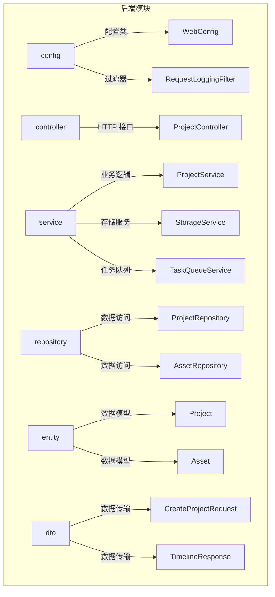
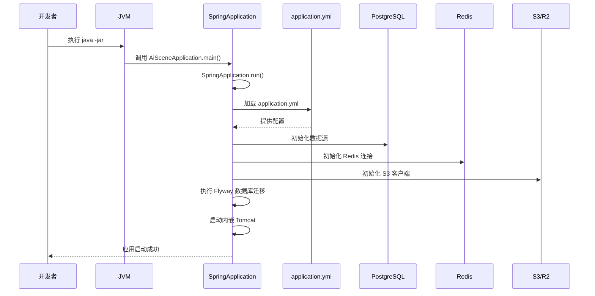
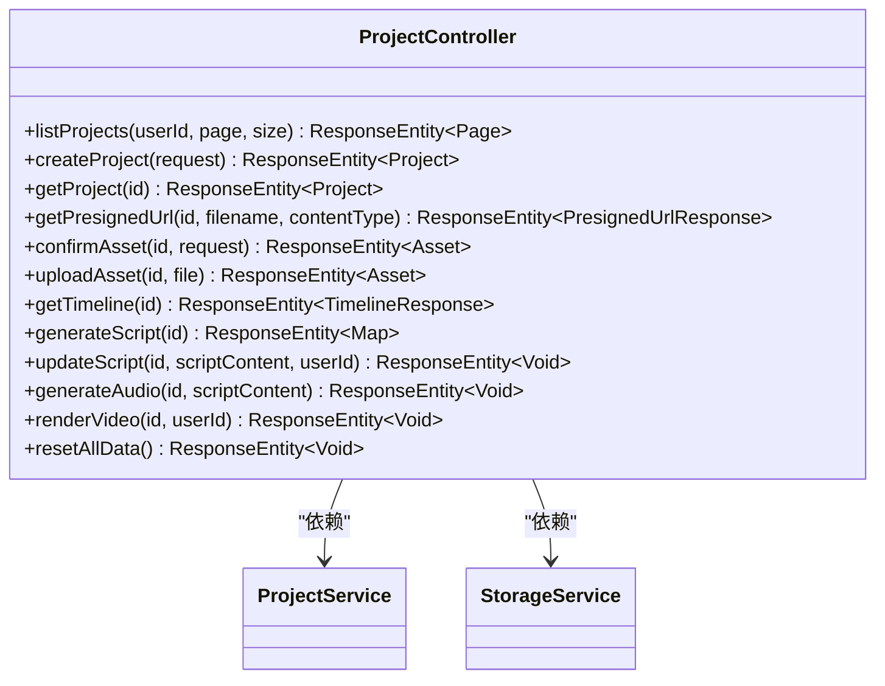
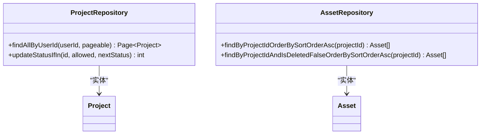
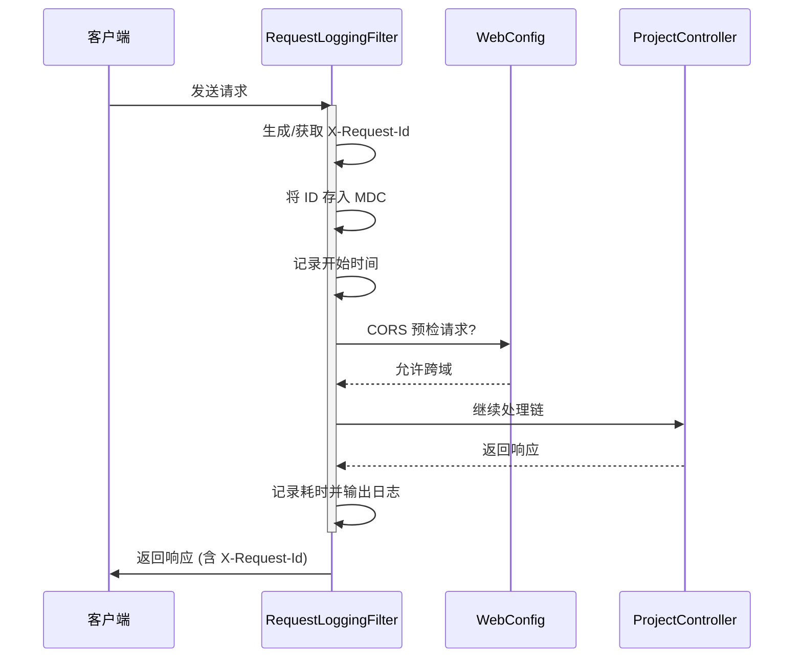
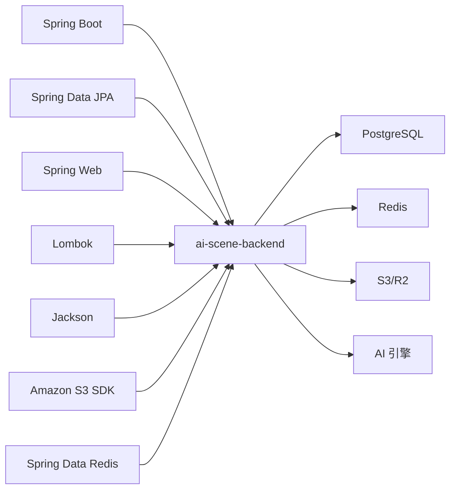

# 后端架构

<cite>
**本文档引用的文件**  
- [AiSceneApplication.java](file://backend/src/main/java/com/aiscene/AiSceneApplication.java)
- [application.yml](file://backend/src/main/resources/application.yml)
- [ProjectController.java](file://backend/src/main/java/com/aiscene/controller/ProjectController.java)
- [ProjectService.java](file://backend/src/main/java/com/aiscene/service/ProjectService.java)
- [WebConfig.java](file://backend/src/main/java/com/aiscene/config/WebConfig.java)
- [RequestLoggingFilter.java](file://backend/src/main/java/com/aiscene/config/RequestLoggingFilter.java)
- [ProjectRepository.java](file://backend/src/main/java/com/aiscene/repository/ProjectRepository.java)
- [Project.java](file://backend/src/main/java/com/aiscene/entity/Project.java)
- [StorageService.java](file://backend/src/main/java/com/aiscene/service/StorageService.java)
- [TaskQueueService.java](file://backend/src/main/java/com/aiscene/service/TaskQueueService.java)
- [CreateProjectRequest.java](file://backend/src/main/java/com/aiscene/dto/CreateProjectRequest.java)
- [AssetConfirmRequest.java](file://backend/src/main/java/com/aiscene/dto/AssetConfirmRequest.java)
- [TimelineResponse.java](file://backend/src/main/java/com/aiscene/dto/TimelineResponse.java)
- [Asset.java](file://backend/src/main/java/com/aiscene/entity/Asset.java)
- [ProjectStatus.java](file://backend/src/main/java/com/aiscene/entity/ProjectStatus.java)
- [AssetRepository.java](file://backend/src/main/java/com/aiscene/repository/AssetRepository.java)
</cite>

## 目录
1. [简介](#简介)
2. [项目结构](#项目结构)
3. [核心组件](#核心组件)
4. [架构概览](#架构概览)
5. [详细组件分析](#详细组件分析)
6. [依赖分析](#依赖分析)
7. [性能考虑](#性能考虑)
8. [故障排除指南](#故障排除指南)
9. [结论](#结论)

## 简介
本文档详细描述了 `ai-scene-to-video` 项目的后端架构，重点分析其作为“业务中台”的角色。系统基于 Spring Boot 构建，采用 MVC 模式，协调用户请求、数据库操作和与 AI 引擎的异步通信。文档将解析应用的启动流程、核心配置文件、各层职责以及关键业务逻辑的流转路径，为 Java 开发者提供清晰的理解和扩展 API 的指导。

## 项目结构
后端项目遵循标准的 Maven 目录结构，核心代码位于 `backend/src/main/java/com/aiscene/` 下，按功能分层组织。



**图示来源**
- [ProjectController.java](file://backend/src/main/java/com/aiscene/controller/ProjectController.java)
- [ProjectService.java](file://backend/src/main/java/com/aiscene/service/ProjectService.java)
- [ProjectRepository.java](file://backend/src/main/java/com/aiscene/repository/ProjectRepository.java)
- [Project.java](file://backend/src/main/java/com/aiscene/entity/Project.java)
- [Asset.java](file://backend/src/main/java/com/aiscene/entity/Asset.java)
- [CreateProjectRequest.java](file://backend/src/main/java/com/aiscene/dto/CreateProjectRequest.java)
- [TimelineResponse.java](file://backend/src/main/java/com/aiscene/dto/TimelineResponse.java)

**本节来源**
- [ProjectController.java](file://backend/src/main/java/com/aiscene/controller/ProjectController.java)
- [ProjectService.java](file://backend/src/main/java/com/aiscene/service/ProjectService.java)
- [ProjectRepository.java](file://backend/src/main/java/com/aiscene/repository/ProjectRepository.java)

## 核心组件
后端的核心组件包括 `ProjectController` 处理 HTTP 请求，`ProjectService` 封装业务逻辑，`ProjectRepository` 和 `AssetRepository` 负责数据持久化，以及 `TaskQueueService` 与 AI 引擎进行异步通信。

**本节来源**
- [ProjectController.java](file://backend/src/main/java/com/aiscene/controller/ProjectController.java)
- [ProjectService.java](file://backend/src/main/java/com/aiscene/service/ProjectService.java)
- [ProjectRepository.java](file://backend/src/main/java/com/aiscene/repository/ProjectRepository.java)
- [TaskQueueService.java](file://backend/src/main/java/com/aiscene/service/TaskQueueService.java)

## 架构概览
系统采用典型的分层架构，前端通过 HTTP 请求与后端交互。后端作为业务中台，接收请求后，由 Controller 层路由，Service 层执行核心业务逻辑（如状态管理、任务触发），Repository 层操作数据库，并通过 Redis 队列与 Python 编写的 AI 引擎（`engine/`）进行异步解耦通信。

```mermaid
graph LR
A[前端] --> |HTTP 请求| B[ProjectController]
B --> C[ProjectService]
C --> D[ProjectRepository]
C --> E[AssetRepository]
D --> F[(PostgreSQL)]
E --> F
C --> G[StorageService]
G --> H[(S3/R2)]
C --> I[TaskQueueService]
I --> J[Redis 队列]
J --> K[AI 引擎 (Python)]
K --> J
L[RequestLoggingFilter] --> B
M[WebConfig] --> B
```

**图示来源**
- [ProjectController.java](file://backend/src/main/java/com/aiscene/controller/ProjectController.java)
- [ProjectService.java](file://backend/src/main/java/com/aiscene/service/ProjectService.java)
- [ProjectRepository.java](file://backend/src/main/java/com/aiscene/repository/ProjectRepository.java)
- [AssetRepository.java](file://backend/src/main/java/com/aiscene/repository/AssetRepository.java)
- [StorageService.java](file://backend/src/main/java/com/aiscene/service/StorageService.java)
- [TaskQueueService.java](file://backend/src/main/java/com/aiscene/service/TaskQueueService.java)
- [WebConfig.java](file://backend/src/main/java/com/aiscene/config/WebConfig.java)
- [RequestLoggingFilter.java](file://backend/src/main/java/com/aiscene/config/RequestLoggingFilter.java)

## 详细组件分析

### 启动流程与核心配置分析
Spring Boot 应用的入口是 `AiSceneApplication` 类。其 `main` 方法调用 `SpringApplication.run()` 启动应用。启动时，框架会自动加载 `application.yml` 配置文件。



**图示来源**
- [AiSceneApplication.java](file://backend/src/main/java/com/aiscene/AiSceneApplication.java)
- [application.yml](file://backend/src/main/resources/application.yml)

**本节来源**
- [AiSceneApplication.java](file://backend/src/main/java/com/aiscene/AiSceneApplication.java)
- [application.yml](file://backend/src/main/resources/application.yml)

#### application.yml 配置详解
`application.yml` 文件定义了应用的核心配置：
- **server**: 设置应用端口为 `8090`。
- **spring.datasource**: 配置 PostgreSQL 数据库连接，使用环境变量注入敏感信息。
- **spring.jpa**: 配置 JPA，`ddl-auto: validate` 确保实体与数据库模式一致，实际迁移由 Flyway 管理。
- **spring.flyway**: 启用 Flyway，用于数据库版本控制和迁移。
- **spring.data.redis**: 配置 Redis 连接，用于 Celery 任务队列。
- **s3.storage**: 配置 S3 兼容的存储（如 Cloudflare R2），用于存储上传的视频和生成的文件。
- **app.celery**: 定义与 AI 引擎通信的 Redis 队列名称。
- **logging**: 配置日志级别。

**本节来源**
- [application.yml](file://backend/src/main/resources/application.yml)

### Controller 层分析
`ProjectController` 是处理项目相关 HTTP 请求的核心控制器。它使用 `@RestController` 和 `@RequestMapping("/v1/projects")` 注解，将所有 `/v1/projects` 开头的请求路由到该类。



**图示来源**
- [ProjectController.java](file://backend/src/main/java/com/aiscene/controller/ProjectController.java)
- [ProjectService.java](file://backend/src/main/java/com/aiscene/service/ProjectService.java)
- [StorageService.java](file://backend/src/main/java/com/aiscene/service/StorageService.java)

**本节来源**
- [ProjectController.java](file://backend/src/main/java/com/aiscene/controller/ProjectController.java)

#### 关键端点说明
- **`POST /v1/projects`**: 创建新项目，调用 `ProjectService.createProject()`。
- **`GET /v1/projects/{id}/timeline`**: 获取项目时间线，调用 `ProjectService.getSmartTimeline()`，返回包含资产和脚本的响应。
- **`POST /v1/projects/{id}/script`**: 触发脚本生成任务，调用 `ProjectService.generateScript()`，该方法会更新项目状态并提交任务到 AI 引擎。
- **`PUT /v1/projects/{id}/script`**: 更新脚本内容，调用 `ProjectService.updateScriptContent()`。
- **`POST /v1/projects/{id}/audio`**: 触发音频生成任务，调用 `ProjectService.generateAudio()`。
- **`POST /v1/projects/{id}/render`**: 触发视频渲染任务，调用 `ProjectService.retryRender()`。
- **`POST /v1/projects/{id}/assets/presign`**: 为前端生成 S3 预签名上传 URL，实现大文件直传。

### Service 层分析
`ProjectService` 是业务逻辑的核心，封装了项目创建、状态管理、任务触发等复杂操作。

```mermaid
flowchart TD
A[用户请求] --> B{请求类型}
B --> |创建项目| C[createProject]
B --> |上传资产| D[uploadAsset]
B --> |生成脚本| E[generateScript]
B --> |生成音频| F[generateAudio]
B --> |渲染视频| G[renderVideo]
C --> H[构建Project实体]
H --> I[projectRepository.save()]
I --> J[返回项目]
D --> K[调用storageService上传]
K --> L[构建Asset实体]
L --> M[assetRepository.save()]
M --> N[提交分析任务]
N --> O[更新项目状态为ANALYZING]
O --> P[返回资产]
E --> Q[设置状态为SCRIPT_GENERATING]
Q --> R[提交脚本生成任务]
R --> S[返回任务ID]
F --> T[设置状态为AUDIO_GENERATING]
T --> U[提交音频生成任务]
U --> V[返回]
G --> W[验证状态和数据]
W --> X[更新状态为RENDERING]
X --> Y[提交渲染任务]
Y --> Z[返回]
```

**图示来源**
- [ProjectService.java](file://backend/src/main/java/com/aiscene/service/ProjectService.java)
- [StorageService.java](file://backend/src/main/java/com/aiscene/service/StorageService.java)
- [TaskQueueService.java](file://backend/src/main/java/com/aiscene/service/TaskQueueService.java)

**本节来源**
- [ProjectService.java](file://backend/src/main/java/com/aiscene/service/ProjectService.java)

#### 核心业务逻辑
- **状态机管理**: 服务通过 `ProjectStatus` 枚举精确管理项目生命周期（如 `DRAFT`, `ANALYZING`, `SCRIPT_GENERATING`, `RENDERING`, `COMPLETED`）。每个关键操作（如上传资产、生成脚本）都会触发状态转换。
- **事务性操作**: 使用 `@Transactional` 注解确保数据库操作的原子性，例如在 `uploadAsset` 中，资产保存和项目状态更新必须同时成功或失败。
- **与 AI 引擎的协调**: 服务层是与 AI 引擎通信的枢纽。当需要 AI 处理时（如视频分析、脚本生成），`ProjectService` 会调用 `TaskQueueService` 将任务以特定格式推送到 Redis 队列，实现异步解耦。
- **所有权验证**: `retryRender` 和 `updateScriptContent` 等方法包含 `validateProjectOwnership` 逻辑，确保用户只能操作自己的项目。

### Repository 层分析
数据访问层使用 Spring Data JPA，通过 `JpaRepository` 接口简化数据库操作。



**图示来源**
- [ProjectRepository.java](file://backend/src/main/java/com/aiscene/repository/ProjectRepository.java)
- [AssetRepository.java](file://backend/src/main/java/com/aiscene/repository/AssetRepository.java)
- [Project.java](file://backend/src/main/java/com/aiscene/entity/Project.java)
- [Asset.java](file://backend/src/main/java/com/aiscene/entity/Asset.java)

**本节来源**
- [ProjectRepository.java](file://backend/src/main/java/com/aiscene/repository/ProjectRepository.java)
- [AssetRepository.java](file://backend/src/main/java/com/aiscene/repository/AssetRepository.java)

#### 关键数据模型
- **Project 实体**: 代表一个视频项目，包含 `userId`, `title`, `houseInfo` (JSON), `status`, `scriptContent`, `finalVideoUrl` 等字段。`@JdbcTypeCode(SqlTypes.JSON)` 注解支持将 `JsonNode` 映射到 PostgreSQL 的 `jsonb` 类型。
- **Asset 实体**: 代表项目中的一个视频片段，包含 `ossUrl`, `sceneLabel` (AI 分析结果), `sortOrder` (排序), `duration` 等字段。通过 `@ManyToOne` 与 `Project` 关联。

### 配置类分析
`WebConfig` 和 `RequestLoggingFilter` 是两个关键的配置类，负责应用的非功能性需求。



**图示来源**
- [RequestLoggingFilter.java](file://backend/src/main/java/com/aiscene/config/RequestLoggingFilter.java)
- [WebConfig.java](file://backend/src/main/java/com/aiscene/config/WebConfig.java)
- [ProjectController.java](file://backend/src/main/java/com/aiscene/controller/ProjectController.java)

**本节来源**
- [RequestLoggingFilter.java](file://backend/src/main/java/com/aiscene/config/RequestLoggingFilter.java)
- [WebConfig.java](file://backend/src/main/java/com/aiscene/config/WebConfig.java)

#### WebConfig
- **CORS 配置**: `addCorsMappings` 方法配置了跨域资源共享，允许来自指定域名（如 `*.tnight.xyz`）和本地开发环境的请求，支持所有 HTTP 方法。
- **静态资源处理**: `addResourceHandlers` 方法将 `/public/**` 路径映射到服务器的 `/tmp/ai-video-uploads/` 目录，用于提供本地上传的文件。

#### RequestLoggingFilter
- **请求日志记录**: 作为一个高优先级的 Servlet 过滤器，它在请求处理前后执行。
- **请求追踪**: 从请求头 `X-Request-Id` 获取或生成一个唯一 ID，并将其放入 MDC (Mapped Diagnostic Context)，确保同一线程内的所有日志都包含此 ID，便于日志追踪。
- **性能监控**: 记录每个请求的 `method`, `path`, `status` 和 `duration_ms`，为运维提供关键指标。

## 依赖分析
后端应用依赖于多个外部服务和库。



**图示来源**
- [pom.xml](file://backend/pom.xml)
- [application.yml](file://backend/src/main/resources/application.yml)

**本节来源**
- [pom.xml](file://backend/pom.xml)
- [application.yml](file://backend/src/main/resources/application.yml)

## 性能考虑
- **大文件上传**: 通过 S3 预签名 URL 实现前端直传，避免后端成为大文件传输的瓶颈。
- **异步处理**: 所有耗时的 AI 任务（分析、生成、渲染）都通过 Redis 队列异步执行，保证了 HTTP 接口的快速响应。
- **数据库优化**: 使用了 `@Query` 注解编写自定义的批量更新语句 `updateStatusIfIn`，避免了先查后改的性能问题。数据库表通过 Flyway 脚本添加了索引（如 `V4__add_index_projects_user_id.sql`）。

## 故障排除指南
- **请求失败**: 检查 `X-Request-Id` 对应的日志，查看 `RequestLoggingFilter` 输出的 `method`, `path`, `status`, `duration_ms` 信息。
- **任务未执行**: 检查 Redis 队列 (`ai-video:celery`) 是否有积压，确认 AI 引擎是否正常运行。
- **数据库连接问题**: 检查 `application.yml` 中的 `SPRING_DATASOURCE_URL` 等环境变量是否正确。
- **S3 上传失败**: 检查 `s3.storage` 配置项和 S3 存储桶的权限设置。
- **状态不更新**: 检查 `ProjectService` 中的 `@Transactional` 注解是否生效，确保数据库操作在事务中完成。

**本节来源**
- [RequestLoggingFilter.java](file://backend/src/main/java/com/aiscene/config/RequestLoggingFilter.java)
- [ProjectService.java](file://backend/src/main/java/com/aiscene/service/ProjectService.java)
- [application.yml](file://backend/src/main/resources/application.yml)

## 结论
该后端架构设计清晰，职责分明。作为“业务中台”，它成功地将用户交互、数据持久化和 AI 处理三大模块解耦。MVC 模式确保了代码的可维护性，而通过 Redis 队列与 AI 引擎的异步通信则保证了系统的响应性和可扩展性。`RequestLoggingFilter` 和 `WebConfig` 等配置类为系统提供了必要的可观测性和安全性。对于开发者而言，理解 `ProjectService` 中的状态流转和任务触发逻辑是扩展和维护此系统的关键。