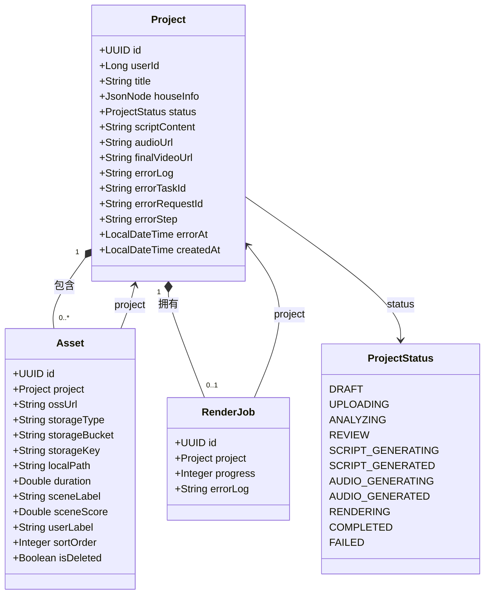

# 数据访问层

<cite>
**本文档中引用的文件**  
- [Project.java](file://backend/src/main/java/com/aiscene/entity/Project.java)
- [Asset.java](file://backend/src/main/java/com/aiscene/entity/Asset.java)
- [RenderJob.java](file://backend/src/main/java/com/aiscene/entity/RenderJob.java)
- [ProjectStatus.java](file://backend/src/main/java/com/aiscene/entity/ProjectStatus.java)
- [ProjectRepository.java](file://backend/src/main/java/com/aiscene/repository/ProjectRepository.java)
- [AssetRepository.java](file://backend/src/main/java/com/aiscene/repository/AssetRepository.java)
- [RenderJobRepository.java](file://backend/src/main/java/com/aiscene/repository/RenderJobRepository.java)
- [V1__init_schema.sql](file://backend/src/main/resources/db/migration/V1__init_schema.sql)
- [V2__add_audio_url_to_projects.sql](file://backend/src/main/resources/db/migration/V2__add_audio_url_to_projects.sql)
- [V3__add_error_fields_to_projects.sql](file://backend/src/main/resources/db/migration/V3__add_error_fields_to_projects.sql)
- [V4__add_index_projects_user_id.sql](file://backend/src/main/resources/db/migration/V4__add_index_projects_user_id.sql)
- [V5__add_storage_fields_to_assets.sql](file://backend/src/main/resources/db/migration/V5__add_storage_fields_to_assets.sql)
- [ProjectService.java](file://backend/src/main/java/com/aiscene/service/ProjectService.java)
</cite>

## 目录
1. [简介](#简介)
2. [核心实体类设计](#核心实体类设计)
   - [Project实体](#project实体)
   - [Asset实体](#asset实体)
   - [RenderJob实体](#renderjob实体)
3. [实体关系映射](#实体关系映射)
4. [仓库接口与查询方法](#仓库接口与查询方法)
   - [ProjectRepository](#projectrepository)
   - [AssetRepository](#assetrepository)
   - [RenderJobRepository](#renderjobrepository)
5. [数据库迁移脚本与实体对应关系](#数据库迁移脚本与实体对应关系)
6. [JPA实体生命周期与性能优化](#jpa实体生命周期与性能优化)
7. [开发指南](#开发指南)
8. [结论](#结论)

## 简介
本项目的数据访问层基于Spring Data JPA实现，采用标准的JPA注解进行实体映射和关系管理。数据访问层主要由三类核心组件构成：实体类（Entity）、仓库接口（Repository）和数据库迁移脚本。实体类定义了领域模型和数据库表结构的映射关系，仓库接口提供了数据访问的抽象，而Flyway迁移脚本确保了数据库模式的版本化管理。本层设计遵循了关注点分离原则，通过JPA的ORM机制实现了对象与关系数据库之间的透明转换。

## 核心实体类设计

### Project实体
`Project`实体是系统的核心聚合根，代表一个视频生成项目。该实体通过`@Entity`注解声明为JPA实体，并映射到数据库中的`projects`表。

**字段定义**：
- `id`：UUID类型，使用`@GeneratedValue(strategy = GenerationType.UUID)`实现自动生成，作为主键。
- `userId`：长整型，标识项目所属用户，对应数据库列`user_id`。
- `title`：字符串类型，存储项目标题。
- `houseInfo`：使用`JsonNode`类型存储房屋信息，通过`@JdbcTypeCode(SqlTypes.JSON)`和`@ColumnTransformer`注解支持PostgreSQL的JSONB类型，实现高效的JSON数据存储与查询。
- `status`：枚举类型`ProjectStatus`，使用`@Enumerated(EnumType.STRING)`注解将枚举值以字符串形式存储在数据库中。
- `scriptContent`：文本类型，存储生成的脚本内容，使用`columnDefinition = "text"`指定数据库列类型。
- `audioUrl`和`finalVideoUrl`：字符串类型，分别存储音频和最终视频的URL。
- `errorLog`、`errorTaskId`、`errorRequestId`、`errorStep`、`errorAt`：一组错误追踪字段，用于记录项目处理过程中发生的错误详情。
- `createdAt`：时间戳类型，使用`@CreationTimestamp`注解自动填充实体创建时间。

**Section sources**
- [Project.java](file://backend/src/main/java/com/aiscene/entity/Project.java#L17-L71)

### Asset实体
`Asset`实体表示与项目关联的媒体资产（如视频片段），通过`@Entity`注解映射到`assets`表。

**字段定义**：
- `id`：UUID类型主键，自动生成。
- `project`：与`Project`实体的多对一关系，使用`@ManyToOne(fetch = FetchType.LAZY)`实现懒加载，`@JoinColumn(name = "project_id")`指定外键列。
- `ossUrl`：字符串类型，存储资产的OSS（对象存储服务）公开URL。
- `storageType`、`storageBucket`、`storageKey`：新增的存储元数据字段，用于支持多种存储后端（如S3），默认值为"S3"。
- `localPath`：字符串类型，可选的本地存储路径。
- `duration`：双精度浮点数，存储媒体时长。
- `sceneLabel`和`sceneScore`：由AI分析生成的场景标签和置信度分数。
- `userLabel`：用户可自定义的标签。
- `sortOrder`：整数类型，用于定义资产在时间线中的排序。
- `isDeleted`：布尔类型，逻辑删除标志，默认为`false`。

**Section sources**
- [Asset.java](file://backend/src/main/java/com/aiscene/entity/Asset.java#L17-L60)

### RenderJob实体
`RenderJob`实体代表一个视频渲染任务，映射到`render_jobs`表。

**字段定义**：
- `id`：UUID类型主键，自动生成。
- `project`：与`Project`实体的多对一关系，使用`@ManyToOne(fetch = FetchType.LAZY)`实现懒加载。
- `progress`：整数类型，表示渲染任务的进度百分比（0-100）。
- `errorLog`：文本类型，存储渲染过程中发生的错误日志。

**Section sources**
- [RenderJob.java](file://backend/src/main/java/com/aiscene/entity/RenderJob.java#L17-L31)

## 实体关系映射
系统中的实体通过JPA注解建立了明确的关系映射。`Project`实体作为聚合根，与`Asset`和`RenderJob`实体形成一对多的聚合关系。

**Diagram sources**
- [Project.java](file://backend/src/main/java/com/aiscene/entity/Project.java#L17-L71)
- [Asset.java](file://backend/src/main/java/com/aiscene/entity/Asset.java#L17-L60)
- [RenderJob.java](file://backend/src/main/java/com/aiscene/entity/RenderJob.java#L17-L31)
- [ProjectStatus.java](file://backend/src/main/java/com/aiscene/entity/ProjectStatus.java#L3-L14)

## 仓库接口与查询方法

### ProjectRepository
`ProjectRepository`接口扩展了`JpaRepository`，提供了对`Project`实体的标准CRUD操作。

**自定义查询方法**：
- `findAllByUserId(Long userId, Pageable pageable)`：根据用户ID分页查询项目列表。这是一个符合Spring Data JPA命名约定的查询方法，框架会自动解析方法名并生成对应的JPQL查询。
- `updateStatusIfIn(UUID id, Collection<ProjectStatus> allowed, ProjectStatus nextStatus)`：这是一个使用`@Query`注解的自定义更新查询。它使用JPQL语法更新项目状态，但仅当当前状态在允许的状态集合中时才执行更新。此方法被`@Modifying`注解标记，表明它是一个修改查询。该方法在`ProjectService`中用于实现状态机的原子性更新，防止并发状态冲突。

**Section sources**
- [ProjectRepository.java](file://backend/src/main/java/com/aiscene/repository/ProjectRepository.java#L16-L26)

### AssetRepository
`AssetRepository`接口提供了对`Asset`实体的访问。

**自定义查询方法**：
- `findByProjectIdOrderBySortOrderAsc(UUID projectId)`：根据项目ID查询所有资产，并按`sortOrder`升序排序。
- `findByProjectIdAndIsDeletedFalseOrderBySortOrderAsc(UUID projectId)`：与上一个方法类似，但额外过滤掉已标记为删除的资产（`isDeleted = false`）。这个方法在`ProjectService`的`getSmartTimeline`等业务方法中被频繁使用，以获取项目有效的时间线资产。

**Section sources**
- [AssetRepository.java](file://backend/src/main/java/com/aiscene/repository/AssetRepository.java#L10-L14)

### RenderJobRepository
`RenderJobRepository`是一个最简化的仓库接口，仅继承了`JpaRepository`提供的所有标准方法（如`save`、`findById`、`delete`等），目前没有定义任何自定义查询方法。这表明`RenderJob`实体的访问模式较为简单，主要依赖于主键操作。

**Section sources**
- [RenderJobRepository.java](file://backend/src/main/java/com/aiscene/repository/RenderJobRepository.java#L9-L11)

## 数据库迁移脚本与实体对应关系
项目使用Flyway进行数据库版本控制，迁移脚本位于`src/main/resources/db/migration`目录下，与实体类的演化过程严格对应。

- **V1__init_schema.sql**：初始化脚本，创建`projects`、`assets`和`render_jobs`三个核心表。其表结构与初始版本的实体类完全匹配。
- **V2__add_audio_url_to_projects.sql**：添加`audio_url`列，对应`Project`实体中新增的`audioUrl`字段。
- **V3__add_error_fields_to_projects.sql**：批量添加多个错误追踪字段（`error_log`, `error_task_id`等），对应`Project`实体中为增强错误诊断能力而添加的字段。
- **V4__add_index_projects_user_id.sql**：为`projects`表的`user_id`和`created_at`列创建复合索引，显著提升按用户ID分页查询的性能，与`ProjectRepository.findAllByUserId`方法的使用场景直接相关。
- **V5__add_storage_fields_to_assets.sql**：为`assets`表添加`storage_type`, `storage_bucket`, `storage_key`, `local_path`四个新列，支持更灵活的存储后端管理，对应`Asset`实体中新增的存储元数据字段。

这种脚本化、版本化的数据库变更管理方式，确保了数据库模式的演进是可追溯、可重复和可协作的。

**Diagram sources**
- [V1__init_schema.sql](file://backend/src/main/resources/db/migration/V1__init_schema.sql#L1-L32)
- [V2__add_audio_url_to_projects.sql](file://backend/src/main/resources/db/migration/V2__add_audio_url_to_projects.sql#L1-L2)
- [V3__add_error_fields_to_projects.sql](file://backend/src/main/resources/db/migration/V3__add_error_fields_to_projects.sql#L1-L6)
- [V4__add_index_projects_user_id.sql](file://backend/src/main/resources/db/migration/V4__add_index_projects_user_id.sql#L1-L2)
- [V5__add_storage_fields_to_assets.sql](file://backend/src/main/resources/db/migration/V5__add_storage_fields_to_assets.sql#L1-L6)

**Section sources**
- [V1__init_schema.sql](file://backend/src/main/resources/db/migration/V1__init_schema.sql#L1-L32)
- [V2__add_audio_url_to_projects.sql](file://backend/src/main/resources/db/migration/V2__add_audio_url_to_projects.sql#L1-L2)
- [V3__add_error_fields_to_projects.sql](file://backend/src/main/resources/db/migration/V3__add_error_fields_to_projects.sql#L1-L6)
- [V4__add_index_projects_user_id.sql](file://backend/src/main/resources/db/migration/V4__add_index_projects_user_id.sql#L1-L2)
- [V5__add_storage_fields_to_assets.sql](file://backend/src/main/resources/db/migration/V5__add_storage_fields_to_assets.sql#L1-L6)

## JPA实体生命周期与性能优化
本项目的数据访问层在设计时充分考虑了实体生命周期管理和性能优化。

**实体生命周期**：
- **状态管理**：`Project`实体的状态流转（`ProjectStatus`）是整个业务流程的核心。状态的变更通过`ProjectRepository.updateStatusIfIn`方法进行原子性更新，确保了状态机的完整性。例如，在`ProjectService.confirmAsset`方法中，会根据当前状态决定是否需要升级到`UPLOADING`或`ANALYZING`状态。
- **懒加载（Lazy Loading）**：`Asset`和`RenderJob`实体对`Project`的引用均配置为`FetchType.LAZY`。这意味着在查询`Asset`时，除非显式访问`project`属性，否则不会加载关联的`Project`实体，有效避免了N+1查询问题和不必要的数据加载。
- **级联操作**：虽然在当前代码中未显式定义级联（如`cascade = CascadeType.ALL`），但业务逻辑（如`ProjectService.resetAllData`）通过`JdbcTemplate`执行`TRUNCATE`语句来清理数据，这表明聚合根的生命周期管理主要在服务层通过显式操作完成。

**性能优化建议**：
1. **索引优化**：已为`projects.user_id`创建了复合索引，这是正确的做法。未来如果按状态查询项目变得频繁，应考虑为`status`列添加索引。
2. **批量操作**：对于大量`Asset`的插入或更新，应考虑使用JPA的批量操作功能或`JdbcTemplate`来提高性能。
3. **查询优化**：对于复杂的只读查询，可以考虑使用投影（Projection）或`@Query`注解编写原生SQL，以避免加载不必要的实体字段。
4. **缓存**：对于读多写少且不常变更的数据（如`ProjectStatus`枚举），可以引入Spring Cache进行缓存。

**Section sources**
- [Project.java](file://backend/src/main/java/com/aiscene/entity/Project.java#L17-L71)
- [Asset.java](file://backend/src/main/java/com/aiscene/entity/Asset.java#L23-L25)
- [RenderJob.java](file://backend/src/main/java/com/aiscene/entity/RenderJob.java#L23-L25)
- [ProjectRepository.java](file://backend/src/main/java/com/aiscene/repository/ProjectRepository.java#L20-L26)
- [ProjectService.java](file://backend/src/main/java/com/aiscene/service/ProjectService.java#L332-L333)

## 开发指南
为开发者提供以下关于数据访问层的实践指南：

**添加新的数据访问方法**：
1. 在相应的`Repository`接口中定义方法签名。
2. 对于简单查询，遵循Spring Data JPA的命名约定（如`findByTitleContaining`）。
3. 对于复杂查询，使用`@Query`注解编写JPQL或原生SQL。如果是更新/删除操作，务必加上`@Modifying`注解。
4. 在`Service`层注入仓库并调用新方法。

**修改现有实体结构**：
1. 在实体类（`.java`）中修改字段或关系。
2. 编写一个新的Flyway迁移脚本（如`V6__xxx.sql`），使用`ALTER TABLE`语句修改数据库表结构。
3. 确保迁移脚本的逻辑与实体类的变更完全一致。
4. 更新相关的业务逻辑（`Service`类）以适应新的数据结构。
5. 编写单元测试验证变更的正确性。

**最佳实践**：
- 始终使用`@Transactional`注解来管理数据库事务，确保数据一致性。
- 优先使用懒加载，并在需要时通过`JOIN FETCH`在查询中显式加载关联实体。
- 避免在实体中放置复杂的业务逻辑，保持实体的“贫血”状态，将业务逻辑集中在`Service`层。

**Section sources**
- [ProjectRepository.java](file://backend/src/main/java/com/aiscene/repository/ProjectRepository.java#L16-L26)
- [V5__add_storage_fields_to_assets.sql](file://backend/src/main/resources/db/migration/V5__add_storage_fields_to_assets.sql#L1-L6)
- [ProjectService.java](file://backend/src/main/java/com/aiscene/service/ProjectService.java#L49-L84)

## 结论
本项目的数据访问层设计清晰、结构合理。通过Spring Data JPA的强大功能，实现了实体与数据库表的高效映射。实体类设计充分考虑了业务需求，关系映射准确，仓库接口提供了必要的数据访问能力。Flyway的引入确保了数据库模式的可管理性和可追溯性。整体设计遵循了良好的分层架构原则，为系统的稳定性和可维护性奠定了坚实的基础。未来的优化方向可以集中在更精细的性能调优和引入更复杂的查询模式上。