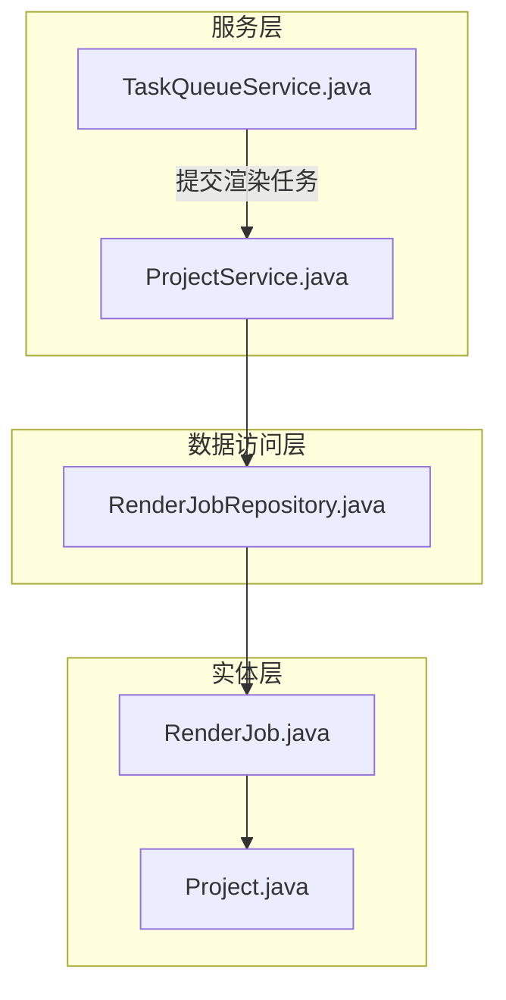
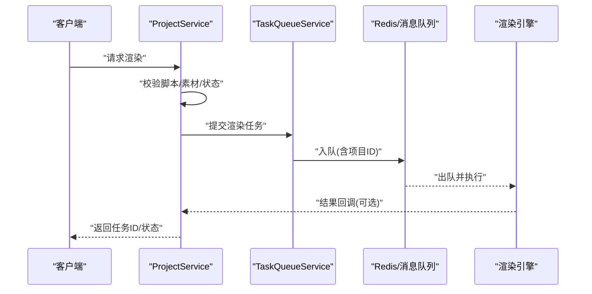
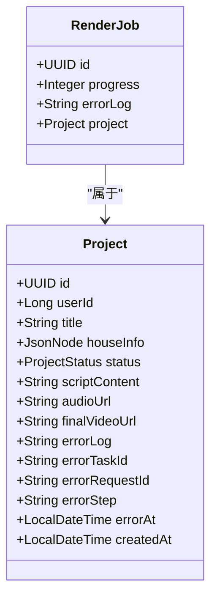
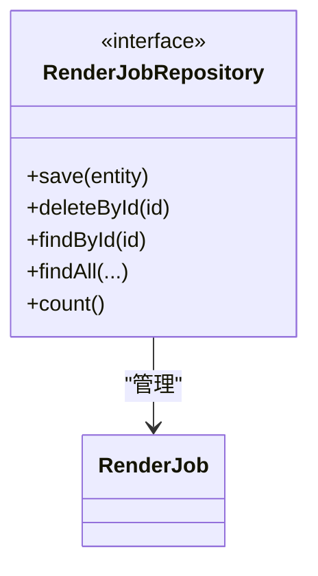
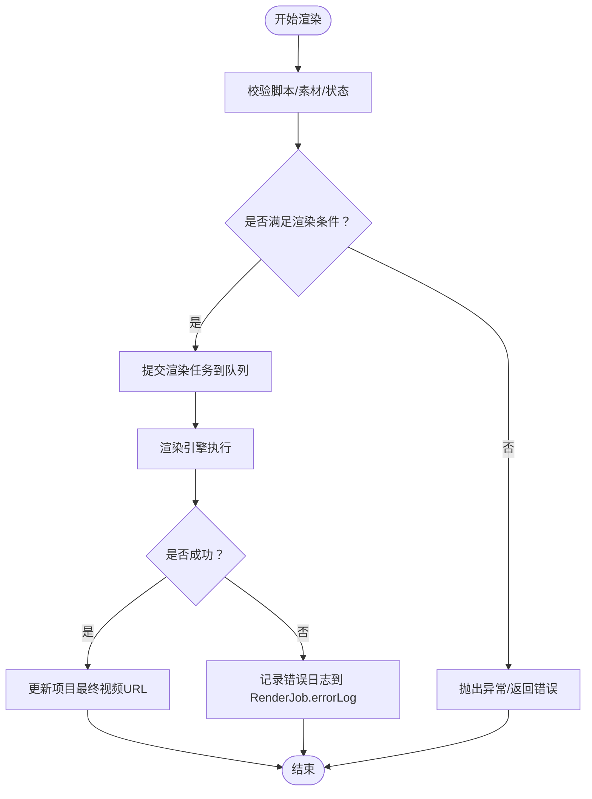
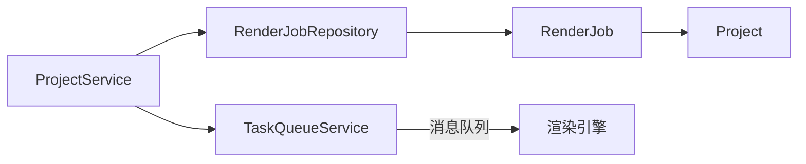

# 渲染任务数据访问

<cite>
**本文引用的文件**
- [RenderJob.java](file://backend/src/main/java/com/aiscene/entity/RenderJob.java)
- [RenderJobRepository.java](file://backend/src/main/java/com/aiscene/repository/RenderJobRepository.java)
- [Project.java](file://backend/src/main/java/com/aiscene/entity/Project.java)
- [ProjectStatus.java](file://backend/src/main/java/com/aiscene/entity/ProjectStatus.java)
- [TaskQueueService.java](file://backend/src/main/java/com/aiscene/service/TaskQueueService.java)
- [ProjectService.java](file://backend/src/main/java/com/aiscene/service/ProjectService.java)
</cite>

## 目录
1. [简介](#简介)
2. [项目结构](#项目结构)
3. [核心组件](#核心组件)
4. [架构总览](#架构总览)
5. [详细组件分析](#详细组件分析)
6. [依赖关系分析](#依赖关系分析)
7. [性能考量](#性能考量)
8. [故障排查指南](#故障排查指南)
9. [结论](#结论)

## 简介
本文件面向后端开发者与产品/测试同学，系统性梳理“渲染任务”相关的数据模型与数据访问层设计，重点说明 RenderJob 实体的字段结构、与 Project 的关联方式、以及在渲染流程中如何通过 Repository 进行任务状态的持久化。同时给出在 TaskQueueService 或 ProjectService 中创建与更新 RenderJob 的推荐模式，并说明如何在渲染失败时记录错误信息。

## 项目结构
围绕渲染任务的数据访问，相关代码主要分布在以下模块：
- 实体层：RenderJob（渲染任务）、Project（项目）
- 数据访问层：RenderJobRepository（JPA 仓库）
- 服务层：TaskQueueService（任务队列）、ProjectService（项目业务）

图表来源
- [RenderJob.java](file://backend/src/main/java/com/aiscene/entity/RenderJob.java#L1-L31)
- [Project.java](file://backend/src/main/java/com/aiscene/entity/Project.java#L1-L72)
- [RenderJobRepository.java](file://backend/src/main/java/com/aiscene/repository/RenderJobRepository.java#L1-L12)
- [TaskQueueService.java](file://backend/src/main/java/com/aiscene/service/TaskQueueService.java#L1-L180)
- [ProjectService.java](file://backend/src/main/java/com/aiscene/service/ProjectService.java#L1-L356)

章节来源
- [RenderJob.java](file://backend/src/main/java/com/aiscene/entity/RenderJob.java#L1-L31)
- [RenderJobRepository.java](file://backend/src/main/java/com/aiscene/repository/RenderJobRepository.java#L1-L12)
- [Project.java](file://backend/src/main/java/com/aiscene/entity/Project.java#L1-L72)
- [TaskQueueService.java](file://backend/src/main/java/com/aiscene/service/TaskQueueService.java#L1-L180)
- [ProjectService.java](file://backend/src/main/java/com/aiscene/service/ProjectService.java#L1-L356)

## 核心组件
- RenderJob 实体：用于追踪单个视频渲染任务的状态与错误信息，包含任务标识、所属项目、进度、错误日志等字段。
- RenderJobRepository 接口：基于 Spring Data JPA 提供标准 CRUD 能力，不扩展自定义查询方法。
- Project 实体：承载项目级状态与最终视频地址等信息；渲染流程由 ProjectService 驱动。
- TaskQueueService：负责将渲染任务投递到消息队列，渲染过程本身由外部引擎执行。
- ProjectService：协调项目生命周期与渲染前置条件，调用 TaskQueueService 投递渲染任务。

章节来源
- [RenderJob.java](file://backend/src/main/java/com/aiscene/entity/RenderJob.java#L1-L31)
- [RenderJobRepository.java](file://backend/src/main/java/com/aiscene/repository/RenderJobRepository.java#L1-L12)
- [Project.java](file://backend/src/main/java/com/aiscene/entity/Project.java#L1-L72)
- [ProjectStatus.java](file://backend/src/main/java/com/aiscene/entity/ProjectStatus.java#L1-L16)
- [TaskQueueService.java](file://backend/src/main/java/com/aiscene/service/TaskQueueService.java#L1-L180)
- [ProjectService.java](file://backend/src/main/java/com/aiscene/service/ProjectService.java#L1-L356)

## 架构总览
渲染任务的数据流概览如下：
- 业务侧通过 ProjectService 触发渲染流程，校验前置条件并投递渲染任务到消息队列。
- 外部渲染引擎消费任务并执行实际渲染，期间可将任务状态与错误信息写回数据库（如需）。
- RenderJobRepository 提供标准的增删改查能力，便于在需要时对渲染任务进行持久化与查询。

图表来源
- [ProjectService.java](file://backend/src/main/java/com/aiscene/service/ProjectService.java#L196-L230)
- [TaskQueueService.java](file://backend/src/main/java/com/aiscene/service/TaskQueueService.java#L87-L107)

## 详细组件分析

### RenderJob 实体
- 字段说明
  - id：任务唯一标识，UUID 类型。
  - project：与 Project 的多对一关联，外键为 project_id。
  - progress：整数型进度值，可用于前端展示渲染进度。
  - errorLog：文本型错误日志，用于记录渲染失败时的错误详情。
- 关联关系
  - 使用 @ManyToOne + @JoinColumn 建立与 Project 的外键关联，fetch 默认延迟加载，避免不必要的 N+1 查询。
- 设计要点
  - 字段简洁，聚焦渲染任务的“状态与错误”两大关键面，便于与渲染引擎协作。
  - 未包含输出 URL 字段，输出 URL 可由 Project.finalVideoUrl 统一管理，避免冗余。

图表来源
- [RenderJob.java](file://backend/src/main/java/com/aiscene/entity/RenderJob.java#L1-L31)
- [Project.java](file://backend/src/main/java/com/aiscene/entity/Project.java#L1-L72)
- [ProjectStatus.java](file://backend/src/main/java/com/aiscene/entity/ProjectStatus.java#L1-L16)

章节来源
- [RenderJob.java](file://backend/src/main/java/com/aiscene/entity/RenderJob.java#L1-L31)
- [Project.java](file://backend/src/main/java/com/aiscene/entity/Project.java#L1-L72)
- [ProjectStatus.java](file://backend/src/main/java/com/aiscene/entity/ProjectStatus.java#L1-L16)

### RenderJobRepository 接口
- 继承关系
  - 继承 JpaRepository<RenderJob, UUID>，天然具备按 UUID 主键的 CRUD 能力。
- 方法能力
  - 标准 CRUD：保存、删除、按主键查找、分页、排序等。
  - 未扩展自定义查询方法，所有查询均通过父类提供的方法实现。
- 使用建议
  - 若未来需要按项目或状态查询，可在当前接口上新增方法签名，保持与现有接口一致的泛型参数。

图表来源
- [RenderJobRepository.java](file://backend/src/main/java/com/aiscene/repository/RenderJobRepository.java#L1-L12)

章节来源
- [RenderJobRepository.java](file://backend/src/main/java/com/aiscene/repository/RenderJobRepository.java#L1-L12)

### 与 Project 的关联与渲染流程
- 关联方式
  - RenderJob.project 指向 Project，形成“一个项目可对应多个渲染任务”的一对多关系（从 Project 视角）。
- 渲染流程中的角色
  - ProjectService 在准备就绪后，调用 TaskQueueService 提交渲染任务至消息队列。
  - 渲染引擎执行完成后，若需要回写任务状态或错误信息，可通过 RenderJobRepository 对任务进行持久化。
- 状态流转
  - 项目状态由 Project.status 表征，渲染阶段为 RENDERING；渲染成功后通常由 Project.finalVideoUrl 记录最终视频地址。

图表来源
- [ProjectService.java](file://backend/src/main/java/com/aiscene/service/ProjectService.java#L196-L230)
- [TaskQueueService.java](file://backend/src/main/java/com/aiscene/service/TaskQueueService.java#L87-L107)
- [RenderJob.java](file://backend/src/main/java/com/aiscene/entity/RenderJob.java#L1-L31)
- [Project.java](file://backend/src/main/java/com/aiscene/entity/Project.java#L1-L72)

章节来源
- [ProjectService.java](file://backend/src/main/java/com/aiscene/service/ProjectService.java#L196-L230)
- [TaskQueueService.java](file://backend/src/main/java/com/aiscene/service/TaskQueueService.java#L87-L107)
- [RenderJob.java](file://backend/src/main/java/com/aiscene/entity/RenderJob.java#L1-L31)
- [Project.java](file://backend/src/main/java/com/aiscene/entity/Project.java#L1-L72)

### 在服务层创建与更新 RenderJob 的代码模式
- 创建 RenderJob 的模式
  - 在需要持久化渲染任务的场景下，可在服务层构造 RenderJob 实例并调用 RenderJobRepository.save 进行保存。
  - 示例路径（不展示具体代码）：[创建 RenderJob 的调用点示例](file://backend/src/main/java/com/aiscene/service/ProjectService.java#L196-L230)
- 更新 RenderJob 的模式
  - 当渲染过程中产生进度或错误信息时，先通过 RenderJobRepository.findById 获取实体，再设置 progress 或 errorLog 并保存。
  - 示例路径（不展示具体代码）：[更新 RenderJob 的调用点示例](file://backend/src/main/java/com/aiscene/service/ProjectService.java#L196-L230)

章节来源
- [RenderJobRepository.java](file://backend/src/main/java/com/aiscene/repository/RenderJobRepository.java#L1-L12)
- [ProjectService.java](file://backend/src/main/java/com/aiscene/service/ProjectService.java#L196-L230)

### 错误信息存储与处理
- RenderJob.errorLog
  - 用于记录渲染失败时的错误详情，便于前端或运营查看。
- Project.errorLog / errorStep / errorRequestId / errorTaskId / errorAt
  - 项目级错误信息用于记录整体流程中的错误上下文，与任务级错误可互补使用。
- 建议
  - 在渲染失败回调中，优先将错误信息写入 RenderJob.errorLog，并同步更新 Project.error* 字段以保持一致性。
  - 对于可重试的错误，结合 Project.status 与 ProjectService 的重试逻辑进行处理。

章节来源
- [RenderJob.java](file://backend/src/main/java/com/aiscene/entity/RenderJob.java#L1-L31)
- [Project.java](file://backend/src/main/java/com/aiscene/entity/Project.java#L1-L72)
- [ProjectService.java](file://backend/src/main/java/com/aiscene/service/ProjectService.java#L336-L345)

## 依赖关系分析
- RenderJob 依赖 Project（多对一），通过外键 project_id 关联。
- RenderJobRepository 依赖 JPA/Hibernate 提供的通用 CRUD 能力。
- ProjectService 依赖 RenderJobRepository 以持久化渲染任务；同时依赖 TaskQueueService 将渲染任务投递到消息队列。
- TaskQueueService 与外部渲染引擎交互，不直接依赖 RenderJobRepository。

图表来源
- [RenderJob.java](file://backend/src/main/java/com/aiscene/entity/RenderJob.java#L1-L31)
- [Project.java](file://backend/src/main/java/com/aiscene/entity/Project.java#L1-L72)
- [RenderJobRepository.java](file://backend/src/main/java/com/aiscene/repository/RenderJobRepository.java#L1-L12)
- [ProjectService.java](file://backend/src/main/java/com/aiscene/service/ProjectService.java#L1-L356)
- [TaskQueueService.java](file://backend/src/main/java/com/aiscene/service/TaskQueueService.java#L1-L180)

章节来源
- [RenderJob.java](file://backend/src/main/java/com/aiscene/entity/RenderJob.java#L1-L31)
- [Project.java](file://backend/src/main/java/com/aiscene/entity/Project.java#L1-L72)
- [RenderJobRepository.java](file://backend/src/main/java/com/aiscene/repository/RenderJobRepository.java#L1-L12)
- [ProjectService.java](file://backend/src/main/java/com/aiscene/service/ProjectService.java#L1-L356)
- [TaskQueueService.java](file://backend/src/main/java/com/aiscene/service/TaskQueueService.java#L1-L180)

## 性能考量
- 延迟加载：RenderJob.project 使用延迟加载，避免无谓的关联查询，降低查询开销。
- 分页与排序：如需按项目或状态查询 RenderJob，建议在 RenderJobRepository 上添加分页/排序查询方法，减少一次性加载过多任务。
- 事务边界：在保存 RenderJob 时遵循最小事务原则，避免长事务阻塞。
- 缓存策略：对于高频读取的任务状态，可在应用层引入缓存（如 Redis），降低数据库压力。

## 故障排查指南
- 渲染任务未入库
  - 检查是否在服务层调用了 RenderJobRepository.save。
  - 确认事务已提交（例如在异步回调中确保事务完成后再持久化）。
- 任务状态不一致
  - 对比 Project.status 与 RenderJob.progress/errorLog 是否同步更新。
  - 核查错误日志是否正确写入 RenderJob.errorLog。
- 外部引擎未执行
  - 检查 TaskQueueService 是否成功将任务入队，确认消息队列连接与路由配置正确。
- 查询性能问题
  - 为 RenderJob 增加必要的索引（如 project_id、created_at），优化按项目维度的查询。

## 结论
RenderJob 实体以简洁的字段覆盖了渲染任务的核心需求：任务标识、所属项目、进度与错误日志。RenderJobRepository 通过继承 JpaRepository 提供标准 CRUD 能力，无需额外扩展即可满足基本持久化需求。在渲染流程中，ProjectService 负责触发与协调，TaskQueueService 负责投递任务，而 RenderJobRepository 则为需要持久化的任务状态提供可靠的数据通道。建议后续根据业务演进，在 RenderJobRepository 上补充常用查询方法，并完善错误信息与状态同步机制，以提升可观测性与可维护性。