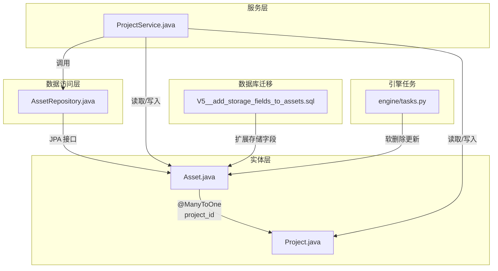
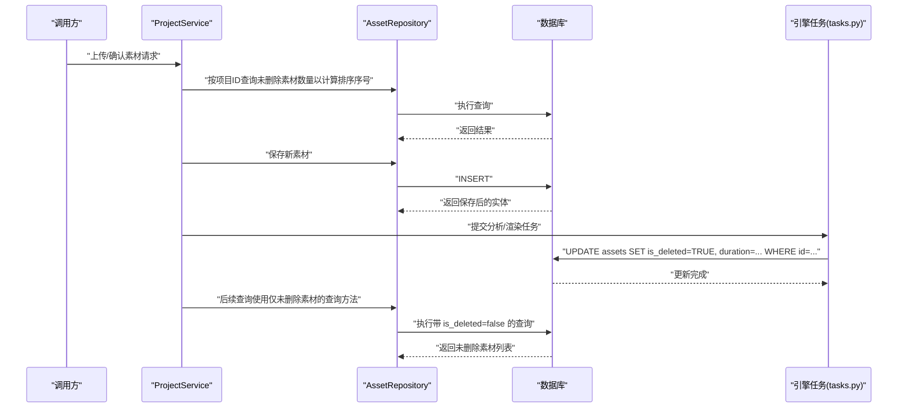
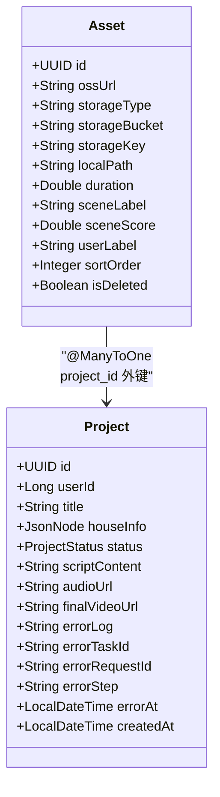
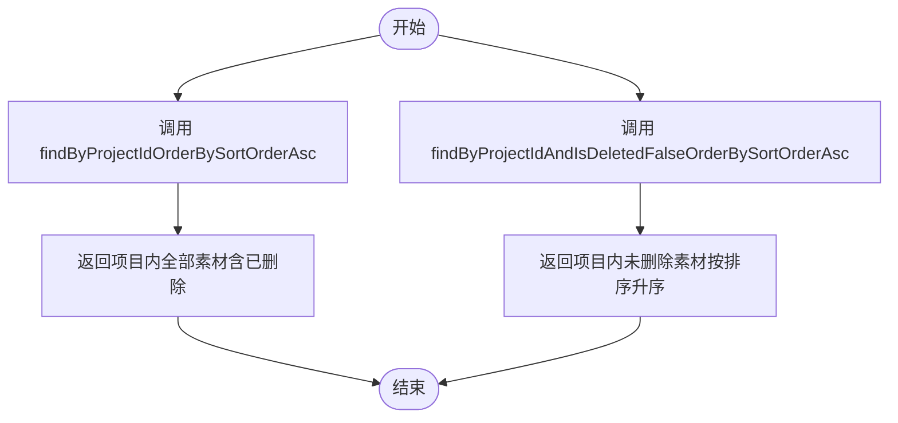
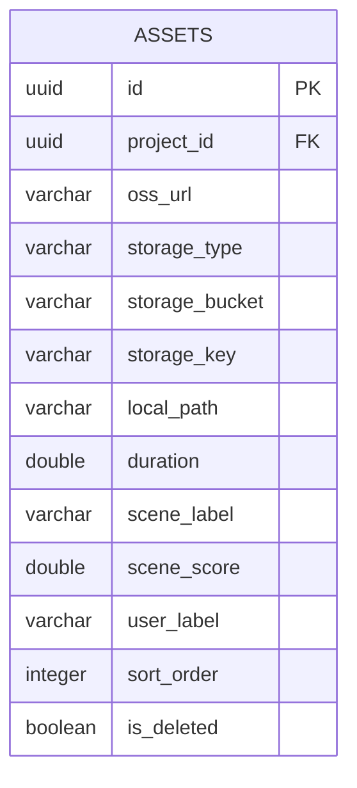
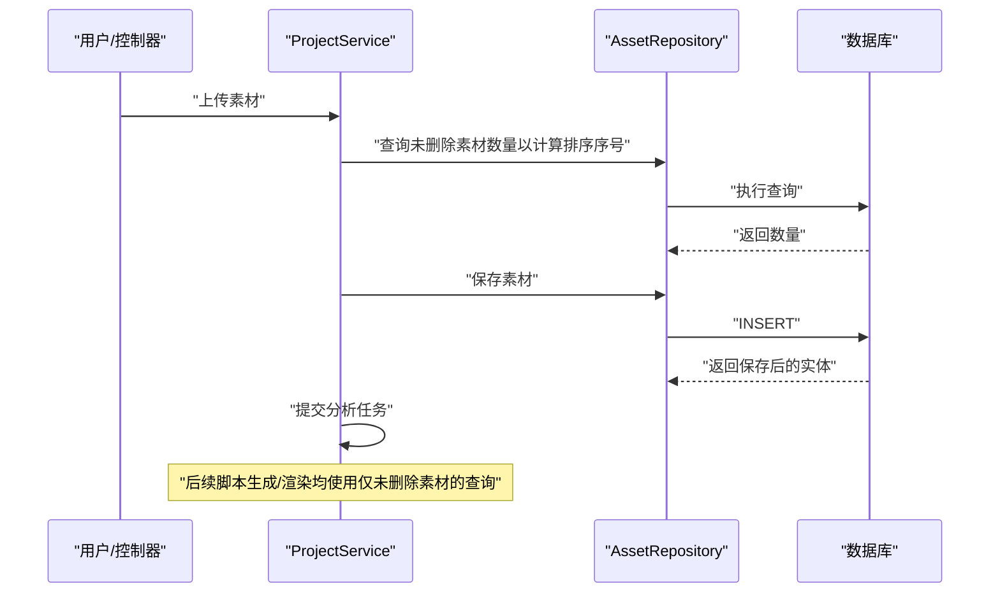
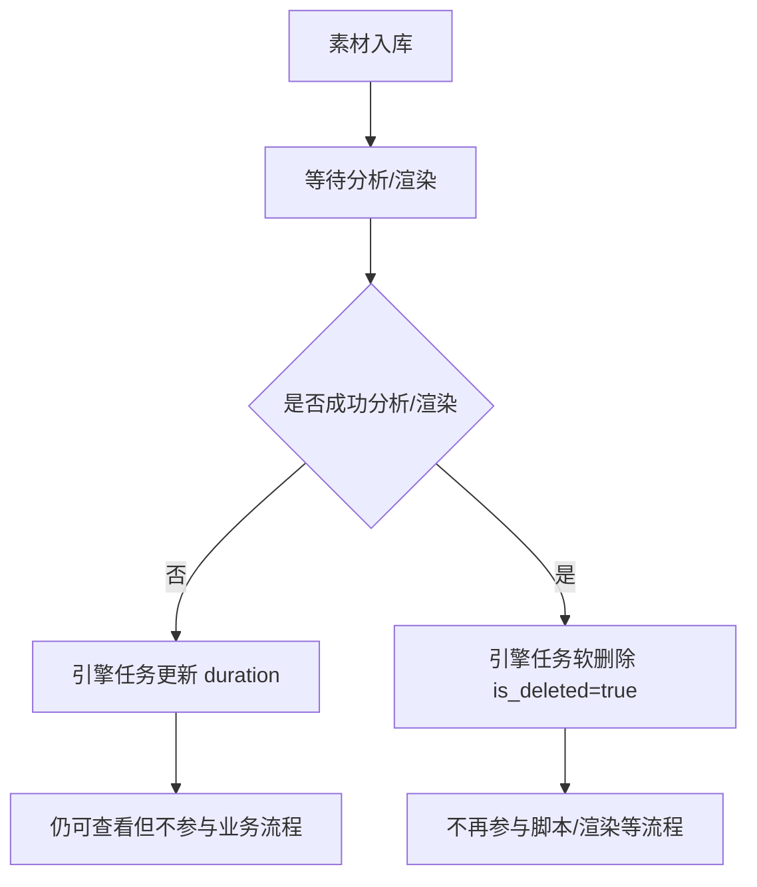
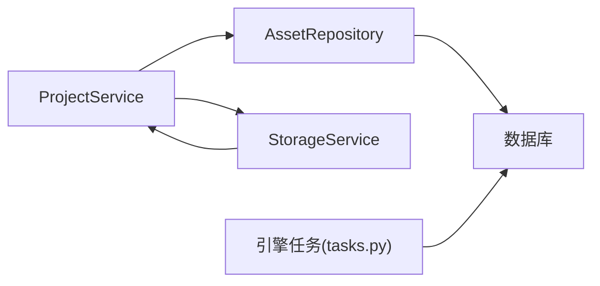

# 素材数据访问

<cite>
**本文引用的文件列表**
- [Asset.java](file://backend/src/main/java/com/aiscene/entity/Asset.java)
- [AssetRepository.java](file://backend/src/main/java/com/aiscene/repository/AssetRepository.java)
- [Project.java](file://backend/src/main/java/com/aiscene/entity/Project.java)
- [ProjectService.java](file://backend/src/main/java/com/aiscene/service/ProjectService.java)
- [V5__add_storage_fields_to_assets.sql](file://backend/src/main/resources/db/migration/V5__add_storage_fields_to_assets.sql)
- [tasks.py](file://engine/tasks.py)
</cite>

## 目录
1. [简介](#简介)
2. [项目结构](#项目结构)
3. [核心组件](#核心组件)
4. [架构总览](#架构总览)
5. [详细组件分析](#详细组件分析)
6. [依赖分析](#依赖分析)
7. [性能考虑](#性能考虑)
8. [故障排查指南](#故障排查指南)
9. [结论](#结论)

## 简介
本文件聚焦于素材（Asset）实体及其仓库接口的实现与使用，系统性说明：
- Asset 实体的关键字段与与 Project 的 @ManyToOne 关系
- AssetRepository 中两个查询方法的业务用途：获取项目内全部素材与仅获取未删除素材
- V5 迁移脚本对素材存储字段的扩展
- 在 ProjectService 中如何通过 assetRepository 管理素材生命周期（上传、确认、排序、脚本生成、渲染等），并强调软删除模式的实现与查询过滤的最佳实践

## 项目结构
围绕素材数据访问的相关文件组织如下：
- 实体层：Asset、Project
- 数据访问层：AssetRepository
- 服务层：ProjectService
- 数据库迁移：V5__add_storage_fields_to_assets.sql
- 引擎侧软删除更新：engine/tasks.py

图表来源
- [Asset.java](file://backend/src/main/java/com/aiscene/entity/Asset.java#L1-L61)
- [Project.java](file://backend/src/main/java/com/aiscene/entity/Project.java#L1-L72)
- [AssetRepository.java](file://backend/src/main/java/com/aiscene/repository/AssetRepository.java#L1-L15)
- [ProjectService.java](file://backend/src/main/java/com/aiscene/service/ProjectService.java#L1-L356)
- [V5__add_storage_fields_to_assets.sql](file://backend/src/main/resources/db/migration/V5__add_storage_fields_to_assets.sql#L1-L6)
- [tasks.py](file://engine/tasks.py#L524-L536)

章节来源
- [Asset.java](file://backend/src/main/java/com/aiscene/entity/Asset.java#L1-L61)
- [AssetRepository.java](file://backend/src/main/java/com/aiscene/repository/AssetRepository.java#L1-L15)
- [Project.java](file://backend/src/main/java/com/aiscene/entity/Project.java#L1-L72)
- [ProjectService.java](file://backend/src/main/java/com/aiscene/service/ProjectService.java#L1-L356)
- [V5__add_storage_fields_to_assets.sql](file://backend/src/main/resources/db/migration/V5__add_storage_fields_to_assets.sql#L1-L6)
- [tasks.py](file://engine/tasks.py#L524-L536)

## 核心组件
- Asset 实体：包含素材的存储信息（ossUrl、storageType、storageBucket、storageKey、localPath）、时长、场景标签、用户标签、排序序号、软删除标记等；与 Project 建立多对一关系。
- AssetRepository 接口：提供按项目 ID 查询素材并按排序字段升序排列的方法，其中一条方法显式排除已软删除的素材。
- ProjectService 服务：在素材生命周期各阶段（上传、确认、更新、脚本生成、渲染）通过 AssetRepository 完成数据读写与状态推进。

章节来源
- [Asset.java](file://backend/src/main/java/com/aiscene/entity/Asset.java#L1-L61)
- [AssetRepository.java](file://backend/src/main/java/com/aiscene/repository/AssetRepository.java#L1-L15)
- [ProjectService.java](file://backend/src/main/java/com/aiscene/service/ProjectService.java#L1-L356)

## 架构总览
素材数据访问的整体流程：
- 控制器/上层逻辑触发 ProjectService 的素材操作
- ProjectService 调用 AssetRepository 完成查询与持久化
- 引擎任务在后台将素材标记为软删除并补充时长等信息
- 业务层始终通过“仅查询未删除素材”的方式保证可见性

图表来源
- [ProjectService.java](file://backend/src/main/java/com/aiscene/service/ProjectService.java#L49-L84)
- [ProjectService.java](file://backend/src/main/java/com/aiscene/service/ProjectService.java#L252-L284)
- [ProjectService.java](file://backend/src/main/java/com/aiscene/service/ProjectService.java#L287-L318)
- [AssetRepository.java](file://backend/src/main/java/com/aiscene/repository/AssetRepository.java#L10-L14)
- [tasks.py](file://engine/tasks.py#L524-L536)

## 详细组件分析

### Asset 实体与关系
- 关键字段与含义
  - projectId：通过 @ManyToOne 关联到 Project.id
  - originalUrl/processedUrl：通过 ossUrl 字段统一承载对外可访问的 URL
  - storageType/storageBucket/storageKey/localPath：存储后端类型、桶名、对象键、本地路径
  - duration：素材时长，由引擎任务补充
  - sceneLabel/userLabel：场景标签与用户标签，支持智能排序
  - sortOrder：素材在项目内的顺序
  - isDeleted：软删除标记，默认 false
- 关系映射
  - @ManyToOne(fetch = LAZY) 指向 Project，外键列名为 project_id
  - 一对多关系由 Project 侧维护（见 Project 实体）

图表来源
- [Asset.java](file://backend/src/main/java/com/aiscene/entity/Asset.java#L1-L61)
- [Project.java](file://backend/src/main/java/com/aiscene/entity/Project.java#L1-L72)

章节来源
- [Asset.java](file://backend/src/main/java/com/aiscene/entity/Asset.java#L1-L61)
- [Project.java](file://backend/src/main/java/com/aiscene/entity/Project.java#L1-L72)

### AssetRepository 查询方法与业务用途
- findByProjectIdOrderBySortOrderAsc
  - 用途：按项目 ID 获取该项目内所有素材，并按排序序号升序排列
  - 典型场景：展示完整素材列表、批量处理或重排素材
- findByProjectIdAndIsDeletedFalseOrderBySortOrderAsc
  - 用途：按项目 ID 获取该项目内未被软删除的素材，并按排序序号升序排列
  - 典型场景：脚本生成、渲染管线、时间轴展示等业务流程，确保只处理有效素材

图表来源
- [AssetRepository.java](file://backend/src/main/java/com/aiscene/repository/AssetRepository.java#L10-L14)

章节来源
- [AssetRepository.java](file://backend/src/main/java/com/aiscene/repository/AssetRepository.java#L10-L14)

### V5 迁移脚本：素材存储字段扩展
- 扩展字段
  - storage_type：存储类型，默认 S3
  - storage_bucket：存储桶名称
  - storage_key：对象键
  - local_path：本地路径
- 影响范围
  - 为素材提供统一的存储抽象，便于未来切换存储后端或兼容本地存储

图表来源
- [V5__add_storage_fields_to_assets.sql](file://backend/src/main/resources/db/migration/V5__add_storage_fields_to_assets.sql#L1-L6)

章节来源
- [V5__add_storage_fields_to_assets.sql](file://backend/src/main/resources/db/migration/V5__add_storage_fields_to_assets.sql#L1-L6)

### ProjectService 中的素材生命周期管理
- 上传素材（uploadAsset/uploadAssetLocal）
  - 计算下一个排序序号：基于“未删除素材”的数量
  - 保存素材并提交分析任务
- 确认素材（confirmAsset）
  - 依据对象键生成公开 URL，保存素材并提交分析任务
  - 若项目状态为草稿或上传中，则更新为分析中
- 更新素材（updateAsset）
  - 支持更新用户标签、场景标签与排序序号
- 生成脚本（generateScript）
  - 仅从“未删除素材”中提取数据，构建时间线输入
- 渲染视频（renderVideo）
  - 仅从“未删除素材”中提取数据，校验项目状态后提交渲染任务
- 时间轴展示（getSmartTimeline）
  - 仅展示“未删除素材”，并根据场景标签进行优先级排序

图表来源
- [ProjectService.java](file://backend/src/main/java/com/aiscene/service/ProjectService.java#L252-L284)
- [ProjectService.java](file://backend/src/main/java/com/aiscene/service/ProjectService.java#L287-L318)
- [ProjectService.java](file://backend/src/main/java/com/aiscene/service/ProjectService.java#L49-L84)
- [ProjectService.java](file://backend/src/main/java/com/aiscene/service/ProjectService.java#L126-L141)
- [ProjectService.java](file://backend/src/main/java/com/aiscene/service/ProjectService.java#L144-L165)
- [ProjectService.java](file://backend/src/main/java/com/aiscene/service/ProjectService.java#L197-L230)
- [ProjectService.java](file://backend/src/main/java/com/aiscene/service/ProjectService.java#L86-L124)

章节来源
- [ProjectService.java](file://backend/src/main/java/com/aiscene/service/ProjectService.java#L49-L84)
- [ProjectService.java](file://backend/src/main/java/com/aiscene/service/ProjectService.java#L86-L124)
- [ProjectService.java](file://backend/src/main/java/com/aiscene/service/ProjectService.java#L126-L141)
- [ProjectService.java](file://backend/src/main/java/com/aiscene/service/ProjectService.java#L144-L165)
- [ProjectService.java](file://backend/src/main/java/com/aiscene/service/ProjectService.java#L197-L230)
- [ProjectService.java](file://backend/src/main/java/com/aiscene/service/ProjectService.java#L252-L284)
- [ProjectService.java](file://backend/src/main/java/com/aiscene/service/ProjectService.java#L287-L318)

### 软删除模式与最佳实践
- 软删除实现
  - 数据库层面：引擎任务将素材标记为 is_deleted=true，并补充 duration 等信息
  - 应用层面：业务查询统一使用“仅未删除素材”的查询方法，避免误用已删除数据
- 最佳实践
  - 所有面向用户的展示与处理流程（脚本生成、渲染、时间轴）必须使用“仅未删除素材”的查询
  - 排序序号计算应基于“未删除素材”的数量，避免重复占用序号
  - 删除操作应保持幂等，避免重复软删除导致的数据不一致

图表来源
- [tasks.py](file://engine/tasks.py#L524-L536)
- [AssetRepository.java](file://backend/src/main/java/com/aiscene/repository/AssetRepository.java#L12-L13)
- [ProjectService.java](file://backend/src/main/java/com/aiscene/service/ProjectService.java#L144-L165)
- [ProjectService.java](file://backend/src/main/java/com/aiscene/service/ProjectService.java#L197-L230)

章节来源
- [tasks.py](file://engine/tasks.py#L524-L536)
- [AssetRepository.java](file://backend/src/main/java/com/aiscene/repository/AssetRepository.java#L12-L13)
- [ProjectService.java](file://backend/src/main/java/com/aiscene/service/ProjectService.java#L144-L165)
- [ProjectService.java](file://backend/src/main/java/com/aiscene/service/ProjectService.java#L197-L230)

## 依赖分析
- 组件耦合
  - ProjectService 对 AssetRepository 存在强依赖，用于素材的增删改查与排序
  - AssetRepository 对 JPA 提供的查询方法进行声明式扩展
  - 引擎任务直接更新数据库中的素材记录，形成跨模块的副作用
- 外部依赖
  - 存储服务（StorageService）负责生成公开 URL 与对象键，影响素材的 ossUrl、storageBucket、storageKey 字段
- 潜在风险
  - 若业务层误用“全部素材”查询，可能将已软删除素材纳入处理链路
  - 排序序号计算若未排除已删除素材，可能导致序号错乱

图表来源
- [ProjectService.java](file://backend/src/main/java/com/aiscene/service/ProjectService.java#L1-L356)
- [AssetRepository.java](file://backend/src/main/java/com/aiscene/repository/AssetRepository.java#L1-L15)
- [tasks.py](file://engine/tasks.py#L524-L536)

章节来源
- [ProjectService.java](file://backend/src/main/java/com/aiscene/service/ProjectService.java#L1-L356)
- [AssetRepository.java](file://backend/src/main/java/com/aiscene/repository/AssetRepository.java#L1-L15)
- [tasks.py](file://engine/tasks.py#L524-L536)

## 性能考虑
- 查询优化
  - 使用“仅未删除素材”的查询方法，减少无效数据扫描
  - 排序字段 sort_order 已用于数据库层升序排列，避免应用层二次排序
- 写入优化
  - 上传/确认素材时一次性计算排序序号，避免多次往返数据库
- 存储字段
  - 新增的存储字段为统一存储抽象，便于未来优化存储访问策略

## 故障排查指南
- 现象：脚本生成或渲染时报错“无素材可处理”
  - 排查点：确认是否使用“仅未删除素材”的查询；检查引擎任务是否已软删除并补充时长
- 现象：素材排序异常
  - 排查点：确认排序序号计算是否基于“未删除素材”的数量
- 现象：时间轴显示异常
  - 排查点：确认时间轴展示使用的是“仅未删除素材”的查询

章节来源
- [ProjectService.java](file://backend/src/main/java/com/aiscene/service/ProjectService.java#L144-L165)
- [ProjectService.java](file://backend/src/main/java/com/aiscene/service/ProjectService.java#L197-L230)
- [tasks.py](file://engine/tasks.py#L524-L536)

## 结论
- Asset 实体提供了统一的素材存储与元数据模型，并通过 @ManyToOne 与 Project 建立清晰的关系
- AssetRepository 的两个查询方法分别服务于“全量素材”与“仅未删除素材”的业务需求
- V5 迁移脚本为素材引入了标准化的存储字段，便于未来扩展
- ProjectService 在素材生命周期的多个关键节点通过 AssetRepository 完成数据读写与状态推进，配合软删除模式与“仅未删除素材”的查询过滤，确保业务流程的正确性与一致性