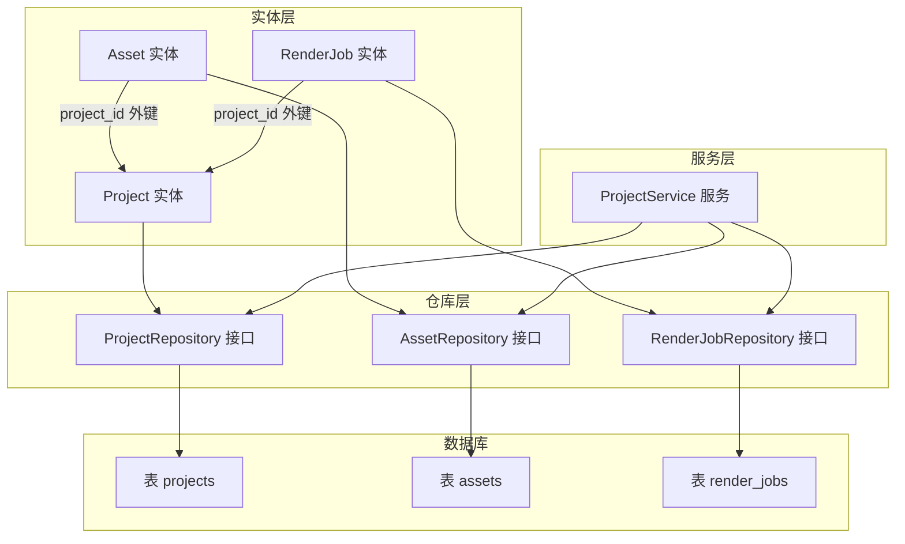
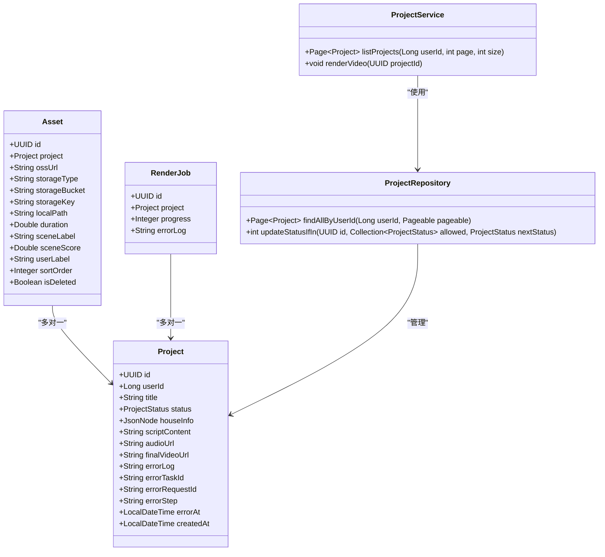
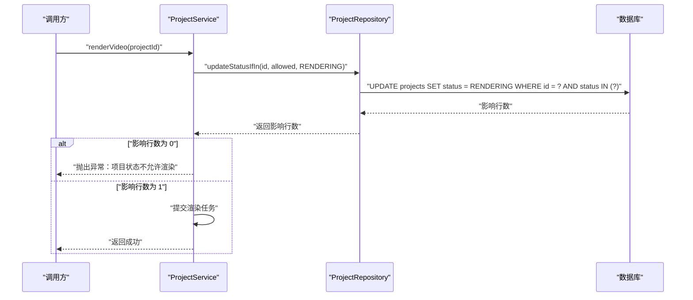
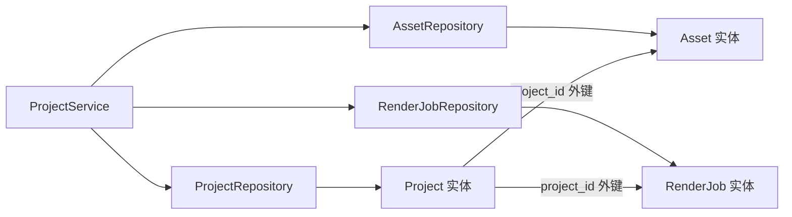

# 项目数据访问

<cite>
**本文引用的文件列表**
- [Project.java](file://backend/src/main/java/com/aiscene/entity/Project.java)
- [ProjectRepository.java](file://backend/src/main/java/com/aiscene/repository/ProjectRepository.java)
- [ProjectService.java](file://backend/src/main/java/com/aiscene/service/ProjectService.java)
- [Asset.java](file://backend/src/main/java/com/aiscene/entity/Asset.java)
- [RenderJob.java](file://backend/src/main/java/com/aiscene/entity/RenderJob.java)
- [V1__init_schema.sql](file://backend/src/main/resources/db/migration/V1__init_schema.sql)
- [V4__add_index_projects_user_id.sql](file://backend/src/main/resources/db/migration/V4__add_index_projects_user_id.sql)
- [Technical_Architecture.md](file://docs/Technical_Architecture.md)
</cite>

## 目录
1. [简介](#简介)
2. [项目结构](#项目结构)
3. [核心组件](#核心组件)
4. [架构总览](#架构总览)
5. [详细组件分析](#详细组件分析)
6. [依赖分析](#依赖分析)
7. [性能考虑](#性能考虑)
8. [故障排查指南](#故障排查指南)
9. [结论](#结论)

## 简介
本文件聚焦于 Project 实体及其仓库接口的设计与实现，系统性阐述：
- Project 实体的字段定义与含义（含 id、userId、title、status、createdAt 等）
- 与 Asset 和 RenderJob 的一对多关联关系
- ProjectRepository 中分页查询与状态原子更新的实现机制（JPQL 与 @Modifying 的事务行为）
- 与数据库迁移脚本 V1__init_schema.sql 的映射关系
- 在服务层中如何注入与使用 ProjectRepository 的实践示例
- 常见查询场景的优化建议（索引策略）

## 项目结构
后端采用 Spring Data JPA + Flyway 的分层设计：
- 实体层：Project、Asset、RenderJob
- 仓库层：ProjectRepository、AssetRepository、RenderJobRepository
- 服务层：ProjectService
- 数据库迁移：Flyway 脚本 V1__init_schema.sql、V4__add_index_projects_user_id.sql

图表来源
- [Project.java](file://backend/src/main/java/com/aiscene/entity/Project.java#L16-L70)
- [Asset.java](file://backend/src/main/java/com/aiscene/entity/Asset.java#L10-L59)
- [RenderJob.java](file://backend/src/main/java/com/aiscene/entity/RenderJob.java#L10-L30)
- [ProjectRepository.java](file://backend/src/main/java/com/aiscene/repository/ProjectRepository.java#L15-L25)
- [V1__init_schema.sql](file://backend/src/main/resources/db/migration/V1__init_schema.sql#L1-L33)

章节来源
- [Project.java](file://backend/src/main/java/com/aiscene/entity/Project.java#L16-L70)
- [ProjectRepository.java](file://backend/src/main/java/com/aiscene/repository/ProjectRepository.java#L15-L25)
- [V1__init_schema.sql](file://backend/src/main/resources/db/migration/V1__init_schema.sql#L1-L33)

## 核心组件
- Project 实体：承载一次视频制作任务的生命周期数据，包含用户标识、标题、JSON 结构化房源信息、状态、脚本内容、音频与最终视频地址、错误信息及创建时间等。
- ProjectRepository 接口：继承 JpaRepository，提供按用户分页查询与基于状态机的安全更新能力。
- ProjectService 服务：在业务层注入并使用 ProjectRepository，完成项目列表、状态流转、脚本生成、渲染等流程。

章节来源
- [Project.java](file://backend/src/main/java/com/aiscene/entity/Project.java#L16-L70)
- [ProjectRepository.java](file://backend/src/main/java/com/aiscene/repository/ProjectRepository.java#L15-L25)
- [ProjectService.java](file://backend/src/main/java/com/aiscene/service/ProjectService.java#L320-L326)

## 架构总览
Project 作为根实体，与 Asset、RenderJob 通过外键建立一对多关系。服务层通过仓库接口进行数据访问，仓库接口由 Spring Data JPA 提供默认实现，支持分页与 JPQL 查询。

图表来源
- [Project.java](file://backend/src/main/java/com/aiscene/entity/Project.java#L16-L70)
- [Asset.java](file://backend/src/main/java/com/aiscene/entity/Asset.java#L10-L59)
- [RenderJob.java](file://backend/src/main/java/com/aiscene/entity/RenderJob.java#L10-L30)
- [ProjectRepository.java](file://backend/src/main/java/com/aiscene/repository/ProjectRepository.java#L15-L25)
- [ProjectService.java](file://backend/src/main/java/com/aiscene/service/ProjectService.java#L320-L326)

## 详细组件分析

### Project 实体字段与映射
- 标识与归属
  - id：主键，UUID 生成策略
  - userId：用户标识，用于按用户分页查询
- 内容与元数据
  - title：项目标题（如小区名）
  - houseInfo：JSON 结构化房源信息，采用 JSONB 存储与类型转换
  - scriptContent：生成的脚本内容
  - audioUrl：音频资源地址
  - finalVideoUrl：最终视频成品地址
- 状态与错误追踪
  - status：项目状态枚举（草稿、上传中、分析中、待审核、渲染中、已完成、失败等）
  - errorLog、errorTaskId、errorRequestId、errorStep、errorAt：失败时记录的错误上下文
- 时间戳
  - createdAt：创建时间，自动写入且不可更新

与数据库映射关系（V1__init_schema.sql）
- projects 表包含 id、user_id、title、house_info(JSONB)、status、script_content(TEXT)、final_video_url、created_at 等列，与实体字段一一对应。

章节来源
- [Project.java](file://backend/src/main/java/com/aiscene/entity/Project.java#L16-L70)
- [V1__init_schema.sql](file://backend/src/main/resources/db/migration/V1__init_schema.sql#L1-L11)
- [Technical_Architecture.md](file://docs/Technical_Architecture.md#L71-L84)

### 与 Asset、RenderJob 的关联关系
- 一对多：Project 与 Asset、RenderJob 均为一对多关系，通过外键 project_id 关联。
- 关联方向
  - Asset：@ManyToOne(fetch = LAZY)，@JoinColumn(name = "project_id")，表示 Asset 属于某个 Project
  - RenderJob：@ManyToOne(fetch = LAZY)，@JoinColumn(name = "project_id")，表示 RenderJob 属于某个 Project

章节来源
- [Asset.java](file://backend/src/main/java/com/aiscene/entity/Asset.java#L10-L59)
- [RenderJob.java](file://backend/src/main/java/com/aiscene/entity/RenderJob.java#L10-L30)

### ProjectRepository 分页查询与状态更新

#### 分页查询：findAllByUserId
- 方法签名：Page<Project> findAllByUserId(Long userId, Pageable pageable)
- 作用：按用户 ID 分页查询项目列表
- 性能要点：配合复合索引 idx_projects_user_id_created_at 可显著提升按用户+时间倒序的查询效率

章节来源
- [ProjectRepository.java](file://backend/src/main/java/com/aiscene/repository/ProjectRepository.java#L17-L17)
- [V4__add_index_projects_user_id.sql](file://backend/src/main/resources/db/migration/V4__add_index_projects_user_id.sql#L1-L2)

#### 状态原子更新：updateStatusIfIn
- 方法签名：int updateStatusIfIn(UUID id, Collection<ProjectStatus> allowed, ProjectStatus nextStatus)
- JPQL 语义：仅当项目当前状态在 allowed 集合内时，才将其更新为 nextStatus
- 事务行为：@Modifying 注解表明该操作会修改数据库，通常需要在事务中执行
- 返回值：返回受影响的行数（期望为 1 或 0），用于判断是否满足“乐观锁”条件

图表来源
- [ProjectRepository.java](file://backend/src/main/java/com/aiscene/repository/ProjectRepository.java#L19-L25)
- [ProjectService.java](file://backend/src/main/java/com/aiscene/service/ProjectService.java#L218-L228)

章节来源
- [ProjectRepository.java](file://backend/src/main/java/com/aiscene/repository/ProjectRepository.java#L19-L25)
- [ProjectService.java](file://backend/src/main/java/com/aiscene/service/ProjectService.java#L218-L228)

### 数据库迁移脚本映射关系
- V1__init_schema.sql
  - projects 表：id(UUID, PK)、user_id(BIGINT)、title(VARCHAR)、house_info(JSONB)、status(VARCHAR)、script_content(TEXT)、final_video_url(VARCHAR)、created_at(TIMESTAMP)
  - assets 表：id(UUID, PK)、project_id(UUID, FK)、oss_url、duration、scene_label、scene_score、user_label、sort_order、is_deleted
  - render_jobs 表：id(UUID, PK)、project_id(UUID, FK)、progress、error_log
- V4__add_index_projects_user_id.sql
  - 在 projects 上创建复合索引 idx_projects_user_id_created_at(user_id, created_at DESC)，用于优化按用户分页查询

章节来源
- [V1__init_schema.sql](file://backend/src/main/resources/db/migration/V1__init_schema.sql#L1-L33)
- [V4__add_index_projects_user_id.sql](file://backend/src/main/resources/db/migration/V4__add_index_projects_user_id.sql#L1-L2)

### 服务层注入与使用示例
- 注入方式：在服务类中通过构造器注入 ProjectRepository
- 典型用法：
  - 列表查询：根据 userId 与分页参数调用 findAllByUserId
  - 渲染前置校验：使用 updateStatusIfIn 原子地将状态从 SCRIPT_GENERATED 或 FAILED 更新为 RENDERING；若返回 0，则说明状态不满足前置条件，抛出异常提示

章节来源
- [ProjectService.java](file://backend/src/main/java/com/aiscene/service/ProjectService.java#L320-L326)
- [ProjectService.java](file://backend/src/main/java/com/aiscene/service/ProjectService.java#L218-L228)

## 依赖分析
- 组件耦合
  - ProjectRepository 对 Project 实体强依赖，提供分页与状态更新能力
  - ProjectService 依赖 ProjectRepository、AssetRepository、RenderJobRepository 以协调业务流程
  - 实体间通过外键形成清晰的一对多关系，降低跨表复杂度
- 外部依赖
  - Flyway 负责数据库版本演进，确保 schema 与实体一致
  - PostgreSQL JSONB 类型用于存储 house_info，便于灵活扩展

图表来源
- [ProjectService.java](file://backend/src/main/java/com/aiscene/service/ProjectService.java#L320-L326)
- [ProjectRepository.java](file://backend/src/main/java/com/aiscene/repository/ProjectRepository.java#L15-L25)
- [Asset.java](file://backend/src/main/java/com/aiscene/entity/Asset.java#L10-L59)
- [RenderJob.java](file://backend/src/main/java/com/aiscene/entity/RenderJob.java#L10-L30)

## 性能考虑
- 索引优化
  - 已在 projects 表上创建复合索引 idx_projects_user_id_created_at(user_id, created_at DESC)，可显著提升按用户分页查询的性能
- 查询模式
  - 列表查询通常按创建时间倒序，索引顺序 created_at DESC 与查询排序一致，避免额外排序开销
- 状态更新
  - updateStatusIfIn 使用 WHERE 子句限定状态集合，结合索引可减少全表扫描范围
- 扩展建议
  - 若存在更多按用户过滤的查询场景，可评估增加覆盖索引或分区策略（视数据量而定）

章节来源
- [V4__add_index_projects_user_id.sql](file://backend/src/main/resources/db/migration/V4__add_index_projects_user_id.sql#L1-L2)
- [ProjectRepository.java](file://backend/src/main/java/com/aiscene/repository/ProjectRepository.java#L17-L17)
- [ProjectService.java](file://backend/src/main/java/com/aiscene/service/ProjectService.java#L320-L326)

## 故障排查指南
- 状态更新失败
  - 现象：updateStatusIfIn 返回 0，导致渲染流程提前抛出异常
  - 排查要点：
    - 确认项目当前状态确实在 allowed 集合中
    - 检查是否存在并发更新导致状态已改变
    - 核对传入的 id 是否正确
- 列表查询性能差
  - 现象：按用户分页查询响应慢
  - 排查要点：
    - 确认复合索引 idx_projects_user_id_created_at 是否生效
    - 检查查询排序与索引列顺序是否一致
- 数据不一致
  - 现象：状态与实际流程不符
  - 排查要点：
    - 检查服务层事务边界是否完整
    - 核对引擎侧与服务层的状态更新逻辑一致性

章节来源
- [ProjectRepository.java](file://backend/src/main/java/com/aiscene/repository/ProjectRepository.java#L19-L25)
- [ProjectService.java](file://backend/src/main/java/com/aiscene/service/ProjectService.java#L218-L228)
- [V4__add_index_projects_user_id.sql](file://backend/src/main/resources/db/migration/V4__add_index_projects_user_id.sql#L1-L2)

## 结论
Project 实体与仓库接口围绕“按用户分页查询 + 原子状态更新”两大核心能力构建，配合 Flyway 迁移脚本与 PostgreSQL JSONB 类型，既保证了灵活性，也兼顾了性能与可维护性。通过合理的索引策略与服务层的事务控制，能够稳定支撑从上传、分析、脚本生成到渲染的完整工作流。