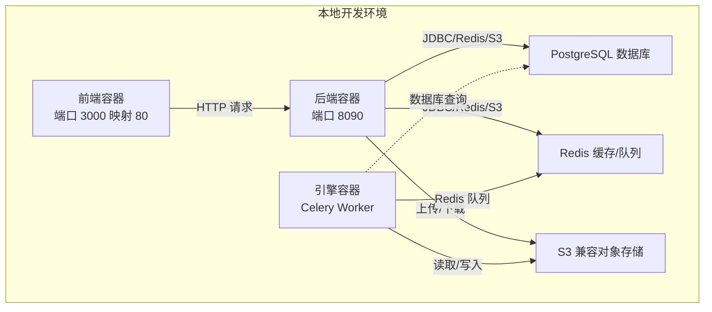
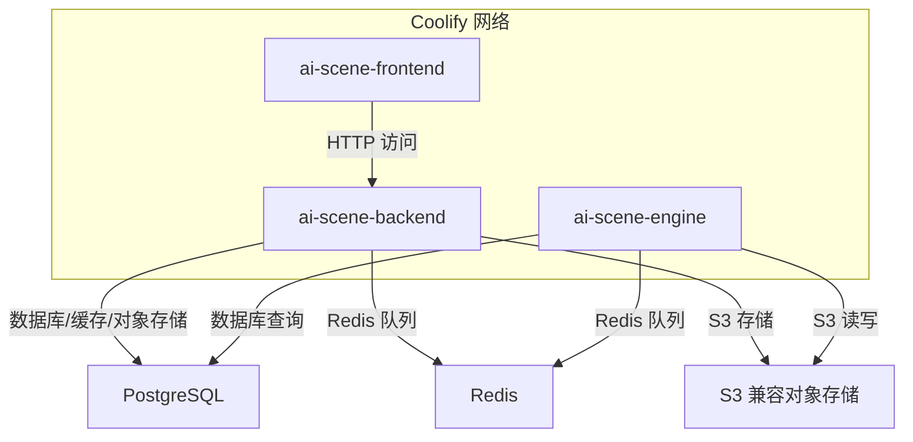
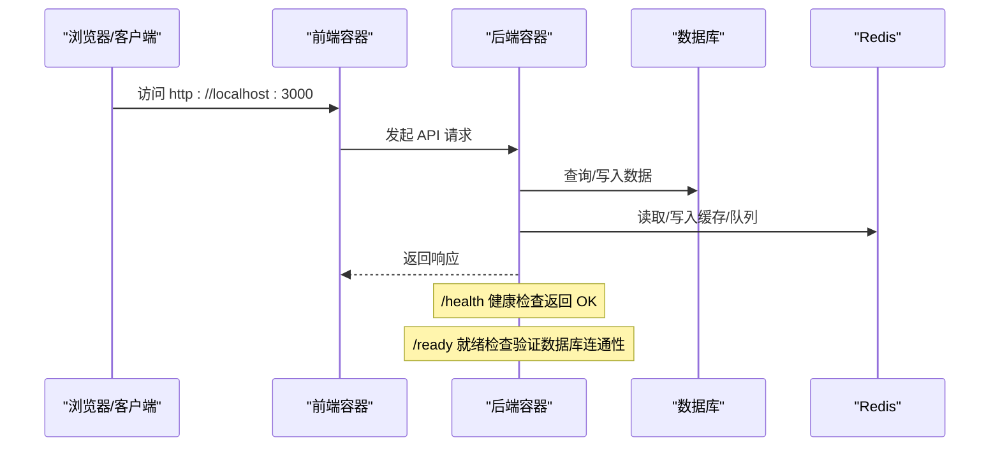
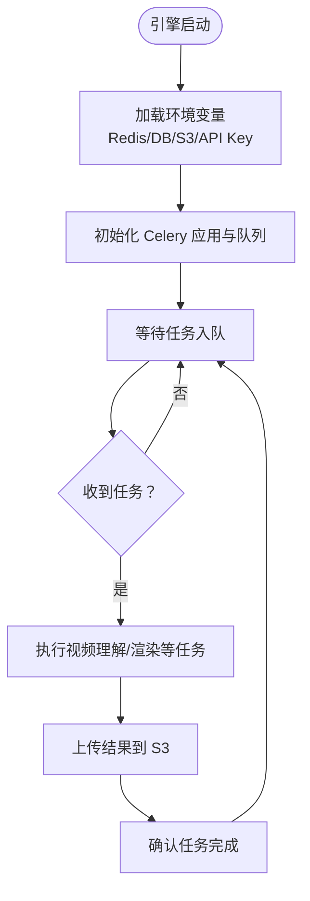
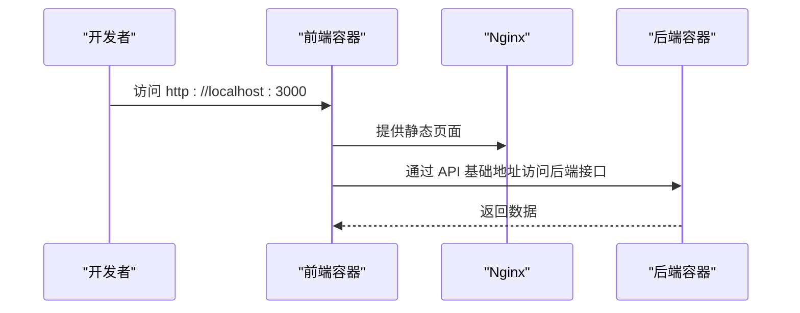
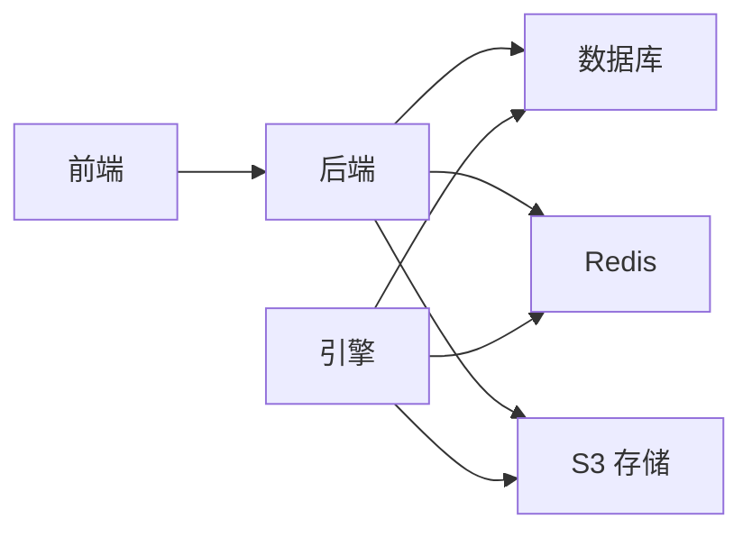

# 快速入门

<cite>
**本文引用的文件**
- [README.md](file://README.md)
- [.env.example](file://.env.example)
- [build.sh](file://build.sh)
- [docker-compose.coolify.yaml](file://docker-compose.coolify.yaml)
- [backend/src/main/resources/application.yml](file://backend/src/main/resources/application.yml)
- [backend/Dockerfile](file://backend/Dockerfile)
- [engine/Dockerfile](file://engine/Dockerfile)
- [frontend/Dockerfile](file://frontend/Dockerfile)
- [backend/src/main/java/com/aiscene/controller/HealthController.java](file://backend/src/main/java/com/aiscene/controller/HealthController.java)
- [frontend/.env.example](file://frontend/.env.example)
</cite>

## 目录
1. [简介](#简介)
2. [项目结构](#项目结构)
3. [核心组件](#核心组件)
4. [架构总览](#架构总览)
5. [详细组件分析](#详细组件分析)
6. [依赖关系分析](#依赖关系分析)
7. [性能注意事项](#性能注意事项)
8. [故障排查指南](#故障排查指南)
9. [结论](#结论)
10. [附录](#附录)

## 简介
本指南面向首次运行 ai-scene-to-video 的开发者，帮助你在本地完成环境准备、镜像构建与服务启动，并提供验证方法与常见问题排查建议。项目采用前后端分离与 AI 引擎解耦的架构，通过 Docker Compose 编排三个服务：前端、后端与 AI 引擎，配合 PostgreSQL、Redis 与对象存储（S3 兼容）实现完整的短视频生成流水线。

## 项目结构
- 后端（Spring Boot，Java）：提供 REST API、数据库与对象存储集成、健康检查等。
- 引擎（Python/Celery）：负责 AI 任务队列、视频理解与渲染工作。
- 前端（Vite/Vue）：Nginx 提供静态资源服务，通过环境变量指向后端 API。
- 构建与编排：根目录提供一键构建脚本与 Docker Compose 文件，用于本地启动。

图表来源
- [docker-compose.coolify.yaml](file://docker-compose.coolify.yaml#L1-L86)
- [backend/src/main/resources/application.yml](file://backend/src/main/resources/application.yml#L1-L66)

章节来源
- [README.md](file://README.md#L1-L223)
- [docker-compose.coolify.yaml](file://docker-compose.coolify.yaml#L1-L86)

## 核心组件
- 后端服务
  - 端口：8090
  - 职责：REST API、数据库迁移与校验、对象存储集成、健康检查
  - 关键配置项：数据库连接、Redis 连接、S3 存储、上传类型限制
- 引擎服务
  - 端口：无直接暴露（通过 Redis 队列与后端交互）
  - 职责：AI 任务执行（视频理解、智能拆分、渲染合成）
  - 关键配置项：Redis、数据库 DSN、DashScope API Key、S3 存储
- 前端服务
  - 端口：3000（宿主映射至容器 80）
  - 职责：静态页面与 API 代理（由构建参数注入）

章节来源
- [backend/src/main/resources/application.yml](file://backend/src/main/resources/application.yml#L1-L66)
- [engine/Dockerfile](file://engine/Dockerfile#L1-L18)
- [frontend/Dockerfile](file://frontend/Dockerfile#L1-L25)
- [docker-compose.coolify.yaml](file://docker-compose.coolify.yaml#L1-L86)

## 架构总览
下图展示本地启动时三个服务之间的依赖关系与网络拓扑：

图表来源
- [docker-compose.coolify.yaml](file://docker-compose.coolify.yaml#L1-L86)

## 详细组件分析

### 后端服务（ai-scene-backend）
- 镜像与入口
  - 使用多阶段构建，最终以 JRE 运行 jar 包，默认暴露 8090 端口
- 配置要点
  - 数据库：PostgreSQL，使用 Spring 配置中的 URL、用户名、密码
  - 缓存：Redis，使用统一的连接 URL
  - 对象存储：S3 兼容，支持区域、端点、访问密钥、桶名、公开访问域名
  - 上传：限制最大文件大小与允许的媒体类型
  - 健康检查：/health（存活探针）、/ready（就绪探针，依赖数据库连通性）
- Docker Compose
  - 暴露 8090 端口；定义健康检查命令；依赖 Coolify 网络

图表来源
- [backend/src/main/java/com/aiscene/controller/HealthController.java](file://backend/src/main/java/com/aiscene/controller/HealthController.java#L1-L39)
- [backend/src/main/resources/application.yml](file://backend/src/main/resources/application.yml#L1-L66)
- [docker-compose.coolify.yaml](file://docker-compose.coolify.yaml#L1-L86)

章节来源
- [backend/Dockerfile](file://backend/Dockerfile#L1-L14)
- [backend/src/main/resources/application.yml](file://backend/src/main/resources/application.yml#L1-L66)
- [backend/src/main/java/com/aiscene/controller/HealthController.java](file://backend/src/main/java/com/aiscene/controller/HealthController.java#L1-L39)
- [docker-compose.coolify.yaml](file://docker-compose.coolify.yaml#L1-L86)

### 引擎服务（ai-scene-engine）
- 镜像与入口
  - 基于 Python 3.10，安装系统依赖（OpenCV、FFmpeg），pip 安装依赖后以 Celery Worker 启动
- 配置要点
  - Redis：与后端共享连接 URL
  - 数据库：推荐使用完整 DSN（DB_DSN）
  - AI 服务：DashScope API Key
  - S3：与后端一致的存储配置
  - 智能拆分：开关、策略、最小片段时长等
- Docker Compose
  - 依赖后端服务；加入 Coolify 网络

图表来源
- [engine/Dockerfile](file://engine/Dockerfile#L1-L18)
- [engine/config.py](file://engine/config.py#L1-L35)

章节来源
- [engine/Dockerfile](file://engine/Dockerfile#L1-L18)
- [engine/config.py](file://engine/config.py#L1-L35)
- [docker-compose.coolify.yaml](file://docker-compose.coolify.yaml#L36-L65)

### 前端服务（ai-scene-frontend）
- 镜像与入口
  - 基于 Node 构建产物，Nginx 提供静态资源，监听 80 端口
- 配置要点
  - 构建参数：VITE_API_BASE_URL、VITE_API_KEY
  - 运行时映射：宿主机 3000 端口映射容器 80
- Docker Compose
  - 依赖后端服务；加入 Coolify 网络

图表来源
- [frontend/Dockerfile](file://frontend/Dockerfile#L1-L25)
- [frontend/.env.example](file://frontend/.env.example#L1-L3)
- [docker-compose.coolify.yaml](file://docker-compose.coolify.yaml#L66-L81)

章节来源
- [frontend/Dockerfile](file://frontend/Dockerfile#L1-L25)
- [frontend/.env.example](file://frontend/.env.example#L1-L3)
- [docker-compose.coolify.yaml](file://docker-compose.coolify.yaml#L66-L81)

## 依赖关系分析
- 服务间依赖
  - 前端依赖后端 API
  - 后端依赖数据库、Redis、S3
  - 引擎依赖 Redis 队列与数据库、S3
- 网络
  - 三个服务均加入外部网络 coolify，便于跨服务通信

图表来源
- [docker-compose.coolify.yaml](file://docker-compose.coolify.yaml#L1-L86)

章节来源
- [docker-compose.coolify.yaml](file://docker-compose.coolify.yaml#L1-L86)

## 性能注意事项
- 本地开发建议
  - 为后端与引擎分配足够内存，避免容器被系统回收
  - 使用 SSD 存储以提升视频处理与对象存储 IO
- 上传与渲染
  - 合理设置上传文件大小上限与媒体类型，避免不必要的资源消耗
  - 引擎任务并发受 Redis 与 CPU/GPU 资源影响，建议按需调整任务规模

[本节为通用建议，不直接分析具体文件]

## 故障排查指南
- 环境变量未配置或错误
  - 确认 .env 文件中包含数据库、Redis、S3、AI 密钥与数据库 DSN 等关键项
  - 前端构建参数 VITE_API_BASE_URL 需指向后端 API 地址
- 镜像构建失败
  - 后端：检查 Maven 依赖与网络；确保 Docker 可拉取 maven:3.9-eclipse-temurin-17 镜像
  - 引擎：检查系统依赖安装（OpenCV、FFmpeg）与 pip 依赖安装日志
  - 前端：检查 Node 版本与网络；确保 npm ci 成功
- 服务启动超时或无法访问
  - 后端健康检查：访问 http://localhost:8090/health 与 /ready，确认数据库连通性
  - 前端：访问 http://localhost:3000，若页面空白，检查后端 API 是否可达
  - 引擎：查看日志确认 Celery 是否成功连接 Redis 并开始消费任务
- 端口冲突
  - 若 3000 或 8090 已被占用，请修改 docker-compose 映射端口或释放端口
- 网络问题
  - 确保 Coolify 网络已创建且外部可用；否则将导致服务间无法通信

章节来源
- [.env.example](file://.env.example#L1-L25)
- [frontend/.env.example](file://frontend/.env.example#L1-L3)
- [backend/src/main/java/com/aiscene/controller/HealthController.java](file://backend/src/main/java/com/aiscene/controller/HealthController.java#L1-L39)
- [docker-compose.coolify.yaml](file://docker-compose.coolify.yaml#L1-L86)

## 结论
按照本指南完成环境准备、镜像构建与服务启动后，你可以在本地体验从前端到后端再到 AI 引擎的完整流程。遇到问题时，优先核对环境变量、健康检查与网络连通性，再逐步定位到具体服务或依赖组件。

[本节为总结，不直接分析具体文件]

## 附录

### 本地运行步骤清单
- 准备工具
  - 安装并运行 Docker 与 Docker Compose
- 克隆仓库并准备环境变量
  - 复制 .env.example 为 .env，填写数据库、Redis、S3 与 AI 密钥等
  - 如需自定义前端 API 地址，可在构建时传入 VITE_API_BASE_URL
- 构建镜像
  - 执行根目录脚本，依次构建后端、引擎与前端镜像
- 启动服务
  - 使用指定 Compose 文件启动全部服务
- 访问与验证
  - 前端：http://localhost:3000
  - 后端：/health 与 /ready 健康检查
  - 引擎：查看日志确认任务消费状态

章节来源
- [.env.example](file://.env.example#L1-L25)
- [build.sh](file://build.sh#L1-L28)
- [docker-compose.coolify.yaml](file://docker-compose.coolify.yaml#L1-L86)
- [backend/src/main/java/com/aiscene/controller/HealthController.java](file://backend/src/main/java/com/aiscene/controller/HealthController.java#L1-L39)