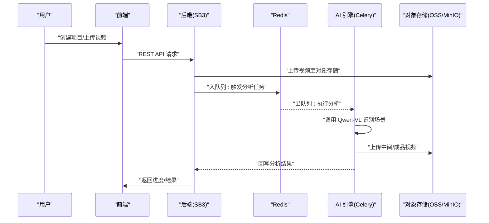
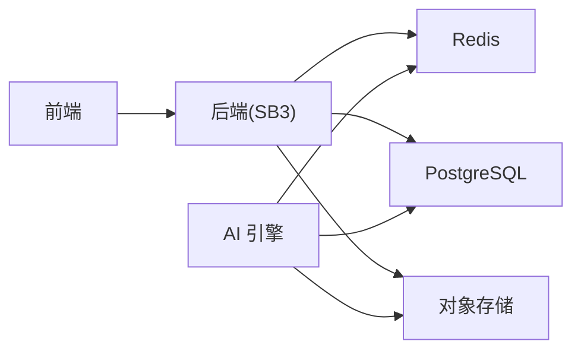

# 技术栈

<cite>
**本文引用的文件**
- [Technical_Architecture.md](file://docs/Technical_Architecture.md)
- [application.yml](file://backend/src/main/resources/application.yml)
- [pom.xml](file://backend/pom.xml)
- [package.json](file://frontend/package.json)
- [config.py](file://engine/config.py)
- [requirements.txt](file://engine/requirements.txt)
- [Dockerfile（后端）](file://backend/Dockerfile)
- [Dockerfile（前端）](file://frontend/Dockerfile)
- [Dockerfile（引擎）](file://engine/Dockerfile)
- [docker-compose.coolify.yaml](file://docker-compose.coolify.yaml)
</cite>

## 目录
1. [引言](#引言)
2. [项目结构](#项目结构)
3. [核心组件](#核心组件)
4. [架构总览](#架构总览)
5. [详细组件分析](#详细组件分析)
6. [依赖关系分析](#依赖关系分析)
7. [性能考量](#性能考量)
8. [故障排查指南](#故障排查指南)
9. [结论](#结论)

## 引言
本文件围绕 ai-scene-to-video 项目的整体技术栈展开，从“前端、后端、AI 引擎、基础设施”四个层面系统阐述技术选型与架构决策。文档严格依据 Technical_Architecture.md 中的论证，结合各子工程的配置与依赖文件，给出可追溯的来源说明，帮助读者理解每项技术选择在业务与技术层面的权衡与优势。

## 项目结构
该项目采用多模块分层架构：
- 前端：Vue 3 + TypeScript + Vant UI，面向移动端 H5 场景，强调包体与性能优势。
- 后端：Spring Boot 3 + JDK 17，负责业务编排、数据持久化、对象存储对接与异步任务调度桥接。
- AI 引擎：Python 3.10 + Qwen-VL 视觉大模型 + FFmpeg + Celery，承担视频分析、智能分段与渲染任务。
- 基础设施：Docker Compose 本地部署，MinIO/阿里云 OSS 对象存储策略，Redis 作为消息队列与缓存。

```mermaid
graph TB
subgraph "前端"
FE["Vue 3 + TypeScript<br/>Vant UI"]
end
subgraph "后端"
BE["Spring Boot 3 + JDK 17<br/>PostgreSQL + Redis"]
end
subgraph "AI 引擎"
ENG["Python 3.10 + Celery + Redis<br/>Qwen-VL + FFmpeg"]
end
subgraph "基础设施"
DC["Docker Compose"]
S3["MinIO / 阿里云 OSS"]
end
FE --> BE
BE <- --> ENG
BE --> S3
ENG --> S3
DC --> FE
DC --> BE
DC --> ENG
```

图表来源
- [docker-compose.coolify.yaml](file://docker-compose.coolify.yaml#L1-L86)
- [Dockerfile（前端）](file://frontend/Dockerfile#L1-L25)
- [Dockerfile（后端）](file://backend/Dockerfile#L1-L14)
- [Dockerfile（引擎）](file://engine/Dockerfile#L1-L18)
- [application.yml](file://backend/src/main/resources/application.yml#L1-L66)
- [requirements.txt](file://engine/requirements.txt#L1-L30)
- [config.py](file://engine/config.py#L1-L46)

章节来源
- [docker-compose.coolify.yaml](file://docker-compose.coolify.yaml#L1-L86)

## 核心组件
- 前端：Vue 3 + TypeScript + Vant UI，满足移动端 H5 场景的性能与交互需求；拖拽排序等成熟组件支撑“智能分段确认页”。
- 后端：Spring Boot 3 + JDK 17，配合 PostgreSQL JSONB 存储 AI 结果，Redis 作为消息队列与缓存，Actuator 提供健康检查。
- AI 引擎：Python 3.10 + Celery + Redis，集成 Qwen-VL（阿里云通义千问）视觉模型与 FFmpeg，完成视频分析与渲染。
- 基础设施：Docker Compose 一键拉起所有服务，对象存储统一接入 MinIO（本地）与阿里云 OSS（生产）。

章节来源
- [Technical_Architecture.md](file://docs/Technical_Architecture.md#L33-L65)
- [package.json](file://frontend/package.json#L1-L29)
- [pom.xml](file://backend/pom.xml#L1-L145)
- [application.yml](file://backend/src/main/resources/application.yml#L1-L66)
- [requirements.txt](file://engine/requirements.txt#L1-L30)
- [config.py](file://engine/config.py#L1-L46)

## 架构总览
整体采用“前后端分离 + 异构计算微服务”的模式：后端作为业务中台，负责用户管理、状态流转与数据存储；AI/渲染引擎专注于“脏活累活”，通过 Redis 队列解耦，避免阻塞与雪崩风险。



图表来源
- [Technical_Architecture.md](file://docs/Technical_Architecture.md#L18-L31)
- [application.yml](file://backend/src/main/resources/application.yml#L50-L66)
- [config.py](file://engine/config.py#L1-L46)
- [docker-compose.coolify.yaml](file://docker-compose.coolify.yaml#L1-L86)

## 详细组件分析

### 前端技术栈（Vue 3 + TypeScript + Vant UI）
- Vue 3：包体小、性能优，适合移动端 H5 场景，生态成熟。
- TypeScript：提升代码质量与可维护性，便于团队协作。
- Vant UI：专为移动端 H5 优化，提供成熟的拖拽排序等交互组件，满足“智能分段确认页”的核心交互需求。

章节来源
- [Technical_Architecture.md](file://docs/Technical_Architecture.md#L37-L42)
- [package.json](file://frontend/package.json#L1-L29)

### 后端技术栈（Spring Boot 3 + JDK 17 + PostgreSQL + Redis）
- Spring Boot 3 + JDK 17：生态稳定，便于快速集成数据库、缓存与监控。
- PostgreSQL：JSONB 类型支持强，适合存储 AI 分析结果的复杂结构，查询效率高。
- Redis：兼具缓存与轻量消息队列能力，MVP 阶段无需引入 Kafka/RocketMQ。
- 对象存储：通过 S3 兼容接口对接 MinIO/阿里云 OSS，统一上传与访问。
- Actuator：提供健康检查端点，便于容器化与运维。

章节来源
- [Technical_Architecture.md](file://docs/Technical_Architecture.md#L43-L50)
- [application.yml](file://backend/src/main/resources/application.yml#L1-L66)
- [pom.xml](file://backend/pom.xml#L1-L145)

### AI 引擎技术栈（Python 3.10 + Qwen-VL + FFmpeg + Celery）
- Python 3.10：AI 生态主流语言，生态完善，便于集成视觉模型与视频处理工具。
- Qwen-VL（阿里云通义千问）：中文场景理解与图像识别综合性价比高，API 响应速度快。
- FFmpeg：视频处理“瑞士军刀”，用于剪辑、合成、字幕烧录等。
- Celery + Redis：异步任务队列，解耦后端与 AI 引擎，控制并发，避免服务器雪崩。
- TTS：支持多种引擎（如 CosyVoice、Sambert），可按需切换。

章节来源
- [Technical_Architecture.md](file://docs/Technical_Architecture.md#L51-L65)
- [requirements.txt](file://engine/requirements.txt#L1-L30)
- [config.py](file://engine/config.py#L1-L46)

### 基础设施（Docker Compose + 对象存储）
- Docker Compose：一键拉起后端、引擎、前端与依赖服务，保证开发与生产一致性。
- 对象存储：MinIO（本地开发）与阿里云 OSS（生产），统一上传与访问策略。
- 端口与健康检查：后端暴露 8090，前端通过 Nginx 暴露 80，Compose 提供健康检查与重启策略。

章节来源
- [Technical_Architecture.md](file://docs/Technical_Architecture.md#L60-L65)
- [docker-compose.coolify.yaml](file://docker-compose.coolify.yaml#L1-L86)
- [Dockerfile（前端）](file://frontend/Dockerfile#L1-L25)
- [Dockerfile（后端）](file://backend/Dockerfile#L1-L14)
- [Dockerfile（引擎）](file://engine/Dockerfile#L1-L18)

## 依赖关系分析
- 前端依赖后端提供的 REST API；后端通过 Redis 与 AI 引擎解耦；AI 引擎通过对象存储上传/下载视频；后端同样对接对象存储。
- 后端使用 Flyway 管理数据库迁移，JPA/Hibernate 仅作校验，避免与 Flyway 冲突。
- 引擎侧通过 Celery 监听 Redis 队列，消费后端下发的任务，完成后回写状态或结果。



图表来源
- [application.yml](file://backend/src/main/resources/application.yml#L1-L66)
- [requirements.txt](file://engine/requirements.txt#L1-L30)
- [docker-compose.coolify.yaml](file://docker-compose.coolify.yaml#L1-L86)

章节来源
- [application.yml](file://backend/src/main/resources/application.yml#L1-L66)
- [requirements.txt](file://engine/requirements.txt#L1-L30)
- [docker-compose.coolify.yaml](file://docker-compose.coolify.yaml#L1-L86)

## 性能考量
- 前端：Vue 3 包体小、TypeScript 提升可维护性，Vant UI 适配移动端交互，拖拽排序等组件减少自研成本。
- 后端：Spring Boot 3 生态稳定，PostgreSQL JSONB 支持强，Flyway 管理迁移，Actuator 提供可观测性。
- AI 引擎：Celery 控制并发，避免 FFmpeg 渲染导致的服务器雪崩；Redis 作为消息队列降低延迟与耦合。
- 基础设施：Docker Compose 统一环境，对象存储避免磁盘 IO 瓶颈，MinIO/阿里云 OSS 适配本地与生产。

章节来源
- [Technical_Architecture.md](file://docs/Technical_Architecture.md#L7-L17)
- [application.yml](file://backend/src/main/resources/application.yml#L1-L66)
- [requirements.txt](file://engine/requirements.txt#L1-L30)

## 故障排查指南
- 健康检查：后端提供健康探针，Compose 中已配置健康检查命令与重试策略，便于定位服务异常。
- 日志与监控：后端启用 Actuator，可查看健康与信息端点；前端构建产物由 Nginx 提供，注意静态资源路径与代理配置。
- 对象存储：确认 S3 兼容配置（区域、端点、密钥、桶名、公共访问 URL）是否正确，确保上传与回写成功。
- 队列与模型：检查 Redis 连接与队列名称，确认 DASHSCOPE API Key 与模型参数设置正确。

章节来源
- [docker-compose.coolify.yaml](file://docker-compose.coolify.yaml#L28-L33)
- [application.yml](file://backend/src/main/resources/application.yml#L35-L45)
- [config.py](file://engine/config.py#L1-L46)

## 结论
本项目在 MVP 阶段选择了成熟稳定的生态组合：前端 Vue 3 + TypeScript + Vant UI，后端 Spring Boot 3 + PostgreSQL + Redis，AI 引擎 Python 3.10 + Qwen-VL + FFmpeg + Celery，以及 Docker Compose + 对象存储的基础设施方案。这些选型均来自 Technical_Architecture.md 的明确论证，兼顾业务落地性与技术可行性，能够有效支撑从上传、分析、编排到渲染的完整异步流水线。