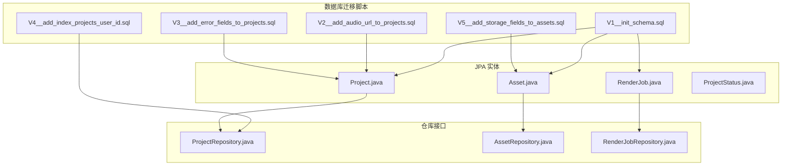
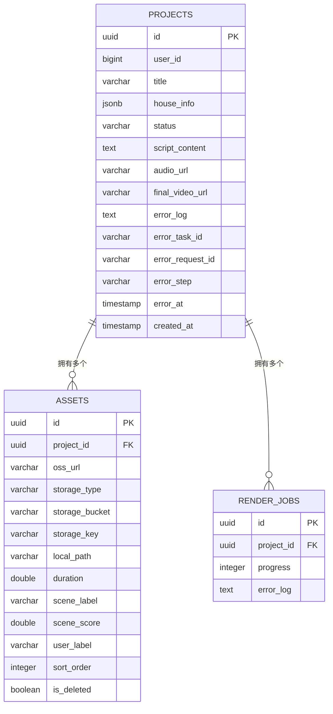
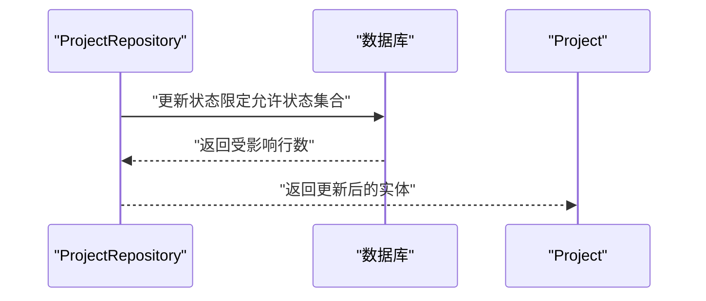
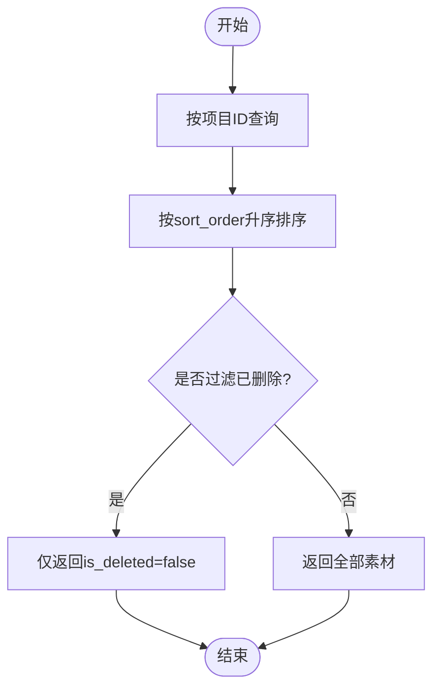
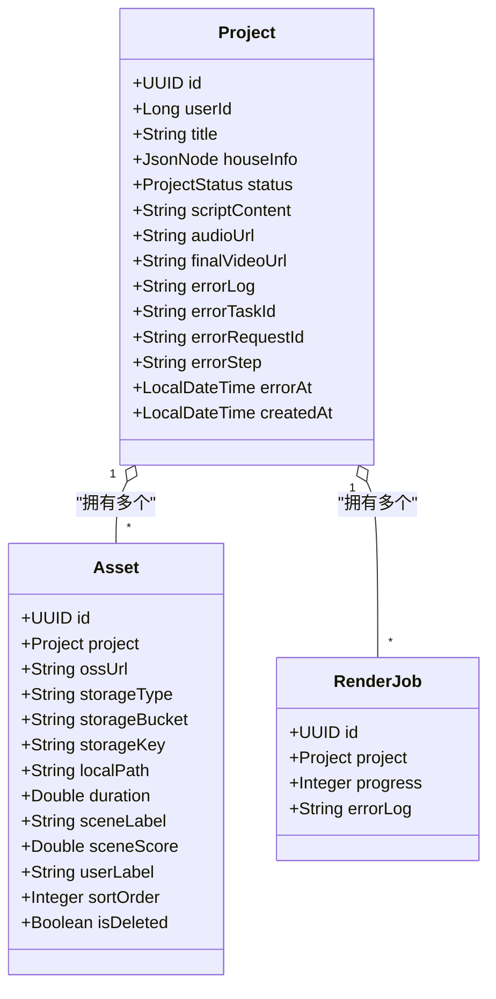

# 数据模型

<cite>
**本文引用的文件**
- [V1__init_schema.sql](file://backend/src/main/resources/db/migration/V1__init_schema.sql)
- [V2__add_audio_url_to_projects.sql](file://backend/src/main/resources/db/migration/V2__add_audio_url_to_projects.sql)
- [V3__add_error_fields_to_projects.sql](file://backend/src/main/resources/db/migration/V3__add_error_fields_to_projects.sql)
- [V4__add_index_projects_user_id.sql](file://backend/src/main/resources/db/migration/V4__add_index_projects_user_id.sql)
- [V5__add_storage_fields_to_assets.sql](file://backend/src/main/resources/db/migration/V5__add_storage_fields_to_assets.sql)
- [Project.java](file://backend/src/main/java/com/aiscene/entity/Project.java)
- [Asset.java](file://backend/src/main/java/com/aiscene/entity/Asset.java)
- [RenderJob.java](file://backend/src/main/java/com/aiscene/entity/RenderJob.java)
- [ProjectStatus.java](file://backend/src/main/java/com/aiscene/entity/ProjectStatus.java)
- [ProjectRepository.java](file://backend/src/main/java/com/aiscene/repository/ProjectRepository.java)
- [AssetRepository.java](file://backend/src/main/java/com/aiscene/repository/AssetRepository.java)
- [RenderJobRepository.java](file://backend/src/main/java/com/aiscene/repository/RenderJobRepository.java)
</cite>

## 目录
1. [简介](#简介)
2. [项目结构](#项目结构)
3. [核心组件](#核心组件)
4. [架构总览](#架构总览)
5. [详细组件分析](#详细组件分析)
6. [依赖分析](#依赖分析)
7. [性能考虑](#性能考虑)
8. [故障排查指南](#故障排查指南)
9. [结论](#结论)
10. [附录](#附录)

## 简介
本文件面向开发者与数据工程师，系统梳理后端数据模型与持久化设计，围绕 Flyway 迁移脚本与 JPA 实体类，完整描述核心表结构、字段语义、索引策略与查询优化要点，并给出 ER 关系图与关键流程时序图，帮助快速理解数据流转与性能优化路径。

## 项目结构
后端采用 Spring Data JPA + PostgreSQL 的技术栈，数据模型通过 Flyway 迁移脚本定义，JPA 实体类映射到对应表结构。核心文件分布如下：
- 迁移脚本：位于 backend/src/main/resources/db/migration，按版本号顺序执行，逐步演进表结构与索引。
- 实体类：位于 backend/src/main/java/com/aiscene/entity，使用注解映射数据库表与字段。
- 仓库接口：位于 backend/src/main/java/com/aiscene/repository，提供常用查询方法，支撑业务层调用。

图表来源
- [V1__init_schema.sql](file://backend/src/main/resources/db/migration/V1__init_schema.sql#L1-L33)
- [V2__add_audio_url_to_projects.sql](file://backend/src/main/resources/db/migration/V2__add_audio_url_to_projects.sql#L1-L2)
- [V3__add_error_fields_to_projects.sql](file://backend/src/main/resources/db/migration/V3__add_error_fields_to_projects.sql#L1-L6)
- [V4__add_index_projects_user_id.sql](file://backend/src/main/resources/db/migration/V4__add_index_projects_user_id.sql#L1-L2)
- [V5__add_storage_fields_to_assets.sql](file://backend/src/main/resources/db/migration/V5__add_storage_fields_to_assets.sql#L1-L6)
- [Project.java](file://backend/src/main/java/com/aiscene/entity/Project.java#L1-L72)
- [Asset.java](file://backend/src/main/java/com/aiscene/entity/Asset.java#L1-L61)
- [RenderJob.java](file://backend/src/main/java/com/aiscene/entity/RenderJob.java#L1-L32)
- [ProjectStatus.java](file://backend/src/main/java/com/aiscene/entity/ProjectStatus.java#L1-L16)
- [ProjectRepository.java](file://backend/src/main/java/com/aiscene/repository/ProjectRepository.java#L1-L27)
- [AssetRepository.java](file://backend/src/main/java/com/aiscene/repository/AssetRepository.java#L1-L15)
- [RenderJobRepository.java](file://backend/src/main/java/com/aiscene/repository/RenderJobRepository.java#L1-L12)

章节来源
- [V1__init_schema.sql](file://backend/src/main/resources/db/migration/V1__init_schema.sql#L1-L33)
- [Project.java](file://backend/src/main/java/com/aiscene/entity/Project.java#L1-L72)
- [Asset.java](file://backend/src/main/java/com/aiscene/entity/Asset.java#L1-L61)
- [RenderJob.java](file://backend/src/main/java/com/aiscene/entity/RenderJob.java#L1-L32)
- [ProjectRepository.java](file://backend/src/main/java/com/aiscene/repository/ProjectRepository.java#L1-L27)
- [AssetRepository.java](file://backend/src/main/java/com/aiscene/repository/AssetRepository.java#L1-L15)
- [RenderJobRepository.java](file://backend/src/main/java/com/aiscene/repository/RenderJobRepository.java#L1-L12)

## 核心组件
本节聚焦三大核心实体与其对应的数据库表，明确字段语义、约束与业务含义。

- Projects 表（JPA 实体：Project）
  - 主键：id（UUID）
  - 用户标识：user_id（BIGINT）
  - 基本信息：title（VARCHAR）
  - 房源信息：house_info（JSONB），用于存储房源相关结构化数据
  - 状态：status（枚举 ProjectStatus）
  - 脚本内容：script_content（TEXT）
  - 音频地址：audio_url（VARCHAR）
  - 最终视频地址：final_video_url（VARCHAR）
  - 错误追踪字段：error_log、error_task_id、error_request_id、error_step、error_at（TEXT/CHAR/VARCHAR/TIMESTAMP）
  - 创建时间：created_at（TIMESTAMP，默认当前时间）

- Assets 表（JPA 实体：Asset）
  - 主键：id（UUID）
  - 外键：project_id（UUID，REFERENCES projects.id）
  - 存储元信息：oss_url（VARCHAR）、storage_type（VARCHAR，默认“S3”）、storage_bucket（VARCHAR）、storage_key（VARCHAR）、local_path（VARCHAR）
  - 场景标签：scene_label（VARCHAR）、scene_score（DOUBLE PRECISION）
  - 用户标注：user_label（VARCHAR）
  - 排序：sort_order（INTEGER）
  - 删除标记：is_deleted（BOOLEAN，默认 FALSE）
  - 时长：duration（DOUBLE PRECISION）

- RenderJobs 表（JPA 实体：RenderJob）
  - 主键：id（UUID）
  - 外键：project_id（UUID，REFERENCES projects.id）
  - 进度：progress（INTEGER）
  - 错误日志：error_log（TEXT）

章节来源
- [V1__init_schema.sql](file://backend/src/main/resources/db/migration/V1__init_schema.sql#L1-L33)
- [V2__add_audio_url_to_projects.sql](file://backend/src/main/resources/db/migration/V2__add_audio_url_to_projects.sql#L1-L2)
- [V3__add_error_fields_to_projects.sql](file://backend/src/main/resources/db/migration/V3__add_error_fields_to_projects.sql#L1-L6)
- [V5__add_storage_fields_to_assets.sql](file://backend/src/main/resources/db/migration/V5__add_storage_fields_to_assets.sql#L1-L6)
- [Project.java](file://backend/src/main/java/com/aiscene/entity/Project.java#L1-L72)
- [Asset.java](file://backend/src/main/java/com/aiscene/entity/Asset.java#L1-L61)
- [RenderJob.java](file://backend/src/main/java/com/aiscene/entity/RenderJob.java#L1-L32)

## 架构总览
下图展示三张核心表之间的关系，以及与 JPA 实体的映射关系。

图表来源
- [V1__init_schema.sql](file://backend/src/main/resources/db/migration/V1__init_schema.sql#L1-L33)
- [Project.java](file://backend/src/main/java/com/aiscene/entity/Project.java#L1-L72)
- [Asset.java](file://backend/src/main/java/com/aiscene/entity/Asset.java#L1-L61)
- [RenderJob.java](file://backend/src/main/java/com/aiscene/entity/RenderJob.java#L1-L32)

## 详细组件分析

### Projects 表与 Project 实体
- 字段与业务含义
  - id：项目唯一标识，全局去重
  - user_id：归属用户编号，支撑用户维度分页与权限控制
  - title：项目标题
  - house_info：JSONB 结构，存储房源信息，便于灵活扩展
  - status：项目生命周期状态，使用 ProjectStatus 枚举
  - script_content：生成脚本内容
  - audio_url：音频资源地址
  - final_video_url：最终视频产物地址
  - error_log/error_*：错误追踪字段，记录失败任务、请求、步骤与时点
  - created_at：创建时间戳，用于排序与审计

- 索引与查询优化
  - 在 user_id 上建立复合索引，包含 created_at 并按降序排列，以优化“按用户分页查询最新项目”的场景
  - 仓库接口提供按 user_id 分页查询的方法签名，确保查询走索引

- 关键流程时序
  - 更新状态机：通过仓库提供的原子更新方法，限定允许的状态集合，避免竞态与非法跳转

图表来源
- [ProjectRepository.java](file://backend/src/main/java/com/aiscene/repository/ProjectRepository.java#L16-L26)
- [Project.java](file://backend/src/main/java/com/aiscene/entity/Project.java#L1-L72)

章节来源
- [V1__init_schema.sql](file://backend/src/main/resources/db/migration/V1__init_schema.sql#L1-L11)
- [V2__add_audio_url_to_projects.sql](file://backend/src/main/resources/db/migration/V2__add_audio_url_to_projects.sql#L1-L2)
- [V3__add_error_fields_to_projects.sql](file://backend/src/main/resources/db/migration/V3__add_error_fields_to_projects.sql#L1-L6)
- [V4__add_index_projects_user_id.sql](file://backend/src/main/resources/db/migration/V4__add_index_projects_user_id.sql#L1-L2)
- [ProjectRepository.java](file://backend/src/main/java/com/aiscene/repository/ProjectRepository.java#L16-L26)
- [Project.java](file://backend/src/main/java/com/aiscene/entity/Project.java#L1-L72)

### Assets 表与 Asset 实体
- 字段与业务含义
  - project_id：所属项目外键，一对多关系
  - oss_url：对象存储访问 URL
  - storage_type：存储类型（默认“S3”，兼容 S3 兼容对象存储）
  - storage_bucket：桶名
  - storage_key：对象键（路径）
  - local_path：本地缓存路径（可选）
  - scene_label/scene_score：场景标签与置信度
  - user_label：用户自定义标签
  - sort_order：在项目中的排序
  - is_deleted：软删除标记
  - duration：媒体时长

- 与 S3 兼容对象存储的适配
  - storage_type 默认值为“S3”，便于统一管理不同对象存储后端
  - storage_bucket 与 storage_key 组合形成对象定位键，支持跨存储后端切换
  - oss_url 提供直链访问能力，便于前端播放或下载

- 查询策略
  - 按项目 ID 排序读取：支持按 sort_order 升序获取素材列表
  - 过滤已删除素材：提供仅查询未删除素材的查询方法

图表来源
- [AssetRepository.java](file://backend/src/main/java/com/aiscene/repository/AssetRepository.java#L10-L14)
- [Asset.java](file://backend/src/main/java/com/aiscene/entity/Asset.java#L1-L61)

章节来源
- [V1__init_schema.sql](file://backend/src/main/resources/db/migration/V1__init_schema.sql#L13-L24)
- [V5__add_storage_fields_to_assets.sql](file://backend/src/main/resources/db/migration/V5__add_storage_fields_to_assets.sql#L1-L6)
- [AssetRepository.java](file://backend/src/main/java/com/aiscene/repository/AssetRepository.java#L10-L14)
- [Asset.java](file://backend/src/main/java/com/aiscene/entity/Asset.java#L1-L61)

### RenderJobs 表与 RenderJob 实体
- 字段与业务含义
  - project_id：所属项目外键
  - progress：渲染进度百分比
  - error_log：渲染过程中的错误日志

- 关系
  - 一个项目可有多个渲染作业（历史/并行/重试等场景）

章节来源
- [V1__init_schema.sql](file://backend/src/main/resources/db/migration/V1__init_schema.sql#L26-L33)
- [RenderJob.java](file://backend/src/main/java/com/aiscene/entity/RenderJob.java#L1-L32)
- [RenderJobRepository.java](file://backend/src/main/java/com/aiscene/repository/RenderJobRepository.java#L1-L12)

## 依赖分析
- 实体与表的映射
  - Project 映射 projects 表，包含状态枚举、JSONB 字段、音频与最终视频地址、错误追踪字段及创建时间
  - Asset 映射 assets 表，包含项目外键、存储元信息、标签与排序、软删除标记
  - RenderJob 映射 render_jobs 表，包含项目外键与进度/错误日志

- 仓库接口对查询的封装
  - ProjectRepository：提供按用户分页查询与状态原子更新
  - AssetRepository：提供按项目排序查询与过滤已删除
  - RenderJobRepository：基础 CRUD

图表来源
- [Project.java](file://backend/src/main/java/com/aiscene/entity/Project.java#L1-L72)
- [Asset.java](file://backend/src/main/java/com/aiscene/entity/Asset.java#L1-L61)
- [RenderJob.java](file://backend/src/main/java/com/aiscene/entity/RenderJob.java#L1-L32)

章节来源
- [Project.java](file://backend/src/main/java/com/aiscene/entity/Project.java#L1-L72)
- [Asset.java](file://backend/src/main/java/com/aiscene/entity/Asset.java#L1-L61)
- [RenderJob.java](file://backend/src/main/java/com/aiscene/entity/RenderJob.java#L1-L32)
- [ProjectRepository.java](file://backend/src/main/java/com/aiscene/repository/ProjectRepository.java#L1-L27)
- [AssetRepository.java](file://backend/src/main/java/com/aiscene/repository/AssetRepository.java#L1-L15)
- [RenderJobRepository.java](file://backend/src/main/java/com/aiscene/repository/RenderJobRepository.java#L1-L12)

## 性能考虑
- 索引设计
  - 在 projects(user_id, created_at DESC) 上建立复合索引，用于“按用户分页查询最新项目”的高频场景，避免全表扫描
- 查询优化建议
  - 使用仓库接口提供的方法，确保 SQL 走索引
  - 对于 JSONB 字段 house_info，若存在复杂查询需求，可在生产环境引入专用 JSON 类型与函数索引（当前实体以字符串形式处理）
- 写入优化
  - 状态更新采用原子更新，减少并发冲突
  - 渲染进度与错误日志按需写入，避免冗余字段膨胀

章节来源
- [V4__add_index_projects_user_id.sql](file://backend/src/main/resources/db/migration/V4__add_index_projects_user_id.sql#L1-L2)
- [ProjectRepository.java](file://backend/src/main/java/com/aiscene/repository/ProjectRepository.java#L16-L26)
- [Project.java](file://backend/src/main/java/com/aiscene/entity/Project.java#L1-L72)

## 故障排查指南
- 项目状态异常
  - 现象：状态无法推进或回退
  - 排查：确认调用仓库的原子更新方法，检查允许的状态集合是否包含当前状态
- 渲染失败
  - 现象：进度停滞或错误日志为空
  - 排查：检查 RenderJob 的 error_log 字段；核对项目表的错误追踪字段是否正确写入
- 资源访问问题
  - 现象：oss_url 无法访问或存储键不正确
  - 排查：核对 storage_type、storage_bucket、storage_key 是否一致；确认对象存储后端可用性

章节来源
- [ProjectRepository.java](file://backend/src/main/java/com/aiscene/repository/ProjectRepository.java#L16-L26)
- [RenderJob.java](file://backend/src/main/java/com/aiscene/entity/RenderJob.java#L1-L32)
- [Asset.java](file://backend/src/main/java/com/aiscene/entity/Asset.java#L1-L61)
- [Project.java](file://backend/src/main/java/com/aiscene/entity/Project.java#L1-L72)

## 结论
本数据模型围绕项目生命周期与素材管理展开，通过 Flyway 迁移脚本与 JPA 实体保持强一致性。Projects 表承载项目全貌，Assets 表支撑素材与对象存储抽象，RenderJobs 表记录渲染过程。配合 user_id+created_at 索引与仓库接口封装，能够满足用户维度分页与状态机更新等核心查询与写入需求。建议在生产环境中进一步完善 JSONB 查询与索引策略，并持续评估对象存储后端的可替换性与成本。

## 附录
- 项目状态枚举（ProjectStatus）
  - DRAFT、UPLOADING、ANALYZING、REVIEW、SCRIPT_GENERATING、SCRIPT_GENERATED、AUDIO_GENERATING、AUDIO_GENERATED、RENDERING、COMPLETED、FAILED

章节来源
- [ProjectStatus.java](file://backend/src/main/java/com/aiscene/entity/ProjectStatus.java#L1-L16)