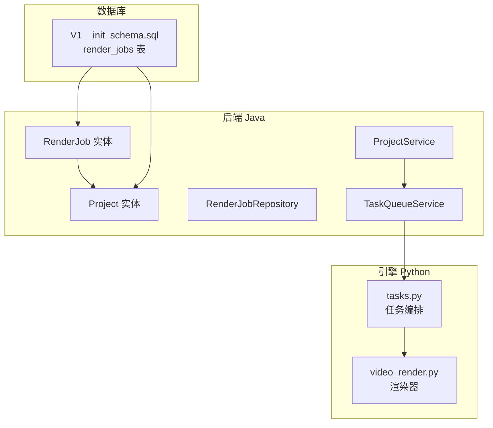
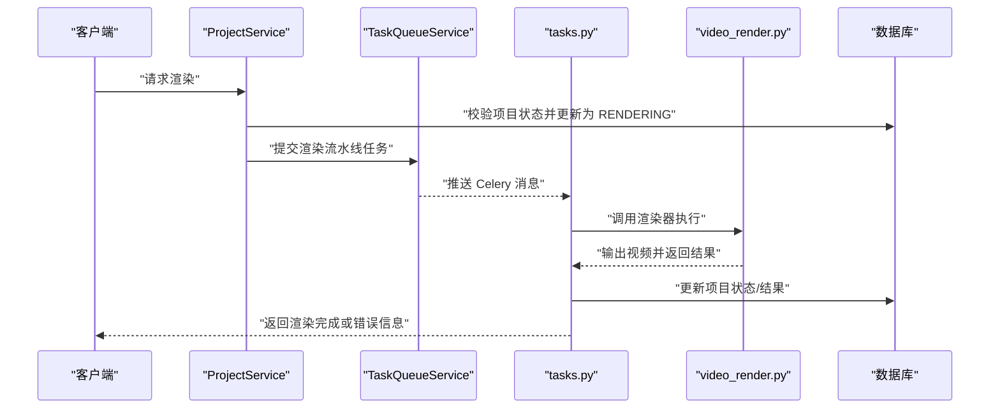
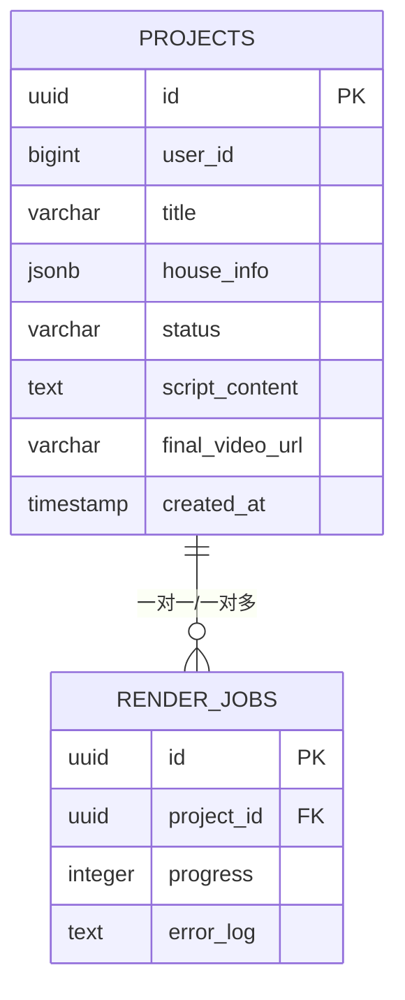
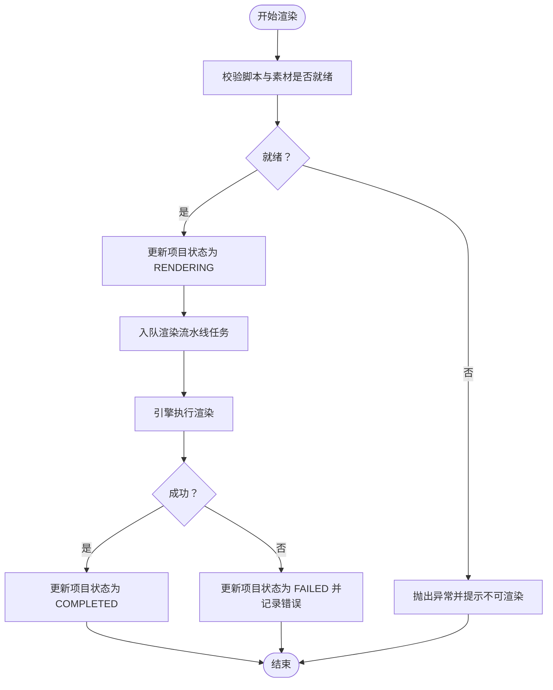
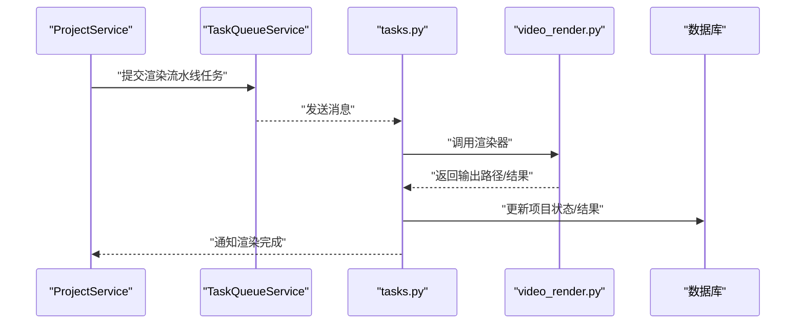
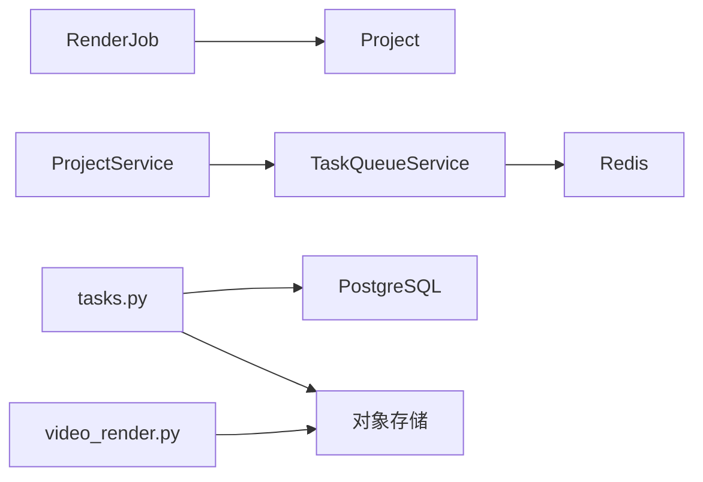

# 渲染任务实体 (RenderJob)

<cite>
**本文引用的文件**
- [RenderJob.java](file://backend/src/main/java/com/aiscene/entity/RenderJob.java)
- [Project.java](file://backend/src/main/java/com/aiscene/entity/Project.java)
- [ProjectStatus.java](file://backend/src/main/java/com/aiscene/entity/ProjectStatus.java)
- [RenderJobRepository.java](file://backend/src/main/java/com/aiscene/repository/RenderJobRepository.java)
- [V1__init_schema.sql](file://backend/src/main/resources/db/migration/V1__init_schema.sql)
- [ProjectService.java](file://backend/src/main/java/com/aiscene/service/ProjectService.java)
- [TaskQueueService.java](file://backend/src/main/java/com/aiscene/service/TaskQueueService.java)
- [video_render.py](file://engine/video_render.py)
- [tasks.py](file://engine/tasks.py)
</cite>

## 目录
1. [简介](#简介)
2. [项目结构](#项目结构)
3. [核心组件](#核心组件)
4. [架构总览](#架构总览)
5. [详细组件分析](#详细组件分析)
6. [依赖分析](#依赖分析)
7. [性能考虑](#性能考虑)
8. [故障排查指南](#故障排查指南)
9. [结论](#结论)

## 简介
本文件围绕渲染任务实体（RenderJob）构建完整数据模型文档，结合后端实体定义与数据库初始化脚本，系统性说明以下字段：
- id：主键（UUID）
- project_id：外键，唯一关联一个 Project
- progress：整型进度值（用于前端展示渲染进度）
- error_log：文本型错误日志（记录渲染失败原因）

同时阐明 RenderJob 在最终视频生成流程中的关键作用：作为后端与 AI 引擎（Python 后端任务）之间的状态同步桥梁，支撑监控渲染进度、处理失败任务与实现重试机制。

## 项目结构
- 后端 Java 层包含实体、仓库、服务与配置；数据库初始化脚本定义了 render_jobs 表结构。
- 引擎侧 Python 通过 Celery 任务队列调度视频渲染流水线，任务完成后回写项目状态与结果。

图表来源
- [RenderJob.java](file://backend/src/main/java/com/aiscene/entity/RenderJob.java#L1-L32)
- [Project.java](file://backend/src/main/java/com/aiscene/entity/Project.java#L1-L72)
- [RenderJobRepository.java](file://backend/src/main/java/com/aiscene/repository/RenderJobRepository.java#L1-L12)
- [V1__init_schema.sql](file://backend/src/main/resources/db/migration/V1__init_schema.sql#L1-L33)
- [ProjectService.java](file://backend/src/main/java/com/aiscene/service/ProjectService.java#L196-L230)
- [TaskQueueService.java](file://backend/src/main/java/com/aiscene/service/TaskQueueService.java#L87-L107)
- [video_render.py](file://engine/video_render.py#L233-L448)
- [tasks.py](file://engine/tasks.py#L383-L416)

章节来源
- [RenderJob.java](file://backend/src/main/java/com/aiscene/entity/RenderJob.java#L1-L32)
- [V1__init_schema.sql](file://backend/src/main/resources/db/migration/V1__init_schema.sql#L26-L33)

## 核心组件
- RenderJob 实体：承载单个项目的渲染任务元数据，包含进度与错误日志，一对一绑定到 Project。
- 数据库表 render_jobs：由初始化脚本创建，包含 id、project_id、progress、error_log 字段，并与 projects 表建立外键约束。
- ProjectService：负责触发渲染任务（提交渲染流水线任务），并根据项目状态机推进整体流程。
- TaskQueueService：将渲染相关任务序列化为消息推送到 Celery 队列，供 Python 引擎消费。
- Python 引擎：video_render.py 执行实际渲染逻辑；tasks.py 负责任务编排与状态更新。

章节来源
- [RenderJob.java](file://backend/src/main/java/com/aiscene/entity/RenderJob.java#L1-L32)
- [V1__init_schema.sql](file://backend/src/main/resources/db/migration/V1__init_schema.sql#L26-L33)
- [ProjectService.java](file://backend/src/main/java/com/aiscene/service/ProjectService.java#L196-L230)
- [TaskQueueService.java](file://backend/src/main/java/com/aiscene/service/TaskQueueService.java#L87-L107)
- [video_render.py](file://engine/video_render.py#L233-L448)
- [tasks.py](file://engine/tasks.py#L383-L416)

## 架构总览
渲染任务贯穿“后端触发—队列分发—引擎执行—状态回写”的闭环，RenderJob 作为渲染任务的载体，辅助后端与引擎进行状态同步与可观测性。

图表来源
- [ProjectService.java](file://backend/src/main/java/com/aiscene/service/ProjectService.java#L196-L230)
- [TaskQueueService.java](file://backend/src/main/java/com/aiscene/service/TaskQueueService.java#L87-L107)
- [tasks.py](file://engine/tasks.py#L383-L416)
- [video_render.py](file://engine/video_render.py#L233-L448)

## 详细组件分析

### 数据模型：RenderJob 与 render_jobs 表
- 主键与类型
  - id：UUID，唯一标识一条渲染任务记录。
- 外键关联
  - project_id：指向 projects.id 的外键，确保每条渲染任务仅对应一个项目。
- 进度与错误
  - progress：整型，用于前端展示渲染进度百分比或阶段编号。
  - error_log：文本，记录渲染过程中的错误信息，便于定位问题。
- 时间戳
  - createdAt：由数据库默认值生成，用于审计与排序。
  - updatedAt：当前数据库脚本未显式添加，但可通过应用层或后续迁移补充。

图表来源
- [V1__init_schema.sql](file://backend/src/main/resources/db/migration/V1__init_schema.sql#L1-L33)
- [Project.java](file://backend/src/main/java/com/aiscene/entity/Project.java#L1-L72)
- [RenderJob.java](file://backend/src/main/java/com/aiscene/entity/RenderJob.java#L1-L32)

章节来源
- [V1__init_schema.sql](file://backend/src/main/resources/db/migration/V1__init_schema.sql#L26-L33)
- [RenderJob.java](file://backend/src/main/java/com/aiscene/entity/RenderJob.java#L1-L32)

### 关系与约束
- 与 Project 的关系
  - RenderJob 通过 @ManyToOne 映射到 Project，外键为 project_id。
  - 数据库层面，render_jobs.project_id 引用 projects.id。
- 约束与索引
  - 主键：render_jobs.id
  - 外键：render_jobs.project_id -> projects.id
  - 建议：可为 project_id 添加索引以优化查询性能（当前脚本未显式创建索引）。

章节来源
- [RenderJob.java](file://backend/src/main/java/com/aiscene/entity/RenderJob.java#L23-L25)
- [V1__init_schema.sql](file://backend/src/main/resources/db/migration/V1__init_schema.sql#L26-L33)

### 字段语义与用途
- id
  - 用途：唯一标识渲染任务，便于追踪与幂等处理。
  - 类型：UUID。
- project_id
  - 用途：将渲染任务与具体项目绑定，确保渲染结果归属正确。
  - 约束：非空且引用 projects.id。
- progress
  - 用途：记录渲染进度，支持前端轮询展示。
  - 类型：整数，取值范围取决于业务约定（如 0-100）。
- error_log
  - 用途：记录渲染失败原因，便于用户与运维排查。
  - 类型：文本，长度无上限限制。
- created_at
  - 用途：审计与排序，记录任务创建时间。
  - 来源：数据库默认值。
- updated_at
  - 当前脚本未显式创建；可在后续迁移中添加以支持变更审计。

章节来源
- [V1__init_schema.sql](file://backend/src/main/resources/db/migration/V1__init_schema.sql#L26-L33)
- [RenderJob.java](file://backend/src/main/java/com/aiscene/entity/RenderJob.java#L1-L32)

### 与项目状态机的协作
- 触发渲染
  - ProjectService 在校验脚本与素材齐全后，尝试将项目状态更新为 RENDERING，随后提交渲染流水线任务。
- 状态推进
  - Python 任务在执行过程中会更新项目状态（例如从 RENDERING 到 COMPLETED 或 FAILED），并与 RenderJob 协同维护进度与错误信息。
- 重试机制
  - ProjectService 提供重试入口，允许用户在失败后重新发起渲染。

图表来源
- [ProjectService.java](file://backend/src/main/java/com/aiscene/service/ProjectService.java#L196-L230)
- [tasks.py](file://engine/tasks.py#L383-L416)

章节来源
- [ProjectService.java](file://backend/src/main/java/com/aiscene/service/ProjectService.java#L196-L230)
- [tasks.py](file://engine/tasks.py#L383-L416)

### 与 AI 引擎（video_render.py）的交互
- 引擎职责
  - video_render.py 负责下载素材、拼接视频、匹配音频、导出最终视频。
- 任务编排
  - tasks.py 将渲染任务编排为流水线，调用渲染器并上传结果至对象存储，最后更新项目状态。
- 进度与错误
  - RenderJob 的 progress 与 error_log 可由引擎侧在任务执行过程中回写，从而实现后端与引擎的状态同步。

图表来源
- [TaskQueueService.java](file://backend/src/main/java/com/aiscene/service/TaskQueueService.java#L87-L107)
- [tasks.py](file://engine/tasks.py#L383-L416)
- [video_render.py](file://engine/video_render.py#L233-L448)

章节来源
- [TaskQueueService.java](file://backend/src/main/java/com/aiscene/service/TaskQueueService.java#L87-L107)
- [tasks.py](file://engine/tasks.py#L383-L416)
- [video_render.py](file://engine/video_render.py#L233-L448)

## 依赖分析
- 组件耦合
  - RenderJob 与 Project 通过外键关联，形成强约束的一对一/一对多关系。
  - ProjectService 依赖 TaskQueueService 推送渲染任务，依赖 ProjectRepository 更新状态。
  - TaskQueueService 依赖 RedisTemplate 与 ObjectMapper，将任务序列化后入队。
  - Python 侧 tasks.py 依赖数据库连接与对象存储客户端，负责状态更新与结果落盘。
- 外部依赖
  - Redis：Celery 消息队列。
  - PostgreSQL：存储项目与渲染任务元数据。
  - 对象存储：存放中间与最终视频产物。

图表来源
- [RenderJob.java](file://backend/src/main/java/com/aiscene/entity/RenderJob.java#L1-L32)
- [Project.java](file://backend/src/main/java/com/aiscene/entity/Project.java#L1-L72)
- [ProjectService.java](file://backend/src/main/java/com/aiscene/service/ProjectService.java#L196-L230)
- [TaskQueueService.java](file://backend/src/main/java/com/aiscene/service/TaskQueueService.java#L87-L107)
- [tasks.py](file://engine/tasks.py#L383-L416)
- [video_render.py](file://engine/video_render.py#L233-L448)

章节来源
- [RenderJob.java](file://backend/src/main/java/com/aiscene/entity/RenderJob.java#L1-L32)
- [Project.java](file://backend/src/main/java/com/aiscene/entity/Project.java#L1-L72)
- [ProjectService.java](file://backend/src/main/java/com/aiscene/service/ProjectService.java#L196-L230)
- [TaskQueueService.java](file://backend/src/main/java/com/aiscene/service/TaskQueueService.java#L87-L107)
- [tasks.py](file://engine/tasks.py#L383-L416)
- [video_render.py](file://engine/video_render.py#L233-L448)

## 性能考虑
- 查询优化
  - 为 render_jobs.project_id 添加索引，提升按项目查询渲染任务的效率。
- 写入优化
  - progress 与 error_log 的更新频率较高，建议批量写入或合并更新，减少事务开销。
- 存储与网络
  - 渲染过程涉及大量视频下载与转码，建议使用本地缓存与并发控制，避免重复下载。
- 状态一致性
  - 使用乐观锁或条件更新（如项目状态在特定范围内才允许更新）降低并发冲突。

## 故障排查指南
- 渲染失败
  - 检查 RenderJob.error_log 是否存在错误信息；结合 Python 任务日志定位问题。
  - 确认对象存储访问权限与 URL 可达性。
- 进度停滞
  - 核对 progress 是否持续不变；检查引擎任务是否仍在运行或被阻塞。
- 状态不一致
  - 若项目状态长时间停留在 RENDERING，需确认 Python 任务是否成功回写状态。
- 重试机制
  - 使用 ProjectService 的重试接口重新发起渲染，避免手动干预。

章节来源
- [RenderJob.java](file://backend/src/main/java/com/aiscene/entity/RenderJob.java#L1-L32)
- [ProjectService.java](file://backend/src/main/java/com/aiscene/service/ProjectService.java#L336-L340)
- [tasks.py](file://engine/tasks.py#L383-L416)

## 结论
RenderJob 作为渲染任务的载体，承担着进度与错误信息的记录职责，是后端与 AI 引擎之间状态同步的关键纽带。配合 Project 的状态机与 TaskQueueService 的任务编排，能够有效支撑最终视频生成流程的可观测性与可靠性。建议在后续迭代中完善时间戳字段与索引策略，并在引擎侧增强进度上报与错误回写能力，以进一步提升用户体验与运维效率。