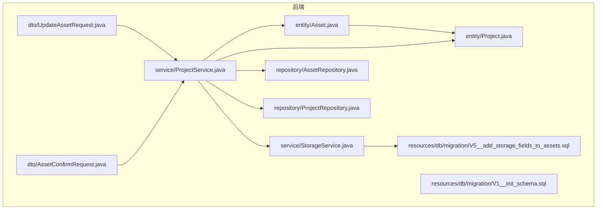
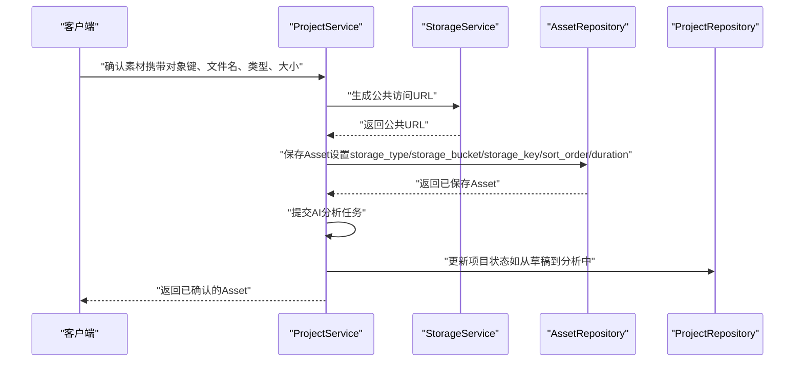
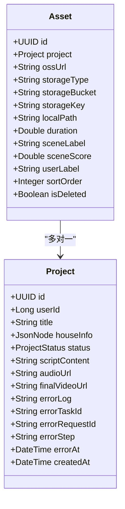
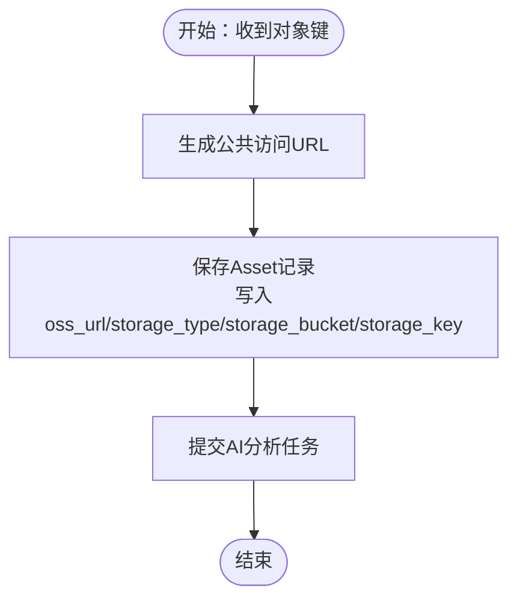
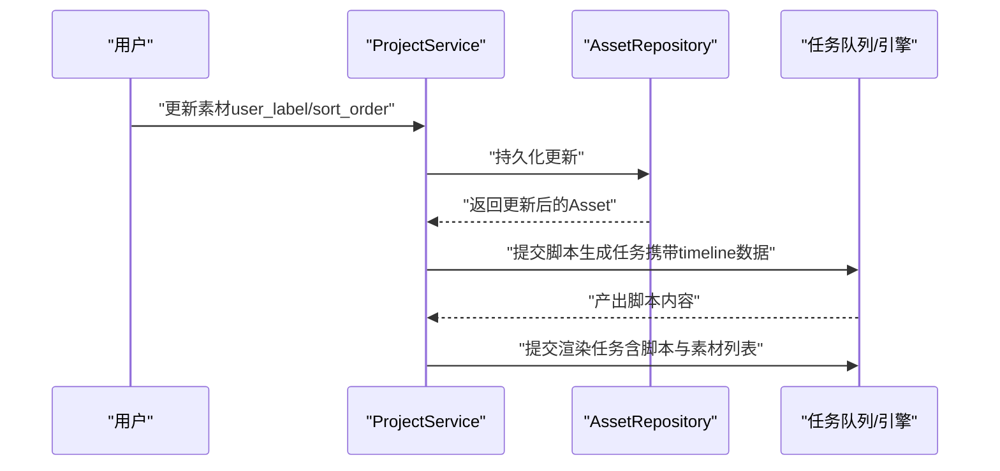
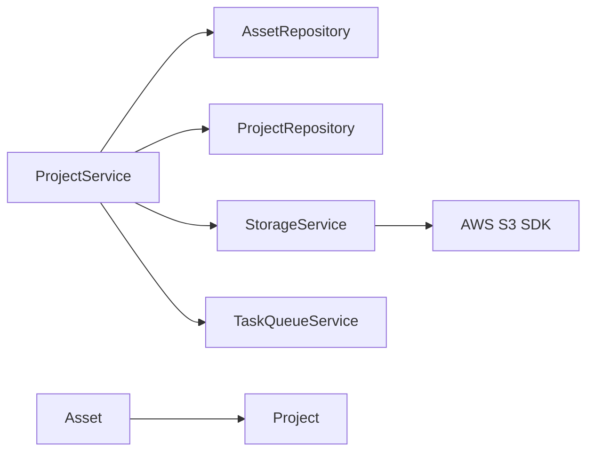

# 素材实体（Asset）

<cite>
**本文引用的文件**
- [Asset.java](file://backend/src/main/java/com/aiscene/entity/Asset.java)
- [Project.java](file://backend/src/main/java/com/aiscene/entity/Project.java)
- [V1__init_schema.sql](file://backend/src/main/resources/db/migration/V1__init_schema.sql)
- [V5__add_storage_fields_to_assets.sql](file://backend/src/main/resources/db/migration/V5__add_storage_fields_to_assets.sql)
- [ProjectService.java](file://backend/src/main/java/com/aiscene/service/ProjectService.java)
- [StorageService.java](file://backend/src/main/java/com/aiscene/service/StorageService.java)
- [UpdateAssetRequest.java](file://backend/src/main/java/com/aiscene/dto/UpdateAssetRequest.java)
- [AssetConfirmRequest.java](file://backend/src/main/java/com/aiscene/dto/AssetConfirmRequest.java)
- [ProjectServiceTest.java](file://backend/src/test/java/com/aiscene/service/ProjectServiceTest.java)
</cite>

## 目录
1. [简介](#简介)
2. [项目结构](#项目结构)
3. [核心组件](#核心组件)
4. [架构总览](#架构总览)
5. [详细组件分析](#详细组件分析)
6. [依赖分析](#依赖分析)
7. [性能考虑](#性能考虑)
8. [故障排查指南](#故障排查指南)
9. [结论](#结论)
10. [附录](#附录)

## 简介
本文件围绕素材实体（Asset）的数据模型进行系统化梳理，结合实体类定义与数据库迁移脚本，完整说明资产表的字段设计、与项目的多对一关系、以及在AI场景识别、用户交互排序修正与视频渲染流程中的关键作用。特别地，本文聚焦以下字段：
- id：主键，UUID 类型
- project_id：外键，关联项目（Project）
- original_filename：原始文件名（由上传确认请求携带）
- storage_type：存储类型（默认“S3”，用于抽象S3兼容存储后端）
- storage_key：对象存储中的唯一键（与桶名组合定位资源）
- scene_type：AI识别出的场景类型（如客厅、卧室等）
- sort_order：用户修正后的排序序号
- duration：视频时长（秒），由后续任务填充

同时，本文解释 storage_type 与 storage_key 如何实现对 S3 兼容存储后端的抽象，并给出在视频上传、元数据管理与渲染序列构建方面的数据层面指导。

## 项目结构
- 后端采用分层架构：entity（实体）、repository（仓储）、service（服务）、controller（控制器）、dto（数据传输对象）、resources/db/migration（数据库迁移）
- Asset 实体位于 entity 层，与 Project 实体通过多对一关系关联
- 数据库迁移脚本定义了 assets 表的初始结构与后续新增的存储相关字段

图表来源
- [Asset.java](file://backend/src/main/java/com/aiscene/entity/Asset.java#L1-L61)
- [Project.java](file://backend/src/main/java/com/aiscene/entity/Project.java#L1-L72)
- [ProjectService.java](file://backend/src/main/java/com/aiscene/service/ProjectService.java#L1-L200)
- [StorageService.java](file://backend/src/main/java/com/aiscene/service/StorageService.java#L1-L141)
- [UpdateAssetRequest.java](file://backend/src/main/java/com/aiscene/dto/UpdateAssetRequest.java#L1-L16)
- [AssetConfirmRequest.java](file://backend/src/main/java/com/aiscene/dto/AssetConfirmRequest.java#L1-L13)
- [V1__init_schema.sql](file://backend/src/main/resources/db/migration/V1__init_schema.sql#L1-L33)
- [V5__add_storage_fields_to_assets.sql](file://backend/src/main/resources/db/migration/V5__add_storage_fields_to_assets.sql#L1-L6)

章节来源
- [Asset.java](file://backend/src/main/java/com/aiscene/entity/Asset.java#L1-L61)
- [Project.java](file://backend/src/main/java/com/aiscene/entity/Project.java#L1-L72)
- [V1__init_schema.sql](file://backend/src/main/resources/db/migration/V1__init_schema.sql#L1-L33)
- [V5__add_storage_fields_to_assets.sql](file://backend/src/main/resources/db/migration/V5__add_storage_fields_to_assets.sql#L1-L6)

## 核心组件
- 素材实体（Asset）：承载视频素材的元信息与存储位置抽象，支持 AI 场景标签、用户修正排序与渲染所需时长
- 项目实体（Project）：承载项目级状态、脚本内容与最终视频地址等
- 存储服务（StorageService）：封装 S3 兼容存储的上传、签名与公共访问 URL 生成逻辑
- 项目服务（ProjectService）：协调素材确认、智能时间线排序、脚本生成与渲染提交

章节来源
- [Asset.java](file://backend/src/main/java/com/aiscene/entity/Asset.java#L1-L61)
- [Project.java](file://backend/src/main/java/com/aiscene/entity/Project.java#L1-L72)
- [StorageService.java](file://backend/src/main/java/com/aiscene/service/StorageService.java#L1-L141)
- [ProjectService.java](file://backend/src/main/java/com/aiscene/service/ProjectService.java#L1-L200)

## 架构总览
下图展示 Asset 与 Project 的关系，以及在上传、分析、排序、脚本生成与渲染阶段中数据流的关键节点。

图表来源
- [ProjectService.java](file://backend/src/main/java/com/aiscene/service/ProjectService.java#L49-L84)
- [StorageService.java](file://backend/src/main/java/com/aiscene/service/StorageService.java#L76-L102)
- [Asset.java](file://backend/src/main/java/com/aiscene/entity/Asset.java#L1-L61)
- [AssetConfirmRequest.java](file://backend/src/main/java/com/aiscene/dto/AssetConfirmRequest.java#L1-L13)

## 详细组件分析

### 数据模型：Assets 表结构
- 初始结构（V1 迁移）包含：
  - id（UUID 主键）
  - project_id（UUID 外键，引用 projects.id）
  - oss_url（字符串，存储公共访问地址）
  - duration（双精度，视频时长）
  - scene_label（字符串，AI识别场景标签）
  - scene_score（双精度，置信度）
  - user_label（字符串，用户修正标签）
  - sort_order（整数，排序序号）
  - is_deleted（布尔，默认 false）
- 后续增强（V5 迁移）新增：
  - storage_type（字符串，默认“S3”）
  - storage_bucket（字符串，存储桶名）
  - storage_key（字符串，对象键）
  - local_path（字符串，本地路径，便于回退或本地开发）

字段与实体映射关系（以实体类为准）：
- id：主键，UUID
- project：多对一关联 Project
- ossUrl：公共访问 URL
- storageType：存储类型，默认“S3”
- storageBucket：存储桶名
- storageKey：对象键
- localPath：本地路径
- duration：视频时长（秒）
- sceneLabel：AI识别场景标签
- sceneScore：AI置信度
- userLabel：用户修正标签
- sortOrder：用户修正排序序号
- isDeleted：软删除标记

章节来源
- [V1__init_schema.sql](file://backend/src/main/resources/db/migration/V1__init_schema.sql#L1-L33)
- [V5__add_storage_fields_to_assets.sql](file://backend/src/main/resources/db/migration/V5__add_storage_fields_to_assets.sql#L1-L6)
- [Asset.java](file://backend/src/main/java/com/aiscene/entity/Asset.java#L1-L61)

### 关系建模：Asset 与 Project
- 多对一：每个 Asset 属于一个 Project；Project 可拥有多个 Asset
- 外键约束：assets.project_id 引用 projects.id
- 查询顺序：按 sort_order 升序排列，便于时间线展示与渲染

图表来源
- [Project.java](file://backend/src/main/java/com/aiscene/entity/Project.java#L1-L72)
- [Asset.java](file://backend/src/main/java/com/aiscene/entity/Asset.java#L1-L61)

章节来源
- [Project.java](file://backend/src/main/java/com/aiscene/entity/Project.java#L1-L72)
- [Asset.java](file://backend/src/main/java/com/aiscene/entity/Asset.java#L1-L61)

### 字段详解与用途
- id（主键）
  - 类型：UUID
  - 作用：唯一标识素材记录
- project_id（外键）
  - 作用：归属项目，支撑项目维度的时间线与渲染
- original_filename（原始文件名）
  - 来源：上传确认请求携带
  - 作用：辅助展示与审计
- storage_type（存储类型）
  - 默认值：“S3”
  - 作用：统一抽象 S3 兼容存储后端，便于未来切换或扩展
- storage_key（对象存储键）
  - 作用：与桶名组合定位具体对象，支持公共访问 URL 生成
- scene_type（AI识别场景类型）
  - 来源：AI 分析结果
  - 作用：驱动智能排序与脚本生成
- sort_order（用户修正排序）
  - 来源：用户交互修正
  - 作用：覆盖 AI 排序，决定渲染顺序
- duration（视频时长）
  - 来源：后续任务填充
  - 作用：渲染阶段计算总时长与剪辑节奏

章节来源
- [Asset.java](file://backend/src/main/java/com/aiscene/entity/Asset.java#L1-L61)
- [AssetConfirmRequest.java](file://backend/src/main/java/com/aiscene/dto/AssetConfirmRequest.java#L1-L13)
- [ProjectService.java](file://backend/src/main/java/com/aiscene/service/ProjectService.java#L49-L84)

### 存储抽象：storage_type 与 storage_key
- 抽象策略
  - storage_type 统一标识存储后端类型（默认“S3”），便于未来扩展其他后端
  - storage_key 作为对象键，配合存储桶名与公共 URL 基础配置，形成可移植的资源定位
- URL 生成逻辑
  - StorageService 提供公共 URL 生成方法，依据基础地址与桶名拼接对象路径
  - 支持多种域名形态（自定义域名、Cloudflare R2、AWS S3、本地回环等）
- 上传流程
  - 上传确认时，服务侧根据对象键生成公共 URL 并写入 oss_url
  - 同时写入 storage_type、storage_bucket、storage_key，完成存储抽象与定位

图表来源
- [ProjectService.java](file://backend/src/main/java/com/aiscene/service/ProjectService.java#L49-L84)
- [StorageService.java](file://backend/src/main/java/com/aiscene/service/StorageService.java#L76-L102)
- [Asset.java](file://backend/src/main/java/com/aiscene/entity/Asset.java#L1-L61)

章节来源
- [StorageService.java](file://backend/src/main/java/com/aiscene/service/StorageService.java#L1-L141)
- [ProjectService.java](file://backend/src/main/java/com/aiscene/service/ProjectService.java#L49-L84)
- [Asset.java](file://backend/src/main/java/com/aiscene/entity/Asset.java#L1-L61)

### AI 分析、用户交互与渲染流程中的角色
- AI 分析
  - 项目服务在素材确认后提交分析任务，AI 结果写入 scene_label 与 scene_score
- 用户交互（排序修正）
  - 用户可通过更新接口修改 user_label 与 sort_order，服务侧同步持久化
- 渲染序列构建
  - 脚本生成阶段读取 assets 的 scene_label、scene_score、oss_url、duration
  - 渲染阶段按 sort_order 排列素材，结合脚本内容与时长构建最终视频

图表来源
- [ProjectService.java](file://backend/src/main/java/com/aiscene/service/ProjectService.java#L126-L141)
- [ProjectService.java](file://backend/src/main/java/com/aiscene/service/ProjectService.java#L143-L165)
- [ProjectService.java](file://backend/src/main/java/com/aiscene/service/ProjectService.java#L196-L205)
- [UpdateAssetRequest.java](file://backend/src/main/java/com/aiscene/dto/UpdateAssetRequest.java#L1-L16)

章节来源
- [ProjectService.java](file://backend/src/main/java/com/aiscene/service/ProjectService.java#L86-L124)
- [ProjectService.java](file://backend/src/main/java/com/aiscene/service/ProjectService.java#L126-L141)
- [ProjectService.java](file://backend/src/main/java/com/aiscene/service/ProjectService.java#L143-L165)
- [ProjectService.java](file://backend/src/main/java/com/aiscene/service/ProjectService.java#L196-L205)
- [UpdateAssetRequest.java](file://backend/src/main/java/com/aiscene/dto/UpdateAssetRequest.java#L1-L16)

## 依赖分析
- 实体间依赖
  - Asset 依赖 Project（多对一）
- 服务间依赖
  - ProjectService 依赖 AssetRepository、ProjectRepository、StorageService、TaskQueueService
  - StorageService 依赖 AWS SDK S3 客户端与预签名器
- DTO 依赖
  - AssetConfirmRequest 用于确认素材时的输入
  - UpdateAssetRequest 用于用户修正素材属性

图表来源
- [ProjectService.java](file://backend/src/main/java/com/aiscene/service/ProjectService.java#L1-L200)
- [StorageService.java](file://backend/src/main/java/com/aiscene/service/StorageService.java#L1-L141)
- [Asset.java](file://backend/src/main/java/com/aiscene/entity/Asset.java#L1-L61)
- [Project.java](file://backend/src/main/java/com/aiscene/entity/Project.java#L1-L72)

章节来源
- [ProjectService.java](file://backend/src/main/java/com/aiscene/service/ProjectService.java#L1-L200)
- [StorageService.java](file://backend/src/main/java/com/aiscene/service/StorageService.java#L1-L141)
- [Asset.java](file://backend/src/main/java/com/aiscene/entity/Asset.java#L1-L61)
- [Project.java](file://backend/src/main/java/com/aiscene/entity/Project.java#L1-L72)

## 性能考虑
- 查询排序
  - 按 sort_order 升序查询，避免在应用层二次排序
- 存储访问
  - 使用公共 URL 直接访问对象存储，减少中间层转发开销
- 批量处理
  - 在脚本生成与渲染阶段，优先使用投影或精简字段，降低网络与序列化成本
- 索引建议
  - assets.project_id + sort_order 组合索引可提升时间线查询效率（建议在生产环境评估）

## 故障排查指南
- 确认素材未被软删除
  - is_deleted 默认 false，若为 true 将不会出现在时间线中
- 存储 URL 生成异常
  - 检查公共 URL 基础配置与桶名是否匹配，确保域名形态正确
- AI 分析未生效
  - 确认已提交分析任务且 scene_label/scene_score 已写入
- 排序不生效
  - 用户修正的 sort_order 会覆盖 AI 排序，检查更新接口调用是否成功

章节来源
- [Asset.java](file://backend/src/main/java/com/aiscene/entity/Asset.java#L1-L61)
- [StorageService.java](file://backend/src/main/java/com/aiscene/service/StorageService.java#L76-L102)
- [ProjectService.java](file://backend/src/main/java/com/aiscene/service/ProjectService.java#L86-L124)
- [ProjectService.java](file://backend/src/main/java/com/aiscene/service/ProjectService.java#L126-L141)

## 结论
Asset 实体通过统一的存储抽象（storage_type 与 storage_key）与清晰的字段设计，有效支撑了视频素材的上传、AI 场景识别、用户排序修正与渲染序列构建。其与 Project 的多对一关系使得项目维度的时间线与渲染流程具备良好的可维护性与扩展性。建议在生产环境中完善索引与监控，确保高并发下的稳定性与可观测性。

## 附录
- 数据库迁移要点
  - V1：初始化 assets 表，包含 OSS URL、时长、场景标签、用户标签、排序与软删除字段
  - V5：新增存储类型、桶名、对象键与本地路径字段，完善存储抽象
- 测试验证点
  - 确认素材确认后自动提交分析任务
  - 智能排序仅在存在 AI 标签时生效
  - 更新素材的用户标签与排序序号可持久化
  - 渲染阶段读取素材列表与脚本内容

章节来源
- [V1__init_schema.sql](file://backend/src/main/resources/db/migration/V1__init_schema.sql#L1-L33)
- [V5__add_storage_fields_to_assets.sql](file://backend/src/main/resources/db/migration/V5__add_storage_fields_to_assets.sql#L1-L6)
- [ProjectServiceTest.java](file://backend/src/test/java/com/aiscene/service/ProjectServiceTest.java#L90-L121)
- [ProjectServiceTest.java](file://backend/src/test/java/com/aiscene/service/ProjectServiceTest.java#L123-L154)
- [ProjectServiceTest.java](file://backend/src/test/java/com/aiscene/service/ProjectServiceTest.java#L171-L187)