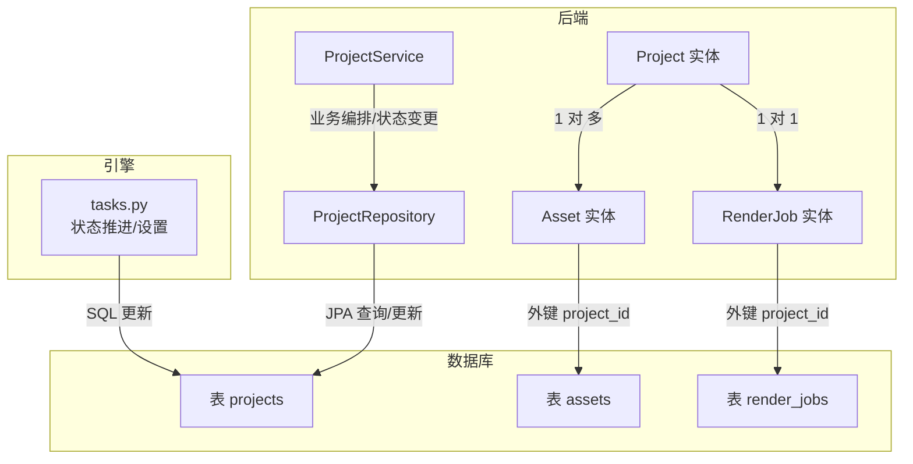
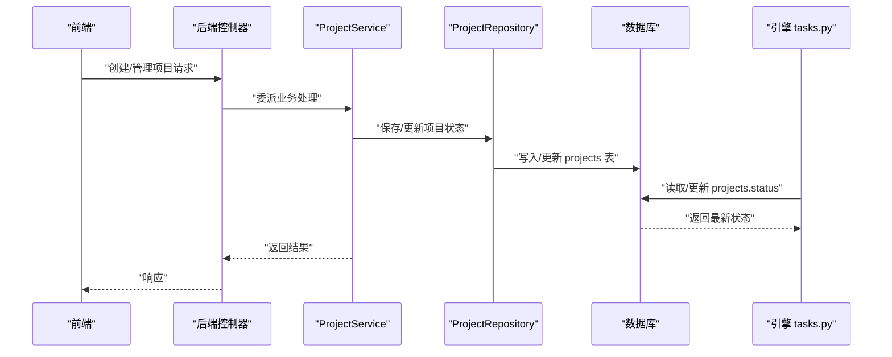
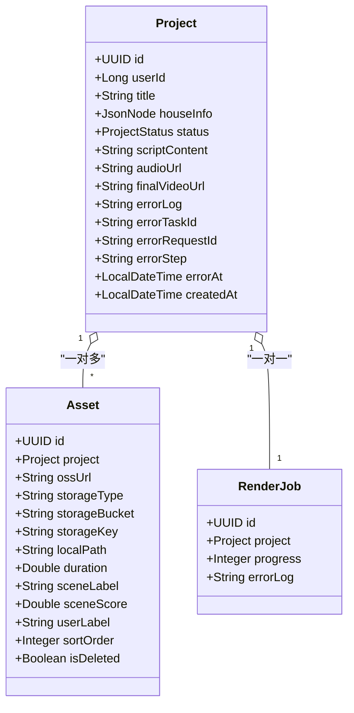
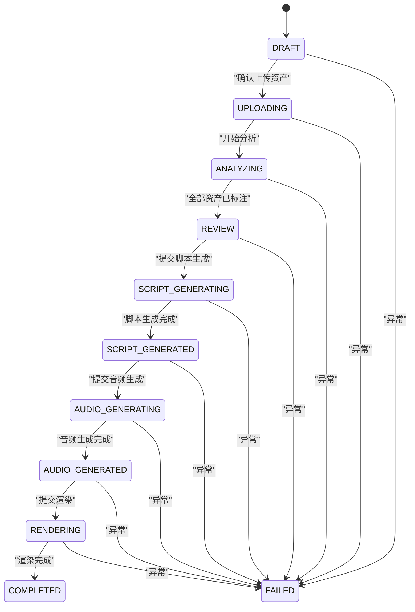
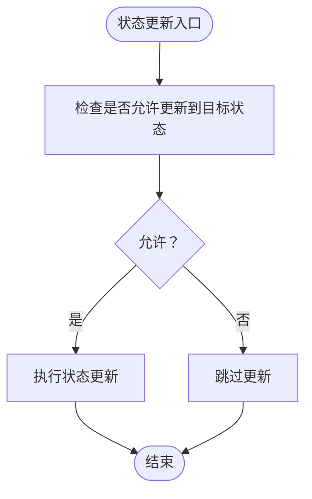
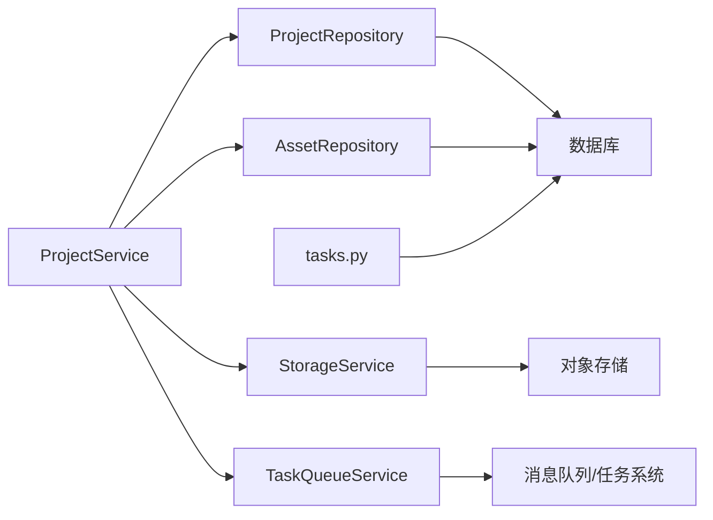

# 项目实体 (Project)

<cite>
**本文引用的文件**
- [Project.java](file://backend/src/main/java/com/aiscene/entity/Project.java)
- [ProjectStatus.java](file://backend/src/main/java/com/aiscene/entity/ProjectStatus.java)
- [Asset.java](file://backend/src/main/java/com/aiscene/entity/Asset.java)
- [RenderJob.java](file://backend/src/main/java/com/aiscene/entity/RenderJob.java)
- [ProjectRepository.java](file://backend/src/main/java/com/aiscene/repository/ProjectRepository.java)
- [ProjectService.java](file://backend/src/main/java/com/aiscene/service/ProjectService.java)
- [V1__init_schema.sql](file://backend/src/main/resources/db/migration/V1__init_schema.sql)
- [V3__add_error_fields_to_projects.sql](file://backend/src/main/resources/db/migration/V3__add_error_fields_to_projects.sql)
- [tasks.py](file://engine/tasks.py)
</cite>

## 目录
1. [简介](#简介)
2. [项目结构](#项目结构)
3. [核心组件](#核心组件)
4. [架构总览](#架构总览)
5. [详细组件分析](#详细组件分析)
6. [依赖分析](#依赖分析)
7. [性能考虑](#性能考虑)
8. [故障排查指南](#故障排查指南)
9. [结论](#结论)
10. [附录](#附录)

## 简介
本文件面向后端开发者与产品/测试同学，系统性梳理 Project 实体及其在数据库中的表结构，明确字段的业务含义、数据类型与约束，并阐明 Project 与 Asset（一对多）及 RenderJob（一对一）的 JPA 关联关系。同时，结合 Flyway 迁移脚本与服务层实现，给出项目生命周期中关键状态流转（如 DRAFT、UPLOADING、ANALYZING、REVIEW、SCRIPT_GENERATING、SCRIPT_GENERATED、AUDIO_GENERATING、AUDIO_GENERATED、RENDERING、COMPLETED、FAILED），帮助读者高效完成数据查询、状态管理与业务逻辑开发。

## 项目结构
- 后端实体与仓库位于 backend/src/main/java/com/aiscene/entity 与 backend/src/main/java/com/aiscene/repository。
- 数据库初始化与扩展由 backend/src/main/resources/db/migration 下的 Flyway 脚本定义。
- 引擎侧（Python）通过任务脚本维护项目状态并写回数据库。

图表来源
- [Project.java](file://backend/src/main/java/com/aiscene/entity/Project.java#L1-L72)
- [Asset.java](file://backend/src/main/java/com/aiscene/entity/Asset.java#L1-L61)
- [RenderJob.java](file://backend/src/main/java/com/aiscene/entity/RenderJob.java#L1-L32)
- [ProjectRepository.java](file://backend/src/main/java/com/aiscene/repository/ProjectRepository.java#L1-L27)
- [V1__init_schema.sql](file://backend/src/main/resources/db/migration/V1__init_schema.sql#L1-L33)
- [tasks.py](file://engine/tasks.py#L336-L415)

章节来源
- [Project.java](file://backend/src/main/java/com/aiscene/entity/Project.java#L1-L72)
- [V1__init_schema.sql](file://backend/src/main/resources/db/migration/V1__init_schema.sql#L1-L33)

## 核心组件
- Project 实体：承载项目元数据、状态、脚本内容、音频与最终视频地址，以及错误追踪字段。
- ProjectStatus 枚举：定义项目生命周期中的所有状态值。
- Asset 实体：项目下的素材条目，与 Project 建立一对多关系。
- RenderJob 实体：项目对应的渲染作业，与 Project 建立一对一关系。
- ProjectRepository：提供按用户分页查询与状态原子更新能力。
- ProjectService：封装业务流程（上传确认、智能时间线、脚本生成、音频生成、渲染等），驱动状态机推进。
- Flyway 迁移脚本：定义 projects、assets、render_jobs 表结构与索引。
- 引擎 tasks.py：负责从数据库读取/更新状态，推进或设置状态。

章节来源
- [Project.java](file://backend/src/main/java/com/aiscene/entity/Project.java#L1-L72)
- [ProjectStatus.java](file://backend/src/main/java/com/aiscene/entity/ProjectStatus.java#L1-L16)
- [Asset.java](file://backend/src/main/java/com/aiscene/entity/Asset.java#L1-L61)
- [RenderJob.java](file://backend/src/main/java/com/aiscene/entity/RenderJob.java#L1-L32)
- [ProjectRepository.java](file://backend/src/main/java/com/aiscene/repository/ProjectRepository.java#L1-L27)
- [ProjectService.java](file://backend/src/main/java/com/aiscene/service/ProjectService.java#L1-L200)
- [V1__init_schema.sql](file://backend/src/main/resources/db/migration/V1__init_schema.sql#L1-L33)
- [V3__add_error_fields_to_projects.sql](file://backend/src/main/resources/db/migration/V3__add_error_fields_to_projects.sql#L1-L6)
- [tasks.py](file://engine/tasks.py#L336-L415)

## 架构总览
下图展示 Project 在整体系统中的角色与交互路径：前端调用后端控制器，后端通过 ProjectService 编排业务，持久化到数据库；引擎侧任务脚本读取/更新状态并与后端协作。

图表来源
- [ProjectService.java](file://backend/src/main/java/com/aiscene/service/ProjectService.java#L1-L200)
- [ProjectRepository.java](file://backend/src/main/java/com/aiscene/repository/ProjectRepository.java#L1-L27)
- [V1__init_schema.sql](file://backend/src/main/resources/db/migration/V1__init_schema.sql#L1-L33)
- [tasks.py](file://engine/tasks.py#L336-L415)

## 详细组件分析

### 数据模型：Projects 表结构
- 表名：projects
- 主键：id（UUID）
- 用户标识：user_id（BIGINT）
- 标题：title（VARCHAR(255)）
- 房源结构化信息：house_info（JSONB）
- 状态：status（VARCHAR(50)，映射 Java 枚举 ProjectStatus）
- AI 解说脚本：script_content（TEXT）
- 音频 URL：audio_url（VARCHAR(255)）
- 最终视频下载地址：final_video_url（VARCHAR(1024)）
- 错误追踪字段（新增于 V3）：
  - error_log（TEXT）
  - error_task_id（VARCHAR(128)）
  - error_request_id（VARCHAR(128)）
  - error_step（VARCHAR(64)）
  - error_at（TIMESTAMP）
- 创建时间：created_at（TIMESTAMP，默认 CURRENT_TIMESTAMP）

字段约束与类型说明
- id：主键，UUID 类型，自动生成。
- user_id：用户标识，BIGINT。
- title：字符串，最大长度 255。
- house_info：JSONB，存储房源结构化信息，JDBC 层以 JSONB 写入。
- status：字符串，对应 ProjectStatus 枚举值。
- script_content：TEXT，存储 AI 生成的解说脚本。
- audio_url：VARCHAR(255)，音频资源访问地址。
- final_video_url：VARCHAR(1024)，最终视频下载地址。
- error_log/error_task_id/error_request_id/error_step/error_at：TEXT/VARCHAR/TIMESTAMP，用于错误定位与追踪。
- created_at：TIMESTAMP，默认当前时间，不可更新。

章节来源
- [V1__init_schema.sql](file://backend/src/main/resources/db/migration/V1__init_schema.sql#L1-L33)
- [V3__add_error_fields_to_projects.sql](file://backend/src/main/resources/db/migration/V3__add_error_fields_to_projects.sql#L1-L6)
- [Project.java](file://backend/src/main/java/com/aiscene/entity/Project.java#L1-L72)

### 字段业务语义与约束
- id：项目唯一标识，全局唯一。
- user_id：归属用户 ID，用于权限控制与分页查询。
- title：项目标题，便于前端展示与检索。
- house_info：JSONB 存储房源结构化信息（如房间数量、面积、价格等），便于后续脚本生成与智能排序。
- status：项目状态机，驱动业务流程与 UI 展示。
- script_content：AI 生成的脚本内容，支持编辑与重新生成。
- audio_url：音频文件访问地址，可能来自外部存储或服务。
- final_video_url：最终视频下载地址，渲染完成后写入。
- error_*：错误追踪字段，记录最近一次失败的任务、请求、步骤与时间，辅助问题定位。
- created_at：记录创建时间，不可更新。

章节来源
- [Project.java](file://backend/src/main/java/com/aiscene/entity/Project.java#L1-L72)
- [ProjectStatus.java](file://backend/src/main/java/com/aiscene/entity/ProjectStatus.java#L1-L16)

### JPA 关联关系
- Project 与 Asset（一对多）
  - 关系：Project 有多个 Asset；Asset 反向持有 Project。
  - 外键：assets.project_id 指向 projects.id。
  - 导航：Project 可通过集合导航到其资产列表；Asset 可通过 @ManyToOne 回指 Project。
- Project 与 RenderJob（一对一）
  - 关系：每个 Project 对应一个 RenderJob。
  - 外键：render_jobs.project_id 指向 projects.id。
  - 导航：RenderJob 可通过 @ManyToOne 回指 Project。

图表来源
- [Project.java](file://backend/src/main/java/com/aiscene/entity/Project.java#L1-L72)
- [Asset.java](file://backend/src/main/java/com/aiscene/entity/Asset.java#L1-L61)
- [RenderJob.java](file://backend/src/main/java/com/aiscene/entity/RenderJob.java#L1-L32)

章节来源
- [Asset.java](file://backend/src/main/java/com/aiscene/entity/Asset.java#L1-L61)
- [RenderJob.java](file://backend/src/main/java/com/aiscene/entity/RenderJob.java#L1-L32)
- [V1__init_schema.sql](file://backend/src/main/resources/db/migration/V1__init_schema.sql#L1-L33)

### 生命周期与状态机
- 状态枚举（ProjectStatus）：DRAFT、UPLOADING、ANALYZING、REVIEW、SCRIPT_GENERATING、SCRIPT_GENERATED、AUDIO_GENERATING、AUDIO_GENERATED、RENDERING、COMPLETED、FAILED。
- 状态流转要点（结合服务层与引擎脚本）：
  - DRAFT → UPLOADING：确认上传资产时，若项目处于草稿或上传中，状态切换为 ANALYZING。
  - UPLOADING → ANALYZING：引擎检测到无未标注资产时，将项目置为 REVIEW；若仍有待分析资产，则保持 ANALYZING。
  - ANALYZING → REVIEW：当所有资产完成场景标注且未删除时进入 REVIEW。
  - REVIEW → SCRIPT_GENERATING：提交脚本生成任务后进入 SCRIPT_GENERATING。
  - SCRIPT_GENERATING → SCRIPT_GENERATED：脚本生成成功后进入 SCRIPT_GENERATED。
  - SCRIPT_GENERATED → AUDIO_GENERATING：提交音频生成任务后进入 AUDIO_GENERATING。
  - AUDIO_GENERATING → AUDIO_GENERATED：音频生成成功后进入 AUDIO_GENERATED。
  - AUDIO_GENERATED → RENDERING：提交渲染任务后进入 RENDERING。
  - RENDERING → COMPLETED：渲染成功后写入 final_video_url 并进入 COMPLETED。
  - 任一阶段失败：进入 FAILED，并可写入 error_* 字段用于追踪。

图表来源
- [ProjectStatus.java](file://backend/src/main/java/com/aiscene/entity/ProjectStatus.java#L1-L16)
- [ProjectService.java](file://backend/src/main/java/com/aiscene/service/ProjectService.java#L1-L200)
- [tasks.py](file://engine/tasks.py#L336-L415)

章节来源
- [ProjectStatus.java](file://backend/src/main/java/com/aiscene/entity/ProjectStatus.java#L1-L16)
- [ProjectService.java](file://backend/src/main/java/com/aiscene/service/ProjectService.java#L1-L200)
- [tasks.py](file://engine/tasks.py#L336-L415)

### 数据查询与状态管理
- 按用户分页查询项目：ProjectRepository 提供按 user_id 分页查询。
- 原子状态更新：ProjectRepository 提供 updateStatusIfIn，仅在允许的状态集合内进行状态变更，避免竞态。
- 引擎侧状态推进：tasks.py 中 _advance_project_status 与 _set_project_status 通过 SQL 更新 projects.status，支持跳过特定状态集合。

图表来源
- [ProjectRepository.java](file://backend/src/main/java/com/aiscene/repository/ProjectRepository.java#L1-L27)
- [ProjectService.java](file://backend/src/main/java/com/aiscene/service/ProjectService.java#L1-L200)
- [tasks.py](file://engine/tasks.py#L382-L415)

章节来源
- [ProjectRepository.java](file://backend/src/main/java/com/aiscene/repository/ProjectRepository.java#L1-L27)
- [tasks.py](file://engine/tasks.py#L382-L415)

### 错误追踪字段
- error_log：错误日志文本。
- error_task_id：触发错误的任务 ID。
- error_request_id：触发错误的请求 ID。
- error_step：错误发生的具体步骤。
- error_at：错误发生的时间戳。
- 用途：在 FAILED 或异常分支中记录，便于定位问题。

章节来源
- [V3__add_error_fields_to_projects.sql](file://backend/src/main/resources/db/migration/V3__add_error_fields_to_projects.sql#L1-L6)
- [Project.java](file://backend/src/main/java/com/aiscene/entity/Project.java#L1-L72)

## 依赖分析
- Project 依赖 ProjectStatus 枚举。
- Asset 与 RenderJob 通过 @ManyToOne 与 Project 建立单向关联。
- ProjectRepository 依赖 JPA，提供按用户分页与状态原子更新。
- ProjectService 依赖 ProjectRepository、AssetRepository、StorageService、TaskQueueService、ObjectMapper、JdbcTemplate，承担业务编排。
- 引擎 tasks.py 通过 SQL 直接更新 projects.status，与后端形成互补的状态推进机制。

图表来源
- [ProjectService.java](file://backend/src/main/java/com/aiscene/service/ProjectService.java#L1-L200)
- [ProjectRepository.java](file://backend/src/main/java/com/aiscene/repository/ProjectRepository.java#L1-L27)
- [Asset.java](file://backend/src/main/java/com/aiscene/entity/Asset.java#L1-L61)
- [RenderJob.java](file://backend/src/main/java/com/aiscene/entity/RenderJob.java#L1-L32)
- [tasks.py](file://engine/tasks.py#L336-L415)

章节来源
- [ProjectService.java](file://backend/src/main/java/com/aiscene/service/ProjectService.java#L1-L200)
- [ProjectRepository.java](file://backend/src/main/java/com/aiscene/repository/ProjectRepository.java#L1-L27)
- [tasks.py](file://engine/tasks.py#L336-L415)

## 性能考虑
- JSONB 字段：house_info 使用 JSONB 存储，便于灵活扩展结构化数据；但需注意查询时避免全表扫描，必要时在引擎侧进行过滤或在应用层做缓存。
- 索引：Flyway 脚本包含针对 user_id 的索引迁移，有助于按用户分页查询优化。
- 状态更新：使用原子更新（updateStatusIfIn）减少并发冲突；引擎侧也采用原子更新策略，降低竞争风险。
- 渲染与音频生成：这些操作通常耗时较长，建议通过异步任务队列推进，避免阻塞主流程。

章节来源
- [V1__init_schema.sql](file://backend/src/main/resources/db/migration/V1__init_schema.sql#L1-L33)
- [ProjectRepository.java](file://backend/src/main/java/com/aiscene/repository/ProjectRepository.java#L1-L27)
- [tasks.py](file://engine/tasks.py#L382-L415)

## 故障排查指南
- 状态不一致：检查 ProjectRepository 的原子更新是否被正确调用；核对引擎 tasks.py 是否覆盖了后端状态推进逻辑。
- 错误定位：查看 Project 的 error_* 字段，结合服务层抛出的异常与任务队列日志进行交叉验证。
- 数据一致性：确认 assets.is_deleted 与 scene_label 的状态是否影响 ANALYZING → REVIEW 的判定。
- 性能问题：关注按 user_id 的分页查询与 JSONB 查询开销，必要时增加索引或在应用层做缓存。

章节来源
- [Project.java](file://backend/src/main/java/com/aiscene/entity/Project.java#L1-L72)
- [ProjectService.java](file://backend/src/main/java/com/aiscene/service/ProjectService.java#L1-L200)
- [tasks.py](file://engine/tasks.py#L336-L415)

## 结论
Project 实体是项目生命周期的核心载体，承载用户、状态、脚本、音视频与错误追踪等关键信息。通过与 Asset（一对多）和 RenderJob（一对一）的清晰关联，配合 Flyway 的表结构定义与服务层/引擎侧的状态推进机制，实现了从上传、分析、脚本生成、音频生成到渲染的完整流程。遵循本文的数据模型与状态机规范，可有效支撑查询、状态管理与业务逻辑开发。

## 附录
- 项目生命周期关键节点
  - 上传确认：触发 UPLOADING → ANALYZING。
  - 分析完成：触发 REVIEW。
  - 脚本生成：触发 SCRIPT_GENERATING → SCRIPT_GENERATED。
  - 音频生成：触发 AUDIO_GENERATING → AUDIO_GENERATED。
  - 渲染完成：触发 RENDERING → COMPLETED，并写入 final_video_url。
  - 异常：统一进入 FAILED，并记录 error_* 字段。

章节来源
- [ProjectStatus.java](file://backend/src/main/java/com/aiscene/entity/ProjectStatus.java#L1-L16)
- [ProjectService.java](file://backend/src/main/java/com/aiscene/service/ProjectService.java#L1-L200)
- [tasks.py](file://engine/tasks.py#L336-L415)