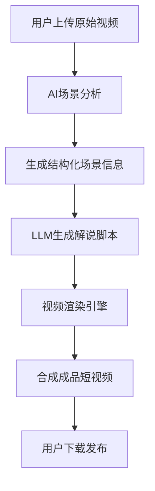
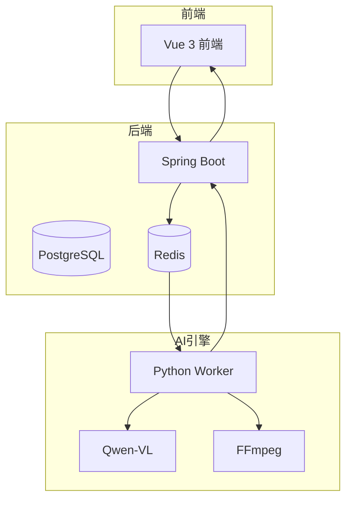

# 系统概述

<cite>
**本文档引用文件**  
- [README.md](file://README.md)
- [Technical_Architecture.md](file://docs/Technical_Architecture.md)
- [vision.py](file://engine/vision.py)
- [script_gen.py](file://engine/script_gen.py)
- [video_render.py](file://engine/video_render.py)
- [tasks.py](file://engine/tasks.py)
- [config.py](file://engine/config.py)
- [worker.py](file://engine/worker.py)
- [ProjectController.java](file://backend/src/main/java/com/aiscene/controller/ProjectController.java)
- [ProjectService.java](file://backend/src/main/java/com/aiscene/service/ProjectService.java)
- [ProjectRepository.java](file://backend/src/main/java/com/aiscene/repository/ProjectRepository.java)
- [Project.java](file://backend/src/main/java/com/aiscene/entity/Project.java)
- [Asset.java](file://backend/src/main/java/com/aiscene/entity/Asset.java)
- [application.yml](file://backend/src/main/resources/application.yml)
</cite>

## 目录
1. [项目背景与核心价值](#项目背景与核心价值)  
2. [核心设计原则](#核心设计原则)  
3. [整体数据处理流程](#整体数据处理流程)  
4. [系统架构与模块职责](#系统架构与模块职责)  
5. [异构计算架构解析](#异构计算架构解析)  
6. [实际应用场景示例](#实际应用场景示例)  
7. [系统状态流转与控制](#系统状态流转与控制)

## 项目背景与核心价值

在房产短视频内容生产领域，中介普遍面临两大效率瓶颈：一是缺乏专业的视频剪辑技能，难以将原始拍摄的房源视频素材转化为吸引人的成品；二是无法高效撰写符合平台调性的解说文案，导致内容质量参差不齐。传统的人工剪辑与配音模式成本高昂、效率低下，严重制约了内容的规模化生产。

本项目“ai-scene-to-video”旨在解决这一痛点，其核心目标并非追求炫技式的AI能力，而是通过“**可控的AI + 规则化工程**”的组合，构建一条从原始视频素材到可直接发布的成品短视频的自动化生产流水线。项目将大模型的视频理解与文本生成能力，与严谨的工程化流程相结合，确保输出内容的稳定性、可验证性与规模化能力，最终实现“把房源视频批量变成‘能发平台的看房短视频’”。

**Section sources**
- [README.md](file://README.md#L8-L26)

## 核心设计原则

为确保系统的可靠性与输出质量，项目确立了三大核心设计原则：

### 1️⃣ 结构化优先，而非自由生成
所有AI模型的输出必须是**结构化的JSON数据**，而非自由的自然语言文本。例如，视频理解模块输出的是包含时间戳、场景类型和特征的JSON对象。自然语言的生成仅在最终的解说脚本阶段进行，这保证了中间过程的可解析、可校验和可追溯。

### 2️⃣ AI决策，程序执行
系统明确划分了AI与程序的职责边界。AI负责“**决策**”：包括视频语义理解、卖点抽象和剪辑方案生成。程序则负责“**执行**”：包括使用`ffmpeg`进行视频裁剪、转场、字幕合成以及TTS（文本转语音）的集成。这种分离确保了AI的“创意”被安全地约束在工程框架内，避免了不可控的输出。

### 3️⃣ 可验证、可约束
系统严格遵循“**只允许基于视频明确可见信息进行分析**”的原则。所有生成的卖点和描述都必须有视频画面作为依据，杜绝了AI的“幻觉”和夸大宣传。同时，系统设计了用户修正机制（如`user_label`字段），允许用户对AI的识别结果进行手动覆盖，确保了最终输出的准确性。

**Section sources**
- [README.md](file://README.md#L53-L74)

## 整体数据处理流程

从用户上传视频到生成成品，系统遵循一条清晰的端到端处理流程：

1.  **用户上传**：用户通过前端上传原始房源视频，后端接收后将其存储至对象存储（如MinIO或阿里云OSS）。
2.  **AI场景分析**：系统触发AI分析任务。`vision.py`模块通过`SceneDetector`类，利用Qwen-VL等视觉大模型对视频进行语义理解，输出结构化的场景信息（如`{"time": "00:03-00:10", "room": "客厅", "features": ["大窗", "采光明显"]}`）。
3.  **脚本生成**：`script_gen.py`模块的`ScriptGenerator`类接收结构化场景信息和房源数据，调用大语言模型生成符合“温情生活风”等模板的解说脚本，并输出包含音频提示的JSON。
4.  **视频渲染**：`video_render.py`模块的`VideoRenderer`类作为执行引擎，根据剪辑方案和生成的音频，调用`ffmpeg`和`MoviePy`等工具，将原始视频片段拼接、添加字幕、合成配音和背景音乐，最终生成成品短视频。
5.  **结果交付**：成品视频上传回对象存储，系统更新项目状态，用户可在前端查看和下载。

**Diagram sources**
- [README.md](file://README.md#L79-L94)
- [vision.py](file://engine/vision.py#L13-L298)
- [script_gen.py](file://engine/script_gen.py#L7-L129)
- [video_render.py](file://engine/video_render.py#L16-L526)

## 系统架构与模块职责

系统采用“前后端分离 + 异构计算微服务”的架构模式，由Java后端、Python引擎和前端三部分组成。

### 后端 (Backend - Business)
位于`backend/`目录，使用**Spring Boot 3**构建，作为系统的“业务中台”和“指挥官”。其核心职责包括：
- **用户与项目管理**：通过`ProjectController`和`ProjectService`处理项目创建、查询等API请求。
- **状态流转控制**：管理项目从`DRAFT`、`ANALYZING`到`COMPLETED`的全生命周期状态。
- **任务调度**：通过`TaskQueueService`将分析、脚本生成等任务推送到Redis消息队列，触发Python引擎工作。
- **数据持久化**：使用**PostgreSQL**数据库存储项目、素材等核心数据，利用其强大的JSONB类型存储AI分析结果。

### AI与视频引擎 (Engine)
位于`engine/`目录，使用**Python 3.10**构建，作为系统的“工人”和“执行者”。其核心模块包括：
- **`vision.py`**：视频理解模块，负责调用Qwen-VL等模型进行场景识别。
- **`script_gen.py`**：脚本生成模块，负责生成结构化解说词。
- **`video_render.py`**：视频渲染模块，负责最终的视频合成。
- **`tasks.py`**：定义了`analyze_video_task`、`generate_script_task`等Celery异步任务。
- **`worker.py`**：Celery工作进程，监听Redis队列并执行任务。

### 前端 (Frontend)
位于`frontend/`目录，使用**Vue 3 + TypeScript**构建，为用户提供直观的操作界面，包括项目创建、视频上传、智能分段确认和视频预览等功能。

**Diagram sources**
- [Technical_Architecture.md](file://docs/Technical_Architecture.md#L20-L28)
- [ProjectController.java](file://backend/src/main/java/com/aiscene/controller/ProjectController.java#L28-L206)
- [ProjectService.java](file://backend/src/main/java/com/aiscene/service/ProjectService.java#L34-L356)
- [ProjectRepository.java](file://backend/src/main/java/com/aiscene/repository/ProjectRepository.java#L16-L27)
- [Project.java](file://backend/src/main/java/com/aiscene/entity/Project.java#L17-L72)
- [Asset.java](file://backend/src/main/java/com/aiscene/entity/Asset.java#L11-L61)
- [application.yml](file://backend/src/main/resources/application.yml#L1-L66)
- [tasks.py](file://engine/tasks.py#L1-L800)
- [worker.py](file://engine/worker.py#L83-L137)

## 异构计算架构解析

项目采用Java后端与Python引擎分离的异构架构，其深层考量在于**技术栈的最优解**。

- **Java (Spring Boot)**：在企业级业务逻辑、数据持久化和API服务方面具有无可比拟的稳定性和成熟的生态。它非常适合处理用户管理、状态流转和数据库操作。
- **Python**：在AI和视频处理领域是绝对的王者。无论是调用大模型API（如DashScope），还是使用`opencv`、`MoviePy`、`ffmpeg`等库进行视频处理，Python的库生态都远超Java。

通过**Redis消息队列**进行解耦，后端只需将任务ID和必要参数放入队列，Python引擎便能异步消费并执行耗时的AI和视频处理任务。这种架构避免了在Java中“硬写”AI调用的“战术勤奋”，实现了“战略上的懒惰”（即选择最合适的工具），保证了系统的高效与稳定。

**Section sources**
- [Technical_Architecture.md](file://docs/Technical_Architecture.md#L20-L28)

## 实际应用场景示例

假设用户上传了一段时长60秒的原始房源视频，系统的工作流程如下：

1.  **上传与触发**：用户在前端创建项目并上传视频，后端创建`Project`记录，状态为`ANALYZING`，并将分析任务推入Redis队列。
2.  **场景分析**：Python引擎的`analyze_video_task`被触发。`vision.py`模块首先使用`scenedetect`检测镜头切换点，然后截取关键帧，调用Qwen-VL模型分析。模型返回JSON格式的场景分段信息，例如识别出前10秒为“小区门头”，接下来的20秒为“客厅”等。这些信息被写入数据库的`Asset`表。
3.  **脚本生成**：当所有素材分析完成后，系统自动触发`generate_script_task`。`script_gen.py`模块根据房源信息（如两室一厅）和场景顺序，生成一段口语化的解说词，例如：“推开这扇门，阳光就洒满了整个客厅，这种通透感，真的住进来就不想出门。”
4.  **视频渲染**：用户确认脚本后，触发`render_video`任务。`video_render.py`模块下载原始视频和TTS生成的音频，根据时间轴将视频片段拼接，并将音频与视频同步，添加字幕，最终生成一个15秒左右的成品短视频。
5.  **结果输出**：成品视频上传至OSS，`Project`的`final_video_url`被更新，状态变为`COMPLETED`，用户即可在前端下载。

**Section sources**
- [README.md](file://README.md#L181-L186)
- [vision.py](file://engine/vision.py#L640-L790)
- [script_gen.py](file://engine/script_gen.py#L7-L129)
- [video_render.py](file://engine/video_render.py#L233-L526)

## 系统状态流转与控制

系统的健壮性依赖于精确的状态控制。`Project`实体的`status`字段定义了项目的核心生命周期，包括`DRAFT`、`UPLOADING`、`ANALYZING`、`REVIEW`、`RENDERING`、`COMPLETED`和`FAILED`。

后端服务（如`ProjectService`）在关键操作前会检查当前状态，并通过`ProjectRepository`的`updateStatusIfIn`方法进行原子性更新。例如，只有当项目状态为`SCRIPT_GENERATED`或`FAILED`时，才能开始`RENDERING`。这种基于状态的控制机制有效防止了并发操作导致的数据不一致，确保了流水线的有序执行。

**Section sources**
- [ProjectService.java](file://backend/src/main/java/com/aiscene/service/ProjectService.java#L218-L230)
- [ProjectRepository.java](file://backend/src/main/java/com/aiscene/repository/ProjectRepository.java#L20-L26)
- [Project.java](file://backend/src/main/java/com/aiscene/entity/Project.java#L42)