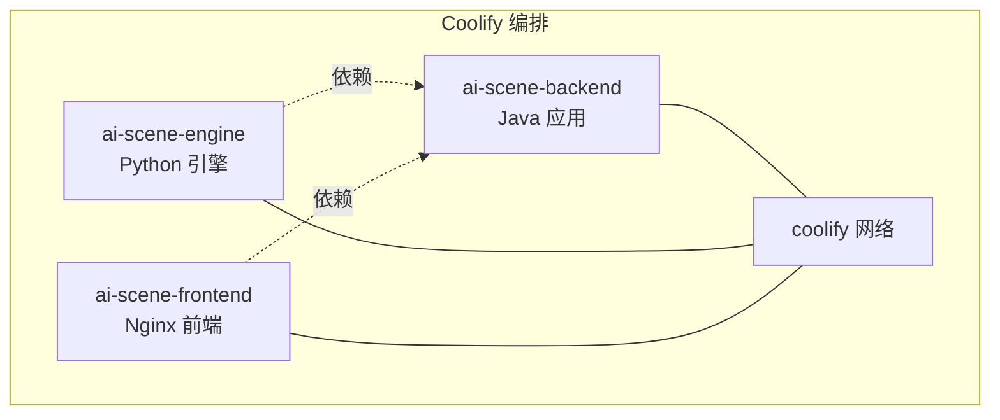
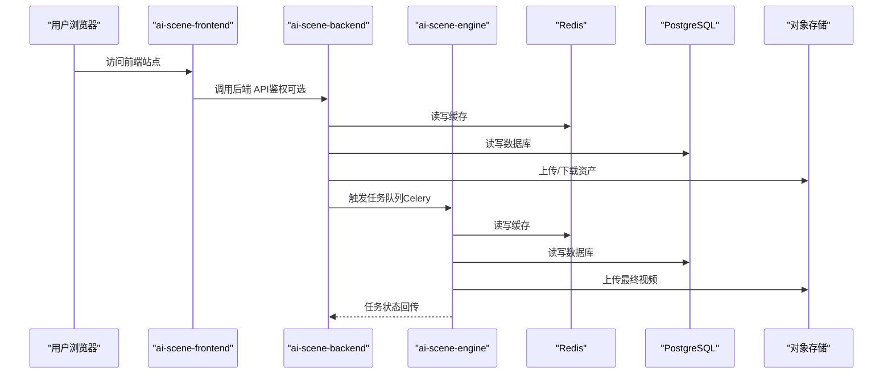
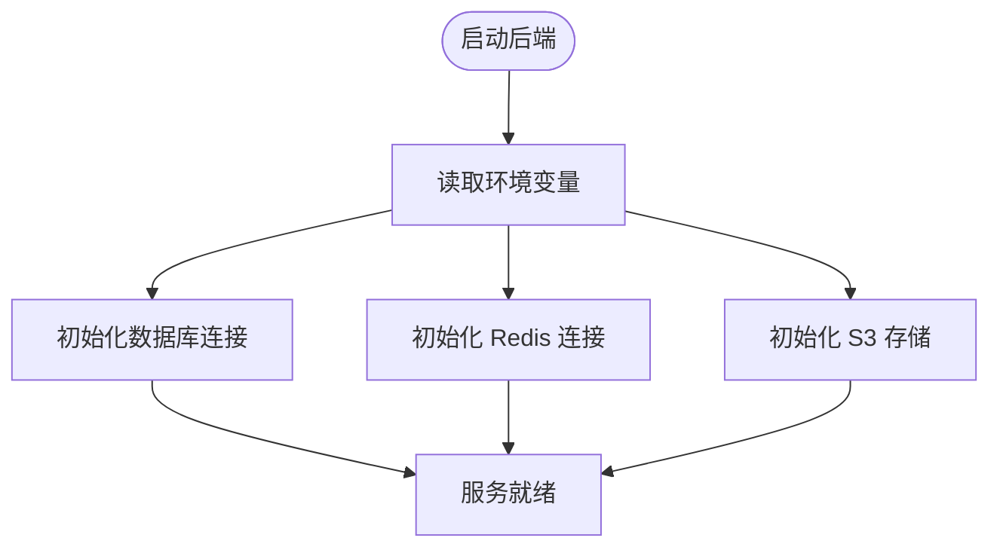
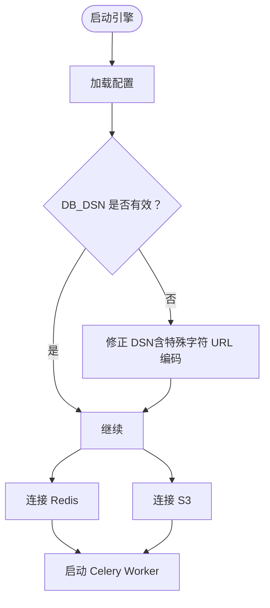
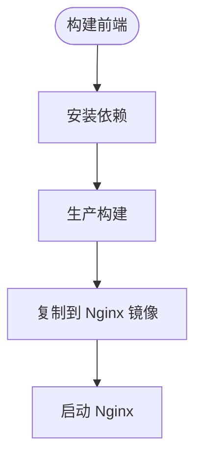
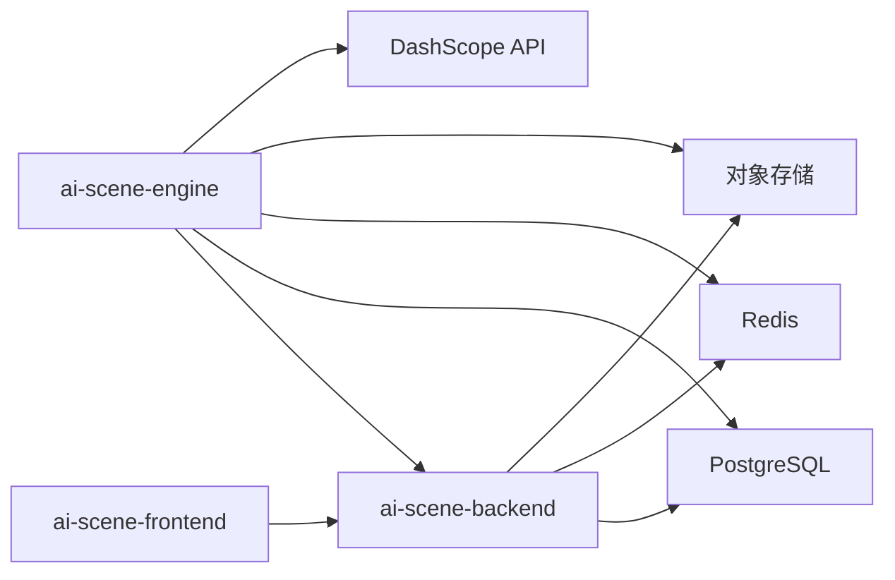

# 部署指南

<cite>
**本文引用的文件**
- [COOLIFY_DEPLOY.md](file://COOLIFY_DEPLOY.md)
- [docker-compose.coolify.yaml](file://docker-compose.coolify.yaml)
- [build.sh](file://build.sh)
- [.env.example](file://.env.example)
- [backend/src/main/resources/application.yml](file://backend/src/main/resources/application.yml)
- [engine/config.py](file://engine/config.py)
- [backend/Dockerfile](file://backend/Dockerfile)
- [engine/Dockerfile](file://engine/Dockerfile)
- [frontend/Dockerfile](file://frontend/Dockerfile)
- [integration_test.py](file://integration_test.py)
</cite>

## 目录
1. [简介](#简介)
2. [项目结构](#项目结构)
3. [核心组件](#核心组件)
4. [架构总览](#架构总览)
5. [详细组件分析](#详细组件分析)
6. [依赖关系分析](#依赖关系分析)
7. [性能考虑](#性能考虑)
8. [故障排查指南](#故障排查指南)
9. [结论](#结论)
10. [附录](#附录)

## 简介
本指南面向运维与开发团队，基于 Coolify 平台完成本项目的生产环境部署。内容围绕以下目标展开：
- 准备外部依赖（PostgreSQL、Redis、对象存储、阿里云 DashScope API Key）
- 解释 docker-compose.coolify.yaml 的结构与服务编排
- 说明三个服务（backend、engine、frontend）的构建上下文、环境变量与网络
- 列出并解释所有必需环境变量及其格式要求（重点说明 DB_DSN 的 Python 格式与特殊字符编码）
- 描述 build.sh 脚本的作用与本地构建流程
- 介绍在 Coolify 中通过 Git 仓库触发自动化构建与部署
- 提供部署后的验证步骤与常见问题排查建议

## 项目结构
本项目采用多服务分层结构，包含后端 Java 应用、Python AI 引擎与前端 Nginx 镜像，通过 docker-compose.coolify.yaml 统一编排与网络互通。

图表来源
- [docker-compose.coolify.yaml](file://docker-compose.coolify.yaml#L1-L86)

章节来源
- [docker-compose.coolify.yaml](file://docker-compose.coolify.yaml#L1-L86)

## 核心组件
- 后端服务（ai-scene-backend）
  - 基于 Maven 多阶段构建，运行于 JRE 环境，监听 8090 端口，健康检查路径为 /health
  - 通过环境变量读取数据库、Redis、S3 存储等配置
- 引擎服务（ai-scene-engine）
  - 基于 Python 3.10，安装系统依赖（OpenCV、FFmpeg），启动 Celery Worker
  - 从环境变量读取 Redis、数据库 DSN、S3、DashScope API Key 等
- 前端服务（ai-scene-frontend）
  - 基于 Node 构建产物，Nginx 提供静态资源，暴露 80 端口；Coolify 映射至宿主 3000 端口
  - 构建时通过 ARG 注入 VITE_* 环境变量

章节来源
- [docker-compose.coolify.yaml](file://docker-compose.coolify.yaml#L1-L86)
- [backend/Dockerfile](file://backend/Dockerfile#L1-L14)
- [engine/Dockerfile](file://engine/Dockerfile#L1-L18)
- [frontend/Dockerfile](file://frontend/Dockerfile#L1-L25)

## 架构总览
下图展示 Coolify 编排下的服务交互与依赖关系。

图表来源
- [docker-compose.coolify.yaml](file://docker-compose.coolify.yaml#L1-L86)
- [backend/src/main/resources/application.yml](file://backend/src/main/resources/application.yml#L1-L66)
- [engine/config.py](file://engine/config.py#L1-L46)

## 详细组件分析

### 后端服务（ai-scene-backend）
- 构建与运行
  - 多阶段构建：Maven 构建 JAR，运行阶段使用 JRE 镜像，入口为 Java 应用
  - 端口：8090；健康检查：/health
- 关键环境变量
  - 数据库：SPRING_DATASOURCE_URL、SPRING_DATASOURCE_USERNAME、SPRING_DATASOURCE_PASSWORD
  - Redis：SPRING_REDIS_URL
  - S3：S3_STORAGE_REGION、S3_STORAGE_ENDPOINT、S3_STORAGE_ACCESS_KEY、S3_STORAGE_SECRET_KEY、S3_STORAGE_BUCKET、S3_STORAGE_PUBLIC_URL
  - 开发与上传：APP_DEV_RESET_ENABLED、APP_UPLOAD_ALLOWED_CONTENT_TYPES
- 配置来源
  - Spring Boot 配置文件读取上述变量，启用 Flyway 迁移，限制上传大小，暴露健康探针

图表来源
- [backend/src/main/resources/application.yml](file://backend/src/main/resources/application.yml#L1-L66)
- [docker-compose.coolify.yaml](file://docker-compose.coolify.yaml#L1-L86)

章节来源
- [backend/Dockerfile](file://backend/Dockerfile#L1-L14)
- [backend/src/main/resources/application.yml](file://backend/src/main/resources/application.yml#L1-L66)
- [docker-compose.coolify.yaml](file://docker-compose.coolify.yaml#L1-L86)

### 引擎服务（ai-scene-engine）
- 构建与运行
  - 安装系统依赖（OpenCV、FFmpeg），安装 Python 依赖，启动 Celery Worker
- 关键环境变量
  - Redis：REDIS_URL（与后端一致）
  - 数据库：DB_DSN（Python 格式，推荐完整 DSN；若含特殊字符需 URL 编码）
  - S3：S3_STORAGE_REGION、S3_STORAGE_ENDPOINT、S3_STORAGE_ACCESS_KEY、S3_STORAGE_SECRET_KEY、S3_STORAGE_BUCKET、S3_STORAGE_PUBLIC_URL
  - DashScope：DASHSCOPE_API_KEY
  - 智能拆分：SMART_SPLIT_ENABLED、SMART_SPLIT_STRATEGY、SMART_SPLIT_MIN_DURATION_SEC
- 依赖关系
  - 依赖 ai-scene-backend（通过 depends_on）

图表来源
- [engine/config.py](file://engine/config.py#L1-L46)
- [docker-compose.coolify.yaml](file://docker-compose.coolify.yaml#L1-L86)

章节来源
- [engine/Dockerfile](file://engine/Dockerfile#L1-L18)
- [engine/config.py](file://engine/config.py#L1-L46)
- [docker-compose.coolify.yaml](file://docker-compose.coolify.yaml#L1-L86)

### 前端服务（ai-scene-frontend）
- 构建与运行
  - Node 构建产物，Nginx 提供静态资源，容器内 80 端口
  - Coolify 默认将宿主 3000 端口映射到容器 80 端口
- 关键构建参数
  - VITE_API_BASE_URL、VITE_API_KEY（通过 ARG 注入）
- 依赖关系
  - 依赖 ai-scene-backend（通过 depends_on）

图表来源
- [frontend/Dockerfile](file://frontend/Dockerfile#L1-L25)
- [docker-compose.coolify.yaml](file://docker-compose.coolify.yaml#L1-L86)

章节来源
- [frontend/Dockerfile](file://frontend/Dockerfile#L1-L25)
- [docker-compose.coolify.yaml](file://docker-compose.coolify.yaml#L1-L86)

### docker-compose.coolify.yaml 结构解析
- 版本与服务
  - 使用 3.8 版本，定义三个服务：ai-scene-backend、ai-scene-engine、ai-scene-frontend
- 构建上下文
  - backend：context=./backend，Dockerfile=./backend/Dockerfile
  - engine：context=./engine，Dockerfile=./engine/Dockerfile
  - frontend：context=./frontend，Dockerfile=./frontend/Dockerfile
- 端口映射
  - backend：8090:8090
  - frontend：3000:80（Coolify 映射）
- 环境变量
  - backend：SERVER_PORT、数据库、Redis、S3、开发与上传相关
  - engine：REDIS_URL、DB_DSN、S3、DashScope、智能拆分
  - frontend：VITE_API_BASE_URL、VITE_API_KEY（通过 ARG 注入）
- 健康检查与依赖
  - backend：健康检查 /health
  - engine：depends_on: ai-scene-backend
  - frontend：depends_on: ai-scene-backend
- 网络
  - 三者均加入 coolify 网络，且该网络被声明为外部网络

章节来源
- [docker-compose.coolify.yaml](file://docker-compose.coolify.yaml#L1-L86)

### 环境变量清单与格式要求
- 数据库（Backend 与 Engine）
  - SPRING_DATASOURCE_URL：Spring Boot JDBC URL（PostgreSQL）
  - SPRING_DATASOURCE_USERNAME：数据库用户名
  - SPRING_DATASOURCE_PASSWORD：数据库密码
  - DB_DSN：Python 格式的数据库连接字符串（推荐完整 DSN；若密码包含特殊字符，必须进行 URL 编码）
- Redis
  - SPRING_REDIS_URL：Spring Boot Redis URL（与 ENGINE 一致）
- 对象存储（S3/Cloudflare R2）
  - S3_STORAGE_REGION：区域（示例 auto）
  - S3_STORAGE_ENDPOINT：终端节点（R2 示例）
  - S3_STORAGE_ACCESS_KEY：访问密钥
  - S3_STORAGE_SECRET_KEY：密钥
  - S3_STORAGE_BUCKET：存储桶名称
  - S3_STORAGE_PUBLIC_URL：公开访问基础 URL
- AI 模型服务
  - DASHSCOPE_API_KEY：阿里云 DashScope API Key
- 前端构建参数
  - VITE_API_BASE_URL：后端 API 基础地址
  - VITE_API_KEY：可选 API Key（按需）
- 开发与上传
  - APP_DEV_RESET_ENABLED：开发重置开关
  - APP_UPLOAD_ALLOWED_CONTENT_TYPES：允许的上传类型

章节来源
- [COOLIFY_DEPLOY.md](file://COOLIFY_DEPLOY.md#L36-L74)
- [docker-compose.coolify.yaml](file://docker-compose.coolify.yaml#L1-L86)
- [backend/src/main/resources/application.yml](file://backend/src/main/resources/application.yml#L1-L66)
- [engine/config.py](file://engine/config.py#L1-L46)
- [.env.example](file://.env.example#L1-L25)

### build.sh 脚本作用
- 功能概述
  - 依次构建三个镜像：ai-scene-backend、ai-scene-engine、ai-scene-frontend
  - 使用 Docker 多阶段构建，无需本地打包 JAR
- 适用场景
  - 本地快速验证镜像构建与服务启动
  - 若需推送至私有镜像仓库，可在本地构建后再推送

章节来源
- [build.sh](file://build.sh#L1-L28)

### 在 Coolify 中通过 Git 触发自动化构建与部署
- 步骤概览
  - 将包含 docker-compose.coolify.yaml 的代码推送到远端仓库（GitHub/GitLab）
  - 在 Coolify 新建“基于 Git”的资源，选择私有/公有仓库
  - 在配置页面设置“Docker Compose Location”为 /docker-compose.coolify.yml，并选择“Docker Compose”作为 Build Pack
  - Coolify 将自动检测并构建 backend 与 engine 镜像
- 服务端口
  - backend 暴露 8090；frontend 暴露 80（Coolify 映射到宿主 3000）
- 健康检查
  - backend 配置了 /health 健康探针，Coolify 将据此判断服务可用性

章节来源
- [COOLIFY_DEPLOY.md](file://COOLIFY_DEPLOY.md#L16-L35)
- [docker-compose.coolify.yaml](file://docker-compose.coolify.yaml#L1-L86)

## 依赖关系分析
- 服务耦合
  - engine 与 frontend 均依赖 backend（通过 depends_on）
  - 三者共享 coolify 网络，实现内部通信
- 外部依赖
  - PostgreSQL：后端与引擎通过各自配置连接
  - Redis：后端与引擎共享同一实例
  - 对象存储：S3/Cloudflare R2，用于上传/下载资产
  - DashScope：用于图像/视频模型推理

图表来源
- [docker-compose.coolify.yaml](file://docker-compose.coolify.yaml#L1-L86)
- [backend/src/main/resources/application.yml](file://backend/src/main/resources/application.yml#L1-L66)
- [engine/config.py](file://engine/config.py#L1-L46)

章节来源
- [docker-compose.coolify.yaml](file://docker-compose.coolify.yaml#L1-L86)

## 性能考虑
- 数据库与缓存
  - 合理设置连接池与超时，避免并发高峰导致阻塞
  - Redis 作为缓存层，建议开启持久化策略与内存淘汰策略
- 存储与带宽
  - S3/对象存储上传/下载应考虑带宽与并发，必要时启用 CDN
- 引擎处理
  - FFmpeg 与 AI 推理对 CPU/内存消耗较大，建议为 engine 单独分配资源
- 前端静态资源
  - Nginx 已优化静态资源服务，建议开启 gzip/缓存头

## 故障排查指南
- 健康检查失败
  - 检查 backend 的 /health 探针是否可达
  - 查看 Coolify 日志标签页，定位 backend/engine 的启动错误
- 数据库连接异常
  - 确认 SPRING_DATASOURCE_URL/USERNAME/PASSWORD 正确
  - 确认 DB_DSN（Python 格式）正确，密码含特殊字符时需 URL 编码
- Redis 连接异常
  - 确认 SPRING_REDIS_URL 与 ENGINE 的 REDIS_URL 一致
- 对象存储问题
  - 确认 S3_STORAGE_ENDPOINT、ACCESS_KEY、SECRET_KEY、BUCKET、PUBLIC_URL 正确
  - 若使用 Cloudflare R2，确认 REGION 与 ENDPOINT 配置
- 前端无法访问后端
  - 确认 VITE_API_BASE_URL 指向正确的后端域名
  - 检查 Coolify 域名绑定与证书配置
- 集成测试验证
  - 使用 integration_test.py 脚本验证健康检查、创建项目、上传资产、分析、脚本生成、音频生成、渲染视频等全流程
  - 如需真实 AI 能力，可将脚本中的 dummy 文件替换为真实 MP4

章节来源
- [COOLIFY_DEPLOY.md](file://COOLIFY_DEPLOY.md#L75-L99)
- [integration_test.py](file://integration_test.py#L1-L305)

## 结论
通过 Coolify 平台，本项目可实现一键自动化构建与部署。关键在于：
- 正确准备并注入所有外部依赖与环境变量
- 明确三个服务的构建上下文、端口与网络
- 在 Coolify 中配置 Docker Compose 位置与 Build Pack
- 使用集成测试脚本进行端到端验证

## 附录
- 快速参考
  - 数据库 DSN 格式：Python 格式，推荐完整 DSN；密码含特殊字符需 URL 编码
  - Redis URL：Spring Boot 格式，与 ENGINE 保持一致
  - S3 Endpoint：Cloudflare R2 示例；如使用其他 S3 兼容服务，请按实际填写
  - DashScope API Key：阿里云 DashScope 的 API Key
  - 前端构建参数：VITE_API_BASE_URL 指向后端 API 基础地址

章节来源
- [COOLIFY_DEPLOY.md](file://COOLIFY_DEPLOY.md#L36-L74)
- [.env.example](file://.env.example#L1-L25)