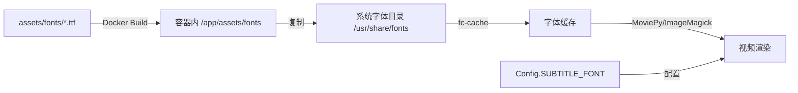

# 字体管理指南

本文档说明如何在 AI Scene to Video 项目中管理和使用自定义字体。

## 📋 目录

- [快速开始](#快速开始)
- [架构设计](#架构设计)
- [添加新字体](#添加新字体)
- [配置字体](#配置字体)
- [验证字体](#验证字体)
- [故障排查](#故障排查)

## 🚀 快速开始

### 当前可用字体

| 字体名称 | 配置Key | 文件位置 | 适用场景 |
|---------|---------|---------|----------|
| Noto Sans CJK SC Bold | `noto-sans-bold` | 系统自带 | 通用场景（默认后备） |
| 阿里巴巴普惠体 SemiBold | `alibaba-puhuiti-semibold` | `assets/fonts/` | 房产视频（默认） |

### 配置使用阿里巴巴普惠体

在 Coolify 或 `.env` 文件中设置：

```bash
# 方式 1: 使用字体 Key（推荐）
SUBTITLE_FONT_KEY=alibaba-puhuiti-semibold

# 方式 2: 直接指定字体名称
SUBTITLE_FONT=AlibabaPuHuiTi-3-75-SemiBold
```

**无需额外配置**，默认已启用阿里巴巴普惠体。

## 🏗️ 架构设计

### 字体处理流程



### 核心模块

#### 1. `engine/config.py` - 字体配置

```python
AVAILABLE_FONTS = {
    "noto-sans-bold": "Noto-Sans-CJK-SC-Bold",
    "alibaba-puhuiti-semibold": "AlibabaPuHuiTi-3-75-SemiBold",
}

# 动态选择字体（支持环境变量覆盖）
_FONT_KEY = os.getenv("SUBTITLE_FONT_KEY", "alibaba-puhuiti-semibold")
_FONT_NAME_OVERRIDE = os.getenv("SUBTITLE_FONT", "")
SUBTITLE_FONT = _FONT_NAME_OVERRIDE if _FONT_NAME_OVERRIDE else AVAILABLE_FONTS.get(_FONT_KEY, "Noto-Sans-CJK-SC-Bold")
```

#### 2. `engine/font_manager.py` - 字体管理工具

提供字体发现、验证和管理功能：

```python
from font_manager import FontManager

# 列出所有可用字体
fonts = FontManager.list_available_fonts()

# 验证字体是否可用
is_valid = FontManager.validate_font('AlibabaPuHuiTi-3-75-SemiBold')

# 搜索特定字体
alibaba_fonts = FontManager.search_font('alibaba')

# 打印完整字体状态
FontManager.log_font_status()
```

#### 3. `engine/Dockerfile` - 字体打包

```dockerfile
# 复制自定义字体到容器
COPY ../assets/fonts /app/assets/fonts

# 注册到系统字体
RUN mkdir -p /usr/share/fonts/truetype/custom && \
    cp /app/assets/fonts/*.ttf /usr/share/fonts/truetype/custom/ && \
    fc-cache -f -v
```

## ➕ 添加新字体

### 步骤 1: 准备字体文件

将字体文件放到 `assets/fonts/` 目录：

```bash
# 示例：添加思源黑体
cp SourceHanSansCN-Bold.ttf assets/fonts/
```

**字体要求**：
- ✅ 格式：TrueType (`.ttf`) 或 OpenType (`.otf`)
- ✅ 编码：支持中文字符（Unicode）
- ✅ 授权：确保拥有商用授权
- ⚠️ 大小：建议单个文件 < 20MB

### 步骤 2: 注册字体

编辑 `engine/config.py`，添加到 `AVAILABLE_FONTS`：

```python
AVAILABLE_FONTS = {
    "noto-sans-bold": "Noto-Sans-CJK-SC-Bold",
    "alibaba-puhuiti-semibold": "AlibabaPuHuiTi-3-75-SemiBold",
    "source-han-sans-bold": "Source-Han-Sans-CN-Bold",  # 新增
}
```

**获取字体 Family Name**：

```bash
# 方式 1: 使用 fc-scan
fc-scan assets/fonts/yourfont.ttf | grep family

# 方式 2: 在容器中查看
docker exec engine fc-list | grep -i "your-font-keyword"
```

### 步骤 3: 重新构建镜像

```bash
# 本地测试
docker compose -f docker-compose.coolify.yaml build engine
docker compose -f docker-compose.coolify.yaml up -d

# 生产部署：推送代码触发 CI/CD
git add assets/fonts/ engine/config.py
git commit -m "feat: add Source Han Sans font"
git push
```

### 步骤 4: 配置使用

在 Coolify 环境变量中设置：

```bash
SUBTITLE_FONT_KEY=source-han-sans-bold
```

或在 `.env` 中设置：

```bash
SUBTITLE_FONT_KEY=source-han-sans-bold
```

## ⚙️ 配置字体

### 配置优先级

1. **环境变量 `SUBTITLE_FONT`**（直接指定字体名称）- 最高优先级
2. **环境变量 `SUBTITLE_FONT_KEY`**（使用字体 Key）- 推荐方式
3. **Config 默认值**（代码中硬编码）- 后备方案

### 配置示例

#### Coolify 环境变量配置

```bash
# 在 Coolify 控制台 > Environment Variables 中添加

# 推荐方式：使用字体 Key
SUBTITLE_FONT_KEY=alibaba-puhuiti-semibold

# 高级用法：直接指定字体名称（跳过 Key 映射）
SUBTITLE_FONT=AlibabaPuHuiTi-3-75-SemiBold

# 其他字幕配置
SUBTITLE_ENABLED=true
SUBTITLE_FONT_SIZE=48
SUBTITLE_POSITION=0.75
SUBTITLE_STYLE=default
```

#### 本地开发 `.env` 配置

```bash
# .env 文件
SUBTITLE_FONT_KEY=alibaba-puhuiti-semibold
SUBTITLE_FONT_SIZE=52  # 稍大字号
SUBTITLE_STYLE=elegant  # 优雅风格
```

### 字幕样式选项

| 样式 | 效果 | 适用场景 |
|------|------|----------|
| `default` | 标准字幕，白色文字、黑色描边 | 通用场景 |
| `elegant` | 优雅字幕，米色文字、金色描边 | 高端住宅 |
| `bold` | 粗体字幕，大字号、粗描边 | 强调重点 |

## ✅ 验证字体

### 方式 1: 使用验证脚本（推荐）

```bash
# 启动容器后运行
./scripts/verify_fonts.sh

# 或指定容器名称
./scripts/verify_fonts.sh ai-scene-engine
```

**输出示例**：

```
=== Font Verification Tool ===
Container: ai-scene-engine

✓ Container is running

📁 Checking custom fonts directory...
✓ /app/assets/fonts exists
Font files:
  - AlibabaPuHuiTi-3-75-SemiBold.ttf (37MB)

📁 Checking system fonts directory...
✓ /usr/share/fonts/truetype/custom exists
Registered fonts:
  - AlibabaPuHuiTi-3-75-SemiBold.ttf (37MB)

🔍 Searching for custom fonts in fc-list...
AlibabaPuHuiTi 3:style=75 SemiBold

🐍 Testing font with Python FontManager...
Configured font: AlibabaPuHuiTi-3-75-SemiBold
Font key: alibaba-puhuiti-semibold
Font validation: ✓ Available

🎬 Testing subtitle rendering...
✓ Subtitle rendering successful
  Text: 测试字幕 Test Subtitle
  Font: AlibabaPuHuiTi-3-75-SemiBold
  Output: 15234 bytes
```

### 方式 2: 查看启动日志

Engine Worker 启动时会自动打印字体状态：

```bash
docker logs ai-scene-engine | grep -A 20 "Font Manager Status"
```

**输出示例**：

```json
{
  "timestamp": "2026-01-14T09:30:00.000Z",
  "level": "INFO",
  "service": "ai-scene-engine",
  "message": "=== Font Manager Status ==="
}
{
  "timestamp": "2026-01-14T09:30:00.100Z",
  "level": "INFO",
  "service": "ai-scene-engine",
  "message": "Custom fonts directory: /app/assets/fonts"
}
{
  "timestamp": "2026-01-14T09:30:00.200Z",
  "level": "INFO",
  "service": "ai-scene-engine",
  "message": "Custom font files found: 1"
}
{
  "timestamp": "2026-01-14T09:30:00.300Z",
  "level": "INFO",
  "service": "ai-scene-engine",
  "message": "  - AlibabaPuHuiTi-3-75-SemiBold.ttf -> /app/assets/fonts/AlibabaPuHuiTi-3-75-SemiBold.ttf"
}
{
  "timestamp": "2026-01-14T09:30:00.400Z",
  "level": "INFO",
  "service": "ai-scene-engine",
  "message": "Configured font 'AlibabaPuHuiTi-3-75-SemiBold': ✓ Available"
}
```

### 方式 3: 手动验证

进入容器手动检查：

```bash
# 进入容器
docker exec -it ai-scene-engine bash

# 列出所有字体
fc-list | head -20

# 搜索特定字体
fc-list | grep -i "alibaba\|puhuiti"

# 使用 Python 验证
python3 -c "
from font_manager import FontManager
from config import Config
print(f'Configured: {Config.SUBTITLE_FONT}')
print(f'Valid: {FontManager.validate_font(Config.SUBTITLE_FONT)}')
"
```

## 🔧 故障排查

### 问题 1: 字体文件找不到

**症状**：

```
❌ Custom font directory not found: /app/assets/fonts
```

**原因**：
- Dockerfile 未正确复制字体文件
- 构建时 `assets/fonts/` 目录不存在

**解决方案**：

```bash
# 1. 检查本地文件
ls -la assets/fonts/

# 2. 检查 Dockerfile COPY 命令
grep "COPY.*assets/fonts" engine/Dockerfile

# 3. 重新构建镜像（清除缓存）
docker compose build --no-cache engine
```

### 问题 2: 字体未注册到系统

**症状**：

```
❌ No Alibaba PuHuiTi fonts found
Font validation: ✗ Not Found
```

**原因**：
- 字体未复制到系统字体目录
- `fc-cache` 未执行或失败

**解决方案**：

```bash
# 进入容器
docker exec -it ai-scene-engine bash

# 手动复制字体
cp /app/assets/fonts/*.ttf /usr/share/fonts/truetype/custom/

# 重建字体缓存
fc-cache -f -v

# 验证
fc-list | grep -i "alibaba"
```

### 问题 3: 字体无法渲染中文

**症状**：
- 字幕显示为乱码或方框
- MoviePy 报错 "Font not found"

**原因**：
- 字体不包含中文字符集
- ImageMagick 权限策略限制

**解决方案**：

1. **检查字体是否支持中文**：

```bash
# 查看字体支持的语言
fc-list :lang=zh | grep "Your-Font-Name"
```

2. **检查 ImageMagick 配置**：

```bash
# 查看策略文件
cat /etc/ImageMagick-*/policy.xml | grep -A 2 "TEXT\|LABEL"

# 应该包含：
# <policy domain="coder" rights="read|write" pattern="TEXT" />
# <policy domain="coder" rights="read|write" pattern="LABEL" />
```

3. **使用支持中文的字体**：

推荐字体（确保支持中文）：
- Noto Sans CJK SC（系统自带）✅
- 阿里巴巴普惠体 ✅
- 思源黑体 ✅
- 思源宋体 ✅

### 问题 4: 字体在 MoviePy 中报错

**症状**：

```python
OSError: cannot open resource
RuntimeError: ImageMagick command failed
```

**解决方案**：

1. **验证 ImageMagick 配置**：

```bash
# 检查 MoviePy 是否找到 ImageMagick
python3 -c "
from moviepy.config import get_setting
print(get_setting('IMAGEMAGICK_BINARY'))
"
```

2. **手动测试 ImageMagick**：

```bash
# 测试文本渲染
convert -list font | grep -i "alibaba"
convert -font AlibabaPuHuiTi-3-75-SemiBold -pointsize 48 label:"测试" test.png
```

3. **查看详细错误日志**：

```python
import logging
logging.basicConfig(level=logging.DEBUG)
# 运行 MoviePy TextClip
```

### 问题 5: 镜像体积过大

**症状**：
- Docker 镜像超过 2GB
- 部署耗时过长

**原因**：
- 字体文件过大（完整字符集）

**解决方案**：

使用字体子集化工具裁剪：

```bash
# 安装 fonttools
pip install fonttools brotli

# 生成中文子集（仅保留常用汉字）
pyftsubset AlibabaPuHuiTi-3-75-SemiBold.ttf \
  --output-file=AlibabaPuHuiTi-3-75-SemiBold-CN.ttf \
  --text-file=常用汉字3500.txt \
  --layout-features='*' \
  --flavor=woff2

# 常用汉字列表可从国标 GB2312 获取
```

## 📚 参考资源

### 字体资源

- [Google Fonts](https://fonts.google.com/) - 大量开源字体
- [思源字体（Adobe）](https://github.com/adobe-fonts) - 开源 CJK 字体家族
- [阿里巴巴普惠体](https://www.alibabafonts.com/) - 免费商用字体
- [站酷字体](https://www.zcool.com.cn/special/zcoolfonts/) - 站酷免费字体

### 工具

- [fonttools](https://github.com/fonttools/fonttools) - 字体处理工具
- [Font Squirrel Webfont Generator](https://www.fontsquirrel.com/tools/webfont-generator) - 字体优化工具

### 文档

- [MoviePy TextClip 文档](https://zulko.github.io/moviepy/ref/VideoClip/VideoClip.html#textclip)
- [ImageMagick 字体配置](https://imagemagick.org/script/resources.php)
- [Fontconfig 用户手册](https://www.freedesktop.org/software/fontconfig/fontconfig-user.html)

## 📝 版权声明

使用字体时请遵守字体授权协议：

- ✅ **阿里巴巴普惠体**：允许商用（遵循《普惠体用户协议》）
- ✅ **思源字体系列**：开源许可（SIL Open Font License）
- ⚠️ **商业字体**：需购买商用授权

**建议**：在使用第三方字体前，务必仔细阅读其授权协议，确保符合商用要求。

---

**维护者**: AI Scene to Video Team  
**最后更新**: 2026-01-14  
**版本**: v1.0
